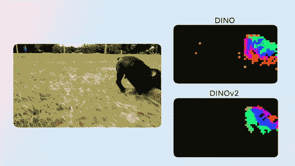
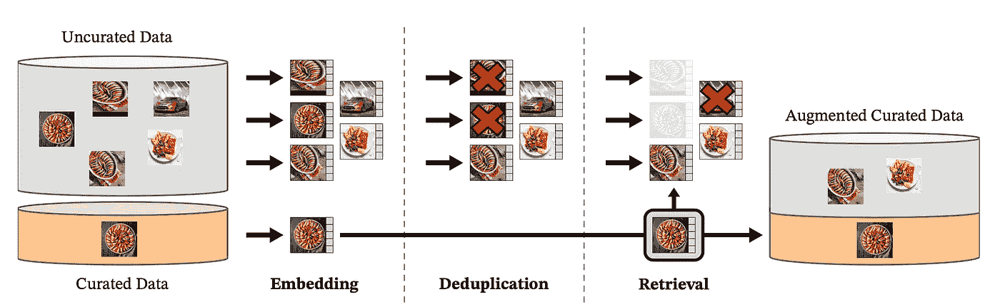
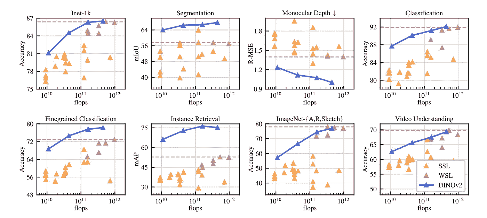
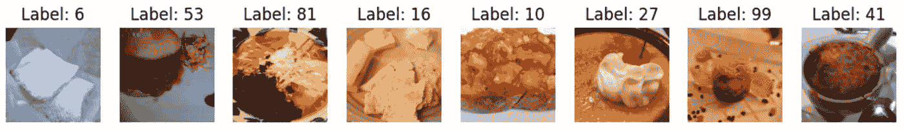
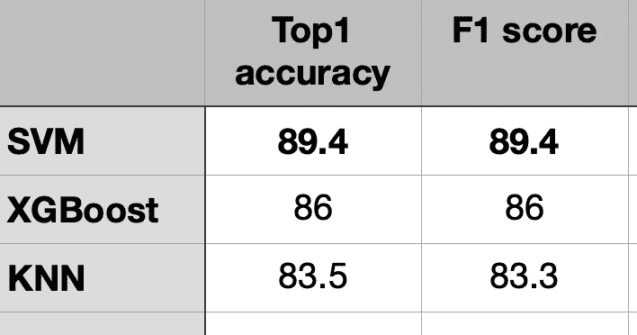

# Meta AI 的另一个革命性大规模模型——DINOv2 用于图像特征提取。

> 原文：[`towardsdatascience.com/meta-ais-another-revolutionary-large-scale-model-dinov2-for-image-feature-extraction-1114b287eadd`](https://towardsdatascience.com/meta-ais-another-revolutionary-large-scale-model-dinov2-for-image-feature-extraction-1114b287eadd)

## DINOv2 是一种出色的自监督 ViT 基于深度学习模型，用于图像特征提取。

[](https://medium.com/@gkeretchashvili?source=post_page-----1114b287eadd--------------------------------)[](https://towardsdatascience.com/?source=post_page-----1114b287eadd--------------------------------) [Gurami Keretchashvili](https://medium.com/@gkeretchashvili?source=post_page-----1114b287eadd--------------------------------)

·发表于 [Towards Data Science](https://towardsdatascience.com/?source=post_page-----1114b287eadd--------------------------------) ·阅读时间 8 分钟·2023 年 6 月 26 日

--

# 介绍

Meta AI 介绍了图像特征提取模型的新版本 DINOv2，该模型自动从图像中提取视觉特征。这是 AI 领域，特别是在计算机视觉领域的数据和模型扩展方面的又一步革命性进展。



DINOv2 的演示由 ai.facebook.com 提供

# 动机——我们为什么要关注？

DINOv2 是一个自监督模型，无需微调且性能良好。此外，它还可以作为许多计算机视觉任务的主干网络，例如：

+   分类，细粒度分类——例如猫与狗，或例如狗品种识别

+   图像检索——例如，从互联网上大量图像中找到与您的包相似的图像。

+   语义图像分割——为图像中的每一个像素关联标签或类别。

+   视频理解——自动识别和解释视频的各种方面，如对象、动作、事件、场景，甚至更高级的概念。

+   单目深度估计——预测图像中一个物体是位于前景还是背景。

+   图像聚类——将图像分组到簇中，使得同一簇中的图像彼此相似

+   基于内容的推荐系统——根据图像的表示向用户推荐项目。

DINOv2 补充了另一项近期计算机视觉研究，包括 Segment Anything。Segment Anything 是一个可提示的分割系统，专注于对多样化的分割任务进行零-shot 泛化。

你可以查看我之前的帖子中的 Segment Anything Model (SAM)。

[](/meta-ai-introduces-revolutionary-image-segmentation-model-trained-on-1-billion-masks-8f13c86a13a2?source=post_page-----1114b287eadd--------------------------------) ## Meta AI 推出基于 10 亿个掩膜训练的革命性图像分割模型

### Segment Anything Model (SAM) - 最佳深度学习图像分割模型

towardsdatascience.com

# 方法论

[论文](https://arxiv.org/pdf/2304.07193.pdf)的主要贡献可以是以下几点：

+   创建一个大型整理的训练数据集

+   改进训练算法和实现

+   设计一个功能性的蒸馏管道。

## 创建一个大型整理的训练数据集

大型深度学习模型需要大量的数据进行训练。这就是为什么作者创建了一个自动化流程，如下图所示，以获取整理的训练数据集。



整理图像创建的工作流程 [1]

他们从大约 25 个第三方数据集中选择了一组种子图像，并且他们的目标是增强这些种子图像。其工作原理如下。他们从互联网上抓取了大量未经整理的图像（约 12 亿张独特图像）。之后，他们使用在 ImageNet-22k 上预训练的自监督 ViT-H/16 网络创建了图像嵌入。其次，他们使用余弦相似度作为图像间的距离度量，以过滤重复图像，从而减少冗余并增加多样性。在从大规模未整理数据集中移除重复图像后，他们进行了图像检索阶段，其中提取了与整理图像相似的图像。最终，这种方法使他们能够从 12 亿张未整理的图像数据库中创建出 1.42 亿张整理图像。

## 改进的训练算法

DINOv2 使用了学生-教师机制，这是一种训练技术，其中一个较小的神经网络（称为学生）学习模仿一个较大或更复杂的神经网络（称为教师）的行为。学生和教师基于视觉变换器架构（ViT）[2]。至于损失函数，他们使用交叉熵损失来计算学生-教师特征的相似性。为了学习图像的局部和全局特征，他们使用了不同层次的学习。对于全局学习，他们使用的是图像层次学习——对同一图像进行随机裁剪数据增强。至于局部特征学习，他们使用了补丁层次学习——随机对输入补丁应用遮罩，仅对学生应用，不对教师应用。此外，他们还进行了不同的归一化技术，如 Sinkhorn-knop 批归一化等。更多细节可以在论文中找到。

## 蒸馏管道。

使用大型模型进行预测（推理）时需要强大的硬件。为了克服这一限制，他们还将大型模型压缩为较小的模型。知识蒸馏 [5] 旨在通过最小化一组给定输入的两个输出之间的距离来用较小的模型重现大型模型的输出。训练算法基于自蒸馏，使得将大型模型压缩为较小模型变得简单。

# 结果

他们在八个不同的计算机视觉任务上评估了模型性能，并与其他方法进行了比较。

在下面的图表中，DINOv2 模型的结果为深蓝色，其他自监督方法为浅橙色，弱监督方法则用深粉色突出显示。虚线水平线表示表现最佳的弱监督模型。

结果表明，DINOv2 模型在自监督学习领域大幅超越了之前的最先进技术，达到了与弱监督特征相当的性能。



DINOv2 与其他 SOTA 模型 [1]

# 结论

总之，DINOv2 是 Meta AI 团队推出的另一个革命性模型。它无需微调，可以作为许多不同计算机视觉模型的基础。DINOv2 使用自监督机制，能够从任何图像集合中学习。

# DINOv2 演示 — 细粒度图像分类

在这一部分，我将尝试展示 DINOv2 在实际场景中的工作原理。我将创建一个细粒度图像分类任务。

## 分类工作流程：

+   从 PyTorch 数据集中下载 Food101 数据集。

+   使用小型 DINOv2 从训练和测试数据集中提取特征

+   使用从训练数据集中提取的特征训练机器学习分类模型（SVM、XGBoost 和 KNN）。

+   对测试数据集提取的特征进行预测。

+   评估每个机器学习模型的准确率和 F1 分数。

**数据**：[Food 101](https://pytorch.org/vision/stable/generated/torchvision.datasets.Food101.html) 是一个具有挑战性的 101 个食品类别的数据集，共有 101,000 张图像。每个类别提供 250 张手动审核的测试图像以及 750 张训练图像。

**模型**：小型 [DINOv2 模型](https://github.com/facebookresearch/dinov2)（ViT-S/14 蒸馏版）

**机器学习模型**：SVM、XGBoost、KNN。

**步骤 1 — 设置（你可以使用** [**Google Colab**](http://colab.research.google.com) **来运行代码并开启 GPU）**

```py
import torch
import numpy as np
import torchvision
from torchvision import transforms
from torch.utils.data import Subset, DataLoader
import matplotlib.pyplot as plt
import time
import os
import random
from tqdm import tqdm

from xgboost import XGBClassifier
from sklearn.svm import SVC
from sklearn.neighbors import KNeighborsClassifier
from sklearn.metrics import accuracy_score, f1_score
import pandas as pd

def set_seed(no):
    torch.manual_seed(no)
    random.seed(no)
    np.random.seed(no)
    os.environ['PYTHONHASHSEED'] = str()
    torch.backends.cudnn.benchmark = False
    torch.backends.cudnn.deterministic = True

set_seed(100)
```

**步骤 2 — 创建转换，下载并创建 Food101 Pytorch 数据集，创建训练和测试数据加载器对象。**

```py
batch_size = 8

transformation = transforms.Compose([
        transforms.Resize(256),
        transforms.CenterCrop(224),
        transforms.ToTensor(),
        transforms.Normalize([0.485, 0.456, 0.406], [0.229, 0.224, 0.225])
    ])

trainset = torchvision.datasets.Food101(root='./data', split='train',
                                        download=True, transform=transformation)

testset = torchvision.datasets.Food101(root='./data', split='test',
                                       download=True, transform=transformation)

# train_indices = random.sample(range(len(trainset)), 20000)
# test_indices = random.sample(range(len(testset)), 5000)

# trainset = Subset(trainset, train_indices)
# testset  = Subset(testset, test_indices)

trainloader = torch.utils.data.DataLoader(trainset, batch_size=batch_size,
                                          shuffle=True)

testloader = torch.utils.data.DataLoader(testset, batch_size=batch_size,
                                         shuffle=False)

classes = trainset.classes

print(len(trainset), len(testset))
print(len(trainloader), len(testloader))
```

[输出] 75750 25250

[输出] 9469 3157

**步骤 3（可选） — 可视化训练数据加载器批次**

```py
# Get a batch of images
dataiter = iter(trainloader)
images, labels = next(dataiter)

# Plot the images
fig, axes = plt.subplots(1, len(images),figsize=(12,12))
for i, ax in enumerate(axes):
    # Convert the tensor image to numpy format
    image = images[i].numpy()
    image = image.transpose((1, 2, 0))  # Transpose to (height, width, channels)

    # Normalize the image
    mean = [0.485, 0.456, 0.406]
    std = [0.229, 0.224, 0.225]
    normalized_image = (image * std) + mean
    # Display the image
    ax.imshow(normalized_image)
    ax.axis('off')
    ax.set_title(f'Label: {labels[i]}')

# Show the plot
plt.show()
```



批量图像

**步骤 4 — 加载小型 DINOv2 模型并从训练和测试数据加载器中提取特征。**

```py
device = torch.device("cuda:0" if torch.cuda.is_available() else "cpu")
dinov2_vits14 = torch.hub.load('facebookresearch/dinov2', 'dinov2_vits14').to(device)

#training
train_embeddings = []
train_labels = []

dinov2_vits14.eval()
with torch.no_grad():
  for data, labels in tqdm(trainloader):
    image_embeddings_batch = dinov2_vits14(data.to(device))

    train_embeddings.append(image_embeddings_batch.detach().cpu().numpy())
    train_labels.append(labels.detach().cpu().numpy())

#testing
test_embeddings = []
test_labels = []

dinov2_vits14.eval()
with torch.no_grad():
  for data, labels in tqdm(testloader):
    image_embeddings_batch = dinov2_vits14(data.to(device))

    test_embeddings.append(image_embeddings_batch.detach().cpu().numpy())
    test_labels.append(labels.detach().cpu().numpy())

#concatinate result
train_embeddings_f = np.vstack(train_embeddings)
train_labels_f = np.concatenate(train_labels).flatten()

test_embeddings_f = np.vstack(test_embeddings)
test_labels_f = np.concatenate(test_labels).flatten()

train_embeddings_f.shape, train_labels_f.shape, test_embeddings_f.shape, test_labels_f.shape
```

[输出] ((75750, 384), (75750,), (25250, 384), (25250,))

**步骤 5 — 为 SVM、XGBoost 和 KNN 分类器构建一个函数。**

```py
def evaluate_classifiers(X_train, y_train, X_test, y_test):
    # Support Vector Machine (SVM)
    svm_classifier = SVC()
    svm_classifier.fit(X_train, y_train)
    svm_predictions = svm_classifier.predict(X_test)

    # XGBoost Classifier
    xgb_classifier = XGBClassifier(tree_method='gpu_hist')
    xgb_classifier.fit(X_train, y_train)
    xgb_predictions = xgb_classifier.predict(X_test)

    # K-Nearest Neighbors (KNN) Classifier
    knn_classifier = KNeighborsClassifier()
    knn_classifier.fit(X_train, y_train)
    knn_predictions = knn_classifier.predict(X_test)

    # Calculating Top-1
    top1_svm = accuracy_score(y_test, svm_predictions)
    top1_xgb = accuracy_score(y_test, xgb_predictions)
    top1_knn = accuracy_score(y_test, knn_predictions)

    # Calculating F1 Score
    f1_svm = f1_score(y_test, svm_predictions, average='weighted')
    f1_xgb = f1_score(y_test, xgb_predictions, average='weighted')
    f1_knn = f1_score(y_test, knn_predictions, average='weighted')

    return pd.DataFrame({
        'SVM': {'Top-1 Accuracy': top1_svm, 'F1 Score': f1_svm},
        'XGBoost': {'Top-1 Accuracy': top1_xgb,'F1 Score': f1_xgb},
        'KNN': {'Top-1 Accuracy': top1_knn, 'F1 Score': f1_knn}
    })

X_train = train_embeddings_f  # Training data features
y_train = train_labels_f  # Training data labels
X_test = test_embeddings_f   # Test data features
y_test = test_labels_f   # Test data labels

results = evaluate_classifiers(X_train, y_train, X_test, y_test)
print(results)
```

## **结果**



小型 DINOv2 + SVM/XGBoost/KNN 的结果（图片由作者提供）

哇，结果真棒！正如展示的那样，基于小型 DINOv2 提取特征训练的 SVM 模型优于其他机器学习模型，达到了近 90%的准确率。

# 结论

尽管我们使用了小型 DINOv2 模型提取特征，但在提取特征上训练的机器学习模型（尤其是 SVM）在细粒度分类任务上表现出色。该模型能够在 101 个不同类别中以接近 90%的准确率进行分类。

如果使用大型、超大或巨型 DINOv2 模型，准确率会提高。你只需在第 4 步将*dinov2_vits14*替换为*dinov2_vitb14*、*dinov2_vitl14*或*dinov2_vitg14*。你可以尝试一下，欢迎在评论区分享准确率结果 :)

希望你喜欢这篇文章。如果你有任何问题或想分享对这篇文章的看法，请随时评论，我将很高兴回答。

如果你想直接支持我的工作，并且获得 Medium 文章的无限访问权限，请使用我的[推荐链接](https://medium.com/@gkeretchashvili/membership)成为 Medium 会员。非常感谢，祝你有美好的一天！

[](https://medium.com/@gkeretchashvili/membership?source=post_page-----1114b287eadd--------------------------------) [## 使用我的推荐链接加入 Medium - Gurami Keretchashvili

### 作为 Medium 会员，你的一部分会员费用会分配给你阅读的作者，你可以完全访问每一篇故事……

medium.com](https://medium.com/@gkeretchashvili/membership?source=post_page-----1114b287eadd--------------------------------)

# 参考文献

[1] Oquab, M., Darcet, T., Moutakanni, T., Vo, H., Szafraniec, M., Khalidov, V., … & Bojanowski, P. (2023). Dinov2: 在没有监督的情况下学习稳健的视觉特征。*arXiv 预印本 arXiv:2304.07193*。

[2] Dosovitskiy, A., Beyer, L., Kolesnikov, A., Weissenborn, D., Zhai, X., Unterthiner, T., … & Houlsby, N. (2020). 一张图片值 16x16 个词：用于大规模图像识别的 Transformers。*arXiv 预印本 arXiv:2010.11929*。

[3] DINOv2 团队，[DINOv2: 具有自监督学习的最先进计算机视觉模型](https://ai.facebook.com/blog/dino-v2-computer-vision-self-supervised-learning/)

[4] [DINOv2 Github](https://github.com/facebookresearch/dinov2)

[5] Hinton, G., Vinyals, O., & Dean, J. (2015). 提炼神经网络中的知识。*arXiv 预印本 arXiv:1503.02531*。
