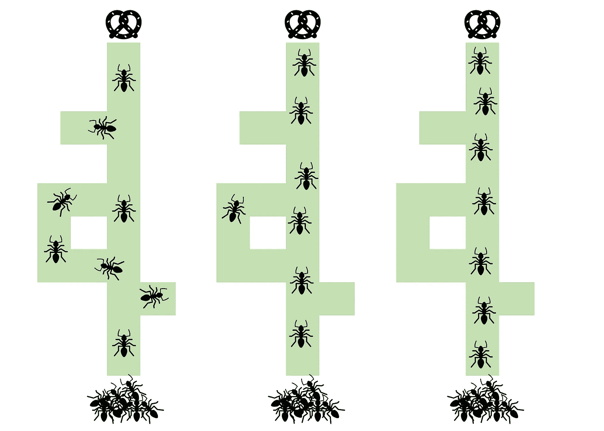

# 元启发式方法解析：蚁群优化

> 原文：[`towardsdatascience.com/meta-heuristics-explained-ant-colony-optimization-d016fe925108`](https://towardsdatascience.com/meta-heuristics-explained-ant-colony-optimization-d016fe925108)


跟随信息素路径的蚂蚁。图像由作者使用 Dall·E 创建。

## 关于一种较少为人知的启发式算法，它基于蚂蚁的行为

[](https://hennie-de-harder.medium.com/?source=post_page-----d016fe925108--------------------------------)[](https://towardsdatascience.com/?source=post_page-----d016fe925108--------------------------------) [Hennie de Harder](https://hennie-de-harder.medium.com/?source=post_page-----d016fe925108--------------------------------)

·发表于 [Towards Data Science](https://towardsdatascience.com/?source=post_page-----d016fe925108--------------------------------) ·阅读时长 7 分钟·2023 年 9 月 4 日

--

**在优化算法的世界里，有许多方法灵感来自自然界的奇观。从基于进化的遗传算法到模拟退火的降温策略，这些算法在解决复杂问题上已证明其有效性。然而，在这个自然启发算法的多样化景观中，隐藏着一颗鲜为人知的宝石——蚁群优化。我们将深入探讨这种启发式算法，它汲取了蚂蚁巧妙觅食行为的灵感。**

蚁群优化（ACO）是一个有趣的算法，核心部分出乎意料的简单。在这篇文章中，你将学习基础知识并理解算法背后的主要思想。在接下来的文章中，我们将编写代码，并使用它来解决几个现实世界的问题。让我们开始吧！

# 使用蚂蚁解决优化问题

如你所知，ACO（蚁群优化）受蚂蚁行为的启发。该算法模拟蚂蚁寻找食物和相互沟通的方式，以找到它们巢穴和食物源之间的最短路径。你可以使用该算法来寻找[图](https://optimizing-connections-mathematical-optimization-within-graphs-7364e082a984)中的良好路径，或用于解决分配类问题。

ACO 中使用了一群人工蚂蚁。它们通过逐步构建解决方案来探索解决方案空间。每只蚂蚁通过基于*概率分布*选择下一个组件来构建解决方案。该概率分布受到*组件质量*（例如路径长度）和*其他蚂蚁留下的信息素轨迹*的影响。信息素轨迹代表了蚂蚁之间的一种通信形式，使它们能够跟随过去成功的路径。

在算法开始时，每个组件上的信息素轨迹被初始化为一个较小的值。当蚂蚁构建解决方案时，它们在使用的组件上沉积信息素。沉积的信息素量与解决方案的质量成正比。作为良好解决方案一部分的组件会被更多的信息素强化，使其对其他蚂蚁更具吸引力。

随着时间的推移，较少吸引人的组件上的信息素轨迹会蒸发，从而降低它们的吸引力，并鼓励探索解决方案空间的其他部分。通过这种方式，算法通过利用搜索空间中最有前景的区域，同时也探索新的区域，从而收敛到一个好的解决方案。



ACO 可视化：蚂蚁从巢穴出发寻找食物。开始时它们会探索所有轨迹，但很快它们会发现最快的路径，并避免长而死胡同的轨迹。图像由作者提供。

> 注意：现实世界中的蚂蚁在跟随信息素轨迹时可能会迷路，例如当信息素轨迹[消失了](https://www.youtube.com/watch?v=vsWsQLJAbMk)时，或者当轨迹意外地形成了一个[圈](https://www.youtube.com/watch?v=LEKwQxO4EZU)时。

# 超参数

超参数用于控制算法的行为。以下是 ACO 的关键超参数：

## 迭代次数

这是蚂蚁在算法终止之前构建解决方案的次数。你也可以使用其他终止标准，例如当解决方案在一段时间内没有改进时，你可以决定停止运行。或者你可以设置时间限制。

## **蚂蚁数量**

每次迭代中使用的人工蚂蚁数量。更多的蚂蚁可以更好地探索搜索空间，但也会增加计算时间。

## **信息素蒸发率（rho）**

该参数控制信息素从轨迹中蒸发的速率，取值范围在 0 到 1 之间。较高的衰减率可以鼓励更多地探索搜索空间，而较低的衰减率可以导致更多地利用好的解决方案。

## 初始信息素水平（tau）

该值对应于轨迹上的初始信息素量。较高的初始信息素水平可以鼓励更多地利用好的解决方案，而较低的初始信息素水平可以鼓励更多地探索搜索空间。你可以使用特定的 tau 值来创建一个温暖的起始。

## **信息素的重要性** **(alpha)**

Alpha (≥ 0) 确定信息素水平 (tau) 在选择下一个图组件中的影响。如果值较高，算法对搜索空间的变化更敏感，而较低的值有助于防止过早收敛。

## 成本的重要性 (beta)

Beta (≥ 0) 与 alpha 可比。它不是确定信息素水平的影响，而是确定成本 (eta) 对选择下一个图组件的影响。更多内容在下一节中介绍。

超参数的选择将取决于具体问题和可用的计算资源。需要通过实验不同的超参数设置，以找到适合特定问题的最佳组合。

# 伪代码

以下是算法的伪代码：

```py
initialize 
    problem details
        graph
        eta = cost per edge
    hyperparameters 
        n_iterations
        n_ants
        alpha = pheromone importance
        beta = cost importance
        rho = pheromone evaporation rate
        tau = pheromone initialization

for it in n_iterations
    x_best, y_best = [], inf
    calculate edge attractiveness
    update tau (pheromone levels)
    for ant in n_ants
        x_best, y_best = find ant trail
return x_best
```

首先，你需要用问题的详细信息和超参数初始化算法。实际的算法包括几个重要的步骤：

## 计算边的吸引力

这决定了某条边对蚂蚁的吸引力。它取决于 tau（每条边的信息素水平）、eta（每条边的成本）、alpha（信息素的重要性）和 beta（成本的重要性）。

让我们称矩阵的边的吸引力为 `A`。边 `(i, j)` 的更新规则如下：

```py
A[(i, j)] = tau[(i, j)]^alpha * eta[(i, j)]^beta
```

例如，如果你将 beta 设置为 5，将 alpha 设置为 1，那么边的吸引力将更受成本的影响，而不是信息素水平的影响。

## 更新 tau

随着时间的推移，信息素轨迹会蒸发（由超参数 rho 控制）。因此，我们需要在每次迭代中更新信息素水平。所有的值都乘以 `(1-rho)`。

```py
tau[(i, j)] = (1-rho)*tau[(i, j)]
```

## 寻找蚂蚁路径

这一步是最重要的，它利用所有信息为一只蚂蚁找到一条路径。

蚂蚁从起始节点开始，根据边的吸引力 `A` 选择当前节点的一个邻居：

```py
import random

...
p = [A[(i, j)] for j in neighbors]
sampled_neighbor = random.choices(neighbors, weights=p)[0]
...
```

正如你所见，边的吸引力被用作选择下一个节点的权重。如果蚂蚁到达终点节点，则根据解决方案的得分更新解决方案中边的信息素轨迹 (tau)：

```py
...
y = score_solution(solution)
for (i, j) in solution:
    tau[(i, j)] += Q/y  # Q is a constant, e.g. 1
...
```

蚂蚁可能在到达终点节点之前卡住。在这种情况下，该蚂蚁会被忽略，这意味着此蚂蚁的信息素轨迹将不会被更新。

# 何时使用 ACO

最初，[ACO](http://www.cs.yale.edu/homes/lans/readings/routing/dorigo-ants-1999.pdf) 是为解决涉及在图上找到最短路径的问题而开发的，但自那时以来，ACO 已被应用于其他类型的问题。

ACO 成功应用于优化问题的示例包括[旅行商问题](https://ieeexplore.ieee.org/document/585892)、[车辆路径问题](https://people.idsia.ch/~luca/tr-idsia-06-99.pdf)、[云计算中的任务调度](https://ieeexplore.ieee.org/stamp/stamp.jsp?arnumber=7355287)、[通信网络](https://arxiv.org/abs/1105.5449)、[图着色问题](https://www.jstor.org/stable/3010428)以及[蛋白质折叠](https://bmcbioinformatics.biomedcentral.com/articles/10.1186/1471-2105-6-30)。ACO 的一个优势是它可以处理具有大量变量和约束的大型复杂问题。另一个优势是它可以快速高效地找到良好的解决方案，通常优于其他优化算法。但 ACO 的主要好处在于当问题随着时间变化时，算法能够适应。这是因为算法能够不断探索和适应新解决方案。这样的例子包括繁忙地区的运输系统或网络路由。

除了问题的动态特性外，ACO 在解决组合优化问题方面特别有效，这些问题涉及寻找离散变量的最佳组合。也许你现在已经明白了，ACO 可以处理非线性优化问题，这些问题涉及非线性目标函数并可能具有多个局部最优。在这种情况下，ACO 可以通过更彻底地探索解决方案空间来帮助识别全局最优解。

然而，像任何工具一样，ACO 需要仔细调整。超参数的选择在其性能中起着关键作用。微调这些参数对于获得最佳性能至关重要。


图片来源：[Prabir Kashyap](https://unsplash.com/@i__prabir?utm_source=medium&utm_medium=referral) 在 [Unsplash](https://unsplash.com/?utm_source=medium&utm_medium=referral)

# 结论

在我的下一篇文章中，我们将采取实践的方法，实施 ACO 并见证其实际效果。无论你是经验丰富的算法爱好者还是好奇的初学者，ACO 承诺在自然启发的优化领域中带来一个有趣且有回报的冒险。

敬请期待，见证蚂蚁如何解开复杂的优化挑战！

## 相关内容

[](https://medium.com/bigdatarepublic/embracing-the-unknown-lessons-from-chaos-theory-for-data-scientists-a992e8478600?source=post_page-----d016fe925108--------------------------------) [## 拥抱未知：数据科学家从混沌理论中学到的经验

### 理解预测模型局限性的见解

[medium.com](https://medium.com/bigdatarepublic/embracing-the-unknown-lessons-from-chaos-theory-for-data-scientists-a992e8478600?source=post_page-----d016fe925108--------------------------------) [## 介绍一种强大的优化技术：模拟退火

### 解释、参数、优点、缺点和使用案例

[数学优化启发式方法每个数据科学家都应该知道](https://towardsdatascience.com/an-introduction-to-a-powerful-optimization-technique-simulated-annealing-87fd1e3676dd?source=post_page-----d016fe925108--------------------------------) [## 数学优化启发式方法每个数据科学家都应该知道

### 局部搜索、遗传算法等。

[towardsdatascience.com](https://towardsdatascience.com/mathematical-optimization-heuristics-every-data-scientist-should-know-b26de0bd43e6?source=post_page-----d016fe925108--------------------------------)
