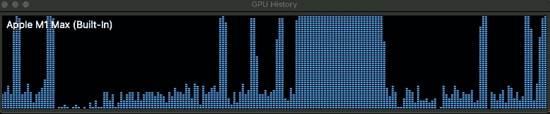
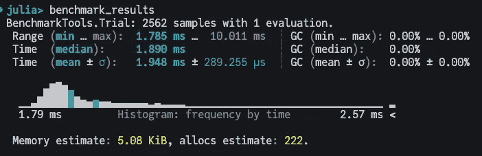
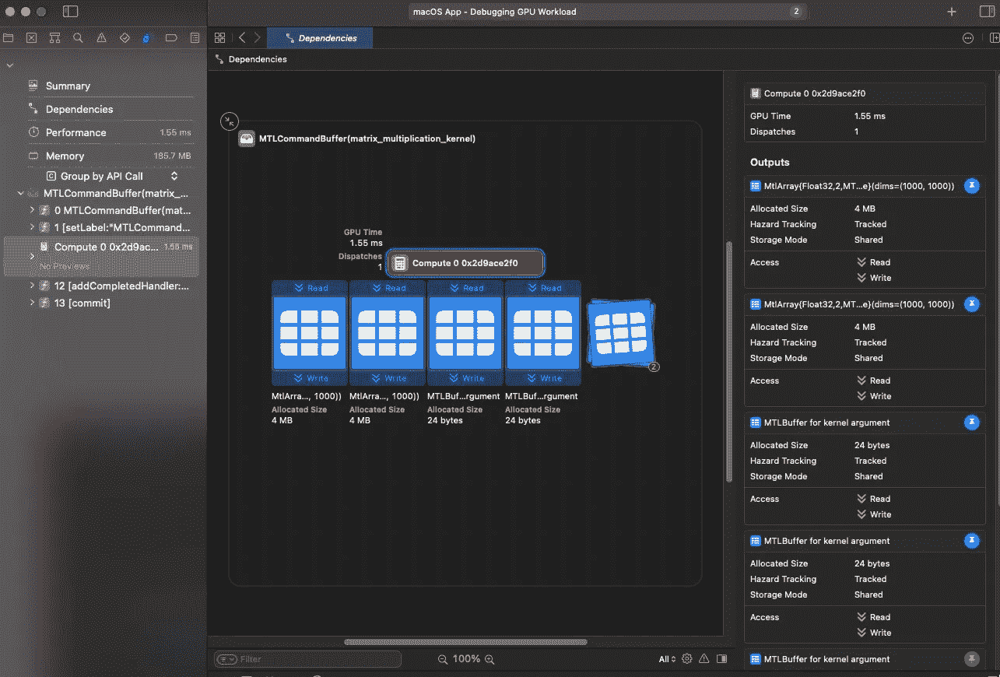
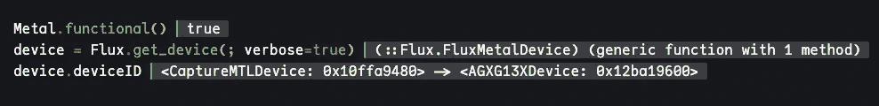
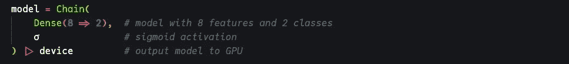
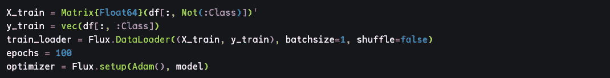
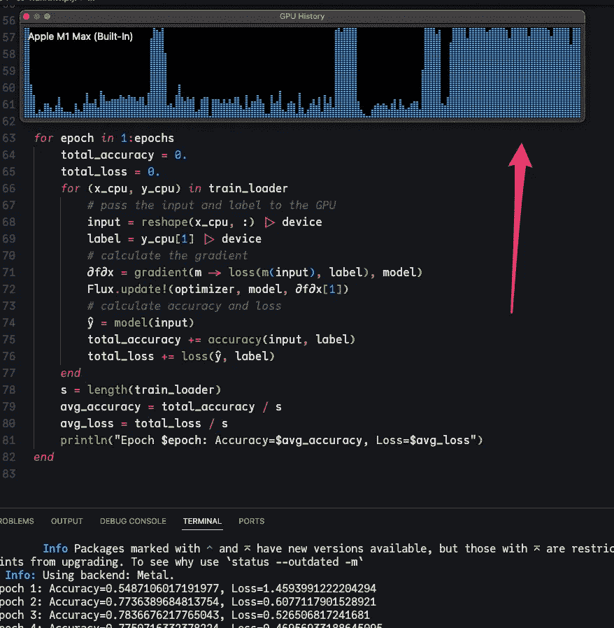

# Julia 中的 Metal 编程

> 原文：[`towardsdatascience.com/metal-programming-in-julia-2db5fe8ee32c`](https://towardsdatascience.com/metal-programming-in-julia-2db5fe8ee32c)


Little Heavy | 作者提供的图片

## 利用 macOS GPU 的强大功能，通过 Metal.jl 框架。

[](https://lausena.medium.com/?source=post_page-----2db5fe8ee32c--------------------------------)[](https://towardsdatascience.com/?source=post_page-----2db5fe8ee32c--------------------------------) [Gabriel Sena](https://lausena.medium.com/?source=post_page-----2db5fe8ee32c--------------------------------)

·发表于[Towards Data Science](https://towardsdatascience.com/?source=post_page-----2db5fe8ee32c--------------------------------) ·阅读时间 11 分钟·2023 年 12 月 4 日

--

## 介绍

就在去年，我们[了解到了](https://www.youtube.com/watch?v=IARikXzRU7s&ab_channel=TheJuliaProgrammingLanguage) [Metal.jl](https://github.com/JuliaGPU/Metal.jl)框架，这是一个用于苹果硬件的 GPU 后端。这对希望利用其 macOS M 系列芯片全部潜力的[Julia](https://julialang.org/)从业者来说是令人兴奋的消息。特别是，数据科学家和机器学习工程师可以通过利用 GPU 的并行处理能力来加速他们的计算工作流程，从而实现更快的训练和推断时间。Metal.jl 的引入标志着对将语言的能力与苹果平台上不断发展的科学计算和机器学习领域对接的重要推动。

> 在[2020 年](https://www.apple.com/newsroom/2020/06/apple-announces-mac-transition-to-apple-silicon/)时，苹果公司开始将其 Mac 系列从基于 Intel 的处理器过渡到 Apple Silicon，从 M1 芯片开始。尽管这是苹果公司历史性且令人印象深刻的成就，但也伴随着不少批评和问题。自从我拿到 32 核的 Mac Studio M1 芯片后，我一直希望充分利用 GPU 并尝试新的应用程序。我必须说，这并非全是轻松愉快的经历。从[ARM](https://en.wikipedia.org/wiki/ARM_architecture_family)架构兼容性问题到不支持的机器学习库——有时要获得一个工作环境确实是一种挑战。这是任何重大过渡和操作方式中都会遇到的预期问题。我仍然保持乐观，并看到在稳定性和功能方面的全面重大改进。

**在本文中，我们将预览 Metal.jl 框架以了解其能力。我们还将展示一个使用** [**Flux**](https://fluxml.ai/)**的实际示例，它是 Julia 中的一个机器学习库，并配合 Metal 后端。**

*以下是涵盖主题的纲要：*

**I.** **项目设置**

i. Julia 环境设置

ii. 依赖概述

**II.** **利用 Metal API**

i. 内核函数

ii. 基准测试

iii. 性能分析

**III.** **使用 Flux 和 Metal Backend**

i. 数据集概述

ii. 简单神经网络

iii. 模型评估

希望跟随的读者应具备：

1.  对 [Julia 编程语言](https://pub.aimind.so/getting-started-with-the-julia-programming-language-0c0d8521a381) 的基本知识。

1.  对机器学习概念的高级理解。

*让我们深入了解吧！*

## **项目设置**

> i. Julia 环境设置

设置一个特定于项目的环境被视为良好实践。这样可以隔离项目所需的确切版本的包，并为自己和团队成员提供一个容易复现的环境。这在 [Julia](https://pub.aimind.so/getting-started-with-the-julia-programming-language-0c0d8521a381) 中很容易做到，如下所示。

> ii. 依赖概述

[**Metal**](https://github.com/JuliaGPU/Metal.jl)**:** 这是一个使在 macOS 上编程 GPU 成为可能的框架。如贡献者所述，该包是**正在开发中**，存在错误、功能缺失和性能尚未完全优化的情况。**请确保您还满足以下系统要求：**

✔ 配备 M 系列芯片的 Mac 设备️️️

✔ Julia 1.8–1.10

✔ macOS 13 (Ventura) 或 14 (Sonoma)

[**BenchmarkTools**](https://github.com/JuliaGPU/Metal.jl)**:** 我们将使用这个库来执行一些操作的基准测试，这些操作通过 Metal APIs 发送到我们的 GPU。这个包使配置、执行和分析结果变得容易。

[**Flux**](https://fluxml.ai/Flux.jl/stable/)**:** Flux 是一个直观的 Julia 机器学习库；它旨在提供一个高级且用户友好的界面来构建和训练神经网络。我们将使用这个库作为示例，并利用 Metal Backend 来利用我们的 GPU。

以下是本文发布时的依赖版本。

```py
julia> # press "]" to get into the package manager
(jl_jQfFj6) pkg> status
Status `/private/var/folders/33/mcgc5pgd2ls6yp3ggq6rszvc0000gn/T/jl_jQfFj6/Project.toml`
  [6e4b80f9] BenchmarkTools v1.3.2
  [587475ba] Flux v0.14.6
  [dde4c033] Metal v0.5.1
```

配置好我们的环境并对所使用的库有了高级理解后，让我们探索 Metal API。

## 利用 Metal API

Metal.jl 与 Apple 的 Metal 图形 API 进行接口——这是 Apple 为其各种平台（macOS、iPhone、手表等）开发的低级 API。

这使用户可以直接控制 [GPU (图形处理单元)](https://en.wikipedia.org/wiki/Graphics_processing_unit)，用于渲染图形和并行计算等任务。让我们看一个基本的示例。

> i. 内核函数

在 Apple Metal 框架的背景下，**内核函数**是一种在 GPU 上执行的特殊类型的函数。这些函数是用着色语言编写的；在我们的案例中是[Metal Shading Language](https://developer.apple.com/metal/Metal-Shading-Language-Specification.pdf) (MSL)。

> “MSL 允许用户编写一个*shader 程序*，这是一种在 GPU 上运行的图形和数据并行计算代码。Shader 程序在 GPU 的不同可编程单元上运行。MSL 是一个统一的语言，允许图形和计算程序之间有更紧密的集成。” ³

在开始之前，让我们确保能够监控 GPU 的负载。Apple 具有内置的 GPU 历史记录。在 Mac 上的活动监视器应用中，选择窗口 > GPU 历史记录。你应该能看到类似我的画面：



GPU 历史记录。顶部的尖峰表示最大 GPU 使用率 | 图片来源：作者

在这个例子中，我们将创建一个*矩阵乘法内核*。为了利用 GPU，我们将故意通过在矩阵操作上迭代*N = 100 万*次来创建计算复杂性。

我们将定义**A**为一个*m x n*矩阵，**B**为一个*n x p*矩阵，**C**为由*m x p*定义的结果矩阵。**C=AB。** 结果的内核函数如下所示；除了对内核函数和底部定义的矩阵变量进行一些小的调整外，代码与你在 Julia 中期望的相当相似。

微妙的差异或附加内容如下：**thread_position_in_grid_1d()**函数返回当前线程在其一维网格中的索引。基本上，它会知道 GPU 应该在每个线程上操作哪些数据。这种精细化的线程分配控制方法使用户能够最大限度地发挥系统的计算能力。

当我们初始化矩阵**A**、**B**和**C**时，我们希望确保在 GPU 上使用 Metal 初始化值；这确保我们使其适合 GPU 加速计算。此外，**storage=Shared**参数指示矩阵数据应存储在[共享内存](https://developer.apple.com/documentation/metal/mtlstoragemode/mtlstoragemodeshared?language=objc)中，从而使 CPU 和 GPU 都能访问。这样，我们需要确保在访问该资源之前进行同步：

> “确保你在 CPU 或 GPU 上为使用共享内存的资源安排的所有更改在访问该资源的另一个处理器之前完成。” ²

最后要提到的是末尾的`C_cpu`变量。`unsafe_wrap`函数用于创建一个与 GPU 数组`C`共享相同底层内存的 CPU 数组`C_cpu`。这使我们能够在 CPU 和 GPU 之间传输数据，以便后续进行计算。在下面的示例中，我将展示在所有 GPU 操作完成后，我们可以通过对其进行逆操作来修改结果矩阵 C（*inv(C_cpu))。*

太棒了！现在我们已经准备好了内核，接下来进行计算和基准测试吧。

> ii. 基准测试

**benchmark**宏（*宏以“@”开头*）用于测量 GPU 内核**matrix_multiplication_kernel**的性能。

在执行我们的`begin...end`块之前，我们将使用`Metal.@sync`确保 CPU 和 GPU 之间的同步，并且所有 GPU 命令在切换到 CPU 代码之前已经完成。

在**metal**宏中，我们指定了`threads`和`groups`的数量。每个线程负责执行计算。这个数量还决定了多少操作可以并行进行。例如，如果我们指定 256 个线程，则每个线程将负责一部分计算。线程被组织成组；一个线程组是可以一起工作并协调线程并行执行的线程集合。

> 总的来说，M1 GPU 包含最多 128 个[执行单元](https://en.wikipedia.org/wiki/Execution_unit)或 1024 个 ALU，⁴ 苹果表示这些执行单元可以同时执行最多 24,576 个线程，并且其最大浮点（FP32）性能为 2.6 [TFLOPs](https://en.wikipedia.org/wiki/TFLOPS)。⁵ ⁶

下面是对***N (100)***、***threads (256)***和***groups (256)***参数进行调整后的结果。



基准测试结果 | 作者提供的图片

> iii. 性能分析

*要进行性能分析并查看结果，您必须安装* [*XCode*](https://developer.apple.com/xcode/)。

性能分析代码是一个常被忽视的学科，它是软件开发和性能优化的关键方面。性能分析涉及测量程序执行的各种方面。这可以包括不同函数所需的时间、函数调用的频率、内存使用或泄漏。性能分析还有助于确保对代码所做的任何更改通过性能量化。

如果你曾经历过代码部署到生产环境后意外导致系统性能显著下降，后来发现是因为初级程序员无意中引入了一个时间复杂度为 O(n²)的嵌套循环，你并不孤单。虽然嵌套的 for 循环在某些情况下看似可以接受，但随着值的数量增加，其影响变得越来越麻烦，导致显著的性能挑战。**及早发现，借助性能分析来捕捉！**

性能分析可以通过两个步骤简单完成。首先，我们需要在`metal`宏前面指定`Metal.@profile`宏。接下来，确保你设置了以下环境变量：**ENV[“METAL_CAPTURE_ENABLED”] = 1**

现在你可以执行以下代码：

`Metal.@profile @metal threads=n_threads groups=n_groups matrix_multiplication_kernel(A, B, C)`

从那里，我们获得一个**julia_capture_*N*.gputrace**文件，存储在与项目相同的目录中。要与之交互，请在 XCode 中打开它并重放跟踪。我们可以看到各种有用的指标，可以进一步挖掘。



Xcode | 作者提供的图片

到此为止，我们已经介绍了如何通过 Metal.jl 与 Apple 的 Metal 图形 API 交互——这使我们能够直接控制 GPU 以进行并行计算。我们介绍了 Metal 着色语言中的内核函数，并使用了一个故意增加 GPU 工作负载的矩阵乘法内核。此外，我们通过 Metal 的宏介绍了基准测试工具和性能分析能力。

*让我们进入一个实际的场景！*

## 使用 Flux 和 Metal 后端

> i. 数据集概述

我们将使用从威斯康星大学医院麦迪逊分院的威廉·H·沃尔伯格博士那里获得的乳腺癌数据库。¹⁰ ¹¹ ***Class***特征将作为目标，其中有两个可能的值（2 表示良性，4 表示恶性）。

为了简洁起见，我将不会演示数据集所需的预处理，而是将读者参考到附录 I：Julia 源代码。

> ii. 简单的神经网络

我们将使用[Flux](https://fluxml.ai/Flux.jl/stable/)构建一个简单的神经网络，该网络利用了[Metal](https://developer.apple.com/documentation/metal)后端。从 v0.14 开始，Flux 不强制用户使用特定的 GPU 后端和相应的软件包依赖。⁷ 尽管我们使用 Metal 作为后端，Flux 也支持其他[后端](https://fluxml.ai/Flux.jl/stable/gpu/)，如 AMDGPU 和 CUDA。

让我们做一个快速的合理性检查，以确保我们的环境设置正确。



使用 Flux 测试 Metal | 作者提供的图片

现在我们有了`device`变量，我们将使用它将数据和模型移到 GPU 上。**在这里要小心，你可以在 Flux 中执行所有业务逻辑，而不需要将模型导出到 GPU——这意味着你仍在使用 CPU（哎呀）！**



模型定义（对于我们的二分类问题，这将是一个逻辑回归模型） | 作者提供的图片

为了准备我们的数据运行，我们将利用 [Flux.DataLoader](https://fluxml.ai/Flux.jl/previews/PR1786/data/dataloader/)。这个模块处理对小批量数据的迭代。为了演示，我保持简单，设置了`batchsize=1`。这意味着如果我的数据包含 800 行，每个批次与一行数据相关。在更高效的场景中，你可能希望将数据分开，以便将处理的数据进行分组。

在跳到下一部分之前，重要的是要注意我在将 DataFrame 直接传递给 DataLoader 时遇到了一些问题，所以这里有一些我必须实现的解决方法。



数据准备 | 图片来源：作者

> iii. 模型评估

以下代码演示了模型训练和评估过程。当 `x_cpu` 和 `y_cpu` 变量（我们的行和标签）从 [DataLoader](https://fluxml.ai/Flux.jl/previews/PR1786/data/dataloader/) 返回时，利用 GPU 是至关重要的——否则，由于兼容性问题，模型期望在 GPU 上的数据将导致崩溃。



项目运行演示及利用 M1-Max GPU！ | 图片来源：作者

在对 Metal.jl 框架的简要介绍中，我们涵盖了在 Apple 硬件上进行 GPU 编程的基础知识。通过探索三个核心概念——*内核函数、基准测试和性能分析*——读者现在对如何入门有了较高层次的理解，并被鼓励深入探索 API 的功能。此外，我们还演示了一个实际示例，利用 Flux 构建了一个简单的神经网络应用程序，使用了 [Metal 后端](https://fluxml.ai/Flux.jl/stable/gpu/)。如果你是数据科学家或 ML 工程师，想要利用 Apple M 系列 GPU 的强大功能，希望这篇文章能作为加速你的计算工作流的起点。从这里，我将留下更多资源供读者查看：

[](https://fluxml.ai/Flux.jl/stable/?source=post_page-----2db5fe8ee32c--------------------------------) [## 欢迎 · Flux

### Flux 是一个机器学习库。它包含许多有用的工具，但也允许…

fluxml.ai](https://fluxml.ai/Flux.jl/stable/?source=post_page-----2db5fe8ee32c--------------------------------)

*希望你喜欢这篇文章，谢谢阅读！*

👏

**最后，我要大力感谢 Metal.jl 项目的创作者。我期待该项目继续成功。对于任何希望贡献的人，请查看他们的 Github 页面** [**这里**](https://github.com/JuliaGPU/Metal.jl)**。**

## 附录 I：Julia 源代码

> 在运行 Github 上找到的源代码之前，我强烈建议匹配本文中找到的版本，以确保成功编译。此外，Metal.jl 库仍在开发中，可能会根据指定的版本缺少或包含不同的功能。

🔗 [`github.com/lausena/JuliaExperiments/tree/main`](https://github.com/lausena/JuliaExperiments/tree/main)

*预处理的补充内容可以在此* [*帖子*](https://medium.com/ai-mind-labs/practical-julia-logistic-regression-4e97a3cc3df8)*中找到*。

[](https://medium.com/subscribe/@lausena?source=post_page-----2db5fe8ee32c--------------------------------) [## 每当 Gabriel Sena 发布新内容时，你将会收到电子邮件。

### 每当 Gabriel Sena 发布新内容时，你将会收到电子邮件。通过注册，如果你还没有 Medium 账户，将会创建一个…

medium.com](https://medium.com/subscribe/@lausena?source=post_page-----2db5fe8ee32c--------------------------------)

***参考文献***

[1] [`www.youtube.com/watch?v=IARikXzRU7s&ab_channel=TheJuliaProgrammingLanguage`](https://www.youtube.com/watch?v=IARikXzRU7s&ab_channel=TheJuliaProgrammingLanguage)

[2] [`juliagpu.org/post/2022-06-24-metal/index.html`](https://juliagpu.org/post/2022-06-24-metal/index.html)

[3] [`developer.apple.com/metal/Metal-Shading-Language-Specification.pdf`](https://developer.apple.com/metal/Metal-Shading-Language-Specification.pdf)

[4] Frumusanu, Andrei。 [“2020 Mac Mini 大揭秘：测试 Apple Silicon M1”](https://www.anandtech.com/show/16252/mac-mini-apple-m1-tested)。 [*www.anandtech.com*](http://www.anandtech.com)。 [存档](https://web.archive.org/web/20210201183558/https://www.anandtech.com/show/16252/mac-mini-apple-m1-tested) 自原始页面存档于 2021 年 2 月 1 日。检索日期为 2021 年 1 月 30 日。

[5] [“Apple M1 芯片”](https://www.apple.com/mac/m1/)。 *Apple.com*。Apple。 [存档](https://web.archive.org/web/20201110184757/https://www.apple.com/mac/m1/) 自原始页面存档于 2020 年 11 月 10 日。检索日期为 2020 年 11 月 11 日。

[6] Kingsley-Hughes, Adrian (2020 年 11 月 10 日)。 [“Apple Silicon M1 芯片：我们知道什么”](https://www.zdnet.com/article/apple-silicon-m1-chip-heres-what-we-know/)。 *ZDnet*。Red Ventures。 [存档](https://web.archive.org/web/20210917094527/https://www.zdnet.com/article/apple-silicon-m1-chip-heres-what-we-know/) 自原始页面存档于 2021 年 9 月 17 日。检索日期为 2021 年 7 月 1 日。

[7] [`fluxml.ai/Flux.jl/stable/gpu/`](https://fluxml.ai/Flux.jl/stable/gpu/)

[8] [`juliagpu.org/post/2023-03-03-metal_0.2/`](https://juliagpu.org/post/2023-03-03-metal_0.2/)

[9] [`fluxml.ai/Flux.jl/stable/tutorials/logistic_regression/`](https://fluxml.ai/Flux.jl/stable/tutorials/logistic_regression/)

[10] William H. Wolberg 和 O.L. Mangasarian: “用于医疗诊断的模式分离，应用于乳腺细胞学”。

“用于医疗诊断的模式分离，应用于乳腺细胞学”，

《美国国家科学院院刊》，第 87 卷，

1990 年 12 月，第 9193–9196 页。

[11] 该数据集遵循 [知识共享署名 4.0 国际](https://creativecommons.org/licenses/by/4.0/legalcode) (CC BY 4.0) 许可协议。 [`archive.ics.uci.edu/ml/machine-learning-databases/breast-cancer-wisconsin/breast-cancer-wisconsin.names`](https://archive.ics.uci.edu/ml/machine-learning-databases/breast-cancer-wisconsin/breast-cancer-wisconsin.names)
