# META 的 Hiera：降低复杂性以提高准确性

> 原文：[`towardsdatascience.com/metas-hiera-reduce-complexity-to-increase-accuracy-30f7a147ad0b`](https://towardsdatascience.com/metas-hiera-reduce-complexity-to-increase-accuracy-30f7a147ad0b)

## | 人工智能 | 计算机视觉 | VITs |
## | --- | --- | --- |

## 简单性使得人工智能能够达到惊人的性能和速度

 [Salvatore Raieli](https://salvatore-raieli.medium.com/?source=post_page-----30f7a147ad0b--------------------------------)

·发表于 [Towards Data Science](https://towardsdatascience.com/?source=post_page-----30f7a147ad0b--------------------------------) ·阅读时间 12 分钟·2023 年 6 月 21 日

--

图片由 [Alexander Redl](https://unsplash.com/@alexanderredl?utm_source=medium&utm_medium=referral) 提供，来源于 [Unsplash](https://unsplash.com/?utm_source=medium&utm_medium=referral)

[卷积网络](https://en.wikipedia.org/wiki/Convolutional_neural_network)在计算机视觉领域已经主导了二十多年。随着[变换器](https://en.wikipedia.org/wiki/Transformer_(machine_learning_model))的到来，人们曾认为它们会被淘汰。**然而，许多从业者仍在项目中使用基于卷积的模型。这是为什么呢？**

本文试图回答这些问题：

+   视觉变换器是什么？

+   它们的局限性是什么？

+   我们能否尝试克服这些问题？

+   META Hiera 如何以及为何似乎成功了？

# 视觉变换器：一张图值多少字？

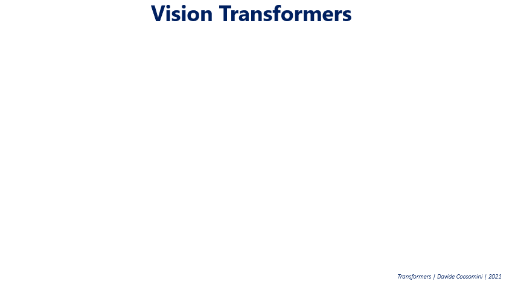

图片来源：[这里](https://en.wikipedia.org/wiki/Vision_transformer#/media/File:Vision_Transformer.gif)

[视觉变换器](https://en.wikipedia.org/wiki/Vision_transformer)近年来在视觉基准测试中占据了主导地位，**但它们究竟是什么呢？**

直到几年前，[卷积神经网络](https://en.wikipedia.org/wiki/Convolutional_neural_network) 一直是视觉任务的标准。然而，在 2017 年，[变压器](https://en.wikipedia.org/wiki/Transformer_(machine_learning_model)) 的发布让 [NLP](https://en.wikipedia.org/wiki/Natural_language_processing) 世界颠覆了。在文章 [Attention is all you need](https://arxiv.org/abs/1706.03762) 中，作者展示了一个仅使用自注意力构建的模型能够比 [RNNs](https://en.wikipedia.org/wiki/Recurrent_neural_network) 和 [LSTMs](https://en.wikipedia.org/wiki/Long_short-term_memory) 实现更优越的性能。所以人们很快会想：**是否可以将变压器应用于图像？**

在 2020 年之前，已经尝试过包括自注意力集成的混合模型。但无论如何，这些模型的扩展性都不佳。这个想法是找到一种方法，使变压器可以原生地用于图像。

在 2020 年，[谷歌的作者决定最佳方法](https://arxiv.org/pdf/2010.11929.pdf) 是将图像分割成不同的补丁，然后对序列进行 [嵌入](https://en.wikipedia.org/wiki/Embedding)。这样，图像基本上被视为模型中的标记（单词）。

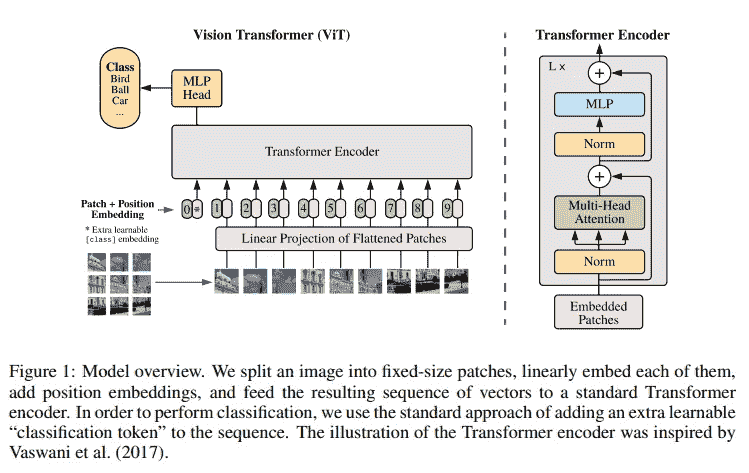

图片来源：[这里](https://arxiv.org/pdf/2010.11929.pdf)

在短时间内，CNNs 在计算机视觉中的主导地位正逐渐被削弱。[视觉变压器](https://en.wikipedia.org/wiki/Vision_transformer) 在 CNNs 一直主导的基准（如 [ImageNet](https://en.wikipedia.org/wiki/ImageNet)）上表现更为优越。

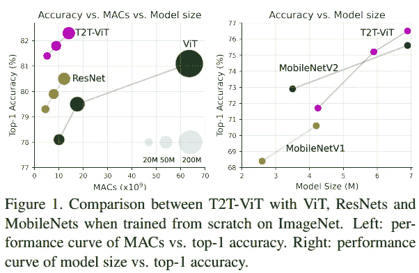

图片来源：[这里](https://arxiv.org/pdf/2101.11986.pdf)

实际上，提供足够的数据，[视觉变压器（ViTs）](https://en.wikipedia.org/wiki/Vision_transformer) 表现出它们优于 CNNs。还显示出，尽管存在一些差异，但也有许多相似之处：

+   ViTs 和 CNNs 都构建了复杂且逐步深入的表示。

+   然而，ViTs 更能利用背景信息，并且似乎更具鲁棒性。

 [## 视觉变压器看到的视觉之旅

### 一些最大的模型如何看待世界

pub.towardsai.net](https://pub.towardsai.net/a-visual-journey-in-what-vision-transformers-see-9db9c8ba62d4?source=post_page-----30f7a147ad0b--------------------------------)

此外，变压器的可扩展性也是一个额外的优势。这成为了 ViTs 的竞争优势，使其成为热门选择。

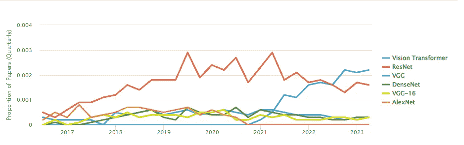

使用视觉变压器。 [source](https://paperswithcode.com/method/vision-transformer)

**实际上，多年来我们见证了数百万参数的 CNN 和达到数十亿参数的 ViTs。** 去年，Google 展示了如何将 ViTs 扩展到 20B 参数，并且未来我们可能会看到更大的模型。

 ## 为什么我们有大型语言模型和小型视觉变压器？

### Google ViT-22 为新型大型变压器和计算机视觉的革命铺平了道路

towardsdatascience.com

# 视觉变压器的限制

图片由[Joshua Hoehne](https://unsplash.com/pt-br/@mrthetrain?utm_source=medium&utm_medium=referral)提供，来自[Unsplash](https://unsplash.com/?utm_source=medium&utm_medium=referral)

原生适配变压器仍然有成本：[ViTs](https://en.wikipedia.org/wiki/Vision_transformer)在使用其参数时效率低下。**这源于它们在网络中使用相同的空间分辨率和相同数量的通道。**

CNN 有两个方面决定了它们的初期命运（都受到人脑皮层的启发）：

+   随着层级的上升，空间分辨率减少。

+   增加不同的“通道”数量，每个通道变得越来越专业。

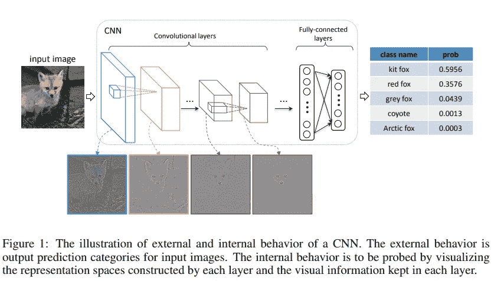

图像来源：[这里](https://arxiv.org/pdf/1412.6631.pdf)

另一方面，变压器具有不同的结构，即一系列[自注意力](https://en.wikipedia.org/wiki/Attention_(machine_learning))模块，其中发生两个主要操作，使其能够很好地进行泛化：

+   用于建模元素间关系的注意力操作。

+   全连接层则建模元素间的关系。

**这实际上早已被注意到，源于变压器设计是针对文字而非图像的**。毕竟，文本和图像是两种不同的模式。其一的不同之处在于，文字在尺度上不会变化，而图像则会。**这在需要关注在目标检测中尺度变化的元素时是有冲突的。**

**此外，图像中像素的分辨率高于文本段落中文字的分辨率。** 由于注意力机制具有平方级别的成本，使用高分辨率图像在变压器中具有较高的计算成本。

之前的研究尝试通过使用层次特征图来解决这个问题。例如，[Swin Transformer](https://arxiv.org/pdf/2103.14030.pdf)通过从小块开始并逐渐合并各种邻近块来构建层次表示。

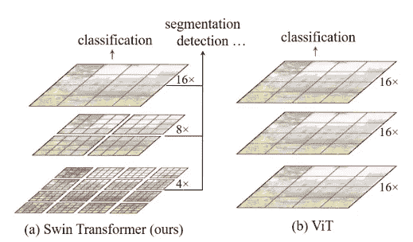

图像来源：[这里](https://arxiv.org/pdf/2103.14030.pdf)

其他研究尝试在 ViTs 中实现多通道。例如，[MVITs](https://arxiv.org/pdf/2104.11227.pdf)尝试创建初级通道，专注于简单的低级视觉信息，同时更深的通道则关注复杂的高级特征，如 CNNs 中的做法。

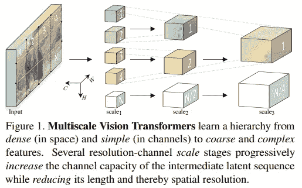

图像来源：[这里](https://arxiv.org/pdf/2104.11227.pdf)

然而，这些方法并未完全解决问题。随着时间的推移，提出了越来越复杂的模型和专业模块，这些改进在一定程度上提升了性能，但使得[ViTs](https://en.wikipedia.org/wiki/Vision_transformer)在训练时变得相当缓慢。

> 我们能否在不需要复杂解决方案的情况下解决这些变换器的局限性？

# 如何学习空间关系

图片由[Ali Kazal](https://unsplash.com/it/@lureofadventure)在 Unsplash 上提供

ViTs 已成为计算机视觉领域的一个模型，然而，适应它们需要越来越复杂的修改。

> 我们能否在不需要复杂解决方案的情况下解决这些变换器的局限性？

近年来，人们一直在努力简化模型并加快速度。常用的一种方法是引入稀疏性。在计算机视觉领域，一个非常成功的模型是[掩码自编码器](https://arxiv.org/abs/2111.06377)（MAE）。

在这种情况下，经过分块后，一些块会被掩盖。然后，解码器必须从被掩盖的块中重建。ViT 编码器仅处理 25%的块。在这种情况下，你可以用少量的计算和内存来训练宽编码器。

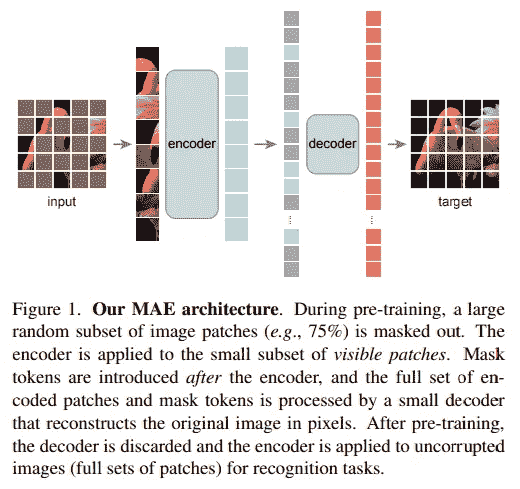

图像来源：[这里](https://arxiv.org/pdf/2111.06377.pdf)

这种方法已被证明能够教授空间推理，取得了与 Swin 和 Mvit 相当甚至更优的结果（但后者在计算上要复杂得多）。

另一方面，如果稀疏性确实提高了训练效率，那么 CNNs 的一个主要优点就是其层次化的方法。但这与稀疏性存在冲突。

实际上，这之前已经做过测试，但效果不佳：

+   得到的模型速度过慢（[MaskFeat](https://arxiv.org/abs/2112.09133) 或 [SimMIM](https://arxiv.org/abs/2111.09886)）。

+   修改使模型变得不必要地复杂，并且没有在准确性上获得提升（[UM-MAE](https://arxiv.org/abs/2205.10063) 或 [MCMAE](https://openreview.net/forum?id=qm5LpHyyOUO)）。

> 是否可以设计一个稀疏且层次化但仍高效的模型？

META 的新工作已脱离了 MAE 训练和其他技巧，致力于构建一个高效且准确的 ViT，而不需要过去使用的那些复杂结构。

 [## Hiera: 一种没有花哨组件的层次化视觉变换器

### 现代层次化视觉变换器在追求有监督学习的过程中添加了多个视觉专用组件…

arxiv.org](https://arxiv.org/abs/2306.00989?source=post_page-----30f7a147ad0b--------------------------------)

# Hiera: 层次化、稀疏且高效的 ViT

照片由 [Jordan Opel](https://unsplash.com/@opeleye?utm_source=medium&utm_medium=referral) 提供，[Unsplash](https://unsplash.com/?utm_source=medium&utm_medium=referral)

## 模型

基本思想是，为了在视觉任务中训练一个高准确度的层次化 ViT，不需要使用一系列使其变得缓慢和复杂的元素。根据作者的说法，空间偏差可以通过掩码自编码器训练从模型中学习。

在 MAE 中，补丁被删除，因此在层次化模型中，它在重建 2D 网格（以及空间关系）时遇到问题。作者解决了这个问题，使得内核在掩码单元之间不能重叠（在 [池化](https://www.kaggle.com/questions-and-answers/59502) 中，掩码单元之间没有重叠）。

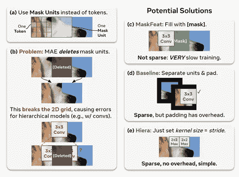

图片来源: [这里](https://arxiv.org/abs/2306.00989)

作者们从现有的 ViT 层次化模型 MViTv2 开始，并决定使用 MAE 训练对其进行改造。该模型由多个 ViT 块组成，但如结构所示，某些地方会减少尺寸，这通过使用池化注意力实现。

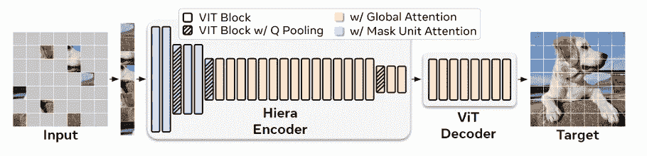

图片来源: [这里](https://arxiv.org/abs/2306.00989)

在池化过程中，注意力特征使用 3x3 卷积进行局部聚合，然后计算自注意力（这是为了减少 K 和 V 的大小，从而减少计算量）。当使用视频时，这种机制可能变得昂贵。因此，作者用掩码单元注意力替代了它。

换句话说，在 Hiera 中，池化过程中内核会移动，以确保掩码部分不会出现在池化中。因此，对每组标记（掩码大小）进行某种局部注意力

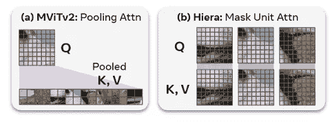

图片来源: [这里](https://arxiv.org/abs/2306.00989)

MViTv2 随后引入了一系列增加复杂性的附加组件，作者认为这些是非必需的，因此将其删除：

+   **相对位置嵌入**。位置嵌入被添加到每个块中的注意力中。

+   **最大池化层**，在 Hiera 中使用时需要填充。

+   **注意力残差**，在 Q（查询）和输出之间存在残差连接，以更好地学习池化注意力。作者减少了层数，因此不再需要。

作者展示了这些变化的影响如何显著提高了准确率（acc.）和速度（每秒图像）。

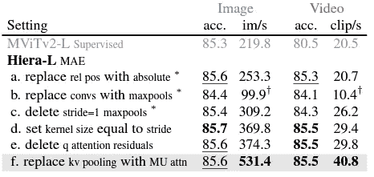

图片来源：[这里](https://arxiv.org/abs/2306.00989)

一般来说，简化模型使 Hiera 不仅在图像和视频上更快，而且比其对应的 MViTv2 和其他模型更准确。

> Hiera 在图像上比我们开始使用的 MViTv2 快 2.4 倍，在视频上快 5.1 倍，并且由于 MAE 实际上更准确（[来源](https://arxiv.org/abs/2306.00989)）

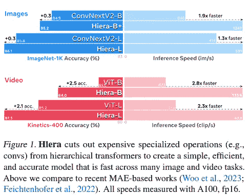

图片来源：[这里](https://arxiv.org/abs/2306.00989)

作者指出，模型不仅在推断时更快，而且训练也快得多。

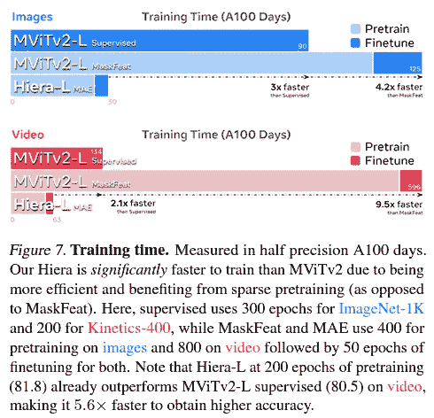

图片来源：[这里](https://arxiv.org/abs/2306.00989)

## 结果

作者展示了基本模型在参数数量有限的情况下，如何在 Imagenet 1K 上取得良好结果（这是最重要的图像分类数据集之一）。

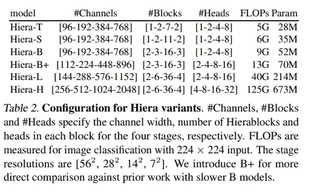

图片来源：[这里](https://arxiv.org/abs/2306.00989)

第二点是，在低参数范围内，通常是卷积基础的模型占据主导地位。这里更小的模型表现非常好。对于作者而言，这证实了他们的直觉，即空间偏差可以在训练过程中学习，从而使 ViTs 即使在小模型中也能与卷积网络竞争。

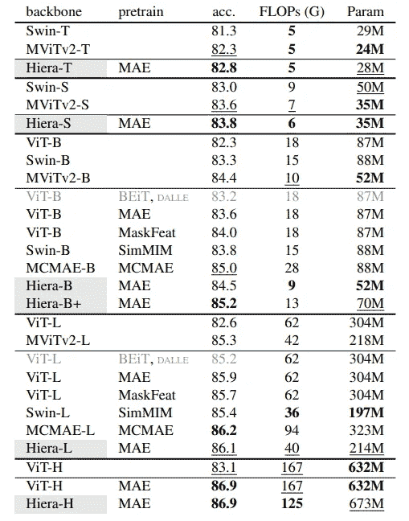

图片来源：[这里](https://arxiv.org/abs/2306.00989)

大型 CNN 模型的成功在于它们可以用于[迁移学习](https://en.wikipedia.org/wiki/Transfer_learning)。[ResNet](https://arxiv.org/abs/1512.03385) 和基于 VGG 的模型已经在 Imagenet 上训练，然后被社区用于许多任务。因此，作者测试了 Hiera 的迁移学习能力，使用了两个数据集：iNaturalists 和 Places。

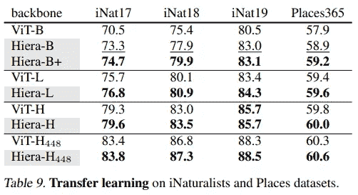

图片来源：[这里](https://arxiv.org/abs/2306.00989)

作者在这两个数据集上对模型进行了微调，并展示了他们的模型优于之前的 ViTs。这表明他们的模型也可以用于其他数据集。

此外，作者使用了另一个流行的数据集 COCO。虽然 iNaturalists 和 Places 是图像分类的数据集，COCO 是用于图像分割和目标检测（计算机科学中的两个热门任务）的最广泛使用的数据集之一。再次，模型表现出强劲的扩展性（参数增加时性能提升）。此外，模型在训练和推断时都更快。

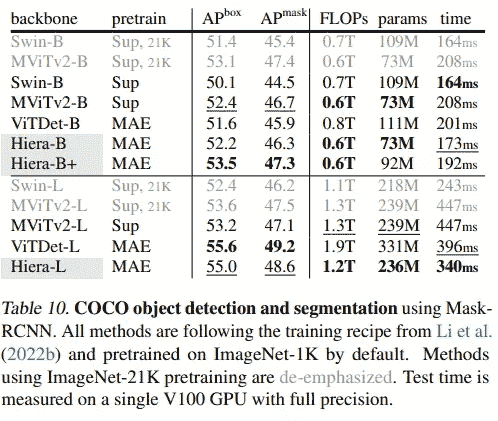

图片来源：[这里](https://arxiv.org/abs/2306.00989)

此外，该模型已在视频上进行了测试，特别是在两个视频分类数据集上。Hiera 表明它在参数更少的情况下表现更好。该模型在推理中也更快。作者展示了该模型在这种任务中达到了最先进的水平。

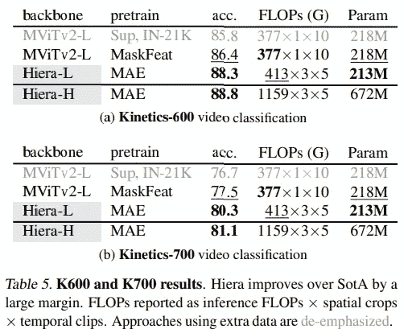

图片来源：[这里](https://arxiv.org/abs/2306.00989)

作者展示了该模型还可以用于其他视频任务，例如动作检测。

# 告别感言

> 在这项工作中，我们通过采用现有的层次化视觉变换器，去除所有附加功能，同时通过 MAE 预训练为模型提供空间偏置，从而创建了一个简单的层次化视觉变换器。 ([source](https://arxiv.org/pdf/2306.00989.pdf))

作者展示了许多为提高变换器性能而添加的元素实际上不仅是不必要的，而且增加了模型的复杂性，使其变得更慢。

相反，作者展示了使用 MAE 和层次结构可以使 ViT 在图像和视频处理上更快、更准确。

这项工作很重要，因为在许多任务中，社区仍然使用基于卷积的模型。ViTs 是非常大的模型，计算成本高。因此，人们通常更愿意使用基于 ResNet 和 VGG 的模型。ViTs 如果在推理上更准确但尤其更快，可能会改变游戏规则。

其次，它突出了在其他地方看到的一个趋势：利用稀疏性进行训练。这具有减少参数和加速训练与推理的优势。一般来说，稀疏性的概念也在其他人工智能领域中被看到，并且是一个活跃的研究领域。

# 如果你觉得这很有趣：

*你可以查看我的其他文章，你也可以* [***订阅***](https://salvatore-raieli.medium.com/subscribe) *以在我发布文章时收到通知，你还可以* [***成为 Medium 会员***](https://medium.com/@salvatore-raieli/membership) *以访问所有故事（平台的附属链接，我从中获得少量收入，对你没有成本），你也可以在*[***LinkedIn***](https://www.linkedin.com/in/salvatore-raieli/)***上连接或联系我。***

*这是我 GitHub 仓库的链接，我计划在其中收集与机器学习、人工智能及更多相关的代码和资源。*

 [## GitHub — SalvatoreRa/tutorial: 机器学习、人工智能、数据科学的教程…

### 机器学习、人工智能、数据科学的教程，包含数学解释和可重复使用的代码（Python…

github.com](https://github.com/SalvatoreRa/tutorial?source=post_page-----30f7a147ad0b--------------------------------)

*或者你可能对我最近的一篇文章感兴趣：*

 [## 模仿游戏：缩小开源和专有模型之间的差距

### 模仿模型能否达到像 ChatGPT 这样的专有模型的性能？

[levelup.gitconnected.com](https://levelup.gitconnected.com/the-imitation-game-taming-the-gap-between-open-source-and-proprietary-models-627374b390e5?source=post_page-----30f7a147ad0b--------------------------------)  [## 扩展并不是一切：更大模型失败得更惨

### 大型语言模型真的理解编程语言吗？

[salvatore-raieli.medium.com](https://salvatore-raieli.medium.com/scaling-isnt-everything-how-bigger-models-fail-harder-d64589be4f04?source=post_page-----30f7a147ad0b--------------------------------)  [## META 的 LIMA：玛丽亚·近藤的 LLM 训练方法

### 更少而整洁的数据来创建一个能够与 ChatGPT 相媲美的模型

[levelup.gitconnected.com](https://levelup.gitconnected.com/metas-lima-maria-kondo-s-way-for-llms-training-8411e3907fed?source=post_page-----30f7a147ad0b--------------------------------)  [## 人工智能有趣吗？也许，稍微有点

### 为什么人工智能仍然在幽默方面挣扎，以及这为什么是一个重要步骤

[levelup.gitconnected.com](https://levelup.gitconnected.com/is-ai-funny-maybe-a-bit-fd5183f68779?source=post_page-----30f7a147ad0b--------------------------------)

# 参考文献

这是我撰写本文时参考的主要文献列表，仅列出文章的第一个作者。

1.  Chaitanya Ryali 等，2023 年，《Hiera: A Hierarchical Vision Transformer without the Bells-and-Whistles》，[链接](https://arxiv.org/abs/2306.00989)

1.  Peng Gao 等，2022 年，《MCMAE: Masked Convolution Meets Masked Autoencoders》，[链接](https://openreview.net/forum?id=qm5LpHyyOUO)

1.  Xiang Li 等，2022 年，《Uniform Masking: Enabling MAE Pre-training for Pyramid-based Vision Transformers with Locality》，链接

1.  Zhenda Xie 等，2022 年，《SimMIM: A Simple Framework for Masked Image Modeling》，[链接](https://arxiv.org/abs/2111.09886)

1.  Ze Liu 等，2021 年，《Swin Transformer: Hierarchical Vision Transformer using Shifted Windows》，[链接](https://arxiv.org/abs/2205.10063)

1.  Haoqi Fan 等，2021 年，《Multiscale Vision Transformers》，[链接](https://arxiv.org/abs/2104.11227)

1.  Kaiming He 等，2021 年，《Masked Autoencoders Are Scalable Vision Learners》，[链接](https://arxiv.org/abs/2111.06377)

1.  Chen Wei 等人, 2021, 《自监督视觉预训练的掩码特征预测》，[链接](https://arxiv.org/abs/2112.09133)

1.  Alexey Dosovitskiy 等人, 2020, 《一张图像价值 16x16 个词：用于大规模图像识别的变换器》，[链接](https://arxiv.org/abs/2010.11929)

1.  Ashish Vaswani 等人, 2017, 《注意力机制就是你所需的》，[链接](https://arxiv.org/abs/1706.03762)

1.  Kaiming He 等人, 2015, 《用于图像识别的深度残差学习》，[链接](https://arxiv.org/abs/1512.03385)

1.  Wei Yu 等人, 2014, 《可视化和比较卷积神经网络》，[链接](https://arxiv.org/abs/1412.6631)

1.  Karen Simonyan 等人, 2014, 《用于大规模图像识别的非常深的卷积网络》，[链接](https://arxiv.org/abs/1409.1556)

1.  为什么我们有大型语言模型而小型视觉变换器？，TDS，链接

1.  在 Vision-Transformers 看到的视觉之旅，TowardsAI，[链接](https://pub.towardsai.net/a-visual-journey-in-what-vision-transformers-see-9db9c8ba62d4)

1.  Vision Transformer，paperswithcode，[链接](https://paperswithcode.com/method/vision-transformer)
