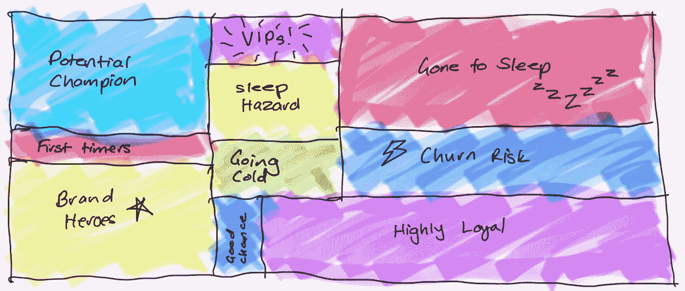

# 客户终身价值建模的方法：好东西和陷阱

> 原文：[`towardsdatascience.com/methods-for-modelling-customer-lifetime-value-the-good-stuff-and-the-gotchas-445f8a6587be`](https://towardsdatascience.com/methods-for-modelling-customer-lifetime-value-the-good-stuff-and-the-gotchas-445f8a6587be)

## 一份关于 CLV 技术和实际应用案例的全面实用指南的第三部分

 [凯瑟琳·穆诺](https://katherineamunro.medium.com/?source=post_page-----445f8a6587be--------------------------------)

·发表于 [Towards Data Science](https://towardsdatascience.com/?source=post_page-----445f8a6587be--------------------------------) ·10 分钟阅读·2023 年 11 月 17 日

--

客户多久购物一次？他们花多少钱？他们忠诚多久？三个简单的因素帮助你建模你平均消费者的客户终身价值。但这是否意味着任务很容易？不，不是的。来源：作者提供。

欢迎回来继续我的客户终身价值预测系列，我称之为“其他教程遗漏的所有内容”。在 第一部分，我介绍了*历史* CLV 分析这个经常被低估的阶段，以及你可以用这些后视信息做些什么。 下一部分，我展示了大量的 CLV *预测* 用例，远远超出了我在其他文章中看到的通常有限的例子。现在，是时候进入实际部分，包括我和我的数据科学团队在处理实际数据和客户时学到的一切。

再次说明，我无法将所有有用的信息压缩到一篇博客文章中，而不将其变成一部史诗。所以今天我将专注于历史 CLV 建模，正如第一部分所示，这已经非常有用。我将介绍 Stupid Simple Formula、Cohort Analysis 和 RFM 方法，包括我发现的每种方法的优缺点。下一次我将做相同的工作，但针对 CLV *预测* 方法。我将以数据科学家学习到的最佳实践来结束整个系列，讲述如何正确地进行 CLV 分析。

听起来不错？那我们就来探讨一下历史上的 CLV 分析方法，以及你需要注意的优点和“陷阱”。

# 方法 1：简单的公式

或许最简单的公式基于三个要素：顾客通常购买多少，购物频率，以及忠诚的持续时间：

比如，如果你的平均顾客每次交易花费 25 欧元，每月进行两次交易，并且保持忠诚 24 个月，那么你的 CLV = 1200 欧元。

我们可以通过考虑利润或盈余，使其变得更复杂。有几种方法可以做到这一点：

## 简单公式 V1：每产品**利润**

在这里，你需要计算所有库存产品的平均利润，然后将这个非常简单的公式结果乘以这个数字，以得到平均客户生命周期*利润*：

例如，如果你使用上述数据，并考虑到平均产品利润为 10%，那么你的平均 CLV =（25 欧元 * 2 * 24）* 0.1 = 120 欧元。

计算平均产品利润的方法取决于你所拥有的成本数据，这些数据可能来自各种数据源。一个简单的开始方法是直接用标准目录价格减去**销售成本（COGS）**，因为你可能在库存表中已经有了这些信息。当然，这并不考虑更复杂的成本，或者当物品打折时的销售价格，或者不同交易包含不同项目，可能有非常不同的利润。我们来看看一个考虑了这些因素的选项…

## 简单公式 V2：每交易利润

第二版用平均交易*利润*替代了原公式中的平均交易*值*：

例如，每次交易 5 欧元的利润 * 每月 2 次交易 * 24 个月的生命周期 = 平均 CLV 为 240 欧元。

这种变体需要基于价格减去成本的每项交易级别的利润。其优点在于，你可以使用实际销售价格，而不是目录价格，从而考虑到最终结账时的任何促销或折扣。此外，你可以包括**配送服务成本（CODS）**，即运输费用，以及**支付服务成本（COPS）**，即支付系统提供商（如 Visa 或 PayPal）的费用。这一切都能带来更准确和可操作的洞察。

来源：作者提供。

## 简单公式的优缺点

**积极的一面：**

+   **这个公式在概念上很简单**，这有助于数据科学家和领域专家在如何计算它以及如何使用它上更好地合作。

+   此外，**它可以根据你的利润计算方式而变得简单或复杂**，

然而，存在**两个主要缺点**。首先，这个公式并不是特别具有操作性：

+   它生成一个单一的平均值，这个值**难以解释和影响**：即使你做出一些改变，重新计算后发现平均值也有所变化，你也无法确定这是否与您的行动相关。

+   它**平滑了销售速度**，所以你无法追踪客户是在生命周期的开始还是后期进行消费。

+   并且它**无法帮助理解客户细分**及其需求。

其次，该公式可能不可靠：

+   作为一个平均值，**它很容易被扭曲**，例如如果你有大额花费者或零售和消费者客户的混合。

+   在非合同情况中，客户不受合同约束继续付款，**你永远无法真正知道客户何时“死亡”。**因此，很难估算*平均生命周期*组件的价值。

+   该公式假设每个客户的支出和流失率是恒定的。它**未考虑客户旅程和阶段**，即他们在何时需要更多或更少的产品。

# 方法 2：群体分析

这种技术涉及将平均 CLV 公式应用于个别客户细分。你可以按任何方式对客户进行细分，例如按人口统计、获取渠道或通常按首次购买月份。**其目的是回答如下问题：**

+   **在 3、6、12 个月后，平均客户的价值是多少？**

+   **他们在生命周期中的何时花费最多？**例如，他们最初是否花费很多，然后逐渐减少，还是相反？

+   **获取漏斗如何影响 CLV？**例如，由促销活动引起的注册可能会赢得很多短期的、不忠诚的客户，而来自推荐朋友计划的客户可能会成为终身粉丝。同样，店内获取可能比在结账时强制在线注册带来更多忠诚度。

+   **人口统计群体在其平均 CLV 上有何不同？**例如，富裕郊区的购物者是否花费更多？答案并不总是符合预期，每当发生这种情况时，如果你深入挖掘，通常会发现有价值的见解。

下面我们看到按获取月份进行的经典群体分析。横轴显示群体组，指示我们数据中最早的交易月份。这可能表示获取月份（尽管一些客户可能在数据收集开始之前就已存在）。纵轴显示群体周期：自数据中最早交易以来的月份数。

来源：Finn Qiao，《Cakestands & Paper Birdies: E-Commerce Cohort Analysis in Python》，发表于 TowardsDataScience.com

你是怎么解读这个的？最左边的列显示了 2010 年 12 月加入的客户（或当时已经是客户）。颜色越深表示这些客户在他们的第一个月（左上角单元格）和第 10 到第 12 个月（右下角），即 2011 年 9 月至 11 月，花费越多。这可能意味着什么？数据科学家和营销人员之间的合作可以帮助解码这一趋势：也许是因为公司在 2010 年为这些客户挽救了圣诞节，他们在 2011 年开心地回归了。也可能只是因为他们在数据收集开始前已经是客户了。与此同时，7 月和 8 月获得的客户往往花费较少。为什么？针对在其他时间获得的客户，应该采取什么策略来提升平均客户生命周期价值（CLV）？

同样的调查也可以并且应该在其他类型的细分中进行。

来源：作者提供。

# 方法 3：“RFM”方法

RFM 方法基于为每个客户计算以下指标：

是的，我买了新的 iPad。不，我不是艺术家。来源：作者提供。

这使我们能够根据这些指标对客户进行分类，探索不同的客户群体，并为其分配有意义的业务名称。例如，那些具有最高的近期性、频率和货币价值分数的客户被称为“Top Prio”或“VIPs”。确定了他们之后，接下来你需要了解的是：这个群体在你的整体客户基础中所占的比例是多少？与此同时，具有高频率和货币价值但近期性低的客户花费显著，但时间较短。如果你添加一个额外的指标——自上次购买以来的时间——发现这个时间很长，他们可能被认为是“流失风险”。

发现这些群体的最简单方法是使用百分位数：按近期性对客户进行排序，并将其分为——例如前 20%、中间 50%和底部 30%的层次。对其他指标重复此操作。然后定义所有可能的层次组合，标记生成的群体，并绘制每个群体在整体客户基础中所占的百分比。下方展示了这一点。创建这样的图表可以清晰地显示，只有很小一部分整体客户基础是“VIPs”，而更大一部分是“变冷”甚至是“流失风险”。这些洞察可以帮助你制定策略，以获得更多忠实客户，减少风险客户。

发现并标记你的客户基础中的细分。来源：作者提供。

这个图表中有相当多的类别，由三种指标和每种指标的三个层级的组合产生。为了更详细，你可以为每个指标定义更多层级。你还可以尝试不同的分段方法：我提到过 20–50–30 的分割，但你可以使用其他数字，甚至对每个指标使用不同的策略。例如，由于频率是客户忠诚度的一个重要指标，如果你认为这能帮助你最准确地找出最佳客户，你可能会考虑将其排名并分割为 5-10-85 百分位。

如果你不确定如何分割客户，或者希望使用更数据驱动的方法？你可以尝试使用无监督机器学习（ML）算法，例如[k-means](https://www.techopedia.com/definition/32057/k-means-clustering)，以发现客户群体。这增加了使用 ML 和确定真正代表数据分布的簇数量的复杂性（有些人推荐使用肘部法，但[我有个坏消息要告诉他们](https://katherinemunro.substack.com/p/spicy-takes-on-data-science-analytics-and-ml)）。不过，如果你具备数据科学能力，数据驱动的方法可能会产生更准确的结果。

## RFM 方法的优缺点

在**积极**的一面：

+   **RFM 方法直观**，这使得数据科学家和领域专家之间的沟通与协作更为轻松。

+   **手动标记的组高度感知并且量身定制**。你可以与营销部门合作定义它们，因为无疑是营销部门会基于结果采取行动。

**缺点：**

+   **定义多少个 R、F 和 M 层级可能很困难：** 高-中-低的粒度是否足够？这取决于企业的需求及其调整营销策略、客户服务或产品线以适应不同群体的运营能力。

+   **如何结合 R、F 和 M 分数也是一个棘手的问题。** 想象一下，你已按照最近性对客户进行排名，并将他们分为三层，其中顶层客户被分配为 3，中层为 2，其余为 1。你对频率和货币值也做了相同的操作。现在你有几个选择：

如何结合不同客户细分的分数？继续阅读以了解更多。来源：作者提供。

+   使用**简单拼接**时，得分为 R=3，F=3 和 M=3 的客户最终得分为 333，而一个全方位的底层客户得分为 111。使用简单拼接和每个指标三个层级的组合可以产生多达 27 种可能的分数，这很多（要验证这一点，请计算“Concat.”列中的唯一值）。你添加的层级越多，组合就越多。你可能会得到比你能处理的更多的组，和/或创建的组太小，你不知道如何处理，或者无法依赖基于这些组的任何分析。

+   **总结**将为你提供更少的组别：现在你所有的底层客户得分为 1+1+1 = 3，你的顶级客户得分为 3+3+3 = 9，其他每个得分都会落在 3-9 范围内。这可能更易于管理，但也带来了一个新问题。现在 R、F 和 M 指标被同等对待，这可能不合适。例如，糟糕的最近性得分是一个你不想忽视的大警告，但通过求和，你再也无法看到它的个别贡献。

+   **添加权重**可以解决这些问题：例如，如果你发现频率是一个常规高 CLV 购物者的最佳指标，你可能会将 F 乘以某个正数，以提高其重要性。但这也带来了一个新挑战，即使用哪些权重因素？找出一些结果公平且有用的数据表示的值并非易事。

# *总结完毕。也就是说，现在*我们可以进入机器学习了吗？

呼。正如你所见，建模历史 CLV 并非易事。然而，我真的相信这是值得的，并希望更多的数据科学项目能专注于真正了解数据，再跳入机器学习和做出预测。

不过，我知道这正是你们一些人来这里的目的。所以下次——我保证——我会介绍 CLV *预测*方法的优缺点。在此之前，开始探索那些历史数据吧！对它们建立一些直觉；这将帮助你在下一步中。

或者直接在[Substack](https://katherinemunro.substack.com/)或[X](https://twitter.com/KatherineAMunro)上联系我，让我知道你在等待。
