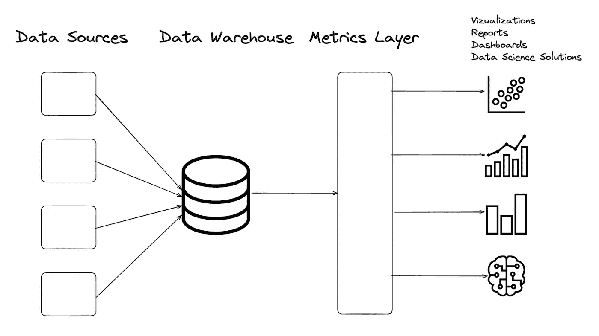
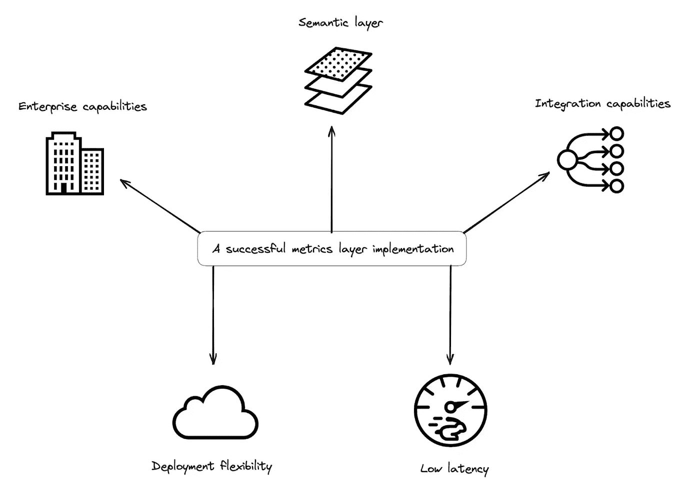

# 指标层：所有 KPI 定义的唯一真实来源

> 原文：[`towardsdatascience.com/metrics-layer-a-single-source-of-truth-for-all-kpi-definitions-671c9aa04a91`](https://towardsdatascience.com/metrics-layer-a-single-source-of-truth-for-all-kpi-definitions-671c9aa04a91)

图片由 Midjourney 生成

## 了解为什么实现指标层将使在您的组织中获取数据驱动的见解变得更加稳健！

 [Eryk Lewinson](https://eryk-lewinson.medium.com/?source=post_page-----671c9aa04a91--------------------------------)

·发布于 [Towards Data Science](https://towardsdatascience.com/?source=post_page-----671c9aa04a91--------------------------------) ·阅读时间 8 分钟·2023 年 8 月 8 日

--

指标层是一个框架，它通过以统一和直观的方式整合、分析和可视化关键绩效指标，赋能组织挖掘有价值的见解并推动数据驱动的决策。

在本文中，我们将探讨指标层的重要性、它的好处、与语义层的关键区别以及成功实施的要求。

# 什么是指标层？

**指标** **层**（也称为**指标** **存储**或**无头** **BI**）是一个用于标准化指标的框架，即集中化公司计算指标的方式。它可以被视为定义组织内 KPI（或指标，这些术语将互换使用）的唯一真实来源。

💡 ***额外小知识***：如果您想知道，“无头 BI”这一术语源于这些解决方案使各种 BI 工具能够连接到 API 以访问指标。因此，它们提供了在保持指标定义完整性的同时更换工具的灵活性。

实质上，指标层的概念并不完全陌生。例如，您已经将项目的代码库存储在一个集中式仓库中，并使用 Git 进行版本控制。类似地，组织的数据仓库或数据湖作为所有数据的唯一真实来源。类比地，指标层作为所有在组织内使用的 KPI 定义的唯一真实来源。

如下图所示，指标层应位于数据仓库（或更广义的数据源）和所有相关应用程序（如仪表板、报告、AI 模型等）之间，这些应用程序使用这些指标。

让我们进一步扩展这个定义。指标层不仅存储所有指标定义，还将应用程序生成的请求转换为 SQL。然后，该层在数据仓库/湖中执行这些请求，以检索所需的指标。

# 你为什么需要指标层？

你可能在你的组织中听到过以下一些变体：

+   *为什么在仪表板 X、Y 和 Z 上这个指标的值不同？*

+   *看来这个仪表板使用了不同的指标 X 定义。我们能否快速使所有仪表板保持一致，以传达相同的故事？*

+   *有管理层的人员询问了这个指标的定义。你能调查一下这个仪表板中的自定义查询，并确定我们实际上是如何计算它的吗？*

不幸的是，这些例子说明了数据科学家或数据分析师在日常工作中经常遇到的问题。

这些问题表明指标变得难以管理，为用户带来了混乱，无论他们是数据专业人士还是非技术利益相关者。

更糟糕的是，这些用户通常必须基于这些指标做出关键的业务决策。

## 简单指标的隐藏复杂性

随着企业的增长和发展，他们监控的指标也在变化。随着收集的数据量增加，其复杂性也随之增长。

起初看起来不直观的是，即使是看似简单的任务，如统计，也在分析中变得具有挑战性，因为在聚合原始数据时会出现许多复杂性。

为了说明这一点，让我们考虑一个许多组织都能理解的例子：计算应用程序或服务的用户数量。这应该很简单，对吗？

然而，尝试统计用户时可能会出现以下问题：

+   **确定统计用户的时间框架**：应该按天、周、月、年或其他基础进行统计吗？

+   **按地理区域对用户进行细分**：如果需要细分，应使用什么级别的详细信息？大陆、国家、省、城市等？

+   **定义** **活跃** **用户**：我们如何识别一个活跃用户？如果在特定时间段后没有交易，用户是否应被视为非活跃？如果是，这个特定时间段是什么？此外，如何处理那些登录并使用服务但没有购买的用户？“活跃用户”的定义可能会有很大的不同。

+   **应用数据过滤器或排除特定用户**：是否应根据特定标志排除某些用户？例如，是否应排除公司员工使用的测试账户？

即使是看似简单的任务，如用户计数，也涉及许多复杂性。

确保这些指标的准确性至关重要，因为在多个出口（如仪表板或报告）中不一致的 KPI 可能导致利益相关者对数据失去信任。此外，数据团队可能会极其困难地识别所有使用不同且常常相互冲突的指标定义的位置。

在这种情况下，最大的问题是没有一个中央存储库来存储指标定义。这些定义分散在各种 BI 工具和填充视图或仪表板的自定义 SQL 查询中。因此，它们常常被重新创建和重复使用，而没有适当的监督和一致性。

这就是指标层发挥作用的地方。接下来，让我们看看为您的 KPI 设置单一事实来源的好处。

# 指标层的优势

实施指标层可以确保组织内的多个人员在向不同的数据和非数据专业人员询问有关某一指标的问题时，得到一致的答案。

让我们探讨一下实施指标层的一些额外优势。

## **促进一致性并建立信任**

通过启用清晰且可重用的业务定义，指标层在组织内促进了一致性。这种一致性增强了利益相关者对数据的信任。

此外，它允许检查指标的来源——了解指标是如何构建的以及使用了哪些数据源。

## **遵循 DRY（不要重复自己）原则**

使用指标层可以避免在多个位置定义每个指标的业务逻辑。这避免了不必要的重复，并确保了管理指标定义的效率。

## **促进遵守软件工程最佳实践**

由于指标层是通过代码定义的，因此更容易遵循已建立的最佳实践。此外，还可以使用行业标准解决方案来进行指标层的版本控制，从而确保适当的跟踪。

## **为数据消费渠道提供未来保障**

有了指标层，可以减少在各种实例中使用过时指标定义的风险。这使得开发人员能够构建分析功能和数据驱动的应用程序，同时保持一致和最新的指标定义。

## **支持各种工具**

指标层的集中架构使其能够与各种工具（如 CRM 系统、BI 工具和内部开发的解决方案）无缝集成。

无论使用何种工具或其内部逻辑，最终结果都是基于标准化的指标逻辑。

## **提供单一的指标定义接口**

度量层的集中式架构提供了一个统一的界面，让组织中的所有数据利益相关者都能检查特定度量的定义方式。这促进了透明度，并确保对度量定义的共享理解。

# 为成功的度量层实现奠定基础

在探讨了度量层的定义和意义之后，现在是时候深入了解其实现方式了。

让我们研究成功实现度量层的要求。市面上有几种现成的解决方案，每种方案都有其优缺点。

然而，让我们退一步，将重点转移到任何度量层实现应具备的关键特性，以便在现代数据栈中有效地履行其角色。

成功的度量层实现需要五个核心属性：

+   强大的语义层

+   集成能力

+   低延迟的性能优化

+   部署灵活性

+   企业能力

让我们深入探讨每个属性的细节，从一个常常引起混淆的方面开始：语义层，也称为语义模型或逻辑模型。

## 度量层与语义层

**语义层**作为数据仓库中的表和列与有意义的业务实体之间的映射。语义层是企业可以使用业务友好的语言定义维度、度量和指标的地方。

💡 需要注意的是，语义层只是度量层的一个组成部分，不应与度量层本身混淆。

理想情况下，这些定义应通过直观的用户界面（UI）轻松制定，并存储在版本控制的文本文件中，通常为 YAML 或 JSON 格式。

此外，为了促进自动化，实现应提供声明式 API。

除了强大的语义层之外，还有几个其他属性对于全面的度量层实现至关重要，如上所述。让我们进一步探讨这些属性。

## 集成能力

为确保度量定义的一致性，头部无 BI 解决方案应具有与流行 BI 工具、编程语言、ML 框架和其他相关技术集成的灵活性。

这需要广泛支持基于标准的数据协议、API 和 SDK。

## 低延迟的性能优化

度量层应设计为高性能查询，使得在规模上实时访问度量成为可能。

这对于支持自动化功能如电子邮件触发和个性化产品体验至关重要。

## 部署灵活性

度量层应支持广泛的部署选项，包括完全托管服务和跨不同提供商的云原生部署。

这种灵活性使组织能够选择最适合其特定需求和基础设施的部署模型。

## 企业能力

治理、安全、访问控制、性能、可扩展性和高可用性等因素对于许多组织至关重要。

随着指标层成为各种应用、工具和流程的关键组件，它应具备企业级功能以满足组织的要求。

通过考虑这些要求，组织可以确保在其现代数据堆栈中成功实施指标层。

# 总结

许多公司仍处于数据科学和机器学习的早期阶段。因此，提高商业智能和报告可以解决他们面临的约 90%的数据相关挑战。

因此，对于这些公司来说，建立一致且集中化的指标定义至关重要。

指标层作为组织内所有 KPI 定义的权威来源。它充当数据源与依赖这些指标的各种应用（仪表板、报告、AI 模型等）之间的桥梁。

实施指标层带来了众多好处。它确保了数据的一致性和可信度，提高了操作效率，促进了最佳实践的遵循，使数据分析具备前瞻性，与不同工具集成，并为利益相关者提供统一的指标定义访问。

通过利用指标层，公司可以提高数据驱动决策过程的精确度、可靠性和整体有效性。

*喜欢这篇文章？成为 Medium 会员，继续无限制阅读学习。如果你使用* [*这个链接*](https://eryk-lewinson.medium.com/membership) *成为会员，你将以零额外成本支持我。提前感谢，期待见面！*

你可能还会对以下内容感兴趣：

[## 时序预测中交互项的综合指南](https://towardsdatascience.com/a-comprehensive-guide-on-interaction-terms-in-time-series-forecasting-16bfa468ae?source=post_page-----671c9aa04a91--------------------------------) 

### 学习如何通过使线性模型更具灵活性来改善模型的拟合。

[## 解锁线性回归中的交互项的力量](https://towardsdatascience.com/a-comprehensive-guide-on-interaction-terms-in-time-series-forecasting-16bfa468ae?source=post_page-----671c9aa04a91--------------------------------) [## 解锁线性回归中的交互项的力量](https://eryk-lewinson.medium.com/membership) 

### 学习如何通过包含交互项来使你的线性模型更具灵活性。

towardsdatascience.com](/unlocking-the-power-of-interaction-terms-in-linear-regression-ba30c2cf158f?source=post_page-----671c9aa04a91--------------------------------)  ## 使用 DVC 进行实验跟踪的极简指南

### 开始进行实验跟踪的最基本指南

towardsdatascience.com  ## 回归评估指标的全面概述

### 对常用回归评估指标及其在各种实际应用中的详细参考

towardsdatascience.com

# 参考资料

+   [`humansofdata.atlan.com/2022/05/metrics-layer-drew-banin-nick-handel/`](https://humansofdata.atlan.com/2022/05/metrics-layer-drew-banin-nick-handel/)

除非另有说明，否则所有图片均由作者提供。

*最初发表于* [*Atlan 博客*](https://atlan.com/metrics-layer/) *于 2023 年 8 月 2 日*
