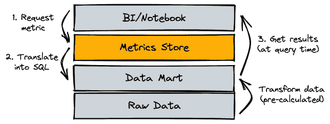
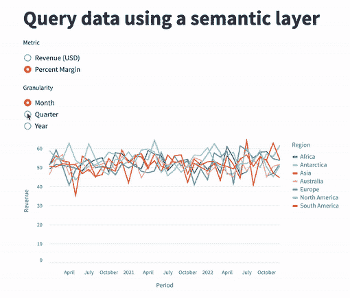

# 指标存储的实际应用

> 原文：[`towardsdatascience.com/metrics-store-in-action-76b16a928b97`](https://towardsdatascience.com/metrics-store-in-action-76b16a928b97)

## 使用 MetricFlow、Python、DuckDB、dbt 和 Streamlit 的教程

[](https://medium.com/@paul.kinsvater?source=post_page-----76b16a928b97--------------------------------)[](https://towardsdatascience.com/?source=post_page-----76b16a928b97--------------------------------) [Paul Kinsvater](https://medium.com/@paul.kinsvater?source=post_page-----76b16a928b97--------------------------------)

·发表于[Towards Data Science](https://towardsdatascience.com/?source=post_page-----76b16a928b97--------------------------------) ·阅读时间 11 分钟·2023 年 2 月 23 日

--



指标层集中定义所有关键业务指标和维度。它将指标请求转换为 SQL，抽象化了实现细节。图片由作者创建。

关于现代数据栈（MDS）的文献很多——大多数讨论围绕存储、摄取、转换和展示。今天我们聚焦于指标，这是许多其他[MDS 类别](https://www.moderndatastack.xyz/categories)中的一种。

有人说指标是语义层的一个组成部分——请参阅[这篇 Airbyte 博客文章](https://airbyte.com/blog/the-rise-of-the-semantic-layer-metrics-on-the-fly)。而我们，如同其他人一样，将“指标存储”、“指标层”和“语义层”这些术语交替使用。

## 什么是指标存储，也称为指标层，也称为语义层？

> “上个月的收入，分析师的笔记本中报告的与我们仪表盘中的不同。我们应该向审计报告哪个数据？”
> 
> “你知道我们在保留应用中如何定义流失率 KPI 吗？”
> 
> “我们如何将客户订单的收入按地理区域进行细分？”按客户账单地点？按交货地点？还是其他？

这些问题经常出现在我曾工作的公司中。我们都知道原因：不同的团队在孤岛中工作，使用他们偏好的技术栈实现指标。细节隐藏在锁定访问的数据库中的 SQL 程序中，或者在一些本地 Power BI 文件中，或在我们不知道的其他地方。指标存储就是为了解决这个问题：

1.  真实的单一来源——一个用于指标和维度的中央代码库和知识数据库。

1.  数据仓库的代理——所有的展示工具（BI、报告、笔记本）通过指标存储的一个 API 请求 KPI。

指标存储还帮助你进行治理和缓存。但这超出了这里的讨论范围。

## 转换层与指标层——如何划分界限？

转换层是 ELT 中的 “T”，在逻辑上，它排在接收原始数据（“EL”）到我们的存储之后第二位。与度量层一样，“T”步骤在下游应用程序使用数据之前进行转换。你可能会问，这两层有什么不同？“T”的责任在哪里结束，度量存储的责任从哪里开始？[Simon Späti 一针见血](https://airbyte.com/blog/the-rise-of-the-semantic-layer-metrics-on-the-fly)。

> 语义层在查询时转换/连接数据，而转换层在 ETL/ELT 的转换（T）步骤中进行，即在数据处理前已计算好。

转换层应无疑涵盖的步骤：

+   通过遵循一致的风格指南（如[这个 dbt 风格指南](https://github.com/dbt-labs/corp/blob/main/dbt_style_guide.md)），重新组织和重命名表格和列。

+   清理列数据类型，例如时间戳。

+   添加相关列，例如 margin = revenue minus cost。

+   修复已知的数据质量问题。

而汇总数据，如每月总收入，自然属于度量存储的责任。

将更多的转换步骤移到度量指标存储中会增加计算成本——远高于我们在存储方面节省的费用。因此，你可能需要将一些昂贵或经常请求的计算保留在“T”步骤中。这也是度量指标存储的[物化](https://docs.transform.co/docs/metricflow/reference/materializations/)和[缓存](https://docs.transformdata.io/docs/metricflow/reference/concepts/caching)功能可以帮助的地方。

## 为什么选择 Transform Data 的 MetricFlow

我们选择了[MetricFlow](https://docs.transform.co/docs/metricflow/guides/introduction)有三个原因：

1.  它是开源的，并且带有友好的许可证。

1.  这是一个 Python 包，适合我们在教程中使用的数据栈。而且它容易配置。

1.  [dbt Labs 将收购 MetricFlow 背后的公司](https://www.getdbt.com/blog/dbt-acquisition-transform/)——这强烈表明 MetricFlow 在未来几年将会蓬勃发展。

想了解其他竞争语义空间的工具吗？请查看[这个概述](https://www.moderndatastack.xyz/companies/metrics-store)并阅读[这篇文章](https://medium.com/@vfisa/an-overview-of-metric-layer-offerings-a9ddcffb446e)。

## 教程第一部分——设置本地环境。

我们使用[DuckDB](https://duckdb.org/)进行存储，[dbt](https://www.getdbt.com/)进行转换层，MetricFlow 作为我们的度量指标存储，以及一个[Streamlit](https://streamlit.io/)应用程序用于展示。这四个工具都是 Python 包，可以舒适地安装在[Conda 虚拟环境](https://conda.io/projects/conda/en/latest/user-guide/tasks/manage-environments.html)中。

但首先，我们需要安装 Postgres 和 MySQL，虽然我们使用的是 DuckDB，这两者都是 MetricFlow 包的依赖项。在我的 Mac 上，我需要执行以下操作：

```py
brew install postgresql mysql
```

接下来，克隆 [这个](https://github.com/kinsvater/local-mds) GitHub 仓库，`cd` 到根目录，执行

```py
conda env create -f environment.yml
```

并激活 `conda activate local-mds`。

## 教程第二部分 — 生成和探索原始数据。

以下 Python 脚本生成合成数据并将其导入本地 DuckDB 数据库：

```py
python src/generate-raw-data.py
```

“原始”数据包括四个表：accounts、sites、orders 和 fx rates。一个虚拟业务包含订单

```py
con = duckdb.connect('data/data-mart.duckdb')
con.query('select * from raw.orders limit 5').df()

       Id SiteIdDelivery  DateBooked CurrencyCode  Price   Cost          Type
0  o00000         s00018  2020-10-28          USD  13.44   9.36         Parts
1  o00001         s00032  2020-05-04          USD  84.74  49.30         Parts
2  o00002         s00009  2021-08-16          USD  76.38  41.19  Installation
3  o00003         s00025  2022-07-26          USD  25.51   9.99  Installation
4  o00004         s00038  2020-02-16          GBP  49.54  20.08         Parts
```

用不同货币预订的汇率

```py
con.query('select * from raw.fx_rates limit 5').df()

   Year        Currency  Rate
0  2020            Euro  1.10
1  2021            Euro  1.20
2  2022            Euro  1.15
3  2020  Pound Sterling  1.30
4  2021  Pound Sterling  1.40
```

并交付到网站

```py
con.query('select * from raw.sites limit 5').df()

       Id SiteOwnerId         Region
0  s00000      a00000     Antarctica
1  s00001      a00001         Europe
2  s00002      a00002  South America
3  s00003      a00003  South America
4  s00004      a00004  South America
```

由拥有账户的客户拥有

```py
con.query('select * from raw.accounts limit 5').df()

       Id                 CompanyName  BillingRegion
0  a00000         Cisco Systems, Inc.     Antarctica
1  a00001     Asbury Automotive Group         Europe
2  a00002                Helping Hand  South America
3  a00003  Buena Vista Realty Service  South America
4  a00004         The Pink Pig Tavern  South America
```

## 教程第三部分 — 使用 dbt 转换数据。

我们的 git 仓库已经包含了一个名为 *data_mart* 的 dbt 项目。使用 dbt 转换数据就像编写 SQL 模板并将其放入“models”目录 `data_mart/models/` 一样简单。

我们遵循 [dbt 的风格指南](https://github.com/dbt-labs/corp/blob/main/dbt_style_guide.md)。首先，我们在 `models/staging/` 中创建一个“staging”模式。每个暂存模型都通过简单的重命名、转换和其他操作镜像原始数据。我们通过

```py
-- data_mart/models/staging/stg_fx_rates.sql
select
    Year::integer as year,
    Currency as currency_name,
    Rate as to_usd_rate
from raw.fx_rates
```

其他三个暂存表遵循非常类似的逻辑。

暂存层不应该被下游应用程序直接消费。为此，我们创建了第二层也是最终的转换层，“marts”。我们将货币名称解析为代码，以便它们与我们的订单中的代码匹配：

```py
-- data_mart/models/marts/fct_fx_rates.sql
select
    year,
    case
        when currency_name = 'Euro' then 'EUR'
        when currency_name = 'Pound Sterling' then 'GBP'
        else null
    end as currency_code,
    to_usd_rate
from {{ ref('stg_fx_rates') }}
```

我们使用这些汇率将所有订单金额转换为美元：

```py
-- data_mart/models/marts/fct_orders.sql
with orders as (
    select *,
        extract('year' from booked_date)::integer as booked_year
    from {{ ref('stg_orders') }}
), rates as (
    select * from {{ ref('fct_fx_rates') }}
)

select
    orders.order_id,
    orders.deliver_to_site_id,
    orders.order_type,
    orders.currency_code,
    orders.order_price_lcu,
    orders.order_cost_lcu,
    orders.order_price_lcu * rates.to_usd_rate as order_price_usd,
    orders.order_cost_lcu * rates.to_usd_rate as order_cost_usd,
    orders.booked_date
from orders
left join rates
    on orders.booked_year = rates.year and orders.currency_code = rates.currency_code
```

注意我们如何引用最终的汇率表 — 这正是 dbt 发挥作用的地方！同时，也请注意，我们需要临时添加一个年份列，以便根据年份和货币代码连接汇率。

其他两个最终表只是暂存表的 1 对 1 复制，这使我们的 dbt 建模完成。我们通过以下三个步骤完成 dbt 练习：

1.  我们将暂存物化为视图，将最终层物化为表，正如 dbt 风格指南中推荐的那样。我们可以通过更改 dbt 项目配置文件来最舒适地完成此操作：

```py
# bottom of data_mart/dbt_project.yml
models:
  data_mart:
    +materialized: table
    staging:
      +materialized: view
      +schema: staging
    marts:
      +materialized: table
      +schema: marts
```

2\. 我们配置与数据库的连接：

```py
# $HOME/.dbt/profiles.yml
data_mart:
  outputs:
   dev:
     type: duckdb
     path: <path-to-data-mart.duckdb>  # replace with absolute path
  target: dev
```

3\. 最后，我们在命令行中将所有模型物化为数据库中的表：

```py
dbt run --project-dir data_mart/
```

我们可以通过查询任何新表来验证这一步。比如，

```py
con = duckdb.connect('data/data-mart.duckdb')
con.query('select * from main_marts.fct_orders limit 5').df()

  order_id deliver_to_site_id  ... order_cost_usd booked_date
0   o00000             s00048  ...        10.2960  2020-10-28
1   o00010             s00033  ...        86.1250  2020-01-21
2   o00014             s00039  ...        20.8725  2022-04-25
3   o00015             s00035  ...        32.8580  2021-08-18
4   o00019             s00026  ...         0.3410  2020-07-27
```

## 教程第四部分 — 指标和维度

回顾一下，指标存储定义了指标以及我们可以在哪些维度上计算这些指标。专门的地方在于我们 git 仓库根目录下的 `metrics/` 目录。

MetricFlow 中的两个主要对象是数据源和指标。与 dbt 不同的是，我们在 YAML 中配置这些对象。然后，由指标存储负责将请求转换为 SQL 并在我们的数据库中执行它们。

让我们先从指标的规范开始。我们在同一个 YAML 文件中定义了两个：

```py
# metrics/metrics.yml
metric:
  name: order_revenue_usd
  type: measure_proxy
  type_params:
    measure: order_revenue_usd
---
metric:
  name: order_margin_percent
  type: expr
  type_params:
    expr: (order_profit_usd / order_revenue_usd) * 100
    measures:
      - order_profit_usd
      - order_revenue_usd
```

MetricFlow 提供了几种不同的方法来定义度量，选择几种[类型](https://docs.transform.co/docs/metricflow/reference/metrics/)。类型**measure_proxy**接受任何已定义的度量并应用其默认的聚合策略。类型**expr**允许我们使用 SQL 语法。我们在数据源中定义度量和聚合策略。以下是我们对源**orders**的规范：

```py
# metrics/source_orders.yml
data_source:
  name: orders  # must be unique across all sources
  description: Master table customer orders.
  sql_table: main_marts.fct_orders  # the corresponding database table
  identifiers:  # primary and foreign keys
    - name: order_id
      type: primary
    - name: site_id
      type: foreign
      expr: deliver_to_site_id
  measures:
    - name: order_revenue_usd
      description: The total order revenue in USD.
      expr: order_price_usd
      agg: sum
    - name: order_profit_usd
      description: The profit of orders in USD.
      expr: order_price_usd - order_cost_usd
      agg: sum
  dimensions:  # temporal or categorical attributes, or "dimensions"
    - name: order_type
      type: categorical
    - name: booked_date
      type: time
      type_params:
        is_primary: true
        time_granularity: day
  mutability:  # only relevant for caching
    type: immutable
```

我们可以在相应部分指定的每个维度上汇总度量。通过使用指定的外键标识符，我们甚至可以使用来自其他数据源的维度进行汇总。

一个“标识符”指向一个外部数据源，即

```py
# metrics/source_sites.yml
data_source:
  name: sites
  description: Master table customer sites.
  sql_table: main_marts.dim_sites
  identifiers:
    - name: site_id
      type: primary
    - name: account_id
      type: foreign
      expr: owner_account_id
  dimensions:
    - name: site_region
      type: categorical
  mutability:
    type: immutable
```

有了这个，我们可以计算不同站点区域的订单指标。由于站点通过另一个外键规范与账户相关联，我们甚至可以跨站点客户维度计算订单指标。

使用 YAML 的关键点在于其简洁性。你不需要深入的工程经验就能理解规范。下次业务询问你某个度量是如何定义的，请指向 YAML 中的相应规范。

最后，我们需要[将 MetricFlow 连接到我们的数据库](https://docs.transform.co/docs/deployment/install-deploy)：

```py
# $HOME/.metricflow/config.yml
model_path: <path-to-the-metrics-directory>  # <repo-root>/metrics
dwh_schema: main_marts
dwh_dialect: duckdb
dwh_database: <path-to-data-mart.duckdb>  # <repo-root>/data/data-mart.duckdb
```

你可以通过在命令行上执行以下操作来验证连接：

```py
mf health-check
```

## 教程第五部分 — MetricFlow API 实践

传统上，度量定义在多个地方：隐藏在 BI 应用程序、报告实现、Jupyter 笔记本等中。我们通过将度量和维度移动到一个地方——度量存储，克服了这个问题。但这项变更只有在我们的度量存储与数据栈良好集成时才有效。我们的 BI 应用引擎知道如何与 MetricFlow 通信吗？对一些应用是正确的，但对许多其他应用是不正确的。

和许多其他 MDS 类别一样，*与当前技术栈的集成*将驱动你对度量存储解决方案的选择。下面我们使用 MetricFlow 的 CLI 和 Python 接口。后者适用于任何使用 Python 的 BI 工具，如 Streamlit。

我们从命令行的第一个示例开始：

```py
mf query --metrics order_revenue_usd --dimensions booked_date__year --order booked_date__year

✔ Success 🦄 - query completed after 0.25 seconds
| booked_date__year   |   order_revenue_usd |
|:--------------------|--------------------:|
| 2020-01-01 00:00:00 |           290906.78 |
| 2021-01-01 00:00:00 |           316765.36 |
| 2022-01-01 00:00:00 |           196059.51 |
```

我们使用了两个配置度量中的一个，并将时间作为唯一维度。请注意，MetricFlow 允许我们通过简单地添加**__year**来切换到年度粒度。[查看文档以了解其他选项](https://docs.transform.co/docs/metricflow/reference/data-sources/dimensions#time-dimensions)。

第二个示例通过使用第二个度量和来自外键关系的第二个维度增加了复杂性：

```py
mf query --metrics order_revenue_usd,order_margin_percent --dimensions booked_date__year,site_id__account_id__account_region --order booked_date__year

✔ Success 🦄 - query completed after 0.56 seconds
| booked_date__year   | site_id__account_id__account_region   |   order_revenue_usd |   order_margin_percent |
|:--------------------|:--------------------------------------|--------------------:|-----------------------:|
| 2020-01-01 00:00:00 | North America                         |            41072.23 |                  54.35 |
| 2020-01-01 00:00:00 | South America                         |            74438.04 |                  50.04 |
| 2020-01-01 00:00:00 | Asia                                  |            11014.66 |                  53.45 |
| 2020-01-01 00:00:00 | Europe                                |            16931.01 |                  50.34 |
| 2020-01-01 00:00:00 | Australia                             |            86869.00 |                  50.86 |
| 2020-01-01 00:00:00 | Antarctica                            |            16628.68 |                  54.75 |
| 2020-01-01 00:00:00 | Africa                                |            43953.17 |                  51.79 |
| 2021-01-01 00:00:00 | Africa                                |            41805.07 |                  51.56 |
| 2021-01-01 00:00:00 | Australia                             |            96069.27 |                  52.88 |
| 2021-01-01 00:00:00 | Antarctica                            |            20648.17 |                  52.80 |
| 2021-01-01 00:00:00 | North America                         |            42920.44 |                  53.30 |
| 2021-01-01 00:00:00 | South America                         |            83231.81 |                  51.95 |
| 2021-01-01 00:00:00 | Europe                                |            19789.86 |                  52.43 |
| 2021-01-01 00:00:00 | Asia                                  |            12300.75 |                  53.04 |
| 2022-01-01 00:00:00 | South America                         |            51114.66 |                  50.94 |
| 2022-01-01 00:00:00 | Africa                                |            27058.34 |                  53.68 |
| 2022-01-01 00:00:00 | Europe                                |            11311.23 |                  55.24 |
| 2022-01-01 00:00:00 | Asia                                  |             8608.74 |                  51.16 |
| 2022-01-01 00:00:00 | North America                         |            27818.37 |                  56.11 |
| 2022-01-01 00:00:00 | Australia                             |            60342.90 |                  50.47 |
| 2022-01-01 00:00:00 | Antarctica                            |             9805.27 |                  54.43 |
```

接下来，我们用以下命令启动我们的 Streamlit 应用：

```py
streamlit run src/app.py
```



在应用程序的实现细节中，你将找到后端如何在显示数据之前提取数据：

```py
import streamlit as st
from metricflow import MetricFlowClient

client = MetricFlowClient.from_config()

@st.cache_data
def load_data(metric: str, granularity: str = 'month'):
    data = client.query(metrics=[metric],
                        dimensions=['site_id__site_region', f'metric_time__{granularity}'],
                        order=[f'metric_time__{granularity}']).result_df

    data.columns = ['Period', 'Region', metric]
    return data
```

再次是 MetricFlow 在幕后完成繁重的工作。不论我们选择哪种 MetricFlow API，数据都将是相同的。

## 结论

你是否也厌倦了讨论为什么在不同的应用程序中“相同”维度上的“相同” KPI 显示不同的数字？另一方面，如果对像上个季度总收入这样基本的事情没有共识，也是很烦人的。那么，哪里出了问题？以下是我个人经验中的一些例子：

+   销售部门通过“关闭日期”将收入记录分配到一个季度，而财务部门则通过“记账日期”来分配。

+   在聚合之前，需要删除一些收入记录，例如，因为它们与取消相关。这些规则可能比通过单个布尔“IsValid”列进行过滤更复杂。有时，不同的业务单元之间没有达成共识。不同的规则在雷达下被应用。

+   我们有不同货币的交易。对于每个时间点，应用哪个汇率也没有共识。

避免这些陷阱的唯一方法是：停止在孤立环境中实施转型管道。相反，使用单一的数据模型和一个地方来定义指标和维度。销售和财务是否都需要自己的收入 KPI？创建两个，并将它们放入指标库中，以便每个人都能解释差异。
