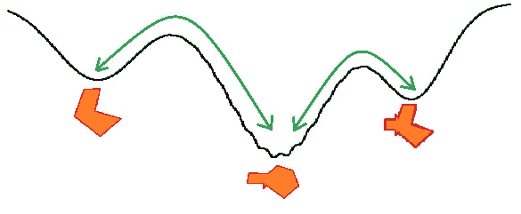
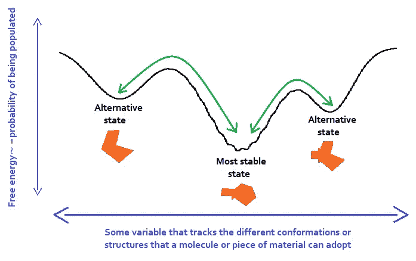

# 微软的新 AI 方法预测分子如何移动和功能

> 原文：[`towardsdatascience.com/microsofts-new-ai-method-to-predict-how-molecules-move-and-function-93d47e246b5d`](https://towardsdatascience.com/microsofts-new-ai-method-to-predict-how-molecules-move-and-function-93d47e246b5d)

## 被称为“Distributional Graphormer”的技术，可能会启动 AI 在化学和生物科学领域的下一步革命。

 [LucianoSphere (Luciano Abriata, PhD)](https://lucianosphere.medium.com/?source=post_page-----93d47e246b5d--------------------------------)

·发布于 [Towards Data Science](https://towardsdatascience.com/?source=post_page-----93d47e246b5d--------------------------------) ·阅读时间 9 分钟·2023 年 7 月 20 日

--

图 1\. 分子（橙色）的草图，采用三种不同的结构（x 轴），每种结构具有不同的能量（y 轴）。这被称为分子由于运动可以探索的“构象景观”。局部或全局最小值的能量越低，分子在结构间的转换时间就越长（绿色箭头）。虽然像 AlphaFold 这样的常规结构预测方法旨在找到对应于最低能量结构的中心最小值，但现在的圣杯是找到可能结构的完整分布及其概率。见图 2 和文本以获取更多解释。图片由作者绘制。

*“我们能否不仅预测静态蛋白质结构，还能预测其结构多样性？”*——这是我大约一年前在 AlphaFold 2 的兴奋逐渐平息时提出的问题：

 [## 我们能否不仅预测静态蛋白质结构，还能预测其结构多样性？

### 最近的一项研究以特殊方式应用 AlphaFold 2，表明这可能是可行的。

medium.com](https://medium.com/advances-in-biological-science/can-we-predict-not-only-static-protein-structures-but-also-their-structural-diversity-fa1d9380fc34?source=post_page-----93d47e246b5d--------------------------------)

看起来，微软的团队将人工智能应用于科学（与一位著名教授合作，见最后的注释）可能会首先以“是”的答案来回应我的问题。他们刚刚展示了他们的新型“Distributional Graphormer”，它不仅可以预测单一分子结构（蛋白质或其他分子或材料），还可以实际预测分子或材料在三维空间中可以采用的多种替代结构（或“构象”）。也就是说，它们的原子在空间中可以采取的不同排列。此外，新的 AI 模型还“理解”不同结构将具有不同的能量，从而在不同程度上被占据；因此，新的模型可以训练来预测在分子运动过程中不同构象之间的热力学交换。

在其第一个版本中实现的 Distributional Graphormer 可以解析任何类型的分子。事实上，介绍该模型的预印本描述了其在预测蛋白质运动（我在上面的问题中称之为“结构多样性”）、蛋白质如何结合小分子（包括酶底物、药物、代谢物等）、分子如何在催化剂表面吸附以及碳结构如何在电子导电性质上进行调节等任务中的应用示例。

阅读下去可以详细了解这些内容，进一步了解模型，并掌握它可能对现代化学和生物学的影响。

# Graphormer 的演变

微软的新 Distributional Graphormer 源自他们在 2021 年推出的 Graphormer，旨在加速从制药到材料的分子科学 AI 研究和应用。Graphormer 本身是一个深度学习算法和包，帮助研究人员和开发人员训练用于分子建模任务的自定义模型。

作为一种算法，Graphormer 是一种改进的变换器，更好地处理图表示，特别适用于描述神经网络中的分子，将其结构编码到模型中。例如，看看这些描述符如何帮助神经网络处理分子[这里](https://medium.com/towards-data-science/new-preprint-describes-a-novel-parameter-free-geometric-transformer-of-atomic-coordinates-to-c6545150855e)或这里。要了解更多，请查看这篇预印本，微软团队介绍了几种简单但有效的结构编码方法，并描述了 Graphormer 的表现力，包括具体示例。

 [## Transformer 在图表示中表现真的很差吗？

### Transformer 架构已经在许多领域成为主流选择，例如自然语言处理等。

[arxiv.org](https://arxiv.org/abs/2106.05234?source=post_page-----93d47e246b5d--------------------------------)

作为一个包，Graphormer 提供了对各种分子模拟任务的支持，例如分子动力学模拟和属性预测，这两个元素都用于新工作：模拟以探究分子如何移动以改变原子的位置，从而根据需要改变形状，例如蛋白质构象探索；以及属性预测，例如将分子结构与属性相关联，如碳结构调节电子导电性。你可以在这里了解关于这个包的更多信息，包括研究人员和开发人员对它进行的多个测试：

[## Graphormer - Microsoft Research](https://www.microsoft.com/en-us/research/project/graphormer/?source=post_page-----93d47e246b5d--------------------------------)

### Graphormer 是一个深度学习包，允许研究人员和开发人员训练自定义分子模型……

[www.microsoft.com](https://www.microsoft.com/en-us/research/project/graphormer/?source=post_page-----93d47e246b5d--------------------------------)

# 在预测静态结构之后，AI 进入分子运动的预测

如果应用于科学的 AI 方法到目前为止主要集中在预测“静态”分子结构上，例如 AlphaFold 2 的成功 (参见[这里](https://lucianosphere.medium.com/here-are-all-my-peer-reviewed-and-blog-articles-on-protein-modeling-casp-and-alphafold-2-d78f0a9feb61))，那么最终目标现在转向一个更加困难的目标：理解分子结构如何与功能相关。

这需要理解属性是如何从结构中产生的，即从空间中原子的三维排列，以及这些排列如何随着时间变化。后者被称为“内部分子动力学”，指的是原子相对彼此的位移，与简单扩散不同，后者中所有原子一起移动和旋转，从而整体上不改变分子的形状。这里有两个经历这种“内部动态”的分子系统的例子，通过经典物理模拟 - 首先是一个碳纳米管的振动，其次是一个蛋白质的折叠：

内部分子动力学，简称“分子动力学”或“结构构象”，源于非常快速且几乎是随机的热原子运动与较慢但规模更大且协调的多个原子的集体运动之间的耦合。举例来说，两个相互连接的原子可能在飞秒到皮秒的时间尺度上振动，而对其周围环境并不“察觉”，但由于热波动而运动的一堆相互连接的原子会在纳秒或微秒时间尺度上逐渐演化出集体运动，这可能导致分子的一部分发生显著移动，从而改变其整体形状和性质。

例如，在蛋白质中，平均结构中可能无法接触到的区域可能会因其内部动态而暂时暴露，从而允许例如底物分子的进入。这在蛋白质研究中被广泛研究，因为它是大多数甚至所有蛋白质功能的核心——这一主题我从“经典”分子动力学计算的角度在这里有所提及：

 [## 计算机建模、模拟和人工智能如何影响蛋白质工程…

### 各种复杂程度、成功率和应用的计算方法概述，以及关键…

medium.com](https://medium.com/advances-in-biological-science/how-computer-modeling-simulations-and-artificial-intelligence-impact-protein-engineering-in-4d8473bd59ff?source=post_page-----93d47e246b5d--------------------------------)

文章中描述的模拟类型，本质上是模拟物理并整合牛顿运动方程，这些模拟非常强大，但在计算能力方面要求极高，因此运行速度非常慢，更不用说收敛了。因此，如果能够在不实际运行任何分子模拟的情况下快速预测分子可以采用的替代构象及其运动方式，那将是一个巨大的进步。这正是许多大型人工智能实验室目前正在追求的目标，微软的新模型也许会有所不同。

微软的*分布式图形变换器*提供了一个初步的方法，这是一种深度学习框架，能够处理不仅是单一而是多个分子的结构或材料的结构，还包括热力学景观，这些景观衡量了观察每种结构的可能性。当我们谈论一个蛋白质及其结构时，我们通常指的是一个通过实验确定或建模的非常稳定的构象。但一个真实的蛋白质溶液包含无数个副本，每个副本都采用来自一组可能状态中的某种结构，这些状态有不同的观察概率。在这个“景观”选项中，最稳定的结构（就自由能而言，即能量和熵的组合）是最常见的，这意味着在某一时刻更多的分子副本会采用对应的结构。更重要的是，由于其内部动态，蛋白质可以改变其结构，从而有效地“跳跃”到另一个常见状态，在短暂的时间内通过一个由自由能不青睐的“非可能”状态进行过渡。通常，由于热波动，蛋白质会持续改变结构，平均而言更多时间保持在最稳定的状态。所有可能结构及其分布的集合就是所有生物学家希望预测的“热力学构象景观”——而且即使通过实验也非常难以获得。

图 2\. 一个非常简单的、一维的分子构象景观（橙色），它可以采用比如说三种主要结构：最稳定的一个在中心，通常是通过实验方法“确定”的或通过常规结构预测方法“预测”的；还有两个具有稍高自由能的替代状态，这意味着在给定的温度下它们的存在几率较低。真实的构象景观是多维的，因为多个分子自由度可以贡献于结构的多样性。图中的绿色线条示例了状态之间的过渡路径，这实际上发生在真实分子中的多个维度上。图由作者绘制。

## **分布式变换器**的作用

尽管机器学习在过去 3 到 4 年里通过 AlphaFold 对蛋白质的特定应用极大地改善了分子结构预测，但许多现实世界的应用需要理解从结构分布中得出的宏观观察，而不是单一的结构——即我刚刚解释的构象景观。科学家们用来采样这些分布的常规方法，通常基于分子动力学模拟，使用某种物理或数据驱动的势能模型，计算开销很大。非常昂贵。

微软的 Distributional Graphormer 是首个解决这一挑战的工具，它通过利用深度神经网络将简单的起始分布（如高斯分布）转化为通过分子系统描述符条件化的平衡分布的预测。简单分布到粗略景观的扩展是通过类似于热力学中的模拟退火模拟的扩散过程实现的。

为了指导状态分布的学习，该架构可以在转换过程中使用不同类型的数据或信息进行训练，例如专门构建的能量函数、通过分子动力学模拟生成的数据等。在训练过程中，Distributional Graphormer 旨在最小化为每个状态预测的概率与作为训练提供的概率之间的差异。

值得注意的是，这种方法允许利用系统的先验知识，对于广泛研究的分子而言，这种知识可能相当丰富。但显然，Distributional Graphormer 也表现出良好的泛化能力，这可能是因为它继承了先进深度学习架构的优点，并将其应用于分布预测这一新的挑战性任务。

# 多样性通过不同的应用场景得到验证

Distributional Graphormer 高效地生成多样的构象，并提供状态密度的估计，从而接近对相关分子构象景观的描述。展示 Distributional Graphormer 的预印本和博客文章已经展示了该框架在多个分子任务中的应用，包括蛋白质构象采样、配体与蛋白质结构结合、分子在催化剂上的吸附以及通过调节材料属性引导结构生成。

在蛋白质构象采样中，如果你关注我的工作，你会知道我可以更深入地探讨，Distributional Graphormer 被证明能够成功生成一些研究较多的蛋白质的结构和构象景观，与分子动力学模拟相比，展示了良好的构象景观覆盖范围，但生成速度要快得多。一些例子还展示了该模型生成具有多个实验上已知的亚稳态结构的蛋白质功能性构象状态的能力。此外，这些例子还展示了在某些情况下，Distributional Graphormer 输出的构象景观预测了不同构象之间相互转换的合理路径，从而更深入地理解蛋白质动态。

在配体结合结构生成中，分布图变换器被展示为能够预测配体在多个示例蛋白质的口袋中的结合姿态。一个类似的任务，但涉及完全不同类型的原子，证明了模型框架的灵活性，预印本和博客展示了它如何有效地采样催化表面的吸附体配置，这对理解催化过程至关重要。

最后，预印本和博客展示了该模型如何通过电子带隙预测器实现基于属性的结构生成。通过逐步优化简单的分布，该模型生成了具有目标带隙值的碳结构，包括一些已知的碳晶体，如钻石和石墨。

上述示例表明，至少核心思想在分布图变换器中得到了实现，并且在有足够的训练数据的情况下，它可以成为一个非常强大的工具。毫无疑问，它可以促进深度学习在分子系统中进一步发展，对制药、生物技术、材料科学等领域产生直接影响。作为基础模型，它还可以为分子科学领域开辟新的研究机会，并通过数据构建为复杂分子系统的统计理解铺平新道路。

# 参考文献

由微软 AI4Science 和量子部门的研究人员主导的 arXiv 预印本，包括科学家 Frank Noe。后者是柏林自由大学的微软合作研究经理，是我最欣赏的现代科学家之一。他是分子模拟领域中较年轻的世界领导者之一，将严谨的理论方法与务实的应用结合在一起。他现在当然在大量探索 AI 方法，提出了深度学习系统辅助分子模拟的第一个要素，如 Boltzmann Generator。过去，他做出了各种贡献，其中最有趣的是他开创了使用马尔科夫状态模型描述分子力学的方法。

 [## 预测分子系统的平衡分布的深度学习方法

### 深度学习的进展大大提升了分子结构预测的能力。然而，许多宏观…

[arxiv.org](https://arxiv.org/abs/2306.05445?source=post_page-----93d47e246b5d--------------------------------)

微软的两个类似博客的条目，以更易于理解的格式解释了这项工作：

[## 预测分子系统的平衡分布的深度学习方法

### 预测分子系统的平衡分布的深度学习方法

[分布式图变换器：朝着分子系统平衡分布预测的方向](https://distributionalgraphormer.github.io/?source=post_page-----93d47e246b5d--------------------------------)  [## 分布式图变换器：朝着分子系统平衡分布预测的方向

### 分布式图变换器，微软新推出的深度学习框架，用于预测…

www.microsoft.com](https://www.microsoft.com/en-us/research/blog/distributional-graphormer-toward-equilibrium-distribution-prediction-for-molecular-systems/?source=post_page-----93d47e246b5d--------------------------------)

[***www.lucianoabriata.com***](https://www.lucianoabriata.com/) *我写作和拍摄关于我广泛兴趣范围内的一切：自然、科学、技术、编程等。*

[***在这里小费我***](https://lucianoabriata.altervista.org/office/donations.html) 或 [***成为 Medium 会员***](https://lucianosphere.medium.com/membership) *以访问所有故事（我会获得少量收入，对你没有成本）。* [***订阅以获取我的新故事***](https://lucianosphere.medium.com/subscribe) ***通过电子邮件****。 ***关于小工作的咨询*** *请在我的* [***服务页面***](https://lucianoabriata.altervista.org/services/index.html)*。你可以* [***在这里联系我***](https://lucianoabriata.altervista.org/office/contact.html)***。***
