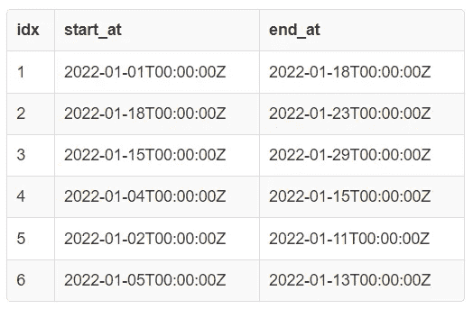

# SQL 中的最小会议室问题

> 原文：[`towardsdatascience.com/minimum-meeting-rooms-problem-in-sql-4d3a92365bdf?source=collection_archive---------18-----------------------#2023-01-05`](https://towardsdatascience.com/minimum-meeting-rooms-problem-in-sql-4d3a92365bdf?source=collection_archive---------18-----------------------#2023-01-05)

## 计算（在 SQL 中）安排一组会议所需的最小会议室数量

[](https://medium.com/@dhruvbird?source=post_page-----4d3a92365bdf--------------------------------)[](https://towardsdatascience.com/?source=post_page-----4d3a92365bdf--------------------------------) [Dhruv Matani](https://medium.com/@dhruvbird?source=post_page-----4d3a92365bdf--------------------------------)

·

[关注](https://medium.com/m/signin?actionUrl=https%3A%2F%2Fmedium.com%2F_%2Fsubscribe%2Fuser%2F63f5d5495279&operation=register&redirect=https%3A%2F%2Ftowardsdatascience.com%2Fminimum-meeting-rooms-problem-in-sql-4d3a92365bdf&user=Dhruv+Matani&userId=63f5d5495279&source=post_page-63f5d5495279----4d3a92365bdf---------------------post_header-----------) 发表在 [Towards Data Science](https://towardsdatascience.com/?source=post_page-----4d3a92365bdf--------------------------------) ·5 分钟阅读·2023 年 1 月 5 日[](https://medium.com/m/signin?actionUrl=https%3A%2F%2Fmedium.com%2F_%2Fvote%2Ftowards-data-science%2F4d3a92365bdf&operation=register&redirect=https%3A%2F%2Ftowardsdatascience.com%2Fminimum-meeting-rooms-problem-in-sql-4d3a92365bdf&user=Dhruv+Matani&userId=63f5d5495279&source=-----4d3a92365bdf---------------------clap_footer-----------)

--

[](https://medium.com/m/signin?actionUrl=https%3A%2F%2Fmedium.com%2F_%2Fbookmark%2Fp%2F4d3a92365bdf&operation=register&redirect=https%3A%2F%2Ftowardsdatascience.com%2Fminimum-meeting-rooms-problem-in-sql-4d3a92365bdf&source=-----4d3a92365bdf---------------------bookmark_footer-----------)

图片由 [Dane Deaner](https://unsplash.com/@danedeaner?utm_source=medium&utm_medium=referral) 提供，来源于 [Unsplash](https://unsplash.com/?utm_source=medium&utm_medium=referral)

会议室问题要求你确定安排所有会议所需的最少会议室数量，以便能够避免冲突。我们将探讨如何仅使用声明性 SQL 来解决这个问题。

**上一篇文章**: 使用 SQL 验证平衡括号

# 问题陈述

给定一组会议的开始和结束时间（均包括在内），确定安排所有会议所需的最少会议室数量，以避免任何冲突（即，会议室在会议进行时应始终可用，并且不能有两个会议在同一会议室内的时间重叠）。

## 在线讨论

这个问题在编程圈子里相当流行，你可以在这里找到相关讨论：

1.  [Geeksforgeeks](https://www.geeksforgeeks.org/minimum-halls-required-for-class-scheduling/)

1.  [InterviewBit](https://www.interviewbit.com/problems/meeting-rooms/)

1.  [Javapoint](https://www.javatpoint.com/minimum-number-of-meeting-room-required-problem-in-java)

实际上，也有关于用 SQL 解决这个问题的讨论（这在我所覆盖的文章类型中通常较少见）。

1.  [一个很酷的 SQL 问题（以及它为何也是一个狗屎 SQL 问题）](https://ryxcommar.com/2019/06/24/a-cool-sql-problem-and-why-it-is-also-a-bullshit-sql-problem/)

1.  [(Stack Overflow) 在 MySQL 中容纳所有会议所需的最少会议室数量](https://stackoverflow.com/questions/48356312/minimum-number-of-meeting-rooms-required-to-accomodate-all-meetings-in-mysql)

# 输入表模式

输入表看起来像这样：

```py
CREATE TABLE meetings(
  idx SERIAL PRIMARY KEY,
  start_at TIMESTAMP NOT NULL,
  end_at TIMESTAMP NOT NULL
);
```

这些列的含义如下：

1.  **idx**：此会议的索引（唯一 ID）

1.  **start_at**：会议开始时的时间戳

1.  **end_at**：会议结束时的时间戳（会议被视为包括此时间戳，因此在此时间戳开始的会议不能与该会议安排在同一房间）。

```py
INSERT INTO meetings(start_at, end_at) VALUES
-- { 1, 18 }, { 18, 23 }, { 15, 29 }, {4, 15}, {2, 11}, {5, 13} 
('01/01/2022', '01/18/2022'),
('01/18/2022', '01/23/2022'),
('01/15/2022', '01/29/2022'),
('01/04/2022', '01/15/2022'),
('01/02/2022', '01/11/2022'),
('01/05/2022', '01/13/2022');

SELECT * FROM meetings;
```



提供数据的输入表（作者提供的图片）

# 第一种解决方案：O(n²)

这个解决方案在上述在线文章中讨论，这些文章讲述了如何使用 SQL 解决这个问题。

主要思路是应该查看第一个和最后一个安排会议的时间戳之间的每一个时间点（例如每秒），并检查有多少会议与该时间点重叠。

可以进行的优化是，不必检查每个时间点，而只检查“有趣”的时间点——即会议开始或结束的时间点。这是因为在任何两个这样的“有趣”时间点之间，安排的会议数量不会发生变化。

这个解决方案的时间复杂度是**O(n²)**，因为我们需要将每个会议**O(n)**与每个唯一的时间点**O(n)**（即会议的开始或结束时间点）匹配。

```py
WITH unique_time_points AS (
  SELECT ts
  FROM (
    SELECT start_at AS ts
    FROM meetings

    UNION

    SELECT end_at AS ts
    FROM meetings
  ) AS start_and_end_ts
),

joined AS (
  SELECT
    lhs.ts, COUNT(rhs.idx) AS num_overlaps
  FROM unique_time_points lhs INNER JOIN meetings rhs
  -- Join condition checks how many scheduled meetings intersect
  -- the point "ts".
  ON lhs.ts BETWEEN rhs.start_at AND rhs.end_at
  GROUP BY lhs.ts
  ORDER BY lhs.ts ASC
)

SELECT * FROM joined;
```


第一种解决方案的输出（作者提供的图片）

在这里，我们可以看到安排所有会议所需的最少会议室数量是 4。这发生在时间点 2022-01-05 和 2022-01-11 之间。

上述输出的图形表示。


第一种解决方案的输出图形视图（作者提供的图片）

**预计成本：** 对于一个有 6 行的表格，这个查询的预计成本是[104k](https://explain.depesz.com/s/veps)。

# 第二种解决方案：O(n log n)

该解决方案的主要思想是，一旦你有了所有会议开始和结束的唯一时间点，就可以简单地跟踪这些时间点上有多少个“进行中的”会议。

**计数器：** 当遇到开始时间点时，我们需要递增一个计数器（running_sum），而当遇到会议结束时间点时，我们需要递减这个计数器。

**计数重叠：** 对于在特定时间点开始和结束的会议，我们需要注意首先递增计数器，然后再递减，因为会议被认为完全占用其结束时间点。因此，我们有这样的代码：*ORDER BY ts ASC,* ***delta DESC*** — 即如果我们不按 delta 降序排序，那么可能会在开始时间点之前处理结束时间点，这会导致重叠会议数量的低估。

该解决方案的运行时复杂度是**O(n log n)**，因为它由对所有唯一时间点按时间戳的非递减顺序排序的成本主导。

```py
WITH unique_time_points AS (
  SELECT start_at AS ts, +1 AS delta
  FROM meetings

  UNION

  SELECT end_at AS ts, -1 AS delta
  FROM meetings
),

with_running_sum AS (
  SELECT
    ts,
    delta,
    -- We need to process time points in "ts" order. Also in case
    -- there are multiple time points, we need to first process a
    -- meeting start and then a meeting end since a meeting end is
    -- assumed to occupy its end timepoint. This ensures that we
    -- don't under-count the number of simultaneously scheduled
    -- meetings.
    SUM(delta) OVER (ORDER BY ts ASC, delta DESC) AS running_sum
  FROM unique_time_points
)

SELECT * FROM with_running_sum;
```


第二种解决方案的输出（作者提供的图片）

我们可以看到，安排所有会议而不发生冲突所需的最小会议室数量（4）在 2022 年 1 月 5 日至 2022 年 1 月 11 日之间（与上面的解决方案相同）。

上述输出的图形表示。


第二种解决方案的输出图形视图（作者提供的图片）

**预计成本：** 对于一个有 6 行的表格，这个查询的预计成本是[474](https://explain.depesz.com/s/2OVR)。

# SQL Fiddle

本文中所有解决方案的 SQL Fiddle 链接可以在[这里](http://sqlfiddle.com/#!17/75a65/7)找到。

# 结论

这个问题与我们之前看到的使用 SQL 验证平衡括号有些相似，主要体现在使用 SQL 窗口函数的运行总和。

我们看到如何使用 SQL 窗口函数（再次）来利用一个简单的概念如运行总和来解决看似复杂的问题。
