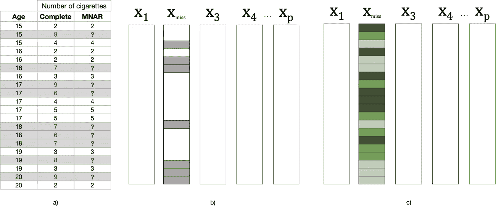

# 缺失数据解密：数据科学家的绝对入门指南

> 原文：[`towardsdatascience.com/missing-data-demystified-the-absolute-primer-for-data-scientists-8c9244c764c4?source=collection_archive---------1-----------------------#2023-08-29`](https://towardsdatascience.com/missing-data-demystified-the-absolute-primer-for-data-scientists-8c9244c764c4?source=collection_archive---------1-----------------------#2023-08-29)

## 数据质量编年史

## 缺失数据、缺失机制以及缺失数据分析

 [Miriam Santos](https://medium.com/@miriam.santos?source=post_page-----8c9244c764c4--------------------------------)

·

[关注](https://medium.com/m/signin?actionUrl=https%3A%2F%2Fmedium.com%2F_%2Fsubscribe%2Fuser%2F243289394aaa&operation=register&redirect=https%3A%2F%2Ftowardsdatascience.com%2Fmissing-data-demystified-the-absolute-primer-for-data-scientists-8c9244c764c4&user=Miriam+Santos&userId=243289394aaa&source=post_page-243289394aaa----8c9244c764c4---------------------post_header-----------) 发布于 [Towards Data Science](https://towardsdatascience.com/?source=post_page-----8c9244c764c4--------------------------------) · 12 min read · 2023 年 8 月 29 日 

--

缺失数据使数据科学家无法看到数据要讲述的完整故事。有时，即使是最小的信息片段也能提供一个完全独特的世界观。图片由 [Ronan Furuta](https://unsplash.com/@ronan18?utm_source=medium&utm_medium=referral) 拍摄，来源于 [Unsplash](https://unsplash.com/?utm_source=medium&utm_medium=referral)。

今年早些时候，我开始了一篇关于[几个数据质量问题](https://medium.com/towards-data-science/data-quality-issues-that-kill-your-machine-learning-models-961591340b40)（或特征）的文章，这些问题严重影响我们的机器学习模型。

**其中之一，毫无意外，是缺失数据。**

我已经研究了这个话题很多年了（*我知道，对吧？！*），但在我参与的一些[数据中心社区](https://datacentricai.community/)项目中，我意识到许多数据科学家仍未完全掌握这个问题的复杂性，这激励我创建了这个综合教程。

*今天，我们将深入探讨* ***缺失数据的问题***，发现我们可能在实际中遇到的不同***缺失数据类型***，并探索我们如何* ***识别和标记缺失值*** *在现实世界的数据集中。*

# 缺失数据的问题

缺失数据是一个有趣的数据不完善情况，因为它可能由于领域的自然性质而自然产生，或在数据收集、传输或处理过程中无意间产生。

**本质上，缺失数据的特点是数据中出现了缺失值**，即数据集中某些记录或观察中的缺失值，可以是*单变量*（一个特征有缺失值）或*多变量*（多个特征有缺失值）：

单变量与多变量缺失数据模式。图像作者提供。

*我们来考虑一个例子。* 假设我们正在对一个糖尿病患者队列进行研究。

**医疗数据就是一个很好的例子，因为它经常高度受到缺失值的影响：** 病人值来自调查和实验室结果，可能在诊断或治疗过程中被测量多次，存储在不同格式中（有时分布在不同机构），并且通常由不同的人处理。*这可能会（并且肯定会）变得很混乱！*

**在我们的糖尿病研究中，缺失值的存在可能与研究的进行或数据的收集有关。**

例如，缺失数据可能是由于传感器故障导致高血压值关闭。另一个可能性是“体重”特征中的缺失值更可能出现在年长女性中，她们不太愿意透露这信息。或者肥胖患者可能更不愿意分享他们的体重。

**另一方面，数据也可能因与研究完全无关的原因而缺失。**

由于一个轮胎爆胎导致病人错过了医生预约，他的信息可能会缺失。数据也可能因人为错误而缺失：例如，进行分析的人员可能会错放或误读一些文件。

**无论数据缺失的原因是什么，在建模之前调查数据集是否包含缺失数据都很重要，因为这个问题可能会对分类器产生** [**严重后果**](https://ydata.ai/resources/what-is-missing-data-in-machine-learning) **：**

+   **一些分类器不能内部处理缺失值：** 这使得它们在处理缺失数据的 数据集时不适用。在某些情况下，这些值被编码为预定义值，例如“0”，以便机器学习算法能够处理它们，尽管这不是最佳实践，尤其是在缺失数据的比例较高（或缺失机制更复杂）时；

+   **基于缺失数据的预测可能会有偏差和不可靠：** 尽管一些分类器可以内部处理缺失数据，但它们的预测可能会受到影响，因为训练数据中可能缺少重要的信息。

此外，尽管缺失值可能*“看起来都一样”*，但实际上它们的潜在机制（即它们缺失的原因）可以遵循 3 种主要模式：**完全随机缺失 (MCAR)、随机缺失 (MAR) 和非随机缺失 (MNAR)**。

牢记这些[不同类型的缺失机制](https://ydata.ai/resources/understanding-missing-data-mechanisms)很重要，因为它们决定了处理缺失数据的适当方法选择，并且影响从中得出的推论的有效性。

*让我们快速回顾一下每种机制！*

## 缺失数据机制

如果你是一个数学爱好者，我建议你阅读[这篇论文](https://ieeexplore.ieee.org/document/8605316) (*咳咳*), 特别是第 II 和 III 节，其中包含了你可能寻找的所有符号和数学公式（我实际上是[受到了这本书的启发](https://stefvanbuuren.name/fimd/)，它也是一本非常有趣的入门书籍，请查看第 2.2.3 节和 2.2.4 节）。

如果你和我一样也是一个视觉学习者，你可能会想要“*看到*”它，对吧？

为此，我们将查看论文中使用的**青少年烟草研究示例**。我们将考虑虚拟数据来展示每种缺失机制：

缺失机制示例：一个模拟的数据集，关于青少年烟草使用研究，其中每天吸烟的平均数在不同机制（MCAR, MAR, 和 MNAR）下缺失。图像作者提供。

需要记住的一点是：**缺失机制描述了缺失模式是否以及如何通过观察数据和/或缺失数据来解释。** *这很棘手，我知道。但通过示例会更清楚！*

在我们的烟草研究中，我们关注的是青少年烟草使用。共有 20 个观察值，相对于 20 名参与者，而特征`Age`是完全观察到的，而`Number of Cigarettes`（每天吸烟的数量）将根据不同的机制缺失。

## 完全随机缺失（MCAR）：无害，无错！

在完全随机缺失（MCAR）机制中，*缺失过程与观测数据和缺失数据完全无关*。这意味着特征缺失值的概率是*完全随机的*。

MCAR 机制：（a）香烟数量的缺失值完全是随机的；（b）真实数据集中 MCAR 模式的示例。图片由作者提供。

在我们的例子中，我只是随机删除了一些值。注意缺失值没有集中在特定的`Age`或`Number of Cigarettes`值范围内。**因此，这种机制可能由于研究过程中发生了意外事件**：比如负责记录参与者回答的人不小心跳过了调查中的一个问题。

## 随机缺失（MAR）：寻找明显的迹象！

这个名称实际上是误导性的，因为随机缺失（MAR）发生在*缺失过程可以与数据中的观测信息相关联*（尽管与缺失信息本身无关）。

考虑以下例子，其中我只删除了年轻参与者（15 至 16 岁）的`Number of Cigarettes`值。请注意，尽管缺失过程明显与`Age`中的观测值相关，但与这些青少年*吸烟数量无关*（请注意“Complete”列，如果报告了这些值，其中缺失值中会有低值和高值）。

MAR 机制：（a）香烟数量的缺失值与年龄相关；（b）真实数据集中 MAR 模式的示例：X_miss_1、X_miss_3 和 X_miss_p 的缺失值取决于 X_obs 的值。与最高/最暗值对应的值缺失。图片由作者提供。

例如，年轻孩子可能不愿意透露他们每天吸烟的数量，避免承认他们是常规吸烟者（无论他们吸烟的数量如何）。

## 缺失非随机（MNAR）：那一刻的顿悟！

如预期所示，缺失非随机（MNAR）机制是最棘手的，因为*缺失过程可能依赖于数据中的观测信息和缺失信息*。这意味着特征中缺失值的发生概率可能与数据中其他特征的观测值相关，也可能与该特征本身的缺失值相关！

看下一个例子：`Number of Cigarettes`的较高值缺失，这意味着`Number of Cigarettes`缺失值的概率与缺失值本身相关（请注意“Complete”列）。

MNAR 机制：（a）香烟数量中的缺失值对应于如果观察到的最高值；（b）现实世界数据集中 MNAR 模式的例子：X_miss 中的值取决于自身的值（最高/较暗的值被删除）。图片由作者提供。

这将是那些由于吸烟量非常大的青少年拒绝报告他们每天吸烟数量的情况。

# 缺失数据机制的影响

根据我们的简单示例，**我们已经看到*MCAR 是缺失机制中最简单的一种***。在这种情况下，我们可以忽略由于缺失值出现而产生的许多复杂性，**一些简单的解决方法，比如列表删除或逐例删除，以及更简单的统计插补技术，可能就能解决问题。**

然而，尽管方便，但现实中*MCAR 往往是不现实的*，**大多数研究人员通常在研究中至少假设 MAR**，这比 MCAR 更具普遍性和现实性。在这种情况下，**我们可能会考虑比 MCAR 更强大的策略，这些策略可以从观察到的数据中推断缺失的信息**。在这方面，基于机器学习的*插补策略*通常是最受欢迎的。

最后，**MNAR 迄今为止是最复杂的情况**，因为很难推断缺失的原因。当前的方法集中于*使用领域专家定义的校正因子来映射缺失值的原因*，*从分布式系统中推断缺失数据*，扩展最先进的模型（例如生成模型）以纳入*多重插补*，或*进行敏感性分析*以确定在不同情况下结果如何变化。

**此外，在可识别性问题上，问题也不会变得更容易。**

虽然*有一些测试可以区分 MCAR 和 MAR*，但它们并不广泛流行，并且有一些对复杂现实世界数据集不适用的限制性假设。也*无法区分 MNAR 和 MAR*，因为所需的信息缺失了。

**要在实践中诊断和区分缺失机制，我们可以关注假设检验、敏感性分析、从领域专家那里获取一些见解，以及调查可以提供领域理解的可视化技术。**

自然，还有其他复杂因素需要考虑，这些因素决定了缺失数据处理策略的应用，例如*缺失数据的百分比*、*影响的特征数量*以及*技术的最终目标*（例如，为分类或回归提供训练模型，还是以尽可能真实的方式重建原始值？）。

*总的来说，这不是一项简单的工作。*

# 识别和标记缺失数据

让我们一点一点地来。我们刚刚学到了关于缺失数据及其复杂纠缠的大量信息。

*在这个示例中，我们将介绍如何标记和可视化真实数据集中的缺失数据，并确认缺失数据对数据科学项目造成的问题。*

为此，我们将使用[皮马印第安人糖尿病](https://www.kaggle.com/datasets/uciml/pima-indians-diabetes-database)数据集，该数据集可以在 Kaggle 上找到（许可证 — [CC0: 公共领域](https://creativecommons.org/publicdomain/zero/1.0/)）。如果你想跟随教程，可以随时[下载笔记本](https://github.com/Data-Centric-AI-Community/awesome-python-for-data-science/blob/main/tutorials/data_preparation/missing_data/missing_data_introduction.ipynb)来自 Data-Centric AI Community [GitHub 仓库](https://github.com/Data-Centric-AI-Community)。

为了快速分析数据，我们还将使用`[ydata-profiling](https://github.com/ydataai/ydata-profiling)`，它可以通过几行代码给我们提供数据集的全面概览。*让我们开始安装它吧：*

安装最新版本的[ydata-profiling](https://github.com/ydataai/ydata-profiling)。作者提供的代码片段。

现在，我们可以加载数据并**快速创建概况：**

加载数据并创建数据概况报告。作者提供的代码片段。

通过查看数据，我们可以确定这个数据集包含 768 条记录/行/观察（768 名患者），以及 9 个属性或特征。实际上，`Outcome`是目标类（1/0），所以我们有 8 个预测变量（8 个数值特征和 1 个分类特征）。

数据质量报告：总体数据特征。作者提供的图片。

初看之下，数据集似乎没有缺失数据。**然而，这个数据集已知受到缺失数据的影响！** *我们怎么确认这一点呢？*

查看“*警报*”部分，我们可以看到**几个“*零值*”警报，表明有几个特征的零值没有意义或在生物学上是不可能的：** 例如，体重指数或血压的零值是无效的！

浏览所有特征，我们可以确定怀孕数似乎正常（零怀孕数是合理的），但对于其余特征，零值则值得怀疑：

数据质量报告：数据质量警报。作者提供的图片。

在大多数真实世界的数据集中，缺失数据通常由*哨兵值*编码：

+   超出范围的条目，例如`999`；

+   特征本应仅有正值时的负数，例如`-1`；

+   在一个本不应为 0 的特征中出现零值。

在我们的案例中，`Glucose`、`BloodPressure`、`SkinThickness`、`Insulin`和`BMI`都存在缺失数据。让我们统计这些特征中的零值数量：

统计零值的数量。作者提供的代码片段。

我们可以看到，`Glucose`、`BloodPressure` 和 `BMI` 只有少量的零值，而 `SkinThickness` 和 `Insulin` 有更多的零值，几乎覆盖了现有观察值的一半。**这意味着我们可能需要考虑不同的策略来处理这些特征：** 有些特征可能需要比其他特征更复杂的插补技术。

**为了使我们的数据集与特定数据的惯例一致，我们应该将这些缺失值标记为** `NaN` **值。**

这是在 Python 中处理缺失数据的标准方法，也是像 `pandas` 和 `scikit-learn` 等流行包遵循的惯例。这些值会在某些计算中被忽略，如 `sum` 或 `count`，并且一些函数会识别这些值以执行其他操作（例如，删除缺失值、插补它们、用固定值替换等）。

我们将使用 `replace()` 函数标记缺失值，然后调用 `isnan()` 来验证它们是否被正确编码：

将零值标记为 NaN 值。作者提供的代码片段。

`NaN` 值的数量与 `0` 值的数量相同，这意味着我们已经正确标记了缺失值！然后，我们可以使用配置文件报告来检查现在缺失数据是否被识别。以下是我们“新”数据的样子：

检查生成的警报：“缺失”警报现在已被突出显示。作者提供的图像。

我们可以进一步检查缺失过程的一些特征，浏览报告中的**“缺失值”**部分：

配置文件报告：调查缺失数据。作者录制的屏幕录像。

除了“*计数*”图表，它为我们提供了每个特征所有缺失值的概述，我们可以更详细地探索“*矩阵*”和“*热图*”图表，以对数据可能存在的潜在缺失机制进行假设。特别是，**缺失特征之间的相关性可能会提供信息**。在这种情况下，`Insulin` 和 `SkinThickness` 之间似乎存在显著的相关性：对于某些患者，这两个值似乎同时缺失。这是否是巧合（*不太可能*），或者缺失过程是否可以通过已知因素来解释，即表现出 MAR 或 MNAR 机制，这将是我们深入探讨的内容！

不管怎样，现在我们的数据已经准备好进行分析了！**不幸的是，处理缺失数据的过程远未结束。** 许多经典的机器学习算法无法处理缺失数据，我们需要找到专家的方法来缓解这个问题。让我们尝试在这个数据集上评估*线性判别分析（LDA）算法*：

评估带有缺失值的*线性判别分析（LDA）算法*。作者提供的代码片段。

如果你尝试运行这段代码，它会立即抛出一个错误：

*LDA 算法无法内部处理缺失值，抛出错误信息*。图片由作者提供。

解决这个问题的最简单方法（*也是最天真的方法！*）是**删除所有包含缺失值的记录**。我们可以通过创建一个新数据框，使用`dropna()`函数删除包含缺失值的行来实现这一点……

删除所有缺失值的行/观察值。代码片段由作者提供。

… 再次尝试：

评估没有缺失值的 LDA*算法*。代码片段由作者提供。

LDA 现在可以运行，尽管数据集的大小几乎减少了一半。图片由作者提供。

**就这样！** 通过删除缺失值，*LDA 算法现在可以正常运行*。

**然而，数据集的大小被大幅缩减至仅 392 个观察值，这意味着我们失去了近一半的可用信息**。

因此，我们应该寻找插补策略，而不是仅仅删除观察值，*可以是* [*统计学的*](https://ydata.ai/resources/advanced-data-visualisation-with-pandas-profiling) *或基于机器学习的*。我们还可以使用[*合成数据*](https://ydata.ai/resources/conditional-synthetic-data-generation-for-robust-machine-learning-applications)来替换缺失值，具体取决于我们的最终应用。

为此，我们可能需要尝试了解数据中潜在的缺失机制。*这将是未来文章中的一个期待点？*

# 结语

在这篇文章中，我们已经覆盖了数据科学家在开始处理缺失数据时需要掌握的所有基础知识。

从问题本身到缺失机制，我们发现了缺失信息对我们的数据科学项目可能造成的影响，尽管所有的`NaNs`看起来可能相同，*它们可能讲述非常不同的故事*。

在接下来的文章中，我将逐一介绍每种缺失机制，重点关注***生成***、***插补***和***可视化***策略，所以请关注新的博客文章，并不要忘记给[数据驱动的 AI 仓库](https://github.com/Data-Centric-AI-Community/awesome-python-for-data-science)加星标，以便随时获取代码更新！

一如既往，欢迎反馈、问题和建议！你可以给我留言，贡献代码到仓库，甚至可以在[数据驱动的 AI 社区](https://tiny.ydata.ai/dcai-medium)找到我，讨论其他与数据相关的话题。*到时候见？*

# 关于我

博士，机器学习研究员，教育者，数据倡导者，以及全能“万金油”。在 Medium 上，我写关于**数据驱动的人工智能和数据质量**，为数据科学与机器学习社区提供如何从不完美数据转向智能数据的教育。

[以数据为中心的人工智能社区](https://tiny.ydata.ai/dcai-medium) | [GitHub](https://github.com/Data-Centric-AI-Community) | [谷歌学术](https://scholar.google.com/citations?user=isaI6u8AAAAJ&hl=en) | [领英](https://www.linkedin.com/in/miriamseoanesantos/)
