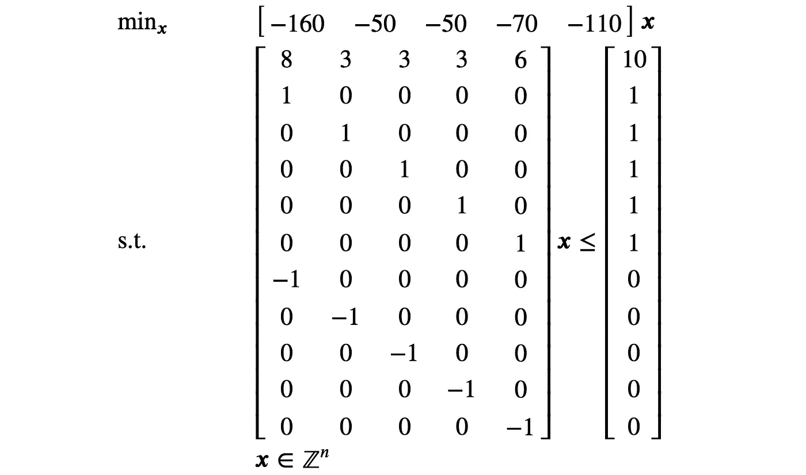

# 混合整数线性规划：正式定义与解空间

> 原文：[`towardsdatascience.com/mixed-integer-linear-programming-formal-definition-and-solution-space-6b3286d54892?source=collection_archive---------2-----------------------#2023-02-21`](https://towardsdatascience.com/mixed-integer-linear-programming-formal-definition-and-solution-space-6b3286d54892?source=collection_archive---------2-----------------------#2023-02-21)

## MILP 的理论基础以及其解空间的视觉表现

[](https://medium.com/@modosist?source=post_page-----6b3286d54892--------------------------------)[](https://towardsdatascience.com/?source=post_page-----6b3286d54892--------------------------------) [István Módos](https://medium.com/@modosist?source=post_page-----6b3286d54892--------------------------------)

·

[关注](https://medium.com/m/signin?actionUrl=https%3A%2F%2Fmedium.com%2F_%2Fsubscribe%2Fuser%2Fe14f7a362f6f&operation=register&redirect=https%3A%2F%2Ftowardsdatascience.com%2Fmixed-integer-linear-programming-formal-definition-and-solution-space-6b3286d54892&user=Istv%C3%A1n+M%C3%B3dos&userId=e14f7a362f6f&source=post_page-e14f7a362f6f----6b3286d54892---------------------post_header-----------) 发布于 [Towards Data Science](https://towardsdatascience.com/?source=post_page-----6b3286d54892--------------------------------) · 10 分钟阅读·2023 年 2 月 21 日[](https://medium.com/m/signin?actionUrl=https%3A%2F%2Fmedium.com%2F_%2Fvote%2Ftowards-data-science%2F6b3286d54892&operation=register&redirect=https%3A%2F%2Ftowardsdatascience.com%2Fmixed-integer-linear-programming-formal-definition-and-solution-space-6b3286d54892&user=Istv%C3%A1n+M%C3%B3dos&userId=e14f7a362f6f&source=-----6b3286d54892---------------------clap_footer-----------)

--

[](https://medium.com/m/signin?actionUrl=https%3A%2F%2Fmedium.com%2F_%2Fbookmark%2Fp%2F6b3286d54892&operation=register&redirect=https%3A%2F%2Ftowardsdatascience.com%2Fmixed-integer-linear-programming-formal-definition-and-solution-space-6b3286d54892&source=-----6b3286d54892---------------------bookmark_footer-----------)

图片由 [Ivan Bandura](https://unsplash.com/@unstable_affliction?utm_source=medium&utm_medium=referral) 提供，来源于 [Unsplash](https://unsplash.com/?utm_source=medium&utm_medium=referral)

本文是关于混合整数线性规划（MILP）理论和应用系列的延续（上一篇文章）。今天，我们将探讨

1.  MILP 的正式、一般定义，

1.  以及其可行解空间的视觉表现。

第一部分描述了 MILP 模型的一般外观，哪些是有效的 MILP 表达式，哪些不是。第二部分展示了 MILP 背后的理论，这将在未来的帖子中讨论实际的 MILP 求解算法时非常有用。

这篇文章比较长，所以请拿杯咖啡，深入阅读吧！

# 混合整数线性规划的正式定义

在接下来的文本中，我将使用大写粗体字母（例如，***A***、***E***）表示矩阵，使用小写粗体字母表示向量（例如，***x***、***y***）。MILP 是一个*优化问题*，可以用矩阵表示法形式化如下：


让我们把这个难题拆解开来。我们得到一个由矩阵和向量***A***、***E***、***b***、***f***、***c***、***d*** 代表的*问题实例*，这些矩阵和向量来自不同领域（ℝ代表实数集合，ℤ代表整数集合）。例如，如果我们回到第一个帖子中的预算问题，这个问题实例表示资产、它们的成本、估计的利润以及预算。我们说整数向量***x***和连续向量***y***是给定问题实例的*可行解*，如果满足以下条件：


通过逐项写出这些条件，我们得到：


其中 𝒂ᵢ 是矩阵 ***A*** 的行，𝒆ᵢ 是矩阵 ***E*** 的行。这些不等式被称为*约束*。

在 MILP 中，我们寻找一个可行解 ***x***、***y***，以最小化*目标函数*。


如果存在这样的解，我们称之为*最优解*。如果你想知道，实际上也可以最大化目标函数；只需将其乘以 -1 并最小化得到的表达式。没有保证存在可行解（更不用说最优解了），但让我们将关于这些情况的讨论推迟到后面的部分。

尽管矩阵形式是定义 MILP 问题的规范方式，但模型设计者通常不使用它，因为它非常繁琐。相反，在实际应用中，我们使用简单的数学表达式定义约束和目标函数，这些表达式会被求解器内部转换为矩阵形式（这对机器来说非常方便）。为了了解什么是正确的 MILP 表达形式，什么不是，这里有一些例子：

+   𝑎₁𝑥₁ + 𝑎₂ + 𝑥₃ ≥ 𝑏₁ + 𝑎₄𝑥₄ 是一个正确的 MILP 约束。注意，与规范形式相比，不等式的方向被反转了，一个常数被包含在左侧，我还在右侧添加了一个变量。在规范形式中，这个约束会被转换为 −𝑎₁𝑥₁ − 𝑥₃ + 𝑎₄𝑥₄ ≤ −𝑏₁ + 𝑎₂。

+   𝑥₁𝑥₂ 不是一个正确的 MILP 表达式，因为它是两个变量的乘积，这不是线性表达式。|𝑥₁|, max(𝑥₁, 𝑥₂), log(𝑥₁) 等也是如此。所有这些表达式都不是线性的，尽管其中一些可以通过各种技巧 *线性化*，但更多内容将在另一篇文章中讨论。

+   𝑎₁𝑎₂ 是一个正确的 MILP 表达式，因为将两个固定参数相乘会在“编译”时间，即在构建矩阵模型但在启动求解器之前，得到一个单一的固定参数。经过数学函数（如对数）转换的固定参数也都是正确的 MILP 表达式。

+   𝑎ₓ 不是一个正确的 MILP 表达式。我们不能使用变量作为索引。

+   𝑎₁𝑥₁ < 𝑏₁ 不是一个正确的 MILP 约束，因为不可能强制严格不等式。

我们通过以矩阵形式展示前一篇文章中的预算问题的 MILP 公式来结束这一部分。



目标使用了 *乘以 -1* 的技巧来最大化预期利润。预算约束编码在约束矩阵的第一行，剩余的行对应于每个变量 𝑥ᵢ 上的约束 0 ≤ 𝑥ᵢ, 𝑥ᵢ ≤ 1（即 𝑥ᵢ 被要求为二进制）。许多求解器允许直接指定变量的域，因此通常不需要手动创建这些约束。此外，请注意我们的模型仅包括整数变量（没有 **y** 变量），因此它是一个 *整数线性规划*。

# 解决方案空间

当我们知道 MILP 模型的可行解空间是什么样子时，我们可以开始推理关于 MILP 的通用算法、理论属性以及如何使模型更高效。

让我们从以下 MILP 模型开始。为了简化，我们将只考虑两个整数变量 𝑥₁ 和 𝑥₂。


我们如何将这个模型图形化？我们从一个空的 2D 图开始，表示没有约束的模型。逐渐地，我们一个个地添加约束，直到我们拥有一个完整的模型。在图中，水平和垂直轴分别对应于 𝑥₁ 和 𝑥₂ 的值。


由于模型中当前没有约束，𝑥₁ 和 𝑥₂ 的每一种组合都是一个可行解。让我们添加第一个约束 4𝑥₁ ≥ 2𝑥₂ 并查看会发生什么。首先，在解决方案空间中绘制一条直线 4𝑥₁ = 2𝑥₂。


这条线是由以下不等式定义的两个*半空间*之间的边界：4𝑥₁ > 2𝑥₂ 和 4𝑥₁ < 2𝑥₂。线的一侧的所有点满足不等式 4𝑥₁ > 2𝑥₂，而另一侧的所有点满足不等式 4𝑥₁ < 2𝑥₂。当我想知道哪个半空间表示特定约束条件时，我会选择一些不在该线上的随机点 𝑥₁, 𝑥₂，将其代入约束条件，并检查约束条件是否得到满足。如果满足，那么包含此点的半空间就是对应于该约束条件的半空间。如果不满足，那么另一个半空间就是正确的。

举个例子，我们选择点 𝑥₁ = 5, 𝑥₂ = 3。将这些值代入约束条件


我们可以看到约束条件得到了满足。因此，包含此点的半空间是所有点都满足该约束条件的半空间。在图中，我将用箭头表示满足约束条件的半空间。当然，线上的点也满足约束条件，所以一个约束条件由边界线和半空间共同表示。


让我们添加另一个约束条件 −2𝑥₁ + 30 ≥ 2𝑥₂。我们从绘制边界线 −2𝑥₁ + 30 = 2𝑥₂ 开始。


哪个半空间满足这个约束条件？对于这个测试，我们选择点 𝑥₁ = 14, 𝑥₂= 6，并将其代入约束条件


我们发现选定的点不满足约束条件 −2𝑥₁ + 30 ≥ 2𝑥₂，因此可行的半空间必须是另一个，而不是包含点 𝑥₁ = 14, 𝑥₂= 6 的那个。


然而，现在模型中有两个约束条件， feasible 解决方案空间是每个约束条件的可行半空间的*交集*。原因在于我们希望所有的约束条件都得到满足，因此只有那些位于所有可行半空间中的解决方案才在整个模型中是可行的。


现在应该清楚如何处理约束条件 𝑥₂ ≥ 0, 0.5𝑥₁ + 3.75 ≥ 𝑥₂，所以我将直接绘制新的可行解空间。


还有一件事就是我们最初默默忽略的整数约束 𝑥₁, 𝑥₂ ∈ ℤ。这条约束意味着什么？简单来说，并不是所有彩色区域中的点都是实际可行的，只有那些 𝑥₁ 和 𝑥₂ 都是整数的点才是可行的。我们可以通过网格将它们可视化，因此，示例 MILP 模型的最终可行解空间如下。


示例 MILP 模型的可行解空间。可行解用红点表示，黑线表示约束条件的边界。

每一个红点都对应一个满足所有约束的可行整数解。现在，最后一个问题是：这些点中哪个优化了我们的目标函数，即哪个点给出了最小的 -2𝑥₁ − 3𝑥₂ 值？这个问题稍微复杂一点。我们可以将图扩展到第三维，代表目标函数的值，将可行解投影到目标函数的平面上，然后找到投影点中最低的点。然而，我认为在 2D 空间中找到最优解是一个很好的思维练习。

你们中的许多人可能对*梯度*这个概念很熟悉，因为它是许多机器学习训练算法的核心。简而言之，函数的梯度表示在某一点函数最大增加的方向。也就是说，如果我们沿梯度方向移动，我们将增加函数值。知道 MILP 目标函数的梯度可以告诉我们去哪里寻找最优可行解。所以，让我们找到目标函数的梯度，我们通过对每个变量 𝑥₁, 𝑥₂ 进行偏导数来获得。


由于我们的目标函数是线性的，它在解空间中的每一点梯度都是相同的。由于梯度是一个方向，我们可以在解空间中绘制一个向量，以显示目标函数增加的方向。


让我们绘制目标的等高线（等高线上的每一点目标值相同）。可以证明等高线与梯度垂直，因此一旦我们有了梯度，就很容易绘制等高线。随着我们沿梯度的相反方向移动，等高线上的目标值会减少，直到我们无法再移动，因为我们将超出可行空间。你可以把这个过程想象成将一把与梯度垂直的尺子沿梯度的相反方向移动，直到你触及最后一个可行解。在我们的例子中，最优解是 𝑥₁ = 8, 𝑥₂ = 7，目标值为 -37。呼！


如果你对如何在 Python 中编写这个 MILP 模型感兴趣，这里是代码。

```py
Solver status: OptimizationStatus.OPTIMAL
Optimal objective value: -37
Optimal solution: x1=8, x2=7
```

# 优化结果

在上面的例子中，我们找到了一个最优解。然而，这并不总是有保证的。理论上，优化可能会得出以下三种结果之一：找到最优解、模型不可行或目标无界。

其他结果也是可能的（例如，超时、内存不足等），但这些与整数规划的实践相关，而不是理论，所以我不会在这篇文章中讨论它们。

## 优化结果：找到最优解

我们已经看到了一些找到最优解的例子（例如，预算问题）。我想强调的是，可能存在多个具有相同目标值的最优解。例如，如果我们将上面定义的模型中的目标替换为 10𝑥₂，那么在可行解空间中所有位于 x₂ = 0 线上的点都是最优解，目标值为 0。多次运行优化求解器并使用不同的随机种子可能会给出不同的最优解，因此不要期望每次都返回唯一解。

## 优化结果：不可行模型

不可行的模型是指没有满足所有约束条件的可行解的模型。一个不可行模型的例子如下。


没有任何一个 𝑥₁ 的值可以同时满足 𝑥₁ ≥ 6 和 𝑥₁ ≤ 2，因此这些约束的可行半空间的交集是一个空集。


## 优化结果：无界目标

这有点奇怪，但不幸的是，这种情况可能会发生。通常在实践中，这表明模型定义不明确，例如，当一个重要的约束没有包含在模型中时。

无界目标意味着对于每个可行解，我们可以找到另一个具有更小目标值的可行解。换句话说，最优目标值趋向于负无穷。以下是一个具有无界目标的模型。


可行解空间没有约束，因此我们可以将 𝑥₂ 增加到我们想要的任何值，从而目标函数值将减小。

# 总结

现在，你应该能够仅使用笔、纸和直尺来解决任何具有两个整数变量的 MILP 模型！当然，解决 MILP 的实际计算机算法要复杂得多，但对解空间的直观理解将在我们未来的文章中学习算法时派上用场。

*除非另有说明，所有图片均由作者提供。*
