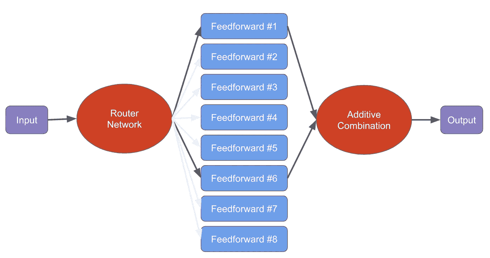

# Mixtral-8x7B: 理解和运行稀疏专家混合模型

> 原文：[`towardsdatascience.com/mixtral-8x7b-understanding-and-running-the-sparse-mixture-of-experts-0e3fc7fde818?source=collection_archive---------2-----------------------#2023-12-15`](https://towardsdatascience.com/mixtral-8x7b-understanding-and-running-the-sparse-mixture-of-experts-0e3fc7fde818?source=collection_archive---------2-----------------------#2023-12-15)

## 如何高效超越 GPT-3.5 和 Llama 2 70B

[](https://medium.com/@bnjmn_marie?source=post_page-----0e3fc7fde818--------------------------------)[](https://towardsdatascience.com/?source=post_page-----0e3fc7fde818--------------------------------) [Benjamin Marie](https://medium.com/@bnjmn_marie?source=post_page-----0e3fc7fde818--------------------------------)

·

[关注](https://medium.com/m/signin?actionUrl=https%3A%2F%2Fmedium.com%2F_%2Fsubscribe%2Fuser%2Fad2a414578b3&operation=register&redirect=https%3A%2F%2Ftowardsdatascience.com%2Fmixtral-8x7b-understanding-and-running-the-sparse-mixture-of-experts-0e3fc7fde818&user=Benjamin+Marie&userId=ad2a414578b3&source=post_page-ad2a414578b3----0e3fc7fde818---------------------post_header-----------) 发布于 [Towards Data Science](https://towardsdatascience.com/?source=post_page-----0e3fc7fde818--------------------------------) ·6 分钟阅读·2023 年 12 月 15 日[](https://medium.com/m/signin?actionUrl=https%3A%2F%2Fmedium.com%2F_%2Fvote%2Ftowards-data-science%2F0e3fc7fde818&operation=register&redirect=https%3A%2F%2Ftowardsdatascience.com%2Fmixtral-8x7b-understanding-and-running-the-sparse-mixture-of-experts-0e3fc7fde818&user=Benjamin+Marie&userId=ad2a414578b3&source=-----0e3fc7fde818---------------------clap_footer-----------)

--

[](https://medium.com/m/signin?actionUrl=https%3A%2F%2Fmedium.com%2F_%2Fbookmark%2Fp%2F0e3fc7fde818&operation=register&redirect=https%3A%2F%2Ftowardsdatascience.com%2Fmixtral-8x7b-understanding-and-running-the-sparse-mixture-of-experts-0e3fc7fde818&source=-----0e3fc7fde818---------------------bookmark_footer-----------)

图片来自 [8385](https://pixabay.com/users/8385-8385/?utm_source=link-attribution&utm_medium=referral&utm_campaign=image&utm_content=2147790) [Pixabay](https://pixabay.com//?utm_source=link-attribution&utm_medium=referral&utm_campaign=image&utm_content=2147790)

最近的大型语言模型（LLMs）使用了非常相似的神经网络架构。例如，Falcon、Mistral 和 Llama 2 模型使用了类似的自注意力和 MLP 模块组合。

相比之下，Mistral AI（也创造了 Mistral 7B）刚刚发布了一种具有显著不同架构的新 LLM：[Mixtral-8x7B](https://huggingface.co/mistralai/Mixtral-8x7B-v0.1)，这是一个稀疏混合的 8 个专家模型。

总体而言，Mixtral 包含 46.7B 参数。然而，得益于其架构，Mixtral-8x7B 可以高效地在消费者硬件上运行。与其他相似规模的模型相比，Mixtral-8x7B 的推理速度显著更快，并且在大多数任务中表现优越。

在这篇文章中，我解释了什么是稀疏专家混合网络，以及为什么它在推理时比标准模型更快。接着，我们将看到如何在消费者硬件上使用和微调 Mixtral-8x7B。

我已经在这里实现了一个笔记本，展示了使用 Mixtral-8x7B 进行 QLoRA 微调和推理：

[获取笔记本（#32）](https://colab.research.google.com/drive/1VDa0lIfqiwm16hBlIlEaabGVTNB3dN1A?usp=sharing)

# 稀疏专家混合网络



图片由作者提供

稀疏专家混合网络（SMoE）是一种神经网络架构，旨在提高传统模型的效率和可扩展性。专家混合的概念是为了使模型能够通过专门的“专家”子网络学习输入空间的不同部分。在 Mixtral 中，共有 8 个专家子网络。

请注意，模型名称中的“8x7B”略有误导。该模型总共有 46.7B 参数，比 8x7B 参数应该有的量少了近 10B 参数。实际上，Mixtral-8x7B 并不是一个 56B 参数的模型，因为一些模块，比如自注意力模块，与 8 个专家子网络共享。

如果你用 Transformers 加载并打印模型，模型的结构会更容易理解：

```py
MixtralForCausalLM(
  (model): MixtralModel(
    (embed_tokens): Embedding(32000, 4096)
    (layers): ModuleList(
      (0-31): 32 x MixtralDecoderLayer(
        (self_attn): MixtralAttention(
          (q_proj): Linear4bit(in_features=4096, out_features=4096, bias=False)
          (k_proj): Linear4bit(in_features=4096, out_features=1024, bias=False)
          (v_proj): Linear4bit(in_features=4096, out_features=1024, bias=False)
          (o_proj): Linear4bit(in_features=4096, out_features=4096, bias=False)
          (rotary_emb): MixtralRotaryEmbedding()
        )
 **(block_sparse_moe): MixtralSparseMoeBlock(
          (gate): Linear4bit(in_features=4096, out_features=8, bias=False)
          (experts): ModuleList(
            (0-7): 8 x MixtralBLockSparseTop2MLP(
              (w1): Linear4bit(in_features=4096, out_features=14336, bias=False)
              (w2): Linear4bit(in_features=14336, out_features=4096, bias=False)
              (w3): Linear4bit(in_features=4096, out_features=14336, bias=False)
              (act_fn): SiLU()
            )
          )**
        )
        (input_layernorm): MixtralRMSNorm()
        (post_attention_layernorm): MixtralRMSNorm()
      )
    )
    (norm): MixtralRMSNorm()
  )
  (lm_head): Linear(in_features=4096, out_features=32000, bias=False)
)
```

我们可以看到 MoE 模块与自注意力模块是分开的。

每个专家子网络负责处理输入数据的特定区域或方面，而一个门控（或路由器）网络决定每个专家对最终预测的贡献程度。在 Mixtral 的情况下，只有 2 个专家会同时激活。在推理过程中仅使用 13B 参数，因此相比于其他相似规模的模型，推理更加高效。

总结来说，这种稀疏激活在几个方面可能会带来好处：

1\. 计算效率：仅激活一部分专家可以降低评估每个输入时整个专家池的计算成本。

2\. 参数效率：通过仅允许少数专家对给定输入进行激活，模型可以更有效地分配其参数。

3\. 泛化：稀疏激活可以鼓励模型学习输入空间不同区域的更多专门和细化的特征。这可以导致在多样化输入上的更好泛化和性能。例如，Mistral AI 声称 Mixtral 已在意大利语、德语、法语、西班牙语以及编程方面进行过训练。我们可以想象，他们可能已训练了其中的一些 8 个专家，使其在这些语言和任务上表现得特别好。

虽然 SMoEs 比相似大小的标准模型更快，但它们仍然占用相同的内存量。量化是减少内存消耗的一种方法。将一些专家卸载到较慢的内存，例如 CPU RAM，也可能是一个不错的替代方案，尤其是当我们提前知道哪些专家将最常用于特定任务时。

# 关于 Mixtral 的信息

我们知道的大部分细节都发布在 Mistral AI 的这篇文章中：

[Mixtral 专家](https://mistral.ai/news/mixtral-of-experts/)

Mixtral 是一个具有 8 个子网络的模型，这些子网络作为专家存在。在每一层和每个 token 上，只有 2 个子网络被激活。另一个参数集合，即路由网络，决定激活哪些子网络。

关于训练数据，Mistral AI 并没有给出太多信息。我们只知道它是 Web 数据：

> *Mixtral 是在从开放 Web 中提取的数据上进行预训练的*

我想知道“开放 Web”是什么。

他们在各种公共基准测试中评估了模型，以证明 Mixtral 在大多数测试中优于 Llama 2 70B 和 GPT-3.5。

目前我们了解的就是这些。

# 在你的电脑上运行 Mixtral

Mixtral 已由 Hugging Face Transformers（从版本 4.36.0 起）和 bitsandbytes 支持。我们可以对模型进行量化，以便在消费级硬件上进行微调或运行。

它还支持 [FlashAttention 2，这有助于减少推理和长序列（最多 32k tokens）微调的内存消耗](https://kaitchup.substack.com/p/use-flashattention-2-for-faster-fine)。

[在模型卡中](https://huggingface.co/mistralai/Mixtral-8x7B-v0.1)，Mistral AI 提供了一个运行模型的代码示例：

```py
from transformers import AutoModelForCausalLM, AutoTokenizer

model_id = "mistralai/Mixtral-8x7B-v0.1"
tokenizer = AutoTokenizer.from_pretrained(model_id)

model = AutoModelForCausalLM.from_pretrained(model_id, load_in_4bit=True, use_flash_attention_2=True)

text = "The mistral is"
inputs = tokenizer(text, return_tensors="pt").to(0)

outputs = model.generate(**inputs, max_new_tokens=200)
print(tokenizer.decode(outputs[0], skip_special_tokens=True))
```

在 Google Colab 笔记本中，它仅与 A100 GPU 一起工作（你需要 Google Colab Pro）。该模型有 46.7B 个参数。由于参数是 bfloat16，我们每个参数需要 2 字节的内存，即几乎 100 GB 的硬盘空间来下载模型。

该模型以 safetensors 格式提供。它分为 20 个约 4.95 GB 的分片。下载完成后，加载模型到 GPU 上可能需要最多 7 分钟。

当量化到 4-bit 时，模型占用 23 GB 的 VRAM。为了在你的电脑上流畅运行，它需要至少两个每个 16 GB VRAM 的 GPU，例如 2 个 NVIDIA RTX 4060 16 GB，或更好的 2 个 NVIDIA RTX 4080 16 GB。

# 在你的电脑上微调 Mixtral

Mixtral 还支持 QLoRA 微调。以下是加载模型并准备进行微调的代码示例：

```py
model_name = "mistralai/Mixtral-8x7B-v0.1"
#Tokenizer
tokenizer = AutoTokenizer.from_pretrained(model_name, add_eos_token=True, use_fast=True)
tokenizer.pad_token = tokenizer.unk_token
tokenizer.pad_token_id =  tokenizer.unk_token_id
tokenizer.padding_side = 'left'

compute_dtype = getattr(torch, "float16")
bnb_config = BitsAndBytesConfig(
        load_in_4bit=True,
        bnb_4bit_quant_type="nf4",
        bnb_4bit_compute_dtype=compute_dtype,
        bnb_4bit_use_double_quant=True,
)
model = AutoModelForCausalLM.from_pretrained(
          model_name, quantization_config=bnb_config, device_map={"": 0}
)
model = prepare_model_for_kbit_training(model)
```

或者你可以直接参考我的 [之前的 Mistral 7B 微调教程](https://kaitchup.substack.com/p/mistral-7b-recipes-for-fine-tuning)。效果会是一样的。

你也可以尝试通过 IPO 进行微调，来创建一个强大的 Mixtral 聊天模型。

[](https://kaitchup.substack.com/p/fine-tune-better-chat-models-with?source=post_page-----0e3fc7fde818--------------------------------) [## 使用蒸馏身份偏好优化（IPO）微调更好的聊天模型

### Mistral 7B 与 IPO 对齐

kaitchup.substack.com](https://kaitchup.substack.com/p/fine-tune-better-chat-models-with?source=post_page-----0e3fc7fde818--------------------------------)

# 结论

稀疏专家混合模型是一种高效的模型架构，它比相似规模的标准模型具有更快的推理速度。尽管 Mixtral 在推理时只使用了大约 1/4 的参数，但仍然需要将所有参数加载到内存中。

减少 LLM 内存占用的一种方法是量化。例如，我们可以使用 bitsandbytes 的 NF4 将 Mixtral 量化为 4 位。这样就可以在消费级硬件上运行或微调 Mixtral，但你至少需要两块 GPU。

希望 Mistral AI 会发布一篇技术论文，透露有关训练 Mixtral 8 位专家的方法的更多信息。
