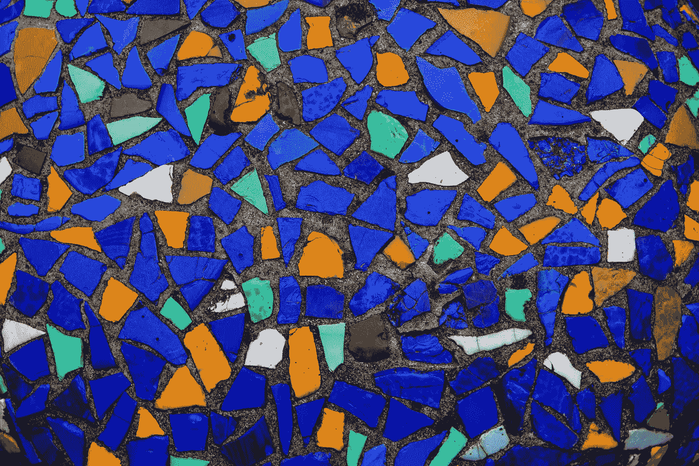
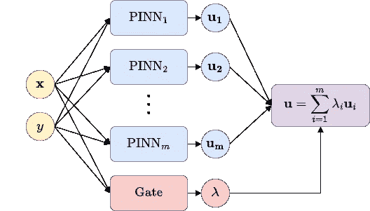
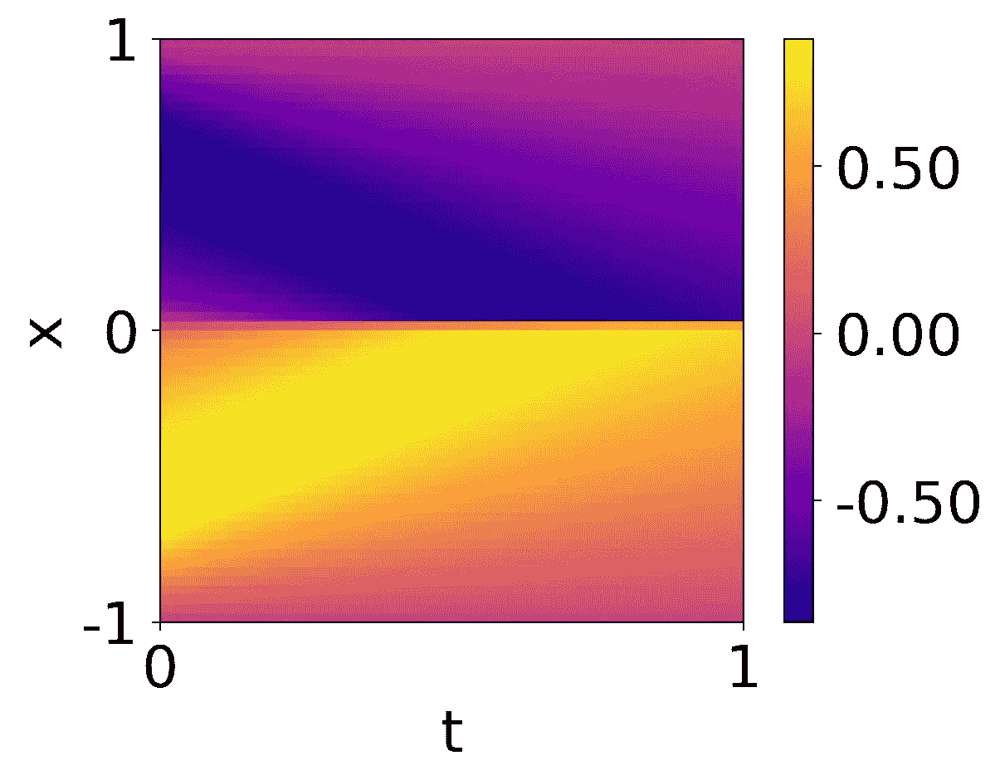
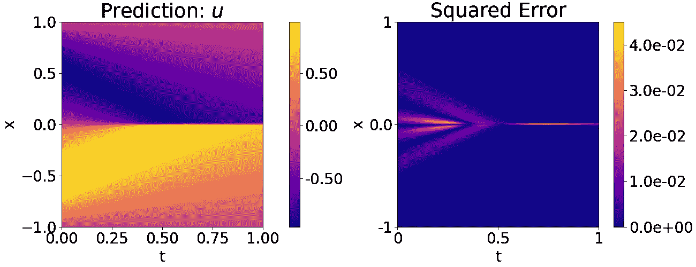
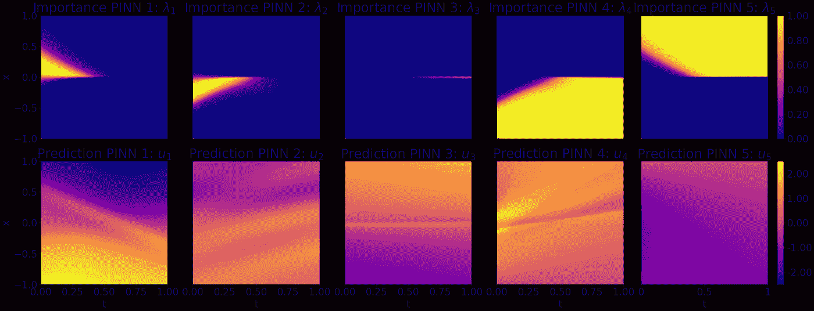
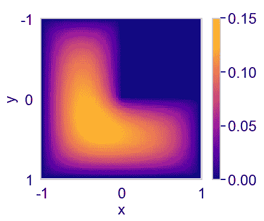
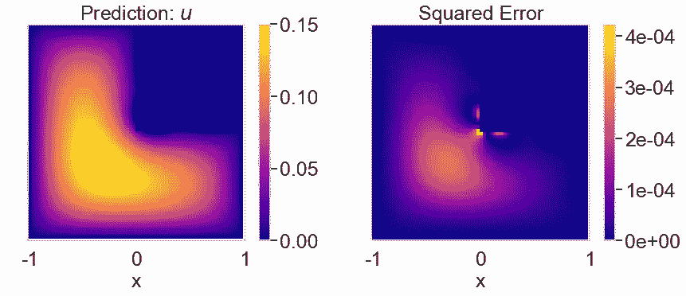
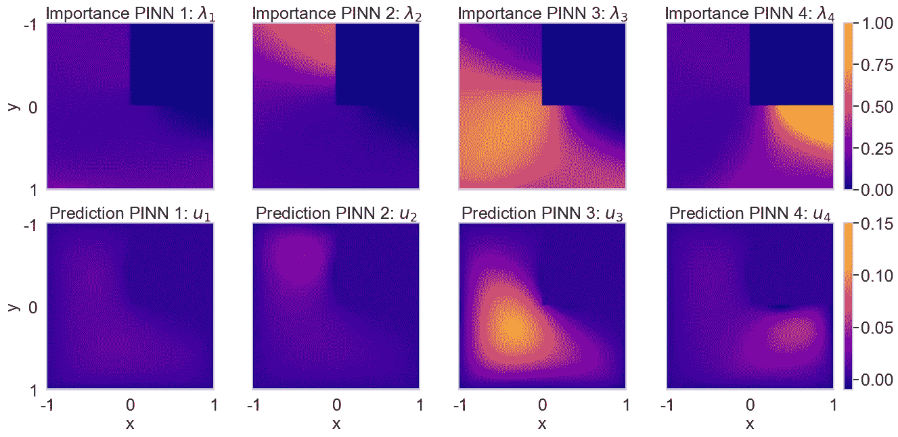
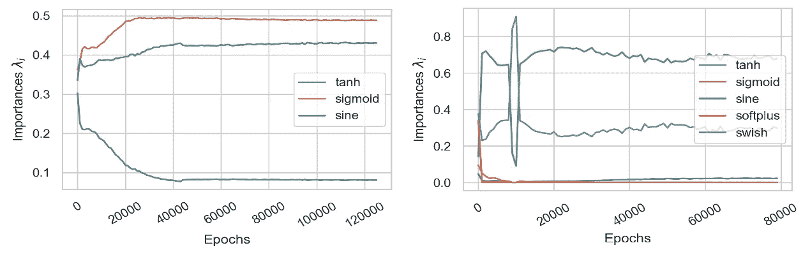
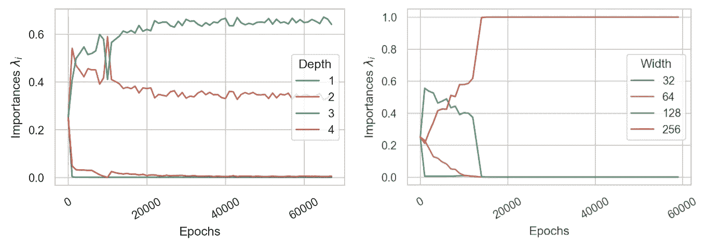

# PINNs 的专家混合（MoE-PINNs）

> 原文：[`towardsdatascience.com/mixture-of-experts-for-pinns-moe-pinns-6520adf32438?source=collection_archive---------7-----------------------#2023-02-02`](https://towardsdatascience.com/mixture-of-experts-for-pinns-moe-pinns-6520adf32438?source=collection_archive---------7-----------------------#2023-02-02)

## 利用集成方法提升物理信息神经网络

[](https://rabischof.medium.com/?source=post_page-----6520adf32438--------------------------------)[](https://towardsdatascience.com/?source=post_page-----6520adf32438--------------------------------) [拉斐尔·比肖夫](https://rabischof.medium.com/?source=post_page-----6520adf32438--------------------------------)

·

[关注](https://medium.com/m/signin?actionUrl=https%3A%2F%2Fmedium.com%2F_%2Fsubscribe%2Fuser%2F913c6c1e6a94&operation=register&redirect=https%3A%2F%2Ftowardsdatascience.com%2Fmixture-of-experts-for-pinns-moe-pinns-6520adf32438&user=Rafael+Bischof&userId=913c6c1e6a94&source=post_page-913c6c1e6a94----6520adf32438---------------------post_header-----------) 发表在 [Towards Data Science](https://towardsdatascience.com/?source=post_page-----6520adf32438--------------------------------) · 9 分钟阅读 · 2023 年 2 月 2 日[](https://medium.com/m/signin?actionUrl=https%3A%2F%2Fmedium.com%2F_%2Fvote%2Ftowards-data-science%2F6520adf32438&operation=register&redirect=https%3A%2F%2Ftowardsdatascience.com%2Fmixture-of-experts-for-pinns-moe-pinns-6520adf32438&user=Rafael+Bischof&userId=913c6c1e6a94&source=-----6520adf32438---------------------clap_footer-----------)

--

[](https://medium.com/m/signin?actionUrl=https%3A%2F%2Fmedium.com%2F_%2Fbookmark%2Fp%2F6520adf32438&operation=register&redirect=https%3A%2F%2Ftowardsdatascience.com%2Fmixture-of-experts-for-pinns-moe-pinns-6520adf32438&source=-----6520adf32438---------------------bookmark_footer-----------)

图片由 [Soviet Artefacts](https://unsplash.com/@sovietartefacts?utm_source=medium&utm_medium=referral) 提供，来源于 [Unsplash](https://unsplash.com/?utm_source=medium&utm_medium=referral)

[物理信息神经网络（PINNs）](https://www.sciencedirect.com/science/article/pii/S0021999118307125) [1] 已成为解决偏微分方程（PDEs）的一种流行且有前途的方法。在我们最新的研究中，我的同事迈克尔·克劳斯和我介绍了一种名为[用于解决具有复杂和多样模式的 PDEs 的混合专家物理信息神经网络（MoE-PINNs）](https://mediatum.ub.tum.de/doc/1688403/uic8b0xn1c845e7rac1or092o.Bischof%20et%20Al.%202022.pdf) [2] 的新框架，它在 PDEs 方面显示出巨大潜力。

在本文中，我们将讨论 MoE-PINNs 的好处以及如何轻松实现它们来解决各种 PDE 问题。结构如下：

+   MoE-PINNs 入门

+   使用 MoE-PINNs 解决 Burgers' PDE

+   通过稀疏正则化减少超参数搜索

+   通过解决 L 形域上的泊松 PDE 的 MoE-PINNs 示例

+   使用可微 MoE-PINN 进行自动体系结构搜索

为了帮助您更好地理解本文中讨论的概念，我们提供了伴随的笔记本，可以直接在 Colab 上运行：

+   [Burgers'方程上的 MoE-PINNs 笔记本](https://drive.google.com/file/d/1JyejLXPS9LQdsNzZE5z-FTd8idRgrP1n/view?usp=sharing)

+   [L 形泊松方程上的 MoE-PINNs 笔记本](https://drive.google.com/file/d/1IRyZvl9OFU8a0PETjdEEppM1BBoda4e8/view?usp=sharing)

PINNs 利用物理定律和自动微分，仅需几行代码就能解决偏微分方程（PDEs）。然而，它们也对超参数非常敏感，例如激活函数或权重初始化。这使得训练 PINNs 特别困难，是一个费力的迭代过程。网络的深度和激活函数的选择可以极大地影响解决方案的准确性。例如，对于具有不同模式和不连续性的复杂 PDEs，如 Navier-Stokes 方程，深度网络效果良好。而对于在正方形域上的泊松方程这样具有简单模式的简单 PDEs，浅层网络可能已经足够。正弦激活函数以其在微分下保持形状的特性，可能是高阶微分问题的理想选择。另一方面，像 swish 或 softplus 这样的激活函数可以更好地处理具有尖锐不连续性的问题。

但是，如果您的问题需要结合两者呢？如果我们处理的 PDE 在一部分平滑重复，在另一部分则是高度复杂且具有尖锐不连续性？这就是**混合专家（MoE）**框架对 PINNs 的贡献之处。通过利用多个网络和一个门来划分域，每个专家可以专注于解决问题的不同部分，从而提高准确性并减少偏差-方差的折衷。

将问题划分为较小的子问题有很多好处：

+   通过在不同子领域使用多个学习者，问题的复杂性得以降低。

+   MoE-PINNs 中的门控是一个连续函数，从而在领域之间实现平滑过渡。因此，领域中更复杂的区域可以在多个学习者之间平均分配，而较简单的区域则可以分配给单个专家。

+   该门控可以是任何类型的神经网络，从线性层到深度神经网络，这使得它能够适应不同类型的领域，并以任意方式进行划分。

+   MoE 可以很容易地并行化，因为只需在不同设备上的学习者之间共享权重 lambda。理论上，每个学习者可以放置在一个不同的 GPU 上。

+   通过初始化大量具有不同架构的 PINNs，可以减少劳动密集型的超参数调优需求。

# MoE-PINN 架构



PINNs 的专家混合。一个任意数量 *m* 的 PINNs，可能具有不同的架构和属性，与一个门控网络一起初始化。所有模型接收相同的输入，门控网络生成的权重用于聚合结果。图示由作者提供 [2]。

与传统的 PINNs 使用单一神经网络进行预测不同，MoE-PINNs 采用多个 PINNs 的集成，并通过门控网络进行组合。

与集成中的所有 PINNs 一样，门控网络是一个全连接的前馈网络，它接收空间坐标 **x** 和 **y**（可能会因 PDE 而异）。然而，与 PINNs 不同的是，它的输出是一个 *m* 维的权重向量，其中 *m* 是集成中的 PINNs 数量。这些权重经过 softmax 函数处理，以转换为概率分布，确保所有权重之和等于 1。

softmax 函数将未归一化的重要性 z_i 映射到概率分布 p。

MoE-PINN 的最终预测是通过聚合集成中每个 PINN 的预测结果获得的，权重由各自的重要性决定。

MoE-PINNs 可以在 TensorFlow 中非常简洁地构建，只需几行代码：

```py
import tensorflow as tf
from tensorflow.keras.layers import Input, Dense, Concatenate

def build_moe_pinn(pinns:List[tf.keras.Model], n_layers:int, n_nodes:int) -> tf.keras.Model:
    x = Input((1,), name='x')
    y = Input((1,), name='y')

    # create predictions with each PINN in the ensemble
    u = Concatenate()([pinn([x, y]) for pinn in pinns])

    # initialise the gating network
    gate = tf.keras.models.Sequential(
        [Dense(n_nodes, activation='tanh') for _ in range(n_layers)] + \
        [Dense(len(pinns), activation='softmax')],
        name='gate',
    )

    # receive importances from the gating network, multiply with PINN
    # predictions and sum up the results
    u = tf.reduce_sum(gate([x, y]) * u, axis=1, keepdims=True)

    return tf.keras.Model([x, y], u, name='moe_pinn')
```

# Burgers’ 方程

为了说明 MoE-PINNs 的有效性，我们来看一个例子。Burgers’ 方程是一种用于建模冲击波、气体动力学或交通流等现象的 PDE。其形式如下：

Burgers’ 方程，空间坐标 x 和时间变量 t。初始条件设定为正弦函数，边界条件设定为零。



使用上述初始条件和边界条件可视化 Burgers’ 方程。图片由作者提供。

Burgers’ PDE 提出了一个有趣的挑战：它随着时间的推移，从平滑的正弦函数过渡到陡峭的阶跃型不连续性。这一独特属性使其成为评估 MoE-PINNs 性能的理想基准。

## 训练 MoE-PINNs 以解决 Burgers’ 方程

让我们初始化一个包含 5 个 PINNs 和一个门控网络的 MoE-PINN，并在 Burgers 方程上进行训练。这些专家具有以下架构：

+   专家 1: 2 层，每层 64 个节点，激活函数为 tanh

+   专家 2: 2 层，每层 64 个节点，激活函数为 sine

+   专家 3: 2 层，每层 128 个节点，激活函数为 tanh

+   专家 4: 3 层，每层 128 个节点，激活函数为 tanh

+   专家 5: 2 层，每层 256 个节点，激活函数为 swish



使用 5 个专家的 MoE-PINN 对 Burgers 方程进行预测和与实际结果（谱元方法）的平方误差比较。图像来源：作者。

更有趣的是，我们现在可以检查专家在领域中的分布以及它们的单独预测情况：



由门控网络产生的权重 λ（顶部行）对于每个专家（列），以及每个专家对 Burgers 方程的预测（底部行）。图像来源：作者。

观察 MoE-PINNs 中的门控网络如何根据每个专家在建模领域不同部分的能力有效地分配任务。较少层数和节点的专家被分配到平滑区域，这些区域相对容易建模，即接近初始条件。与此同时，更复杂的专家，即具有更深更宽架构的专家，被利用在具有不连续性的区域，这些区域需要更复杂的模型来准确表示。特别是在专家 3 的情况下，它完全致力于捕捉不连续性。

# 稀疏性正则化以减少超参数搜索

MoE-PINNs 通过允许初始化一组多样化的专家，减少了调整多个超参数的需求。然而，仍有一个重要的超参数：专家数量 m。为了获得最佳结果，m 应该尽可能高，同时仍能适应内存。但专家数量过多也会增加计算成本。为了平衡这些权衡，重要的是确定将物理领域划分为最佳所需的最小专家数量。一种方法是通过添加一个正则化项来鼓励由门控网络产生的稀疏权重 λ。

正则化损失可以表示为：

用于强制门控网络产生的权重 λ 稀疏的正则化项。

其中 B 是一批协同点 (x, t)，p 是控制正则化强度的超参数。p 值低于 1 强制稀疏，而 p 值高于 1 导致更均匀的分布。为了鼓励稀疏性，p 的一个良好起始点是 0.5。

最后，为了使训练过程更加高效，我们可以使用启发式方法来排除门控网络认为不重要的专家。例如，如果某专家在一个批次中的平均权重低于某个阈值，则可以排除该专家。

让我们看一个其他的例子来说明这一过程。

# L 形区域上的泊松 PDE

泊松方程是用于建模工程和自然科学中物理过程的常用工具。例如，它可以用来解决杆在扭转负荷下的弹性静力学问题。为了测试稀疏性正则化，让我们检查 MoE-PINNs 在解决具有均匀 Dirichlet 边界条件的二维 L 形区域上的泊松方程时表现如何：

L 形区域上的泊松方程，其中 Gamma 代表 L 形区域边界上的点。



上述 L 形区域上泊松方程的可视化，使用有限元方法解决。图示由作者[2]提供。

如果工程师必须对这个领域进行细分并使用不同的模型，一个直观的选择是在 L 形区域的三个象限中使用不同的专家：一个在左上角，一个在左下角，一个在右下角。观察 MoE-PINN 如何决定划分领域并分配专家将会很有趣。

## 在泊松 PDE 上训练稀疏 MoE-PINNs

当用四个相同的专家初始化一个集合时，MoE-PINN 的结果如下：



使用 4 个专家的 MoE-PINN 在泊松方程上的预测和平方误差与实际值（FEM 解）对比。图示由作者[2]提供。

但更重要的是，我们现在可以检查每个专家的重要性：



门控网络生成的权重 lambda（顶行）以及每个专家（列）的预测（底行）在泊松方程中的表现。图示由作者[2]提供。

图示表明，在稀疏性正则化的影响下，门控网络决定几乎完全排除专家 1。这导致了在剩余的 PINNs 之间更加高效和有效的领域划分。网络将一个主要专家分配给三个象限中的每一个，创建了一个对称且直观的分布。

同样值得注意的是，由于专家 1 的平均重要性较低，如果启动新的训练，这个专家可能会被从集合中排除，剩余的专家可以在一个减少规模的、更高效的集合中进行微调。

# 可微分架构搜索

最后，我们希望利用引入的概念来减少调整超参数所需的时间。MoE-PINNs 允许初始化一个多样化的专家集合，并让门控网络决定应该保留哪些专家，哪些专家可以在稀疏正则化下被丢弃。



在对泊松方程的三个专家（左）和四个专家（右）使用不同激活函数时的重要性。图由作者[2]提供。

出人意料的是，当分析使用不同激活函数的多样化专家集合时，门控网络始终丢弃使用 tanh 激活的网络，尽管 tanh 是 PINN 文献中常用的激活函数。相反，门控网络始终偏爱使用正弦激活的专家。这种偏好表明，使用正弦激活网络的集合可能会提高 PINN 的性能，这与使用傅里叶变换进行信号分解的原则一致，表明任何函数都可以表示为不同频率的正弦函数的组合。



在对泊松方程的四个专家进行深度（左）和相同专家的深度（右）变化时的重要性。图由作者[2]提供。

从不同深度和宽度的专家集合来看，对于泊松方程，二层或三层的深度似乎是最佳选择，而较宽的网络似乎优于较窄的网络。

# 结论

总之，MoE-PINNs 是一种很好的扩展，能改善在表现出不同模式的 PDEs 上的 PINNs，并通过让门控网络决定从多样化的专家集合中使用哪些架构，减少调整超参数所需的时间。

如果你想自己试验 MoE-PINNs，可以查看以下笔记本：

+   [MoE-PINNs 在 Burgers 方程上的笔记本](https://drive.google.com/file/d/1JyejLXPS9LQdsNzZE5z-FTd8idRgrP1n/view?usp=sharing)

+   [MoE-PINNs 在 L 形泊松方程上的笔记本](https://drive.google.com/file/d/1IRyZvl9OFU8a0PETjdEEppM1BBoda4e8/view?usp=sharing)

非常感谢你读完这篇文章！如果你觉得这篇文章对你有帮助，并希望在自己的工作中使用 MoE-PINNs 或这些笔记本，请使用以下引用：

> R. Bischof 和 M. A. Kraus, “[Mixture-of-Experts-Ensemble Meta-Learning for Physics-Informed Neural Networks](https://scholar.google.com/scholar?oi=bibs&cluster=12593425659851579449&btnI=1&hl=en)”，《33rd Forum Bauinformatik 会议论文集》，2022

你可以在 [mkrausai.com](http://mkrausai.com/) 查找有关我的同事 Michael Kraus 的更多信息，也可以在 [rabischof.ch](http://rabischof.ch/) 了解我自己。

[1] M. Raissi、P. Perdikaris 和 G. E. Karniadakis，《物理信息神经网络：一种解决涉及非线性偏微分方程的前向和逆向问题的深度学习框架》，《计算物理学杂志》378（2019），686–707。

[2] R. Bischof 和 M. A. Kraus，“[物理信息神经网络的专家组合元学习](https://scholar.google.com/scholar?oi=bibs&cluster=12593425659851579449&btnI=1&hl=en)”，第 33 届建筑信息学论坛论文集，2022
