# 深度会话推荐系统中的 Softmax 混合模型

> 原文：[`towardsdatascience.com/mixture-of-softmaxes-for-deep-session-based-recommender-systems-aea5727e213d`](https://towardsdatascience.com/mixture-of-softmaxes-for-deep-session-based-recommender-systems-aea5727e213d)

## 现代会话基础的深度推荐系统在某种程度上可能会受到 softmax 瓶颈的限制，就像它们的语言模型类似物一样。

 [Adrien Biarnes](https://biarnes-adrien.medium.com/?source=post_page-----aea5727e213d--------------------------------)

·发表于 [Towards Data Science](https://towardsdatascience.com/?source=post_page-----aea5727e213d--------------------------------) ·15 分钟阅读·2023 年 7 月 18 日

--

由 [Preethi Viswanathan](https://unsplash.com/@sallybrad2016?utm_source=medium&utm_medium=referral) 拍摄的照片，来源于 [Unsplash](https://unsplash.com/?utm_source=medium&utm_medium=referral)

## TL;DR:

传统的 softmax 在完全建模像自然语言这种高度依赖上下文的任务时能力有限。这种表现力的限制被称为 Softmax 瓶颈，可以通过矩阵分解和研究结果矩阵的秩来描述。

Yang 等人提出的 Softmax 混合模型 [by Yang et al.](https://arxiv.org/pdf/1711.03953.pdf) [1] 通过增加网络的表现力而不增加参数数量，从而克服了瓶颈。

在这项工作中，我研究了这一限制是否也适用于深度会话推荐系统，并且 MoS 技术是否能带来好处。我实现了这一技术，并将其应用于 Gru4Rec 架构，使用了[Movielens-25m 数据集](https://grouplens.org/datasets/movielens/25m/) [3]。结果是，这取决于……

## 介绍

在之前的工作中，当我在一个大规模的序列基础深度推荐系统上工作时，产品团队指出了一个用例，那个时候推荐的质量确实很低。推荐的项目与用户正在观看的内容不一致，可以说它们并不是公司所提供的最优质的内容。

那么到底发生了什么呢？经过仔细检查，我们理解到这特别涉及到由内容团队手动推送到首页显示的条目（这更是一个问题）。这些条目在提取出来用于学习的用户序列中出现了很多。一开始，这让人相当困扰，因为我们知道并且以前已经证明了，算法从包含特定条目的用户序列中学习得越多，该特定条目的推荐质量就越高。

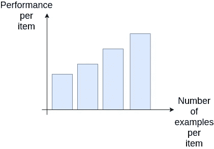

性能随着数据量的典型增长 — 作者提供的图片

在这种情况下，这是一个数据量更多并不总是更好的完美例子。具有给定特征项的用户序列虽然很多，但却不一致。我们从一个主题（在首页显示的）切换到一个完全不同的主题。这是因为落在首页的用户的多样性。

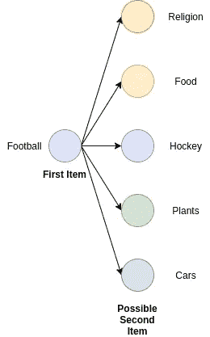

作者提供的图片

这让我感觉到这种多样性让算法感到困惑。但这更多是一种直觉，而不是一个有科学依据的事实。

几天前，我偶然发现了一篇论文“[突破 Softmax 瓶颈：高阶 RNN 语言模型](https://arxiv.org/pdf/1711.03953.pdf)”[1]（发表于 ICLR 2018），这篇论文给了我一个更正式的框架来理解为什么大多数分类神经网络无法处理高上下文多样性。在这篇博客文章中，我们将首先仔细看看这个问题，并解释其基础理论。然后我们将进行一个实验，看看 Mixture-of-Softmaxes 技术是否能改善被构建为基于会话的分类任务的深度推荐系统。

## 问题

首先，让我们回顾一下，在大多数情况下，为了选择正确的标签，分类神经网络必须对每一个可能的选项进行评分。为了做到这一点，我们生成一个向量（我们称之为**h**），它在选定的输出维度中，通常不超过三位数字，这个向量与其他表示标签的向量（嵌入向量）进行比较。这个比较实际上是向量之间的点积。点积产生一个标量，它是一种测量两个向量相似性的方式。与所有条目进行比较的结果（矩阵乘法）是一个称为 logits 的向量，其维度等于可能的输出类别的数量（我们称之为**V**）。然后，logits 通过 softmax 操作生成最终的概率向量。

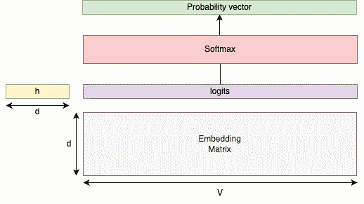

作者提供的图片

我在上一家公司使用的模型是基于序列的分类递归神经网络。给定一系列消费物品，我们希望在所有可能的物品中预测下一个消费物品。这是 Hidasi 等人论文 “[基于会话的推荐与递归神经网络](https://arxiv.org/abs/1511.06939)” 的一个实现。

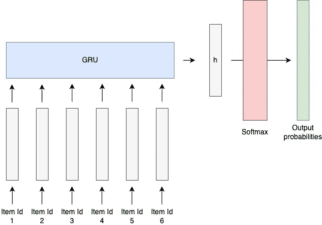

图片来源于作者

在评分操作之前，GRU 单元的输出仅是一个相对较小维度的向量。但什么是向量？它只是向量空间中的一个位置。因此，网络的目标是生成在同一序列中彼此接近的向量（例如，小点积值）。

所以我的问题是，当在特定物品之后消费的所有物品彼此非常不同时，算法将如何处理这些情况？如果我们考虑之前说的，所有不同的消费物品（目标）必须接近于序列物品（输入）。最终，很容易形成直觉，即用户序列越多样化，例如，从一个主题跳到一个完全不同的主题，算法实现学习目标的难度就越大。如果所有用户序列非常多样化，那么物品必须同时既接近又远离彼此。

## Softmax 作为矩阵分解

正如我们之前解释的，将语言模型或深度推荐系统框架化为分类问题的 softmax 操作通常具有相同的最后操作步骤。它们对 logits 使用 softmax，logits 是隐藏状态**h**和物品嵌入向量**w**的乘积：

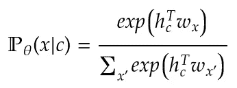

[论文](https://arxiv.org/pdf/1711.03953.pdf) 介绍了 Mixture-of-Softmaxes，并展示了上述操作可以表示为矩阵分解。更正式地说，设 **N** 为训练数据集中样本的数量，**d** 为物品嵌入的选择维度，**V** 为可推荐的物品数量。我们可以定义 3 个矩阵：

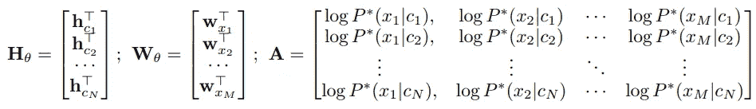

+   **H** ∈ R (N×d)，编码上下文矩阵

+   **W** ∈ R (V×d)，物品嵌入矩阵

+   **A** ∈ R (N×M)，真实数据分布 P* 的对数概率

这一演示超出了本文的范围，但基本上，作者展示的是 softmax 操作最多增加 logits 矩阵的秩 1。这意味着输出对数概率矩阵的秩由 logits 矩阵的秩决定。

## 那么，这与瓶颈有什么联系？

如果我们以某种方式获得了真实上下文数据分布 P* 的概率矩阵，我们可能（根据任务的复杂性）能够展示在现实世界中这个矩阵的秩是非常高的。从理论上讲，这个矩阵的秩可以达到词汇表的大小 V。

但正如我们刚刚解释的，在我们的模型化中，输出矩阵的秩由 logits 的秩决定，后者是矩阵 H 和 W 的乘积。此外，对于任何两个矩阵 X 和 Y，我们有 rank(XY) = min(rank(X), rank(Y))。在我们的情况下，这意味着 logits 矩阵的秩不能超过 d（W 和 H 的最大秩——项目的嵌入维度）。在试图建模高度依赖上下文的任务时，这可能是一个严重的限制。

## 为什么瓶颈是一个问题？

如作者所示，普通的 softmax 操作可以被认为是一个小秩矩阵变换。提醒一下，矩阵的秩是由其列（或行）生成的向量空间的维度。它决定了可以用来创建输出的基（线性无关向量集）的数量。在语言建模中，可以将其解释为模型可以组合的基本语义意义的数量。鉴于自然语言的复杂性，小秩很可能不足以满足需求。

## 解决方案

为了克服 softmax 的瓶颈，论文的作者引入了 Mixture-of-Softmaxes（MoS）。MoS 将输出类别的条件分布在给定上下文的情况下表述为：

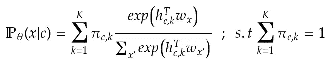

使用了 K 个 softmax，而不是一个。混合权重 **π**（先验）决定了每个 softmax 应该关注的程度。混合权重和每个 softmax 使用的 logits 都依赖于上下文 **c** 和混合组件 **k**。这意味着 MoS 引入了两个新的权重矩阵 **P** ∈ R (Kd × d)，和 **W** ∈ R (K × d)。它们允许以下计算：

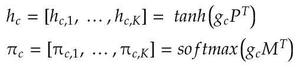

上述公式中，**g** 相当于普通 softmax 的隐藏状态 **h**。让我们试着可视化这里发生的事情。首先，我们使用投影矩阵从 **g** 创建每个 softmax 头所需的隐藏状态：

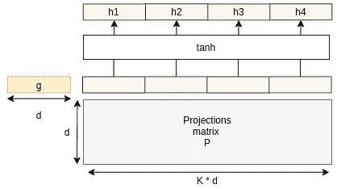

图片由作者提供

然后我们计算出一组混合权重 **π**，同样是从 **g** 中计算得出的。请注意，我们使用 softmax 激活来确保每个上下文中的混合权重总和为 1：

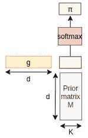

图片由作者提供

最终的计算可以如图所示：

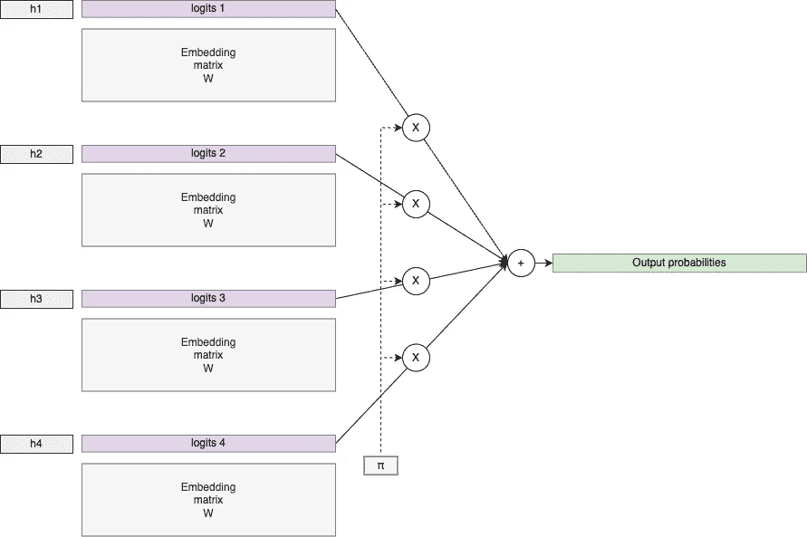

图片由作者提供

## 那么为什么它能解决瓶颈问题呢？

请记住，交叉熵损失（我们用来训练网络的）对输出概率应用了对数变换。这意味着我们用以下表达式来近似真实数据分布的对数概率：

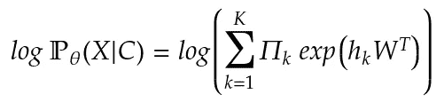

其中**Π**k 是一个（N × N）对角矩阵，元素为先验**π**c,k。由于这是上下文向量和词嵌入的非线性函数（log_sum_exp），上述函数可以是任意高阶。

## Softmax 瓶颈是否适用于深度推荐系统？

Softmax 瓶颈表明表达能力受限于嵌入维度 d。如果 d 过小，softmax 没有足够的能力来表达真实的数据分布。但这只有在真实的数据分布复杂度需要高容量时才成立，比如建模自然语言。那在顺序推荐系统中呢？用户消费特定项目的概率是否高度依赖上下文？我感觉这依赖于许多因素，比如模型使用的特征的质量和数量，也包括我在引言中描述的因素。最终，我喜欢对这些问题做的就是进行实验。

# 实验

在接下来的部分，我将描述我进行的实验，尝试评估 Mixture Of Softmaxes 是否能改善深度推荐系统的推荐质量。

## 模型

我选择实现的模型是之前介绍的 Gru4Rec。在这里，我们实现了基础版本。我们只包含项目标识符的序列，不使用任何附加信息。

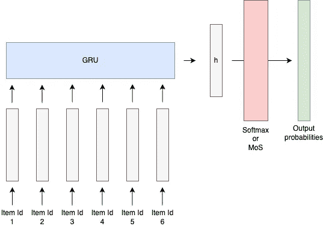

作者提供的图像

## 数据集

我为这些实验选择的数据集是[著名的 MoviLens 数据集](https://grouplens.org/datasets/movielens/) [3]。更具体地说，我选择了 25M 版本，其中包含 162,000 个用户对 62,000 部电影的 2,500 万条评分。[这个 zip 文件](https://files.grouplens.org/datasets/movielens/ml-25m.zip)包含几个 CSV 文件，但我们这里只使用评分数据。

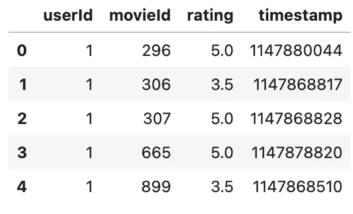

数据框的前几个评分

## 数据预处理

我们有一个典型的显式用户偏好数据集的例子。但在这里，我们想将推荐框架设定为一个分类问题。为此，我们需要：

1.  通过仅保留大于 2.0 的评分（任意选择）并丢弃评分列，将其转化为隐式用户偏好数据集。

1.  将数据集分成训练集和验证集（时间切分）

1.  按用户 ID 分组评分

1.  仅保留评分大于 1 的用户（因为我们需要最少长度为 2 的序列，以便有至少一个输入和一个目标）

1.  对于每个用户，根据时间戳对评分进行排序，并应用滑动窗口来创建序列。

1.  将每个序列保存为序列化的 tensorflow record

1.  同时，统计并保存训练集中的不同电影数量（以便我们了解词汇表的大小）

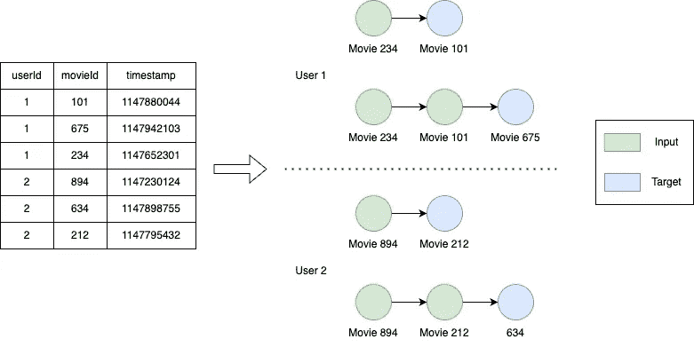

图片作者提供

鉴于数据的规模，我必须使用分布式框架（在这种情况下是 dataflow，即 google cloud 管理版的 apache beam）来在 4 个不同的工作节点上并行执行所有预处理。

# 结果

与其他神经网络一样，我们有一些重要的超参数需要调整。在我们的案例中，最重要的超参数是：

+   批量大小

+   学习率

+   电影 ID 嵌入维度

+   softmax 头的数量

现代推荐系统架构通过多个步骤来提高性能。如果你想了解更多，可以查看[我关于多阶段推荐的文章](https://medium.com/mlearning-ai/building-a-multi-stage-recommendation-system-part-1-1-95961ccf3dd8)。我们使用的模型通常用作候选生成模型。这意味着我们最关心的指标是召回率。在这里，我们选择报告 Recall@100。

我最初想对超参数进行全面的网格搜索，但鉴于数据集的规模，这看起来非常昂贵。经过几次实验，我了解到相对较低的批量大小会带来更好的性能（选择了 64）。此外，我将 softmax 头的数量固定为 4（出于成本考虑）。

我在这里报告了三种不同嵌入维度（32、64、128）下普通 softmax 与 softmax 混合模型的结果：

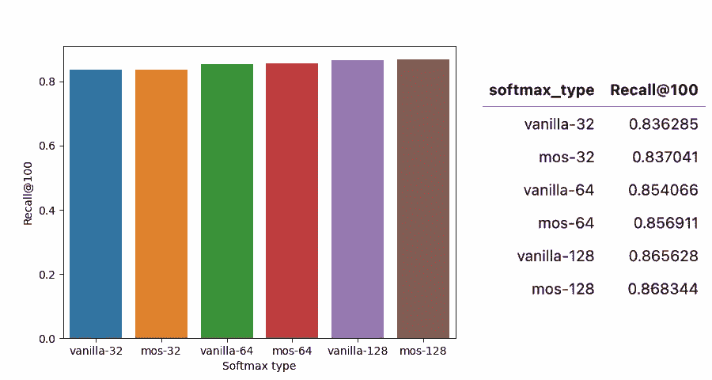

图片作者提供

正如我们通常观察到的，这些基于嵌入的网络中，嵌入维度越大，性能越好。此外，从这个图中并不完全明显，但 Mixture-of-Softmaxes 的性能比普通 softmax 略好。现在，这种改进是否显著？实际上并不显著，我们只在 32 维版本中获得了非常低的 0.090% 改进，在 64 版本中为 0.333%，在 128 版本中为 0.314%。

## 这个结果是预期的吗？

首先，正如我们在引言中解释的，Mixture-of-Softmaxes 使我们能够克服普通 softmax 的低秩瓶颈。但是，这个瓶颈本身就是一个问题吗？作者们展示了在语言建模中确实如此。现在，对于基于序列的推荐任务，这一点并不明显。我猜测这可能取决于推荐的上下文复杂性。诸如序列长度和消费模式的多样性等因素可能对 MoS 的效果有显著影响。

其次，正如我们在理论部分解释的那样，日志概率输出矩阵的秩受限于电影标识符的嵌入维度。理论上，用 softmax 混合物替代普通 softmax 可以消除这一限制。因此，我原本期望 MoS 在低嵌入维度下比高维度下更有益。那么发生了什么呢？

## 按观察数量划分的性能

Gru4Rec 是一个协同推荐系统。像任何类似的系统一样，它在给定项目上的表现高度依赖于该项目的数据量。当新项目进入平台（即处于冷启动阶段）时，我们没有很多与之相关的序列，系统在提供相关推荐方面表现不佳。因此，性能与每个项目的训练示例数量直接相关。

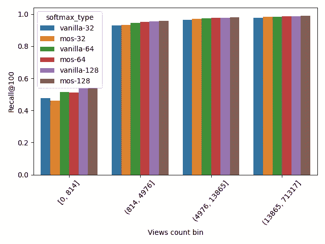

图像由作者提供

我创建了分箱的限制，以便每个分箱获得相同数量的观察值。如图所示，电影在数据集中出现得越多，性能越好。现在，我们还看到另一个趋势。这一次，MoS 版本在低观看次数分箱（最左侧的分箱）中的表现低于普通 softmax。这表明建模复杂度的增加对冷启动项目的推荐没有好处。MoS 增加了对数据量的要求。MoS 仅在项目有足够数据时才有益。

## 按多样性划分的性能

你可能还记得，在介绍中我描述了我之前公司中的一个特定用例，该用例的性能较低，因为训练序列的多样性。另一个我想进行的有趣分析是研究 MoS 的有效性与用户序列的多样性之间的关系。当用户序列非常多样化时，MoS 是否更有效？

要回答这个问题，我们首先需要能够量化用户序列的多样性，例如量化一个视图与序列中前一个视图的不同程度。为此，我们将依赖用户-项目互动矩阵。

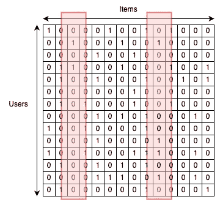

图像由作者提供

用户-项交互矩阵是一个由 1 和 0 组成的稀疏矩阵。用户通过行表示，项通过列表示。在每个单元格中，如果用户观看过特定电影，则为 1，否则为 0。从这个矩阵中，我们可以通过计算两个相关列之间的余弦距离来计算两个项之间的协作距离。当两个项被共同用户观看时，它们就接近。如果我们考虑有 N 个项，则总体计算的结果是一个 N x N 的平方矩阵，给出了任意两个项之间的距离。最后，为了确定序列的多样性，我仅返回目标项与序列中前一个项之间的距离。我本可以考虑目标项与所有前项之间的距离，但结果已经足够好了。

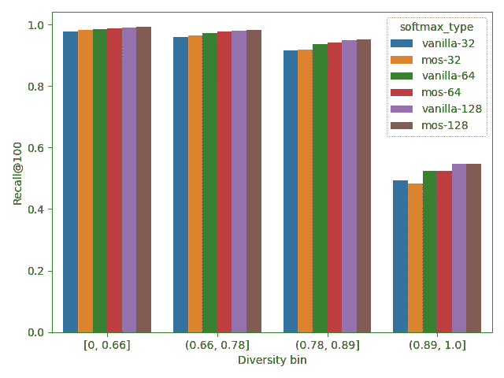

图片由作者提供

正如所见，序列中的多样性越高，算法准确预测下一个观看项的难度就越大。我们本可以通过利用项的元数据来以基于内容的方式计算两个项之间的距离，但我相信得出的见解会是类似的。

此外，另一个从上述数据中获得的见解是，我们发现 MoS 技术似乎对最具多样性的序列（最右侧的桶）效果不佳。这似乎有些违反直觉，因为使用高排名建模技术的目的是更好地处理更复杂的推荐设置。那么 MoS 是否在处理高度多样化的用户序列时失败了呢？

## 性能按 #观察 x 多样性 细分

为了充分回答上述问题，我们需要通过数据量和多样性的组合来细分性能。一旦计算出每个组合的 Recall@100，我们就可以更详细地研究 MoS 对性能的影响。我们首先对 32 维版本进行分析。

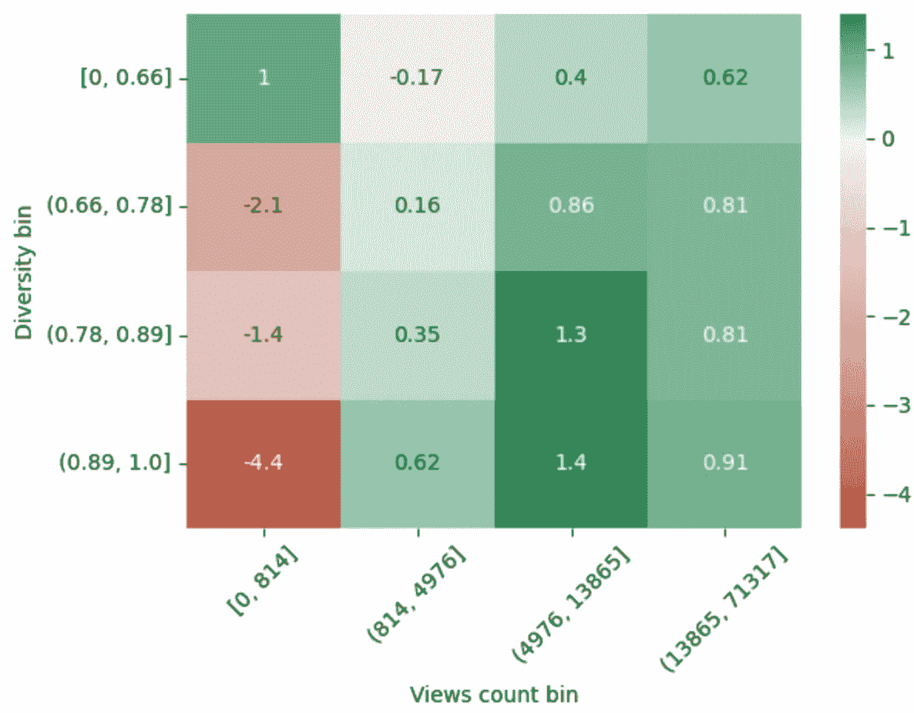

正如所见，MoS 效果的减弱主要是由于低观看次数/高多样性桶。这是相当有道理的。模型复杂性的增加会提高数据量要求。在项的序列不多且非常多样化的情况下，引入 MoS 并不具有优势。相反，当数据量足够时，可以看到用户序列越多样化，MoS 的效果越明显。

现在看一下 64 维版本：

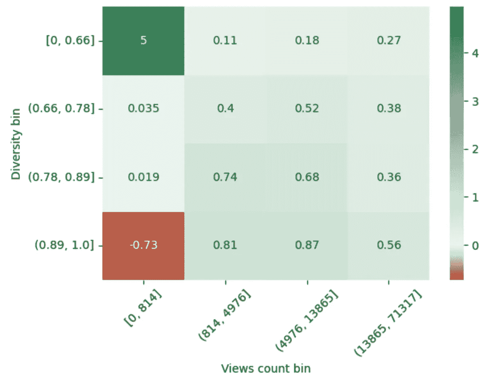

图片由作者提供

以及 128 维版本：

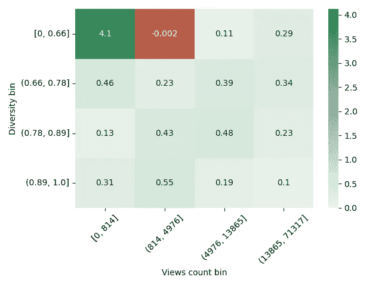

图片由作者提供

如果我们通过移除第一个低观看次数桶（0 到 814）中的所有观察来计算性能，我们观察到 MoS 的整体表现是积极的：

+   32 维版本的 +0.618%

+   64 维版本的 +0.459%

+   128 维版本的提升为+0.320%

正如预期的那样，MoS 对低维嵌入更有益。这是因为嵌入维度越低，MoS 旨在消除的瓶颈越大。

# 结论

本研究的主要结论如下。MoS 的有效性与以下因素相关：

+   数据量。它通过增加建模复杂性，给每项数据引入额外的数据量要求。当每项的观察数量足够时，性能会得到提升。

+   用户序列的多样性。仅在会话数据集的复杂性要求时，MoS 才有效。

+   嵌入维度大小。MoS 在低维嵌入上的效果优于高维嵌入。

附注：你可以在[我的个人 GitHub](https://github.com/biarne-a)上找到[所有相关代码](https://github.com/biarne-a/mos)。

最后说明：尽管对于这个数据集的改进相对较小，但我仍然认为，对于一些具有非常长序列和大量多样性的工业数据集，改进可能会更为重要。

# **参考文献**

[1] Zhilin Yang, Zihang Dai, Ruslan Salakhutdinov, William W. Cohen. 打破 Softmax 瓶颈：高阶 RNN 语言模型. [`arxiv.org/pdf/1711.03953.pdf`](https://arxiv.org/pdf/1711.03953.pdf)

[2] Balázs Hidasi, Alexandros Karatzoglou, Linas Baltrunas, Domonkos Tikk. 基于会话的推荐系统与递归神经网络. [`arxiv.org/abs/1511.06939`](https://arxiv.org/abs/1511.06939)

[3] F. Maxwell Harper 和 Joseph A. Konstan. 2015. MovieLens 数据集：历史与背景. ACM 互动智能系统 (TiiS) 5, 4: 19:1–19:19. [`doi.org/10.1145/2827872`](https://doi.org/10.1145/2827872)
