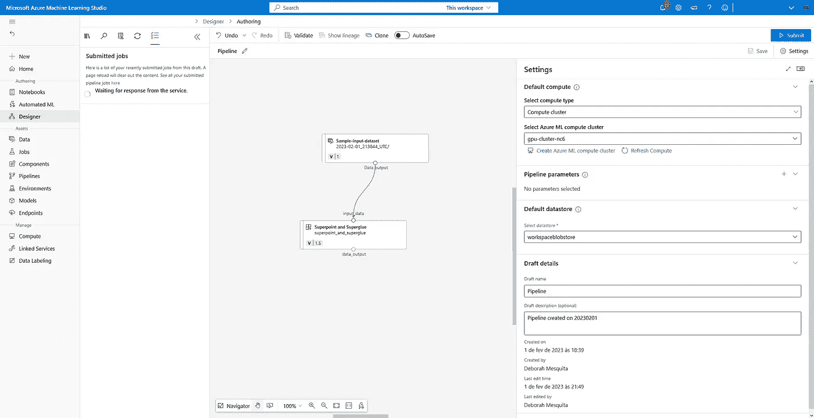

# MLOps 简化版：如何使用 Azure 机器学习组件运行批量预测管道

> 原文：[`towardsdatascience.com/mlops-made-simple-how-to-run-a-batch-prediction-pipeline-using-azure-machine-learning-components-ea7931e818c8?source=collection_archive---------11-----------------------#2023-02-06`](https://towardsdatascience.com/mlops-made-simple-how-to-run-a-batch-prediction-pipeline-using-azure-machine-learning-components-ea7931e818c8?source=collection_archive---------11-----------------------#2023-02-06)

## 你只是想获取你的模型.pt 文件，上传到某个地方并获得预测，对吗？让我们看看如何使用 AML 基础设施来做到这一点。

[](https://medium.com/@dehhmesquita?source=post_page-----ea7931e818c8--------------------------------)[](https://towardsdatascience.com/?source=post_page-----ea7931e818c8--------------------------------) [Déborah Mesquita](https://medium.com/@dehhmesquita?source=post_page-----ea7931e818c8--------------------------------)

·

[关注](https://medium.com/m/signin?actionUrl=https%3A%2F%2Fmedium.com%2F_%2Fsubscribe%2Fuser%2Fdd9e06a0a640&operation=register&redirect=https%3A%2F%2Ftowardsdatascience.com%2Fmlops-made-simple-how-to-run-a-batch-prediction-pipeline-using-azure-machine-learning-components-ea7931e818c8&user=D%C3%A9borah+Mesquita&userId=dd9e06a0a640&source=post_page-dd9e06a0a640----ea7931e818c8---------------------post_header-----------) 发表在 [Towards Data Science](https://towardsdatascience.com/?source=post_page-----ea7931e818c8--------------------------------) ·7 分钟阅读·2023 年 2 月 6 日[](https://medium.com/m/signin?actionUrl=https%3A%2F%2Fmedium.com%2F_%2Fvote%2Ftowards-data-science%2Fea7931e818c8&operation=register&redirect=https%3A%2F%2Ftowardsdatascience.com%2Fmlops-made-simple-how-to-run-a-batch-prediction-pipeline-using-azure-machine-learning-components-ea7931e818c8&user=D%C3%A9borah+Mesquita&userId=dd9e06a0a640&source=-----ea7931e818c8---------------------clap_footer-----------)

--

[](https://medium.com/m/signin?actionUrl=https%3A%2F%2Fmedium.com%2F_%2Fbookmark%2Fp%2Fea7931e818c8&operation=register&redirect=https%3A%2F%2Ftowardsdatascience.com%2Fmlops-made-simple-how-to-run-a-batch-prediction-pipeline-using-azure-machine-learning-components-ea7931e818c8&source=-----ea7931e818c8---------------------bookmark_footer-----------)

图片由 [Sarah Dorweiler](https://unsplash.com/ko/@sarahdorweiler?utm_source=unsplash&utm_medium=referral&utm_content=creditCopyText) 提供，来源于 [Unsplash](https://unsplash.com/pt-br/fotografias/x2Tmfd1-SgA?utm_source=unsplash&utm_medium=referral&utm_content=creditCopyText)

在日常工作中，作为数据科学家，我们经常需要使用一些模型用于内部目的。如果我们是一个人团队，将其运行在自己的机器上是可以的，但我们通常需要与其他队友共享我们的工作。共享运行脚本的 Jupyter 笔记本是一种方法，但在实验阶段之后，笔记本会变得难以管理和操作。

最近，Azure 引入了[**组件**](https://learn.microsoft.com/en-us/azure/machine-learning/concept-component)，这是一种“自包含的代码片段，执行机器学习管道中的一个步骤”。我们可以使用这些组件构建独立可执行的工作流，并与其他队友共享。在今天的文章中，我们将使用组件创建一个特征匹配管道。

注意：如果你对 Azure Machine Learning 完全陌生，阅读[这篇文章](https://medium.com/towards-data-science/automl-for-object-detection-how-to-train-a-model-to-identify-potholes-e22c3f4b774)可能会对你有所帮助，其中简要回顾了一些 AML 概念。

# MLOps 101

正如[Ville Tuulos](https://twitter.com/vtuulos)在书籍[《高效数据科学基础设施：如何提高数据科学家的生产力》](https://www.manning.com/books/effective-data-science-infrastructure)（一本很棒的书，我强烈推荐阅读）中指出的那样，数据科学基础设施有三个构建块：

+   **架构**：实际代码的样子以及系统对数据科学家的感受

+   **作业调度器：**工作流如何触发、执行、监控以及如何处理失败

+   **计算资源：**代码实际执行的地方

对我们来说，**架构**部分包含我们的 python 代码。这部分在不同平台上变化不大。**作业调度器**和**计算资源**会根据我们运行工作流的平台而有所不同。

大多数数据科学工作流失败并不是由于代码本身，而是由于数据或我们运行代码的环境发生了变化。每个 AML 组件都有自己的环境和依赖项，因此它对我们工作流的稳定性贡献很大。

使用 AML 堆栈，我们可以通过[组件](https://learn.microsoft.com/en-us/azure/machine-learning/concept-component)构建**架构**，使用管道作业作为我们的**作业调度器**，并使用[计算集群](https://learn.microsoft.com/en-us/azure/machine-learning/how-to-create-attach-compute-cluster?tabs=python#what-is-a-compute-cluster)或[计算实例](https://learn.microsoft.com/en-us/azure/machine-learning/concept-compute-instance)来运行我们的工作流。

现在让我们看看如何在 AML 工作区中使用这些内容。

# 我们的批量预测管道

我们将创建一个批处理预测管道，使用 [Superglue 和 Superpoint](https://github.com/jomariya23156/SuperGlue-for-Visual-Place-Recognition) [1]。我们的输入可以是目标图像（例如电影海报），我们希望知道数据集中每张图像是否包含该电影海报。

你听说过 [使用 OpenCV 进行特征匹配](https://docs.opencv.org/4.x/dc/dc3/tutorial_py_matcher.html) 吗？


使用 SIFT 描述符和比率测试的暴力匹配

Superglue 和 Superpoint 使用深度学习来完成这个任务。最棒的是，我们不需要重新训练模型，因为 Superpoint 是以自监督的方式训练的 [2]。

## AML 组件

组件需要一个明确定义的接口（输入和输出）。我们可以在管道之间共享和重用它们，并且它们有版本控制，所以我们可以不断改进代码并根据需要进行修改。组件的代码可以用任何语言编写（python、R 等）；唯一的要求是它必须能够通过 shell 命令执行。

我们的主要组件将从数据资产中读取数据，运行 Superpoint+Superglue，并输出一个包含目标图像的图像 URL 的 CSV 文件。输入的 [数据资产](https://learn.microsoft.com/en-us/azure/machine-learning/how-to-create-data-assets?tabs=cli) 将包含我们要验证的图像列表和一张包含电影海报的 .jpeg 文件。

我们可以使用 Azure ML CLI v2 或 Azure ML SDK v2 构建组件。在这里我们将使用 python SDK。代码改编自 [Ariya Sontrapornpol 编写的 superglue_rank_images.py 脚本](https://github.com/jomariya23156/SuperGlue-for-Visual-Place-Recognition/blob/master/superglue_rank_images.py)。这就是组件的样子：

```py
from mldesigner import command_component, Input, Output
from pathlib import Path

@command_component(
    name="superpoint_and_superglue",
    version="1",
    display_name="Superpoint and Superglue",
    description="Run Superpoint and Superglue models and outputs csv with matching images",
    environment=dict(
        conda_file=Path(__file__).parent / "conda.yaml",
         image="mcr.microsoft.com/azureml/openmpi4.1.0-ubuntu20.04",
    ),
)
def superpoint_and_superglue_component(
    input_data: Input(type="uri_folder"),
    data_output: Output(type="uri_folder"),
):    
    import os    
    import pandas as pd
    import numpy as np
    import cv2
    import argparse
    import requests
    import shutil

    import os
    os.environ["KMP_DUPLICATE_LIB_OK"]="TRUE"

    import torch

    from pathlib import Path
    import random
    import matplotlib.cm as cm

    import models.matching
    import models.utils       

    def ranking_score(matches, match_confidence):
        return np.sum(np.multiply(matches,match_confidence)).astype(np.float32)  

    def load_models(device, nms_radius, keypoint_threshold, max_keypoints, superglue, sinkhorn_iterations, match_threshold):
        # Load the SuperPoint and SuperGlue models.

        print('Running inference on device \"{}\"'.format(device))
        config = {
            'superpoint': {
                'nms_radius': nms_radius,
                'keypoint_threshold': keypoint_threshold,
                'max_keypoints': max_keypoints
            },
            'superglue': {
                'weights': superglue,
                'sinkhorn_iterations': sinkhorn_iterations,
                'match_threshold': match_threshold,
            }
        }

        matching = models.matching.Matching(config).eval().to(device)
        return matching

    def get_scores(timer, device, pairs, matching, input_dir, output_dir, viz, viz_extension, resize, resize_float, query):
        # [...]

    def main():
        torch.set_grad_enabled(False)

        input_dir = input_data
        print('Looking for data in directory \"{}\"'.format(input_dir))
        output_dir = Path(os.path.join(input_data, "/superglue_outputs"))
        output_dir.mkdir(exist_ok=True, parents=True)
        print('Will write matches to directory \"{}\"'.format(output_dir))

        force_cpu = False

        device = 'cuda' if torch.cuda.is_available() and not force_cpu else 'cpu'
        timer = models.utils.AverageTimer(newline=True)      

        pairs = [["query.jpg", "query.jpg"],["query.jpg", "movie_poster.jpg"]]

        all_uri_files = os.listdir(input_data)
        candidate_image_filenames = []
        for image_name in all_uri_files:
            if (image_name.endswith('.jpg') or image_name.endswith('.png') or image_name.endswith('.jpeg')):
                candidate_image_filenames.append(image_name)

        nms_radius = 4
        keypoint_threshold = 0.005
        max_keypoints = 1024
        superglue = "indoor"
        sinkhorn_iterations = 20
        match_threshold = 0.2

        matching = load_models(device, nms_radius, keypoint_threshold, max_keypoints, superglue, sinkhorn_iterations, match_threshold)

        output = []       

        query = (output_dir / "query.jpg")

        for image in candidate_image_filenames:                 
            shutil.copyfile(os.path.join(input_dir, image), query)

            viz = False
            viz_extension = "png"
            resize = [1200, 900]
            resize_float = False

            _,predicted_score = get_scores(timer, device, pairs, matching, input_dir, output_dir, viz, viz_extension, resize, resize_float, query)            
            item_output = {"score":predicted_score,"image":image}
            output.append(item_output)

        return output          

    output = main()
    pd.DataFrame(output).to_csv((Path(data_output) / "results.csv"), index=False)
```

**@command_component** 装饰器将 python 函数转换为管道服务使用的静态规范（YAML）。我们需要提供这些元数据 [3]：

+   `name` 是组件的唯一标识符

+   `version` 是组件的当前版本。一个组件可以有多个版本。

+   `display_name` 是组件在 UI 中的友好显示名称，这个名称不是唯一的

+   `description` 通常描述该组件可以完成的任务

+   `environment` 指定了该组件的运行时环境。该组件的环境指定了一个 docker 镜像，并引用了 `conda.yaml` 文件。

能够为每个组件提供环境非常好，因为我们可以隔离每个组件使用的依赖项。

`uri_folder` 输入类型具有只读挂载模式，而 `uri_folder` 输出类型具有读写挂载模式。有关在管道作业中访问数据的更多信息，请参考 [在作业中访问数据](https://learn.microsoft.com/en-us/azure/machine-learning/how-to-read-write-data-v2?tabs=python) 和 [Azure 机器学习中的数据概念](https://learn.microsoft.com/en-us/azure/machine-learning/concept-data)。

要在我们的 AML 工作区注册此组件，我们还将使用 Python SDK，以下是代码：

```py
from azure.identity import DefaultAzureCredential, InteractiveBrowserCredential
from azure.ai.ml import MLClient, load_component

try:
    credential = DefaultAzureCredential()
    # Check if given credential can get token successfully.
    credential.get_token("https://management.azure.com/.default")
except Exception as ex:
    # Fall back to InteractiveBrowserCredential in case DefaultAzureCredential not work
    credential = InteractiveBrowserCredential()

# Get a handle to workspace
ml_client = MLClient.from_config(credential=credential)

# IMPORTANT: here we import the method we've created previously
from src.component import superpoint_and_superglue_component

# Register the component
ml_client.components.create_or_update(superpoint_and_superglue_component, version="1.3")
```

现在我们可以在 AML 工作区中看到这个组件。


我们创建的组件

下一步是创建管道以使用该组件。

## AML 管道

我们可以使用 Azure ML CLI v2、Azure ML SDK v2 或 Designer 来定义管道。由于我们的管道很简单，我们将使用设计器来定义它。要创建输入数据资产，我们也将使用工作区 UI。


使用 UI 创建数据资产

由于我们的管道有一个自定义组件，我们需要创建一个自定义管道


制作自定义管道的选项卡

提交管道运行时，我们需要指定计算资源。您也可以使用 UI 创建一个。



使用 Designer 创建管道

# 最后的想法

AML 组件是组织我们在数据科学日常活动中代码的绝佳方式。由于它们可以用任何语言编写，我们可以在任何可以运行 shell 命令的平台上运行这些代码，而不仅仅是在 Azure Machine Learning 内部。

通过使用 AML，我们可以获得 UI 来管理它们、创建数据资产、管理计算资源等。AML 生态系统为在工作流程中开始使用 MLOps 原则提供了一个很好的方法。

# 参考文献

[1] [`github.com/jomariya23156/SuperGlue-for-Visual-Place-Recognition`](https://github.com/jomariya23156/SuperGlue-for-Visual-Place-Recognition)

[2] DeTone, Daniel, Tomasz Malisiewicz, 和 Andrew Rabinovich. “Superpoint: 自监督兴趣点检测和描述。” *IEEE 计算机视觉与模式识别会议研讨会论文集*. 2018.

[3] [`learn.microsoft.com/en-us/azure/machine-learning/how-to-create-component-pipeline-python`](https://learn.microsoft.com/en-us/azure/machine-learning/how-to-create-component-pipeline-python)
