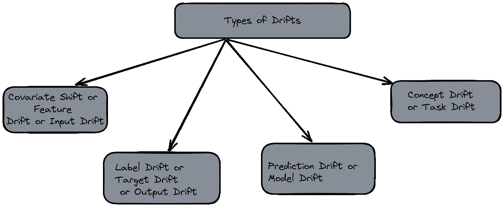
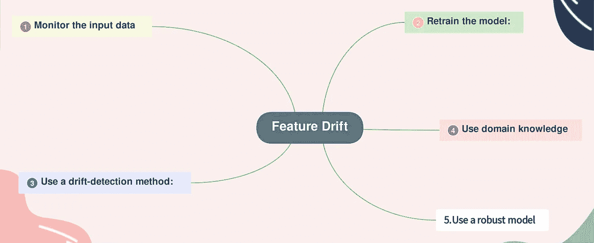
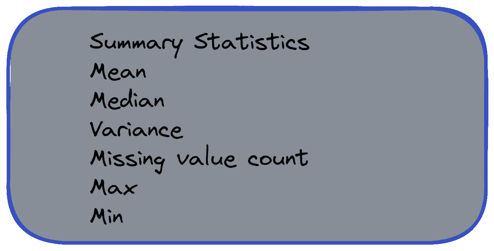
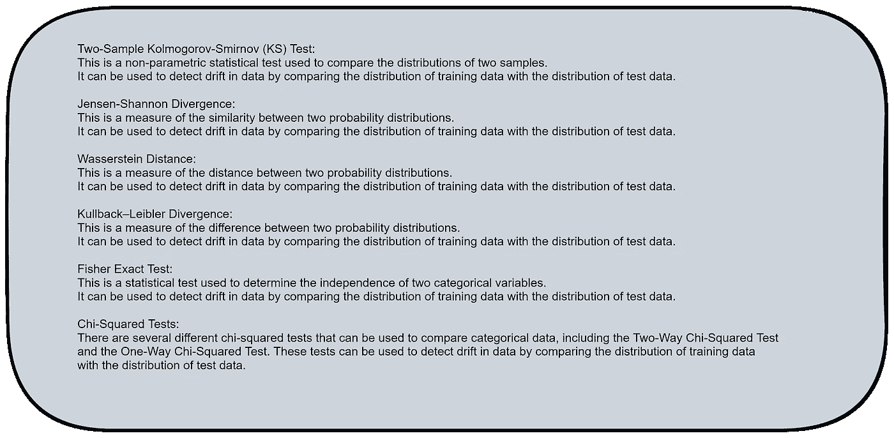

# MLOps — 了解数据漂移

> 原文：[`towardsdatascience.com/mlops-understanding-data-drift-69f9bf8a2e46?source=collection_archive---------5-----------------------#2023-01-09`](https://towardsdatascience.com/mlops-understanding-data-drift-69f9bf8a2e46?source=collection_archive---------5-----------------------#2023-01-09)

照片由 [Joshua Sortino](https://unsplash.com/@sortino?utm_source=medium&utm_medium=referral) 拍摄，来自 [Unsplash](https://unsplash.com/?utm_source=medium&utm_medium=referral)

 [Senthil E](https://esenthil.medium.com/?source=post_page-----69f9bf8a2e46--------------------------------)

·

[关注](https://medium.com/m/signin?actionUrl=https%3A%2F%2Fmedium.com%2F_%2Fsubscribe%2Fuser%2F1d8fcdc16d73&operation=register&redirect=https%3A%2F%2Ftowardsdatascience.com%2Fmlops-understanding-data-drift-69f9bf8a2e46&user=Senthil+E&userId=1d8fcdc16d73&source=post_page-1d8fcdc16d73----69f9bf8a2e46---------------------post_header-----------) 发表在 [Towards Data Science](https://towardsdatascience.com/?source=post_page-----69f9bf8a2e46--------------------------------) ·18 分钟阅读·2023 年 1 月 9 日

--

# 介绍：

MLOps 工程师的重要职能之一是监控模型性能。数据漂移会导致模型性能随时间退化。让我们详细探讨数据漂移及我们可以采取的检测步骤。

数据漂移是指数据分布随时间发生变化。这可能由于

+   ***数据收集过程的变化，***

+   ***数据源的变化，***

+   ***或业务需求或目标的变化。***

数据漂移可能导致模型性能下降，因为模型应用于与训练时不同的数据。数据漂移有几种类型，包括概念漂移、协变量漂移、先验概率变化和虚拟漂移。

我在这篇文章中使用了 chatgpt3、excalidraw、GitMind 和 carbon.now.sh 工具。

# 内容：

1.  ***数据漂移的类型。***

1.  ***协变量漂移或特征漂移或输入漂移。***

1.  ***标签漂移或目标漂移或输出漂移。***

1.  ***预测漂移或模型漂移***

1.  ***概念漂移或任务漂移。***

1.  ***创建警报并通知。***

1.  ***漂移检测的 Python 包。***

1.  ***结论。***

# 数据漂移的类型：

图片由作者提供

# 协变量漂移或特征漂移或输入漂移：

特征漂移是指用于训练模型的输入变量或特征的变化。

特征漂移可能由于

+   ***数据收集过程的变化***

+   ***提供输入的数据源的变化***

+   ***业务需求的变化。***

特征漂移可能导致模型性能下降，因为模型用于预测的特征发生了变化，并且可能不再相关或准确。

让我们考虑以下情况。

假设我们有一个模型，它是基于输入变量 X 预测输出变量 Y 的。我们可以将输入变量的概率分布（p(X)）和输出变量的概率分布（p(Y)）表示如下：

> **p(X)：** 这是输入变量的概率分布。它描述了 X 在数据中取不同值的可能性。
> 
> **p(Y)**：这是输出变量的概率分布。它描述了 Y 在数据中取不同值的可能性。

如果数据中存在特征漂移，这意味着输入变量的分布随着时间的推移发生了变化。这可以用数学公式表示如下：

+   **p(X1)**：这是在时间 t1 输入变量的概率分布。它描述了在时间 t1 数据中 X 取不同值的可能性。

+   **p(X2)**：这是在时间 t2 输入变量的概率分布。它描述了在时间 t2 数据中 X 取不同值的可能性。

如果 **p(X1)** 和 **p(X2)** 存在显著差异，这可能表明数据中存在特征漂移。这可能导致模型性能下降，因为模型应用于与训练时不同的特征数据。

图片由作者提供

## 监控特征漂移所需的措施：

图片由作者提供

1.  **监控输入数据：** 定期监控输入数据以检测特征分布的变化。这可以帮助你识别特征漂移发生的时机，从而采取措施进行纠正。

1.  **重新训练模型：** 如果你检测到特征漂移，可能需要在更新的数据上重新训练模型以纠正漂移。这将确保模型能够基于当前特征分布进行准确预测。

1.  **使用漂移检测方法：** 有几种方法可以检测特征漂移，例如 Jensen-Shannon 散度或 Kolmogorov-Smirnov 检验。这些方法可以帮助你检测特征分布是否发生了变化，从而采取措施进行纠正。

1.  **利用领域知识：** 运用你的领域知识来理解特征漂移发生的原因以及可以采取的纠正措施。例如，如果你知道数据收集过程发生了变化，你可能需要调整数据收集和预处理的方法。

1.  **使用鲁棒模型：** 考虑使用对特征漂移更鲁棒的模型，例如随机森林或梯度提升模型。这些模型对输入数据的变化不那么敏感，因此可能不容易受到特征漂移的影响。

## 可用的特征漂移检测方法：

有几种方法可以检测机器学习中的特征漂移：

1.  **视觉检查：** 一种简单的方法是通过可视化检查输入数据随时间的变化，看是否有明显的特征分布变化。这可以通过绘制不同时间的数据直方图或散点图并进行比较来完成。

1.  **统计检验：** 统计检验如 Jensen-Shannon 散度或 Kolmogorov-Smirnov 检验可以用于比较不同时间点的输入数据分布并检测显著差异。这些检验可以提供数据漂移程度的定量度量。

1.  **漂移检测算法：** 还有一些专门设计用于检测数据漂移的算法。这些算法可以用来自动检测特征分布的变化，并在检测到漂移时触发警报或采取行动。

1.  **模型性能监控：** 另一种方法是随时间监控模型的性能，并寻找准确性或其他性能指标的显著变化。如果模型的性能开始下降，这可能表明数据存在漂移。

1.  **数据质量检查：** 定期检查输入数据的质量也有助于检测特征漂移。例如，如果特征的范围或方差发生了突然变化，这可能表明数据存在漂移。

我们可以监控以下内容来检测特征漂移：

## **数值特征**

作者提供的图片

作者提供的图片

这个函数计算了训练数据和测试数据中每个特征的各种汇总统计量，包括均值、中位数、方差、缺失值计数、最大值和最小值。然后，它会比较这些统计量在训练数据和测试数据之间的差异，并且如果这些差异中有任何一个超出某个阈值，则返回`**True**`。这可以用来检测数值特征漂移，因为训练数据和测试数据之间汇总统计量的显著差异可能表明数据发生了漂移。

## **统计检验：**

图片由作者提供

## **Jensen-Shannon：**

Jensen-Shannon 散度是衡量两个概率分布相似度的指标。它被定义为两个分布之间的 Kullback-Leibler 散度和这两个分布的平均分布之间的 Kullback-Leibler 散度的平均值。Jensen-Shannon 散度总是非负的，当且仅当两个分布相同时，它的值为零。

在特征漂移检测的背景下，Jensen-Shannon 散度可以用来比较训练集中特征的分布与测试集中特征的分布。如果这两个分布之间的 Jensen-Shannon 散度超过某个阈值，这可能表明数据中存在漂移。

图片由作者提供

这个函数使用`jensen_shannon_divergence()`函数计算训练数据和测试数据中特征分布之间的 Jensen-Shannon 散度。Jensen-Shannon 散度是衡量两个概率分布相似度的指标，散度越低表示相似度越高。如果散度超过某个阈值，这可能表明数据存在漂移。

## **双样本 Kolmogorov-Smirnov (KS)、Mann-Whitney 或 Wilcoxon 检验：**

Kolmogorov-Smirnov (KS) 检验是一种非参数检验，可用于检测机器学习中的特征漂移。它基于比较两个样本的分布以查看它们是否来自同一总体的思想。

要使用 KS 检验进行特征漂移检测，你首先需要将数据分成两个集合：训练集和测试集。训练集用于训练模型，而测试集用于评估模型的性能。然后，你可以使用 KS 检验比较训练集中特征的分布与测试集中特征的分布。如果检验的 p 值低于某个阈值，这可能表明数据存在漂移。

图片由作者提供

该函数使用来自 `scipy.stats` 模块的 `ks_2samp()` 函数计算训练数据和测试数据中特征分布之间的两样本 KS 检验的 p 值。KS 检验是一种非参数检验，比较两个样本的分布，以判断它们是否来自相同的总体。如果 p 值低于某个阈值，这可能表示数据存在漂移。通常这个阈值或显著性水平为 0.05。

## Wasserstein 距离：

作者提供的图片

该函数使用来自 `scipy.stats` 模块的 `wasserstein_distance()` 函数计算训练数据和测试数据中特征分布之间的 Wasserstein 距离。Wasserstein 距离是衡量两个概率分布之间距离的指标，距离越高表示分布之间的差异程度越大。如果距离超过某个阈值，这可能表示数据存在漂移。

需要注意的是，Wasserstein 距离要求输入数据是一维且非负的。如果你的数据不符合这些要求，你可能需要对其进行转换或使用其他方法来检测特征漂移。

## **Kullback-Leibler 散度：**

作者提供的图片

该函数使用来自 `scipy.stats` 模块的 `entropy()` 函数计算训练数据和测试数据中特征分布之间的 Kullback-Leibler 散度。Kullback-Leibler 散度是衡量两个概率分布之间差异的指标，散度越高表示分布之间的差异程度越大。如果散度超过某个阈值，这可能表示数据存在漂移。

## **分类特征**

**总结统计**

**众数、唯一值数量、缺失值数量：**

作者提供的图片

该函数计算训练数据和测试数据中的众数、唯一值数量和缺失值数量，并比较它们以查看是否存在显著差异。如果众数或唯一值数量发生显著变化，或者缺失值数量显著增加，这可能表示数据存在漂移。

需要注意的是，这种检测分类数据特征漂移的方法基于特征分布在训练数据和测试数据之间没有发生显著变化的假设。如果这个假设不成立，这种方法可能无法有效检测漂移。根据你的数据特征，你可能需要使用其他方法或方法组合。

## **统计检验：**

## 单向卡方检验：

单向卡方检验（Chi Squared Contingency Test）是一种统计检验方法，可用于检测分类数据中的特征漂移。它基于将训练数据和测试数据中不同类别的观察频率与若类别相互独立时预期观察到的频率进行比较的思想。

作者提供的图像

此函数使用`scipy.stats`模块中的`chi2_contingency()`函数计算卡方统计量和检验的 p 值。卡方统计量是数据中类别的观察频率与预期频率之间差异的度量，而 p 值是观察到的频率在类别独立的情况下出现的概率度量。如果 p 值低于某个阈值，这可能表明数据中存在漂移。

## 双向卡方检验：

双向卡方检验（Chi Squared Contingency Test）是一种统计检验方法，可用于检测分类数据中的特征漂移。它基于将训练数据和测试数据中不同类别的观察频率与若类别相互独立时预期观察到的频率进行比较的思想。

作者提供的图像

此函数使用`scipy.stats`模块中的`chi2_contingency()`函数计算卡方统计量和检验的 p 值。卡方统计量是数据中类别的观察频率与预期频率之间差异的度量，而 p 值是观察到的频率在类别独立的情况下出现的概率度量。如果 p 值低于某个阈值，这可能表明数据中存在漂移。

## Fisher 精确检验：

Fisher 精确检验是一种统计检验方法，可用于检测分类数据中的特征漂移。它基于将训练数据和测试数据中不同类别的观察频率与若类别相互独立时预期观察到的频率进行比较的思想。

作者提供的图像

此函数使用`scipy.stats`模块中的`fisher_exact()`函数计算 Fisher 精确检验的 p 值。p 值是观察到的频率在类别独立的情况下出现的概率度量。如果 p 值低于某个阈值，这可能表明数据中存在漂移。

需要注意的是，当预期频率较小时，Fisher 精确检验（Fisher Exact Test）是比卡方检验更强大的替代方法，但当预期频率较大时，它通常不如卡方检验强大。此外，该检验要求数据为频数而非比例或百分比。如果您的数据形式不同，可能需要在进行检验前调整数据。

## 类-MonitorDrift：

结合以上所有内容，创建一个名为 MonitorDrift 的类：

作者提供的图像

这个类有五个方法：`feature_drift_fisher()`、`feature_drift_chi2()`、`feature_drift_chi2_one_way()`、`feature_drift_jensen_shannon()` 和 `feature_drift_wasserstein()`。每个方法都接受一个参数 `feature`，这是你想计算特征漂移的特征名称。

`feature_drift_fisher()` 方法使用 `scipy.stats` 模块中的 `fisher_exact()` 函数来计算指定特征的 Fisher 精确检验的 p 值。`feature_drift_chi2()` 方法使用 `chi2_contingency()` 函数来计算指定特征的卡方统计量和 p 值的双向卡方检验。`feature_drift_chi2_one_way()` 方法类似，但使用单向卡方检验。

`feature_drift_jensen_shannon()` 方法使用 `scipy.spatial.distance` 模块中的 `jensenshannon()` 函数来计算 Jensen-Shannon 距离。

# 标签漂移或目标漂移：

标签漂移，也称为注释漂移，是指当与数据集相关的标签或类别随时间变化时出现的问题。这可能由于多种原因，例如人类判断的变化、新类别的引入，或现有类别的合并或拆分。

+   ***数据中标签分布的变化***

+   ***P(Y)的变化***

假设我们有一个包含特征向量 `x` 和相应标签 `y` 的数据集。数据的概率分布表示为 `p(x)`，标签的概率分布表示为 `p(y)`。

在没有标签漂移的情况下，我们期望 `p(x)` 和 `p(y)` 随时间保持稳定，这意味着看到特定特征向量或标签的概率不会显著变化。然而，当标签漂移发生时，`p(y)` 会随时间变化，意味着看到特定标签的概率可能会显著变化。这可能是由于标签定义的变化、标签分配方式的变化或其他因素造成的。

## 监测标签漂移所需的行动：

+   *定期审查和更新数据集中的标签。*

+   *使用主动学习或自学习算法。*

+   *监控你的模型的性能。*

+   *使用漂移检测方法识别标签漂移。*

+   *监控数据收集过程。*

## 检测标签漂移的方法：

这里是一些可用于检测标签漂移的方法。

+   *Page-Hinkley 检验。*

+   *ADWIN（自适应窗口） 。*

+   *DDM（漂移检测方法）。*

+   *双向卡方检验。*

+   *单向卡方检验。*

+   *Fischer 精确检验。*

## 标签漂移的例子：

这里是一些标签漂移的例子。

+   例如，考虑一个医学记录数据集，其中标签表示患者的诊断。如果医学条件的定义随着时间的推移而发生变化（例如，由于新的研究或临床指南的更新），那么数据集中的标签可能会变化，从而导致标签漂移。

+   基于客户评论的客户情绪分析。如果确定评论是积极还是消极的标准发生变化，则会导致标签漂移。

## Page-Hinkley 测试：

作者提供的图片

作者提供的图片

# 预测漂移或输出漂移：

预测漂移，也称为输出漂移，发生在机器学习模型的准确性随着时间的推移而降低时。

预测漂移的原因

+   数据分布的变化。

+   模型性能的变化。

+   预测的现实世界现象的变化。例如，考虑一个用于预测天气的模型。如果天气模式随时间发生显著变化（例如由于气候变化），这可能会导致模型的预测变得不那么准确。

+   模型给出的预测标签分布的变化

+   P(\hat{Y}| X)*P*(*Y*^∣*X*) 的变化

在分类模型的背景下，我们可以使用概率分布表示预测类别（y）和真实类别（x）。如果这些概率分布之间的差异随时间增加，则发生预测漂移。

## 检测预测或输出漂移的方法：

+   *监控模型准确性。*

+   *使用交叉验证。*

+   *使用数据拆分。*

使用 PaheHinkley 方法检测预测漂移。

作者提供的图片

预测漂移的一些例子：

+   **股票价格预测**——经济或公司绩效的变化。

+   **欺诈检测模型**——如果欺诈活动的模式随着时间变化。

+   **客户流失预测**：如果客户的行为或需求随时间变化。

+   **医疗模型**：如果患者的健康状态或风险因素随时间变化。

# 概念漂移：

+   概念漂移指的是被机器学习模型学习的基础数据分布的变化。

+   概念漂移可能会随着时间的推移发生，因为收集的数据发生变化，或者它可能是由于正在建模的现实世界现象的变化所导致的。

+   概念漂移可能使机器学习模型的准确性降低，因为它们可能无法准确识别数据中的模式和关系。

+   概念漂移是输入变量和标签之间关系的变化。概念漂移指的是输入数据（p(X)）或输出数据（p(Y)）的概率分布的变化。

+   概念漂移是 P(Y| X)P(Y∣X) 的分布变化

+   概念漂移会导致当前模型无效。

## COVID-19 → 概念漂移：

例如，COVID-19 造成了以下影响

1.  **消费者行为的变化**：人们在应对封锁、经济不确定性和其他因素时，改变了他们的购买模式。这导致了依赖消费者数据的行业，如零售、电商和广告，出现了概念漂移。

1.  **经济数据的变化**：例如，由于疫情，失业率和消费者支出模式发生了显著变化，这导致了经济预测模型中的概念漂移。

1.  **社会数据的变化：** 人们的行为和态度因封锁、社交距离和其他措施而发生了变化。这导致了社交媒体和其他在线平台以及市场营销和公众舆论研究中的概念漂移。

1.  **教育模式的变化：** 学校和大学关闭或转为在线学习。这导致了用于预测学生结果的教育数据和算法中的概念漂移。

1.  **工作模式的变化：** Covid 导致工作模式发生了显著变化，许多人转向远程工作或经历了工作时间表的变化。这导致了用于预测劳动力生产力和员工结果的数据和算法中的概念漂移。

1.  **旅行模式的变化：** 人们已根据封锁和其他限制调整了旅行计划。这影响了用于预测旅行需求和模式的算法。

## 检测概念漂移的方法：

+   *监控模型性能。*

+   *使用数据拆分。*

+   *使用统计测试。*

+   *使用漂移检测算法。*

+   *使用人工输入。*

这是监控模型性能的代码。

作者提供的图像

上述代码定期在测试集上评估模型，并将准确性存储在列表中。如果过去 N 次评估间隔的平均准确性低于某个阈值，这可能表明概念漂移，并且模型会在新数据上重新训练。如果平均准确性仍高于阈值，循环继续，模型将在某个间隔后再次评估。

查看下面关于现实世界概念漂移的文章。

[## Zillow Offers 的 5 亿美元+困境 - AI 模型出现了什么问题？ - insideBIGDATA](https://insidebigdata.com/2021/12/13/the-500mm-debacle-at-zillow-offers-what-went-wrong-with-the-ai-models/?source=post_page-----69f9bf8a2e46--------------------------------)

### 在这篇贡献文章中，TruEra 的联合创始人、总裁兼首席科学家 Anupam Datta 讨论了 Zillow 及其……

[insideBIGDATA](https://insidebigdata.com/2021/12/13/the-500mm-debacle-at-zillow-offers-what-went-wrong-with-the-ai-models/?source=post_page-----69f9bf8a2e46--------------------------------) [Forbes](https://www.forbes.com/sites/aparnadhinakaran/2022/06/06/when-ai-attacks-earnings/?sh=7f20aa0d7fb6&source=post_page-----69f9bf8a2e46--------------------------------) [## 当 AI 袭击收益时

### AI 可以带来惊人的收入增长——直到它不再有效。这一课正在被一家成长中的公司以艰难的方式学习中……

[Forbes](https://www.forbes.com/sites/aparnadhinakaran/2022/06/06/when-ai-attacks-earnings/?sh=7f20aa0d7fb6&source=post_page-----69f9bf8a2e46--------------------------------) [Aporia](https://www.aporia.com/blog/unity-software-ml-fault-causes-stock-drop/?source=post_page-----69f9bf8a2e46--------------------------------) [## Unity 的奇特案例：机器学习与华尔街的碰撞

### 了解 Unity 软件的机器学习模型在生产中出现的故障如何影响他们的财报，以及……

www.aporia.com](https://www.aporia.com/blog/unity-software-ml-fault-causes-stock-drop/?source=post_page-----69f9bf8a2e46--------------------------------)

# 创建警报和通知：

要通知机器学习漂移，请执行以下操作。

例如

+   *发送电子邮件*

+   *向 Slack 频道发送消息*

+   *向 MS Teams 频道发送消息*

图片由作者提供

+   这段代码定义了三个函数：`**send_email**`、`**send_slack_message**` 和 `**send_teams_message**`，可以分别用于向电子邮件地址、Slack 频道或 Microsoft Teams 频道发送消息。

+   要使用这些功能，你需要配置你的电子邮件服务器（如果发送电子邮件）、Slack API 客户端或 Microsoft Teams API 客户端，并提供适当的凭证和 API 密钥。

+   例如，你可以调用`**send_email**`将电子邮件发送到指定的收件人，或者调用`**send_slack_message**`将消息发送到 Slack 频道。

# 可用于检测漂移的 Python 包：

一些可用于检测漂移的包包括

+   `[**skmultiflow:**](https://scikit-multiflow.github.io/)`的一个关键特性是其处理概念漂移的能力，即数据的基础分布随时间变化的情况。它包括用于检测概念漂移的算法，并实时调整机器学习模型以适应数据变化。这使它成为构建能够适应并持续表现良好的机器学习模型的理想工具。

+   `[**evidently:**](https://www.evidentlyai.com/blog/evidently-001-open-source-tool-to-analyze-data-drift)`开源工具来分析数据漂移。Evidently 是一个开源 Python 库，面向数据科学家和机器学习工程师。它有助于从验证到生产评估、测试和监控机器学习模型的性能。

+   [**Tensorflow 数据验证**](https://www.tensorflow.org/tfx/data_validation/get_started)**:** Tensorflow 数据验证（TFDV）可以分析训练和服务数据，计算描述性统计数据，推断模式，并检测数据异常。核心 API 支持每个功能块，提供便捷的方法，并可以在笔记本环境中调用。

+   [**Deepchecks**](https://docs.deepchecks.com/stable/getting-started/welcome.html)**:** Deepchecks 开源是一个针对数据科学家和机器学习工程师的 Python 库。该包包含广泛的机器学习模型和数据测试套件，设计灵活，可扩展和可编辑。

+   [**漂移检测**](https://pypi.org/project/data-drift-detector/)**:** 这个包包含一些开发工具，用于检测和比较两个结构相似的 pandas 数据框之间的统计差异。其目的是检测数据漂移——即输入变量的统计特性随时间变化。它提供了一个 `DataDriftDetector` 类，该类接受两个 pandas 数据框，并提供一些有用的方法来比较和分析这两个数据集之间的差异。

## MLOps 公司专注于漂移检测：

这里是一些重要的关键参与者。

+   ***Datadog***

+   ***DataRobot***

+   ***H2O.ai***

+   ***Anodot***

+   ***Arize AI***

+   ***Superwise.ai***

+   ***Whylabs.ai***

+   ***ModelOp***

+   ***Domino Data Lab***

+   ***Algorithmia***

+   ***Databricks***

+   ***Fiddler***

+   ***Seldon***

## 主要云服务提供商漂移检测：

**Azure：**

[## 使用 Azure 机器学习监控数据漂移 - 培训](https://learn.microsoft.com/en-us/training/modules/monitor-data-drift-with-azure-machine-learning/?source=post_page-----69f9bf8a2e46--------------------------------)

### 使用 Azure 机器学习监控数据漂移

[## 使用 Azure 机器学习监控数据漂移](https://learn.microsoft.com/en-us/training/modules/monitor-data-drift-with-azure-machine-learning/?source=post_page-----69f9bf8a2e46--------------------------------) [## MLOps：机器学习模型管理 v1 - Azure 机器学习](https://learn.microsoft.com/en-us/azure/machine-learning/v1/concept-model-management-and-deployment?source=post_page-----69f9bf8a2e46--------------------------------)

### 适用对象：Azure CLI ml 扩展 v1 Python SDK azureml v1 在本文中，了解如何进行机器学习……

[学习文档](https://learn.microsoft.com/en-us/azure/machine-learning/v1/concept-model-management-and-deployment?source=post_page-----69f9bf8a2e46--------------------------------)

**GCP：**

[## 监控特征偏差和漂移 | Vertex AI | Google Cloud](https://cloud.google.com/vertex-ai/docs/model-monitoring/using-model-monitoring?source=post_page-----69f9bf8a2e46--------------------------------)

### 无论您的业务处于数字化转型的初期还是已经取得了显著进展，Google Cloud 都能帮助解决……

[## 使用模型监控 | Vertex AI | Google Cloud](https://cloud.google.com/vertex-ai/docs/model-monitoring/using-model-monitoring?source=post_page-----69f9bf8a2e46--------------------------------) [云计算平台](https://cloud.google.com/architecture/mlops-continuous-delivery-and-automation-pipelines-in-machine-learning?source=post_page-----69f9bf8a2e46--------------------------------) [## MLOps：机器学习中的持续交付和自动化管道 | 云架构中心](https://cloud.google.com/architecture/mlops-continuous-delivery-and-automation-pipelines-in-machine-learning?source=post_page-----69f9bf8a2e46--------------------------------)

### 本文讨论了实施和自动化持续集成（CI）、持续交付的技术……

[云计算平台](https://cloud.google.com/architecture/mlops-continuous-delivery-and-automation-pipelines-in-machine-learning?source=post_page-----69f9bf8a2e46--------------------------------)

**AWS:**

 [## 使用 Amazon SageMaker 检测数据漂移 | 亚马逊网络服务

### 随着公司继续接受云计算和数字化转型，他们利用历史数据来识别……

aws.amazon.com](https://aws.amazon.com/blogs/architecture/detecting-data-drift-using-amazon-sagemaker/?source=post_page-----69f9bf8a2e46--------------------------------)  [## Amazon SageMaker 模型监控器 | 机器学习模型准确性 | 亚马逊网络服务

### 自动检测模型和数据漂移，并接收不准确预测的警报，以便你可以采取纠正措施……

aws.amazon.com](https://aws.amazon.com/sagemaker/model-monitor/?source=post_page-----69f9bf8a2e46--------------------------------)  [## 使用自定义 Amazon SageMaker 模型监控器检测 NLP 数据漂移 | 亚马逊网络服务

### 自然语言理解被应用于广泛的使用案例，从聊天机器人和虚拟助手，到……

aws.amazon.com](https://aws.amazon.com/blogs/machine-learning/detect-nlp-data-drift-using-custom-amazon-sagemaker-model-monitor/?source=post_page-----69f9bf8a2e46--------------------------------)

查看此 Twitter 线程。

[查看此白皮书以获取有关统计测试的更多信息。](https://arize.com/wp-content/uploads/2021/09/Statistical-Distances-for-Machine-Learning.pdf)

## 结论：

数据漂移是机器学习中一个常见且潜在严重的问题。当模型训练所用的数据的分布或特征与模型应用时的数据的分布或特征有所不同时，就会发生数据漂移。这可能导致模型准确性降低、预测偏差，以及在生产环境中可能产生严重后果的其他问题。监控数据漂移并在发生时采取纠正措施至关重要。这有助于确保模型继续准确有效地执行，从而防止在生产环境中出现代价高昂的错误或失败。

## 参考文献：

1.  Databricks-ML in Production-[`github.com/databricks-academy/ml-in-production-english`](https://github.com/databricks-academy/ml-in-production-english)

1.  Evidently AI-[`www.youtube.com/watch?v=HGIgUH11nVo`](https://www.youtube.com/watch?v=HGIgUH11nVo)

1.  AWS re:Invent 2020: 在生产中检测机器学习（ML）模型漂移-[`www.youtube.com/watch?v=J9T0X9Jxl_w`](https://www.youtube.com/watch?v=J9T0X9Jxl_w)

1.  Databricks — [`www.youtube.com/watch?v=tGckE83S-4s`](https://www.youtube.com/watch?v=tGckE83S-4s)

1.  技术讨论 (E15): 机器学习模型漂移与 MLOps 管道-[`www.youtube.com/watch?v=aW11vOkSScA`](https://www.youtube.com/watch?v=aW11vOkSScA)

1.  ML Drift — 如何在问题成为麻烦之前识别问题 // Amy Hodler // MLOps Meetup #89-[`www.youtube.com/watch?v=--KcBoInuqw&t=363s`](https://www.youtube.com/watch?v=--KcBoInuqw&t=363s)

1.  部署与监控-[`fullstackdeeplearning.com/spring2021/lecture-11/`](https://fullstackdeeplearning.com/spring2021/lecture-11/)

1.  为全栈解决方案选择正确的监控工具-[`devops.com/choosing-the-right-monitoring-tools-for-a-full-stack-solution/`](https://devops.com/choosing-the-right-monitoring-tools-for-a-full-stack-solution/)

9. Aparna dinakaran 文章-[`aparnadhinak.medium.com/`](https://aparnadhinak.medium.com/)
