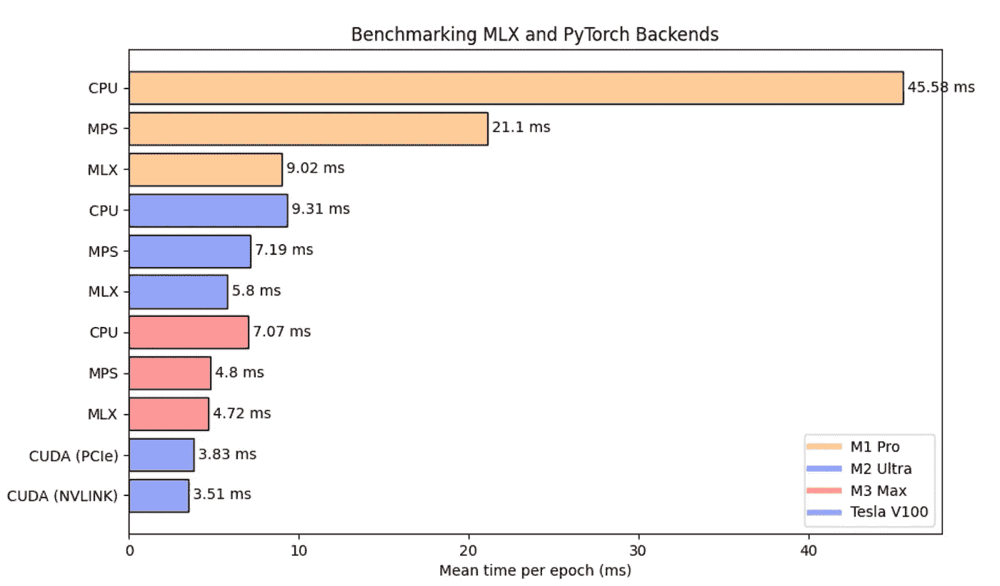

# MLX vs MPS vs CUDA：基准测试

> 原文：[`towardsdatascience.com/mlx-vs-mps-vs-cuda-a-benchmark-c5737ca6efc9`](https://towardsdatascience.com/mlx-vs-mps-vs-cuda-a-benchmark-c5737ca6efc9)

## 苹果新 ML 框架 MLX 的首次基准测试

[](https://tristanbilot.medium.com/?source=post_page-----c5737ca6efc9--------------------------------)[](https://towardsdatascience.com/?source=post_page-----c5737ca6efc9--------------------------------) [Tristan Bilot](https://tristanbilot.medium.com/?source=post_page-----c5737ca6efc9--------------------------------)

·发表于[Towards Data Science](https://towardsdatascience.com/?source=post_page-----c5737ca6efc9--------------------------------) ·6 分钟阅读·2023 年 12 月 15 日

--


图片由[Javier Allegue Barros](https://unsplash.com/@soymeraki?utm_source=medium&utm_medium=referral)提供，[Unsplash](https://unsplash.com/?utm_source=medium&utm_medium=referral)

如果你是 Mac 用户且对深度学习充满热情，你可能曾希望你的 Mac 能够处理那些大型模型，对吧？好吧，猜猜怎么着？苹果刚刚发布了[MLX](https://ml-explore.github.io/mlx/build/html/index.html)，这是一个在 Apple Silicon 上高效运行 ML 模型的框架。

在 PyTorch 1.12 中引入的[MPS 后端](https://developer.apple.com/metal/pytorch/)已经是一个大胆的步骤，但随着 MLX 的宣布，似乎苹果想要在开源深度学习领域迈出重要的一步。

在这篇文章中，我们将对这些新方法进行实际测试，基于三个不同的 Apple Silicon 芯片和两个支持 CUDA 的 GPU 进行基准测试。通过这样做，我们旨在揭示这些新的 Mac 兼容方法在 2024 年深度学习实验中的实际应用程度。

作为一名以 GNN 为导向的研究人员，我将把基准测试集中在图卷积网络（GCN）模型上。但由于该模型主要由线性层组成，我们的发现即使对那些不专注于 GNN 领域的人也可能具有洞察力。

## 创建环境

要为 MLX 构建环境，我们必须指定使用 i386 还是 arm 架构。使用 conda 可以通过以下方式完成：

```py
CONDA_SUBDIR=osx-arm64 conda create -n mlx python=3.10 numpy pytorch scipy requests -c conda-forge
conda activate mlx
```

要检查你的环境是否实际使用 arm，以下命令的输出应该是**arm**，而不是**i386**：

```py
python -c "import platform; print(platform.processor())"
```

现在只需使用 pip 安装 MLX，你就可以开始探索了：

```py
pip install mlx
```

## GCN 实现

GCN 模型是一种图神经网络（GNN），它使用邻接矩阵（表示图结构）和节点特征。它通过收集邻居节点的信息来计算节点嵌入。具体来说，每个节点的特征是其邻居特征的平均值。这个平均过程是通过将节点特征与归一化的邻接矩阵相乘来完成的，矩阵经过了节点度的调整。为了学习这一过程，特征首先通过线性层投射到嵌入空间。

在我们的版本中，我们在预处理步骤中像原始论文中一样对邻接矩阵进行归一化。虽然这篇文章不会深入讨论预处理代码，但你可以在这个 GitHub 仓库中找到完整代码：

[## GitHub - TristanBilot/mlx-GCN](https://github.com/TristanBilot/mlx-GCN?source=post_page-----c5737ca6efc9--------------------------------)

### 通过在 GitHub 上创建一个账户，你可以为 TristanBilot/mlx-GCN 的开发做出贡献。

[GitHub](https://github.com/TristanBilot/mlx-GCN?source=post_page-----c5737ca6efc9--------------------------------)

现在我们将通过使用 MLX 实现一个 GCN 层和一个 GCN 模型：

```py
import mlx.nn as nn

class GCNLayer(nn.Module):
    def __init__(self, in_features, out_features, bias=True):
        super(GCNLayer, self).__init__()
        self.linear = nn.Linear(in_features, out_features, bias)

    def __call__(self, x, adj):
        x = self.linear(x)
        return adj @ x

class GCN(nn.Module):
    def __init__(self, x_dim, h_dim, out_dim, nb_layers=2, dropout=0.5, bias=True):
        super(GCN, self).__init__()

        layer_sizes = [x_dim] + [h_dim] * nb_layers + [out_dim]
        self.gcn_layers = [
            GCNLayer(in_dim, out_dim, bias)
            for in_dim, out_dim in zip(layer_sizes[:-1], layer_sizes[1:])
        ]
        self.dropout = nn.Dropout(p=dropout)

    def __call__(self, x, adj):
        for layer in self.gcn_layers[:-1]:
            x = nn.relu(layer(x, adj))
            x = self.dropout(x)

        x = self.gcn_layers-1
        return x
```

一眼看去，MLX 代码与 PyTorch 代码非常相似，有一个显著的不同：在这里，我们将 `self.gcn_layers` 实例化为一个模块列表，而在 PyTorch 中，通常会使用 `nn.Sequential` 来实现类似功能。

代码在训练循环中开始变得相当不同：

```py
gcn = GCN(
    x_dim=x.shape[-1],
    h_dim=args.hidden_dim,
    out_dim=args.nb_classes,
    nb_layers=args.nb_layers,
    dropout=args.dropout,
    bias=args.bias,
)
mx.eval(gcn.parameters())

optimizer = optim.Adam(learning_rate=args.lr)
loss_and_grad_fn = nn.value_and_grad(gcn, forward_fn)

# Training loop
for epoch in range(args.epochs):

    # Loss
    (loss, y_hat), grads = loss_and_grad_fn(
        gcn, x, adj, y, train_mask, args.weight_decay
    )
    optimizer.update(gcn, grads)
    mx.eval(gcn.parameters(), optimizer.state)

    # Validation
    val_loss = loss_fn(y_hat[val_mask], y[val_mask])
    val_acc = eval_fn(y_hat[val_mask], y[val_mask])
```

一眼就能看到 `mx.eval()` 的使用。在 MLX 中，计算是惰性的，这意味着 `eval()` 常用于在更新后实际计算新模型参数。另一个关键函数 `nn.value_and_grad()` 生成一个函数，用于计算相对于参数的损失。第一个参数是包含当前参数的模型，第二个参数是用于前向传递和损失计算的可调用函数。它返回的函数与前向函数（在此情况下为 `forward_fn`）具有相同的参数。我们可以这样定义这个函数：

```py
def forward_fn(gcn, x, adj, y, train_mask, weight_decay):
    y_hat = gcn(x, adj)
    loss = loss_fn(y_hat[train_mask], y[train_mask], weight_decay, gcn.parameters())
    return loss, y_hat
```

这仅仅包括计算前向传递和计算损失。`loss_fn()` 和 `eval_fn()` 定义如下：

```py
def loss_fn(y_hat, y, weight_decay=0.0, parameters=None):
    l = mx.mean(nn.losses.cross_entropy(y_hat, y))

    if weight_decay != 0.0:
        assert parameters != None, "Model parameters missing for L2 reg."

        l2_reg = sum(mx.sum(p[1] ** 2) for p in tree_flatten(parameters)).sqrt()
        return l + weight_decay * l2_reg

    return l

def eval_fn(x, y):
    return mx.mean(mx.argmax(x, axis=1) == y)
```

你可能会注意到损失函数看起来相当复杂，但它实际上是计算预测与标签之间的交叉熵，并包括 L2 正则化。由于 L2 正则化还不是一个内置功能，我已经手动实现了它。

> 一个很酷的特点是，不再需要像在 PyTorch 中那样显式地将对象分配到特定的设备上，如使用 `.cuda()` 和 `.to(device)`。得益于苹果芯片的[统一内存](https://ml-explore.github.io/mlx/build/html/unified_memory.html)架构，所有变量都共存于同一空间，消除了 CPU 和 GPU 之间缓慢的数据传输，也解决了那些与设备不匹配相关的运行时错误。

## 基准

在我们的基准测试中，我们将 MLX 与 MPS、CPU 和 GPU 设备进行比较，使用的是 PyTorch 实现。我们的测试平台是一个 2 层的 GCN 模型，应用于 [Cora 数据集](https://graphsandnetworks.com/the-cora-dataset/)，该数据集包括 2708 个节点和 5429 条边。

对于 MLX、MPS 和 CPU 测试，我们对 **M1 Pro**、**M2 Ultra** 和 **M3 Max** 进行了基准测试。同时，GPU 基准测试在两款 NVIDIA Tesla 模型上进行：**V100 PCIe** 和 **V100 NVLINK**。



作者图片：GCN 在 MLX 和其他后端上的基准测试（以毫秒为单位）

**MPS**：比 M1 Pro 上的 CPU 快超过 2 倍，表现不错。在其他两款芯片上，与 CPU 相比，改进幅度在 30% 到 50% 之间。

**MLX**：在 M1 Pro 上比 MPS 快 2.34 倍。在 M2 Ultra 上相比 MPS 提升了 24%。不过，在 M3 Pro 上 MPS 和 MLX 之间没有实质性改进。

**CUDA V100 PCIe & NVLINK**：比 M3 Max with MLX 快 23% 和 34%，这确实很厉害！

与 CPU 和 MPS 相比，MLX 突显出其作为游戏改变者的潜力，甚至接近 TESLA V100 的性能。这一初步基准测试突出了 MLX 在成为流行的 Mac 基础深度学习框架方面的巨大潜力。值得注意的是，MLX 刚刚公开发布，我们可以期待未来几年开源社区带来的进一步改进。我们也期待在不久的将来，出现更强大的 Apple Silicon 芯片，将 MLX 的性能提升到一个全新的水平。

## 总结一下

**酷炫功能：**

+   我们现在可以通过充分利用 Apple Silicon 的强大性能在本地运行深度学习模型。

+   语法与 torch 非常相似，受到了 Jax 的一些启发。

+   不再需要设备，一切都存在于统一内存中！

**缺少的功能：**

+   这个框架 **非常** 年轻，许多功能尚未完善。特别是对于 Graph ML，目前没有所有稀疏操作和散布 API，这使得在 MLX 上构建 Message Passing GNNs 变得复杂。

+   作为一个新项目，目前 MLX 的文档和社区讨论相对有限。

总之，MLX 的发布给人留下了意外的深刻印象，并展示了严肃的潜力。我相信这个框架可能会成为日常研究实验的基础工具。我们也期待更多的实验，因为 GCN 测试主要展示了 MLX 在基本线性层上的表现。更全面的测试可能会揭示它的全部能力。

**感谢阅读！**
