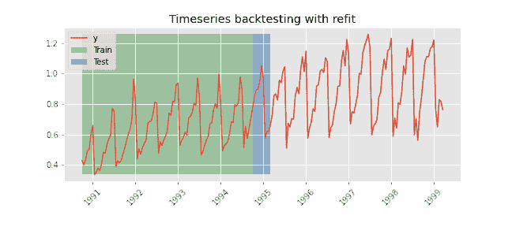

# 时间序列预测中的模型评估

> 原文：[`towardsdatascience.com/model-evaluation-in-time-series-forecasting-ae41993e267c`](https://towardsdatascience.com/model-evaluation-in-time-series-forecasting-ae41993e267c)

## 介绍使用 Skforecast 库进行时间序列的回测

 [Javier Fernandez](https://javiferfer.medium.com/?source=post_page-----ae41993e267c--------------------------------)

·发表于 [Towards Data Science](https://towardsdatascience.com/?source=post_page-----ae41993e267c--------------------------------) ·6 min read·2023 年 3 月 5 日

--

图片来源：[Lukas](https://www.pexels.com/@goumbik) 在 [Pexels](https://www.pexels.com/photo/chart-close-up-data-desk-590022/)

时间序列预测包括基于历史时间数据进行预测，以驱动广泛应用中的未来战略决策。

在评估模型时，我们将数据分为训练集和测试集。训练集用于训练模型并确定最佳超参数，而测试集用于评估模型。为了对模型性能进行更全面的评估，通常会使用 [交叉验证](https://en.wikipedia.org/wiki/Cross-validation_%28statistics%29#:~:text=Cross%2Dvalidation%20is%20a%20resampling,model%20will%20perform%20in%20practice.)。交叉验证是一种重采样方法，使用不同的数据集对模型进行多次迭代测试和训练。

然而，直接在时间序列数据上实施交叉验证是不可能的，因为它忽略了观察之间的时间成分。因此，本文介绍了评估时间序列模型的不同方法，这些方法被称为 [回测](https://en.wikipedia.org/wiki/Backtesting)。

# 1\. 介绍

回测是建模中使用的一个术语，指的是利用现有历史数据评估模型。它涉及选择多个训练集和测试集，逐步向前推进时间。回测的主要思想类似于交叉验证，但回测考虑了数据的时间成分。这种方法使我们能够 (1) 评估和可视化模型误差如何随时间发展，(2) 估计模型误差的方差。

在生产环境中，通常的做法是首先使用回测方法确定最佳参数，然后用可用数据重新训练模型。但是，这种重新训练不一定需要使用所有可用数据或每次有新数据时都进行。根据我们的策略，我们可以选择不同的回测方法。

## 1\. 具有重新拟合和增加训练样本量的回测

模型在顺序增加的训练集上进行测试，始终保持固定的起点，并使用所有可用数据。在这种方法中，有一个固定的起点，训练集的大小在每次迭代中增加，如图 1 所示。

***图 1***。时间序列回测图示，初始训练样本量为十个观测值，预测范围为 3 步，每次迭代时进行重新训练。***参考***：[*Skforecast*](https://www.cienciadedatos.net/documentos/py27-time-series-forecasting-python-scikitlearn.html) *[1]*。

## 2\. 具有重新拟合和固定训练样本量的回测

这种方法与前一种方法类似，只是它滚动了预测的起点。因此，训练集的大小保持不变，如图 2 所示。这种方法可以被认为是一种类似于交叉验证技术的时间序列方法。

与之前的方法相比，这种方法更具成本效益，因为每次迭代中训练集的大小保持不变。它还允许根据提前时间分布错误，并使错误度量对任何单一来源的特殊事件不那么敏感[2]。这种方法有趣的一个例子是，当历史数据中发生了事件或“异常”时期（例如 COVID）时。

**图 2**。*时间序列回测图示，初始训练样本量为十个观测值，预测范围为 3 步，训练集大小保持不变。* ***参考***：[*Skforecast*](https://www.cienciadedatos.net/documentos/py27-time-series-forecasting-python-scikitlearn.html) *[1]*。

## 3\. 无重新拟合的回测

最后一种回测方法包括使用初始训练集训练模型，并顺序评估模型而不进行更新。这种策略的优点在于速度较快，因为模型仅训练一次。然而，该模型未纳入最新的数据，因此可能会随着时间的推移而失去预测能力。

如果需要对系统中新进入的数据进行高频预测，这种方法非常有趣。

**图 3**。*时间序列回测图示，初始训练规模为十个观察值，预测范围为 3 步，每次迭代不重新训练。* ***参考****:* [*Skforecast*](https://www.cienciadedatos.net/documentos/py27-time-series-forecasting-python-scikitlearn.html) *[1].*

# 2\. 实现

这里是使用 Skforecast 库进行回测的实现。Skforecast 是一个 Python 库，简化了使用 scikit-learn 回归器作为多步预测器的过程。它还适用于任何与 scikit-learn API 兼容的回归器（如 pipelines、CatBoost、LightGBM、XGBoost、Ranger 等）。

出于测试目的，我们使用了在[GitHub](https://github.com/JoaquinAmatRodrigo/skforecast/blob/master/data/h2o.csv) MIT 许可证下公开可用的 h2o 数据集，其数据从 1991-07-01 到 2008-06-01，每月更新。

**图 4**。*数据集的可视化，其中蓝色数据用于训练，橙色数据用于测试。* ***参考****: 作者提供的图像。*

下面是三种描述的回测方法，其中使用随机森林回归器作为自回归。

在查看实现时，回测方法之间的区别在于以下参数：

+   *initial_train_size*: 初始训练分割中的样本数量。

+   *fixed_train_size*: 如果*True*，则训练规模不会增加，但在每次迭代中按“步数”移动。

+   *refit*: 是否在每次迭代中重新拟合预测模型。

+   *steps*: 预测的步数。

## 1\. 使用重新拟合和增加训练规模的回测

模型首先以 2002-01-01 为截止日期进行训练，然后依次将十个新数据添加到训练中。此过程重复进行，直到整个系列运行完毕。

要设置此方法，将*fixed_train_size*和*refit*参数分别设置为*False*和*True*。

如观察到的那样，训练集随着时间的推移而增加，而测试集则保持不变。

## 2\. 使用重新拟合和固定训练规模的回测

与使用重新拟合和增加训练规模的回测方法类似，该模型首先以 2002-01-01 为截止日期进行训练，然后依次将十个新数据添加到训练中。然而，在这种方法中，规模保持不变，这意味着训练集和测试集的大小始终相同。

要设置此方法，将*fixed_train_size*和*refit*参数都设置为*True*。

## 3\. 无重新拟合的回测

与使用重新拟合和增加训练规模的回测方法类似，该模型首先以 2002-01-01 为截止日期进行训练。然而，训练集随着时间的推移不会变化，而测试集在每次迭代中移动十步。

要设置此方法，将*fixed_train_size*和*refit*参数都设置为*False*。

这种方法不仅可以用于基于 sklearn 的模型，还可以用于其他模型，如[SARIMAX](https://github.com/JoaquinAmatRodrigo/skforecast/blob/master/skforecast/model_selection_statsmodels/model_selection_statsmodels.py)。

# 3\. 结论

在这篇文章中，我们讨论了时间序列预测模型评估的不同方法，称为回测。主要的要点是：

+   主要有三种回测方法，其主要区别在于是否重新拟合、训练规模以及预测的来源。

+   回测方法应根据生产场景而定。

+   由于实施和计算时间可能昂贵，尽量使用已优化的 Python 库，如 Skforecast。

***如果你喜欢这篇文章，请考虑*** [***订阅***](https://javiferfer.medium.com/membership)***。你将获得对我所有内容的访问权限，并能阅读 Medium 上其他精彩创作者的每一篇文章！***

# 参考文献

 ## 创建时间序列预测的 ARIMA 模型

### 在 AirPassengers 数据集中介绍和实现 ARIMA 模型

towardsdatascience.com  ## 基于趋势和季节性成分的时间序列预测

### 分析时间序列的趋势和季节性，分解时间序列并实现预测模型

towardsdatascience.com

[1] Skforecast，[Skforecast: 使用 Python 和 Scikit-learn 进行时间序列预测](https://www.cienciadedatos.net/documentos/py27-time-series-forecasting-python-scikitlearn.html)

[2] Elsevier，[预测准确性的样本外测试：分析与综述](https://sci-hub.st/10.1016/S0169-2070(00)00065-0)

[3] H2O AI Cloud，[回测](https://docs.h2o.ai/wave-apps/h2o-model-validation/v0.14.0/guide/validation-tests/backtesting/backtesting)

[4] Machine Learning Mastery，[回测 ML 模型时间序列预测](https://machinelearningmastery.com/backtest-machine-learning-models-time-series-forecasting/)
