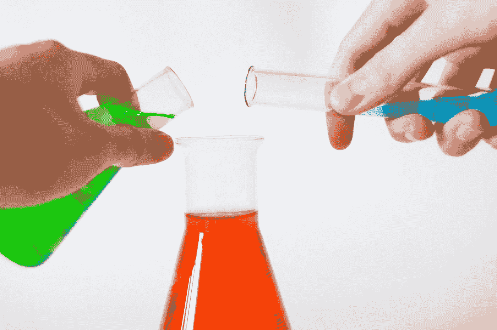
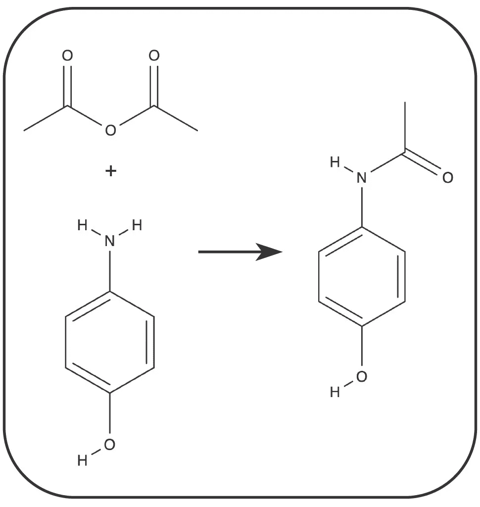
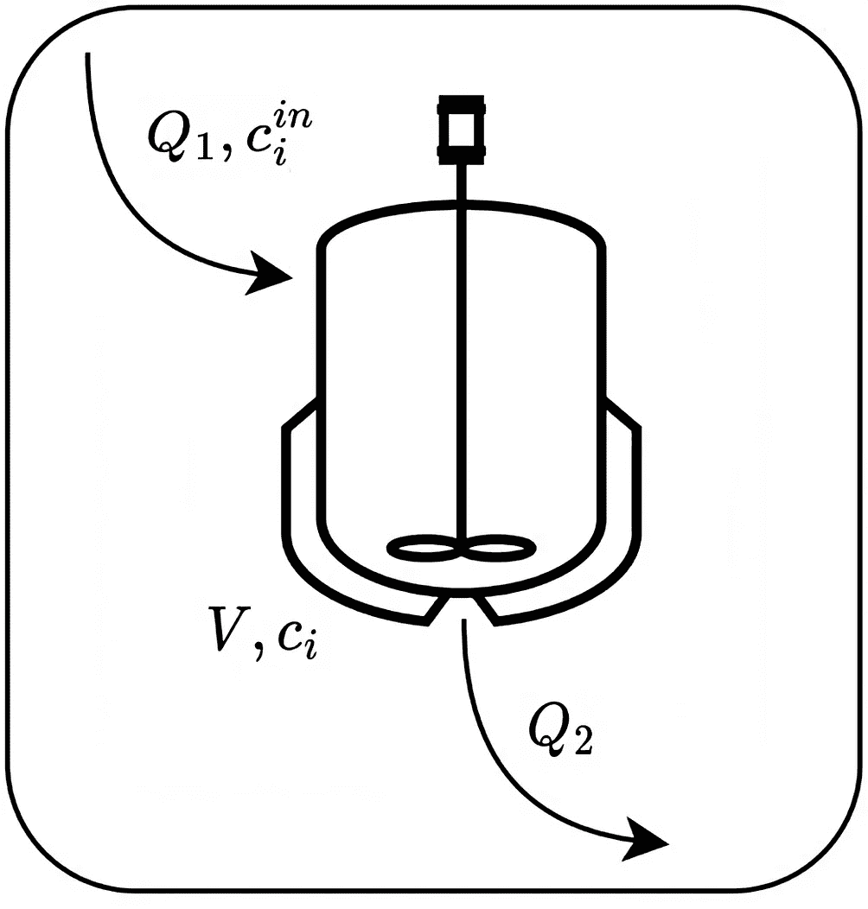
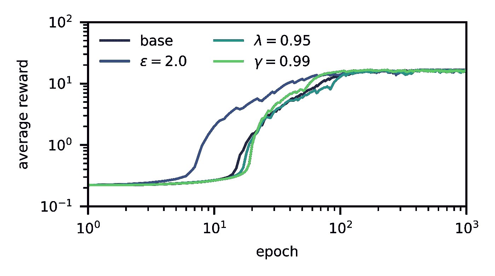
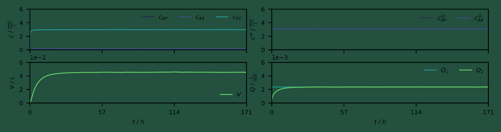

# 无模型强化学习在化学过程开发中的应用

> 原文：[`towardsdatascience.com/model-free-reinforcement-learning-for-chemical-process-development-67318da35861?source=collection_archive---------12-----------------------#2023-07-11`](https://towardsdatascience.com/model-free-reinforcement-learning-for-chemical-process-development-67318da35861?source=collection_archive---------12-----------------------#2023-07-11)

## 智能化化学系统

## 迈向化学过程代理。

 [Georgi Tancev](https://gtancev.medium.com/?source=post_page-----67318da35861--------------------------------)

·

[关注](https://medium.com/m/signin?actionUrl=https%3A%2F%2Fmedium.com%2F_%2Fsubscribe%2Fuser%2F54224776d918&operation=register&redirect=https%3A%2F%2Ftowardsdatascience.com%2Fmodel-free-reinforcement-learning-for-chemical-process-development-67318da35861&user=Georgi+Tancev&userId=54224776d918&source=post_page-54224776d918----67318da35861---------------------post_header-----------) 发表在 [Towards Data Science](https://towardsdatascience.com/?source=post_page-----67318da35861--------------------------------) · 5 分钟阅读 · 2023 年 7 月 11 日

--

照片由 [Alex Kondratiev](https://unsplash.com/@alexkondratiev?utm_source=medium&utm_medium=referral) 在 [Unsplash](https://unsplash.com/?utm_source=medium&utm_medium=referral) 提供

# 介绍

**过程开发**、**设计**、**优化**和**控制**是**化学工程**中的主要职责之一。具体来说，范围在于寻找最佳配方或合适的设备配置或过程参数（通过实验室实验），以最大化某些目标（例如，产量或吞吐量），同时遵守潜在的约束条件（例如，输入浓度、流速、反应器体积或溶剂的沸点）。通过**自动化**这些任务，例如，通过实验室**机器人**，可以节省大量的人工劳动。

最近在**强化学习（RL）**方面的进展明确表明，智能体可以[掌握复杂任务](https://www.nature.com/articles/nature14236)并[玩各种游戏](https://www.nature.com/articles/s41586-020-03051-4)，甚至发现更高效的（数学）程序，例如[矩阵运算](https://www.nature.com/articles/s41586-022-05172-4)或[排序](https://www.nature.com/articles/d41586-023-01883-4)。借助实验或量子模拟获得的动力学参数，智能体可以在**虚拟环境**中找到最佳配置和合成配方。然而，与凸优化不同的是，该算法/模型产生动态操作条件，并可以直接用于过程控制。根据方法的**样本效率**，即收敛所需的交互次数，这也可以通过机器人直接在实验室中完成。显然，这可能会在长期内导致过程开发的自动化。

强化学习的基础、应用于化学过程的优缺点以及开放问题最近已被[综述](https://www.sciencedirect.com/science/article/abs/pii/S0098135419300754?via%3Dihub=)。与此同时，发现了若干有趣的过程工程应用。[其中一项研究](https://www.sciencedirect.com/science/article/abs/pii/S0098135419304168?via%3Dihub=)尝试使用**REINFORCE**优化批量生物过程。[另一项研究](https://www.sciencedirect.com/science/article/abs/pii/S0098135421002404?via%3Dihub=)利用**Q-learning**进行过程优化，同时试图强制执行约束。[其他研究](https://www.sciencedirect.com/science/article/pii/S0098135420301599?via%3Dihub=)尝试通过**优势演员-评论家**调度化学生产。以下文章的范围是通过[**近端策略优化（PPO）**](https://arxiv.org/abs/1707.06347)来阐述这一点，以**对乙酰氨基酚**的合成为例。

# 问题定义

我们有一个软件，所谓的**代理**。这个代理处于一个具有许多不同**状态**（如成分浓度、体积、温度）的环境中，在其中可以执行某些化学操作，即**动作**。这些动作包括剂量 A、增加/减少进出流量、增加/减少温度等。随着代理执行这些动作，它会转变为新的状态。

例如，**对乙酰氨基酚（PC）** 是从 ***p*-氨基酚（AP）** 和 **乙酸酐（AA）** 合成的，如图 1a 所示。在已知的[**动力学**](https://jurnal.ugm.ac.id/jrekpros/article/view/64551)下，这个过程可以建模，并代表了环境，例如，在图 1b 所示的**连续搅拌反应器（CSTR）**中。

**图 1：（a）** 感兴趣的反应（©Georgi Tancev）。**（b）** 连续搅拌反应器的示意图，包括进/出流量、输入浓度、反应器浓度和体积（©Georgi Tancev）。

在每个状态下，代理选择一组动作，并且一个**微分方程**（表示虚拟环境）在固定时间间隔内进行数值积分，结果是一个新状态。然后，代理收到一个与合成的对乙酰氨基酚量成正比的**奖励**。换句话说，代理玩一个游戏，需要在给定的时间段内（大约 2000 次转换或 170 小时）尽可能多地生产对乙酰氨基酚。

在以下研究中，反应器本质上是一个[实验室规模的 CSTR](https://pubs.rsc.org/en/content/articlelanding/2023/re/d2re00476c) ，最大体积为 0.45 L。最大流量为 2.5 mL/min，最大输入浓度为 3.3 mol/L。如果体积超出限制，代理将收到与超出体积成正比的惩罚；如果超过临界阈值，剧集将立即结束。温度保持在 105 °C。

# 方法

在**（深度）强化学习**中，目标是学习一个**策略**（即状态到动作的映射），以最大化**累计** **（折扣）奖励总和**。在每个状态下执行一个动作，然后得到特定的奖励。PPO 是[**信任区域策略优化（TRPO）**](http://proceedings.mlr.press/v37/schulman15.html)的启发式变体。两者都是所谓的[**演员-评论员** **方法**](https://proceedings.neurips.cc/paper/1999/hash/6449f44a102fde848669bdd9eb6b76fa-Abstract.html)，利用[**函数逼近**](https://papers.nips.cc/paper_files/paper/1999/hash/464d828b85b0bed98e80ade0a5c43b0f-Abstract.html)。演员-评论员方法由两个组件组成；演员本质上是状态到动作的映射，由一个（深度）**神经网络**参数化。它以状态（即观察）作为输入，并提供该状态下应执行的最佳动作。以下，动作分布由[**连续伯努利分布**](https://papers.nips.cc/paper_files/paper/2019/hash/f82798ec8909d23e55679ee26bb26437-Abstract.html)表示。该分布提供范围在[0, 1]之间的值，然后需要乘以每个动作的最大可能设置。这样的随机策略允许[探索与利用](https://arxiv.org/abs/2305.08624)之间的权衡。

“最佳”动作的选择由评论员指导，该评论员通过另一神经网络估计每个状态下每个动作的价值（或[**优势**](https://arxiv.org/abs/1506.02438)），并在训练过程中更新这些估计。奖励高的动作受到鼓励，而奖励低或甚至惩罚的动作则相反。适当的**架构**和**超参数**（例如，[优化](https://ui.adsabs.harvard.edu/abs/2018arXiv181002525H/abstract)）取自[文献](https://ojs.aaai.org/index.php/AAAI/article/view/11694)。

# 结果与讨论

图 2 说明了不同超参数下的平均奖励随训练轮次变化的情况，基准案例为*γ* = 0.995，*λ* = 0.97，以及*ε* = 0.20。该图中的平均奖励直接与生产的对乙酰氨基酚的量相关。

**图 2：** 学习曲线（©Georgi Tancev）。

最优策略，即收敛后的策略，如图 3 所示。

**图 3：** 随时间变化的状态和动作（经过 2000 轮次）。图示显示了浓度、体积、入口浓度和流量随操作时间的变化（©Georgi Tancev）。

可以看到，代理通过将输出流（Q₂）保持在低于输入流（Q₁）的水平来填充 CSTR。至于输入浓度，从一开始就保持在最大值。换句话说，代理通过与环境的互动学会了如何最好地合成 PA。由于无模型的强化学习方案样本效率低下，这一策略是在计算机上 elaborated 的。借助更高效的（即，**离线策略**）方案和**基于模型**的强化学习，化学机器人未来可以在实验室中独立开发合成方法。然而，这也需要[**安全探索**](https://dl.acm.org/doi/10.5555/3454287.3454547)。

# 结论与展望

这项简要研究表明，强化学习（RL）在化学过程开发中确实具有潜力，值得进一步探索。这个潜力很大，因为繁琐的实验室工作可以由机器人处理。然而，这里仍然存在许多未解答的问题。无模型的强化学习（model-free RL）样本效率低，而基于模型的和/或离线策略的方法（例如，[**软演员-评论家**](https://arxiv.org/abs/1801.01290)）会更受青睐。此外，PPO 经常报告存在[不稳定性](https://arxiv.org/abs/2009.10897)。最后，在低温下几乎没有反应发生，因此没有反馈形式的奖励（即稀疏奖励），因此必须为此找到合适的解决方案。
