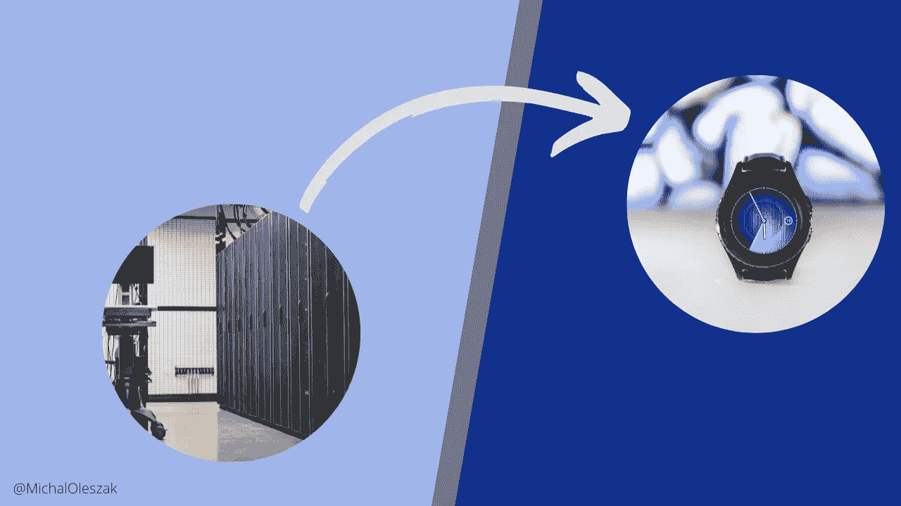

# TensorFlow 的模型优化

> 原文：[`towardsdatascience.com/model-optimization-with-tensorflow-629342d1a96f?source=collection_archive---------16-----------------------#2023-04-17`](https://towardsdatascience.com/model-optimization-with-tensorflow-629342d1a96f?source=collection_archive---------16-----------------------#2023-04-17)

## MLOps

## 通过量化和剪枝减少模型的延迟、存储和推理成本

 [Michał Oleszak](https://michaloleszak.medium.com/?source=post_page-----629342d1a96f--------------------------------)

·

[关注](https://medium.com/m/signin?actionUrl=https%3A%2F%2Fmedium.com%2F_%2Fsubscribe%2Fuser%2Fc58320fab2a8&operation=register&redirect=https%3A%2F%2Ftowardsdatascience.com%2Fmodel-optimization-with-tensorflow-629342d1a96f&user=Micha%C5%82+Oleszak&userId=c58320fab2a8&source=post_page-c58320fab2a8----629342d1a96f---------------------post_header-----------) 发表于 [Towards Data Science](https://towardsdatascience.com/?source=post_page-----629342d1a96f--------------------------------) ·9 分钟阅读·2023 年 4 月 17 日

--

近年来，机器学习模型出现了两种看似对立的趋势。一方面，模型越来越大，达到当前流行的[大型语言模型](https://pub.towardsai.net/forget-about-chatgpt-f17a7f5089c3)。Nvidia 的[Megatron-Turing 自然语言生成](https://developer.nvidia.com/megatron-turing-natural-language-generation)模型有 5300 亿个参数！另一方面，这些模型被部署到越来越小的设备上，例如智能手表或无人机，这些设备的内存和计算能力自然受到其尺寸的限制。

我们如何将越来越大的模型压缩到越来越小的设备中？答案是模型优化：压缩模型的大小并减少其延迟的过程。在本文中，我们将深入了解其工作原理以及如何在 TensorFlow 中实现两种流行的模型优化方法——量化和剪枝。

# 基线模型

在我们深入探讨模型优化技术之前，我们需要一个可以优化的玩具模型。让我们训练一个简单的二分类器，以区分巴黎的两个著名地标：**埃菲尔铁塔**和**蒙娜丽莎**，这些都是由[谷歌的“快速绘画！”游戏](https://quickdraw.withgoogle.com/)的玩家绘制的。[QuickDraw 数据集](https://github.com/googlecreativelab/quickdraw-dataset)…
