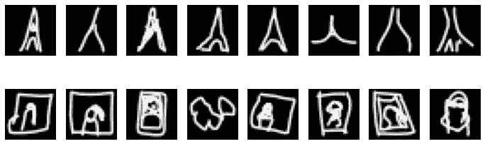
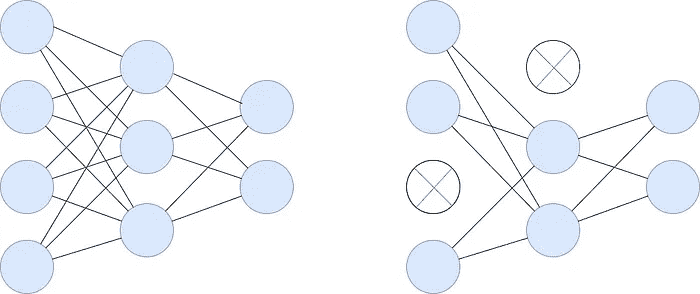
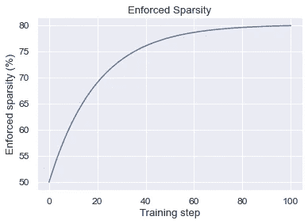
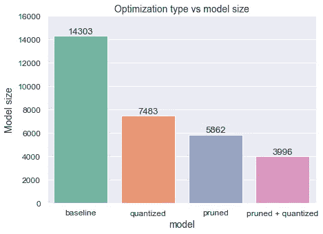
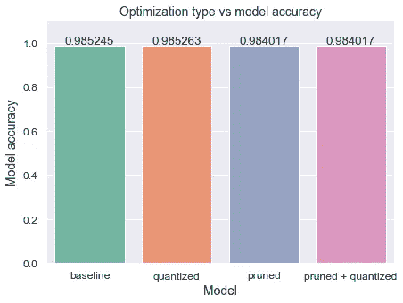

# 使用 TensorFlow 进行模型优化

> 原文：[`towardsdatascience.com/model-optimization-with-tensorflow-629342d1a96f`](https://towardsdatascience.com/model-optimization-with-tensorflow-629342d1a96f)

## MLOps

## 使用量化和剪枝减少模型的延迟、存储和推理成本

[](https://michaloleszak.medium.com/?source=post_page-----629342d1a96f--------------------------------)[](https://towardsdatascience.com/?source=post_page-----629342d1a96f--------------------------------) [Michał Oleszak](https://michaloleszak.medium.com/?source=post_page-----629342d1a96f--------------------------------)

·发表于 [Towards Data Science](https://towardsdatascience.com/?source=post_page-----629342d1a96f--------------------------------) ·9 分钟阅读·2023 年 4 月 17 日

--


在过去几年中，机器学习模型经历了两种看似对立的趋势。一方面，模型往往变得越来越大，最终形成了如今流行的： [大型语言模型](https://pub.towardsai.net/forget-about-chatgpt-f17a7f5089c3)。Nvidia 的 [Megatron-Turing 自然语言生成](https://developer.nvidia.com/megatron-turing-natural-language-generation)模型拥有 5300 亿个参数！另一方面，这些模型正在被部署到越来越小的设备上，如智能手表或无人机，这些设备的内存和计算能力自然受到其尺寸的限制。

我们如何将越来越大的模型压缩到越来越小的设备中？答案是模型优化：压缩模型的大小并减少其延迟的过程。在这篇文章中，我们将了解其工作原理以及如何在 TensorFlow 中实现两种流行的模型优化方法——量化和剪枝。


# 基线模型

在我们跳到模型优化技术之前，我们需要一个要优化的玩具模型。让我们训练一个简单的二分类器，以区分巴黎的两个著名地标：埃菲尔铁塔和蒙娜丽莎，由 [Google 的游戏“Quick, Draw!”](https://quickdraw.withgoogle.com/) 的玩家绘制。 [QuickDraw 数据集](https://github.com/googlecreativelab/quickdraw-dataset)包含 28x28 的灰度图像。



来自 Quickdraw 数据集的示例：埃菲尔铁塔（上）和蒙娜丽莎（下）。

让我们训练一个简单的卷积网络来分类这两个地标。

```py
def get_model():
    return tf.keras.Sequential([
        tf.keras.layers.InputLayer(input_shape=(28, 28)),
        tf.keras.layers.Reshape(target_shape=(28, 28, 1)),
        tf.keras.layers.Conv2D(
          filters=12, kernel_size=(3, 3), activation="relu"
        ),
        tf.keras.layers.MaxPooling2D(pool_size=(2, 2)),
        tf.keras.layers.Conv2D(
          filters=24, kernel_size=(3, 3), activation="relu"
        ),
        tf.keras.layers.MaxPooling2D(pool_size=(2, 2)),
        tf.keras.layers.Flatten(),
        tf.keras.layers.Dense(1, activation="sigmoid")
    ])

model_baseline = get_model()

model_baseline.compile(
    optimizer="adam",
    loss="binary_crossentropy",
    metrics=["accuracy"]
)

model_baseline.fit(
    x_train, 
    y_train, 
    epochs=1,
)
```

我们现在将模型保存为 TensorFlow Lite 格式。与传统的 `.h5` 文件相比，这是一种更小、更高效的文件格式，专门为移动和边缘部署设计。

```py
converter = tf.lite.TFLiteConverter.from_keras_model(model_baseline)
model_baseline_tflite = converter.convert()

with open("model_baseline.tflite", "wb") as f:
    f.write(model_baseline_tflite)
```

为了评估我们的模型的大小和准确性，我们需要两个简单的工具函数。首先，`evaluate_tflite_model()` 设置一个 TF Lite 解释器，将测试样本传递给保存的 TF Lite 模型，并计算其预测的准确性。其次，`get_gzipped_model_size()` 创建一个 `.tflite` 模型文件的临时压缩版本，以进一步压缩它，并返回其在磁盘上的字节大小。我们这里使用的这两个函数的实现基于 Coursera 的 [机器学习建模管道生产课程](https://www.coursera.org/learn/machine-learning-modeling-pipelines-in-production?specialization=machine-learning-engineering-for-production-mlops) 的类似工具。

```py
def evaluate_tflite_model(filename, x_test, y_test):
    interpreter = tf.lite.Interpreter(model_path=filename)
    interpreter.allocate_tensors()
    input_index = interpreter.get_input_details()[0]["index"]
    output_index = interpreter.get_output_details()[0]["index"]
    y_pred = []
    for test_image in x_test:
        test_image = np.expand_dims(test_image, axis=0).astype(np.float32)
        interpreter.set_tensor(input_index, test_image)
        interpreter.invoke()
        output = interpreter.tensor(output_index)
        y_pred.append(output()[0][0] >= 0.5)
    return (y_pred == np.array(y_test)).mean()

def get_gzipped_model_size(file):
    _, zipped_file = tempfile.mkstemp(".zip")
    with zipfile.ZipFile(
      zipped_file, "w", compression=zipfile.ZIP_DEFLATED
    ) as f:
        f.write(file)
    return os.path.getsize(zipped_file)
```

让我们从未优化的模型中获取一些基准指标。

```py
model_baseline_acc = evaluate_tflite_model(
    "model_baseline.tflite", x_test, y_test
)
model_baseline_size = get_gzipped_model_size("model_baseline.tflite")

print(f"Baseline accuracy: {model_baseline_acc}")
print(f"Baseline size: {model_baseline_size}")
```

```py
Baseline accuracy: 0.9852449095827994
Baseline size: 14303
```

该模型的准确率为 98.524%，同时占用超过 14k 字节的空间。让我们看看是否可以在不牺牲太多准确性的情况下压缩其大小。


# 量化

我们将首先讨论的优化技术是模型量化。它的目标是减少存储模型参数的对象的精度。

> 量化减少了存储模型参数的对象的精度。

默认情况下，TensorFlow 将模型的偏差、权重和激活存储为 32 位浮点数。通过 `np.finfo(np.float32).max` 快速检查会告诉你，这种数据类型允许存储的值最大为 3³⁸。我们真的需要这么大的值吗？

通常，大多数模型权重和激活值离零并不远；否则，梯度会爆炸，阻止我们首先训练模型。将这些 `float32` 转换为更轻量的数据结构，例如 `int8`，可以大大减少模型的大小，同时不一定影响其准确性。

量化非常方便使用，因为它操作的是已经训练好的模型，只需转换其内部数据结构。在 TensorFlow 中，这可以通过在转换器中设置 `optimizations` 属性来完成。

```py
converter = tf.lite.TFLiteConverter.from_keras_model(model_baseline)
converter.optimizations = [tf.lite.Optimize.DEFAULT]
model_quantized_tflite = converter.convert()

with open("model_quantized.tflite", "wb") as f:
    f.write(model_quantized_tflite)
```

这实现了称为动态范围量化的默认量化变体。在大多数情况下，这是一个很好的起点。还有其他更高级的策略，例如完全整数量化，它试图估计每个模型张量中的值范围，但要做到这一点，它需要一个代表性数据集来校准其估计值。

我们保持默认选项，检查量化模型的大小和准确性。

```py
model_quantized_acc = evaluate_tflite_model(
    "model_quantized.tflite", x_test, y_test
)
model_quantized_size = get_gzipped_model_size("model_quantized.tflite")

print(f"Quantized accuracy: {model_quantized_acc}")
print(f"Quantized size: {model_quantized_size}")
```

```py
Quantized accuracy: 0.98526270824434
Quantized size: 7483
```

模型的大小几乎减少了一半，从 14k 多字节降至 7k 多字节！与此同时，准确率没有下降。实际上，准确率甚至从 98.524% 微增至 98.526%。这是一个罕见的情况，因为通常量化结果会导致准确率略有下降。


# 剪枝

另一种流行的模型优化技术是权重剪枝。在大型神经网络中，每个权重不太可能对模型性能发挥关键作用。识别出不太重要的权重并将其从网络中移除，可以减少存储模型所需的空间，并在推理过程中节省浮点乘法，从而减少延迟。

> 剪枝识别并移除模型中不重要的权重，减少模型大小和推理时间。

识别不重要权重的最简单方法是通过其幅度。值接近零的权重最不可能对网络的输出有较大贡献，是剪枝的最佳候选者。



密集网络（左）和剪枝两个节点后的稀疏网络（右）。

不幸的是，在训练后的网络中将一些权重设置为零会打断网络内部的信息流，这通常会导致准确率急剧下降。显而易见的补救方法是剪枝后重新训练模型，但这证明是一个具有挑战性的任务。

相反，剪枝和重新训练可以同时进行。这使我们能够明确地教导模型不要使用一些网络的权重。

要在 TensorFlow 中实现再训练剪枝，我们需要定义一个剪枝计划。该计划在再训练过程中管理两个过程：

+   在整个训练过程中强制实施的稀疏性程度；

+   在（哪些训练步骤中）强制实施它。

实践中被证明有效的稀疏性增加率的流行选择是多项式衰减函数。它将在前期训练步骤中急剧增加稀疏性，然后在后期步骤中减缓增加速度。



稀疏性增加率。

在这里，我们将从训练开始时要求 50% 的权重为零，这一比例会在训练结束时增加到 80%。我们还将立即在训练开始时引入稀疏性，整个过程将持续所有训练步骤。

```py
batch_size = 128
epochs = 2
validation_split = 0.1

x_train_size = x_train.shape[0] * (1 - validation_split)
end_step = np.ceil(x_train_size / batch_size).astype(np.int32) * epochs

pruning_params = {
    "pruning_schedule": tfmot.sparsity.keras.PolynomialDecay(
        initial_sparsity=0.50,
        final_sparsity=0.80,
        begin_step=0,
        end_step=end_step,
    )
}
```

设置好计划后，我们将其与训练好的基线模型一起传递给 `prune_low_magnitude` 方法。接下来，我们重新编译并重新训练模型，传递 `UpdatePruningStep` 回调。每处理完一批训练数据后，该回调会被调用，并更新剪枝步骤，以保持与预定义计划的一致性。它还在待剪枝的层周围添加了包装器，因此在用 `strip_pruning` 方法重新训练后，我们需要去掉这些包装器，以获得原始模型架构。

```py
model_pruned = tfmot.sparsity.keras.prune_low_magnitude(
  model_baseline, 
  **pruning_params,
)

model_pruned.compile(
    optimizer="adam",
    loss="binary_crossentropy",
    metrics=["accuracy"]
)

model_pruned.fit(
    x_train, 
    y_train, 
    epochs=epochs,
    validation_split=validation_split,
    callbacks=[tfmot.sparsity.keras.UpdatePruningStep()],
)

model_pruned = tfmot.sparsity.keras.strip_pruning(model_pruned)
```

现在我们可以将模型转换为 TFLite 格式，并检查其大小和准确性，如之前所做的那样。

```py
converter = tf.lite.TFLiteConverter.from_keras_model(model_pruned)
model_pruned_tflite = converter.convert()

with open("model_pruned.tflite", "wb") as f:
    f.write(model_pruned_tflite)

model_pruned_acc = evaluate_tflite_model(
  "model_pruned.tflite", x_test, y_test
)
model_pruned_size = get_gzipped_model_size("model_pruned.tflite")

print(f"Pruned accuracy: {model_pruned_acc}")
print(f"Pruned size: {model_pruned_size}")
```

```py
Pruned accuracy: 0.9840168019364943
Pruned size: 5862
```

剪枝使我们的模型比量化压缩得更多：从 14k 减少到不到 6k 字节。然而，准确率略有下降；从基线模型的 98.524%降至剪枝版本的 98.402%。


# 量化与剪枝结合在一起

由于量化和剪枝是独立且以不同方式工作的，因此没有任何东西禁止我们同时使用这两种方法。我们可以剪枝一些模型的权重，然后对剩下的权重进行量化，以实现更强的压缩效果。

我们已经有了剪枝后的模型，所以我们需要做的就是在转换为 TFLite 时进行量化，就像之前一样。

```py
converter = tf.lite.TFLiteConverter.from_keras_model(model_pruned)
converter.optimizations = [tf.lite.Optimize.DEFAULT]
model_pruned_quantized_tflite = converter.convert()

with open("model_pruned_quantized.tflite", "wb") as f:
    f.write(model_pruned_quantized_tflite)

model_pruned_quantized_acc = evaluate_tflite_model(
  "model_pruned_quantized.tflite", x_test, y_test
)
model_pruned_quantized_size = get_gzipped_model_size(
  "model_pruned_quantized.tflite"
)

print(f"Pruned + Quantized accuracy: {model_pruned_quantized_acc}")
print(f"Pruned + Quantized size: {model_pruned_quantized_size}")
```

```py
Pruned + Quantized accuracy: 0.9840168019364943
Pruned + Quantized size: 3996
```

量化没有降低剪枝模型的准确性，但将其大小压缩了大约三分之一，从不到 6k 字节压缩到 4k 字节。


# 主要收获

总体而言，我们从一个 14k 字节的基线模型开始，最终得到一个 4k 字节的压缩版本，减少了 70%。



与此同时，模型的准确性几乎没有下降。



随着机器学习模型的规模不断增长，并且被部署到越来越小的设备上，模型优化技术如量化和剪枝变得至关重要，以减少模型的大小并提高其效率。通过在 TensorFlow 中实现这些技术，我们可以在几乎不损失准确性的情况下压缩模型。优化模型可以带来更快的推理时间、更小的内存占用和更高的能效，使得在更多设备上部署变得更加容易。


感谢阅读！

如果你喜欢这篇文章，为什么不[**订阅邮件更新**](https://michaloleszak.medium.com/subscribe)我的新文章呢？通过[**成为 Medium 会员**](https://michaloleszak.medium.com/membership)，你可以支持我的写作，并获得其他作者以及我自己所有故事的无限制访问。

想要时刻掌握日益加速发展的机器学习和人工智能领域的最新动态吗？请查看我的新通讯，[**AI Pulse**](https://pulseofai.substack.com/)。需要咨询？你可以随时问我问题或[**在这里**](https://topmate.io/michaloleszak)预约一对一咨询。

你也可以尝试阅读[我的其他文章](https://michaloleszak.github.io/blog/)。不知道选择哪篇？可以从这些中挑选一篇：

[](https://pub.towardsai.net/forget-about-chatgpt-f17a7f5089c3?source=post_page-----629342d1a96f--------------------------------) [## 忘记 ChatGPT

### Bard、Sparrow 和多模态聊天机器人将很快使其过时，原因如下。

[pub.towardsai.net](https://pub.towardsai.net/forget-about-chatgpt-f17a7f5089c3?source=post_page-----629342d1a96f--------------------------------) [](/self-supervised-learning-in-computer-vision-fd43719b1625?source=post_page-----629342d1a96f--------------------------------) ## 自监督学习在计算机视觉中的应用

### 如何用少量标记样本训练模型

[towardsdatascience.com [](/monte-carlo-dropout-7fd52f8b6571?source=post_page-----629342d1a96f--------------------------------) ## 蒙特卡洛丢弃法

### 用一个小技巧免费改进你的神经网络，并附带模型不确定性估计的好处。

[towardsdatascience.com

所有图像，除非另有说明，均由作者提供。
