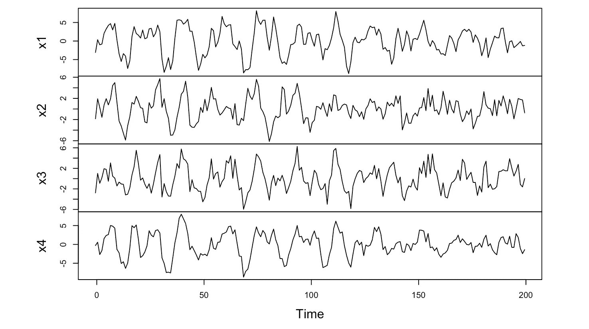

# 使用多项式回归在 R 中建模 EEG 信号

> 原文：[`towardsdatascience.com/modeling-eeg-signals-using-polynomial-regression-in-r-bd1b0da08251?source=collection_archive---------13-----------------------#2023-06-15`](https://towardsdatascience.com/modeling-eeg-signals-using-polynomial-regression-in-r-bd1b0da08251?source=collection_archive---------13-----------------------#2023-06-15)

## 从头开始选择最佳的多项式回归模型

 [Mala Deep](https://medium.com/@maladeep.upadhaya?source=post_page-----bd1b0da08251--------------------------------)

·

[关注](https://medium.com/m/signin?actionUrl=https%3A%2F%2Fmedium.com%2F_%2Fsubscribe%2Fuser%2F9ad123d64d79&operation=register&redirect=https%3A%2F%2Ftowardsdatascience.com%2Fmodeling-eeg-signals-using-polynomial-regression-in-r-bd1b0da08251&user=Mala+Deep&userId=9ad123d64d79&source=post_page-9ad123d64d79----bd1b0da08251---------------------post_header-----------) 发表在 [Towards Data Science](https://towardsdatascience.com/?source=post_page-----bd1b0da08251--------------------------------) ·12 分钟阅读·2023 年 6 月 15 日

--

输入 EEG 信号的时间序列图，用于 R 中的多项式回归。图像来源于作者。

## EEG 信号介绍

EEG 代表脑电图，是一种测量大脑电活动的电信号[1]。要获得 EEG 结果，将由小金属盘和细电线组成的电极贴在头皮上。电极检测来自脑细胞活动的微小电荷，这些电荷被放大后显示在计算机屏幕上的图形中，或以记录形式打印出来。EEG 的主要目的是通过无痛的方法检测大脑细胞通信中的潜在问题（如脑炎、出血、癫痫、帕金森病等）[2]。

## 目标

我们的目标如下：

1.  评估多项式回归模型对脑电图（EEG）信号的拟合情况，并估计模型的参数。

1.  使用基于模拟的方法来估计模型参数的后验分布，从而考虑模型和数据的不确定性。

获取完整代码请访问[GitHub](https://github.com/maladeep/Modeling-EEG-signals-using-polynomial-regression-in-R)，或在[RPubs](https://rpubs.com/mala101/eegmodeling)查看本书。
