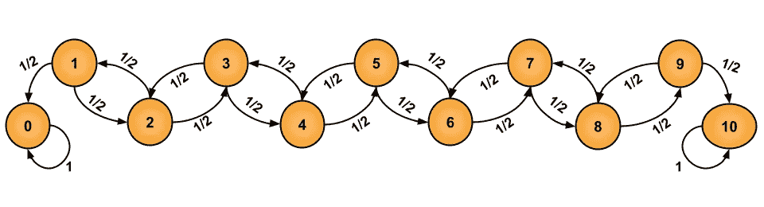

# 使用马尔可夫链建模游戏

> 原文：[`towardsdatascience.com/modeling-games-with-markov-chains-c7b614731a7f?source=collection_archive---------5-----------------------#2023-10-09`](https://towardsdatascience.com/modeling-games-with-markov-chains-c7b614731a7f?source=collection_archive---------5-----------------------#2023-10-09)

## 探索使用“封箱游戏”的概率建模

[](https://medium.com/@ktmorton17?source=post_page-----c7b614731a7f--------------------------------)[](https://towardsdatascience.com/?source=post_page-----c7b614731a7f--------------------------------) [Kairo Morton](https://medium.com/@ktmorton17?source=post_page-----c7b614731a7f--------------------------------)

·

[关注](https://medium.com/m/signin?actionUrl=https%3A%2F%2Fmedium.com%2F_%2Fsubscribe%2Fuser%2F475e9134255d&operation=register&redirect=https%3A%2F%2Ftowardsdatascience.com%2Fmodeling-games-with-markov-chains-c7b614731a7f&user=Kairo+Morton&userId=475e9134255d&source=post_page-475e9134255d----c7b614731a7f---------------------post_header-----------) 发表在 [Towards Data Science](https://towardsdatascience.com/?source=post_page-----c7b614731a7f--------------------------------) ·14 分钟阅读·2023 年 10 月 9 日[](https://medium.com/m/signin?actionUrl=https%3A%2F%2Fmedium.com%2F_%2Fvote%2Ftowards-data-science%2Fc7b614731a7f&operation=register&redirect=https%3A%2F%2Ftowardsdatascience.com%2Fmodeling-games-with-markov-chains-c7b614731a7f&user=Kairo+Morton&userId=475e9134255d&source=-----c7b614731a7f---------------------clap_footer-----------)

--

[](https://medium.com/m/signin?actionUrl=https%3A%2F%2Fmedium.com%2F_%2Fbookmark%2Fp%2Fc7b614731a7f&operation=register&redirect=https%3A%2F%2Ftowardsdatascience.com%2Fmodeling-games-with-markov-chains-c7b614731a7f&source=-----c7b614731a7f---------------------bookmark_footer-----------)

# 介绍

从和朋友玩牌到在轮盘桌上赢取钱财，精彩游戏的乐趣对大多数人来说是不可抗拒的。但无论多么有趣，即使是最乐观的玩家在经历几次失败后也会不禁问道：“这个游戏是否被操控了？”对于我们这些对概率有一定了解的人来说，不解答这个问题可能会感到不满足。在这篇文章中，我们将探讨一种用于回答此类问题的概率模型。具体来说，我将展示如何将马尔可夫链应用于“封箱游戏”，希望能激励你用概率来回答自己关于游戏的问题。

# 什么是马尔可夫链，它们与游戏有什么关系？

马尔可夫链是一种简单、研究充分的概率模型，能够建模许多现实世界的随机过程。具体来说，马尔可夫链的目标是建模一个概率事件序列，其中事件来自一个称为状态的集合。为了实现这个目标，马尔可夫链将任何两个状态之间的转换概率存储在一个称为转换矩阵的矩阵中。除了状态和转换矩阵，这些定义了随机过程的行为，马尔可夫链的一个定义特征是马尔可夫性质。直观地说，这个性质声明当前状态必须持有必要的信息，以确定转移到任何下一个状态的概率，而不管序列中之前发生了哪些状态。因此，任何满足这个性质的随机过程都可以使用马尔可夫链进行建模，这使得它成为一个非常强大的工具。为了更好地理解这些概念以及马尔可夫链的一般性质，我们来看一个简单游戏的例子：

假设你要在一系列公平的抛硬币中进行赌博。在游戏开始时，你有 $5，每次抛硬币前你预测结果（正面或反面）。每次抛硬币如果你猜对了，你会赢得一美元，如果猜错了，你会输掉一美元。当你达到 $0 或 $10 时，游戏结束。

如果我们将游戏的状态定义为每次抛硬币后的玩家现金余额，马尔可夫性质成立，并且幸运的是我们可以使用马尔可夫链建模这个游戏！在图形上，我们可以如下表示马尔可夫链的状态和转换概率：



在上图中，橙色圆圈代表游戏状态，箭头表示状态之间的转换概率。注意所有的转换概率都是 0.5，因为改变状态需要正确猜测公平抛硬币的结果。此外，状态 0 和 10 有一个指向自己的箭头，标记为概率 1，因为它们是游戏的结束状态。

正如你将在本文后面看到的，通过这种方式建模一个游戏，我们可以回答许多有趣的问题。例如，

1.  期望的胜率/失败概率是多少？

1.  平均需要多少步（抛硬币）才能赢得或输掉游戏？

1.  在 t 步（抛硬币）之后，游戏状态的概率分布是什么？

阅读完这篇文章的其余部分后，我建议你回到这一部分，考虑如何回答上述简单游戏的问题。

# “掩盖盒子”游戏解释

为了真正深入探讨与马尔可夫链相关的概率建模复杂性，我们将把重点放在游戏“掩盖盒子”上。我在浏览 Instagram Reels 时偶然发现了这个游戏，对规则有模糊的理解，我开始试图确定获胜的难度。


Roland Scheicher / Roland Scheicher 于德国维基百科，公共领域，通过维基共享资源

“关闭箱子”是一个多人游戏，使用一个包含九个瓷砖（标记为 1 到 9）和两个六面骰子的棋盘（如上图所示）进行。每个玩家的回合开始时，所有瓷砖都处于竖立位置。然后，掷两个骰子，玩家可以翻下任何总和等于两个骰子总值的瓷砖。接着，玩家重复掷骰子和翻下瓷砖的过程，直到没有任何一个竖立的瓷砖子集的总和等于两个骰子的总值为止。这时，玩家的回合结束，得分为棋盘上仍竖立的瓷砖的总和。在这个版本的游戏中，在所有玩家完成回合后，得分最低的玩家被认为是赢家。然而，如果玩家的回合因为能够翻下所有瓷砖（即“关闭箱子”）而结束，则他们自动赢得游戏。正是这个规则引起了我的注意，因此将成为本次探讨的重点。具体来说，我想回答的问题是：关闭箱子有多难？

# 使用马尔可夫链建模“关闭箱子”

从前面的章节来看，现在应该将“关闭箱子”建模为一个马尔可夫链。虽然这看起来是一个直观的下一步，但让我们通过检查马尔可夫性质是否成立来确保这一点。为此，我们将游戏的唯一状态定义为集合 {1, 2, 3, 4, 5, 6, 7, 8, 9} 的所有子集。这是因为玩家回合中的任何时刻都可以通过哪些瓷砖是翻转的来唯一表征。从数值上讲，我们可以将这些状态视为 9 位二进制数字（竖立的瓷砖为 1），共有 2⁹ 种，给出 512 种唯一状态。在这种状态定义下，马尔可夫性质成立，因为只有骰子的概率特征、当前状态和游戏规则决定了状态之间转移的概率。最重要的是，鉴于我们知道当前状态，玩家回合中达到的前一个状态对未来达到其他状态的概率没有影响。

现在状态已经明确，我们也确认了“关闭箱子”确实可以被建模为一个马尔可夫链，剩下要定义的唯一元素是转移矩阵 T。具体来说，Tᵢₖ（第 i 行第 k 列的条目）表示从状态 i 转移到状态 k 的概率。确定这些概率时，建模这个游戏的有趣复杂性就会显现出来。

为了计算从一个状态转换到另一个状态的概率，我们必须回答这个问题：“在游戏中发生什么动作会导致状态发生变化？”对于我们感兴趣的游戏“关掉盒子”，有两个概率性动作决定下一个状态：掷骰子和选择翻下的瓷砖。让我们从检查骰子在状态 i 和 k 之间转换的作用开始。我们首先让 Sᵢ 和 Sₖ 分别表示状态 i 和 k 中的竖立数字的集合。为了使从状态 i 到状态 k 的转换具有非零概率，很明显 Sₖ 必须是 Sᵢ 的一个真子集。这是因为在状态之间转换时，竖立的瓷砖数量必须减少，而瓷砖一旦翻下就不能再翻回去。根据这种状态表示以及假设 Sₖ ⊂ Sᵢ，在状态 i 和 k 之间转换过程中翻下的数字构成集合 D = Sᵢ - Sₖ（Sᵢ 中但不在 Sₖ 中的元素）。


因此，这一转换发生的一个必要条件是掷出的骰子总和必须等于集合 D 中元素的总和。形式上，必须满足以下方程：


其中 X₁ 和 X₂ 是表示两个骰子值的离散随机变量。如果我们让 z 是集合 D 中元素的总和，那么两个六面骰子的情况可以通过以下方法推导出上述方程成立的概率：


如果 z < 2 或 z > 12，那么从状态 i 转移到状态 k 的概率为零，因为不存在两个普通骰子掷出的和为 z 的情况。

尽管这看起来是填充转移矩阵条目所需的唯一概率计算，但状态转换还要求玩家在掷骰子后从一组有效的移动中进行选择。因此，从状态 i 转移到状态 k 不仅需要骰子的总和等于 z，玩家还必须选择翻下集合 D 中的瓷砖，而不是根据骰子点数可能有的其他许多选项。

为了模拟这一人类策略元素，我们假设玩家从可能的瓷砖翻下集合中均匀随机选择。根据这一假设，玩家选择状态 k 的概率是 1/Nᵢₖ，其中 Nᵢₖ 是 Sᵢ 中和为 z 的非空子集的数量。

有了上述信息，我们现在可以正式定义转移矩阵的条目。转移矩阵中的每个条目表示两个事件发生的概率：

1.  骰子总和等于 z（事件 1）

1.  玩家随机选择翻下特定的瓷砖组，从状态 i 变换到状态 k（事件 2）

因此，转移矩阵的条目可以定义如下：


需要注意的是，上述转移矩阵的定义没有考虑玩家回合结束的概率。这种情况可能发生在玩家“关闭盒子”时，或者在观察骰子掷出值后没有瓷砖可以翻下。在这两种情况下，1/Nᵢₖ 是未定义的，因此必须单独处理。

根据上述状态的二进制表示，状态 i = 0 足以表示“关闭盒子”，因为所有瓷砖都被翻下。由于这是游戏的“胜利”状态，我们可以修改转移矩阵，使得在状态 0 中停留的概率为 1（即 T₀₀ = 1）。

最后，我们将添加一个“失败”状态（L），以表示由于“不幸”的掷骰结果玩家的回合结束。具体来说，要将此状态纳入转移矩阵，我们需要知道没有任何子集 Sᵢ 的和等于 X₁ + X₂（两个骰子的和）的概率。虽然显式计算此量可能是可行的，但我们可以相对于其他转移矩阵值进行定义，如下所示：


因为转移矩阵中的每一行表示状态的概率分布，且这些概率必须加起来等于一。此外，由于这是游戏的最终状态，因此离开该状态的概率为 0。


利用上述确切的转移概率结果，我们现在可以利用马尔可夫链的一些重要属性来回答一个问题，那就是“关闭盒子”有多困难？具体来说，我们可以回答以下问题：玩家使用完全随机策略“关闭盒子”的概率是多少？

# 使用 Python 计算“关闭盒子”的获胜概率

在尝试计算该游戏的“胜/负”概率时，了解转移矩阵的作用非常重要。对于马尔可夫链，转移矩阵使我们能够探讨状态上的概率分布如何在单次转移后演变，只需一个矩阵-向量乘法即可。数学上，我们可以简单地写成如下形式：


其中 T 是转移矩阵，πₜ 是表示经过 t 次转移后所有状态的概率分布的行向量。因此，给定我们知道当前处于任何状态的概率，我们可以回答这样的问题：“如果我们随机选择要翻下的瓷砖，那么在一次骰子掷出后处于任何状态的概率是多少？”此外，利用我们对游戏初始状态（所有瓷砖都翻起）的确定性知识，我们可以很容易地定义 π₀ 并递归地将其乘以 T，以确定经过任意数量的转移（掷骰子 + 翻瓷砖）后的状态分布。这个递归可以被重写为 πₜ 的以下封闭形式表达式：


模拟“关箱子”的马尔可夫链有两个最终状态：胜利和失败，一旦进入就不能离开（即吸收状态）。因此，我们可以确定，在经过一些有限数量的转移后，所有状态的分布将收敛到这两个状态的分布。直观地说，对于“关箱子”来说，这个声明突出了一个事实，即玩家的回合必须以“关箱子”或未能做到这一点而结束，因此在一轮回合中玩家可以进行的移动次数是有限的。

要找到这个上限，注意到最长的回合发生在玩家每次掷骰子后翻下一块瓷砖，直到标记为“1”的瓷砖仅有竖立状态，因此在接下来的骰子掷出时他们无法“关箱子”。这个动作序列总共构成了 9 次移动以达到最终状态，因为总共有 9 块瓷砖。因此，求解胜率/败率就像设置 t ≥ 9 并计算 πₜ 一样简单。计算 πₜ 后，玩家使用随机策略“关箱子”的概率是 πₜ 中的第一个条目，因为它对应于所有瓷砖都翻倒的状态（S₀）。另外，递归过程可以从 0 开始重复，直到分布收敛。此外，对于这种情况，还有更快的方法来计算 πₜ，我在此帖中不予讨论。它们利用了吸收状态的存在和转移矩阵的特殊定义。了解更多信息请访问：[`en.wikipedia.org/wiki/Absorbing_Markov_chain`](https://en.wikipedia.org/wiki/Absorbing_Markov_chain)

为了在 Python 中计算胜率/败率，我们将完全依赖科学计算库 Numpy。首先，我们将瓷砖的数量、骰子的数量和游戏中的状态数量分别定义为 9、2 和 513。

```py
num_tiles = 9
num_dice = 2
num_states = (2**num_tiles)+1 # +1 for the game over/lose state
```

使用这些简单的参数，我们可以生成每个状态的集合表示，Sᵢ，如下所示。

```py
# Generate representation of all possible states
tile_nums = [i for i in range(1, num_tiles+1)]
states = []
for i in range(0, 2**num_tiles):
  binary_rep = np.binary_repr(int(i), width=num_tiles)
  states.append([tile_nums[idx] for idx, a in enumerate(binary_rep) if a == '1'])
```

在这里，Numpy 的 `binary_repr` 函数非常有用，因为它使用整数 i 生成状态的二进制表示。因此，通过找到这个字符串中“1”的位置，我们可以确定在状态 i 中哪些瓷砖是竖立的。

在处理状态表示之后，我们使用以下代码生成转移矩阵：

```py
# Generate transition matrix
transition_matrix = np.zeros((num_states, num_states))
for i in range(num_states):
  for j in range(num_states):
    transition_matrix[i][j] = compute_transition_probability(i, j)
  transition_matrix[i][num_states-1] = 1 - transition_matrix[i][:num_states-1].sum()
  assert np.allclose(transition_matrix[i].sum(), 1), "Transition matrix is not stochastic"
```

最后，使用转移矩阵，我们回答了本次探索的核心问题：玩家使用完全随机策略“关闭盒子”的概率是多少？为此，我们必须定义初始分布 π₀，在所有状态上如下：

```py
# Define the initial state distribution
init_state_dist = np.zeros((1, num_states))
init_state_dist[:, num_states-2] = 1
```

由于游戏总是从所有瓷砖都竖立的状态开始，状态分布是一个长度为 513 的行向量，除了第 511 项（以零为基础的索引）外，所有条目都是零，其中放置了一个一。这是因为 511 的二进制表示为字符串 '111111111'，这对应于所有瓷砖都竖立的状态。

一旦定义了初始分布，就可以使用公式 πₜ = π₀Tᵗ 来确定“关闭盒子”的概率，其中 t = 9 以找到在状态上收敛的分布。再次强调，我们可以设定 t = 9，因为 π₉T = π₉，因此使用大于九的 t 值会导致不必要的计算。完成这一任务的代码如下：

```py
# Compute and print the win and lose probabilities
t = 9
multiple_transition_matrix = np.linalg.matrix_power(transition_matrix, t)
final_dist = np.matmul(init_state_dist, multiple_transition_matrix)

win_prob = final_dist[0, 0]
lose_prob = final_dist[0, num_states-1]

# Print results to 4 decimal places
print("Win Probability: {:.4f}".format(win_prob))
print("Lose Probability: {:.4f}".format(lose_prob))
```

在这个代码片段中，我们使用了 Numpy 的 matrix_power 和 matmul（矩阵乘法）函数来分别计算 T₉ 和 π₉。使用这些结果，“关闭盒子”的概率简单地存储为 π₉ 的第一个元素，这对应于没有竖立瓷砖的状态（在二进制中为 '000000000'）。根据这一见解，我们最终知道，当使用完全随机策略时，“关闭盒子”是非常困难的（约 2% 的机会）！ （精确概率值如下所示）。


上述代码和模型公式经过一些修改后，可以扩展以支持任何数量的瓷砖和任何数量的骰子的“关闭盒子”变体。因此，我在下方可视化了随着骰子数量和瓷砖数量变化的获胜概率图：


# 结论

通过这篇文章，我们探讨了马尔可夫链及其在回答“关闭盒子”游戏相关问题上的具体应用。然而，我所强调的技巧，通过一些关键思考和修改，可以用于建模多种游戏。因此，虽然你“关闭盒子”的机会可能是 2/100，但我相信你会发现使用概率建模来回答你最喜欢的游戏相关问题会更成功。

*除非另有说明，所有图片均由作者提供*
