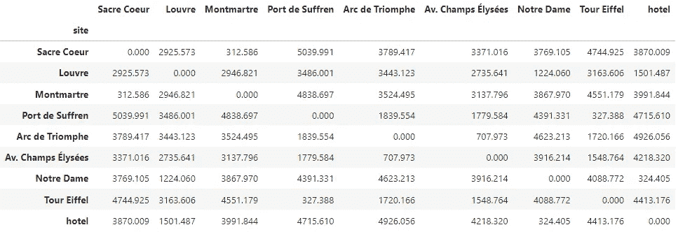

# 从基本原理建模旅行推销员问题

> 原文：[`towardsdatascience.com/modeling-the-traveling-salesman-problem-from-first-principles-bd6530c9c07?source=collection_archive---------1-----------------------#2023-05-14`](https://towardsdatascience.com/modeling-the-traveling-salesman-problem-from-first-principles-bd6530c9c07?source=collection_archive---------1-----------------------#2023-05-14)

## 一种概念优先、数学其次的建模方法，应用于运营研究中最著名的路线问题

 [Carlos J. Uribe](https://medium.com/@carlosjuribe?source=post_page-----bd6530c9c07--------------------------------)

·

[关注](https://medium.com/m/signin?actionUrl=https%3A%2F%2Fmedium.com%2F_%2Fsubscribe%2Fuser%2F4337eddb94ed&operation=register&redirect=https%3A%2F%2Ftowardsdatascience.com%2Fmodeling-the-traveling-salesman-problem-from-first-principles-bd6530c9c07&user=Carlos+J.+Uribe&userId=4337eddb94ed&source=post_page-4337eddb94ed----bd6530c9c07---------------------post_header-----------) 发表在 [Towards Data Science](https://towardsdatascience.com/?source=post_page-----bd6530c9c07--------------------------------) ·15 分钟阅读·2023 年 5 月 14 日

--

由 DALL·E 3 根据作者的提示生成的图像：“一张展示巴黎典型旅游路线的地图，方程式散布其间”

> *👁️* **这是系列文章的第 2 篇，涵盖了项目“**[**Python 中的智能决策支持系统**](https://medium.com/@carlosjuribe/list/an-intelligent-decision-support-system-for-tourism-in-python-b6ba165b4236)**”。** 我鼓励你查看它，以获得整个项目的一般概述。如果你只对如何建模 TSP 感兴趣，你仍然在正确的地方，因为这篇文章是独立的。**如果你** **也对解决问题感兴趣**，而不仅仅是建模它，你会喜欢系列的接下来 5 篇文章。相信我，它们会提供你需要的和你不知道你需要的*😉*

# 目录

## **1\. 动机和目的**

## **2\. 理解数据**

## **3\. 从问题描述中定义概念模型**

## **4\. 从概念模型构建数学模型**

+   4.1\. 将数据放入集合和参数

+   4.2\. 在变量中编码决策

+   4.3\. 定义目标

+   4.4\. 创建约束条件

# 1\. 动机和目的

-   本文接着[第一阶段文章](https://medium.com/@carlosjuribe/plan-an-optimal-trip-for-your-next-holidays-with-the-help-of-operations-research-and-python-481b1ea38fef)的内容。你不需要阅读它来理解我们将要做的事情，但让我给你一个快速回顾（如果你读过上一篇文章，可以跳到第二部分）。简而言之，我们列出了游客在规划旅行时面临的常见问题，并着手建立一个可以*帮助我们更有效地规划旅行*的系统，加快决策过程，甚至完全自动化任何给定旅行的日程安排。我们观察到这样表述的问题过于复杂，因此我们将其拆解，并得出了其本质版本，称之为**最小可行问题**。最后，我们得出结论，它的形式是[旅行商问题](https://en.wikipedia.org/wiki/Travelling_salesman_problem)（TSP），其中“城市”对应于我们版本中的“景点”，即游客希望参观的城市中的“景点”。

-   因此，作为一个启动步骤，我们必须首先制定并解决旅行商问题（TSP），一旦完成，我们就可以在更加稳固的基础上，向着更复杂和更通用的旅行规划解决方案迈进。我们选择这种方法是因为**这篇文章系列旨在教授一种灵活的运筹学（OR）建模方法**，所以你在这里找到的许多课程、技巧和窍门都是*适用于你可能遇到的任何问题*。

-   返回到我们的业务中，我们有 TSP 的**描述**：

+   **目标**：尽可能少走距离

+   **要求**：每个景点只访问一次，并返回到原始出发点（在我们的情况下是酒店）。

我们需要的是**问题的*模型***，**而不是*问题的解决方案***。我知道专注于获得解决方案很有诱惑力，但想一想：如果我们得到了 TSP 的*直接解决方案*，比如用某种 [启发式算法](https://en.wikipedia.org/wiki/Heuristic_(computer_science)) 找到*某个*解决方案——即使它是最优的——也对我们来说是不够的，因为*TSP 并不是我们实际的问题，而是一个简单的近似，我们需要扩展它以使其* ***近似*** *我们的实际问题。* 当我们更改问题描述（我们会这样做）时，任何针对 TSP 的 [解决算法](https://youtu.be/GiDsjIBOVoA?si=sY8LGNiehLoAXFtV) 都会变得过时，我们必须从头开始。

> 模型可以被扩展、调整和优化以适应你的问题及其变化的需求。然而，解决算法往往是针对特定问题定制的，当问题发生变化时，很难修改。

因此，我们的目标是**建立一个 TSP 模型**。一旦你学会了如何推理出这样的模型，你将会对接下来阅读 [下一篇文章](https://medium.com/@carlosjuribe/plan-optimal-trips-automatically-with-python-and-operations-research-models-part-2-fc7ee8198b6c)有很好的理解，在这篇文章中，我们将**在 Python 中实现该模型：**

 ## 使用 Python 实现、求解和可视化旅行商问题

### 学习如何将优化模型从数学翻译到 Python，优化它，并可视化解决方案以快速获得…

towardsdatascience.com

# 2. 理解数据

如果你记得 [我们上一次的文章](https://medium.com/@carlosjuribe/plan-an-optimal-trip-for-your-next-holidays-with-the-help-of-operations-research-and-python-481b1ea38fef)，TSP 的*基本输入*只是我们想在一天内访问的地点列表。在这个概念验证中，我们使用的是巴黎，因此我选择了这八个著名的必游之地：

+   圣心大教堂

+   卢浮宫

+   蒙马特

+   叠加码头

+   凯旋门

+   香榭丽舍大街

+   巴黎圣母院

+   埃菲尔铁塔

由于问题在于寻找最小*距离*的旅行，因此我们实际需要的数据是*距离数据*，这取决于地点及其相对地理位置。如何从地理位置计算距离数据将在 [第 4 篇文章](https://medium.com/@carlosjuribe/compute-the-distance-matrix-of-a-set-of-sites-from-their-coordinates-in-python-d5fc92a0ba9e)中讲解，因为现在讲解这个会导致一个*绕道*（双关）的内容，使你从这里的主要焦点——模型构建——分心。

因此，现在假设你已获得所有可能对之间的距离。这些距离将在[下一个迭代](https://medium.com/@carlosjuribe/plan-optimal-trips-automatically-with-python-and-operations-research-models-part-2-fc7ee8198b6c)中作为 CSV 文件提供，当我们用 Python 实现模型时。数据如下所示：

**图 2.1.** 一组巴黎站点的距离数据，TSP 所需。（图片由作者提供）

我们称这个表为**距离矩阵**。请注意，虽然这个酒店并不特别值得明信片上的风景，但它也包含在矩阵中，因为它被视为最终旅行中的另一个站点。对于这个 MVP，我们保持简单，使用**对称距离矩阵**，这是说从𝐴到𝐵的距离与从𝐵到𝐴的距离相同，对于任何 A 和 B 来说。在更高级的设置中，这种情况不一定成立，使得这种近似变得无效。

# 3\. 从问题描述中定义概念模型

现在我们处于下图流程图中表示为绿色块的阶段：

**图 2.2.** OR 中问题解决的简约工作流程。第 2 阶段：**概念模型**（图片由作者提供）

概念模型的目的是用语言陈述问题，但采用**标准化格式**，以便**“句子”和“数学对象”之间的映射在随后的阶段（数学模型制定）中变得清晰**。我们可以这样推测我们的**概念模型**：

（知道）

**数据（集合和参数）**：

+   需要访问的站点列表

+   任何一对站点之间的距离

（我们需要决定）

**决策**：以什么顺序访问站点

（以这样的方式）

**目标**：最小化总旅行距离

（使得）

**约束条件**：

+   所有站点都被访问

+   每个站点只访问一次

+   最后访问的站点是我们出发的站点（我们进行封闭旅行）

> ***👁️ 遵循良好实践，实践中，优秀将随之而来***
> 
> 你可能认为概念模型看起来相当平凡，与我们开始文章时的“简单”问题声明并没有太大区别。你是对的。对于像这样的简单问题，它可能是一个重复的步骤。**但对于更大的问题，这个阶段是不可或缺的，通常在没有首先建立概念模型的情况下构建数学模型会导致混乱**（不清晰或模糊的需求、糟糕的公式、错误的代码、不可行的模型等）。因此，现在我们需要建立这种纪律，即使在我们简单的案例中边际价值很低，也要通过这一阶段。专注于良好的习惯，良好的结果将随之而来。

# 4\. 从概念模型建立数学模型

我们刚刚达到了工作流程的“第 3 阶段”，在下图中用绿色标出。**数学模型**阶段，可能是所有阶段中最具挑战性的阶段，是*自然* *语言变为数学*的地方。

**图 2.3.** 运筹学中的极简工作流程。第 3 阶段：**数学模型**（图像由作者提供）

在这一阶段，任何一点模糊性都是不被允许的。

> 一个定义良好的数学模型胜过一百个解释

在我们工作流程的这一阶段，我们为 TSP 构建了一个*纯粹的*模型，在下一个阶段（见“[冲刺 3](https://medium.com/@carlosjuribe/plan-optimal-trips-automatically-with-python-and-operations-research-models-part-2-fc7ee8198b6c)”）我们将使用 Python 从之前解释过的 CSV 数据集中构建一个**模型实例**。

> *📝* ***理论回顾：“*抽象模型*”与“*模型实例*”***
> 
> 数学模型（在运筹学中）由“**组件**”构成。这些是**所有元素**（方程、数据等），**它们共同表示一个特定结构的问题**。**真正定义一个模型的是它的结构，*即*其组件之间的关系**，无论这些组件在任何给定示例中取什么具体的数值。
> 
> **模型实例**是“抽象模型”的一个具体“实现”，包含**具体数据**。因此，我们通常定义抽象模型，然后用特定场景的数据填充它们，进而得到**模型实例**。我们优化的就是这些模型实例，以获得**具体结果**。

在下面的小节中，我将简要介绍构成模型的组件及其目的，同时对它们进行定义。如果你不是初学者，已经了解模型组件的功能，可以跳过这些解释，直接进入数学定义部分。

## 4.1\. 将数据放入集合和参数中

我们所需的所有数据都位于图 2.1\. 中显示的数据框中。我们*可以*只将数据*保留*在这里，在创建模型的约束和目标时从该数据框中提取所有数字。事实上，许多人这样做，但**这是一个不良习惯，随着模型的规模增大，它无法良好扩展**。随着模型复杂性的增加，这种方法需要不断增加的[胶水代码](https://en.wikipedia.org/wiki/Glue_code)（用于处理数据框操作），如果数据保持在更适合优化模型构建的其他数据结构中，这些代码是可以避免的。这些数据结构就是模型的**集合**和**参数**。

> *💡* ***不同的数据结构以满足不同的需求***
> 
> 如果你在想**“为什么要创建集合和参数，而我们已经在表格中有了所需的数据？”**，简短的回答是：因为这样做可以使模型构建更容易、更通用，且更少出错。
> 
> “***集合***”是用于**存储问题的主要“实体”**或“元素”的模型组件，而“***参数***”则用于存储这些实体或它们*关系*的**数值属性**。在我们的例子中，访问地点是主要的“实体”，所以它们会被存储在一个**集合**中，而地点对之间的距离是它们关系的“数值属性”，所以它们会被存储为**参数**。在“实现层面”，进行这种分类也是非常有用的，因为**每个组件都有不同的功能**，这将使得模型构建更加容易：
> 
> **集合**的作用是**方便地存储和操作索引**。这些索引是代表问题中不同“实体”的 ID 或名称，它们被用来**以*方便*的方式*索引*参数**，用于约束和目标的创建。
> 
> **参数**的作用是**方便地存储和操作由它们所索引的“实体”的数值属性**，这些就是在约束和目标中**实际出现的**数字。

从我们的概念模型中，我们有：

+   我们定义的访问地点列表是**集合**𝕊：

**表达式 2.1.** 是旅行中所有访问地点的集合（为了简洁起见，只显示两个）。

“由𝑖, 𝑗索引”这一短语放在集合定义旁边，以表示每当在模型中使用索引𝑖或𝑗时，它们代表集合𝕊中的成员。这样，当我们有多个集合，从而使用多个索引时，更容易记住每个索引的含义。

+   任意一对地点之间的距离，我们定义为*索引的* **参数** 𝐷ᵢⱼ：

参数之所以称为“**索引的**”，仅仅是为了表明它不是一个标量参数（*即*，单个数字），而是一个二维数字矩阵。要从这个*索引参数*中检索一个数字，你需要指定两个索引𝑖和𝑗，这两个索引会从集合𝕊中取出。

𝕊和𝐷ᵢⱼ是概念模型中唯一的“数据组件”。但这不应该限制我们提出其他集合或参数的能力，*它们在构建模型时可能会很有用*。

举个例子，请注意𝐷ᵢⱼ的索引𝑖和𝑗是𝕊的成员，但*不能重合*。如果它们重合，距离将为零，这是一个平凡的数据。此外，我们不会从一个地方再次回到自己，因此完全没有必要考虑对（𝑖, 𝑖）。因此，限制对（𝑖, 𝑗）的组合是有用的，**以便建模变得更容易（并且*错误可能性更小*）**。为此，我们现在创建另一个集合𝔸，**源自**𝕊，包含所有*不同地点*的对（𝑖, 𝑗）。每对表示一个**弧**，连接地点𝑖到地点𝑗，因此符号是𝔸。

> *📝* **弧只是两个节点之间的“有向连接”**。只需将弧（𝑖, 𝑗）视为一个从𝑖开始并在𝑗处结束的向量。**当两个节点之间的“连接”没有方向**（即方向无关紧要）**时，使用“边”这个词**，因为一直说“无向弧”会太啰嗦。图论中的人们也喜欢高效。

𝔸的一个好属性是它是**定义𝐷ᵢⱼ的域**，正如我们在用 Python 实现模型时所看到的，显式地定义这样的域使其*可重用*于其他模型组件，这也是很方便的。

+   不同站点之间可能的弧集：

**表达式 2.2.**（导出的）巡回路径（站点到站点路径）可能的弧集。

## 4.2\. 将决策编码为变量

由于我们正在构建一个模型，以便它可以告诉我们应该采取哪些行动，并且这些规定的行动在模型优化之前对我们来说是*未知的*，我们必须将所有**我们可以采取的潜在行动**编码为变量。

但我们如何定义这些潜在的行动呢？根据我们的概念模型，我们需要做出的通用“决策”是“访问各个站点的顺序”。这个“顺序”指的是在进行巡回时我们可以遵循的所有可能路径中的一条。关键思想是*路径由连接单个节点（即站点）的弧的序列组成*。因此，**决定采取特定路径实际上是决定穿越特定的弧序列**。**这些关于*是否*穿越连接两个站点的特定弧的“原子决策”**就是我们希望作为变量进行编码的决策。

*“是否*从站点 A 前往站点 B”显然是一个**二元决策**：要么去，要么不去。由于这种特性，决策变量需要是二元的（*即*，只取 0 或 1 作为值），并且仅对有效的弧定义（因此导出的𝔸现在派上用场）。用数学术语表示：

**表达式 2.3.** 仅定义在可能的弧上的二元（去/不去）决策变量。

**每个可能的弧（𝑖, 𝑗）都有一个唯一的决策变量**，但当模型优化时，我们只关心**取值为 1 的变量，因为它们指示了应穿越哪些弧**。例如，如果变量𝛿ᵢⱼ，其中𝑖=*hotel*，𝑗=*Louvre*，取值为 1，则意味着我们应该从酒店到卢浮宫作为我们巡回的一部分。

## 4.3\. 定义目标

想象我们有 4 个点，𝑎, 𝑏, 𝑐, 𝑑，且我们遵循路径𝑎 → 𝑏 → 𝑐，其中点𝑑未被访问。它的总距离是其弧的距离之和：𝐷ᵃᵇ + 𝐷ᵇᶜ。但是，如果我们事先不知道将遵循什么路径，**我们如何表示这条未知路径的总距离？**

> *💡* 正因为最优路径未知，**我们需要一个覆盖所有可能路径的表达式**，但当模型优化时，它会简化为“最佳路径”的距离。

通过利用任何*遍历*弧（𝑖, 𝑗）将有𝛿ᵢⱼ = 1，而任何*未遍历*弧（𝑖′,𝑗′）将有𝛿ᵢᑊⱼᑊ = 0，我们可以创建一个表达式，一旦变量被决定，它将**简化为遍历路径的总距离**。方法是**“累加所有可能性”**，*即*对所有可能的弧距离𝐷ᵢⱼ进行加权求和，权重为其二进制“弧变量”𝛿ᵢⱼ，让这些变量取的 0 和 1 决定哪些距离保留（𝐷ᵢⱼ × 1 = 𝐷ᵢⱼ）哪些消失（𝐷ᵢⱼ × 0 = 0），在总距离的表达式中。这种“可能性的求和”代表了最终巡回将行走的总距离，因此它将是我们的目标（称为𝑍）需要*最小化*。

在数学上，这表示为：

**表达式 2.4.** 目标函数的原始版本定义，使用原始集𝕊（左）；以及其简化版本，使用派生集𝔸（右）。

注意右侧的求和因为使用了𝔸（即𝐷ᵢⱼ和𝛿ᵢⱼ的域（索引集合））变得更易读（和实现）。

同样，注意到**目标构成了我们对优良性的定义**。由于我们希望最小化目标，因此较低的值是**更好**的，而显然，最小值是**最佳**值。与这一“最佳”目标值相对应的决策变量𝛿ᵢⱼ的值构成了问题的（最优）解，它们将通过优化过程找到。

## 4.4. 创建约束

从我们的概念模型中，我们得到：

1.  所有站点都被访问。

1.  每个站点仅被访问一次

1.  最后访问的站点是我们开始的站点（我们进行一个闭合巡回）

我们意识到要求（1）已包含在要求（2）中，因为如果*每个*站点仅被访问一次，这意味着每个站点都被访问了，因此*所有站点*都被访问了。因此我们不再需要单独的约束来满足要求（1），而是专注于如何将要求（2）建模为约束。

说“每个站点仅被访问一次”与说“每个站点仅被*进入*和*退出*一次”是一样的。这个短语又等同于这两个短语的结合：“每个站点仅被*进入*一次”**和**“每个站点仅被*退出*一次”。我们来分别建模这些“短语”：

+   **每个站点仅*进入*一次**：

**表达式 2.5.** 约束集要求每个站点仅被“进入”一次。

*从右到左*阅读整个表达式是有用的。如果你首先看到约束定义的指标，解释左侧约束定义的含义会更容易。我会这样大声读出这个约束：

> *对于属于所有站点集合𝕊的每个站点𝑗，所有潜在弧 𝛿*ᵢⱼ**到达*𝑗***的总和*必须等于 1，这意味着*仅有一个***入弧*** *必须发生在𝑗。或者，更通俗地说：每个站点必须*从*仅有的一个其他站点*访问。*

+   **每个站点*离开*一次**：

**表达式 2.6。** 约束集强制每个站点“离开”一次。

我会这样阅读这个约束：

> *对于属于所有站点集合𝕊的每个站点𝑖，所有潜在弧 𝛿*ᵢⱼ**从*𝑖***的总和*必须等于 1，这意味着*仅有一个***出弧*** *必须发生在𝑖。或者，更通俗地说：每个站点必须*离开到*仅有的一个其他站点。*

我们只剩下要求 (3)。它规定最佳路径必须从起点返回到起点，或者等效地，路径必须是一个回路（一个闭合的环）。这里有一种初步的推理方式：“因为我们已经设置了约束来确保每个站点**被*进入*和*离开*一次**，这意味着结果路径必须是闭合的，因为任何站点都不可能是“汇点”（*即，*一个站点有一个入弧但*没有出弧*）或者是“源点”（*即，*一个站点有一个出弧但*没有入弧*）。因此，前两个约束，*大概*，**强制最终轨迹成为一个闭合回路**。”

**这种推理是否正确？** 我们采用实验方法。假设这种推理是正确的，然后尝试按现有模型解决。当我们查看解决方案时，我们将看到它是否正确或是否有问题。**如果结果错误（或以任何方式不合逻辑），我们可以随时返回并修正逻辑**（这在现实项目中时常发生）。**实现、解决和“实验验证”**是我们在“[下一个冲刺](https://medium.com/@carlosjuribe/plan-optimal-trips-automatically-with-python-and-operations-research-models-part-2-fc7ee8198b6c)”中涵盖的内容，在那里创建了一个 Python 模型，并根据得到的结果进行解决、检查和重新制定。

因此，我们在此（*暂时*）结束“数学模型制定”阶段。下一站是“**计算机模型**实施”，见[用 Python 实现、解决和可视化旅行商问题](https://medium.com/@carlosjuribe/plan-optimal-trips-automatically-with-python-and-operations-research-models-part-2-fc7ee8198b6c)：

 ## 使用 Python 实现、求解和可视化旅行商问题

### 学习如何将优化模型从数学转化为 Python，优化它，并可视化解决方案以获得快速结果……

towardsdatascience.com

将会有更多“冲刺”的文章发布，如果你渴望成为我在这段旅程中的伙伴，请保持关注，并**查看第三部分中的项目时间表** [**本系列的第一篇文章**](https://medium.com/@carlosjuribe/plan-an-optimal-trip-for-your-next-holidays-with-the-help-of-operations-research-and-python-481b1ea38fef)，以导航到你感兴趣的冲刺并跟踪那里的工作进展。

此外，欢迎关注我，在评论中向我提问，**给我反馈**，或通过[LinkedIn](https://www.linkedin.com/in/carlosjuribe/)与我联系。

感谢阅读，期待在[下一篇文章](https://medium.com/@carlosjuribe/plan-optimal-trips-automatically-with-python-and-operations-research-models-part-2-fc7ee8198b6c)中见到你！📈😊
