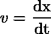
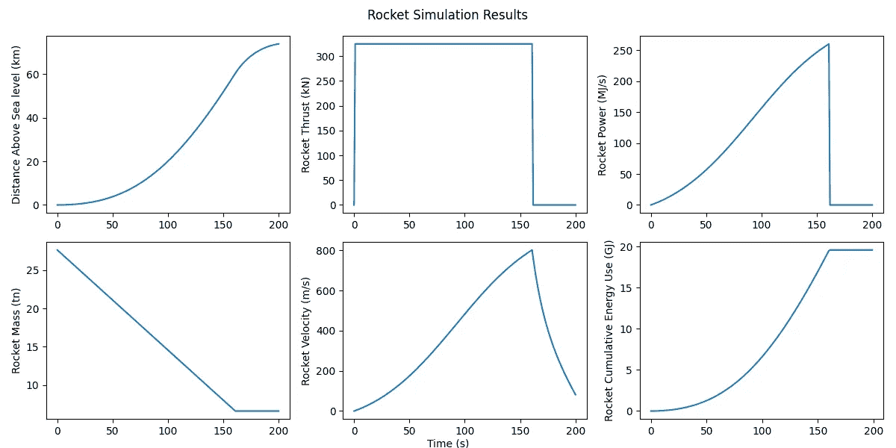

# 使用 GEKKO 以确定性方式建模世界

> 原文：[`towardsdatascience.com/modeling-the-world-in-a-deterministic-way-with-gekko-6dc8edbe5842?source=collection_archive---------10-----------------------#2023-06-30`](https://towardsdatascience.com/modeling-the-world-in-a-deterministic-way-with-gekko-6dc8edbe5842?source=collection_archive---------10-----------------------#2023-06-30)

照片由 [Iván Díaz](https://unsplash.com/@ivvndiaz?utm_source=medium&utm_medium=referral) 供稿，来自 [Unsplash](https://unsplash.com/?utm_source=medium&utm_medium=referral)

## 解决微分代数方程和应用动态优化的简明指南

 [Daniel Kulik](https://medium.com/@dkulikm?source=post_page-----6dc8edbe5842--------------------------------)

·

[关注](https://medium.com/m/signin?actionUrl=https%3A%2F%2Fmedium.com%2F_%2Fsubscribe%2Fuser%2F39c64e2376b3&operation=register&redirect=https%3A%2F%2Ftowardsdatascience.com%2Fmodeling-the-world-in-a-deterministic-way-with-gekko-6dc8edbe5842&user=Daniel+Kulik&userId=39c64e2376b3&source=post_page-39c64e2376b3----6dc8edbe5842---------------------post_header-----------) 发表在 [Towards Data Science](https://towardsdatascience.com/?source=post_page-----6dc8edbe5842--------------------------------) ·8 分钟阅读·2023 年 6 月 30 日

--

随着我们的世界越来越数字化，数据收集迅速扩展。这些数据使我们能够创建更准确的模型，这些模型帮助我们解决问题，并在许多业务和技术领域找到优化的解决方案。由于这些模型是基于现实世界的数据构建的，而现实世界的数据本质上是随机的，因此数据集中的随机性、噪声和异常现象通常是不可避免的。通常需要花费大量时间进行探索性数据分析（EDA）、数据预处理和异常值检测。这些方法已成为理解和完善数据的常见做法，然后再进行建模。然而，任何使用这些数据构建的模型始终只是对实际解决方案的近似。这是由于数据本身是随机的（Aleatoric 不确定性）并且受到许多未知因素的影响（Knightian 不确定性）。此外，数据不足或数据集偏倚失衡也可能进一步降低模型的准确性（Epistemic 不确定性）。即便在这些困难面前，这种方式构建的模型仍然是无价的，固有的随机性有时也可以成为帮助更好理解现实世界复杂性的工具。然而……还有一种替代方法：进入确定性建模。

确定性建模是与随机建模的对立面。它是一种通过去除现实世界引入的混乱来简化建模过程的某些方面的方法。这些模型本质上是理想化的，意味着它们基于特定假设代表了一个理想的解决方案。这些假设可以源于一组带有观点的、概率性的或通用的规则，并假设输入和输出之间存在明确的模式。虽然这听起来可能与使用随机数据的建模类似，但主要区别在于模型现在由这些预定义的假设决定，而不是训练数据。你可能会问，“*如果我不在数据上训练模型，那我从哪里获得这些模型假设*？”答案很简单，但有时被忽视，那就是**领域知识**。领域知识是一组关于特定主题的规则和概念。正是通过领域知识得出这些假设，为确定性建模提供基础。在任何编程语言中，这些确定性模型可以通过自定义代码编写，但随着模型变得越来越复杂，已经有专门解决这一任务的库被编写出来。在 Python 中，有一个名为*GEKKO*的库将被探索。

*GEKKO*是一个 Python 库，用于执行建模语言 Advanced process monitor (**APMonitor**)。它提供了一系列功能，专门用于确定性建模，帮助创建和分析复杂模型。它可以解决混合整数和微分代数方程，并配有大规模求解器，用于线性、二次、非线性和混合整数规划。*GEKKO*有 9 种问题类型用于定义确定性模型设置。然而，本文仅考虑同时解决所有方程的 Moving Horizon Estimation (**MHE**)模式。MHE 模式通过最小化测量输出与由优化问题制定的模型预测之间的差异来估计动态系统的状态。通过应用递归估计或移动窗口估计来完成这一过程。

哇！这真是一大堆术语，但接下来的实际示例应该很快让一切变得明了。

空间飞行是人类的一项了不起的成就。将人工制造的物体送入太空是一项工程和创造力的奇迹。但是，送东西进入太空是相当昂贵的。因此，建立具有预期性能能力的火箭是至关重要的。收集实际发射的数据有助于提高未来火箭的性能。然而，火箭必须在此之前发射才能获得数据，这就是问题所在。没有随机数据就没有基于随机的数据模型。此时，确定性模型和*GEKKO*登场。火箭的确定性模型的假设很简单，你猜对了，就是火箭科学！也就是说，即使没有将火箭离地一寸，我们也可以利用物理定律来确定特定火箭设置在理想化场景中的表现。例如，让我们使用*GEKKO*复制 SpaceX 的 Falcon 1 Stage 1 火箭设置。

首先，让我们使用公开已知的信息[1][2]来设置 Falcon 1 Stage 1 火箭，并开始定义一些模拟常量和已知值。

现在我们可以真正开始*GEKKO*中的有趣内容了。由于我们正在处理基于时间的模拟，首先定义我们的时间组件：

+   火箭飞行时间将是 200 秒

+   燃料燃烧时间为已知的 161.6 秒

+   以及一个额外的时间组件，用于以后使用

设置好时间数组后，我们可以初始化一个*GEKKO*模型并设置模型的时间组件。下一步是定义必须在每个时间步骤中解决的变量。这些变量由我们对火箭的假设决定，但也可以包括我们可能在模拟结束时感兴趣的变量。为了简化，这个模拟中的变量是：

+   质量

+   距离

+   速度

+   推力产生的力

+   另一个额外的虚拟时间变量，用于以后使用

对于这些变量中的每一个，我们可以给它一个起始值，还可以设置下界和上界来约束它们。*GEKKO* 变量是定义我们感兴趣变量的最通用方式。然而，实际上还有其他选项，比如固定变量、受控变量和操控变量，这些可以让用户对变量的演变有更多控制。你应该[查看一下](https://gekko.readthedocs.io/en/latest/quick_start.html)！

在继续之前，需要注意的是，为了节省你的阅读时间且不使内容过于数学化，这个火箭模型将忽略一些已知的火箭物理假设。这些包括，随着火箭上升空气密度和重力的变化，科里奥利力的影响，以及许多机械工程组件。然而，通过这些假设，我们将涵盖影响火箭飞行和动力学的主要力量。现在，介绍这些力量及如何在*GEKKO* 中应用它们可能是个好时机。

与任何经典的运动物体一样，牛顿的运动定律适用。这意味着我们已经对火箭的运动有了很好的了解。但让我们快速回顾一下我们需要的微分方程。别担心，它们真的很简单。我们先定义火箭如何移动和覆盖距离的方程，

哇！这是基本物理，*物体的速度只是距离的变化除以时间的变化*。接下来，添加火箭在空气中移动时会经历的阻力，顺便说一句，这真是个拖累。

有了这些，我们现在可以建立力和速度之间的另一个关系。记住，

好的，通过这个，我们可以将火箭所经历的所有力（前向推力、阻力，当然还有重力）与速度关联起来。下面是方法，

我保证这是这个模拟中最困难的方程。在火箭发射前，我们还需要做两个假设。其中一个与火箭中的燃料有关。如果火箭将燃料作为推进剂燃烧，那么一个好的方法是描述火箭质量如何变化。为此，我们可以假设质量损失与最大推力和燃烧时间呈线性关系，如下所示，

最后的假设实际上是当燃料用尽时会发生什么。这一假设非常有趣，因为它是一个逻辑声明，*GEKKO* 对此也有相应的功能。

完成这些后，我们现在可以将所有部分组合在一起，建立我们的确定性模型。

注意，上述代码中有一些额外的内容未被提及。首先调用了一个虚拟时间方程，这是为了跟踪燃料耗尽的时间。接下来，使用了优化目标。为什么要这样做？因为 MHE 求解一个目标，在这种情况下，目标是尝试在每个时间步使火箭达到从地面起的最大高度。你可以根据你想要优化的内容尝试其他目标函数（例如，尝试`m.fix_final(h, 50e3)`和`m.Obj(thrust*v)`来尽量节省火箭燃料）。最后一点是*GEKKO*会输出模拟是否能找到最佳解决方案。对于这个模拟，你会看到我们实际上有负的自由度。这是使用`m.if3`的一个怪癖，通常会导致模拟无法求解。所以，如果你想尝试更复杂的情况，可能可以考虑使用`m.if2`。

最后，是时候查看我们模拟的成果了。为了快速且清晰地查看模拟结果，绘制图表是一个很好的可视化方式。

分析火箭的性能提供了一些有趣的见解。首先，它达到了 73.83 公里的最大高度和 802.15 米/秒的最大速度。其次，火箭在飞行过程中燃烧了 19.59 吉焦的能量，平均推力为 322.68 千牛。

这些结果在建造火箭之前为我们提供了关于火箭能力和性能的重要信息。更好的是，参数可以轻松调整和微调，随着复杂性的不断增加，真正展示了确定性建模所带来的巨大潜力。利用这些信息，这些知识还可以进一步帮助工程师进行设计优化，并为如此高成本的项目制定预算。

虽然火箭很酷，但确定性建模的更实际应用包括对许多不同类型系统的优化。这些系统的例子有：制造厂的加工线、交通控制和路线规划、模拟复杂的感染和疾病传播、建模气候变化及其影响，甚至在金融领域使用基于确定性的博弈论模型。

总结一下，确定性建模是寻找理想场景解决方案的一个很好的选择，这些场景可以通过领域知识来很好地描述。它们可以用于建模复杂的非线性系统，并在实际数据可用之前提供强有力的预测和概率结果。总的来说，确定性建模是那些希望掌握它的人的强大工具。

[1] Propulsion Falcon-I([`www.b14643.de/Spacerockets_2/United_States_2/Falcon-I/Propulsion/engines.htm`](http://www.b14643.de/Spacerockets_2/United_States_2/Falcon-I/Propulsion/engines.htm))

[2] 猎鹰 1 号 ([`en.wikipedia.org/wiki/Falcon_1`](https://en.wikipedia.org/wiki/Falcon_1))
