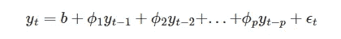

# 使用傅里叶变换对可变季节特征进行建模

> 原文：[`towardsdatascience.com/modeling-variable-seasonal-features-with-the-fourier-transform-18c792102047?source=collection_archive---------2-----------------------#2023-10-12`](https://towardsdatascience.com/modeling-variable-seasonal-features-with-the-fourier-transform-18c792102047?source=collection_archive---------2-----------------------#2023-10-12)

## 使用信号处理技术改进时间序列预测性能

[](https://florin-andrei.medium.com/?source=post_page-----18c792102047--------------------------------)[](https://towardsdatascience.com/?source=post_page-----18c792102047--------------------------------) [Florin Andrei](https://florin-andrei.medium.com/?source=post_page-----18c792102047--------------------------------)

·

[关注](https://medium.com/m/signin?actionUrl=https%3A%2F%2Fmedium.com%2F_%2Fsubscribe%2Fuser%2Faeaeb9d7d248&operation=register&redirect=https%3A%2F%2Ftowardsdatascience.com%2Fmodeling-variable-seasonal-features-with-the-fourier-transform-18c792102047&user=Florin+Andrei&userId=aeaeb9d7d248&source=post_page-aeaeb9d7d248----18c792102047---------------------post_header-----------) 发表于 [Towards Data Science](https://towardsdatascience.com/?source=post_page-----18c792102047--------------------------------) ·21 分钟阅读·2023 年 10 月 12 日[](https://medium.com/m/signin?actionUrl=https%3A%2F%2Fmedium.com%2F_%2Fvote%2Ftowards-data-science%2F18c792102047&operation=register&redirect=https%3A%2F%2Ftowardsdatascience.com%2Fmodeling-variable-seasonal-features-with-the-fourier-transform-18c792102047&user=Florin+Andrei&userId=aeaeb9d7d248&source=-----18c792102047---------------------clap_footer-----------)

--

[](https://medium.com/m/signin?actionUrl=https%3A%2F%2Fmedium.com%2F_%2Fbookmark%2Fp%2F18c792102047&operation=register&redirect=https%3A%2F%2Ftowardsdatascience.com%2Fmodeling-variable-seasonal-features-with-the-fourier-transform-18c792102047&source=-----18c792102047---------------------bookmark_footer-----------)

建模时间序列数据和预测是复杂的主题。可以使用许多技术来改善预测工作的模型性能。我们将讨论一种可能改善 ML 预测模型从时间特征中学习并从中概括的技术。主要关注点是创建季节性特征，以便在训练中为时间序列预测模型提供输入——如果在特征创建过程中包括傅里叶变换，可能会有明显的收益。我从过去在数字电子和信号处理方面的工作中获得了灵感，并将这些概念应用于时间序列预测的特征工程。

本文假设你对时间序列预测的基本方面比较熟悉——我们不会讨论这一主题的一般性内容，只会讨论其中某个方面的细化。这不是关于时间序列分析或建模，也不是关于金融时间序列（股票价格）。这关于机器学习对一般时间序列的预测。有关 ML 时间序列预测的介绍，请参见 [Kaggle 课程](https://www.kaggle.com/learn/time-series)——这里讨论的技术建立在他们关于季节性的课程之上。

我们还将比较一些显著的时间序列模型，如 Facebook Prophet 和 ARIMA，并学习它们使用的技术，这些技术绝对可以用于自定义的 ML 预测模型。

# ETS 方法和自回归模型

ETS 方法（误差、趋势、季节性）将时间序列信号分解为几个组件：


ETS 模型

+   y(t) 是你试图预测的信号（时间序列）

+   g(t) 是趋势，一个捕捉非周期性变化的函数

+   s(t) 是季节性，或具有严格周期性的变化

+   epsilon 是模型无法预测的噪声

通过正确学习 y(t) 和 g(t)，模型应该能够进行预测，除了由 epsilon 表示的随机变化（这些实际上不属于模型）。Facebook Prophet 采取了类似的方法，同时还添加了其他特征（假期、外生特征）。

自回归模型本质上做线性回归，其中特征是序列中的过去数据点（时间序列的滞后）。一个例子是 AR(p) 模型，或 ARIMA 的自回归部分（本质上只是一个 GLM——仅具有线性项的广义线性模型）：



AR(p) 模型

+   y(t) 是你试图预测的信号的未来值

+   b 是偏置项

+   y(t-1) 是最后已知的值（滞后 1）

+   y(t-2) 是之前的值（滞后 2），依此类推。

+   phi 系数是模型权重

+   噪声项（epsilon）实际上不属于 AR(p) 模型，因为它无法被预测

因此，AR(p) 模型试图通过多个过去值的滞后预测未来值。

在机器学习预测中，可以使用各种 ETS 和自回归模型的组合。也可以包含外生变量——这些变量不属于时间序列的一部分，但对其有影响（例如促销可能会影响销售）。SARIMAX 是一个例子，它使用了季节性成分、自回归成分、移动平均成分（误差项的）和外生特征。

如果你正在建模一个一般的时间序列（例如商店销售），随机游走假设并不占主导地位，你并不在意建立一个严谨的数学模型，主要关注的是时间序列值预测的 RMSE 性能，你可以使用通用机器学习模型（可以是随机森林概念的某种变体，可以像线性回归一样简单，也可以是各种机器学习模型的集合，甚至是神经网络）来建立模型，然后你可以工程化所有你需要的特征，并在训练中提供给模型。

想象一个包含将用于拟合模型的 Xtrain 特征的数据框。目标 Ytrain 是时间序列本身，可能以某种方式变换（缩放、对数等）。Xtrain 数据框可能包括：

+   趋势特征，表示时间序列的广泛变化；这些可能包括：常数项（每一行的值为 1）、线性时间函数（字面上是枚举：0、1、2、3、……）、二次函数（0、1、4、9、……）、三次函数，或可能有其他形状。Prophet 使用线性趋势，并从数据中计算拐点。

+   季节性，表示维持相同形状并在严格的时间表上发生的上下波动

+   自回归特征，即时间序列本身的滞后（目标 Ytrain 中的时间序列列，但向下移动 1 行或更多行）

+   外生特征，如促销、节假日、地理位置分组等。

当你运行 `model.fit(Xtrain, Ytrain)` 时，模型将从这些特征中学习，目标 Ytrain 就是时间序列本身。这是一种相当通用的时间序列预测形式，使用机器学习模型。

# 详细的季节性特征

Facebook Prophet 将季节性特征表示为傅里叶级数。一般来说，一个周期函数可以表示为一系列正弦/余弦对，其中每个正弦/余弦的周期是某个基周期的倍数：


傅里叶级数

+   t 是时间

+   P 是季节性特征的基周期——具有最大周期的正弦/余弦对的周期

+   n，序列中的索引，是一个周期去倍数（频率倍数）

+   正弦和余弦项由 a(n) 和 b(n) 参数加权

在 Pandas 形式中，这里有两个正弦/余弦对，第二对的频率是第一对的两倍：

```py
 sin(1,freq=A-DEC)  cos(1,freq=A-DEC)  sin(2,freq=A-DEC)  cos(2,freq=A-DEC)
time                                                                              
1956Q1           0.000000           1.000000           0.000000           1.000000
1956Q2           0.999963           0.008583           0.017166          -0.999853
1956Q3           0.017166          -0.999853          -0.034328           0.999411
1956Q4          -0.999963          -0.008583           0.017166          -0.999853
1957Q1           0.000000           1.000000           0.000000           1.000000
...                   ...                ...                ...                ...
2013Q1           0.000000           1.000000           0.000000           1.000000
2013Q2           0.999769           0.021516           0.043022          -0.999074
2013Q3           0.025818          -0.999667          -0.051620           0.998667
2013Q4          -0.999917          -0.012910           0.025818          -0.999667
2014Q1           0.000000           1.000000           0.000000           1.000000

[233 rows x 4 columns]
```

傅里叶定理指出（粗略来说），通过调整权重 a(n) 和 b(n)，当以这种方式表示一个表现良好的周期性函数时，级数可以使其收敛到该函数。因此，有限的傅里叶和可能是一个很好的方式来逼近周期信号（时间序列的季节性分量）——我们只是在寻找一种近似，而不是完全收敛，因此使用有限的和。

建模季节性的一种方法是使用 one-hot 编码变量。如果 P 是季节性特征的基期，那么数据框中 P 列，每列包含 0 或 1，每列在整个周期 P 内只出现一次 1，并且 P 列之间的行中 1 的值从不重叠，可以被线性模型学习为：


one-hot 编码

+   Cp 是每一列编码时间

+   beta 参数是应用于每一列的权重——它们的相对值实际上建模了波形的形状。

在 Pandas 形式中，以下是一个周期为 4 个观测的季节性特征 one-hot 编码：

```py
 s(1,4)  s(2,4)  s(3,4)  s(4,4)
time                                  
1956Q1     1.0     0.0     0.0     0.0
1956Q2     0.0     1.0     0.0     0.0
1956Q3     0.0     0.0     1.0     0.0
1956Q4     0.0     0.0     0.0     1.0
1957Q1     1.0     0.0     0.0     0.0
...        ...     ...     ...     ...
2013Q1     1.0     0.0     0.0     0.0
2013Q2     0.0     1.0     0.0     0.0
2013Q3     0.0     0.0     1.0     0.0
2013Q4     0.0     0.0     0.0     1.0
2014Q1     1.0     0.0     0.0     0.0

[233 rows x 4 columns]
```

如果你使用的模型是纯线性回归（没有惩罚），并且存在偏置项，那么 one-hot 编码可能会遇到所谓的虚拟变量陷阱。你也可能听到“共线性问题”这个术语。简而言之，Cp 列可以线性组合生成一个常量“趋势”来解释偏置项。

如果是这种情况，虚拟编码（K-1 编码）是解决方案——它实际上与 one-hot 编码相同，但使用 P-1 列（去掉一列）：


虚拟编码

你也可以尝试去除偏置项，或使用正则化模型，或使用梯度下降。在实践中，测试模型的性能并做出正确的决定。

# 傅里叶级数与 one-hot/虚拟编码

## one-hot/虚拟编码

假设你创建了一组 one-hot 编码列，组中有 P 列。这组将能够建模周期为 P 的任何季节性。它还能够建模周期为 P 的子倍数的季节性，如 P/2 等，因此你不需要显式建模它们。

这一连续周期（P, P/2, P/4 等）仅仅是另一种描述傅里叶级数的方法，它将任何复杂的周期信号建模为基组件及其所有频率倍数/周期子倍数的和。这是理解**one-hot/虚拟编码时间特征与傅里叶级数时间特征执行相同任务**的关键。它们是相同基本思想的不同实现。

one-hot/虚拟时间特征建模的周期的下限是时间序列的采样周期的两倍：如果时间序列有每日观测，那么你的时间虚拟特征建模的最短周期将是 2 天。这实际上是[奈奎斯特-香农定理](https://en.wikipedia.org/wiki/Nyquist%E2%80%93Shannon_sampling_theorem)在时间序列中的表述。

一热编码/虚拟变量编码真正做的是——它建模了 P 天组件的波形，就像一个具有 P 点的散点图。这样做是因为傅里叶变换的工作原理，它还捕捉了所有 P 的子倍频组件（P/2 等）。

一热编码的时间特征可以很好地学习任意复杂的波形。另一方面，如果 P 很大，那么一热编码的列数也会很大，这会遇到维度灾难问题。最好在短时间周期内使用一热/虚拟编码，但这不是严格的规则——如果你一开始没有很多特征，那么一大组时间虚拟变量也会很好。

## 傅里叶级数编码

傅里叶级数简洁，可以表达任意大的周期 P——它们非常适合大周期的季节性。另一方面，如果波形非常复杂，可能需要创建许多正弦/余弦对才能很好地学习。

你可能应该使用傅里叶级数的线索在周期图中（下面描述）。如果你注意到你的系列有一个强烈且尖锐的 P 天季节性组件，以及一个强烈且尖锐的 P/2 组件，而在明显模式方面没有其他内容，这表明一个周期为 P、另一个周期为 P/2 的正弦/余弦对可能会很好地工作。

请记住，P/2 组件和 P 组件建模的是同一现象：这不是两个不同的现象，而是同一个现象，其基周期为 P。P/2、P/4 等组件只是其傅里叶谐波在频谱中散布。这是因为基周期 P 的季节性没有完美的正弦形状——如果有，周期图中只会显示 P 组件。

永远不要创建周期短于时间序列采样周期两倍的傅里叶组件。如果你的时间序列采样周期为每日，则你能建模的最短季节性是 2 天。奈奎斯特-香农定理在这里设置了一个硬限制，就像一面砖墙。这就是你所有的数据。

也许甚至留出一些安全边际给[奈奎斯特限制](https://en.wikipedia.org/wiki/Nyquist_frequency)。你在音频 CD 格式中听到的音乐信号频率高达 20 kHz。音频 CD 的采样频率是 44.1 kHz，因此奈奎斯特限制是 22.05 kHz，比最大记录频率稍高。

# 加法性与乘法性季节性

考虑[季度澳大利亚波特兰水泥生产数据集](https://www.key2stats.com/data-set/view/776)，显示了 1956 年第一季度到 2014 年第一季度澳大利亚波特兰水泥的季度总生产量（以百万吨计）。

```py
df = pd.read_csv('Quarterly_Australian_Portland_Cement_production_776_10.csv', usecols=['time', 'value'])
# convert time from year float to a proper datetime format
df['time'] = df['time'].apply(lambda x: str(int(x)) + '-' + str(int(1 + 12 * (x % 1))).rjust(2, '0'))
df['time'] = pd.to_datetime(df['time'])
df = df.set_index('time').to_period()
df.rename(columns={'value': 'production'}, inplace=True)
```

```py
 production
time              
1956Q1       0.465
1956Q2       0.532
1956Q3       0.561
1956Q4       0.570
1957Q1       0.529
...            ...
2013Q1       2.049
2013Q2       2.528
2013Q3       2.637
2013Q4       2.565
2014Q1       2.229

[233 rows x 1 columns]
```


这是具有趋势、季节性组件和其他属性的时间序列数据。观察数据是季度性的，跨度数十年。

趋势 g(t) 几乎是线性的，只有少数几个拐点。季节成分 s(t) 有一个简单的波形，一直重复到结束。

一个试图仅通过趋势和季节性来表示该数据集的线性模型可能会将这两个特征组加性组合在一起（我们忽略模型中的所有其他成分）。这被称为加性季节性：


加性季节性

我将预期一个稍后的结果，并在这里展示将一个二次趋势（在这里几乎看起来是线性的）与一个加性季节性模型结合的输出，应用于数据集：


带有加性季节性的趋势

加性季节性在这里的问题很明显：模型已经学会了一个固定幅度的季节性，并且只是将其添加到趋势中。模型生成了一个由时间特征的权重决定的固定幅度波浪模式。

一种改进是乘性季节性。这是 Facebook Prophet 中的一个选项。假设季节性的幅度与趋势成正比。毫无疑问，对于某些数据集，这接近真实。乘性趋势公式是：


乘性季节性

这将很好地建模季节性，只要季节幅度确实与整体趋势成正比。在这种情况下，趋势本身建模季节成分的包络线。我们在这里不会演示这种情况，但稍后会显示这也不是一个很好的拟合。

但如果情况并非如此呢？当简单的加法或乘法都不是很好的拟合时，我们能做得更好吗？我们是否能有一个模型，学习季节特征的更一般的变化，这种变化不是恒定的，也不受限于与趋势的严格比例关系？

# 傅里叶分析

让我们看看澳大利亚波特兰水泥数据集中的季节成分，使用周期图绘图。这涉及使用 `scipy.signal` 中的 `periodogram()` 函数（所有代码都包含在附录笔记本中，链接在最后）。

`scipy.signal.periodogram()` 的作用是 —— 它查看一个周期性信号，并尝试估计一个傅里叶级数中的系数（比上面显示的级数公式更复杂一些），以便很好地逼近该信号。然后返回级数中的权重，可以在图中可视化。

这是应用于数据集的 `scipy.signal.periodogram()` 输出的绘图结果：


周期图

周期图展示了谱分量（季节性分量）的功率密度。数据集中最强的季节性分量是周期等于 4 个季度，或者 1 年的那个。这证实了视觉印象，即图中的最强上升和下降变化大约每十年发生 10 次。还有一个周期为 2 个季度的分量——这是相同的季节现象，这仅仅意味着 4 季度周期性不是一个简单的正弦波，而是具有更复杂的形状。还有其他周期为 10 个季度或更多的分量，但我们将忽略它们。

# 傅里叶声谱图

周期图将突出显示信号中的所有谱分量（数据中的所有季节性分量），并提供它们整体“强度”的概述，但它是对整个时间区间中任何分量“强度”的汇总。它没有说明每个季节性分量的“强度”如何在数据集中随时间变化。

为了捕捉这种变化，你必须使用傅里叶声谱图。它类似于周期图，但在整个数据集的多个时间窗口中反复执行。声谱图也作为 scipy 库中的一个方法提供。

让我们绘制上述提到的周期为 2 和 4 季度的季节性分量的声谱图。如往常一样，完整代码在最后链接的附属笔记本中。

```py
spectrum = compute_spectrum(df['production'], 4, 0.1)
plot_spectrogram(spectrum, figsize_x=10)
```


声谱图

该图显示的是 2 季度和 4 季度分量随时间变化的“强度”，以及它们在不同时间点的变化最大幅度（在数字音乐合成中，这称为**包络**）。它们最初相当弱，但在 2010 年左右变得非常强，这与本文开头数据集图中的变化相符。

# 超越乘法季节性

正如我们下面将看到的，包络将以一种肯定比简单地将固定幅度的季节性添加到趋势中更好的方式来建模季节性分量的幅度。它也可以比仅将季节性幅度与整体趋势（如乘法季节性）绑定更通用——**它将季节性与趋势完全解耦**。

换句话说，使用包络你可以继续使用基本的加法季节性模型，但季节性分量本身已经改变。它不再是固定幅度分量的线性组合。相反，它跟随信号中检测到的各种季节性分量的趋势（包络）。整体模型在季节性方面是加法的，但季节性被各种包络乘以。

假设你从傅里叶声谱图中提取季节性分量的包络 F，并对其进行平滑处理——平滑后的版本用 F-tilde 表示。那么，季节性分量的 one-hot 编码、虚拟编码和傅里叶编码变为：


带有组件包络的独热编码


带有组件包络的虚拟编码


带有组件包络的傅里叶级数

beta(p)、a(n)和 b(n)将是你的模型在拟合时间特征时学习的权重。F-tilde 系数（本身是时间序列）是组件包络，它们将在模型训练前与时间特征相乘，如下所示。

对于独热和虚拟编码，上述公式使用单一包络——基组件的周期 P。对于傅里叶和式，公式建议为每个组件提取一个单独的包络。实际中可能会有偏差，但这是另一个话题。

如果从所有特征中学习的总体模型是线性的，那么你仍然可以说你使用的是一种“加法季节性”（通过包络调整）：


加法季节性

如果总体模型是随机森林或其他非线性模型，则上述简单公式不适用。

# 代码中的季节特征

我们来创建一些示例数据框，其中包含可以用于建模数据集季节性的季节特征，使用`statsmodels.tsa.deterministic`中的方法。

独热编码特征，每个季度一个，周期为 1 年：

```py
seasonal_year = DeterministicProcess(index=df.index, constant=False, seasonal=True).in_sample()
print(seasonal_year)
```

```py
 s(1,4)  s(2,4)  s(3,4)  s(4,4)
time                                  
1956Q1     1.0     0.0     0.0     0.0
1956Q2     0.0     1.0     0.0     0.0
1956Q3     0.0     0.0     1.0     0.0
1956Q4     0.0     0.0     0.0     1.0
1957Q1     1.0     0.0     0.0     0.0
...        ...     ...     ...     ...
2013Q1     1.0     0.0     0.0     0.0
2013Q2     0.0     1.0     0.0     0.0
2013Q3     0.0     0.0     1.0     0.0
2013Q4     0.0     0.0     0.0     1.0
2014Q1     1.0     0.0     0.0     0.0

[233 rows x 4 columns]
```

如果你想使用虚拟编码，只需删除一列。还可以探索`DeterministicProcess()`中的`drop=True`选项，该选项将检查完全共线性并尝试做出正确的决定（删除/不删除）。

年度正弦-余弦特征对：

```py
cfr = CalendarFourier(freq='Y', order=2)
seasonal_year_trig = DeterministicProcess(index=df.index, seasonal=False, additional_terms=[cfr]).in_sample()
with pd.option_context('display.max_columns', None, 'display.expand_frame_repr', False):
    print(seasonal_year_trig)
```

```py
 sin(1,freq=A-DEC)  cos(1,freq=A-DEC)  sin(2,freq=A-DEC)  cos(2,freq=A-DEC)
time                                                                              
1956Q1           0.000000           1.000000           0.000000           1.000000
1956Q2           0.999963           0.008583           0.017166          -0.999853
1956Q3           0.017166          -0.999853          -0.034328           0.999411
1956Q4          -0.999963          -0.008583           0.017166          -0.999853
1957Q1           0.000000           1.000000           0.000000           1.000000
...                   ...                ...                ...                ...
2013Q1           0.000000           1.000000           0.000000           1.000000
2013Q2           0.999769           0.021516           0.043022          -0.999074
2013Q3           0.025818          -0.999667          -0.051620           0.998667
2013Q4          -0.999917          -0.012910           0.025818          -0.999667
2014Q1           0.000000           1.000000           0.000000           1.000000

[233 rows x 4 columns]
```

在本文其余部分，我们将使用独热编码，尽管我们拟合的模型是`LinearRegression()`。对于这个数据集，`statsmodels`检查了时间序列目标与`DeterministicProcess(drop=True)`的共线性，并认为没有必要删除一列（不切换到虚拟编码）。当然，你可以自由比较独热编码和虚拟编码在你的数据集和模型中的效果。

让我们看看在这些季节特征上拟合线性模型会发生什么。

# 拟合线性模型

我们来创建趋势特征（称为 const、trend 和 trend_squared 的列），然后将它们与上述生成的`seasonal_year`特征连接起来：

```py
trend_order = 2
trend_year = DeterministicProcess(index=df.index, constant=True, order=trend_order).in_sample()
X = trend_year.copy()
X = X.join(seasonal_year)
```

```py
 const  trend  trend_squared  s(1,4)  s(2,4)  s(3,4)  s(4,4)
time                                                               
1956Q1    1.0    1.0            1.0     1.0     0.0     0.0     0.0
1956Q2    1.0    2.0            4.0     0.0     1.0     0.0     0.0
1956Q3    1.0    3.0            9.0     0.0     0.0     1.0     0.0
1956Q4    1.0    4.0           16.0     0.0     0.0     0.0     1.0
1957Q1    1.0    5.0           25.0     1.0     0.0     0.0     0.0
...       ...    ...            ...     ...     ...     ...     ...
2013Q1    1.0  229.0        52441.0     1.0     0.0     0.0     0.0
2013Q2    1.0  230.0        52900.0     0.0     1.0     0.0     0.0
2013Q3    1.0  231.0        53361.0     0.0     0.0     1.0     0.0
2013Q4    1.0  232.0        53824.0     0.0     0.0     0.0     1.0
2014Q1    1.0  233.0        54289.0     1.0     0.0     0.0     0.0

[233 rows x 7 columns]
```

这是用于训练/验证模型的 X 数据框（特征）。我们用二次趋势特征对数据进行建模，加上需要的 4 个时间特征以捕捉年度季节性。y 数据框（目标）将仅为水泥生产数字。

让我们从数据中划分出一个包含 2010 年观察值的验证集。我们将在上述 X 特征和由水泥生产表示的 y 目标（训练数据集的那部分，即划分出验证数据后剩下的部分）上拟合一个线性模型，然后评估模型在验证中的表现。

我们还将用另一个仅趋势模型进行上述所有操作，该模型只会拟合趋势特征而忽略季节性——只是为了展示整体趋势是什么。

```py
def do_forecast(X, index_train, index_test, trend_order):
    X_train = X.loc[index_train]
    X_test = X.loc[index_test]

    y_train = df['production'].loc[index_train]
    y_test = df['production'].loc[index_test]

    model = LinearRegression(fit_intercept=False)
    _ = model.fit(X_train, y_train)
    y_fore = pd.Series(model.predict(X_test), index=index_test)
    y_past = pd.Series(model.predict(X_train), index=index_train)

    trend_columns = X_train.columns.to_list()[0 : trend_order + 1]
    model_trend = LinearRegression(fit_intercept=False)
    _ = model_trend.fit(X_train[trend_columns], y_train)
    y_trend_fore = pd.Series(model_trend.predict(X_test[trend_columns]), index=index_test)
    y_trend_past = pd.Series(model_trend.predict(X_train[trend_columns]), index=index_train)

    RMSLE = mean_squared_log_error(y_test, y_fore, squared=False)
    print(f'RMSLE: {RMSLE}')

    ax = df.plot(**plot_params, title='AUS Cement Production - Forecast')
    ax = y_past.plot(color='C0', label='Backcast')
    ax = y_fore.plot(color='C3', label='Forecast')
    ax = y_trend_past.plot(ax=ax, color='C0', linewidth=3, alpha=0.333, label='Trend Past')
    ax = y_trend_fore.plot(ax=ax, color='C3', linewidth=3, alpha=0.333, label='Trend Future')
    _ = ax.legend()

do_forecast(X, index_train, index_test, trend_order)
```

```py
RMSLE: 0.03846449744356434
```


模型验证

我们之前见过这种情况。蓝色是训练数据，红色是验证数据。完整模型是锐利、细的线。仅趋势模型是宽而模糊的线。

对于一个简单的模型来说，这并不差，但有一个明显的问题：模型学到了一个恒定振幅的年度季节性。尽管年度变化实际上随着时间的推移而增加，模型只能保持固定振幅的变化。显然，这是因为我们只给了模型固定振幅的季节性特征，并且没有其他特征（目标滞后等）来帮助它克服这个问题（这是故意为之，以突出这里描述的技术的重要性）。固定振幅的加法季节性在这里效果不佳。

也许通过傅里叶分析获得的季节性组件的振幅信息（包络）会改善性能？

# 调整季节性组件

让我们选择四季度季节性组件。如上面的频谱图所示，其包络非常嘈杂，因此我们可以在包络的`order=2`趋势上拟合一个线性模型（我们称之为包络模型），在训练数据上使用`model.fit()`来平滑包络，然后我们将使用`model.predict()`将该趋势扩展到验证/测试数据中：

```py
envelope_features = DeterministicProcess(index=X.index, constant=True, order=2).in_sample()

spec4_train = compute_spectrum(df['production'].loc[index_train], max_period=4)
spec4_train

spec4_model = LinearRegression()
spec4_model.fit(envelope_features.loc[spec4_train.index], spec4_train['4.0'])
spec4_regress = pd.Series(spec4_model.predict(envelope_features), index=X.index)

ax = spec4_train['4.0'].plot(label='component envelope', color='gray')
spec4_regress.loc[spec4_train.index].plot(ax=ax, color='C0', label='envelope regression: past')
spec4_regress.loc[index_test].plot(ax=ax, color='C3', label='envelope regression: future')
_ = ax.legend()
```


包络拟合

灰色线是包络本身——它非常嘈杂。蓝色线是包络，是训练数据中四季度季节性组件的变化强度，拟合（平滑）为二次趋势（`order=2`）。红色线是相同的内容，在验证数据上延展（预测）。这就是通过回归进行平滑。

你可能会注意到，虽然整体趋势被二次模型建模为接近线性，这个包络明显是非线性的。乘法季节性可能不适合这些数据。

我们已经建模了四季度季节性组件随时间的变化。让我们从包络模型（包络调整的傅里叶级数公式中的 F-tilde）中取出输出，并将其乘以对应于四季度季节性组件的时间特征：

```py
spec4_regress = spec4_regress / spec4_regress.mean()

season_columns = ['s(1,4)', 's(2,4)', 's(3,4)', 's(4,4)']
for c in season_columns:
    X[c] = X[c] * spec4_regress
print(X)
```

```py
 const  trend  trend_squared    s(1,4)    s(2,4)    s(3,4)    s(4,4)
time                                                                       
1956Q1    1.0    1.0            1.0  0.179989  0.000000  0.000000  0.000000
1956Q2    1.0    2.0            4.0  0.000000  0.181109  0.000000  0.000000
1956Q3    1.0    3.0            9.0  0.000000  0.000000  0.182306  0.000000
1956Q4    1.0    4.0           16.0  0.000000  0.000000  0.000000  0.183581
1957Q1    1.0    5.0           25.0  0.184932  0.000000  0.000000  0.000000
...       ...    ...            ...       ...       ...       ...       ...
2013Q1    1.0  229.0        52441.0  2.434701  0.000000  0.000000  0.000000
2013Q2    1.0  230.0        52900.0  0.000000  2.453436  0.000000  0.000000
2013Q3    1.0  231.0        53361.0  0.000000  0.000000  2.472249  0.000000
2013Q4    1.0  232.0        53824.0  0.000000  0.000000  0.000000  2.491139
2014Q1    1.0  233.0        54289.0  2.510106  0.000000  0.000000  0.000000

[233 rows x 7 columns]
```

四个时间特征不再是 0 或 1 了。它们已经被乘以组件包络（公式中的 F-tilde），现在它们的振幅随时间变化，就像包络一样。

# 重新训练模型

让我们重新训练主模型，现在使用修改后的时间特征。

```py
do_forecast(X, index_train, index_test, trend_order)
```

```py
RMSLE: 0.02546321729737165
```


模型验证，调整时间虚拟变量

我们并不追求完美拟合，因为这只是一个用于演示技术的玩具模型，但显然模型表现更好，更接近目标的四个季度变化。性能指标也提高了 51%，这还不错。

显然，整体趋势建模效果不佳。高阶趋势可能效果更好。或者像 Facebook Prophet 那样添加拐点也可能效果更好。可以随意尝试。

进一步的改进绝对是可能的（例如，具有大量时间滞后的自回归模型拟合效果会更好），但这不是本文的主题——我们这里只关注季节性方面。

# 最终评论

提高预测性能是一个广泛的话题。任何模型的行为都不依赖于单一特征或单一技术。然而，如果你希望从给定模型中提取所有可能的信息，应该提供有意义的特征。独热编码或虚拟编码，或正弦/余弦傅里叶对，当它们反映了季节性随时间的变化时，更具意义。

通过傅里叶变换调整季节性特征的包络对线性模型特别有效。提升树的效果不如线性模型明显，但无论使用什么模型，你几乎都可以看到改进。如果你使用集成模型，你可能会在堆栈底部有一个简单的模型，如线性回归，你可能希望在其他模型从其残差中学习之前提升其性能（假设集成模型是这样配置的）。

同样重要的是，你用来调整季节性特征的包络模型只能在训练数据上训练，在训练期间不能看到任何测试数据，就像其他模型一样。一旦你调整了包络，时间特征就包含了来自目标的信息——它们不再是可以在任何任意预测范围内预先计算的纯确定性特征。因此，如果你不小心，信息可能会通过时间特征从验证/测试阶段泄漏回训练数据（纯确定性时间特征不会有这个问题）。

最后，包络本身是时间序列，可能需要进行预测，因为它们建模的是现实世界的过程或现象。这是一个独立的讨论。

# 链接

本文使用的数据集可以在这里以公共领域（CC0）许可证获取：

[## KEY2STATS

### © 2023 KEY2STATS - RStudio® 是 RStudio, Inc. 的注册商标。AP® 是 College 的注册商标…

www.key2stats.com](https://www.key2stats.com/data-set/view/776?source=post_page-----18c792102047--------------------------------)

本文中使用的代码可以在这里找到：

[](https://github.com/FlorinAndrei/misc/blob/master/seasonal_features_fourier_article/cement.ipynb?source=post_page-----18c792102047--------------------------------) [## misc/seasonal_features_fourier_article/cement.ipynb at master · FlorinAndrei/misc

### 随机杂项。通过在 GitHub 上创建帐户贡献给 FlorinAndrei/misc。

[github.com](https://github.com/FlorinAndrei/misc/blob/master/seasonal_features_fourier_article/cement.ipynb?source=post_page-----18c792102047--------------------------------)

在 Kaggle 上提交给 Store Sales — 时间序列预测竞赛的笔记本，使用了本文中描述的想法：

[](https://www.kaggle.com/code/florinandrei/fourier-spectrogram-ensemble-models?source=post_page-----18c792102047--------------------------------) [## 傅里叶谱图，集成模型

### 使用 Kaggle Notebooks 探索并运行机器学习代码 | 使用 Store Sales 数据进行时间序列预测

[www.kaggle.com](https://www.kaggle.com/code/florinandrei/fourier-spectrogram-ensemble-models?source=post_page-----18c792102047--------------------------------)

这里是一个 GitHub 仓库，包含提交给 Kaggle 的笔记本的开发版本：

[](https://github.com/FlorinAndrei/timeseries-forecasting-fourier-time-dummies?source=post_page-----18c792102047--------------------------------) [## GitHub - FlorinAndrei/timeseries-forecasting-fourier-time-dummies: 带有傅里叶...

### 带有傅里叶调整时间虚拟变量的时间序列预测 - GitHub...

[github.com](https://github.com/FlorinAndrei/timeseries-forecasting-fourier-time-dummies?source=post_page-----18c792102047--------------------------------)

Facebook Prophet 论文 — 大规模预测：

[`peerj.com/preprints/3190.pdf`](https://peerj.com/preprints/3190.pdf)

本文中使用的所有图片和代码均由作者创建。
