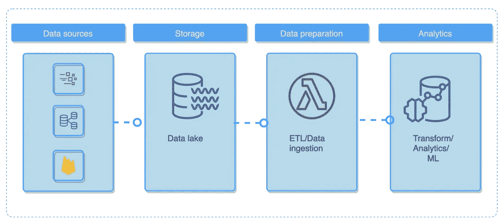
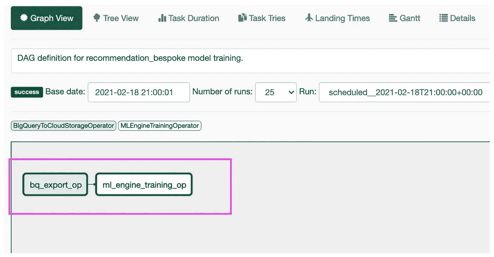
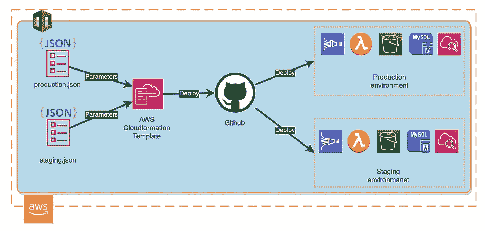

# 现代数据工程

> 原文：[`towardsdatascience.com/modern-data-engineering-e202776fb9a9`](https://towardsdatascience.com/modern-data-engineering-e202776fb9a9)

## 平台特定工具和高级技术

[](https://mshakhomirov.medium.com/?source=post_page-----e202776fb9a9--------------------------------)[](https://towardsdatascience.com/?source=post_page-----e202776fb9a9--------------------------------) [💡Mike Shakhomirov](https://mshakhomirov.medium.com/?source=post_page-----e202776fb9a9--------------------------------)

·发布于 [Towards Data Science](https://towardsdatascience.com/?source=post_page-----e202776fb9a9--------------------------------) ·阅读时间 12 分钟·2023 年 11 月 4 日

--


图片由 [Christopher Burns](https://unsplash.com/@christopher__burns?utm_source=medium&utm_medium=referral) 提供，来源于 [Unsplash](https://unsplash.com/?utm_source=medium&utm_medium=referral)

现代数据生态系统不断演变，新数据工具时不时出现。在这篇文章中，我想谈谈影响数据工程师的关键因素。我们将讨论如何利用这些知识来推动先进的分析管道和卓越的运营。

## 我想讨论一些流行的数据工程问题：

+   现代数据工程（DE）。它是什么？

+   你的数据工程（DE）是否足够好，能为先进的数据管道和商业智能（BI）提供支持？

+   你的数据管道是否高效？

+   从技术角度来看，实现卓越运营需要什么？

在十月份，我写了关于数据工程师的崛起、角色、挑战、职责、日常工作以及如何在这个领域取得成功。数据工程领域在不断变化，但主要趋势似乎保持不变。

[](/how-to-become-a-data-engineer-c0319cb226c2?source=post_page-----e202776fb9a9--------------------------------) ## 如何成为数据工程师

### 2024 年初学者的捷径

towardsdatascience.com

作为一名数据工程师，我几乎每天都需要设计高效的数据流程。因此，这里有一些需要考虑的事项，可以帮助我们解答这些问题。

## 现代数据工程趋势

+   ETL 与 ELT

+   简化的数据连接器和 API 集成

+   ETL 框架的爆炸性增长

+   数据基础设施即代码

+   数据网格与去中心化数据管理

+   利用 AI 进行商业智能管道的民主化

+   关注数据素养

## ELT 与 ETL

受欢迎的 SQL 数据转换工具，如**Dataform**和**DBT**，对 ELT 方法的普及做出了重要贡献[1]。在存储数据的地方执行所需的数据转换，如清洗、丰富和提取，显得非常合理。通常，这是一种位于我们基础设施中心的数据仓库解决方案（DWH）。云平台领导者使 DWH（Snowflake、BigQuery、Redshift、Firebolt）的基础设施管理变得非常简单，在许多场景中，它们在成本效益和速度方面将优于专门的内部基础设施管理团队。


数据仓库示例。作者提供的图片

它也可能是中心的数据湖，这取决于我们的数据平台类型和使用的工具。在这种情况下，SQL 在许多情况下不再是一个选项，使得那些不熟悉编程的用户难以查询数据。像 Databricks、Tabular 和 Galaxy 这样的工具试图解决这个问题，感觉它确实是未来的发展方向。确实，数据湖可以存储所有类型的数据，包括非结构化数据，我们仍然需要能够分析这些数据集。



数据湖示例。作者提供的图片。

> 想象一下具有事务一致性的 数据湖表和时间点快照隔离。

我之前在关于 Apache Iceberg 表格式的故事中写过这方面的内容[2]。

[](/introduction-to-apache-iceberg-tables-a791f1758009?source=post_page-----e202776fb9a9--------------------------------) ## Apache Iceberg 表介绍

### 选择 Apache Iceberg 作为数据湖的几个有力理由

towardsdatascience.com

## 简化的数据集成

像**Fivetran**和**Stitch**这样的托管解决方案被创建以轻松管理第三方 API 集成。如今，许多公司选择这种方法来简化与外部数据源的互动。这将是数据分析团队中不熟悉编码的人员的正确选择。

> 确实，如果数据连接器已经存在并且在云中管理，我们为什么还要从头开始构建呢？
> 
> 不过这种方法的缺点是其定价模型。

很多时候它是基于行的，并且在企业级数据摄取（即大数据管道）上可能变得相当昂贵。这就是开源替代方案发挥作用的地方。像**Airbyte**和**Meltano**这样的框架可能是部署数据源**集成**微服务的简单快捷解决方案。

如果你没有时间学习新的 ETL 框架，你可以自己创建一个简单的数据连接器。如果你懂一点 Python，这将是一个微不足道的任务。在我之前的一篇文章中，我写了如何轻松创建一个从 NASA API 拉取数据的微服务[3]：

[](/python-for-data-engineers-f3d5db59b6dd?source=post_page-----e202776fb9a9--------------------------------) ## 数据工程师的 Python

### 初学者的高级 ETL 技术

towardsdatascience.com

考虑`app.py`中的这段代码

```py
import requests
session = requests.Session()

url="https://api.nasa.gov/neo/rest/v1/feed"
apiKey="your_api_key"
requestParams = {
    'api_key': apiKey,
    'start_date': '2023-04-20',
    'end_date': '2023-04-21'
}
response = session.get(url, params = requestParams, stream=True)
print(response.status_code)
```

它可以部署在任何云服务商平台上，并按所需频率调度运行。使用类似**Terraform**的工具来部署我们的数据管道应用程序始终是一个好的实践。

## ETL 框架的爆炸性增长

我们可以见证各种 ETL 框架在数据提取和转换中的“寒武纪大爆发”。许多框架都是开源的，并且基于 Python，这并不令人惊讶。

**Luigi** [8]就是其中之一，它帮助创建 ETL 管道。它由 Spotify 创建，用于管理大规模数据处理工作负载。它具有命令行界面和出色的可视化功能。然而，即使是基本的 ETL 管道也需要一定的 Python 编程技能。从我的经验来看，它适合严格且直接的管道。我发现使用 Luigi 实现复杂的分支逻辑特别困难，但它在许多场景中表现良好。

**Python ETL (PETL) [9]**是最广泛使用的开源 ETL 框架之一，用于简单的数据转换。在处理表格、从外部数据源提取数据以及对数据执行基本 ETL 时，它非常宝贵。在许多方面，它与**Pandas**类似，但后者在后台具有更多的分析功能。PETL 非常适合聚合和行级 ETL。

**Bonobo** [10]是另一个开源的轻量级数据处理工具，非常适合快速开发、自动化和批处理数据管道的并行执行。我喜欢它的一点是，它让处理各种数据文件格式变得非常简单，例如 SQL、XML、XLS、CSV 和 JSON。对于那些 Python 知识有限的人来说，它将是一个很好的工具。在其他好处中，我喜欢它对半复杂数据模式的良好支持。它非常适合简单的 ETL，并且可以在 Docker 容器中运行（它有一个 Docker 扩展）。

**Pandas**在数据领域中绝对是一个巨头，在这个故事中没有必要详细介绍它的能力。值得一提的是，它的数据框架转换已被纳入许多现代数据仓库的基本数据加载方法之一。考虑将数据加载到 BigQuery 数据仓库解决方案中的示例：

```py
from google.cloud import bigquery
from google.oauth2 import service_account
...
# Authenticate BigQuery client:
service_acount_str = config.get('BigQuery') # Use config
credentials = service_account.Credentials.from_service_account_info(service_acount_str)
client = bigquery.Client(credentials=credentials, project=credentials.project_id)

...
def load_table_from_dataframe(table_schema, table_name, dataset_id):
    #! source data file format must be outer array JSON:
    """
    [
    {"id":"1"},
    {"id":"2"}
    ]
    """
    blob = """
            [
    {"id":"1","first_name":"John","last_name":"Doe","dob":"1968-01-22","addresses":[{"status":"current","address":"123 First Avenue","city":"Seattle","state":"WA","zip":"11111","numberOfYears":"1"},{"status":"previous","address":"456 Main Street","city":"Portland","state":"OR","zip":"22222","numberOfYears":"5"}]},
    {"id":"2","first_name":"John","last_name":"Doe","dob":"1968-01-22","addresses":[{"status":"current","address":"123 First Avenue","city":"Seattle","state":"WA","zip":"11111","numberOfYears":"1"},{"status":"previous","address":"456 Main Street","city":"Portland","state":"OR","zip":"22222","numberOfYears":"5"}]}
    ]
    """
    body = json.loads(blob)
    print(pandas.__version__)

    table_id = client.dataset(dataset_id).table(table_name)
    job_config = bigquery.LoadJobConfig()
    schema = create_schema_from_yaml(table_schema) 
    job_config.schema = schema

    df = pandas.DataFrame(
    body,
    # In the loaded table, the column order reflects the order of the
    # columns in the DataFrame.
    columns=["id", "first_name","last_name","dob","addresses"],

    )
    df['addresses'] = df.addresses.astype(str)
    df = df[['id','first_name','last_name','dob','addresses']]

    print(df)

    load_job = client.load_table_from_dataframe(
        df,
        table_id,
        job_config=job_config,
    )

    load_job.result()
    print("Job finished.")
```

例如，**Apache Airflow**并不是一个 ETL 工具，但它有助于将我们的 ETL 管道组织成依赖关系图（DAGs）的可视化，以描述任务之间的关系。典型的 Airflow 架构包括基于元数据的调度器、执行器、工作节点和任务。

例如，我们可以在将数据导出到云存储（bq_export_op）后运行 ml_engine_training_op，并使此工作流每日或每周运行。



使用 Airflow 训练 ML 模型。图像由作者提供。

请考虑下面的这个例子。

> 它创建了一个简单的数据管道图，将数据导出到云存储桶中，然后使用 MLEngineTrainingOperator 训练 ML 模型。

```py
"""DAG definition for recommendation_bespoke model training."""

import airflow
from airflow import DAG
from airflow.contrib.operators.bigquery_operator import BigQueryOperator
from airflow.contrib.operators.bigquery_to_gcs import BigQueryToCloudStorageOperator
from airflow.hooks.base_hook import BaseHook
from airflow.operators.app_engine_admin_plugin import AppEngineVersionOperator
from airflow.operators.ml_engine_plugin import MLEngineTrainingOperator

import datetime

def _get_project_id():
  """Get project ID from default GCP connection."""

  extras = BaseHook.get_connection('google_cloud_default').extra_dejson
  key = 'extra__google_cloud_platform__project'
  if key in extras:
    project_id = extras[key]
  else:
    raise ('Must configure project_id in google_cloud_default '
           'connection from Airflow Console')
  return project_id

PROJECT_ID = _get_project_id()

# Data set constants, used in BigQuery tasks.  You can change these
# to conform to your data.
DATASET = 'staging' #'analytics'
TABLE_NAME = 'recommendation_bespoke'

# GCS bucket names and region, can also be changed.
BUCKET = 'gs://rec_wals_eu'
REGION = 'us-central1' #'europe-west2' #'us-east1'
JOB_DIR = BUCKET + '/jobs'

default_args = {
    'owner': 'airflow',
    'depends_on_past': False,
    'start_date': airflow.utils.dates.days_ago(2),
    'email': ['mike.shakhomirov@gmail.com'],
    'email_on_failure': True,
    'email_on_retry': False,
    'retries': 5,
    'retry_delay': datetime.timedelta(minutes=5)
}

# Default schedule interval using cronjob syntax - can be customized here
# or in the Airflow console.
schedule_interval = '00 21 * * *'

dag = DAG('recommendations_training_v6', default_args=default_args,
          schedule_interval=schedule_interval)

dag.doc_md = __doc__

#
#
# Task Definition
#
#

# BigQuery training data export to GCS

training_file = BUCKET + '/data/recommendations_small.csv' # just a few records for staging

t1 = BigQueryToCloudStorageOperator(
    task_id='bq_export_op',
    source_project_dataset_table='%s.recommendation_bespoke' % DATASET,
    destination_cloud_storage_uris=[training_file],
    export_format='CSV',
    dag=dag
)

# ML Engine training job
training_file = BUCKET + '/data/recommendations_small.csv'
job_id = 'recserve_{0}'.format(datetime.datetime.now().strftime('%Y%m%d%H%M'))
job_dir = BUCKET + '/jobs/' + job_id
output_dir = BUCKET
delimiter=','
data_type='user_groups'
master_image_uri='gcr.io/my-project/recommendation_bespoke_container:tf_rec_latest'

training_args = ['--job-dir', job_dir,
                 '--train-file', training_file,
                 '--output-dir', output_dir,
                 '--data-type', data_type]

master_config = {"imageUri": master_image_uri,}

t3 = MLEngineTrainingOperator(
    task_id='ml_engine_training_op',
    project_id=PROJECT_ID,
    job_id=job_id,
    training_args=training_args,
    region=REGION,
    scale_tier='CUSTOM',
    master_type='complex_model_m_gpu',
    master_config=master_config,
    dag=dag
)

t3.set_upstream(t1)
```

**Bubbles** [11] 是另一个用于 Python 世界中 ETL 的开源工具。它非常适合快速开发，我喜欢它如何使用元数据来描述数据管道。Bubbles 的创建者称其为“抽象框架”，并表示它可以从许多其他编程语言中使用，而不仅仅是 Python。

还有许多其他工具具有更具体的应用，例如从网页中提取数据（PyQuery、BeautifulSoup 等）和并行数据处理。这可以是另一个话题，但我之前写过一些相关内容，例如 `joblib` 库 [12]。

## 数据基础设施即代码

**基础设施即代码**（IaC）是一种流行且非常实用的方法，用于**管理数据平台资源**。即使是数据方面，目前这几乎已经成为标准，而且在简历上提到你熟悉 DevOps 标准绝对会显得很棒。使用像 Terraform（平台无关）和 CloudFormation 这样的工具，我们可以轻松地将我们的开发工作和部署（运维）进行集成。

通常，我们希望为数据管道设置测试环境和生产环境。这有助于测试我们的管道，并促进团队之间的协作。

请查看下面的图表。它解释了数据环境的工作原理。



数据环境。图像由作者提供。

我们经常需要一个额外的沙箱来进行测试，或在 ETL 服务触发 CI/CD 工作流时运行数据转换单元测试。

我之前在这里写过相关内容：

[](https://levelup.gitconnected.com/infrastructure-as-code-for-beginners-a4e36c805316?source=post_page-----e202776fb9a9--------------------------------) [## 初学者的基础设施即代码

### 像专业人士一样使用这些模板部署数据管道

levelup.gitconnected.com](https://levelup.gitconnected.com/infrastructure-as-code-for-beginners-a4e36c805316?source=post_page-----e202776fb9a9--------------------------------)

> 使用 AWS CloudFormation 模板文件，我们可以描述所需的资源及其依赖关系，这样我们可以将它们作为一个整体堆栈一起启动和配置。

如果你是一位**数据专家**，这种方法肯定会帮助你更好地处理不同的数据环境，并更快速、更一致地复制数据平台资源而不出错。

问题在于许多数据从业者对 IaC 并不熟悉，这在开发过程中会产生很多错误。

## 数据网格和去中心化数据管理

数据空间在过去十年里发生了显著变化，现在我们有很多数据工具和框架。**数据网格**定义了这样一种状态：我们拥有不同的数据领域（公司部门），每个领域都有自己的团队和共享的数据资源。每个团队都有自己的目标、关键绩效指标（KPI）、数据角色和职责。

> 长期以来，数据官僚主义一直是许多公司的真正痛点。

这种数据平台类型[4]可能看起来有些混乱，但它旨在成为一个成功且高效的选择，尤其适用于去中心化的公司，在这种结构下，不同的团队可以自行访问跨领域的数据集并执行分析或 ETL 任务。

的确，如果你是数据分析师而不熟悉 Spark，Snowflake 可能是你最喜欢的数据仓库解决方案。然而，当你可能希望在没有数据工程帮助的情况下读取数据湖数据时，通常这会是一个微不足道的问题。在这种情况下，大量的数据集元数据记录可能非常有用，这也是数据网格如此成功的原因。

这使得用户了解数据及其来源，并了解其他团队如何充分利用他们之前不知道的数据集。

有时数据集和数据源连接变得非常复杂，因此始终保持一个包含元数据和数据集描述的单一真实数据仓库是一个好习惯。

在我之前的一篇故事[5]中，我写到了 SQL 作为团队和数据的统一查询语言的作用。确实，它具有分析性、自描述性，甚至可以是动态的，这使得它成为所有数据用户的完美工具。

> **这往往变成一团糟**

这一事实使得基于 SQL 的模板引擎如 DBT、Jinja 和 Dataform 非常受欢迎。**试想一下，你拥有一个类似 SQL 的平台，其中所有数据集及其转换都被彻底描述和定义[6]。**


Dataform 的依赖图和元数据。图片来源：作者。

理解数据团队如何与数据源和模式关联可能是一个很大的挑战。通常，这些都纠缠在数据集依赖关系和 ETL 转换的复杂网络中。

数据工程在指导、提升数据素养以及通过最先进的数据处理技术和最佳实践来赋能公司其他部门方面发挥了关键作用。

## 使用 AI 进行商业智能管道的民主化

改善数据可访问性一直是数据领域的热门话题，但有趣的是，整个数据管道设计过程正变得越来越容易被那些之前不熟悉数据的团队所接触。现在，几乎每个部门都可以利用内置的 AI 能力，在数据上创建复杂的商业智能转换。

> 他们所需要的只是用自己的话描述他们在商业智能方面的需求。

例如，像**Thoughspot**这样的 BI 工具使用具有直观“Google 风格搜索界面”的 AI [7] 来从存储在任何现代数据仓库解决方案（如 Google Big Query、Redshift、Snowflake 或 Databricks）中的数据中获得洞察。

现代数据栈包括帮助数据建模和可视化的 BI 工具。许多工具已经具备了这些内置的 AI 功能，以根据用户行为更快地获得数据洞察。

我相信将 GPT 与 BI 集成是一项相当简单的任务。在接下来的几年中，我们将看到许多新产品使用这项技术。

> GPT 可以预处理文本数据，以生成理解您的意图并回答您的问题的 SQL 查询。

## 结论

在这篇文章中，我试图给出一个关于当前数据工程角色所面临的主要数据趋势的**高级概述**。数据网格和带有依赖关系图的模板化 SQL 使数据素养的普及成为可能，从而使整个分析过程民主化。先进的数据管道以及复杂的 ETL 技术和转换现在对组织中的每个人都是透明的。数据管道正变得越来越易于其他团队访问，他们不需要了解编程就能学习和理解 ETL 的复杂性。数据网格和元数据有助于解决这个问题。从我的经验来看，我发现越来越多的人学习 SQL 以参与转型层。诞生于“高级数据分析”时代的公司享有轻松访问云供应商产品及其托管服务的奢侈。它确实有助于获得所需的数据技能并加以提升，以获得竞争优势。

## 推荐阅读

[1] [`medium.com/towards-data-science/data-pipeline-design-patterns-100afa4b93e3`](https://medium.com/towards-data-science/data-pipeline-design-patterns-100afa4b93e3)

[2] `towardsdatascience.com/introduction-to-apache-iceberg-tables-a791f1758009`

[3] `towardsdatascience.com/python-for-data-engineers-f3d5db59b6dd`

[4] [`medium.com/towards-data-science/data-platform-architecture-types-f255ac6e0b7`](https://medium.com/towards-data-science/data-platform-architecture-types-f255ac6e0b7)

[5] [`medium.com/towards-data-science/advanced-sql-techniques-for-beginners-211851a28488`](https://medium.com/towards-data-science/advanced-sql-techniques-for-beginners-211851a28488)

[6] [`medium.com/towards-data-science/easy-way-to-create-live-and-staging-environments-for-your-data-e4f03eb73365`](https://medium.com/towards-data-science/easy-way-to-create-live-and-staging-environments-for-your-data-e4f03eb73365)

[7] [`docs.thoughtspot.com/cloud/latest/search-sage`](https://docs.thoughtspot.com/cloud/latest/search-sage)

[8] [`github.com/spotify/luigi`](https://github.com/spotify/luigi)

[9] [`petl.readthedocs.io/en/stable/`](https://petl.readthedocs.io/en/stable/)

[10] [`www.bonobo-project.org`](https://www.bonobo-project.org)

[11] [`bubbles.databrewery.org/`](http://bubbles.databrewery.org/)

[12] [`medium.com/towards-data-science/how-to-become-a-data-engineer-c0319cb226c2`](https://medium.com/towards-data-science/how-to-become-a-data-engineer-c0319cb226c2)
