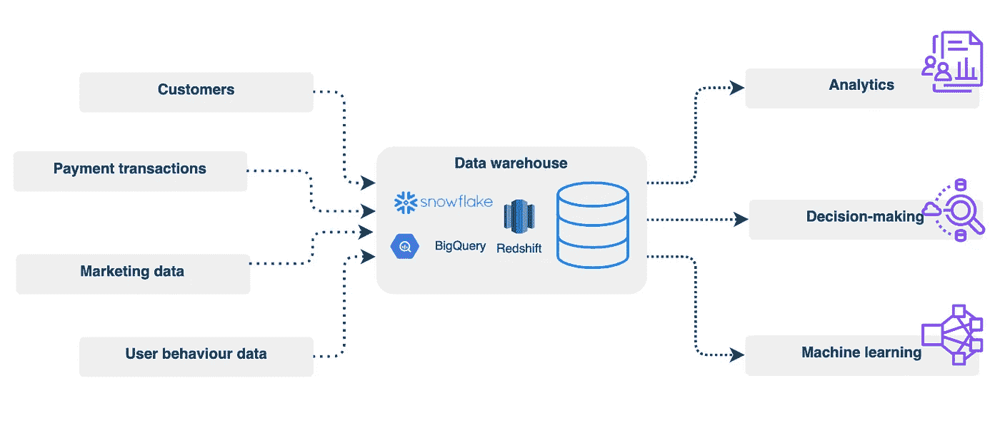
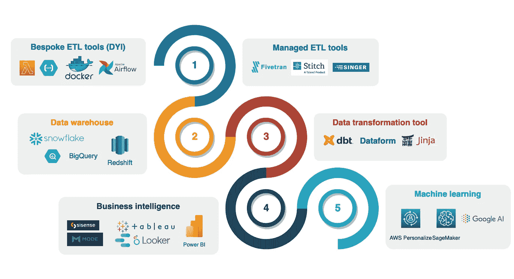
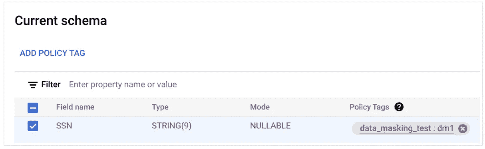
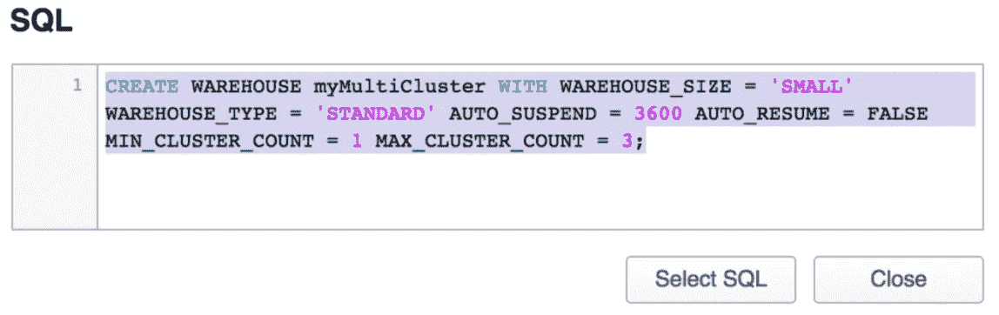
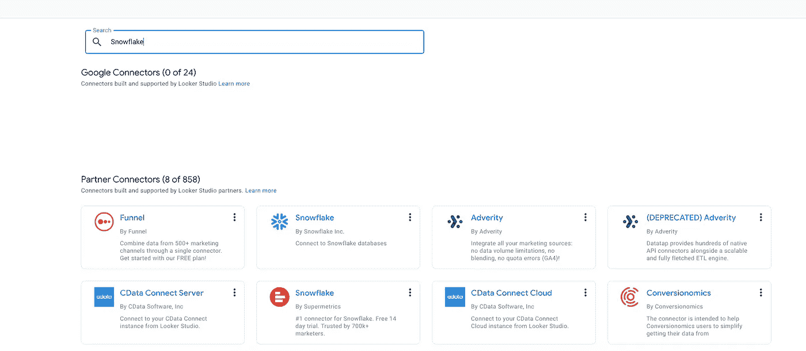
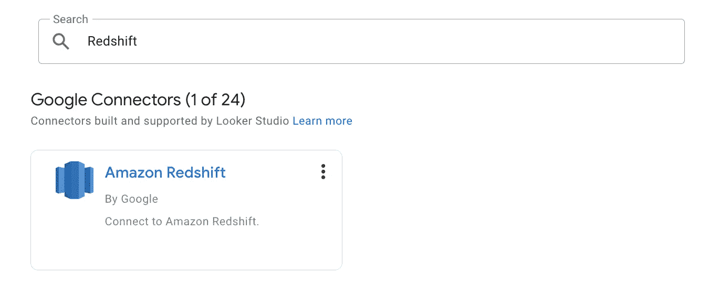
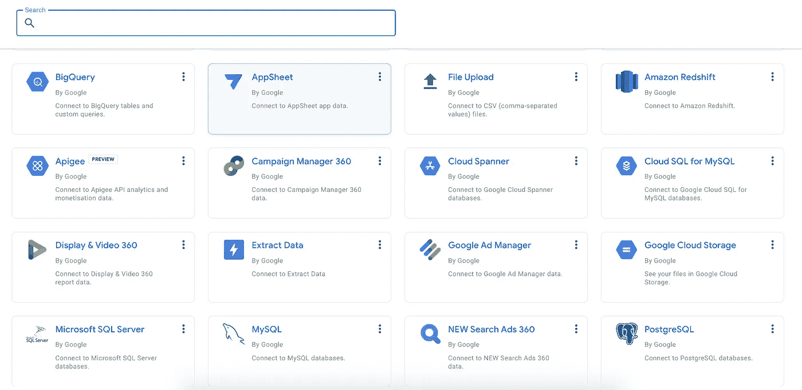

# 现代数据仓库

> 原文：[`towardsdatascience.com/modern-data-warehousing-2b1b0486ce4a`](https://towardsdatascience.com/modern-data-warehousing-2b1b0486ce4a)

## 先进的数据平台设计

[](https://mshakhomirov.medium.com/?source=post_page-----2b1b0486ce4a--------------------------------)[](https://towardsdatascience.com/?source=post_page-----2b1b0486ce4a--------------------------------) [💡Mike Shakhomirov](https://mshakhomirov.medium.com/?source=post_page-----2b1b0486ce4a--------------------------------)

·发布于 [Towards Data Science](https://towardsdatascience.com/?source=post_page-----2b1b0486ce4a--------------------------------) ·12 分钟阅读·2023 年 12 月 16 日

--


图片由 [Nubelson Fernandes](https://unsplash.com/@nublson?utm_source=medium&utm_medium=referral) 提供，来源于 [Unsplash](https://unsplash.com/?utm_source=medium&utm_medium=referral)

在这个故事中，我将尝试阐明现代数据仓库解决方案（DWH）相对于其他数据平台架构类型的好处。我敢说，目前 DWH 是数据工程师中最受欢迎的平台。与其他解决方案类型相比，它提供了宝贵的好处，但也有一些众所周知的局限性。想学习数据工程吗？这个故事是一个很好的起点，因为它解释了数据工程的核心——架构图中心的 DWH 解决方案。我们将看看市场上不同 DWH 的数据如何被摄取和转换。

我也希望能与经验丰富的用户展开讨论。了解你的意见并听听你对此话题的看法将非常棒。

## 数据仓库的关键特性

无服务器的分布式 SQL 引擎（BigQuery、Snowflake、Redshift、Microsoft Azure Synapse、Teradata）就是我们所称的现代数据仓库（DWH）。这是一种以 SQL 为主的数据架构 [1]，数据存储在数据仓库中，我们可以利用非规范化星型模式 [2] 数据集的所有优点，因为大多数现代数据仓库都是分布式的，扩展性良好，这意味着无需担心表的键和索引。它非常适合对大数据进行即席分析查询。

[](/data-platform-architecture-types-f255ac6e0b7?source=post_page-----2b1b0486ce4a--------------------------------) ## 数据平台架构类型

### 它在多大程度上满足了你的业务需求？选择的困境。

towardsdatascience.com

大多数现代数据仓库解决方案可以处理结构化和非结构化数据，并且对拥有良好 SQL 技能的数据分析师非常方便。



DWH 数据生命周期。图像由作者提供。

现代数据仓库可以轻松与商业智能解决方案集成，如 Looker、Tableau、Sisense 和 Mode，它们使用 ANSI-SQL 处理数据。在下面的图示中，我试图映射一个常见的数据转换过程及使用的工具（当然这不是完整的列表）。我们可以看到 DWH 在中间。



典型的数据旅程及使用的工具。图像由作者提供。

> 数据仓库*并不设计*用于存储非结构化数据，如图像、视频或文档。

为此，我们会希望使用数据湖。

## 数据仓库与数据库：有什么区别？

数据仓库具有列式数据结构，与许多 RDS 相同，它是关系型的。数据被组织成表格、行和列。然而，在 RDS 中，数据是按行组织和存储的，而数据仓库中的数据则是按列存储的。后者更好地支持在线分析处理（OLAP），而 RDS 只能提供在线事务处理（OLTP）。RDS 确实更加面向事务。一些现代的数据仓库解决方案可以同时提供这两种数据处理方法。例如，AWS Redshift 支持数据仓库和数据湖方法，使其能够访问和分析大量数据。

关系型数据库（**RDS**）将数据存储在一个基于行的表格中，列连接相关的数据元素。它的设计和优化是为了快速提取当前数据。流行的关系型数据库有***PostgreSQL、MySQL、Microsoft SQL Server 和 Oracle。*** RDBMS 是一个关系型数据库管理系统，帮助管理数据库。

**NoSQL** 数据库支持**仅简单事务**，而关系型数据库还支持复杂事务及连接操作。NoSQL 数据库用于处理高速到达的数据。流行的 NoSQL 数据库有 MongoDB 和 CouchDB（文档数据库），Redis 和 DynamoDB（键值数据库）。

数据仓库主要用于数据分析，包括大量的历史数据。使用数据仓库需要用户**提前**创建一个预定义的、固定的模式，这有助于数据分析。在处理数据仓库时，表格必须简单（去规范化），以便计算大量数据。由于 RDS 数据库表和连接是规范化的，所以它们比较复杂。因此，传统数据库和数据仓库之间的主要区别在于，传统数据库的设计和优化是为了记录数据，而数据仓库的设计和优化则是为了响应分析需求。

RDS 存储应用程序所需的当前数据。在运行应用程序时，当需要快速获取一些当前数据时，它非常有用。

## 数据仓库与数据湖

数据湖是存储大量非结构化数据（如图像、视频和文档）以及结构化数据（如 JSON、CSV、PARQUET 和 AVRO [3]）的理想存储解决方案。

## 大数据文件格式解析

### Parquet vs ORC vs AVRO vs JSON。选择哪个以及如何使用它们？

[towardsdatascience.com

然而，从数据湖中提取洞察**通常需要编码技能**，因为数据湖没有像数据仓库那样内置的分析或查询能力。用户需要利用编程语言如 Python、JAVA、Scala 或 PySpark 来访问、处理和分析存储在数据湖中的数据。

> 当数据湖用户拥有良好的编码技能时，会出现惊人的好处

在这种情况下，数据湖架构可以提供数据处理的最高灵活性。用户只需了解如何编码即可应用相关的数据转换。

> 然而，通常情况下，SQL 优先的解决方案变得更有用。

## 数据仓库的主要优点

作为用于 SQL 查询和报告的集中数据仓库，数据仓库具有许多类似于传统关系数据库解决方案的特征。数据仓库的一些主要优点包括更好的可扩展性（相比于 RDS）、更好的数据治理（相比于数据湖和数据网格架构）、增强的商业智能和改善的数据质量 [4]

## 自动化邮件和数据质量检查

### 数据仓库指南，帮助通过定期邮件获得更好、更清洁的数据

[towardsdatascience.com

**更好的数据治理：**市场上的许多数据仓库解决方案提供了列级访问控制和行级访问控制。这意味着我们可以为用户定义细粒度的控制。例如，在 BigQuery 中，我们可以限制访问或遮蔽任何对业务或个人敏感的列 [5]：



使用策略标签的数据遮蔽。图片由作者提供。

我们可以使用基础设施即代码（IaC）来定义这些策略，这类似于我们在部署基础设施资源时所做的 [6]。在下面的示例中，我们可以使用与平台无关的 Terraform 来定义数据集访问权限：

```py
resource "google_bigquery_dataset_access" "access" {
  dataset_id    = google_bigquery_dataset.dataset.dataset_id
  role          = "OWNER"
  user_by_email = google_service_account.bqowner.email
}

resource "google_bigquery_dataset" "dataset" {
  dataset_id = "my_dataset"
}

resource "google_service_account" "bqowner" {
  account_id = "bqowner"
} 
```

**更好的协作：** 现代数据仓库解决方案提供协作功能。有效的决策通常需要组织内部多个人员（如数据分析师、市场营销团队、管理层等）的输入，以及多个数据来源。确实，**将敏捷方法应用于任何** **数据转换开发** 是至关重要的。我称之为最佳实践。

> 协作是关键

数据仓库解决方案设计使得通过将大型数据项目拆分成更小的部分来交付这些项目变得更容易。从我所看到的，组织倾向于摆脱数据项目设计和交付中繁琐的瀑布式方法。现在我们拥有现代数据仓库解决方案提供的单一数据集成层，这有助于更快地部署增量模型更新，并更频繁地提供业务洞察。

**可扩展性**：数据仓库被设计为能够很好地扩展，以处理大量数据。在必要时扩展数据管道以满足不断增长的业务需求至关重要。它还必须能够在单一系统中以规模化方式运行并发工作负载。例如，一个非常常见的数据仓库痛点是用户查询的并发性。当数据仓库解决方案只允许一定数量的并发用户查询（通常不超过 50）时，就会出现这种情况。许多现代数据仓库可以提供带有分布式物理节点的虚拟集群来解决这个问题[11]。

> 确实，在许多场景中，具有自动扩展的分布式计算集群帮助很大。

例如，考虑以下 Snowflake 的 SQL 多集群设置：



使用 Snowflake 的多集群数据仓库。图像由作者提供。

**改进的数据加载：** 数据仓库解决方案各不相同。对于其中一些，数据摄取是一个微不足道的任务（如 Snowflake），而其他的则在处理分区时提供了更大的灵活性（如 BigQuery）。考虑下面的 Snowflake 数据仓库中的数据加载示例。我们假设所有数据文件都存储在 AWS S3 存储桶中，如下所示：

```py
[{

      "id": 1,
      "price": "75836"
},
{
     "id": 2,
      "price": "92567"
}
{
     "id": 3,
      "price": "89921"
}]
```

现在我们可以使用 SQL 来加载它！

```py
/* Create a JSON file format that strips the outer array. */

CREATE OR REPLACE FILE FORMAT json_format
  TYPE = 'JSON'
  STRIP_OUTER_ARRAY = TRUE;

/* Create a target table for the JSON data. */

CREATE OR REPLACE TABLE sales (src VARIANT);

/* Copy the JSON data into the target table. */

COPY INTO sales
  FROM s3://mybucket/data/files
  CREDENTIALS=(AWS_KEY_ID='$AWS_ACCESS_KEY_ID' AWS_SECRET_KEY='$AWS_SECRET_ACCESS_KEY')
  ENCRYPTION=(MASTER_KEY = 'eSx...')
  FILE_FORMAT = (FORMAT_NAME = my_csv_format);

SELECT * FROM sales;
```

> 这就是为什么 Snowflake 在数据分析师和无代码用户中如此受欢迎的原因。

我们可以看到，数据仓库的数据摄取例程处理了所有内容，包括通过去除外部数组来处理数据格式，即 [{},{},{}] -> {},{},{}。

例如，在 BigQuery 中，我们可能会想创建一个数据加载应用程序来做同样的事情。考虑下面的 Python 代码[14]：

```py
import io
import json

def etl(item):
    return json.dumps(item)

# Text file loaded as a blob
blob = """
        [
{"id":"1","first_name":"John"},
{"id":"2","first_name":"Mary"}
]
"""
json_data = json.loads(blob)
data_str = u"\n".join(etl(item) for item in json_data)

print(data_str)
data_file = io.BytesIO(data_str.encode())

# This data file is ready for BigQuery as Newline delimited JSON
print(data_file)
```

[](/python-for-data-engineers-f3d5db59b6dd?source=post_page-----2b1b0486ce4a--------------------------------) ## Python for Data Engineers

### 面向初学者的高级 ETL 技术

towardsdatascience.com

在用户的编程技能方面，BigQuery 看起来稍显要求较高。

> 可以合理地认为，了解底层工作原理往往在长期内更具成本效益。

确实，BigQuery 提供了更精细的分区控制，这可能在处理 DWH 中的数据时带来更大的节省。考虑这个数据加载的例子，我们可以定义分区（DAY、MONTH、RANGE）：

```py
"""
This function will check if a table exists, otherwise create it.
Will also check if tableSchema contains partition_field and
if exists will use it to create a table.
"""
def _check_if_table_exists(tableData):
    # get table_id reference
    tableName = tableData.get('name')
    tableSchema = tableData.get('schema')
    tableDataset = tableData.get('dataset_id')

    # Check if dataset exists, if not then create
    _check_if_dataset_exists(tableDataset)

    table_id = client.dataset(tableDataset).table(tableName)
    # check if table exists, otherwise create
    try:
        client.get_table(table_id)
    except Exception:
        logging.warn('Creating table: %s' % (tableName))
        schema = create_schema_from_yaml(tableSchema)
        table = bigquery.Table(table_id, schema=schema)
        # Check if partition_field exists in schema definition and if so use it to create the table:
        if (tableData.get('partition_field')):
            table.time_partitioning = bigquery.TimePartitioning(
                type_=bigquery.TimePartitioningType.DAY,
                field=tableData.get('partition_field'), #"date",  # name of column to use for partitioning

            )  # 90 days
        else:
            table.time_partitioning = bigquery.TimePartitioning(
                type_=bigquery.TimePartitioningType.DAY,
            )
        table = client.create_table(table)
        print("Created table {}.{}.{}".format(table.project, table.dataset_id, table.table_id))

# Creates schema definition in BigQuery format using schemas.yaml
# - name: test_table_json
#   alt_name: test_table_json
#   load_method: _load_table_from_json
#   dataset_id: source
#   size: small
#   format: SRC
#   schema:
#     - name: "src"
#       type: "STRING"
#       mode: "NULLABLE"
#   disabled: False
def create_schema_from_yaml(table_schema):
    schema = []
    for column in table_schema:

        schemaField = bigquery.SchemaField(column['name'], column['type'], column['mode'])

        schema.append(schemaField)

        if column['type'] == 'RECORD':
            schemaField._fields = create_schema_from_yaml(column['fields'])
    return schema
```

> 当我们有一个带有日期/月份维度的数据模型时，这变得非常有用，并且通常能节省很多钱。

这这是一个大规模数据加载的例子。**另外**，我们可以创建一个数据管道，使数据持续被摄取。这被称为数据流 [12]。

[](/streaming-in-data-engineering-2bb2b9b3b603?source=post_page-----2b1b0486ce4a--------------------------------) ## 数据工程中的流式处理

### 流式数据管道和实时分析

towardsdatascience.com

Snowflake 有一个方便的 Kafka 连接器 [13]，简化了流式数据管道，并连接到 Kafka 服务器，以从主题中持续拉取数据。

**改进的商业智能**：许多公司从各种来源（例如天气、收入、支付、客户信息、趋势、供应商信息等）收集大量数据。数据量庞大可能是无用的。将这些数据存储在多个平台上也可能很昂贵。因此，DWH 作为单一真实来源似乎是 BI 管道的问题解决者，每个人都可以轻松生成数据洞察。请参阅下面的 Google Looker Studio 集成。它适用于现代 DWH 解决方案，而且这些解决方案基本上都是市场领导者。



Snowflake 数据连接器。图像由作者提供。



AWS Redshift 连接器用于 Looker Studio。图像由作者提供。

依此类推……一个免费的社区商业智能（BI）工具连接了市场上所有主要的数据仓库解决方案，即 Redshift、Snowflake、BigQuery、Databricks [7]、Galaxy [8] 等。



Looker Studio 数据连接器。图像由作者提供。

数据仓库为商业智能工具和应用程序提供了一个平台，以访问和分析数据。这使得企业可以根据数据驱动的见解做出明智的决策。

**更好的产品集成和 DevOps 生命周期**：一些产品在数据管道的设计和部署方面更进一步。对于 BI 开发者和数据工程师来说，将所有内容保存在 Git 中非常重要。启用这一功能对持续集成至关重要 [9]。我之前写过关于如何使用 IaC 工具如 AWS CloudFormation 和 Terraform 部署数据管道资源的文章：

[](/continuous-integration-and-deployment-for-data-platforms-817bf1b6bed1?source=post_page-----2b1b0486ce4a--------------------------------) ## 数据平台的持续集成和部署

### 数据工程师和 ML Ops 的 CI/CD

towardsdatascience.com

> 想象一下我们可以使用 CI/CD 工具部署报告。是的，没错。不仅仅是数据管道资源，还有 BI 仪表板。

请参阅下面的 AWS CloudFormation 模板。它部署 AWS Quicksight 数据集和报告分析：

```py
AWSTemplateFormatVersion: 2010-09-09
Description: 'Automated deployment of QuickSight Assets.'

...

Resources:
...

 QSCFBuildQSDataSource:
    Type: Custom::QSCFBuildQSDataSource
    Properties:
      ServiceToken: !GetAtt QSCFBuildQuickSightResourcesLambdaCreator.Arn
      Name: !Join
        - ''
        - - QSCFBuildQSDataSource
          - !Ref Suffix
      CommandFile: QSCF-DataSource
      ResourceType: DataSource
      ResourceId: QSCF-DataSource

  QSCFBuildQSTheme:
    Type: Custom::QSCFBuildQSTheme
    Properties:
      ServiceToken: !GetAtt QSCFBuildQuickSightResourcesLambdaCreator.Arn
      Name: !Join
        - ''
        - - QSCFBuildQSTheme
          - !Ref Suffix
      CommandFile: QSCF-Theme
      ResourceType: Theme
      ResourceId: QSCF-Theme

  QSCFBuildQSDataSet:
    Type: Custom::QSCFBuildQSDataSet
    DependsOn: QSCFBuildQSDataSource
    Properties:
      ServiceToken: !GetAtt QSCFBuildQuickSightResourcesLambdaCreator.Arn
      Name: !Join
        - ''
        - - QSCFBuildQSDataSet
          - !Ref Suffix
      CommandFile: QSCF-DataSet
      ResourceType: DataSet
      ResourceId: QSCF-DataSet

  QSCFBuildQSDashboard:
    Type: Custom::QSCFBuildQSDashboard
    DependsOn:
      - QSCFBuildQSDataSet
      - QSCFBuildQSTheme
    Properties:
      ServiceToken: !GetAtt QSCFBuildQuickSightResourcesLambdaCreator.Arn
      Name: !Join
        - ''
        - - QSCFBuildQSDashboard
          - !Ref Suffix
      CommandFile: QSCF-Dashboard
      ResourceType: Dashboard
      ResourceId: QSCF-Dashboard

  QSCFBuildQSTemplate:
    Type: Custom::QSCFBuildQSTemplate
    Properties:
      ServiceToken: !GetAtt QSCFBuildQuickSightResourcesLambdaCreator.Arn
      Name: !Join
        - ''
        - - QSCFBuildQSTemplate
          - !Ref Suffix
      CommandFile: QSCF-Template
      ResourceType: Template
      ResourceId: QSCF-Template

  QSCFBuildQSAnalysis:
    Type: Custom::QSCFBuildQSAnalysis
    DependsOn:
      - QSCFBuildQSDataSet
      - QSCFBuildQSTheme
      - QSCFBuildQSTemplate
    Properties:
      ServiceToken: !GetAtt QSCFBuildQuickSightResourcesLambdaCreator.Arn
      Name: !Join
        - ''
        - - QSCFBuildQSAnalysis
          - !Ref Suffix
      CommandFile: QSCF-Analysis
      ResourceType: Analysis
      ResourceId: QSCF-Analysis
```

我之前写了一篇教程[10]，讲述了如何使用 AWS CloudFormation 部署流数据管道。在我看来，将 BI 功能添加到其中会使其更好。

[](/building-a-streaming-data-pipeline-with-redshift-serverless-and-kinesis-04e09d7e85b2?source=post_page-----2b1b0486ce4a--------------------------------) ## 使用 Redshift Serverless 和 Kinesis 构建流数据管道

### 初学者的端到端教程

towardsdatascience.com

## 结论

总的来说，数据仓库是最受欢迎的数据平台之一，可以帮助公司（特别是在企业级别）通过提供单一的真实数据源来获得竞争优势，从而进行数据驱动的决策。现代数据仓库解决方案有助于更快地提供数据洞察。在快速变化的商业环境中，公司可以通过自动化技术激活这些解决方案，为业务利益相关者创造更大的价值。每种解决方案都提供了使其独特的功能。然而，几乎每种情况下都需要考虑一些因素。成本效益、数据分区、查询用户并发、数据湖存储及相关成本——这些痛点都是有效的。有时，将历史数据卸载到云存储档案中以优化成本可能是有用的[15]。在某些情况下，使用 Apache Iceberg 表可能有助于解决用户查询并发问题[16]。

[](/introduction-to-apache-iceberg-tables-a791f1758009?source=post_page-----2b1b0486ce4a--------------------------------) ## Apache Iceberg 表介绍

### 选择 Apache Iceberg 作为数据湖的几个令人信服的理由

towardsdatascience.com

在设计和构建完美的数据平台时，有几个事项需要考虑。一些用户可能认为最佳的数据仓库是湖仓（Databricks），但最终这取决于数据的存储方式以及你对历史记录的业务需求。在许多情况下，作为所有利益相关者的单一真实数据源的数据仓库解决方案可能成为最佳选择。结合合适的数据建模工具，你将获得适用于外部数据到 BI 数据管道的正确工具。

我希望你觉得这些想法有用。它们基于我个人的经验和观察。

## 推荐阅读

[1] [`medium.com/towards-data-science/data-platform-architecture-types-f255ac6e0b7`](https://medium.com/towards-data-science/data-platform-architecture-types-f255ac6e0b7)

[2] `towardsdatascience.com/data-modelling-for-data-engineers-93d058efa302`

[3] [`medium.com/towards-data-science/big-data-file-formats-explained-275876dc1fc9`](https://medium.com/towards-data-science/big-data-file-formats-explained-275876dc1fc9)

[4] `towardsdatascience.com/automated-emails-and-data-quality-checks-for-your-data-1de86ed47cf0`

[5] [`cloud.google.com/bigquery/docs/column-level-security-intro`](https://cloud.google.com/bigquery/docs/column-level-security-intro)

[6] [`registry.terraform.io/providers/hashicorp/google/latest/docs/resources/bigquery_dataset_access`](https://registry.terraform.io/providers/hashicorp/google/latest/docs/resources/bigquery_dataset_access)

[7] [`docs.databricks.com/en/partners/bi/looker.html`](https://docs.databricks.com/en/partners/bi/looker.html)

[8] [`docs.starburst.io/clients/looker.html`](https://docs.starburst.io/clients/looker.html)

[9] `towardsdatascience.com/continuous-integration-and-deployment-for-data-platforms-817bf1b6bed1`

[10] [`medium.com/towards-data-science/building-a-streaming-data-pipeline-with-redshift-serverless-and-kinesis-04e09d7e85b2`](https://medium.com/towards-data-science/building-a-streaming-data-pipeline-with-redshift-serverless-and-kinesis-04e09d7e85b2)

[11] [`www.snowflake.com/blog/auto-scale-snowflake-major-leap-forward-massively-concurrent-enterprise-applications/`](https://www.snowflake.com/blog/auto-scale-snowflake-major-leap-forward-massively-concurrent-enterprise-applications/)

[12] [`medium.com/towards-data-science/streaming-in-data-engineering-2bb2b9b3b603`](https://medium.com/towards-data-science/streaming-in-data-engineering-2bb2b9b3b603)

[13] [`docs.snowflake.com/en/user-guide/kafka-connector`](https://docs.snowflake.com/en/user-guide/kafka-connector)

[14] `towardsdatascience.com/python-for-data-engineers-f3d5db59b6dd`

[15] [`medium.com/towards-artificial-intelligence/supercharge-your-data-engineering-skills-with-this-machine-learning-pipeline-b69d159780b7`](https://medium.com/towards-artificial-intelligence/supercharge-your-data-engineering-skills-with-this-machine-learning-pipeline-b69d159780b7)

[16] [`medium.com/towards-data-science/introduction-to-apache-iceberg-tables-a791f1758009`](https://medium.com/towards-data-science/introduction-to-apache-iceberg-tables-a791f1758009)
