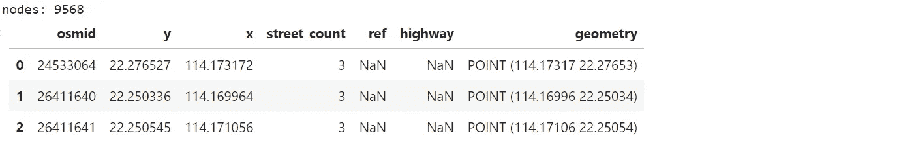
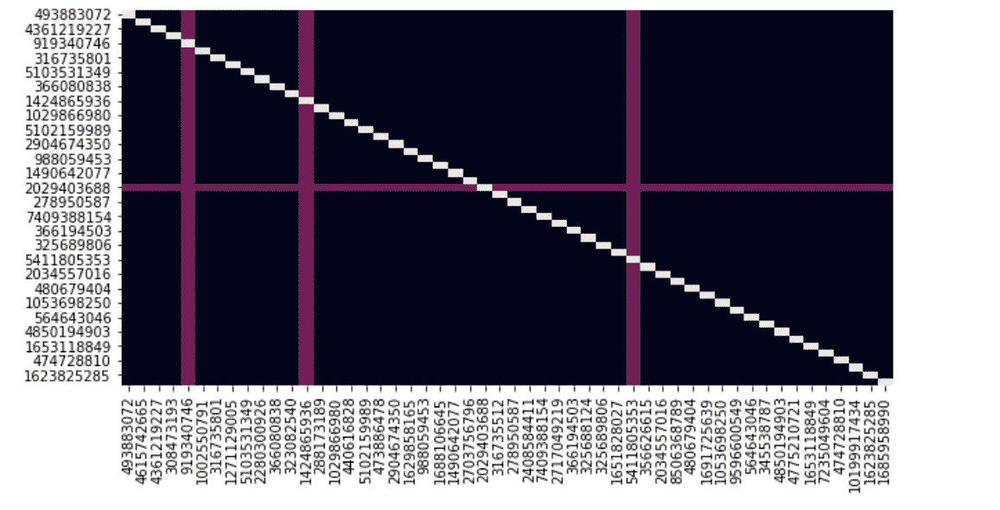

# 使用 Python 进行现代路线优化

> 原文：[`towardsdatascience.com/modern-route-optimization-with-python-fea87d34288b`](https://towardsdatascience.com/modern-route-optimization-with-python-fea87d34288b)


图片由作者提供

## 最短路径，旅行推销员问题，车辆路线问题，绘制地图和动画

[](https://maurodp.medium.com/?source=post_page-----fea87d34288b--------------------------------)[](https://towardsdatascience.com/?source=post_page-----fea87d34288b--------------------------------) [Mauro Di Pietro](https://maurodp.medium.com/?source=post_page-----fea87d34288b--------------------------------)

·发布于[Towards Data Science](https://towardsdatascience.com/?source=post_page-----fea87d34288b--------------------------------) ·13 分钟阅读·2023 年 6 月 7 日

--

在本文中，我将使用 Python 解决以下问题：在一辆或多辆车辆的情况下，如何找到送货给一组客户的最佳路线？


图片由[Robert Anasch](https://unsplash.com/@diesektion?utm_source=medium&utm_medium=referral)提供，来源于[Unsplash](https://unsplash.com/?utm_source=medium&utm_medium=referral)

## 摘要

**路线优化**是确定最具成本效益路线的过程。这不仅仅是找到两点之间的最短路径，因为它还包括所有相关因素（即利润、地点数量、时间窗口）。

这个话题在 1930 年代首次以数学形式提出，用于解决校车路线问题。它被称为[**旅行推销员问题**](https://en.wikipedia.org/wiki/Travelling_salesman_problem)，其核心是找到一种最短路径，使得司机可以访问所有地点，前提是已知各地点之间的距离。

旅行推销员问题可以被概括为[**车辆路线问题**](https://en.wikipedia.org/wiki/Vehicle_routing_problem)**：**在最小化由运营成本和用户偏好组成的目标函数的同时，为车辆规划路线。这是物流运输中的主要问题。例如，如果在晚上最短路径上交通繁忙（或过高的收费），那么这可能不是晚餐送货的最佳路线。


图片由作者提供

我将展示一些有用的 Python 代码，这些代码可以轻松应用于其他类似情况（只需复制、粘贴、运行），并逐行讲解每一行代码，以便你能够复制这个例子（完整代码链接如下）。

[## DataScience_ArtificialIntelligence_Utils/example_route_optimization.ipynb at master ·…](https://github.com/mdipietro09/DataScience_ArtificialIntelligence_Utils/blob/master/machine_learning/example_route_optimization.ipynb?source=post_page-----fea87d34288b--------------------------------)

### 你现在不能执行这个操作。你在另一个标签页或窗口中登录了。你在另一个标签页或…

[github.com](https://github.com/mdipietro09/DataScience_ArtificialIntelligence_Utils/blob/master/machine_learning/example_route_optimization.ipynb?source=post_page-----fea87d34288b--------------------------------)

我将使用“**星巴克门店数据集**”，它提供了所有门店的位置（链接如下）。我将选择一个特定的地理区域，并使用提供的经纬度来创建路线。

[## Starbucks Locations Worldwide](https://www.kaggle.com/starbucks/store-locations?source=post_page-----fea87d34288b--------------------------------)

### 每个在营运中的星巴克门店的名称、所有权类型和位置

[www.kaggle.com](https://www.kaggle.com/starbucks/store-locations?source=post_page-----fea87d34288b--------------------------------)

具体来说，我将介绍：

+   设置：导入包，读取地理数据，通过[*Folium*](https://python-visualization.github.io/folium/)进行可视化。

+   使用[*OSMnx*](https://osmnx.readthedocs.io/en/stable/)创建网络图，使用[*NetworkX*](https://networkx.org/)计算最短路径，并使用[*Plotly*](https://plotly.com/)动画生成模拟。

+   预处理：计算距离矩阵。

+   旅行推销员问题（简单路线优化）使用[*OR-Tools*](https://developers.google.com/optimization/install/python)。

+   车辆路径问题（高级路线优化）使用[*OR-Tools*](https://developers.google.com/optimization/install/python)。

## 设置

首先，我需要导入以下库：

```py
## for data
import pandas as pd  #1.1.5
import numpy as np  #1.21.0

## for plotting
import matplotlib.pyplot as plt  #3.3.2
import seaborn as sns  #0.11.1
import folium  #0.14.0
from folium import plugins
import plotly.express as px  #5.1.0

## for simple routing
import osmnx as ox  #1.2.2
import networkx as nx  #3.0

## for advanced routing 
from ortools.constraint_solver import pywrapcp  #9.6
from ortools.constraint_solver import routing_enums_pb2
```

然后，我将读取数据集（请注意，对于地理空间数据，纬度= Y 轴，经度= X 轴）：

```py
city = "Hong Kong"

dtf = pd.read_csv('data_stores.csv')
dtf = dtf[dtf["City"]==city][
        ["City","Street Address","Latitude","Longitude"]
      ].reset_index(drop=True)
dtf = dtf.reset_index().rename(
      columns={"index":"id", "Latitude":"y", "Longitude":"x"})

print("tot:", len(dtf))
dtf.head(3)
```


图片来源于作者

在这些位置中，我将选择一个作为“仓库”（基地），并计算服务所有其他位置的最佳方式。

```py
# pinpoint your starting location
i = 0
dtf["base"] = dtf["id"].apply(lambda x: 1 if x==i else 0)
start = dtf[dtf["base"]==1][["y","x"]].values[0]

print("start =", start)
dtf.head(3)
```


图片来源于作者

让我们将起始位置与其他数据点一起绘制：

```py
plt.scatter(y=dtf["y"], x=dtf["x"], color="black")
plt.scatter(y=start[0], x=start[1], color="red")
plt.show()
```


图片来源于作者

为了使其更具现实感，我将把数据点显示为地图上的位置。你可以使用***Folium****，这是一个强大的库，通过 HTML 创建不同类型的互动地图。

```py
# setup
data = dtf.copy()
color = "base"  #color based on this column
lst_colors = ["black","red"]
popup = "id" #popup based on this column

# base map
map_ = folium.Map(location=start, tiles="cartodbpositron", zoom_start=11)

# add colors
lst_elements = sorted(list(data[color].unique()))
data["color"] = data[color].apply(lambda x: 
                  lst_colors[lst_elements.index(x)])

# add popup
data.apply(lambda row: 
    folium.CircleMarker(
            location=[row["y"],row["x"]], popup=row[popup],
            color=row["color"], fill=True, radius=5).add_to(map_), 
    axis=1)

# add full-screen button
plugins.Fullscreen(position="topright", title="Expand", 
      title_cancel="Exit", force_separate_button=True).add_to(map_)

# show
map_
```


图片来源于作者

基本上，我们需要找到最方便的方式，让红点（仓库）服务所有其他位置（客户）。

```py
# add lines
for i in range(len(dtf)):
    points = [start, dtf[["y","x"]].iloc[i].tolist()]
    folium.PolyLine(points, tooltip="Coast", color="red", 
                    weight=0.5, opacity=0.5).add_to(map_)

map_
```


图片来源于作者

一个快速提示，如果你想要更改地图样式的选项，请添加以下代码：

```py
layers = ["cartodbpositron", "openstreetmap", "Stamen Terrain", 
          "Stamen Water Color", "Stamen Toner", "cartodbdark_matter"]
for tile in layers:
    folium.TileLayer(tile).add_to(map_)
folium.LayerControl(position='bottomright').add_to(map_)
map_
```


作者提供的图片

## 最短路径

对于这种用例，最常见的方法是将**道路网络视为图**，并找到节点之间的最短路径。

我们已经有了所有节点（数据集中的位置点），但我们缺少链接（连接点的街道）。因此，我们需要使用***OSMnx***获取街道地图数据，它是一个超级有用的库，查询[Open Street Map](https://www.openstreetmap.org/)并将响应转换为***NetworkX***图，这是标准的 Python 图形库。

```py
# create network graph
G = ox.graph_from_point(start, dist=10000, 
        network_type="drive")  #'drive', 'bike', 'walk'
G = ox.add_edge_speeds(G)
G = ox.add_edge_travel_times(G)

# plot
fig, ax = ox.plot_graph(G, bgcolor="black", node_size=5, 
        node_color="white", figsize=(16,8))
```


作者提供的图片

图形对象包含从地图提取的节点和链接。所有那些小点都是节点。如果你想只查看链接，可以设置*node_size=0*：


作者提供的图片

节点的形式是这样的…


作者提供的图片

…你可以将它们放入像这样的“地理数据框”中…

```py
# geo-dataframe (nodes)
print("nodes:", len(G.nodes()))
ox.graph_to_gdfs(G, nodes=True, edges=False).reset_index().head(3)
```



作者提供的图片

…链接也是如此。

```py
# geo-dataframe (links)
print("links:", len(G.edges()))
ox.graph_to_gdfs(G, nodes=False, edges=True).reset_index().head(3)
```


作者提供的图片

现在我们有了图形，让我们了解如何在节点之间**在网络中移动**。我们已经有一个起始点，所以让我们选择一个随机的目的地……例如最近的节点：


作者提供的图片

```py
end = dtf[dtf["id"]==68][["y","x"]].values[0]
print("locations: from", start, "--> to", end)
```


我们有 2 个位置，但为了使用图形，我们必须获得等效的节点。

```py
start_node = ox.distance.nearest_nodes(G, start[1], start[0])
end_node = ox.distance.nearest_nodes(G, end[1], end[0])
print("nodes: from", start_node, "--> to", end_node)
```


因此，我们可以通过[*Dijkstra*算法](https://en.wikipedia.org/wiki/Dijkstra%27s_algorithm)找到两个节点之间的**最短路径**。基本上，它通过逐步从一个“邻里”找到另一个的最短路径来计算整体路线。


作者提供的图片

在 Python 中，我们可以直接使用*NetworkX*应用算法。例如，可以指定优化的属性权重，例如我们可以优先考虑距离或旅行时间*。* 最短加权路径是使权重最小化的路径。

```py
# calculate shortest path
path_lenght = nx.shortest_path(G, source=start_node, target=end_node, 
                                method='dijkstra', weight='lenght')     
print(path_lenght)

# plot on the graph
fig, ax = ox.plot_graph_route(G, path_lenght, route_color="red", 
                              route_linewidth=5, node_size=1, 
                              bgcolor='black', node_color="white", 
                              figsize=(16,8))
```


作者提供的图片

如果我们改为优化时间：

```py
# calculate shortest path
path_time = nx.shortest_path(G, source=start_node, target=end_node, 
                              method='dijkstra', weight='travel_time')   
print(path_time)

# plot on the graph
fig, ax = ox.plot_graph_route(G, path_time, route_color="blue", 
                              route_linewidth=5, node_size=1, 
                              bgcolor='black', node_color="white", 
                              figsize=(16,8))
```


作者提供的图片

我们可以在图上比较路径…

```py
# plot on the graph
fig, ax = ox.plot_graph_routes(G, routes=[path_lenght, path_time], 
                              route_colors=["red","blue"], 
                              route_linewidth=5, node_size=1, 
                              bgcolor='black', node_color="white", 
                              figsize=(16,8))
```


作者提供的图片

…或者更好地使用组合*OSMnx* — *Folium*在地图上：

```py
# plot on the map
ox.plot_route_folium(G, route=path_lenght, route_map=map_, 
                     color="red", weight=1)
ox.plot_route_folium(G, route=path_time, route_map=map_, 
                     color="blue", weight=1)
map_
```


作者提供的图片

最后，我们可以选择一条路径并**模拟驾驶员**从一个节点到另一个节点。我们将使用*Plotly*，这是一个著名的互动图表库，以及[*Mapbox*](https://docs.mapbox.com/help/getting-started/access-tokens/)*，一个为知名网站（如 Lonely Planet 和 Financial Times）提供定制在线地图的供应商。首先，我们必须准备包含路线信息的数据框，然后创建一个*Plotly*动画。

```py
lst_start, lst_end = [],[]
start_x, start_y = [],[]
end_x, end_y = [],[]
lst_length, lst_time = [],[]

for a,b in zip(route_time[:-1], route_time[1:]):
    lst_start.append(a)
    lst_end.append(b)
    lst_length.append(round(G.edges[(a,b,0)]['length']))
    lst_time.append(round(G.edges[(a,b,0)]['travel_time']))
    start_x.append(G.nodes[a]['x'])
    start_y.append(G.nodes[a]['y'])
    end_x.append(G.nodes[b]['x'])
    end_y.append(G.nodes[b]['y'])

df = pd.DataFrame(list(zip(lst_start, lst_end, 
                           start_x, start_y, end_x, end_y, 
                           lst_length, lst_time)), 
                   columns=["start","end","start_x","start_y",
                            "end_x","end_y","length","travel_time"]
                  ).reset_index().rename(columns={"index":"id"})

df.head()
```


作者提供的图片

```py
## create start/end df 
df_start = df[df["start"] == start_node]
df_end = df[df["end"] == end_node]

## create basic map
fig = px.scatter_mapbox(data_frame=df, lon="start_x", lat="start_y", 
                        zoom=15, width=1000, height=800, 
                        animation_frame="id", 
                        mapbox_style="carto-positron")
## add driver
fig.data[0].marker = {"size":12}
## add start point
fig.add_trace(px.scatter_mapbox(data_frame=df_start, 
                                lon="start_x", lat="start_y").data[0])
fig.data[1].marker = {"size":15, "color":"red"}
## add end point
fig.add_trace(px.scatter_mapbox(data_frame=df_end, 
                                lon="start_x", lat="start_y").data[0])
fig.data[2].marker = {"size":15, "color":"green"}
## add route
fig.add_trace(px.line_mapbox(data_frame=df, 
                             lon="start_x", lat="start_y").data[0])
fig
```


作者提供的图片

## 预处理

这只是一个热身，学习如何从一个节点找到另一个节点的路径。我们仍需计算一个访问所有位置的路线。这些问题通常遵循一个固定的公式：生成所有位置之间最短路径成本的距离矩阵，构建初始解，并通过一系列迭代改进它。

```py
## get the node for each location
dtf["node"] = dtf[["y","x"]].apply(lambda x: 
                           ox.distance.nearest_nodes(G, x[1], x[0]), 
                        axis=1)
dtf = dtf.drop_duplicates("node", keep='first')
dtf.head()
```


作者提供的图片

因此，在应用任何模型之前，首要任务是计算我们数据集中所有位置之间的**距离矩阵**。我们可以通过找到我们感兴趣的每个节点之间的最短路径距离来完成这项任务。

```py
## distance length function
def f(a,b):
    try:
        d = nx.shortest_path_length(G, source=a, target=b, 
                                    method='dijkstra', 
                                    weight='travel_time')
    except:
        d = np.nan
    return d

## apply the function
distance_matrix = np.asarray([[f(a,b) for b in dtf["node"].tolist()] 
                               for a in dtf["node"].tolist()])
distance_matrix = pd.DataFrame(distance_matrix, 
                               columns=dtf["node"].values, 
                               index=dtf["node"].values)
distance_matrix.head()
```


作者提供的图片

检查是否有*NaN*、*0* 和 *Inf* 值是至关重要的：

```py
heatmap = distance_matrix.copy()
for col in heatmap.columns:
    heatmap[col] = heatmap[col].apply(lambda x: 
                       0.3 if pd.isnull(x) else  #nan -> purple
                      (0.7 if np.isinf(x) else   #inf -> orange
                      (0 if x!=0 else 1) ))      # 0  -> white  

fig, ax = plt.subplots(figsize=(10,5))
sns.heatmap(heatmap, vmin=0, vmax=1, cbar=False, ax=ax)
plt.show()
```



作者提供的图片

我们在正确的位置（对角线）有*0*，且没有*Inf*，虽然看到了一些*NaNs*……所以我们得处理它们。这一步非常关键，因为距离矩阵会影响任何可以使用的路由模型。通常，我会用行的平均距离来替代缺失值。

```py
# fillna with row average
distance_matrix = distance_matrix.T.fillna(distance_matrix.mean(axis=1)).T

# fillna with overall average
distance_matrix = distance_matrix.fillna(distance_matrix.mean().mean())
```


作者提供的图片

我们现在将开始处理路由优化模型。

## 旅行商问题

如果我们仅考虑单个驾驶员的距离，**最优路线是从一个节点到另一个节点的最短路径集合**，所以基本上它就是最短路线。

```py
## Business parameters
drivers = 1

lst_nodes = dtf["node"].tolist()
print("start:", start_node, "| tot locations to visit:", 
     len(lst_nodes)-1, "| drivers:", drivers)
```


最先进的 Python 库是***OR-Tools***，由 Google 开发，用于解决线性编程和相关的优化问题。这是一个非常强大的工具，因为它使用了许多技术，其中之一是[冲突驱动子句学习](https://en.wikipedia.org/wiki/Conflict-driven_clause_learning)，这与[强化学习](https://en.wikipedia.org/wiki/Reinforcement_learning)算法类似。简单来说，它从寻找满足解的过程中的冲突中学习，并尝试避免重复相同的冲突。

首先，你必须定义*索引管理器*，它跟踪节点索引，以及*路由模型*，这是主要的*OR-Tools*对象。

```py
manager = pywrapcp.RoutingIndexManager(len(lst_nodes), 
                                       drivers, 
                                       lst_nodes.index(start_node))
model = pywrapcp.RoutingModel(manager)
```

然后，我们需要为每一步添加成本函数，目标是将其最小化。在我们的案例中，就是距离……

```py
def get_distance(from_index, to_index):
    return distance_matrix.iloc[from_index,to_index]

distance = model.RegisterTransitCallback(get_distance)
model.SetArcCostEvaluatorOfAllVehicles(distance)
```

… 并指定策略。

```py
parameters = pywrapcp.DefaultRoutingSearchParameters()
parameters.first_solution_strategy = (
          routing_enums_pb2.FirstSolutionStrategy.PATH_CHEAPEST_ARC
)
```

最后，解决问题并打印解决方案：

```py
solution = model.SolveWithParameters(parameters)

index = model.Start(0)
print('Route for driver:')
route_idx, route_distance = [], 0
while not model.IsEnd(index):
    route_idx.append( manager.IndexToNode(index) ) 
    previous_index = index
    index = solution.Value( model.NextVar(index) )
    ### update distance
    try:
        route_distance += get_distance(previous_index, index)
    except:
        route_distance += model.GetArcCostForVehicle(
                              from_index=previous_index, 
                              to_index=index, 
                              vehicle=0)

print(route_idx)
print(f'Total distance: {round(route_distance/1000,2)} km')
print(f'Nodes visited: {len(route_idx)}')
```


让我们将路线从索引序列转换为节点序列：

```py
print("Route for driver (nodes):")
lst_route = [lst_nodes[i] for i in route_idx]
print(lst_route)
```


由于此原因，我们可以在地图上绘制路线：

```py
# Get path between nodes
def get_path_between_nodes(lst_route):
    lst_paths = []
    for i in range(len(lst_route)):
        try:
            a, b = lst_nodes[i], lst_nodes[i+1]
        except:
            break
        try:
            path = nx.shortest_path(G, source=a, target=b, 
                                    method='dijkstra', 
                                    weight='travel_time')
            if len(path) > 1:
                lst_paths.append(path)
        except:
            continue
    return lst_paths

lst_paths = get_path_between_nodes(lst_route)

# Add paths on the map
for path in lst_paths:
    ox.plot_route_folium(G, route=path, route_map=map_, 
                         color="blue", weight=1)
map_
```


图片由作者提供

## 车辆路线问题

不幸的是，现实世界并不简单，因为公司有更多的业务约束。因此，车辆路线问题有许多变体：

+   **有容量限制的车辆路线问题**：车辆对必须交付的货物有有限的承载能力。

+   **带时间窗口的车辆路线问题**：送货地点有时间窗口，必须在这些时间窗口内完成送货。

+   **带取货和送货的车辆路线问题**：货物需要从某些取货地点运送到其他送货地点。

+   **带利润的车辆路线问题**：车辆不必访问所有节点，目标是最大化收集到的利润总和。

对于这个用例，我将引入司机在承载能力和可覆盖距离方面的限制。

```py
## Business parameters
drivers = 3
driver_capacities = [20,20,20]
demands = [0] + [1]*(len(lst_nodes)-1)
max_distance = 1000
```

就像之前一样，我们需要创建管理器、模型，并添加距离函数：

```py
## model
manager = pywrapcp.RoutingIndexManager(len(lst_nodes), 
                                       drivers, 
                                       lst_nodes.index(start_node))
model = pywrapcp.RoutingModel(manager)

## add distance (cost)
def get_distance(from_index, to_index):
    return distance_matrix.iloc[from_index,to_index]

distance = model.RegisterTransitCallback(get_distance)
model.SetArcCostEvaluatorOfAllVehicles(distance)
```

然而，这次我们必须包含新的业务约束：

```py
## add capacity (costraint)
def get_demand(from_index):
    return demands[from_index]

demand = model.RegisterUnaryTransitCallback(get_demand)
model.AddDimensionWithVehicleCapacity(demand, slack_max=0, 
                                     vehicle_capacities=driver_capacities, 
                                     fix_start_cumul_to_zero=True,
                                     name='Capacity')

## add limited distance (costraint)
name = 'Distance'
model.AddDimension(distance, slack_max=0, capacity=max_distance, 
                   fix_start_cumul_to_zero=True, name=name)
distance_dimension = model.GetDimensionOrDie(name)
distance_dimension.SetGlobalSpanCostCoefficient(100)

## set strategy to minimize cost
parameters = pywrapcp.DefaultRoutingSearchParameters()
parameters.first_solution_strategy = (
          routing_enums_pb2.FirstSolutionStrategy.PATH_CHEAPEST_ARC
)
solution = model.SolveWithParameters(parameters)
```

最后，解决问题并打印解决方案：

```py
solution = model.SolveWithParameters(parameters)

dic_routes_idx, total_distance, total_load = {}, 0, 0
for driver in range(drivers):
    print(f'Route for driver {driver}:')
    index = model.Start(driver)
    route_idx, route_distance, route_load = [], 0, 0
    while not model.IsEnd(index):
        node_index = manager.IndexToNode(index)
        route_idx.append( manager.IndexToNode(index) )
        previous_index = index
        index = solution.Value( model.NextVar(index) )
        ### update distance
        try:
            route_distance += get_distance(previous_index, index)
        except:
            route_distance += model.GetArcCostForVehicle(
                                from_index=previous_index, 
                                to_index=index, 
                                vehicle=driver)
        ### update load
        route_load += demands[node_index]

    route_idx.append( manager.IndexToNode(index) )
    print(route_idx)
    dic_routes_idx[driver] = route_idx
    print(f'distance: {round(route_distance/1000,2)} km')
    print(f'load: {round(route_load,2)}', "\n")
    total_distance += route_distance
    total_load += route_load

print(f'Total distance: {round(total_distance/1000,2)} km')
print(f'Total load: {total_load}')
```


```py
# Convert from idx to nodes
dic_route = {}
for k,v in dic_routes_idx.items():
    print(f"Route for driver {k} (nodes):")
    dic_route[k] = [lst_nodes[i] for i in v]
    print(dic_route[k], "\n")
```


让我们在地图上可视化这些路线：

```py
# Get path between nodes
dic_paths = {k:get_path_between_nodes(v) for k,v in dic_route.items()}

# Add paths on the map
lst_colors = ["red","green","blue"]
for k,v in dic_paths.items():
    for path in v:
        ox.plot_route_folium(G, route=path, route_map=map_, 
                             color=lst_colors[k], weight=1)
map_
```


图片由作者提供

最后，为了以风格结束这篇文章，让我们运行模拟以查看我们的司机开始工作。首先，获取适当的数据框……

```py
def df_animation_multiple_path(G, lst_paths, parallel=True):
    df = pd.DataFrame()
    for path in lst_paths:
        lst_start, lst_end = [],[]
        start_x, start_y = [],[]
        end_x, end_y = [],[]
        lst_length, lst_time = [],[]

        for a,b in zip(path[:-1], path[1:]):
            lst_start.append(a)
            lst_end.append(b)
            lst_length.append(round(G.edges[(a,b,0)]['length']))
            lst_time.append(round(G.edges[(a,b,0)]['travel_time']))
            start_x.append(G.nodes[a]['x'])
            start_y.append(G.nodes[a]['y'])
            end_x.append(G.nodes[b]['x'])
            end_y.append(G.nodes[b]['y'])

        tmp = pd.DataFrame(list(zip(lst_start, lst_end, 
                                    start_x, start_y, 
                                    end_x, end_y, 
                                    lst_length, lst_time)), 
                           columns=["start","end","start_x","start_y",
                                    "end_x","end_y","length","travel_time"]
                          )
        df = pd.concat([df,tmp], ignore_index=(not parallel))

    df = df.reset_index().rename(columns={"index":"id"})
    return df
```

……其次，绘制动画。

```py
df = pd.DataFrame()
for driver,lst_paths in dic_paths.items():
    tmp = df_animation_multiple_path(G, lst_paths, parallel=False)
    df = pd.concat([df,tmp], axis=0)

first_node, last_node = lst_paths[0][0], lst_paths[-1][-1]
plot_animation(df, first_node, last_node)
```


图片由作者提供

## 结论

本文是一个教程，展示了**如何使用 Python 进行路线优化**。首先，我们学习如何在地图上可视化地理数据集并构建网络图。然后，我展示了如何处理旅行商问题，通过找到司机的最短路线，以及车辆路线问题，通过找到多个司机的最便宜路线。

此外，现在你知道如何使用地理空间数据生成交互式图表和酷炫动画。

希望你喜欢这篇文章！如有问题或反馈，或只是想分享你的有趣项目，请随时联系我。

> 👉 [让我们联系](https://linktr.ee/maurodp) 👈
> 
> 本文是**使用 Python 进行机器学习**系列的一部分，请参见：

[](/machine-learning-with-python-classification-complete-tutorial-d2c99dc524ec?source=post_page-----fea87d34288b--------------------------------) [## 使用 Python 进行机器学习：分类（完整教程）

### 数据分析与可视化、特征工程与选择、模型设计与测试、评估与解释

[使用 Python 进行机器学习：回归（完整教程）](https://towardsdatascience.com/machine-learning-with-python-classification-complete-tutorial-d2c99dc524ec?source=post_page-----fea87d34288b--------------------------------) [](/machine-learning-with-python-regression-complete-tutorial-47268e546cea?source=post_page-----fea87d34288b--------------------------------) [## 使用 Python 进行机器学习：回归（完整教程）

### 数据分析与可视化、特征工程与选择、模型设计与测试、评估与解释

[使用 Python 进行机器学习：回归（完整教程）](https://towardsdatascience.com/machine-learning-with-python-regression-complete-tutorial-47268e546cea?source=post_page-----fea87d34288b--------------------------------) [](/clustering-geospatial-data-f0584f0b04ec?source=post_page-----fea87d34288b--------------------------------) [## 聚类地理空间数据

### 使用交互式地图绘制机器学习和深度学习聚类

[使用 Python 进行深度学习：神经网络（完整教程）](https://towardsdatascience.com/clustering-geospatial-data-f0584f0b04ec?source=post_page-----fea87d34288b--------------------------------) [](/deep-learning-with-python-neural-networks-complete-tutorial-6b53c0b06af0?source=post_page-----fea87d34288b--------------------------------) [## 使用 Python 进行深度学习：神经网络（完整教程）

### 使用 TensorFlow 构建、绘制并解释人工神经网络

[使用 Python 进行深度学习：神经网络（完整教程）](https://towardsdatascience.com/deep-learning-with-python-neural-networks-complete-tutorial-6b53c0b06af0?source=post_page-----fea87d34288b--------------------------------) [](/modern-recommendation-systems-with-neural-networks-3cc06a6ded2c?source=post_page-----fea87d34288b--------------------------------) [## 现代推荐系统与神经网络

### 使用 Python 和 TensorFlow 构建混合模型

[现代推荐系统与神经网络](https://towardsdatascience.com/modern-recommendation-systems-with-neural-networks-3cc06a6ded2c?source=post_page-----fea87d34288b--------------------------------)
