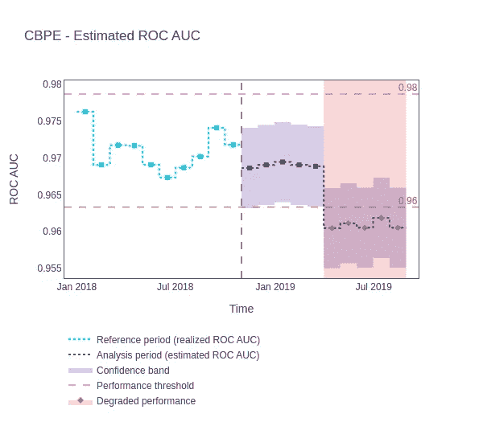

# 监控机器学习模型：数据科学家和机器学习工程师的基础实践

> 原文：[`towardsdatascience.com/monitoring-machine-learning-models-a-tried-and-true-cure-for-a-data-scientists-insomnia-c45b0979a878?source=collection_archive---------10-----------------------#2023-02-06`](https://towardsdatascience.com/monitoring-machine-learning-models-a-tried-and-true-cure-for-a-data-scientists-insomnia-c45b0979a878?source=collection_archive---------10-----------------------#2023-02-06)

## 初学者监控机器学习模型指南

 [Saurav Pawar](https://pawarsaurav842.medium.com/?source=post_page-----c45b0979a878--------------------------------)

·

[关注](https://medium.com/m/signin?actionUrl=https%3A%2F%2Fmedium.com%2F_%2Fsubscribe%2Fuser%2F23bab6a33c37&operation=register&redirect=https%3A%2F%2Ftowardsdatascience.com%2Fmonitoring-machine-learning-models-a-tried-and-true-cure-for-a-data-scientists-insomnia-c45b0979a878&user=Saurav+Pawar&userId=23bab6a33c37&source=post_page-23bab6a33c37----c45b0979a878---------------------post_header-----------) 发表在 [Towards Data Science](https://towardsdatascience.com/?source=post_page-----c45b0979a878--------------------------------) ·15 分钟阅读·2023 年 2 月 6 日

--

图片由 [Nathan Dumlao](https://unsplash.com/@nate_dumlao?utm_source=medium&utm_medium=referral) 提供，来源于 [Unsplash](https://unsplash.com/?utm_source=medium&utm_medium=referral)

机器学习属于人工智能的范畴。它专注于创建和开发能够分析数据、得出结论和进行预测的算法。银行和金融服务行业的组织可以利用机器学习技术获得的各种见解来帮助它们在未来做出决策。例如，一种机器学习模型可以通过利用各种数据源对车贷申请者进行风险评分。这些算法然后可以轻松预测哪些客户有违约风险，从而帮助银行重新考虑或调整每个客户的贷款条款。

# 为什么监控贷款违约者至关重要？

当借款人未按贷款条款进行还款时，称之为“坏账”。这会对银行的盈利能力产生不利影响，并可能导致贷款人承担信用损失。大量次级贷款可能会对银行的资本充足率产生负面影响，最坏的情况下可能导致违约。坏账还可能阻碍长期经济增长，并增加银行系统的不确定性，这些都会增加金融稳定性的风险。

# 为什么机器学习模型监控对这些用例至关重要？

设想你有一个机器学习模型来确定候选人是否符合贷款条件，你相信你的模型几乎可以正确预测所有情况。这样，你可以利用模型的预测避免很多猜测，并且幸运的是，它成功了。人们容易相信模型将继续正常运作，但这并不一定正确。

由于机器学习模型周围的世界不断变化，这些模型会随着时间的推移而恶化。如果你不经常向模型提供相关和更新的数据，它将产生大量错误的预测，而你甚至不会意识到这些问题。随着时间的推移，这些错误可能会迅速累积，给你的银行带来重大损失。如果你想保护公司和自己免受这些问题的影响，关键是开始并持续检查你的机器学习模型。

大多数模型使用数据集来生成预测，模型的环境随时间变化。如果用于训练模型的数据过时，你的模型将无法产生准确的预测。除了系统漏洞和技术问题，这些问题超出了你通常对机器的期望。

# 机器学习模型可能会以哪些方式失败？

尽管模型失败可能有多种原因，但最常见的原因是**模型漂移**。

## 什么是模型漂移？

模型漂移是指由于数据和输入输出变量之间关系的变化，模型的准确性逐渐下降的现象。

作者创作的图像

## 造成模型漂移的原因是什么？

尽管模型漂移有多种原因，但它们可以分为两大基本类别：

**训练数据不良：**

+   **样本选择偏倚**——当使用偏倚或无效的策略来收集或准备训练数据时，就会发生这种情况。模型将使用的操作环境没有得到准确的表示。

+   **隐变量的变化**——虽然隐变量不能直接测量，但它们对一些观察到的变量有显著影响。从本质上讲，如果隐性因素发生变化，那么我们可以看到的数据也会发生变化。例如：我们可能考虑汽车的价值、借款人的收入、他们以往的汽车贷款记录、首付的金额等。然而，一个人的整体情况可能有更大的影响，比如，他/她的家庭成员正在与疾病作斗争，需要紧急资金用于治疗。虽然这些因素无法直接测量，但它们对贷款违约者（我们的目标）数量有着至关重要的影响。

**环境变化：**

+   **动态环境**——这是不稳定性的最直接和明显的例子，其中数据和关系的变化超出了我们的控制。例如，规则和法规可能会发生变化，用户兴趣可能会发生变化，更好的竞争者可能会出现等等。

+   **技术问题**——故障的数据管道、特征参数值的变化，甚至是一个漏洞都可能是这些问题的原因。

+   **领域的变化**——这指的是概念或价值的意义发生了修改。例如，随着通货膨胀使货币贬值，一件物品的价格或一个人的工资会随着时间而产生不同的后果。

# 变化模式

如果我们考虑一下“漂移”这个词的定义，它本质上指的是随时间推移的渐进性变化。同样，机器学习中的漂移也会以不同的速度发生。以下是漂移的不同类型：

+   **渐进性变化**——随着时间的推移，当新的想法被实施时，会发生渐进的变化。例如，考虑一个在 2015 年开发的汽车价格预测模型，当时的准确度很高。由于汽车价格随时间上升，几年后，预测的有效性和准确性开始下降。这是有道理的，因为正如我们所知道的，汽车价格一般是逐渐上升的。然而，如果没有考虑到这一点，它可能会对模型的准确性产生负面影响。

渐进性变化（作者创作的图像）

+   **突发的变化**——变化可能会突然发生。例如：在疫情期间及之后，购买模式和消费者行为的突然调整。

突发变化（作者创作的图像）

+   **重复出现**——在这种情况下，变化在初始观察后会重新出现，或者我们可以说它会周期性地发生。以冬季服装购物为例。

递归漂移（图像由作者创建）

+   **峰值—** 这些是可能对模型产生影响的特殊情况。例如：战争、疫情、经济衰退等引起的变化

峰值漂移（图像由作者创建）

模型漂移可以进一步分为两个主要类别：

## 数据漂移

数据漂移的特征是数据分布的变化。这是指实时生产数据与基准或参考数据集（通常是训练集）之间的差异，在生产机器学习模型的情况下，这些数据集代表了模型设计要执行的任务。由于现实世界的变化，生产数据可能会随着时间的推移偏离基准数据。数据漂移可以进一步分为两个类别：

+   **协变量/特征漂移**

协变量漂移发生在用于训练算法的数据与用于应用算法的数据之间发生分歧时。这表明尽管特征的分布没有变化，但特征与目标变量之间的关系发生了变化。当这种输入数据的统计属性发生变化时，之前构建的模型将不能提供无偏结果，从而导致不准确的预测。例如，医疗设备制造商可能会使用来自大型城市医院的信息来创建基于机器学习的系统。然而，一旦产品进入市场，由医疗专业人员在农村地区输入到系统中的医疗数据可能与开发数据不相符。在某些社会人口群体中，城市医院的患者可能比农村医院的患者更有可能存在潜在的医疗问题。这些差异可能直到产品发布市场后并开始比测试期间更频繁地发生故障时才会被注意到。

+   **标签漂移**

这种漂移发生在类变量（y）、模型输出或标签分布的分布发生变化时。例如，疫情导致汽车成本大幅上升，这使得汽车价格分布向更高的默认值偏移。疫情前开发的汽车价格预测模型在疫情后无法以足够的准确性预测输入值。

标签漂移（图像由作者创建）

## 概念漂移

当 p(y|X) 发生变化而 p(X) 保持不变时，就发生了概念漂移。在这里，p(X) 和 p(y) 分别表示观察到的汽车特征 X 和汽车价格 y 的概率，而 p(y|X) 表示给定汽车特征的价格的条件分布。在汽车价格预测的例子中，给定汽车属性的价格的条件概率 p(y|X) 可能会发生波动。考虑到汽车的座位容量分布没有变化。如今，客户想要更大的汽车，因此其价格上涨了。特别是对于较大的汽车，给定座位容量的汽车价格的条件概率可能会发生变化。

概念漂移（图像由作者创建）

## 如何检测漂移？

检测漂移的方法有几种，其中最常见的方法是：

**跟踪模型性能：**

+   跟踪模型性能指标是检测漂移的最简单方法。混淆矩阵、准确率、召回率、F1 分数和 ROC-AUC 是一些最受欢迎的机器学习模型性能指标。其他模型行为测量指标也可能至关重要，这取决于我们如何使用模型。

**跟踪描述性统计数据：**

+   有许多统计测试或假设检验可以用来识别统计分布变化，包括 [人口稳定性指数](https://mwburke.github.io/data%20science/2018/04/29/population-stability-index.html)、[Kullback-Leibler (KL) 散度](https://en.wikipedia.org/wiki/Kullback%E2%80%93Leibler_divergence)、[Jensen-Shannon 散度](https://en.wikipedia.org/wiki/Jensen%E2%80%93Shannon_divergence)、[Kolmogorov-Smirnov 检验](https://en.wikipedia.org/wiki/Kolmogorov%E2%80%93Smirnov_test)、[Cramér-von Mises 检验](https://en.wikipedia.org/wiki/Cram%C3%A9r%E2%80%93von_Mises_criterion)、[Fisher 精确检验](https://en.wikipedia.org/wiki/Fisher%27s_exact_test)和 [最大均值差异 (MMD)](https://www.onurtunali.com/ml/2019/03/08/maximum-mean-discrepancy-in-machine-learning.html)。

既然我们已经了解了一些潜在的机器学习模型失败模式及其识别方法，让我们来看看如何使用 NannyML 来预防这些问题！

# 如何使用 NannyML 避免模型失败？

## 什么是 NannyML？

[NannyML](https://github.com/NannyML/nannyml) 是一个开源的 Python 库，它允许你**估算部署后模型性能**（无需访问目标），检测数据漂移，并智能地将数据漂移警报与模型性能变化关联起来。

在接下来的示例中，我们将演示如何使用 NannyML 以及必要的代码来防止模型失败。

让我们安装和导入必要的包：

既然我们已经有了所有必要的包，现在让我们加载数据。这是我将使用的 [数据集](https://drive.google.com/file/d/1c5qI3gSp_cbjVfHs76fFAnkklaqNjx99/view)。

在继续之前，让我们先看看这个用例！

这个数据集集中于汽车贷款，我们的目标是确定借款人是否能够偿还他们的债务。数据集中的每一行代表一个客户，我们有关于每个客户贷款申请的详细信息，比如汽车的价值、预期月收入、是否还清了之前的贷款等。最重要的是，这个数据集的一部分（“repaid”列中有 0 和 1 的数据）包含了客户是否能够偿还汽车贷款的信息，因此这些数据被用来训练机器学习模型。我们还可以评估这个模型的性能，因为除了预测输出（“y_pred_proba”列），我们还有实际输出（“repaid”列）。我们还有一个名为“partition”的列，用于区分“reference”和“analysis”数据。机器学习模型部署后提取的数据被称为“analysis”数据。实际进行预测的日期和时间列在“timestamp”列中。

正如我们所见，在这种特定的使用案例中，我们只能在特定时间后获得目标/预测数据，因此我们只能在一年或几个月后确定客户是否能够偿还债务。这使得评估机器学习模型的有效性相当具有挑战性。而这正是我们将利用 NannyML 来做的，以查看我们的模型在部署后没有目标数据的情况下表现如何。

让我们将数据划分为“**reference**”和“**analysis**”，因为 NannyML 需要先从参考数据集中学习模型，然后才能监控实际分析的数据，这些数据被提供为分析（部署后）数据：

使用训练（“reference”）数据，我们将现在估计部署后数据（“analysis”）的性能。

在上面的代码中，我们用各种必要的参数初始化了估计器，将其拟合到参考数据中，然后用它来计算分析（部署后）数据的性能估计。

输出：

性能估计（图片由作者创建）

在没有目标数据的情况下，NannyML 使用一种称为 CBPE（基于置信度的性能估计）的方法来计算正在使用的机器学习模型的性能。如果您希望完全理解这种算法，这里有一个精彩的[解释](https://nannyml.readthedocs.io/en/stable/how_it_works/performance_estimation.html#performance-estimation-deep-dive)在他们的官方文档中。

CBPE 基本上利用测试数据（2018 年 1 月至 2018 年 7 月用蓝色虚线表示的数据）作为模型输出或概率分数，以便得出分析数据（紫色阴影区域）的性能。我们可以看到，模型部署后性能显著下降，因此我们将其标记为稍微红色阴影区域。这是模型未按计划运行的主要指示，因此需要进一步调查以识别问题。

> **注意：**
> 
> 因为我们还不知道目标数据，这个性能是不准确的，实际的估计性能可能低于 NannyML 使用 CBPE 预测的性能。

如前所述，模型漂移是 ML 模型失败的最常见原因，因此让我们估计**单变量**和**多变量**漂移。

当变量检测到分布中的显著变化时，就会发生单变量漂移。NannyML 用于检测数据漂移的单变量策略分别检查每个变量，并将分析数据期间产生的块与参考期间进行对比。为了识别漂移，NannyML 除了距离测量之外，还提供了统计测试。这些方法被称为方法。一些方法只能用于分类数据，其他只能用于连续数据，而一些方法可以同时用于两者。我们可以使用 NannyML 选择应用哪些方法。以下是使用 NannyML 估计单变量漂移的代码：

现在让我们拟合“参考”数据并估计“分析”数据的单变量漂移：

> **注意：**
> 
> 通过使用`to_df()`方法，我们可以将结果转换为 DataFrame。

参考数据作为衡量分析数据的标准，必须提供给`fit()`方法。然后，使用提供的数据，`calculate()`方法将计算漂移的结果。

> **注意：**
> 
> 由于空间限制，我无法在此显示输出，但你可以参考[这个](https://github.com/saurav935/NannyML)。

下一步是可视化结果。对于给定的列，NannyML 可能会同时绘制漂移和分布。`jensen-shannon`方法对每个连续列的结果将首先被绘制，然后是每个分类列的`chi2`：

> **注意：**
> 
> 为了保持文章简短，我不会显示每个特征的可视化，但你可以通过[这个](https://github.com/saurav935/NannyML)访问它们。

loan_length 的 Jensen-Shannon 距离（图像由作者创建）

car_value 的 Jensen-Shannon 距离（图像由作者创建）

y_pred_proba 的 Jensen-Shannon 距离（图像由作者创建）

`chi2`结果用于分类列：

salary_range 的 Chi2 统计量（图像由作者创建）

repaid_loan_on_prev_car 的 Chi2 统计量（图像由作者创建）

size_of_downpayment 的 Chi2 统计量（图像由作者创建）

# 连续变量的分布

使用 NannyML，我们还可以获得连续变量和类别变量的分布详情。在处理连续变量时，NannyML 创建了一个名为 joyplot 的图形，显示了每个区块中变量的估计概率分布。发现漂移的部分被高亮显示：

car_value 随时间的分布（图像由作者创建）

当我们从 2019 年 1 月到 2019 年 7 月时，可以看到第一四分位数发生了变化。

loan_length 随时间的分布（图像由作者创建）

随着我们从 2019 年 1 月移动到 2019 年 7 月，我们可以从上图中看到，接到一些请求的汽车贷款也有所增加。

y_pred_proba 随时间的分布（图像由作者创建）

在上图中，最大预期概率略微向下移动，最低水平略微向上移动。这是数据接近决策边界的明显迹象。这也被称为**模型输出漂移**。

# 类别变量的分布

NannyML 创建堆叠条形图，以显示每个区块中类别变量的分布。为了使图表更易于检查，如果一个变量有超过五个类别，只显示前四个。使用下面的代码，我们可以为模型中的类别变量创建条形图：

salary_range 随时间的分布（图像由作者创建）

最低收入范围在上图中略微上移（白色圆圈高亮区域）。此外，最高薪资范围有所降低（紫色圆圈高亮区域）。

repaid_loan_on_prev_car 随时间的分布（图像由作者创建）

上述所有图表有一个共同点：每个图表都包括一个**时间**参数。因此，值得考虑是否可以在没有数据集中的时间特征的情况下执行等效的分析？

NannyML 的机器学习模型监控服务关注实际随时间的演变，这使其成为其**独特**的功能之一。然而，通过简单地将数据划分为**参考**集和**分析**集，NannyML 也可以用于非时间序列分析。

> **注意：** 建议在分析中包含时间因素，因为它可以产生比非时间分析更准确的结果。

# 多变量漂移

当输入数据之间的关系发生变化时，会出现多变量漂移。多变量变化检测的解释可能具有挑战性，但它是克服单变量变化检测限制的必要手段。

## 为什么有必要检查多变量漂移？

多变量数据漂移检测解决了 [单变量数据检测技术的缺陷](https://nannyml.readthedocs.io/en/stable/how_it_works/data_reconstruction.html#limitations-of-univariate-drift-detection)。减少了误警报的风险，发现了单变量技术遗漏的数据结构中更细微的变化。它还提供了一个单一的总结值。

为了发现这种变化，NannyML 使用了 [主成分分析数据重建](https://nannyml.readthedocs.io/en/stable/how_it_works/data_reconstruction.html#id1)。该技术测量重建误差，并返回一个单一值。这个值的变化反映了模型输入结构的变化。NannyML 会随时间计算监控模型的重建误差，如果结果偏离了参考数据期的方差设定范围，则会触发警报。以下是使用 NannyML 估计多变量漂移的代码：

在上述代码中，我们已使用适当的参数初始化了 `DataReconstructionDriftCalculator` 模块。参考数据必须传递给 `fit()` 方法，其中的发现将用于未来的分析。然后，`calculate()` 方法将使用提供的数据来确定多变量漂移的结果。缺失数据是一个需要解决的关键问题。NannyML 的默认插补方法为连续特征分配均值，为分类特征分配最常见值。

> **注意：** SimpleImputer 类的实例可以覆盖这些默认设置，此时 NannyML 将按照指示执行插补。

让我们使用以下代码可视化我们的多变量漂移结果：

数据重建漂移（图片由作者创建）

以下是对上述图表的分析：

1.  参考区域使用蓝色阶梯图显示。图上的厚方块点标记显示了块的中点。

1.  紫色阶梯图描绘了分析期间每个区间的重建误差。

1.  采样误差可见为围绕重建误差的低饱和紫色阴影区域。

1.  上限和下限警报阈值由水平红色虚线指示。

1.  如果重建误差超过了上限或下限阈值，就会触发警告，并显示在整个相关块的宽度上带有红色低饱和度背景。块中间的红色钻石形指针也进一步表示这一点。

# 排名

特征是由 NannyML 根据它们在所有方法中收到的警报总数进行排名的。预计的性能和单变量特征漂移与此相关。

排名（图片由作者创建）

我希望你能学到一些有用的技巧，了解如何在机器学习模型运行时进行监控，并且现在你知道为什么部署绝不是最后一步。我也希望你现在对如何开始监控生产中的模型有足够的清晰认识！

*感谢你阅读到这里。如果你有任何问题，请告诉我。我很乐意帮助你！* 🙂
