# 监控生产环境中的 NLP 模型

> 原文：[`towardsdatascience.com/monitoring-nlp-models-in-production-ac65745772cf?source=collection_archive---------4-----------------------#2023-02-20`](https://towardsdatascience.com/monitoring-nlp-models-in-production-ac65745772cf?source=collection_archive---------4-----------------------#2023-02-20)

## 关于检测文本数据漂移的代码教程

[](https://medium.com/@elena.samuylova?source=post_page-----ac65745772cf--------------------------------)[](https://towardsdatascience.com/?source=post_page-----ac65745772cf--------------------------------) [Elena Samuylova](https://medium.com/@elena.samuylova?source=post_page-----ac65745772cf--------------------------------)

·

[关注](https://medium.com/m/signin?actionUrl=https%3A%2F%2Fmedium.com%2F_%2Fsubscribe%2Fuser%2F9621354b583a&operation=register&redirect=https%3A%2F%2Ftowardsdatascience.com%2Fmonitoring-nlp-models-in-production-ac65745772cf&user=Elena+Samuylova&userId=9621354b583a&source=post_page-9621354b583a----ac65745772cf---------------------post_header-----------) 发布于 [Towards Data Science](https://towardsdatascience.com/?source=post_page-----ac65745772cf--------------------------------) ·13 min read·2023 年 2 月 20 日[](https://medium.com/m/signin?actionUrl=https%3A%2F%2Fmedium.com%2F_%2Fvote%2Ftowards-data-science%2Fac65745772cf&operation=register&redirect=https%3A%2F%2Ftowardsdatascience.com%2Fmonitoring-nlp-models-in-production-ac65745772cf&user=Elena+Samuylova&userId=9621354b583a&source=-----ac65745772cf---------------------clap_footer-----------)

--

[](https://medium.com/m/signin?actionUrl=https%3A%2F%2Fmedium.com%2F_%2Fbookmark%2Fp%2Fac65745772cf&operation=register&redirect=https%3A%2F%2Ftowardsdatascience.com%2Fmonitoring-nlp-models-in-production-ac65745772cf&source=-----ac65745772cf---------------------bookmark_footer-----------)

图片由作者提供。

所有生产环境中的机器学习模型都需要[监控](https://www.evidentlyai.com/blog/pragmatic-ml-monitoring-metrics)。NLP 模型也不例外。但是，监控使用文本数据的模型可能与监控基于表格数据的模型有所不同。

**在本教程中，我们将深入探讨一个具体的例子。** 我们将探索影响生产环境中 NLP 模型性能的问题，使用一个示例玩具数据集模拟这些问题，并展示如何监控和调试它们。

我们将使用一个药品评论数据集，并按照以下步骤进行操作：

+   训练一个简单的评论分类模型，并在验证数据集上评估其质量；

+   模拟数据质量问题，测试它们对模型准确性的影响，并探索如何提前识别这些问题；

+   将模型应用于新数据，并探索如何检测和调试模型质量衰退问题，当模型应用于之前未见过的输入时。

我们将使用 [Evidently 开源 Python 库](https://github.com/evidentlyai/evidently) 来评估和调试模型问题。

> *你可以在* [*示例 Colab 笔记本*](https://colab.research.google.com/drive/15ON-Ub_1QUYkDbdLpyt-XyEx34MD28E1)*中重现这些步骤并探索更多细节。*

# 用例

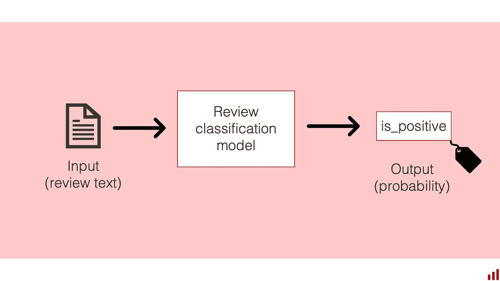

图片由作者提供。

让我们假设你想要**对药品评论进行分类**。

这个自然语言处理用例在电子商务中很常见。例如，用户可能会在在线药房网站上留下评论。你可能希望根据内容将每条评论分配到一个类别，如“副作用”、“使用难易”或“效果”。一旦你创建了模型，你可以自动对每个新提交的评论进行分类。标签将改善用户体验，帮助更快地找到相关内容。

你可能会在其他场景中使用类似的分类模型。例如，在以医疗保健为重点的聊天应用中，挖掘相关信息并丰富用户体验。在这种情况下，你可能会批量分类评论并将其存储在某个数据库中。你可以按需检索这些评论，将内容展示给用户。

让我们以这个用例作为灵感，从一个更简单的分类模型开始。我们的目标是预测**整体评论情感**是否高度积极或消极。

# 创建一个模型

要解决这个问题，你首先需要一个标注数据集。

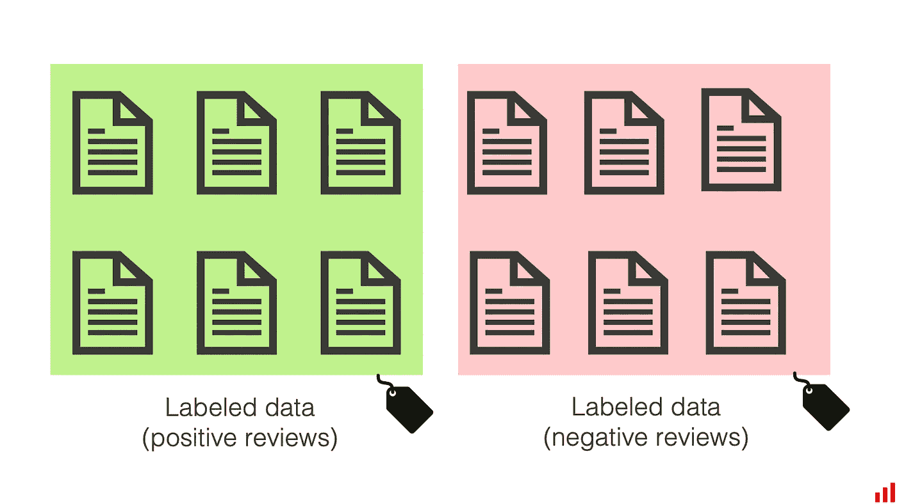

图片由作者提供。

为了说明，我们将使用 [UCI 存储库中的药品评论数据集](https://archive.ics.uci.edu/ml/datasets/Drug+Review+Dataset+%28Drugs.com%29)。

> ***免责声明：*** *这个创建的模型仅用于研究和教育目的，以展示机器学习模型评估和监控过程。它不应以任何其他形式或目的使用，也不应用于通知任何实际决策。*

数据集相当大。我们将从一个特定的子集开始：止痛药的评论。我们将其分为两部分。60% 用于“训练”部分。另 40% 是“验证”部分。

我们将训练一个模型来区分“1”（负面评论）和“10”（正面评论）的评分，使其成为一个简单的二分类问题。

在实际操作中，你通常会面临有限的标注数据。以仅表示模型最终可能应用的数据子集的数据集开始并不罕见。

一旦我们训练了模型，我们可以在验证数据集上评估其准确性。我们得到的结果是：验证数据集上的准确率为 0.836。我们认为这对于我们的演示目的已经足够好。

我们可以期待在类似数据中生产中的质量相似。如果准确性大幅低于这一水平，我们应该做出反应并深入探讨发生了什么。

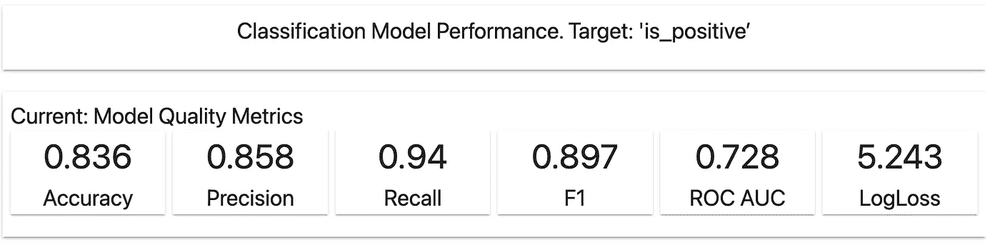

**注意：** 这是一个简单的演示。如果你在处理真实用例时，不要忘记交叉验证，以便对模型质量做出更有依据的预期。

# 生产中的模型

一旦我们将模型投入生产，就会将其应用于新的、未见过的数据。

在电子商务示例中，我们可能会将模型封装为 API。我们将在网站上提交新评论时调用模型，并根据模型的响应分配一个类别进行显示。在聊天应用场景中，我们可能会执行批量评分。我们将新的预测与分配的标签一起写入数据库。

‍ **在这两种情况下，你通常不会得到即时反馈。** 没有快速的方法来知道预测标签是否正确。然而，你确实需要*某种东西*来监控模型的表现，以确保其按预期工作。

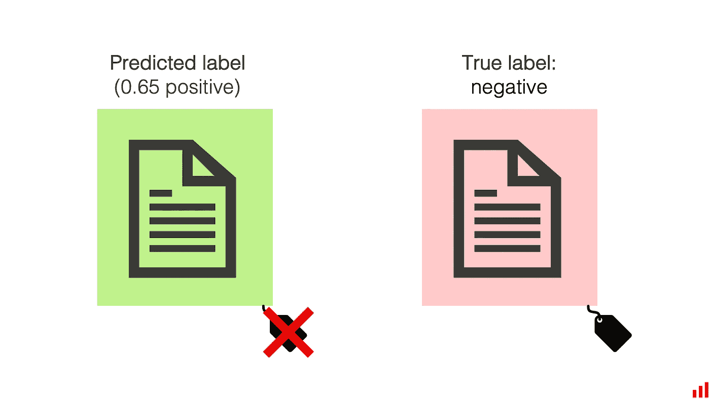

图片来源：作者。

了解模型表现良好的方式有很多：

+   **你可以在网站界面中直接设置反馈机制。** 例如，你可以允许评论作者或读者报告错误分配的类别并建议更好的类别。如果收到大量报告或修正，你可以对此做出反应并进行调查。

+   **手动标注作为质量控制。** 在最简单的形式下，模型创建者可以查看一些模型预测，以查看其是否按预期行为。你也可以不时地邀请外部标注者标注一部分数据。通过这种方式，你可以直接评估模型预测的质量与专家分配的标签之间的差异。

在这两种情况下，模型检查是被动的：你只能在获得标签并评估准确性**之后**才注意到并解决模型质量问题。

虽然你可能经常接受一些延迟或甚至质量下降（因为错误的成本是可以接受的），但尝试提前检测问题是一个好习惯。

模型质量下降的两个常见原因是数据质量问题和输入数据分布的变化。让我们探讨一下如何检测这些问题！

# 示例 1：数据质量和完整性

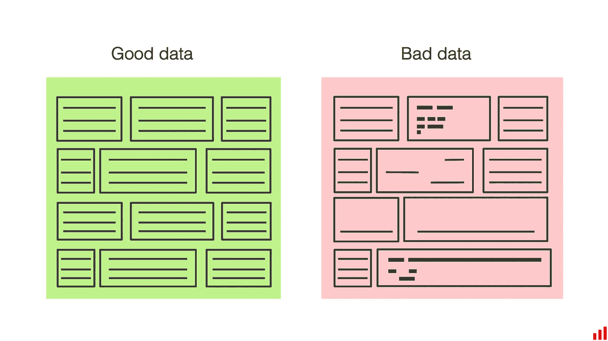

图片来源：作者。

**数据质量问题千差万别。** 例如，你可能在输入数据处理过程中有一些漏洞，将 HTML 标签泄露到评论文本中。数据还可能因为编码错误、特殊符号的存在、不同语言的文本、表情符号等而被损坏。在作为评分流程的一部分运行的特征转换代码、后处理或清理步骤中可能存在错误。

**在我们的例子中，我们人为地改变了数据集。** 我们使用了相同的验证数据集，并做了一些更改：注入了随机的 HTML 标签，并将一些评论翻译成法语。目标是“破坏”数据集，模拟数据质量问题。

> *你可以在随附的* [*notebook*](https://colab.research.google.com/drive/15ON-Ub_1QUYkDbdLpyt-XyEx34MD28E1)* 中查看完整的代码。*

现在，让我们检查一下这个修改后的数据上的模型质量：

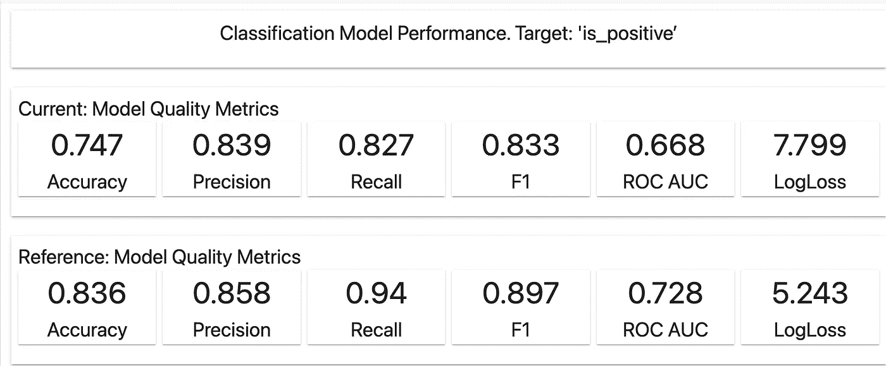

图片由作者提供。Evidently 库的截图。

模型质量低于在“干净”数据集上的初始验证结果。准确率仅为 0.747。

**我们如何解决这种下降问题？** 如果这种情况在实际中发生，我们的下一步是深入研究模型的表现和数据，以了解发生了什么。让我们来看看！

我们将使用 [Evidently Python library](https://github.com/evidentlyai/evidently)。它包含各种评估指标和测试，并帮助生成适用于不同场景的交互式报告。

在这种情况下，我们将通过结合几个我们想运行的评估来创建一个自定义报告，以了解数据的变化。

要应用 Evidently，我们首先需要准备数据并映射架构，以便 Evidently 能够正确解析。这称为“列映射”。我们在所有评估中重用它，因为数据架构保持不变。

这里是我们如何指向包含预测值、目标值的列，并指定评论列应被视为文本列：

```py
column_mapping = ColumnMapping() 
column_mapping.target = 'is_positive' 
column_mapping.prediction = 'predict_proba' 
column_mapping.text_features = ['review']
```

接下来，我们生成报告。为此，我们需要执行以下操作：

+   将我们的原始验证数据作为“参考”（比较基线）传入，并将修改后的验证数据作为“当前”，

+   指定我们想在报告中包含的评估类型（“指标”），

+   调用可视化报告以在 Jupyter notebook 或 Colab 中进行探索。

在我们的例子中，我们选择评估目标、预测和数据漂移。首先，我们想查看模型输出是否发生了变化。其次，我们想查看输入文本是否发生了变化。

**有几种方法可以评估文本数据集之间的相似性。** 一种方法是比较文本数据的描述性统计（例如文本长度、词汇外单词的比例以及非字母符号的比例），并探索它们是否在两个数据集之间发生了变化。这个选项在 Evidently 中作为 **Text Descriptors Drift** 指标提供。除了评估模型预测和目标的漂移之外，我们将其包含在综合报告中。

这是你可以调用它的方式：

```py
data_drift_report = Report( 
    metrics=[ 
        ColumnDriftMetric('is_positive'), 
        ColumnDriftMetric('predict_proba'), 
        TextDescriptorsDriftMetric(column_name='review'), 
    ] 
) 
data_drift_report.run(reference_data=reference, 
                      current_data=valid_disturbed, 
                      column_mapping=column_mapping) 
data_drift_report
```

一旦我们展示报告，可以看到真实标签或预测概率没有漂移。

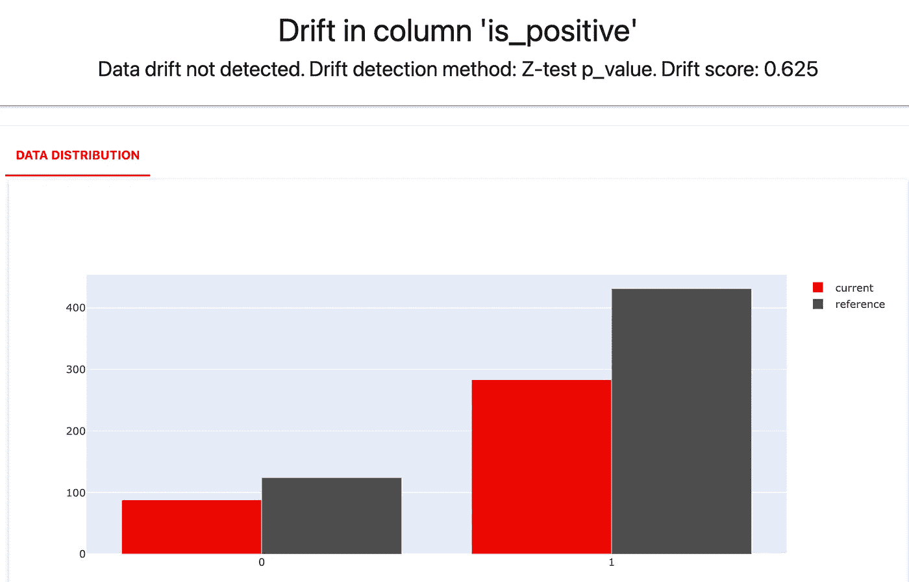

图片由作者提供。Evidently 库的截图。

但有些输入文本属性是不同的！

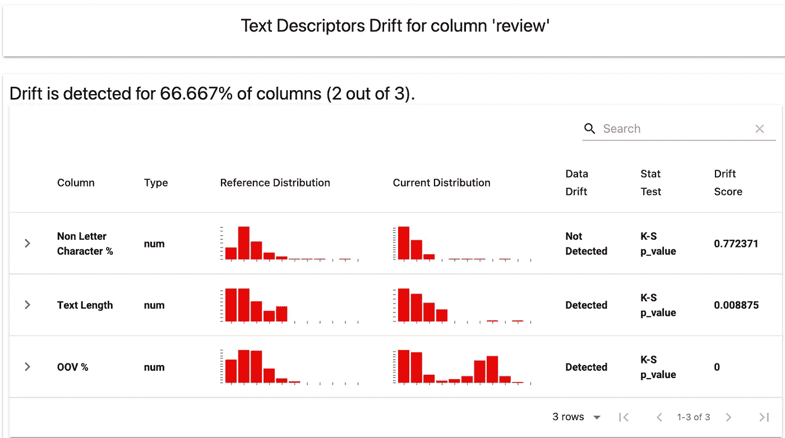

图片由作者提供。Evidently 库的截图。

在后台，Evidently 计算这些描述符并应用不同的统计测试和距离度量，以检查两个数据集之间是否存在显著的变化。

特别是，它指出了**文本长度分布的变化**。如果我们扩展报告中的细节，我们可以看到一些附加的图表，这些图表有助于理解这种变化。

一些评论现在疑似变得很长：

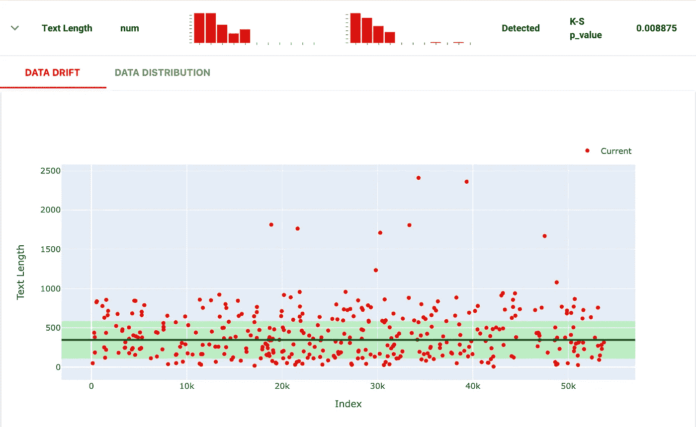

作者提供的图片。截图来自 Evidently 库。

**词汇量也发生了变化**。多个评论包含超过 30%的词汇外单词：

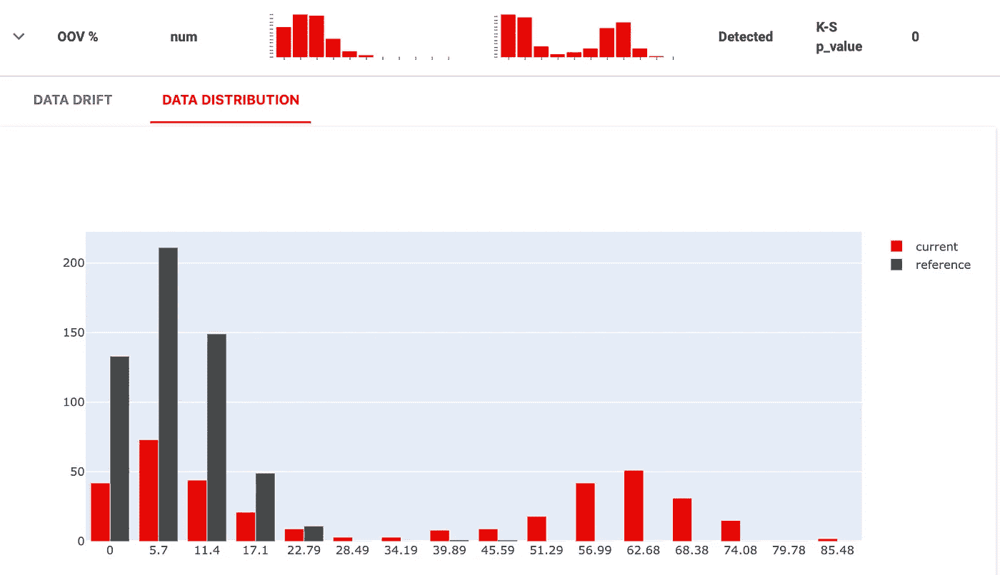

作者提供的图片。截图来自 Evidently 库。

这些发现可以帮助我们找到变化的例子，以了解发生了什么。例如，我们可以在数据集中查询所有超过 1000 字的长评论和超过 30%为词汇外单词的评论。

一旦我们显示出这些例子，我们可以迅速了解发生了什么：

+   含有 HTML 标签的文本直接传递给模型

+   评论使用了新的、意想不到的语言

这是查询结果之一：

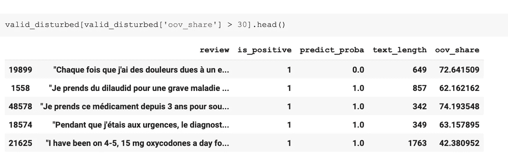

作者提供的图片。截图来自示例笔记本。

知道发生了什么之后，我们可以与数据工程团队（以整理管道）和产品团队（以确保法语评论是预期的，并且是时候为这些评论创建一个单独的模型）解决问题。

# 示例 2：数据分布变化

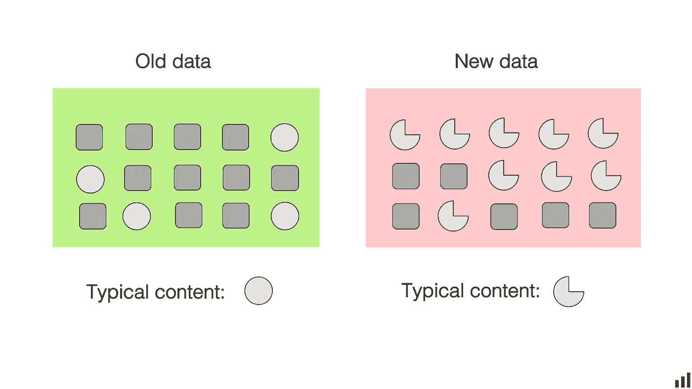

作者提供的图片。

生产中可能发生的另一种变化是**内容**的变化，即模型需要分析的文本内容发生变化。这种变化最终可能导致模型质量下降或**模型漂移**。它可以以不同的形式出现。

其中一种是**概念漂移**，当模型学习到的一些概念发生演变时。例如，一些词语或符号的意义可能会逐渐改变。也许之前代表“积极”评论的某些表情符号现在经常用于相反的意图。或者市场上出现了另一种具有相同活性成分的新药，这将一个“概念”转换为两个不同的概念。

另一个是**数据漂移**，当模型应用于与训练数据不同的新数据时。模型学到的关系依然成立，但它没有见过最新数据中的模式，因此无法很好地评分。例如，如果你将训练用于分类医学评论的模型应用于其他产品，你将会观察到数据漂移。

理解数据漂移和概念漂移的区别对于解释变化很有用。然而，要检测这些变化，我们通常会使用相同的方法。如果你已经有了标签，**真实模型质量**（例如准确率）是衡量模型漂移的最佳指标。如果你没有标签或者想要调试质量下降，你可以查看**输入数据和预测的变化**，然后利用你对领域的理解来解释。

让我们回到我们的示例数据集，看看模型漂移在实践中可能是什么样的。

**我们现在将模型应用于一个新的、未见过的数据集。** 我们将使用不同类别的药物评论：这些评论不再与止痛药有关，而是与抗抑郁药有关。我们可能仍然会期望合理的质量：评论者可能会使用重叠的词汇来描述某种药物是否有效。

模型没有完全失败，但准确率只有 0.779。

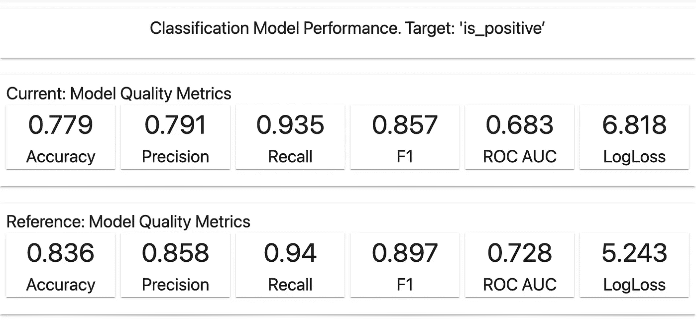

作者提供的图片。截图来自 Evidently 库。

这低于预期。我们来调查一下吧！

我们可以再次生成漂移报告，并立即注意到一些变化。特别是，标签的分布已经发生漂移。

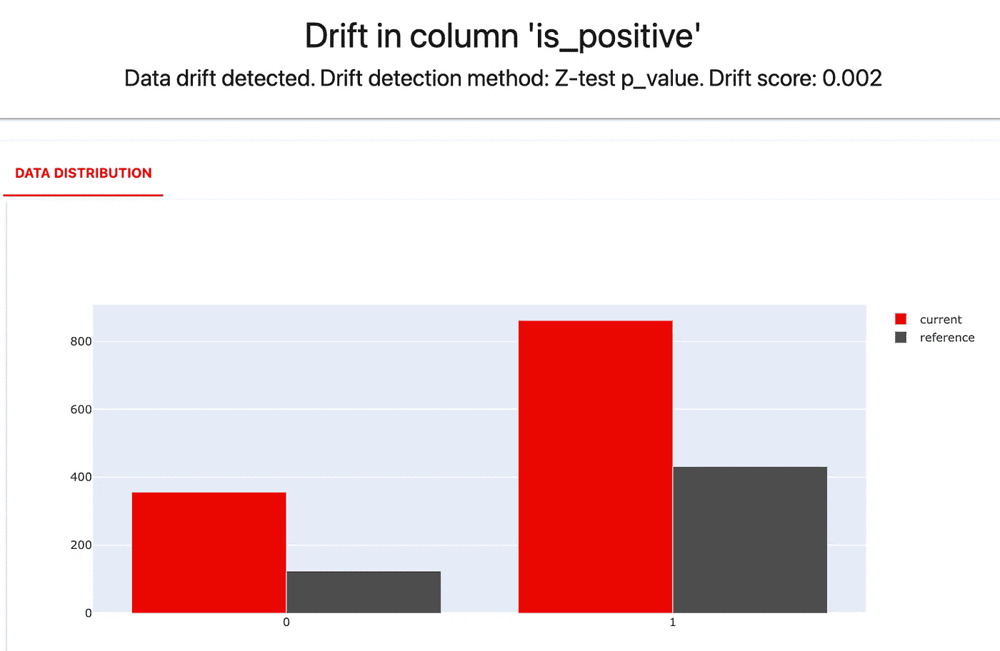

作者提供的图片。截图来自 Evidently 库。

当前数据集中的评论也更长，OOV 词汇出现的频率更高。但没有像上述情况那样明显的变化。

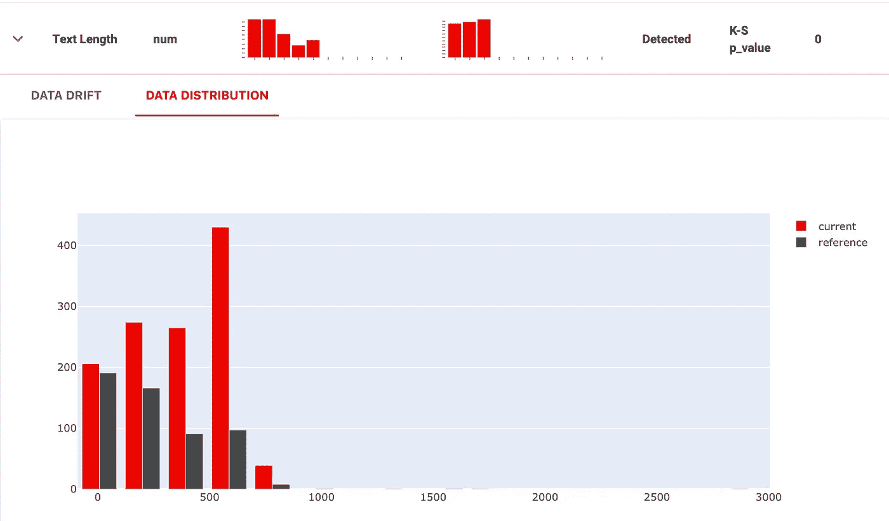

作者提供的图片。截图来自 Evidently 库。

我们可以尝试其他方法来调试发生了什么：除了比较文本统计数据，看看是否**数据集的内容**发生了变化。

检测数据漂移的方法有很多。对于表格数据，你通常会查看数据集中各个特征的分布。对于文本数据，这种方法就不太方便了：你可能不想计算数据集中每个词的分布。词汇实在太多了，结果也难以解释。

‍**Evidently 使用了不同的文本漂移检测方法：** [**一个领域分类器**](https://www.evidentlyai.com/blog/evidently-data-quality-monitoring-and-drift-detection-for-text-data)**。** 它训练一个背景模型来区分参考数据集和当前数据集。二分类器的 ROC AUC 显示漂移是否被检测到。如果一个模型可以可靠地区分当前或参考数据集中的评论，那么这两个数据集可能足够不同。

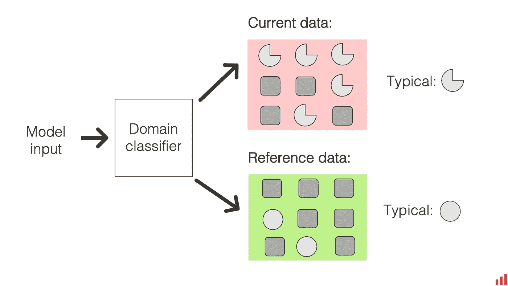

作者提供的图片。

这种方法和其他方法在论文“ [Failing loudly](https://arxiv.org/abs/1810.11953): An Empirical Study of Methods for Detecting Dataset Shift”中进行了描述。

这并非没有警告。如果你在新数据集中有一些时间信息（例如，每条评论包括日期），模型可能会很快学会区分数据集。这可能只是因为其中一个数据集包含“March”一词，而另一个包含“February”，或者提到了黑色星期五促销。然而，我们可以通过查看领域分类器模型的顶级特征和一些示例来评估这一点。

如果检测到文本数据漂移，Evidently 将自动提供一些有用的信息：

+   **当前数据集和参考数据集中的典型词汇**。这些词汇在预测特定评论属于哪个数据集时最具指示性。

+   **文本示例**来自当前和参考数据集，这些文本对分类器来说最容易正确标记（预测概率非常接近 0 或 1）。

为了使用这种方法，我们将创建一个新报告，并在给定列中包含有助于检测漂移的度量。对于包含文本数据的列，领域分类器是默认方法。

```py
data_drift_dataset_report = Report(metrics=[ 
    ColumnDriftMetric(column_name='review') 
]) 

data_drift_dataset_report.run(reference_data=reference, 
                              current_data=new_content, 
                              column_mapping=column_mapping) 

data_drift_dataset_report
```

这是它对我们的数据集的显示情况。

**首先，它确实检测到了分布漂移。** 分类器模型非常自信，ROC AUC 为 0.94。其次，最具辨识性的特征非常明确地指向了文本内容的可能变化。

参考数据集包含“pain”和“migraine”这些词汇。

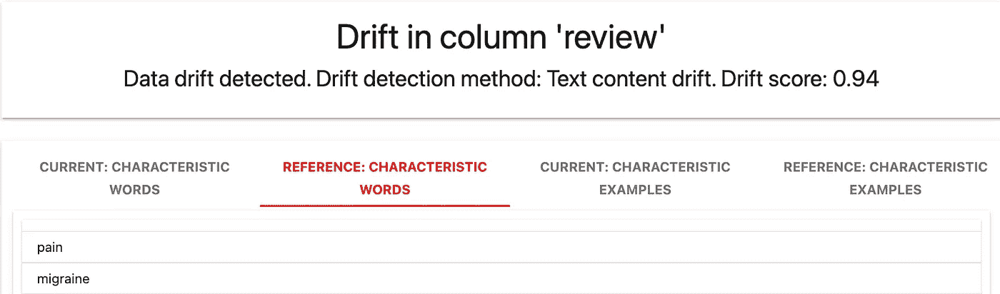

作者提供的图片。来自 Evidently 库的截图。

当前数据集包含“depression”和“antidepressant”这些词汇。

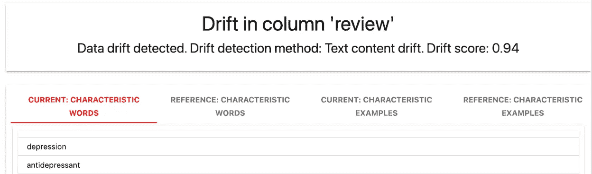

作者提供的图片。来自 Evidently 库的截图。

从具体的示例评论中也可以看出这一点。它们指的是不同的药物类别，作者使用不同的词汇来描述某种药物是否有效。例如，“improve mood”与“relieve pain”不同，使得模型更难以分类评论的情感。

一旦我们确定了模型漂移的原因，我们可以制定解决方案：通常是使用新标记的数据重新训练模型。

# 如何在生产环境中应用这一点？

在这个玩具示例中，我们展示了调试工作流程。我们测量了模型的实际准确性，并深入挖掘以确定质量下降的原因。

**在实践中，你可以主动进行数据质量检查。** 例如，你可以在批量评分流程中实现这个早期质量控制步骤。你可以测试你的数据，以便在获得实际标签或甚至评分模型之前发现潜在问题。

如果你发现评论正文中有 HTML 标签等问题，你可以立即采取行动解决它们：通过更新和重新运行预处理流程。

**你可以对数据漂移检查做同样的事情**。每次获得新一批数据时，你可以评估其关键特征以及它与前一批数据的相似程度。

如果你检测到漂移并发现它确实是由于新类型的内容或话题出现，你也可以采取主动措施。在这种情况下，这很可能意味着启动新的标记过程和随后的模型重新训练。

> ***Evidently*** *是一个开源 Python 库，帮助评估、测试和监控生产中的机器学习模型。你可以使用它来检测数据漂移、数据质量问题或跟踪表格和文本数据的模型性能。*
> 
> [*在 GitHub 上查看 ⟶*](https://github.com/evidentlyai/evidently)

# 接下来做什么？

评估文本数据漂移可能涉及其他挑战。例如，你可能需要监控嵌入中的漂移，而不是原始文本数据。你还可以进行额外的测试和评估，例如与模型的鲁棒性和公平性相关的测试。

[点击这里注册](https://www.evidentlyai.com/user-newsletter) 以获取有关新手动教程和新功能发布的更新。

*最初发表于* [*https://www.evidentlyai.com*](https://www.evidentlyai.com/blog/tutorial-detecting-drift-in-text-data) *于 2023 年 2 月 20 日，并与 Natalia Tarasova 合著。*
