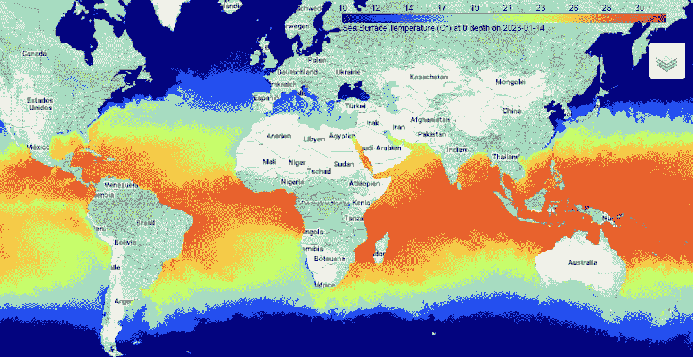
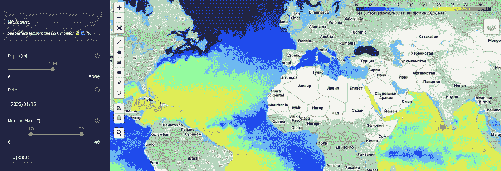

# 使用 GEE 在全球范围内监测海表温度

> 原文：[`towardsdatascience.com/monitoring-sea-surface-temperature-at-the-global-level-with-gee-1d7349c7da6`](https://towardsdatascience.com/monitoring-sea-surface-temperature-at-the-global-level-with-gee-1d7349c7da6)

## 如何使用 Python 创建一个用于海洋监测的 Streamlit 应用

[](https://bryanvallejo16.medium.com/?source=post_page-----1d7349c7da6--------------------------------)[](https://towardsdatascience.com/?source=post_page-----1d7349c7da6--------------------------------) [Bryan R. Vallejo](https://bryanvallejo16.medium.com/?source=post_page-----1d7349c7da6--------------------------------)

·发表于 [Towards Data Science](https://towardsdatascience.com/?source=post_page-----1d7349c7da6--------------------------------) ·7 分钟阅读·2023 年 3 月 8 日

--



图片由作者提供。[SST 监测器](https://ocean-temperature-monitoring-bryanrvallejo.streamlit.app/) 使用 GEE 于 2023 年 1 月 14 日

# 介绍

过去十年，地球观测及其技术基础设施发展迅速。许多卫星星座提供开放和便捷的数据访问，研究人员可以轻松获取。例如，***Google Earth Engine*** 是一个云基础设施，提供来自多个提供商的数据，如 Modis、NOAA、ASTER、Landsat 等，你可以直接探索和分析这些数据。在 [GEE](https://developers.google.com/earth-engine/datasets) 中了解更多。如果你想在 Python 中使用 API，可以使用由 [Qiusheng Wu](https://medium.com/u/ddf2451fc08e?source=post_page-----1d7349c7da6--------------------------------) 开发的 [geemap](https://geemap.org/) Python 库，它具有很棒的功能，可以像本教程中那样直接使用。

基础设施模型几乎实时运行，因此可以获取最新数据以帮助监测陆地和海洋。对于本教程，我们将使用 [HYCOM](https://developers.google.com/earth-engine/datasets/catalog/HYCOM_sea_temp_salinity#description) 数据集，该数据集包含一个数据同化混合模型，展示了全球范围内的海表温度和盐度。该模型包含每个时间层的深度值，因此用户可以在特定的深度和日期可视化海洋。混合坐标海洋模型已在许多出版物中出现，网站上提供了大量有关数据集的文档。如果你想了解更多，推荐你查看 [官方网站](https://www.hycom.org/)。

# 应用程序

通过下一个链接获取应用程序访问权限：

> 🌡️ [SST 全球监测 — 应用程序](https://ocean-temperature-monitoring-bryanrvallejo.streamlit.app/)



作者提供的图片。应用程序的简要视图。2023 年 1 月 15 日的 100 米深度

# 目标

我希望通过这个教程创建一个易于使用的应用程序，能够在全球范围内显示海表温度。应用程序的功能应包括：

+   时间选择

+   深度选择

+   图例配置

一旦互动完成，我们将把应用程序部署到 Streamlit 云端。

# 数据许可证

HYCOM 数据集以 [公共领域标记 1.0](https://creativecommons.org/publicdomain/mark/1.0/) 发布。用户可以复制、修改和重新分发，甚至用于商业目的。HYCOM 官方分发为 [**US DOD 分发 A**](https://discover.dtic.mil/wp-content/uploads/2018/09/distribution_statements_and_reasonsSept2018.pdf)，表示公开发布和无限分发。

# 编码教程

希望在开始这个教程之前，你对 Python 编程有所了解。如果没有，那也没关系，只需在教程中请求帮助，我可以建议一些教育材料。一般来说，Python 可以在 [Anaconda](https://www.anaconda.com/) 中很好地使用。我建议你先安装并熟悉包的安装，然后再开始。在任何情况下，你都能成功部署这个应用程序。

## 库

让我们开始创建一个 Python 文件并导入所需的库。

```py
import json
from datetime import datetime, timedelta, date

import ee
import geemap.colormaps as cm
import geemap.foliumap as geemap
import streamlit as st
```

要在 Streamlit 中使其工作，你可能需要使用密钥进行 GEE 认证。如何做的说明已经写在 [Mykola Kozyr](https://medium.com/u/bc439defe554?source=post_page-----1d7349c7da6--------------------------------) 的这篇清晰且出色的教程中。

[](https://medium.com/@mykolakozyr/using-google-earth-engine-in-a-streamlit-app-62c729793007?source=post_page-----1d7349c7da6--------------------------------) [## 在 Streamlit 应用程序中使用 Google Earth Engine

### 我最近发布了一个 Streamlit 应用程序，用于可视化欧洲河流流域的地表温度数据……

medium.com](https://medium.com/@mykolakozyr/using-google-earth-engine-in-a-streamlit-app-62c729793007?source=post_page-----1d7349c7da6--------------------------------)

仔细按照之前提供的说明进行操作，并将自己的凭据添加到 app.py 文件中。它可能看起来像这样。

```py
# ______ GEE Authenthication ______

# _____ STREAMLIT _______

# Secrets
json_data = st.secrets["json_data"]
service_account = st.secrets["service_account"]

# Preparing values
json_object = json.loads(json_data, strict=False)
json_object = json.dumps(json_object)

# Authorising the app
credentials = ee.ServiceAccountCredentials(service_account, key_data=json_object)
ee.Initialize(credentials)
```

## 环境

要在 Streamlit 中进行部署，你应该添加一个 `requirements.txt` 文件，其中包含部署所需的包。在这种情况下，我们将添加要求和一个额外的 `packages.txt` 文件。这两个文件来自 [gishub](https://streamlit.geemap.org/) 的 geemap。

向 repo 中添加一个 `requirements.txt` 文件，内容包括：

```py
--find-links=https://girder.github.io/large_image_wheels GDAL
# cartopy
geemap
geopandas
ee
jupyter-server-proxy
leafmap
localtileserver
nbserverproxy
owslib
palettable
plotly
streamlit==1.12.2
streamlit-bokeh-events
streamlit-folium
tropycal
```

另附一个 `packages.txt` 文件，内容包括：

```py
ffmpeg
gifsicle
build-essential
python3-dev
gdal-bin
libgdal-dev
libproj-dev
libgeos-dev
proj-bin
```

## 布局配置

在这里，我们将为页面添加标题，定义 Streamlit 的宽布局，并对画布施加紧密的限制，以使地图看起来更好。

```py
# _______________________ LAYOUT CONFIGURATION __________________________

st.set_page_config(page_title='SST monitor', layout="wide")

# shape the map
st.markdown(
        f"""
<style>
    .appview-container .main .block-container{{

        padding-top: {3}rem;
        padding-right: {2}rem;
        padding-left: {0}rem;
        padding-bottom: {0}rem;
    }}

</style>
""",
        unsafe_allow_html=True,
    )
```

## 侧边栏配置和参数输入

在这里，我们将添加一个`form`，用于输入地图参数，如深度和日期。当前地图始终显示最后可用的图层，即当前日期前的 2 天。帮助中添加了一些注释。

检查描述代码的内联注释。

```py
## ___________________ SIDEBAR PARAMETERS ___________________________

st.sidebar.info('### ***Welcome***\n###### ***Sea Surface Temperature (SST) monitor*** 🧐🌊🌡️')

form = st.sidebar.form('Ocean data')

with form:

    # depths in slider
    depth_options = [0, 2, 4, 6, 8, 10, 12, 15, 20, 25, 30, 35, 40, 45, 50, 60, 70, 80, 90, 100, 125, 150, 200, 250, 300, 350, 400, 500, 600, 700, 800, 900, 1000, 1250, 1500, 2000, 2500, 3000, 4000, 5000]

    depth = st.select_slider('Depth (m)', options = depth_options, value = 0, help = 'Depth in ocean to fetch temperature layer' )

    # dates of sst
    ocean_date = st.date_input('Date', min_value=datetime.strptime('1992-10-02', '%Y-%m-%d'), max_value = datetime.now(), help = 'Selected date of temperature to be displayed')

    # conditions to get the available layer 2 days before today
    if str(ocean_date) == str(date.today()):
        ocean_date = ocean_date - timedelta(2)

    if str(ocean_date) == str(date.today() - timedelta(1)):
        ocean_date = ocean_date - timedelta(1)

    # visualization threshold
    min, max = st.slider('Min and Max (°C)', 0, 40, value=(10, 32), help='Threshold of visualization in Celsius')

    # button to update visualization
    update_depth = st.form_submit_button('Update')
```

## 定义地图实例

在地图实例中，我们将添加一个海洋基础地图并调用 ImageCollection，然后从集合中的第一个日期选择温度图层。查看`image`变量。

为了正确显示温度，我们使用乘法和加法。这些参数在 GEE 中默认存在。最后，我们添加图层和带有颜色条的图例。深度和日期将显示在图例中。

```py
# __________________ MAP INSTANCE _________________

# add a map instance
Map = geemap.Map(zoom=3, center=(-10, -55))

Map.add_basemap('Esri.OceanBasemap') # "HYBRID"

# get the layer with current date
sst_thumb = ee.ImageCollection('HYCOM/sea_temp_salinity').filterDate(str(ocean_date)) #('2022-01-10', '2022-01-15')

# get fist date just in case, and select the depth, and transform the values
image = sst_thumb.limit(1, 'system:time_start', False).first().select(f'water_temp_{depth}').multiply(0.001).add(20)

vis_param = {'min': min,
             'max': max, 'alpha': 0.4, 
             'palette': cm.palettes.jet,
             }

# add image
Map.addLayer(image, vis_param)

# add color bar with depth and date info
Map.add_colorbar(vis_param, label = f'Sea Surface Temperature (C°) at {depth} depth on {ocean_date}', layer_name = f"SST at {depth} depth", discrete=False)
```

## 地图到 Streamlit

然后，我们将地图实例发送到 Streamlit。

```py
# _______ DISPLAY ON STREAMLIT _______
Map.to_streamlit(height=600,  responsive=True, scrolling=False)
```

## 添加额外信息

我们可以添加更多信息，例如此教程的链接、作者、数据集的引用或其他任何您想要的额外信息。

```py
# _______ ADDITIONAL INFORMATION AND LINKS ________

st.sidebar.success('##### **Author and coding tutorial**\n###### ***Bryan R. Vallejo***\n##### ***[How to create a web app for ocean monitoring?](https://medium.com/@bryanvallejo16/monitoring-sea-surface-temperature-at-the-global-level-with-gee-1d7349c7da6)***\n###### ***[Get ful access to more tutorials](https://bryanvallejo16.medium.com/membership)***')

st.sidebar.warning('##### **Dataset**\n###### ***J. A. Cummings and O. M. Smedstad. 2013: Variational Data Assimilation for the Global Ocean. Data Assimilation for Atmospheric, Oceanic and Hydrologic Applications vol II, chapter 13, 303-343***\n###### ***In [Google Earth Engine](https://developers.google.com/earth-engine/datasets/catalog/HYCOM_sea_temp_salinity#description)***')

st.sidebar.error('##### Notes: \n###### ***The last STT layer availabe is 2 days before current date***')

st.sidebar.error('##### Related stories: \n###### ***[Ocean currents seasonality in the Galapagos Islands, Ecuador](https://towardsdatascience.com/ocean-currents-seasonality-in-the-galapagos-islands-ecuador-9197f0b721c0)***\n###### ***[Earth observation and biologging data for marine conservation](https://medium.com/gis4-wildlife-tracking/earth-observation-and-biologging-data-for-marine-conservation-989f2b3dc71d)***')
```

# 限制

实时海洋监测的限制在于 HYCOM 的最后一层数据可用时间为当前日期前的 2 天。实际上这并不是一个限制，因为 2 天对于海洋温度的季节性变化来说差异并不大。

一个常见的限制是快速显示全球图层，但得益于 geemap 及其 folium 的集成，实现了快速和轻量化的可视化。

# 未来发展

我设想未来的发展可能包含更多应用功能，例如添加更多图层如盐度。如果您有建议或对您自己工作的需求，请随时留下评论。

# 结论

通过简单配置输入和 GEE，可以监测海洋的季节性。GEE API 在 Python 中的发展使得展示变得更加容易，并且可以支持季节监测。此外，它还可以用于其他目的，例如用户可以查看哪个月份的温度最适合他们的下一个度假海滩。

编写者：

> [Bryan R. Vallejo - LinkedIn 个人资料](https://www.linkedin.com/in/bryanrvallejo/)
