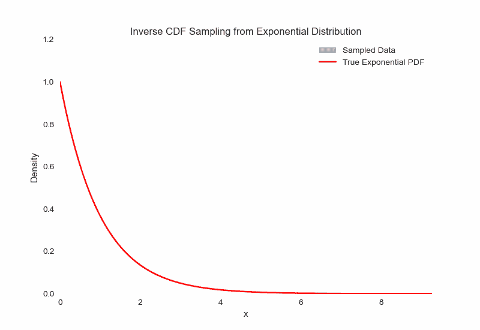
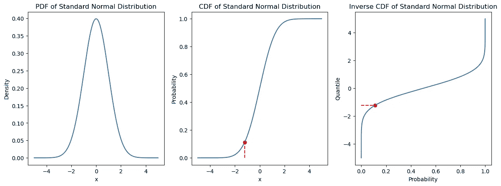
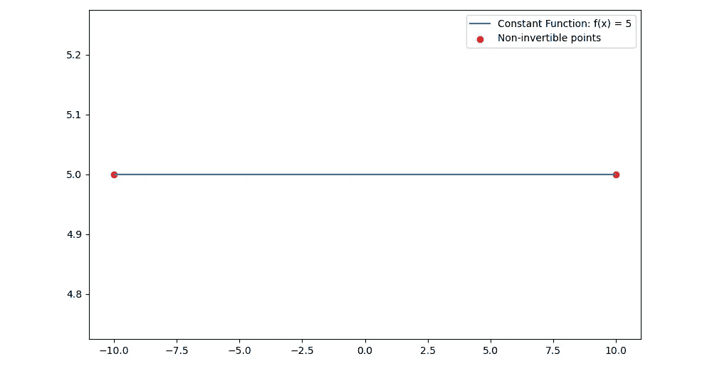
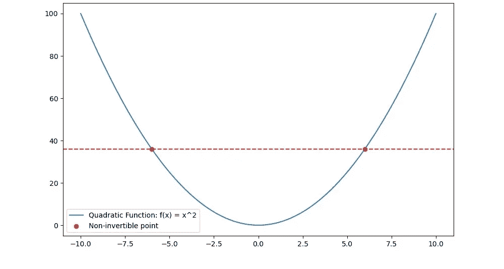
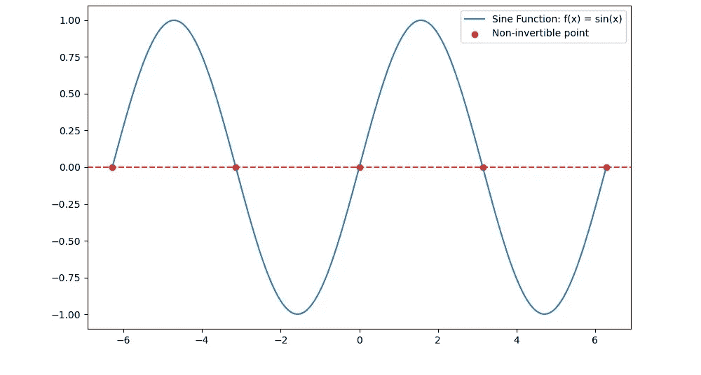
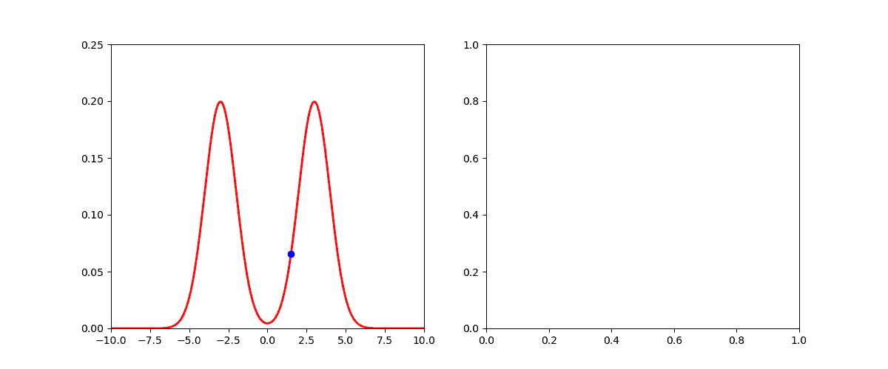
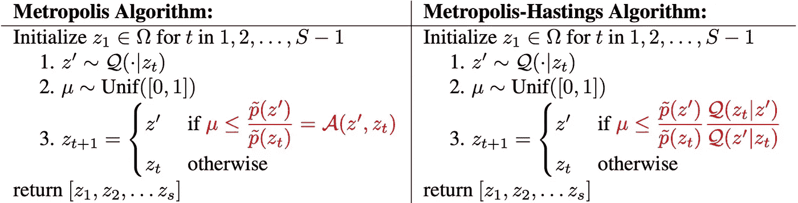
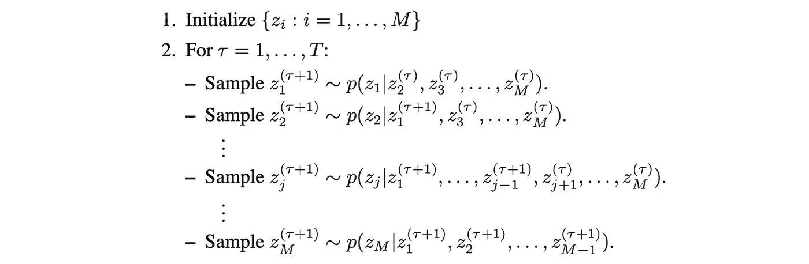
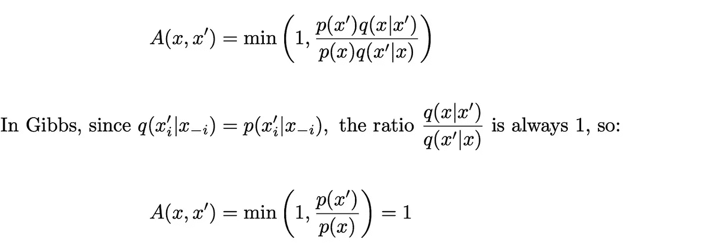
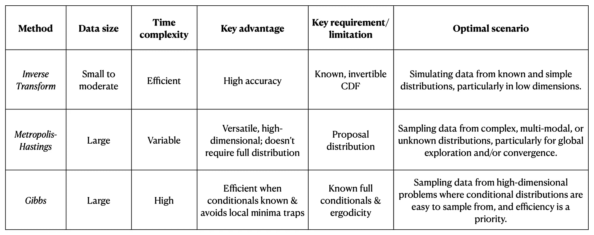

# 蒙特卡罗近似方法：你应该选择哪一种，何时使用？

> 原文：[`towardsdatascience.com/monte-carlo-approximation-methods-which-one-should-you-choose-and-when-886a379fb6b?source=collection_archive---------5-----------------------#2023-08-25`](https://towardsdatascience.com/monte-carlo-approximation-methods-which-one-should-you-choose-and-when-886a379fb6b?source=collection_archive---------5-----------------------#2023-08-25)

## 是逆变换、随机游走 Metropolis-Hastings，还是 Gibbs？对每种方法的数学基础、从零开始的 Python 实现以及优缺点的分析

[](https://susiesyli.medium.com/?source=post_page-----886a379fb6b--------------------------------)[](https://towardsdatascience.com/?source=post_page-----886a379fb6b--------------------------------) [Suyang Li](https://susiesyli.medium.com/?source=post_page-----886a379fb6b--------------------------------)

·

[关注](https://medium.com/m/signin?actionUrl=https%3A%2F%2Fmedium.com%2F_%2Fsubscribe%2Fuser%2F2b9882509386&operation=register&redirect=https%3A%2F%2Ftowardsdatascience.com%2Fmonte-carlo-approximation-methods-which-one-should-you-choose-and-when-886a379fb6b&user=Suyang+Li&userId=2b9882509386&source=post_page-2b9882509386----886a379fb6b---------------------post_header-----------) 发表在 [Towards Data Science](https://towardsdatascience.com/?source=post_page-----886a379fb6b--------------------------------) · 12 min read · 2023 年 8 月 25 日

--

[](https://medium.com/m/signin?actionUrl=https%3A%2F%2Fmedium.com%2F_%2Fbookmark%2Fp%2F886a379fb6b&operation=register&redirect=https%3A%2F%2Ftowardsdatascience.com%2Fmonte-carlo-approximation-methods-which-one-should-you-choose-and-when-886a379fb6b&source=-----886a379fb6b---------------------bookmark_footer-----------)

图片由[Joakim Honkasalo](https://unsplash.com/@jhonkasalo?utm_source=medium&utm_medium=referral)拍摄，发布在[Unsplash](https://unsplash.com/?utm_source=medium&utm_medium=referral)

# 近似抽样介绍

> 对于大多数实际应用中的概率模型，精确推理是不可行的，因此我们必须采用某种形式的近似。
> 
> — 模式识别与机器学习¹

由于如刚刚所见，确定性推断在概率模型中通常难以处理，因此我们现在转向基于数值采样的近似方法，这些方法被称为**蒙特卡罗**技术。我们将研究这些方法的关键问题是给定概率分布*p(z)*下目标函数*f(z)*的期望值计算。回顾一下，期望的简单定义是通过积分给出的：


来源：PRML¹ Eq. 11.1

正如我们将看到的，这些积分过于**计算复杂**，因此我们将在本文中转向**采样方法**。

在本文中，我们将研究三种核心采样方法：**逆变换**、马尔可夫链蒙特卡罗（MCMC）和**Gibbs** 采样。通过理解这些方法的基本统计属性和计算要求，我们将了解到：

+   **逆变换采样**最适合从已知和简单分布中高精度地模拟数据，特别是在低维情况下。

+   **随机游走 Metropolis-Hastings** 最适合复杂、多模态或未知分布，其中全球探索和/或收敛是优先考虑的；具体而言，**Metropolis** 算法——Metropolis-Hastings 的一个特定实例——可以用于对称分布。

+   **Gibbs 采样**最适合高维问题，其中条件分布容易采样，并且效率是优先考虑的。

# 目录

1.  逆变换采样

    • 算法如何工作？

    • Python 实现

    • 前提条件

    • 优缺点

1.  马尔可夫链蒙特卡罗

    • Metropolis-Hastings 算法

    • 特殊情况：对称分布的 Metropolis 算法

    • 优缺点

1.  Gibbs

    • 算法

    • 条件

    • Gibbs 与 Metropolis-Hastings 的关系

1.  比较：转换 vs. Met-Hastings vs. Gibbs 的优缺点

# 1\. 转换方法：逆 CDF

逆变换采样，顾名思义，使用目标分布的逆累积分布函数（CDF）生成符合期望分布的随机数。基本思想是：

1.  **生成一个均匀随机数**：我们从 0 到 1 之间的均匀分布中抽取一个数 *U*。

1.  **应用逆 CDF**：利用目标分布 CDF 的逆，将 *U* 转换为符合目标分布的样本。

下面是样本（蓝色）如何从分布（红色）中抽取的简要说明：



逆 CDF 是一种**计算上** **简单且可推广**的方法，用于从已知 CDF 的分布中进行采样，例如正态分布、指数分布、伽马分布或贝塔分布。

## PDF、CDF 和逆 CDF



（从左到右）：标准正态分布的 PDF、CDF 和逆 CDF

从直观上讲，CDF 是 PDF 的累计值，相当于 PDF 的积分；然后我们取 CDF 函数的逆函数，以获得用于此方法的最终逆 CDF。

正式来说，如果 *a* 是一个随机变量，那么 *a* 的 CDF 给出如下：


PRML，第 11.5–11.6 节

CDF *F* 具有以下关键属性：

+   *F* 是连续的

+   *F* 是单调非减的

+   *F* 的范围是 0 ≤ cdf(*a*) ≤ 1 对于所有 *a* ∈ R

## 逆 CDF 算法是如何工作的？

该算法包含以下要素：

**输入：**

+   `U`：*U* 是一个从 0 到 1 之间均匀分布的随机变量。

+   这作为逆 CDF 的输入概率，并将被转换为来自期望分布的样本。

**参数**：

+   `*F:*` 目标分布的 CDF。

+   使用 *F*，我们可以简单地计算其逆函数 *F*^-1，并用它将输入值映射到期望的领域。

**输出**：

+   `x`：从目标分布中抽取的随机样本。

+   这是通过将逆 CDF 应用到均匀分布的随机数（输入）来生成的。

## Python 实现

现在，让我们从头开始实现这个方法。我们将使用指数函数，因为它将容易可视化我们通过逆 CDF 生成的样本，并与精确分布进行比较：


指数函数（目标分布）的 PDF

通过标准微积分积分技术，我们发现目标 CDF *F(x)* 是：


指数函数的 CDF

这个 CDF 的逆函数是：


指数函数的逆 CDF

我们将使用逆 CDF 方法生成 5000 个样本：

```py
import numpy as np
import matplotlib.pyplot as plt

# Inverse CDF for the exponential distribution with lambda = 1
def inverse_cdf(p):
    return -np.log(1 - p)

# Generate 1000 sample values using inverse CDF
uniform_samples = np.random.uniform(0, 1, 1000)
transformed_samples = inverse_cdf(uniform_samples)

# Generate x values and true PDF
x_values = np.linspace(0, np.max(transformed_samples), 1000)
pdf_values = np.exp(-x_values)
```


## 逆 CDF 算法工作的要求

逆 CDF 方法做了一个关键假设：

+   **CDF *F* 是可逆的**：CDF *F* 必须是**可逆的**，这意味着每个输入到 *F* 的值必须有唯一的输出。

这个约束排除了一些函数。例如，下面是一些常见但**不可逆**的函数类型（因此**不能与逆 CDF 一起使用**）：

1.  **常数函数**：任何形式为 *f(x) = c* 的常数函数，其中 *c* 是常数，都不是可逆的，因为每个输入都映射到相同的输出，因此该函数**不是一对一的**。



红点显示了映射到相同 y 值的多个 x 值中的两个，这使得 f(x) = 5 变得不可逆。

2. **某些二次函数**：例如 *f(x) = x²* 是不可逆的，因为它是多对一的（考虑 *f(x) = 1*，*x* 可以是 *1* 或 *-1*）。



红点显示了映射到相同 y 值的多个 x 值中的一对，在 f(x) = x² 中。

3\. **某些三角函数**：例如 *f(x) = sin(x)* 在其整个域上不可逆，因为它们是周期性的，尽管在**限制域**上它们可能变得可逆。



红点显示了由于周期性，在 f(x) = sin(x) 给定域上映射到相同 y 值的多个 x 值集合之一。

## 为什么逆累积分布函数（CDF）有效？

关键思想是，一个**在 0 到 1 之间均匀分布的随机变量**可以通过应用目标分布 CDF 的逆变换成**具有特定分布的随机变量**，前提是该分布的 CDF 已知且易于处理。

## 优势

1.  **算法简单性**：对于低维数据，实现起来非常容易，因此在不同领域和任务中有广泛的应用。

1.  **样本准确性**：假设 CDF 及其逆函数表示准确的目标分布，该方法相比于其他方法（如稍后会看到的 MCMC），具有相对较高的准确性。

## 缺点

1.  **计算复杂性**：对于一些分布，逆 CDF 可能没有封闭形式表达式，使得计算具有挑战性或昂贵。

1.  **高维度难度**：在高维空间中应用可能很困难，尤其是当变量之间存在依赖关系时。

1.  **可逆性限制**：任何 CDF 不可逆时，该方法将变得无效。这排除了我们上面看到的一些函数。

1.  **限于已知分布**：逆 CDF 需要 CDF 的准确形式，这限制了其仅能应用于已知分布。

考虑到所有这些限制，我们只能将逆 CDF 应用于少数几类分布。实际上，面对大数据和未知分布时，这种方法可能会迅速失效。

记住这些优缺点后，让我们现在来看另一种随机采样框架，**马尔可夫链蒙特卡罗（MCMC）**，它解决了这些限制。

# 2\. 马尔可夫链蒙特卡罗（MCMC）

正如我们刚才看到的，逆 CDF 变换方法**高度受限**，尤其是在**高维**样本空间中。另一方面，马尔可夫链蒙特卡罗（MCMC）在维度上表现良好，使我们能够从更大的分布家族中进行采样。



Metropolis-Hastings 例子探索混合高斯分布（左），生成样本（右）

## Metropolis-Hastings 算法是如何工作的？

直观地说，算法按以下步骤工作：类似于逆 CDF，我们有一个我们从中采样的**目标分布**。然而，我们需要一个额外的成分：当前状态 `z*`，并且 *q(z|z*)* 依赖于 `z*`，创建一个具有样本 z¹、z²、z³ 的马尔可夫链。每个样本只有在满足某些标准时才被接受到链中，这些标准将在下文定义，因为这些标准在算法的不同变体中有所不同。

让我们将其形式化为更算法化的结构。

算法以周期性方式运行，每个周期遵循以下步骤：

1.  从提议分布中生成一个样本 *z**。

1.  以概率接受样本，然后我们将以**接受概率**接受该值，在 Metropolis-Hastings 中定义为：


PRML¹ Eq 11.44

## 其中

+   *z** 是当前状态。

+   *z^T* 是提议的新状态。

+   *p(z*)* 是根据期望分布的状态 z* 的概率。

+   *p(z^T)* 是根据期望分布的状态 *z^T* 的概率。

这个接受阈值背后的逻辑是确保**更可能的状态**（根据期望分布）**更频繁地被访问**。

现在，这是算法的最通用版本；如果提议分布已知是对称的，即从状态 *x* 到 *x*′ 的提议移动的概率与从 *x*′ 到 *x* 的提议移动的概率相同，即 *q*(*x′*|*x*) = *q*(*x|x′*），那么我们可以使用一个特殊的 Metropolis-Hastings 变体，该变体需要更简单的接受阈值。

## 对称分布的 Metropolis 算法

这是一个特定的 MCMC 算法，我们选择在**提议分布对称**时使用，即 q(z⁰ | z¹) = q(z¹ | z⁰) 对于所有值 1 和 0，解释为“从任何状态 A 过渡到状态 B 的概率等于从 B 过渡到 A 的概率”。所以，算法的每一步变成：

1.  从提议分布中生成一个样本 z*。

1.  以以下概率接受样本：


Metropolis 算法接受阈值。来源：PRML¹ Eq. 11.33

## Metropolis-Hastings 和 Metropolis 算法

让我们并排比较这些算法。如我们之前所见，唯一的区别是接受阈值；算法的其他步骤完全相同：



Metropolis 与 Metropolis-Hastings 算法

## 优势

1.  **收敛到平衡分布**：在某些情况下，随机游走可以收敛到期望的平衡分布，尽管在高维空间中可能需要很长时间。

1.  **低计算成本**：随机游走通常比其他复杂的采样方法需要更少的计算资源，因此适用于计算效率为优先的问题。

1.  **应用的多样性**：由于与自然发生模式的高度相似性，随机游走在广泛的领域中都有应用：

    • 物理学：液体和气体中分子的布朗运动。

    • 网络分析

    • 金融市场：用于建模股票价格波动

    • 群体遗传学

## **缺点**：

1.  **对初始化敏感**：算法的性能可能对起始值的选择敏感，特别是当初始化值远离高密度区域时。

1.  **局部陷阱**：根据提案分布的复杂性，算法可能会陷入局部最优，并且难以遍历分布的其他区域。

现在，牢记 Metropolis-Hastings 算法，让我们看看它的另一个特殊实例：Gibbs 采样。

# 3\. Gibbs 采样

Gibbs 采样是 Metropolis-Hastings 的一个特殊实例，其中 **每一步都总是被接受**。让我们首先看看 Gibbs 采样算法本身。

## **Gibbs 算法是如何工作的？**

这个想法相对简单，最好通过首先放大涉及从分布 *p(z1, z2, z3)* 中采样的微观例子来说明。算法的步骤如下：

1.  在时间步 *T*，将起始值初始化为：


PRML¹

2\. 为 *z1* 生成新值：


PRML¹ Eq 11.46

3\. 从条件分布中为第二个位置 *z2* 生成一个新值：


PRML¹ Eq 11.47

4\. 最后为最后一个位置 *z3* 生成一个新值：


PRML¹ Eq 11.48

5\. 重复这一过程，在三个变量 *z1…z3* 之间循环，直到达到某个令人满意的阈值。

## 广义算法

从形式上看，算法首先初始化起始位置，然后采取 *T* 个连续步骤



图片来源：PRML¹ Ch11.3 Gibbs 采样

## Gibbs 从目标分布中正确采样的条件

1.  **不变性**。目标分布 *p(z)* 在每个 Gibbs 步骤中是不变的，因此 *p(z)* 对整个马尔可夫链是不变的。

1.  **遍历性**。如果条件分布都是非零的，则意味着遍历性，因为 *z* 空间中的任何点都可以在有限步数内到达。

1.  **充分的烧入时间**。正如我们在任何需要随机初始化的方法中看到的那样，前几个样本依赖于初始化，随着迭代次数的增加，这种依赖性会减弱。

## 这与 Metropolis-Hastings 有什么关系？

在 Metropolis-Hastings 中，我们定义接受阈值为：



因此，Metropolis-Hastings 提案步骤总是被接受的，正如我们在 Gibbs 算法中所看到的那样。

## 变体

由于 Gibbs 方法一次更新一个变量，因此连续样本之间存在较强的依赖性。为克服这一点，我们可以使用一种中间策略来从**变量组**而非**单个变量**中采样，称为[阻塞 Gibbs](https://www.sciencedirect.com/science/article/pii/S0002929707623398)。

同样，由于马尔可夫链的性质，连续抽取的样本将会相关。为了生成独立样本，我们可以在序列中使用子采样。

# 4. 优缺点：逆 CDF vs Metropolis-Hastings vs Gibbs

现在我们已经详细了解了每种算法的工作原理及其应用领域，让我们总结一下每种方法的定义特征。

## 1. 逆变换采样

+   **数据大小**：适合中等大小的数据集。

+   **时间**：通常对单变量分布有效率。

+   **数据复杂性**：适用于已知并易于计算的累积分布函数（CDF）及其逆函数的简单分布。

+   **如果**：采样高维变量/分布。

+   **最大优点**：如果 CDF 准确反映目标分布，则准确性高。

+   **要求**：CDF 必须已知且可逆。

## 2. Metropolis-Hastings (MCMC)

+   **数据大小**：可扩展且适合大型数据集。

+   **时间**：可能计算量大，取决于目标分布的复杂性。

+   **数据复杂性**：适用于复杂或多模态分布。

+   **最大优点**：

    - 可以在不知道其归一化常数（完整形式）的情况下从分布中采样

    - 适合探索分布的全球结构并保证收敛

+   **缺点**：可能会出现非常慢的收敛速度

    - 复杂或多峰目标分布，因为算法可能陷入局部模式并难以在它们之间转换；

    - 变量高度相关；

    - 高维空间；

    - 不良的初始值或步长选择

## 3. Gibbs 采样

+   **数据大小**：适用于小型和大型数据集。

+   **时间**：通常比随机游走 Metropolis-Hastings 更有效，因为它不需要接受/拒绝步骤。

+   **数据复杂性**：当处理高维分布时，最佳用于可以从每个变量的条件分布中采样的情况。

+   **最大优点**：

    - 可以轻松计算条件分布；

    - 相比于随机游走，较少陷入局部极小值。

+   **要求**：

    - 马尔可夫链遍历性

    - 必须已知且可处理完整的条件分布

## 总结：



逆 CDF、Metropolis-Hastings 和 Gibbs 的优缺点汇总表

# 结论

感谢你一直陪伴到现在！在这篇文章中，我们探讨了 3 种关键的近似采样方法：逆 CDF、Metropolis Hastings MCMC 和 Gibbs Sampling MCMC。我们了解了每种算法的工作原理、各自的优缺点以及典型的应用场景。

**逆 CDF** 提供了一种直接从已知分布中采样的方法，当其 CDF 是可逆时。这种方法计算效率高，但不太适用于高维或复杂的分布。

**Metropolis Hastings MCMC** 提供了一种更通用的方法，允许从难以处理的分布中进行采样。然而，它需要更多的计算资源，并且可能对像提议分布这样的调参敏感。

**Gibbs Sampling MCMC** 在联合分布复杂但可以分解为更简单的条件分布时特别高效。它在机器学习中广泛使用，尽管对于高维问题可能收敛缓慢且占用内存。

[1] Bishop, C. M. (2016). *模式识别与机器学习*（原版第 1 版 2006 年软封面再版（2009 年第 8 次印刷校订版））。Springer New York.

**图片由作者提供，除非另有说明，**
