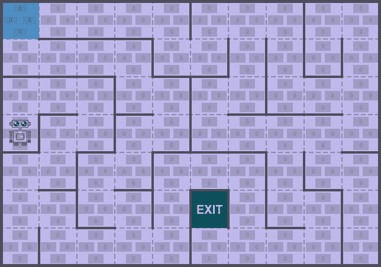

# 蒙特卡洛方法

> 原文：[`towardsdatascience.com/monte-carlo-methods-b2504976c415?source=collection_archive---------4-----------------------#2023-08-26`](https://towardsdatascience.com/monte-carlo-methods-b2504976c415?source=collection_archive---------4-----------------------#2023-08-26)

## [婴儿机器人强化学习指南](https://towardsdatascience.com/tagged/baby-robot-guide)

## 强化学习简介：第四部分

 [Steve Roberts](https://medium.com/@tinkertytonk?source=post_page-----b2504976c415--------------------------------)

·

[关注](https://medium.com/m/signin?actionUrl=https%3A%2F%2Fmedium.com%2F_%2Fsubscribe%2Fuser%2F6b6735266652&operation=register&redirect=https%3A%2F%2Ftowardsdatascience.com%2Fmonte-carlo-methods-b2504976c415&user=Steve+Roberts&userId=6b6735266652&source=post_page-6b6735266652----b2504976c415---------------------post_header-----------) 发表在 [Towards Data Science](https://towardsdatascience.com/?source=post_page-----b2504976c415--------------------------------) · 阅读时间 26 分钟 · 2023 年 8 月 26 日

--

所有图片由作者提供

# 介绍

我们再次来到赌场，这次它位于阳光明媚的蒙特卡洛，因为在经典电影 [*马达加斯加 3: 欧洲大冒险*](https://en.wikipedia.org/wiki/Madagascar_3:_Europe%27s_Most_Wanted) 中出现而闻名（尽管它可能早已成名）。

在我们上次访问赌场时，我们查看了 [***多臂赌博机***](https://medium.com/towards-data-science/multi-armed-bandits-part-1-b8d33ab80697)，并用它来形象化如何在面临多个可能的动作时选择最佳动作的问题。

在***强化学习***中，赌博机问题可以被视为代表一个单一状态及该状态下的可用动作。*蒙特卡洛*方法将这一思想扩展到涵盖多个相互关联的状态。

此外，在我们之前讨论的问题中，我们总是有一个完整的环境模型。这个模型定义了过渡概率，即描述从一个状态转移到下一个状态的可能性，以及为实现这种转移而获得的奖励。

在*蒙特卡洛*方法中情况则有所不同。没有给定模型，代理必须通过探索发现环境的属性……
