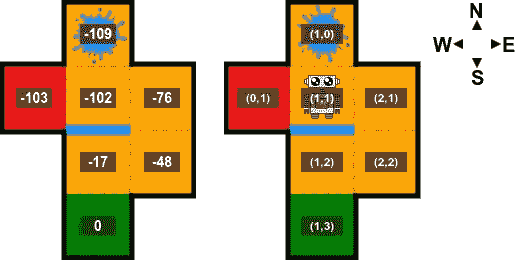
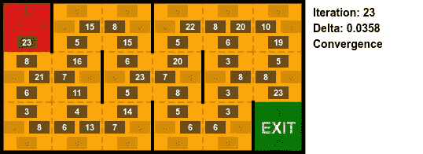

# 蒙特卡洛方法

> 原文：[`towardsdatascience.com/monte-carlo-methods-b2504976c415`](https://towardsdatascience.com/monte-carlo-methods-b2504976c415)

## [《婴儿机器人强化学习指南》](https://towardsdatascience.com/tagged/baby-robot-guide)

## 强化学习简介：第四部分

[](https://medium.com/@tinkertytonk?source=post_page-----b2504976c415--------------------------------)[](https://towardsdatascience.com/?source=post_page-----b2504976c415--------------------------------) [Steve Roberts](https://medium.com/@tinkertytonk?source=post_page-----b2504976c415--------------------------------)

·发表于[Towards Data Science](https://towardsdatascience.com/?source=post_page-----b2504976c415--------------------------------) ·阅读时间 26 分钟·2023 年 8 月 26 日

--


所有图片由作者提供

# 介绍

我们再次前往赌场，这次它位于阳光明媚的蒙特卡洛，这里因在经典电影[*马达加斯加 3：欧洲大追捕*](https://en.wikipedia.org/wiki/Madagascar_3:_Europe%27s_Most_Wanted)中的出现而闻名（虽然它可能早已出名）。

在我们上次访问赌场时，我们研究了[***多臂赌博机***](https://medium.com/towards-data-science/multi-armed-bandits-part-1-b8d33ab80697)，并将其作为一个视觉化的方式来解决如何在面对多种可能行动时选择最佳行动的问题。

从***强化学习***的角度来看，赌博机问题可以视为代表一个单一状态以及该状态下可用的行动。*蒙特卡洛*方法将这一概念扩展到覆盖多个相互关联的状态。

此外，在我们之前研究的问题中，我们总是得到了环境的完整模型。这个模型定义了转移概率，即描述从一个状态转移到下一个状态的机会，以及为此转移所获得的奖励。

在*蒙特卡洛*方法中情况并非如此。没有给定模型，代理必须通过探索来发现环境的属性，随着从一个状态转移到下一个状态而收集信息。换句话说，*蒙特卡洛方法从经验中学习*。


> 本文中的例子使用了自定义的[**Baby Robot Gym 环境**](https://github.com/WhatIThinkAbout/BabyRobotGym)，与本文相关的所有代码可以在[Github](https://github.com/WhatIThinkAbout/BabyRobot/tree/master/Reinforcement_Learning)上找到。
> 
> 此外，您可以在[**notebook**](https://github.com/WhatIThinkAbout/BabyRobot/blob/master/Reinforcement_Learning/Part%204%20-%20Monte%20Carlo%20Methods.ipynb)格式中找到这篇文章的互动版本，在那里您可以实际运行下面描述的所有代码片段。
> 
> 本系列之前的所有文章可以在这里找到：[**小机器人的强化学习指南**](https://towardsdatascience.com/tagged/baby-robot-guide)**.**
> 
> 并且，为了快速回顾本文中使用的理论和术语，请查看[**状态值和策略评估 5 分钟**](https://medium.com/@tinkertytonk/state-values-and-policy-evaluation-in-5-minutes-f3e00f3c1a50)。

# 蒙特卡洛预测

在预测问题中，我们想要找到在环境中某一特定状态下的好坏。这种“*好坏*”由状态值表示，状态值定义为在该状态下开始，然后按照当前策略继续进行所有后续状态时可以获得的期望奖励。

当我们对环境有充分了解，知道转移概率和奖励时，我们可以简单地使用[***动态规划***](https://medium.com/towards-data-science/state-values-and-policy-evaluation-ceefdd8c2369#e996)来迭代计算每个状态的值。

实际上，系统的转移概率通常是未知的。因此，为了估计从一个状态转移到另一个状态的可能性，可以观察多个回合，然后取平均值。这种通过随机样本计算估计值的方法被称为***蒙特卡洛采样***。

请考虑下面的*图 1*中显示的关卡，小机器人目前正处于其中：


图 1：包含玻璃墙的关卡以及该关卡上的坐标。

初看之下，这个关卡似乎相当简单，从关卡的开始到出口有一条短路径。然而，有两个值得注意的障碍：

+   在顶部中间的方格（坐标[1,0]）有一个大水坑。如我们之前所见，小机器人不喜欢水坑。它们移动起来耗时更长，会带来-4 的负面奖励，并可能导致小机器人打滑。

    当发生打滑时，小机器人不会到达目标状态。通常这将导致他移动到其他可能的状态之一，但在这种情况下没有其他可能的状态，因此他将停留在原地并再次收到-4 的惩罚。

    如果小机器人进入这个水坑，有很大的可能性他会被困住几个时间段，并且会收到一个大的负面奖励。最好避免这个水坑！

+   在[1,1]和[1,2]之间的粗蓝线表示一面玻璃墙。这是一种小机器人以前未遇到过的新类型挑战。

    与标准墙不同，Baby Robot 看不见玻璃墙，因此可能会选择一个使他撞上墙的动作。当这种情况发生时，他会从墙上弹开，而不是到达目标状态，反而会到达相对的状态。此外，他还会因为需要额外的时间来移动而受到-1 的负奖励惩罚。

    在这个关卡中，有 2 个可能会碰到玻璃墙的机会：

    - 如果他从单元[1,1]向南移动，他将最终到达[1,0]的水坑，并获得-5 的奖励（-4 因进入水坑而受到的惩罚和-1 因撞上玻璃墙而受到的惩罚）。

    - 如果他从[1,2]向北移动，而不是到达[1,1]，他实际上会撞上墙并最终到达出口。在这种情况下，他将获得-2 的奖励（-1 墙壁惩罚和-1 移动到干燥区域的奖励）。

如上所述，当我们对系统拥有完整信息，并且知道所有的转移概率和奖励时，我们可以使用***策略评估***来计算状态值。

对于这个随机选择每个状态下可用动作的环境，*策略评估*给出了以下状态值：


图 2：使用策略评估计算的状态值，针对一个随机策略。

每个状态值代表了从该状态开始的期望回报。因此，在时间‘***t***’时，如果我们从状态‘***s***’开始，策略‘**π**’下的状态值由下式给出：


方程 1：策略**π**下的状态值函数

其中回报***Gₜ***，即从时间‘*t*’开始在一个回合中累积的总奖励，由下式给出：


方程 2：时间‘t’的折扣回报

在随机策略下，对于这个简单的关卡，我们知道最终 Baby Robot 会到达出口，回合将结束。因此，我们可以将折扣因子‘*γ*’设置为 1。在这些条件下，状态值表示从该状态开始时可以预期的未来总奖励的平均值。

换句话说，状态值是从该状态开始，到回合结束时所有未来奖励的总和，平均过无限回合。

因此，为了得到状态值的简单估计，我们可以简单地取从该状态开始的多个回合的平均回报。运行的回合越多，我们的估计就会越好。这正是***蒙特卡洛*** ***方法***所采用的方式。


图 3：一个从起始状态直接到达出口的回合示例。

例如，从起始状态开始，如果 Baby Robot 足够幸运地沿着一条直接到达出口的路径（如上面*图 3*所示），他的轨迹将具有以下状态和奖励：

```py
[([1,1], -1), ([2,1], -1), ([2,2], -1), ([1,2], -1), ([1,3], -1)]

The moves on this trajectory are:

[0,1]->[1,1] - reward = -1
[1,1]->[2,1] - reward = -1
[2,1]->[2,2] - reward = -1
[2,2]->[1,2] - reward = -1
[1,2]-> Exit - reward = -1
```

因此，对于这个回合，回报值为 -5。如果我们再运行一次实验，使用产生不同随机路径的随机策略，我们会得到不同的回报值。通过将许多这样的回合的回报相加并取平均，我们将得到起始状态 [0,1] 的状态值估计。我们运行的回合越多，这个估计就越接近真实的状态值。

对于这个层级的初始状态，如果我们运行多个回合并取平均回报，我们得到的估计状态值大约为 -102，这与使用策略评估计算的状态值相同。

然而，与策略评估不同，我们现在完全通过探索计算了这个状态的值，而不知道环境的模型。此外，通过跟随随机轨迹直到回合结束，我们实际上进行了第一次蒙特卡洛搜索。

> 要查看实际效果，请查看附带的 Jupyter notebook: [**第四部分 — 蒙特卡洛方法.ipynb**](https://github.com/WhatIThinkAbout/BabyRobot/blob/master/Reinforcement_Learning/Part%204%20-%20Monte%20Carlo%20Methods.ipynb)

## 计算轨迹上其他状态的回报值

在上述示例中，我们看到，通过反复从层级的起始状态运行回合，我们可以生成该初始状态的状态值估计。然而，每个回合在最终到达终端状态之前会经过许多状态，但我们只考虑了从起始状态获得的回报值，而忽略了回合中收集的所有其他信息。这非常低效。

更好的方法是计算回合中看到的每个状态的回报值。然后，通过多次随机回合，我们可以为每个已访问状态创建一个估计。

正如你在上面提供的样本轨迹中看到的（*图 3*），在前往出口的过程中，Baby Robot 还访问了状态 [1,1]、[2,1]、[2,2] 和 [1,2]。因此，在这个回合中，我们还可以收集这些状态的信息。对于每个访问过的状态，我们可以将从该状态获得的未来奖励视为该状态的回报。这就给出了轨迹中所有看到的状态的估计回报值，而不仅仅是起始状态。

对于这个样本轨迹，我们得到以下已访问状态的回报值：

```py
[0,1] - return = -5
[1,1] - return = -4
[2,1] - return = -3
[2,2] - return = -2
[1,2] - return = -1
```

如果我们在多个回合中平均这些值，我们将得到一个越来越准确的已访问状态的状态值估计。

# 首次访问蒙特卡洛

当每个状态在一个回合中只访问一次时，如上例所示，那么计算每个状态的回报很简单——你只需将该状态的所有未来奖励相加。但如果一个状态被多次看到会发生什么呢？

对于一个在单个剧集中可以重复访问的状态，计算其价值的最简单方法是从第一次访问该状态开始，一直到剧集结束。将这些回报在多个剧集中平均，我们可以建立每个已访问状态的价值估计。不出所料，这种方法被称为***首次访问蒙特卡洛***。

## 示例：

从样本级别的入口到出口的一个可能路径如图 4 所示：


图 4：具有重复状态访问的轨迹

这条路径包含以下步骤和奖励：

```py
1\. [0,1]->[1,1] - reward = -1
2\. [1,1]->[2,1] - reward = -1
3\. [2,1]->[2,2] - reward = -1
4\. [2,2]->[2,1] - reward = -1
5\. [2,1]->[2,2] - reward = -1
6\. [2,2]->[1,2] - reward = -1
7\. [1,2]-> Exit - reward = -1
```

在这条轨迹中，Baby Robot 没有直接前往出口，而是在第 4 步向后移动到状态[2,1]。之后，他沿着直接路径前往出口。由于这一步向后移动，他访问了状态[2,1]和[2,2]两次。

使用*首次访问蒙特卡洛*方法，我们从第一次看到状态到剧集结束时累加获得的奖励，以给出该状态的价值估计。当一个已被见过的状态再次被访问时，其奖励仍然作为回报的一部分被使用，但我们不将此视为从该状态的新轨迹。

对于这个轨迹，首次访问回报值如下所示。请注意，我们不会计算步骤 5 和 6 的回报，对于那些已经被见过的状态：

```py
1\. [0,1] - return = -7
2\. [1,1] - return = -6
3\. [2,1] - return = -5
4\. [2,2] - return = -4
5\. [2,1]
6\. [2,2]
7\. [1,2] - return = -1
```

我们上面描述的方法的步骤在以下 Python 伪代码中详细列出，用于首次访问蒙特卡洛算法：

```py
''' calculate state values using First-Visit Monte Carlo '''

# keep a count of the visits to each state                            
total_state_visits = np.zeros((env.height,env.width))                    ❶

# the total returns for each state
total_state_returns = np.zeros((env.height,env.width))

for episode in range(max_episodes):                                      ❷

  state_rewards = single_episode(env)                                    ❸
  state_returns = rewards_to_returns(state_rewards)                      ❹
  episode_returns,episode_visits = get_first_visit_return(state_returns) ❺

  # add the states that were visited to the total visits
  total_state_visits += episode_visits

  # add the return for each state visited to the total for each state
  total_state_returns += episode_returns

returns = (total_state_returns/total_state_visits)                       ❻
```

上述*首次访问蒙特卡洛*代码中的要点如下：

1.  我们想要跟踪剧集回报和每个状态的访问次数，因此我们开始为每个状态创建零初始化的 Numpy 数组。这些数组的维度设置为环境的宽度和高度。

1.  运行多个剧集以获取在多个轨迹中生成的回报。在这里，运行次数由‘*max_episodes*’定义。

1.  获取单个剧集的奖励。这将返回一个从剧集开始到结束之间访问的所有状态及其获得的奖励的列表。

1.  将奖励转换为回报。这是通过简单地反向累加奖励来完成的。

1.  获取首次访问回报值，并将该值添加到‘*total_state_returns*’数组中。此外，对于每个访问过的状态，我们增加该状态的访问总次数（即我们仅统计首次访问的次数）。

1.  最终，在所有剧集完成后，我们将总的首次访问奖励除以总的访问次数，以得到每个状态的平均回报。


图 5：10000 次剧集计算的首次访问蒙特卡洛状态值和状态首次访问计数。

使用*首次访问蒙特卡洛*计算的状态值，在这个级别上进行了 10000 次实验，如上所示。将这些值与我们之前使用策略评估计算的值（见*图 2*）进行比较，我们可以看到，对于这个非常简单的级别，值是相同的。

这显示了蒙特卡洛方法的威力。通过简单地观察一组随机实验的结果，我们能够计算出状态值的非常好的估计，并且完全不需要了解基础环境属性。

# 样本平均估计

在上述示例中，为了计算均值状态值，我们跟踪了每个状态的总回报和首次访问总次数。当所有实验完成后，将总回报除以访问次数，以获得估计的状态值。然而，由于总回报不断增大，这可能会导致问题。

更好的方法是使用运行均值，在获得每个新的回报值时，我们基于最后的估计来更新估计的状态值。这不仅有助于避免存储和计算时间的问题，还使我们能够在每一步都获得状态值的估计。我们不需要等到过程结束后才能计算平均状态值。

计算新状态值的公式，基于之前的估计和最新实验中获得的回报，如下所示（其中‘*n*’是访问状态的次数）：


方程 3：计算状态‘s’的估计值，基于之前的值和新的回报。

要验证这个方程式，可以查看***Bandits article***，我们使用类似的方法来计算行动值的样本平均估计。

# 探索开始

*图 5* 上的第二张图片显示了状态首次访问计数。这个数字代表了状态至少被访问过一次的实验次数，而不是该状态的总访问次数。它也等于经过这个状态的所有轨迹的数量。

在这个简单的环境中，从入口到出口只有一条单一的路线（这就是我们在*图 2*中看到的直接路径）。要到达出口，Baby Robot 必须经过这条路径上的每一个状态。因此，这条轨迹上的所有状态在一次实验中都必须被访问至少一次，因此，所有状态都有 10,000 次首次访问，等于总实验次数。

相比之下，包含水坑的网格方块（在网格位置 [1,0]）并不位于到出口的直接路径上。在移动到出口的过程中不需要访问这个状态，因此只有当策略随机选择的动作使 Baby Robot 移动到这里时，这个状态才会被访问。因此，它仅在 10,000 次实验中的 8,737 次中被访问。

从婴儿机器人的角度来看，这是件好事，因为它阻止了他变湿，但从我们状态估计的准确度来看，这并不理想，因为这个状态被采样的次数少于其他状态。一般来说，访问最频繁的状态会比不常见的状态具有更准确的状态值估计。

为了弥补这一点，我们可以选择在不同的状态下开始每一集，从而获得更均衡的状态值估计的准确性。此外，如果我们的策略导致一些状态从未被访问，我们可以在这些状态下开始一些集，从而估计这些状态的值。

这种从总状态空间中选择不同状态开始每集的技术被称为***探索性起始***。


图 6：带有探索性起始的首次访问 MC。计算的状态值和状态首次访问计数，针对 10,000 集。

使用*探索性起始*进行 10,000 集时的状态值和首次访问计数如*图 6*所示。你可以看到，在这种情况下，大多数状态的首次访问次数实际上减少了。这是因为平均轨迹更短，因为在大多数情况下，起始状态会更接近出口。对于像这样的简单环境，*探索性起始*并不会带来实际的好处。事实上，虽然*探索性起始*可以帮助平衡对每个状态的访问，但这可能并不总是可行或甚至可取。

当我们仅仅是在运行环境的模拟时，选择每集的开始位置非常简单。另一方面，如果这是一个实际的、真实生活中的迷宫，而*婴儿机器人*正在导航，则选择起始状态将变得相当困难，并且对于某些环境，可能实际上是不可能的。

此外，尽管计算出的每个状态的值应该具有类似的准确度，但这不一定总是有益的。没有*探索性起始*的情况下，访问最频繁的状态将具有比那些不常访问的状态更高的准确度。这可能是件好事，因为我们集中精力寻找最常见状态的状态值，而不是浪费时间在那些不常见或从未访问的状态上。然而，不使用*探索性起始*则有可能错过那些可能会带来高回报的状态。正如*强化学习*中总是要面对的情况一样，这是探索与开发之间的平衡。

# 每次访问的蒙特卡洛

到目前为止，无论是我们从关卡起点开始的实验，还是使用*探索性起始*，我们都在使用*首次访问蒙特卡洛*，其中返回值是从状态第一次被访问起计算到本集结束。

然而，在任何一集游戏中，一个状态可能会被多次访问（例如，参见*图 4*中给出的样本轨迹，其中状态[2,1]和[2,2]都被访问了两次）。因此，另一种计算状态值估计的方法是将每次访问状态视为一个单独轨迹的开始，并记录该访问的回报，直到本集游戏终止。这种估计状态值的方法被称为***每次访问蒙特卡洛***。

对我们样本关卡的结果，在记录每次访问状态时，如下*图 7*所示。尽管测试进行了标准的 10,000 次试验，但通过记录每次访问状态，实际上记录到每个状态的访问次数在大多数情况下要高得多。

无论是*首次访问*还是*每次访问蒙特卡洛*，只要时间足够，最终都能收敛到真实的状态值。然而，尽管*每次访问蒙特卡洛*记录了更多对每个状态的访问，但并不清楚它是否比*首次访问蒙特卡洛*实际能提供更好的结果。这可能是因为*每次访问蒙特卡洛*记录的额外轨迹信息已经包含在*首次访问*轨迹的回报中。


图 7：每次访问蒙特卡洛，计算出的状态值和 10,000 次试验的状态访问计数。

# 蒙特卡洛控制

使用上述任何蒙特卡洛方法，我们能够为任何给定的策略生成相当准确的状态值估计。然而，虽然这使我们能够看到相对于其他状态的相对优劣，但这实际上并不能帮助我们导航关卡。

当我们掌握了有关状态转移和奖励的完整信息时，可以使用[*动态规划*](https://medium.com/towards-data-science/state-values-and-policy-evaluation-ceefdd8c2369#e996)将[*贝尔曼方程*](https://medium.com/towards-data-science/markov-decision-processes-and-bellman-equations-45234cce9d25#9799)转化为一组更新规则，以计算当前策略下的状态值。然后，我们可以从这些状态值中选择出能够带来最大预期回报的动作。

这由以下方程总结，针对状态***s***的贪婪策略***π***：


方程 4：关于状态值的贪婪策略更新。

其中：

+   ***p(s’,r|s,a)*** 是在状态**s**下采取动作***a***后，转移到下一个状态***s’***并获得奖励***r***的概率。

+   ***r*** 是采取该动作后获得的奖励。

+   ***γ*** 是折扣因子。

+   ***V(s’)*** 是下一个状态的值。

不幸的是，由于我们没有提供环境模型，我们不知道***p(s’,r|s,a)***，因此无法利用下一个状态值***V(s’）。*** 由于没有环境模型，我们不知道采取特定动作后会到达何处，也不知道采取该动作会获得什么奖励。

作为说明，考虑一下小机器人正在探索的区域，以及我们计算的首次访问状态值，再次显示在*图 8*下方：



图 8：状态值和坐标。

当小机器人到达网格方格[1,1]时，如上所示，如果我们仅仅依据计算出的状态值贪婪地行动，那么最优动作似乎是向南移动到网格方格[1,2]，因为这是与当前状态具有最高状态值的相邻状态。然而，由于我们没有环境模型，我们对采取该动作所得到的转移概率或奖励一无所知。

如果小机器人采取这个动作，他到达目标状态[1,2]的概率实际上为零，而是会撞到玻璃墙，最终落入[1,0]的水坑中。此外，他还会因采取这个动作而收到-5 的大负奖励。因此，实际上，这并不是一个好的选择。

因此，对于*蒙特卡洛* *控制*，我们需要计算的是动作值，而不是每个状态的值。作为提醒，这些值被称为***Q-值***，表示从采取单个动作中可以期待的回报。然后，我们可以利用这些值来找到最优策略，并在迷宫中找到最佳路径。

一旦我们知道状态-动作值（或其近似值），我们就可以通过在这些值上贪婪地行动来进行策略改进，即在每个状态中简单地选择具有最大值的动作。我们不需要环境模型，也不需要*引导*（即不使用潜在下一个状态的值）。

该策略更新由*方程 5*描述，对于状态‘***s’***，贪婪策略‘***π’***简单地选择具有最大状态-动作值***‘q’***的动作***‘a’***。


方程 5：关于最大状态-动作值的贪婪策略更新

使用蒙特卡洛方法计算状态-动作值的代码与计算状态值的代码几乎相同，只不过现在我们分析的是这些状态中的动作访问情况，而不是单个状态的访问情况。

使用首次访问蒙特卡洛方法计算状态-动作值的 Python 伪代码如下所示：

```py
''' calculate state-action values using First-Visit Monte Carlo '''

# keep a count of the visits to each action
visits = np.zeros((env.height,env.width,len(Actions)))                    ❶

# the average returns for each action
returns = np.zeros((env.height,env.width,len(Actions)))

for episode in tqdm(range(max_episodes)):                                 ❷

  action_rewards = single_episode(env,policy)                             ❸
  action_returns = rewards_to_returns(action_rewards)                     ❹
  episode_returns,episode_visits = get_first_visit_return(action_returns) ❺

  # add the episode returns to the total returns
  returns += episode_returns

  # increment the count of any states that have been visited
  visits += episode_visits

avg_returns = (returns/visits)                                            ❻
```

如果你将这段代码与我们用来计算状态值的*蒙特卡罗首次访问*代码进行比较，你会发现它们几乎完全相同。唯一真正的区别是，现在我们使用一个第三维度来计算*Q 值*，而不是使用环境中的二维状态数组。

**上面代码中的重点，对于首次访问蒙特卡罗方法，如下：**

1.  在所有集的过程中，我们希望跟踪在每个动作首次访问后的回报和每个动作被访问的集数（对于*首次访问蒙特卡罗*）。因此，我们首先为每个动作创建零初始化的 Numpy 数组。与之前一样，数组维度设置为环境的宽度和高度，但现在增加了一个维度，用于每个状态中的可能动作数量。

1.  正如所有蒙特卡罗方法中一样，我们希望对多个集获得的奖励进行采样。

1.  对于每一集，获取访问的状态动作列表以及每个状态动作收到的奖励。

1.  反向求和奖励以计算每个动作的回报。

1.  计算在集期间采取的动作的首次访问回报值，然后将其添加到总回报中。这更新了每个在集期间出现的动作的总回报，并增加了这些动作的首次访问计数。

1.  最后，在所有集完成后，将总首次访问奖励除以访问总数，以获得每个状态-动作的估计 Q 值。

运行这段代码 1000 集后，得到如下状态-动作值和动作访问计数：


图 9：使用蒙特卡罗计算的动作值和计数。

在*图 9*中，我们可以看到，从入口到关卡出口必须采取的所有动作都被采样了 1000 次，等于集的数量。同样，由于宝宝机器人足够聪明，不会走进标准墙，因此会导致撞墙的动作从未被采取，因此访问计数为零。由于使用了随机策略，所有其他可能的动作在所有集上都被访问过。

如果我们现在根据这些动作值采取贪婪行动，我们得到的政策如下，对于这个非常简单的关卡，这也是*最优政策*。按照这个政策，宝宝机器人将以最短时间到达出口：


图 10：通过对估计的动作值采取贪婪行动计算出的最优政策。

# 使用蒙特卡罗方法的广义策略迭代（GPI）

对于我们用作示例的简单关卡，在任何状态下，每个动作被选择的概率相等，我们使用*蒙特卡洛*评估了策略以估计动作值，然后通过在每个状态中选择具有最大值的动作来改进策略（即，我们对动作值采取了贪婪行为）。

这代表了*广义策略迭代*（GPI）的单次迭代，其中重复的评估和改进步骤使策略越来越接近最优策略，如*图 11*所示。但现在，我们没有使用[*动态规划*](https://medium.com/@tinkertytonk/state-values-and-policy-evaluation-in-5-minutes-f3e00f3c1a50#5f4c)来评估每个策略，而是使用蒙特卡洛方法来逼近价值函数。


图 11：广义策略迭代（GPI）

在我们简单的关卡中，我们仅经过一次迭代就达到了最优策略，但在实践中，对于更复杂的环境，可能需要多次迭代。

例如，考虑下面显示的更复杂的关卡及其相关的确定性策略：


图 12：稍微复杂一点的关卡及其对应的确定性策略

我们可以对该确定性策略进行单次蒙特卡洛策略评估，这会给我们以下状态-动作值：


图 13：确定性策略下 MC 策略评估单次迭代后的状态-动作值

如果我们对这些值采取贪婪行为，我们将得到以下更新的策略：


图 14：在对估计的动作值采取贪婪行为后的更新确定性策略

我们似乎遇到了问题！不仅关卡的大部分未被访问，而且宝宝机器人还被困在循环中，永远无法到达出口（如果我们没有设置回合长度限制，这将永远继续下去）。

很明显，当使用确定性策略时，我们还需要添加一些形式的探索，否则我们将无法估计未访问过的动作的状态-动作值，因此，我们将无法改进策略。

我们可以通过使用我们在状态值中看到的*探索起始*思想来实现这种探索。在这种情况下，我们不仅在每个回合开始时进入一个新的状态，还将其扩展到覆盖所有动作。然而，除非在简单的环境模拟中，这将是不可行的。更好的方法是考虑在每个状态中有非零选择所有动作的机会的策略。

# Epsilon-贪婪算法（ε-贪婪）

遵循确定性策略时，每个状态只会采取一个动作。然而，为了让我们选择最佳动作，我们需要对所有动作的值进行估计，因此需要加入某种形式的探索。

实现这一目标的最简单但非常有效的方法之一是[***Epsilon-Greedy***](https://medium.com/towards-data-science/bandit-algorithms-34fd7890cb18#0145)算法（我们在研究 Bandit 问题时见过）。在这种方法中，在任何状态下，我们通常选择具有最大估计动作值的动作，但以概率‘ε’（epsilon）随机选择一个动作。

因此，对于当前状态，我们可以选择如下所示的动作：

```py
# probability of selecting a random action
p = np.random.random()

# if the probability is less than epsilon then a random action 
# is chosen from the state's available actions
if p < epsilon:
    action = env.action_space.sample()
else:                
    # get the policy's action in the current state
    action = policy.get_action(env.x,env.y) 
```

现在，当遵循*epsilon-greedy*策略时，我们可以发现其他状态和动作，这些状态和动作在纯确定性策略下是不会被发现的。因此，在一个回合中，我们会收集到比仅遵循确定性策略时更多的信息。

例如，对于上述使用的相同确定性策略，但增加了以 0.1 的概率选择的随机动作（即大约每第 10 个动作会随机选择），在一个回合中，我们得到如下所示的动作值：


图 15：一个回合的 Epsilon-Greedy 动作值（回合中的允许步数增加到 2000）

当我们对这些动作值贪婪地采取行动时，会得到如下策略，正如你所看到的，这些策略基于一个更大的状态集合定义了动作：


图 16：从贪婪地执行基于动作值的策略中形成的策略。

现在我们有了一种可以探索环境的方法，我们可以回到最初使用 GPI 来寻找最优策略的问题。

在上述示例中，我们只运行了一个*蒙特卡洛*回合来评估状态-动作值，然后基于这些值改进策略。相反，在策略改进步骤之前，我们本可以在多个回合中评估策略，以形成对动作值的更准确的估计。

这两种方法类似于[*价值迭代*](https://medium.com/towards-data-science/policy-and-value-iteration-78501afb41d2#29d6)，只在策略改进前完成了一步策略评估，以及[*策略迭代*](https://medium.com/towards-data-science/policy-and-value-iteration-78501afb41d2#bad9)，其中策略在策略改进步骤之前进行收敛评估。在任何情况下，对于*蒙特卡洛*方法，我们需要在策略评估步骤中运行完整的回合，然后再进行策略改进。


图 17：一个初始的确定性策略，该策略确实可以达到出口。

确定性策略，如上图*图 17*所示，定义了一条从起点到达关卡出口的轨迹。但正如你可能已经注意到的，它并不是最优的。

因此，我们希望通过运行多轮 MC 策略评估和策略改进来改进这个策略，使我们逐步接近最优策略。设置ε为 0.5，以提供较高的探索度，并在每次策略改进之前运行一次 MC 策略评估，我们得到了下面显示的动作价值估计和相关策略：


图 18：运行 GPI 时，ε=0.5 的动作价值估计和相关策略改进

delta 值，如*图 18*所示，每次 GPI 迭代中都有显示，并且在下面的图表中，代表了迭代开始和结束时状态动作值之间的平均差异。正如你所看到的，它最初以一个较高的值开始，并在估计的动作值变得更接近真实动作值时趋近于零。


图 19：delta 值的变化，表示每次迭代中所有动作值的均值差异

在这次运行中，我们实际上使用了 delta 值来控制 GPI 过程的停止（当 delta 小于 0.04 时认为已经收敛）。最终策略如下面的*图 20*所示：


图 20：GPI 最终迭代中形成的策略，使用最小 delta 值 0.04 作为停止标准。

这个最终策略定义了从入口到出口的更短路线。此外，起始状态的单一动作价值从初始策略中的-45 降低到最终策略中的-27。由于这个值代表了在采取此动作时可以预期的回报，并且在这个环境中，每个动作都会因为采取该动作而产生-1 的惩罚，你可以看到我们大大减少了宝宝机器人到达出口所需的时间。

然而，情况并不完美，这并不是这个关卡的最优策略。例如，如果你考虑左下角的状态，你会发现最终的策略定义了一个将宝宝机器人向北移动的动作，而更短的通向出口的路线是向东移动。

由于在此状态下动作采样不足，最佳动作尚未找到。如果你查看每个动作的首次访问次数，如下*图 21*所示，你可以看到北方动作在用于策略评估的 23 个回合中仅出现了 3 次。



图 21：在 23 轮 GPI 迭代中访问的动作的首次访问计数。

这个动作几乎从未被访问的原因有几个：

+   我们定义了一个最小的 delta 值，在找到最优策略之前停止了 GPI。

+   我们每次策略评估步骤仅运行一个回合。增加回合数将提高动作值估计的准确性，并增加每个动作的访问次数。

+   默认情况下，Epsilon-贪婪算法遵循当前的确定性策略。虽然其他动作是随机选择的，以增加对环境的探索，但远离的状态和动作较少被访问。

如前所述，这种状态及其动作被访问得不频繁可能并不是一件坏事。与其均匀地访问所有状态和动作，不如集中在从初始状态到出口的路径上，这样我们就减少了寻找迷宫中最优轨迹所需的时间。像往常一样，这涉及到探索\利用的权衡。

# 摘要

*蒙特卡洛*方法使用采样从经验中学习。在多个回合中，它们逐渐建立对环境的越来越准确的描述。因此，它们可以在没有环境模型的情况下估计状态和动作值。

在*广义策略迭代*（GPI）的策略评估步骤中，通过使用当前策略运行完整的回合，可以使用蒙特卡洛方法形成访问的状态-动作值的平均值。

为了确保所有状态和动作都被访问，可以通过多种方式引入探索，例如*探索开始*，在这种情况下，每个新回合从不同的状态或动作开始，或*epsilon-贪婪*策略，其中，默认情况下，采取由策略指定的动作，但以‘*epsilon*’的概率选择一个不同的随机动作。

如果策略通过对这些估计值采取贪婪行动来改进，那么策略改进定理保证新策略将与之前的策略一样好或更好。通过重复这些策略评估和改进步骤，蒙特卡洛方法可以用来找到最优策略。

# 下一步

到目前为止，我们只考虑了‘***策略内***’方法，其中评估和改进的是单一策略。接下来，我们将查看‘***策略外***’方法，这些方法使用多个策略。例如，一种策略可以用于探索和收集信息，而第二种策略，即实际用于与环境互动的策略，则根据这些信息创建。

我们还看到，与*动态规划*不同，蒙特卡洛方法在更新其值估计时不会使用其他状态的值。换句话说，它们不进行‘*自举*’。在下一篇文章中，我们将探讨***时序差分 (TD)*** 学习，这种方法像蒙特卡洛一样从经验中学习，但在计算其值估计时也采用自举方法。

# 参考文献：

“[*强化学习: 介绍*](http://www.incompleteideas.net/book/RLbook2020.pdf)”，Sutton & Barto (2018)

“[*讲座 4: 无模型预测*](https://www.youtube.com/watch?v=PnHCvfgC_ZA)”，David Silver


```py
**< Part 3: Policy and Value Iteration**
```
