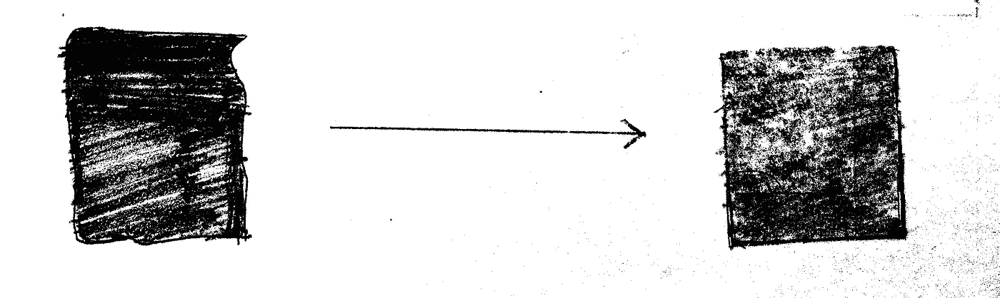
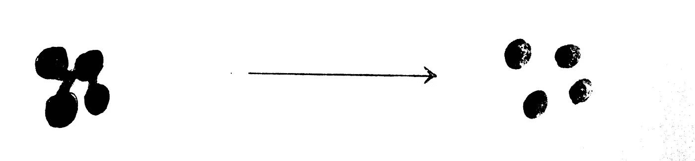
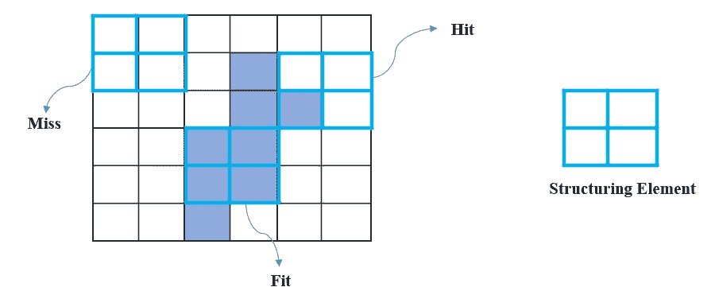
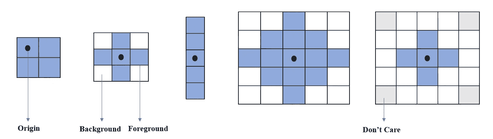
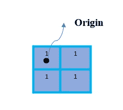
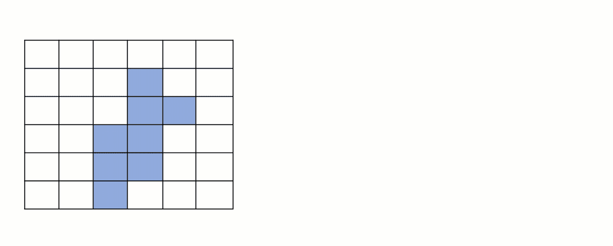
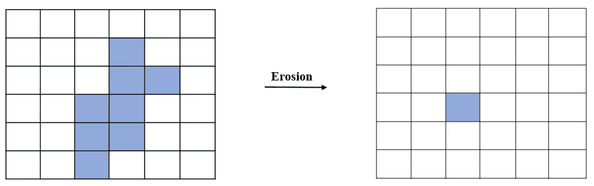
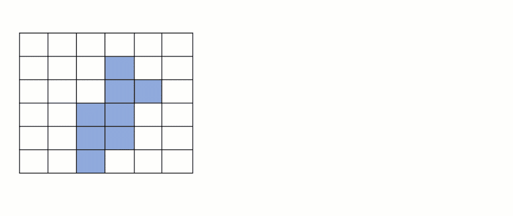
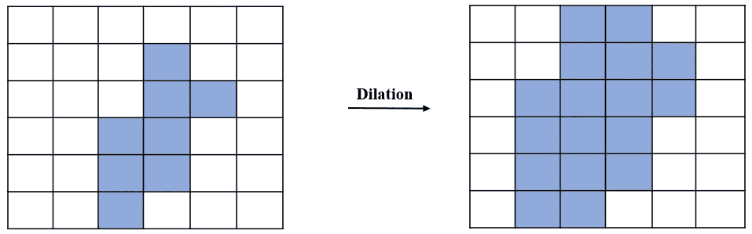
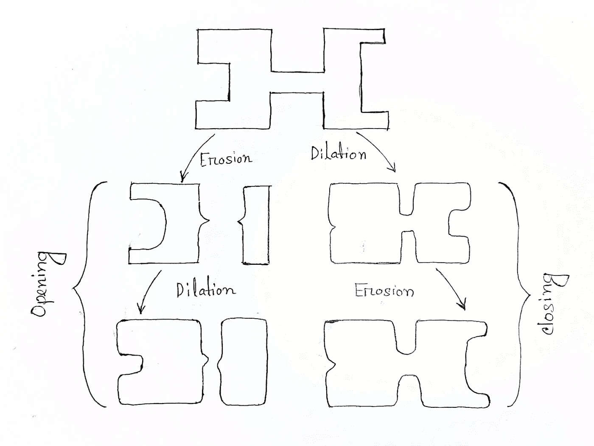

# 带有仿真的形态学操作（CV-05）

> 原文：[`towardsdatascience.com/morphological-operations-a-way-to-remove-image-distortion-513d162e7d05`](https://towardsdatascience.com/morphological-operations-a-way-to-remove-image-distortion-513d162e7d05)

## 图像处理中的形态学操作最简单解释

[](https://zubairhossain.medium.com/?source=post_page-----513d162e7d05--------------------------------)[](https://towardsdatascience.com/?source=post_page-----513d162e7d05--------------------------------) [Md. Zubair](https://zubairhossain.medium.com/?source=post_page-----513d162e7d05--------------------------------)

·发表于 [Towards Data Science](https://towardsdatascience.com/?source=post_page-----513d162e7d05--------------------------------) ·8 分钟阅读·2023 年 5 月 10 日

--


照片由 [Katharina Matt](https://unsplash.com/ko/@katharinamatt?utm_source=medium&utm_medium=referral) 提供，发布于 [Unsplash](https://unsplash.com/?utm_source=medium&utm_medium=referral)

## 动机

我们每天处理大量的图像。这些图像具有不同的强度和分辨率。有时，由于质量原因，我们无法从图像中提取适当的信息。各种图像处理技术在许多方面对我们有帮助。形态学操作是一种重要的技术，通过它我们可以减少图像的失真并对形状进行操作。请看下面的图像。



左侧是应用形态学操作前的图像，右侧是操作后的图像（作者提供的图像）

另一个例子 —



应用形态学操作前后的对比（作者提供的图像）

结果很有趣。但形态学操作的使用案例不仅限于这两种任务。*我将在本文中讨论你需要了解的所有形态学操作。*

`*[注意：主要的形态学分析适用于二值图像。如果你不知道如何创建二值图像，请阅读我之前的文章* [*图像阈值化*](https://medium.com/towards-data-science/thresholding-a-way-to-make-images-more-visible-b3e314b5215c)*。]*`

## 目录

1.  `**形态学操作详解**`

1.  `**不同类型的形态学操作及其实现**`

`2.1\. 侵蚀`

`2.2\. 膨胀`

`2.3\. 复合操作`

3\. `**结论**`

## 形态学操作详解

形态学操作是一种基于图像形状处理图像的技术。它通过比较邻近像素来构建图像。该过程适用于二值图像`({0,1} 或 {0,255})`。

**这个过程是如何工作的？**

在熟悉形态学操作之前，我们需要了解一些基本术语——***结构元素、错过、命中和适合。***



图 1：形态学操作的元素（图像由作者提供）

**结构元素**

它是一个小的形状或模板，分析图像的每个像素与元素下的邻域像素。*上图中标记为蓝色的结构元素。*

*不同的结构元素——*



图 2：不同的结构元素（图像由作者提供）

结构元素是根据图像的形状设计的。结构元素的大小可以有不同的尺寸（`2x2, 3x3, 5x1, 5x5, 等`）。结构元素包含前景和背景的强度值（即 0 或 1）。它还可以包含**无所谓**的值。结构元素的一个像素被视为**原点**。在上面的图像中，我用黑点标记了原点像素。*定义原点没有硬性规定，这取决于你。但通常，原点被认为是中心像素。*

形态学操作是通过在图像上传播结构元素来完成的。通过比较结构元素下的像素，改变图像中`**原点**`位置的像素值。

> **错过：** 如果图像中没有像素与结构元素匹配，则称为错过。见于***图 1***。
> 
> **命中：** 当结构元素的至少一个像素与图像像素重叠时，称为命中。见于***图 1***。
> 
> **适合：** 如果结构元素的所有像素与图像匹配，则称为适合。见于***图 1***。

**基本上，有两种类型的形态学操作——**

1.  `*腐蚀*`

1.  `*膨胀*`

从这两种操作中可以导出另外两种复合操作——***闭合和开操作***。

## **不同类型的形态学操作及其实现**

二值图像适合应用形态学操作。

## **腐蚀**

操作很简单。结构元素卷积对象的每个像素。如果结构元素的所有像素都与对象图像像素重叠（满足适合条件），对象图像像素将填充前景像素强度值。否则，它将填充背景像素强度值。

*假设背景为 0，前景为 1。*

```py
**if Fit -> 1
else -> 0** 
```

我创建了一个模拟以便更好地理解。为了演示目的，我使用了一个强度为 1 的 2x2 结构元素。



图 3：结构元素（作者图像）

我已经拍摄了一张 6x6 像素的图像。白色元素被视为 0 强度值，天蓝色像素被视为 1 的强度值。*现在仔细观察下面的模拟。*



侵蚀操作（作者 Gif）

结构元素会卷积到给定图像的每个像素上。如果它满足漏检或击中条件，它将把像素更改为**原始**位置的 0。在模拟中，我用红色显示了像素从 1 变为 0 的地方。最后，我们得到如下结果。



图 4：侵蚀结果（作者图像）

因此，这表明主要图像像素通过侵蚀减少了。

## 使用 OpenCV 的实际实现

`**我们将使用*OpenCV*库来实现形态学操作。在 OpenCV 库中，结构元素被称为*内核*。**`

首先，我们导入必要的库。

***我将展示图像如何随着不同的结构元素/内核大小而变化。***

+   *加载图像 —*

我们的图像在白色背景上是黑色的。`但是 [**OpenCV**](https://docs.opencv.org/4.x/d9/d61/tutorial_py_morphological_ops.html) 期望黑色背景与白色图像对象进行形态学操作。` 所以，我们将*白色背景*转换为*黑色*，并将*黑色对象转换为白色*，使用`逆二值化`。接下来，我们在*逆二值化图像*上应用`5x5、9x9 和 11x11`内核。由于我们对逆二值化图像应用了形态学操作，*在形态学操作后，我们再次应用逆二值化以保留白色背景和黑色对象。*最后，我们绘制了这些图像。

下面是带有注释的代码。

我们还可以对图像应用多个迭代，使用相同的内核大小。结果显示为 5x5 内核大小下的 1、2 和 3 次迭代。

**侵蚀的属性与编码示例**

1.  *这可以用来去除对象的额外噪声。*

*加载图像 —*

*去除外部噪声后的结果 —*

步骤类似于之前的代码`*(逆二值化 → 形态学操作 → 逆阈值化以保留原始图像背景和前景色)*`。

*2\. 将连接的图像分开。*

*编码示例 —*

加载连接图像 —

它将图像分开。

## **膨胀**

在膨胀操作中，结构元素会卷积到对象图像上。*如果结构元素的像素值与对象图像重叠（****满足击中条件****），则对象图像像素将被填充为前景像素强度值。否则，像素强度值将保持不变。*

*我们假设背景为 0，前景为 1。*

```py
**If Hit -> 1
else -> 0**
```

为了更好地理解，我创建了膨胀操作的模拟。作为结构元素，我们使用了*图-3*中的先前结构元素，并保留了与`腐蚀操作`中显示的相同图像。

*现在，仔细观察下面展示的膨胀操作。*



膨胀操作（作者提供的 Gif）

结构元素在对象图像的每个像素上从左到右、从上到下进行卷积。当满足击中或未击中条件时，结构元素原点位置的像素从 0 变为 1。否则，它保持不变。完成操作后，产生如下结果。



图-5: 膨胀结果（作者提供的图片）

所以，膨胀增加了对象图像的像素。

## **使用 OpenCv 的实际应用**

我使用了***腐蚀***部分中显示的相同图像。代码也与前一部分相同。在这一部分，我们将应用膨胀操作而不是腐蚀操作，并展示不同内核大小和迭代次数的结果。

使用不同的迭代值和相同的 5x5 内核大小，我们可以看到对象图像的形状如何变化。对于 OpenCV 的实现，我们遵循了与腐蚀部分相同的步骤`*(反向二值化阈值 → 形态学操作 → 反向阈值以保留原始图像背景和前景颜色)*`。

**膨胀操作的属性及示例**

1.  通过膨胀，我们可以减少/修复图像的断裂。

*编码示例 —*

我们加载了一个带有断裂的***‘H’***图像。

接下来，我们应用膨胀来修复断裂。

我们已经成功完成了任务。

2\. 我们可以通过膨胀去除图像的内部噪声。

*编码示例 —*

*加载带有内部噪声的图像。*

在上述图像上应用膨胀后，我们可以轻松得到没有噪声的输出图像。

## 复合操作

还有一些其他的复合形态学操作。其中，`**开操作和闭操作**`是两种广泛使用的操作。下图一览无余地展示了这些操作。



图-6: 开操作和闭操作（作者提供的图片）[1]

**开操作**通过先进行腐蚀然后进行膨胀来完成。它去除对象上的连接，同时保持形状与主对象相同。见图 6。它有助于去除背景噪声[2]。

我们可以使用 OpenCV 应用开操作，语法如下。

```py
opening = cv.morphologyEx(img, cv.MORPH_OPEN, kernel)
```

如果我们先对下一步应用膨胀和腐蚀，那么这个过程称为**闭操作**。这个过程在图-6 中展示。它有助于去除前景图像的噪声[2]。使用 OpenCV 进行闭操作的语法如下。

```py
closing = cv.morphologyEx(img, cv.MORPH_CLOSE, kernel)
```

还有其他一些复合操作，例如形态学梯度、顶帽和黑帽。

## 结论

尽管形态学操作的过程很简单，但它可以用于边界提取、填充孔洞、检测食物中的异物、加厚图像对象、提取图像骨架、清除边界等。

如果你认真阅读这篇文章，我相信你将有足够的信心在解决实际问题时应用这些技术。

## 参考文献

1.  Gonzalez, R. C. (2009). *数字图像处理*. Pearson education india.

1.  [`docs.opencv.org/4.x/d9/d61/tutorial_py_morphological_ops.html`](https://docs.opencv.org/4.x/d9/d61/tutorial_py_morphological_ops.html)

`通过以下链接加入 Medium 支持我的写作。`

[`mzh706.medium.com/membership`](https://mzh706.medium.com/membership)

我**计算机视觉**系列的其他文章 —

[`towardsdatascience.com/getting-started-with-numpy-and-opencv-for-computer-vision-555f88536f68?source=post_page-----513d162e7d05--------------------------------`](https://towardsdatascience.com/getting-started-with-numpy-and-opencv-for-computer-vision-555f88536f68?source=post_page-----513d162e7d05--------------------------------) [## 开始使用 NumPy 和 OpenCV 进行计算机视觉 (CV-01)

### 用 Python 开始你的计算机视觉编程

[`towardsdatascience.com/getting-started-with-numpy-and-opencv-for-computer-vision-555f88536f68?source=post_page-----513d162e7d05--------------------------------`](https://towardsdatascience.com/getting-started-with-numpy-and-opencv-for-computer-vision-555f88536f68?source=post_page-----513d162e7d05--------------------------------) [`towardsdatascience.com/how-color-is-represented-and-viewed-in-computer-vision-b1cc97681b68?source=post_page-----513d162e7d05--------------------------------`](https://towardsdatascience.com/how-color-is-represented-and-viewed-in-computer-vision-b1cc97681b68?source=post_page-----513d162e7d05--------------------------------) [## 计算机视觉中颜色表示的全面指南 (CV-02)

### 颜色空间和颜色模型的详细解释

[`towardsdatascience.com/how-color-is-represented-and-viewed-in-computer-vision-b1cc97681b68?source=post_page-----513d162e7d05--------------------------------`](https://towardsdatascience.com/how-color-is-represented-and-viewed-in-computer-vision-b1cc97681b68?source=post_page-----513d162e7d05--------------------------------) [`towardsdatascience.com/blend-images-and-create-watermark-with-opencv-d24381b81bd0?source=post_page-----513d162e7d05--------------------------------`](https://towardsdatascience.com/blend-images-and-create-watermark-with-opencv-d24381b81bd0?source=post_page-----513d162e7d05--------------------------------) [## 图像混合的最简单指南 (CV-03)

### 计算机视觉中图像混合和粘贴的最简单指南

[`towardsdatascience.com/blend-images-and-create-watermark-with-opencv-d24381b81bd0?source=post_page-----513d162e7d05--------------------------------`](https://towardsdatascience.com/blend-images-and-create-watermark-with-opencv-d24381b81bd0?source=post_page-----513d162e7d05--------------------------------) [`towardsdatascience.com/thresholding-a-way-to-make-images-more-visible-b3e314b5215c?source=post_page-----513d162e7d05--------------------------------`](https://towardsdatascience.com/thresholding-a-way-to-make-images-more-visible-b3e314b5215c?source=post_page-----513d162e7d05--------------------------------) [## 阈值化 — 使图像更清晰的方式 (CV-04)

### 通过阈值化从图像中提取更多信息

[`towardsdatascience.com/thresholding-a-way-to-make-images-more-visible-b3e314b5215c?source=post_page-----513d162e7d05--------------------------------`](https://towardsdatascience.com/thresholding-a-way-to-make-images-more-visible-b3e314b5215c?source=post_page-----513d162e7d05--------------------------------)
