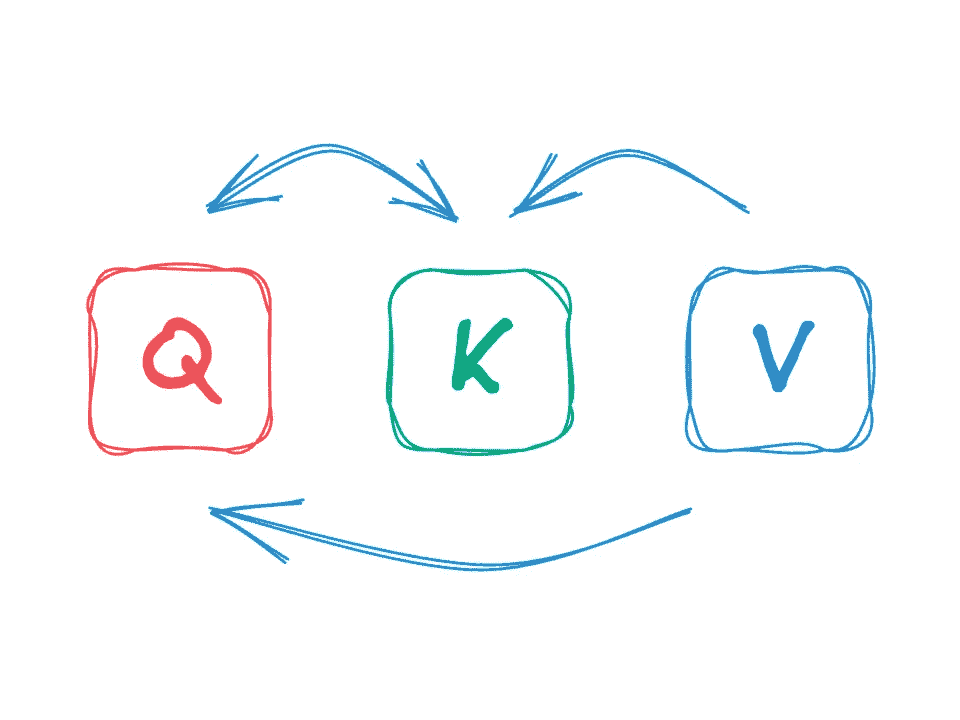
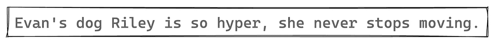
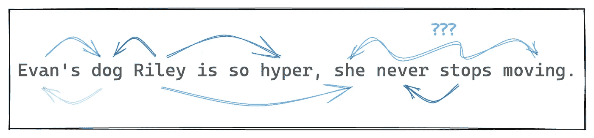
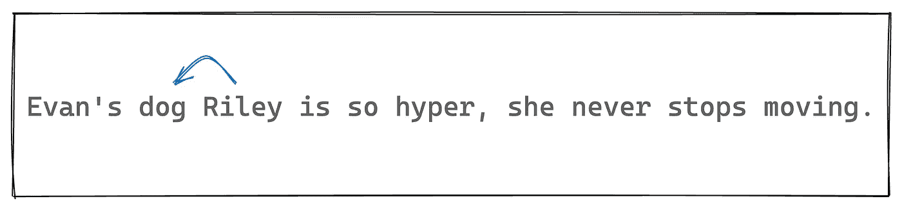
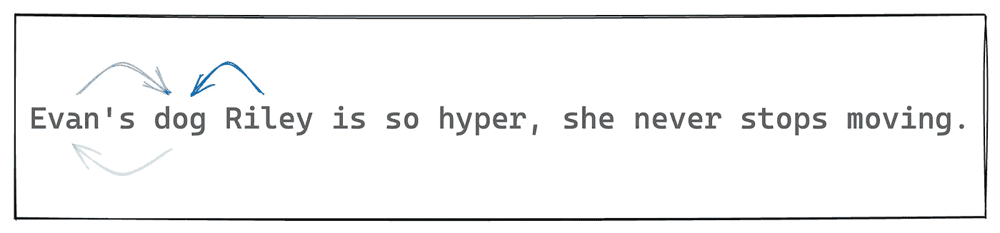
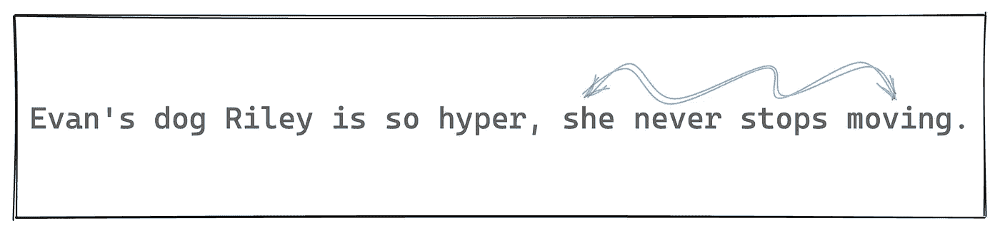

# 激励自注意力

> 原文：[`towardsdatascience.com/motivating-self-attention-aead09a02f70?source=collection_archive---------2-----------------------#2023-06-10`](https://towardsdatascience.com/motivating-self-attention-aead09a02f70?source=collection_archive---------2-----------------------#2023-06-10)

## 为什么我们需要查询、键和值？

[](https://medium.com/@ryxu?source=post_page-----aead09a02f70--------------------------------)[](https://towardsdatascience.com/?source=post_page-----aead09a02f70--------------------------------) [Ryan Xu](https://medium.com/@ryxu?source=post_page-----aead09a02f70--------------------------------)

·

[关注](https://medium.com/m/signin?actionUrl=https%3A%2F%2Fmedium.com%2F_%2Fsubscribe%2Fuser%2Fff9d266441dd&operation=register&redirect=https%3A%2F%2Ftowardsdatascience.com%2Fmotivating-self-attention-aead09a02f70&user=Ryan+Xu&userId=ff9d266441dd&source=post_page-ff9d266441dd----aead09a02f70---------------------post_header-----------) 发表在 [Towards Data Science](https://towardsdatascience.com/?source=post_page-----aead09a02f70--------------------------------) ·9 分钟阅读·2023 年 6 月 10 日[](https://medium.com/m/signin?actionUrl=https%3A%2F%2Fmedium.com%2F_%2Fvote%2Ftowards-data-science%2Faead09a02f70&operation=register&redirect=https%3A%2F%2Ftowardsdatascience.com%2Fmotivating-self-attention-aead09a02f70&user=Ryan+Xu&userId=ff9d266441dd&source=-----aead09a02f70---------------------clap_footer-----------)

--

[](https://medium.com/m/signin?actionUrl=https%3A%2F%2Fmedium.com%2F_%2Fbookmark%2Fp%2Faead09a02f70&operation=register&redirect=https%3A%2F%2Ftowardsdatascience.com%2Fmotivating-self-attention-aead09a02f70&source=-----aead09a02f70---------------------bookmark_footer-----------)

…自注意力？

本文的目标是提供一个解释，解释不是*自注意力机制如何*在变压器中工作，而是*为什么*它是这样设计的。

我们将从讨论我们希望语言理解模型具备的能力开始，接着进行自注意力机制的互动构建。在这个过程中，我们将发现为什么我们需要查询、键和值来以自然的方式建模单词之间的关系，并且 QKV 注意力是实现这一点的最简单方法之一。

本文对那些曾经接触过变压器和自注意力的读者将最有启发性，但应该对任何熟悉一些基础线性代数的人也能理解。对于那些希望更好地理解变压器的人，我会很高兴地推荐你们阅读[这篇博客文章](http://jalammar.github.io/illustrated-transformer/)。

*所有图片均由作者提供。*

变压器通常在序列到序列建模任务中呈现，如语言翻译或更明显的句子完成。然而，我认为从思考序列建模问题和具体的语言理解问题开始更容易。

所以，这里有一个我们想要理解的句子：



让我们稍微思考一下我们如何理解这个句子。

+   *Evan 的狗 Riley…* 从中我们知道 Riley 是狗的名字，而 Evan 拥有 Riley。

+   *…如此超级…* 简单来说，“hyper”指的是狗 Riley，影响了我们对 Riley 的印象。

+   *…她从不停下* 这很有趣。“她”指的是 Riley，因为狗是第一句话的主语。这告诉我们，Evan 的狗 Riley 实际上是母狗，这在之前由于狗名“Riley”常用性别中性而模糊不清。“从不停下”是一组稍复杂的词汇，进一步阐述了“hyper”。

关键是要建立对句子的理解，我们不断考虑词与词之间的关系来增强它们的含义。

在机器学习社区中，通过另一个词 **b** 的存在来增强词 **a** 的含义的过程被口语化地称为“**a** 关注 **b**”，即词 **a** 关注词 **b**。



一个箭头 **a** => **b** 表示“**a** 关注 **b**”

因此，如果我们希望机器学习模型理解语言，我们可能会合理地希望模型能够让一个词关注另一个词，并以某种方式更新其含义。

这正是我们希望在构建恰如其分地命名的（自）注意力机制的三个部分时模仿的能力。

*接下来，我将提出一些斜体的问题。我强烈鼓励读者在继续之前停下来考虑这些问题一分钟。*

## 第一部分

现在，让我们关注词“dog”和“Riley”之间的关系。词“dog”强烈影响词“Riley”的含义，因此我们希望“Riley”能够关注“dog”，因此这里的目标是以某种方式更新词“Riley”的含义。



为了使这个例子更具体，假设我们以每个词的向量表示开始，每个向量的长度为**n**，基于对词语的无上下文理解。我们将假设这个向量空间相当有序，即在空间中，意义更相似的词与更接近的向量相关联。

所以，我们有两个向量，**v_dog** 和**v_Riley**，它们捕捉了这两个词的意义。

*我们如何使用* ***v_dog*** *来更新* ***v_Riley*** *的值，从而获得一个包含“狗”意义的新词“Riley”的值？*

我们不想完全用**v_dog** 替代**v_Riley** 的值，所以我们可以将**v_Riley** 和**v_dog** 的线性组合作为**v_Riley** 的新值：

```py
v_Riley = get_value('Riley')
v_dog = get_value('dog')

ratio = .75
v_Riley = (ratio * v_Riley) + ((1-ratio) * v_dog)
```

这似乎还不错，我们已经将“狗”这个词的一部分意义嵌入到了“Riley”这个词中。

现在我们希望尝试将这种形式的注意力应用于整个句子，通过每个词的向量表示更新每个其他词的向量表示。

*这里出了什么问题？*

核心问题是我们不知道哪些词应该承担其他词的意义。我们还希望有一些衡量标准来确定每个词的值应该对其他词贡献多少。

## **第二部分**

好的。所以我们需要知道两个词之间的相关程度。

进行第二次尝试。

我已经重新设计了我们的向量数据库，使每个词实际上都有两个关联向量。第一个是我们之前拥有的相同值向量，仍然用**v** 表示。此外，我们现在有单位向量，记作**k**，它们存储一些关于词语关系的概念。具体来说，如果两个**k** 向量接近，这意味着这些词的值可能会相互影响。

*使用我们新的* ***k*** *和* ***v*** *向量，我们如何修改之前的方案，以便用* ***v_dog*** *更新* ***v_Riley*** *的值，并且尊重两个词之间的关系？*

我们继续使用之前的线性组合方法，但仅当这两个向量的 k 维接近时。更好的是，我们可以利用这两个 k 向量的点积（它们的范围是 0-1，因为它们是单位向量）来告诉我们应该如何用**v_Riley** 更新**v_dog**。

```py
v_Riley, v_dog = get_value('Riley'), get_value('dog')
k_Riley, k_dog = get_key('Riley'), get_key('dog')

relevance = k_Riley · k_dog # dot product

v_Riley = (relevance) * v_Riley + (1 - relevance) * v_dog
```

这有点奇怪，因为如果相关性为 1，**v_Riley** 会完全被**v_dog** 替代，但我们先忽略这一点。

我们接下来考虑将这种想法应用于整个序列。当我们通过**k**的点积来计算每个词的相关性值时，“Riley”将与其他每个词都有一个相关性值。因此，也许我们可以根据点积的值按比例更新每个词的值。为了简单起见，我们还可以将其与自身的点积包含在内，以保持其自身的值。

```py
sentence = "Evan's dog Riley is so hyper, she never stops moving"
words = sentence.split()

# obtain a list of values
values = get_values(words)

# oh yeah, that's what k stands for by the way
keys = get_keys(words)

# get riley's relevance key
riley_index = words.index('Riley')
riley_key = keys[riley_index]

# generate relevance of "Riley" to each other word
relevances = [riley_key · key for key in keys] #still pretending python has ·

# normalize relevances to sum to 1
relevances /= sum(relevances)

# takes a linear combination of values, weighted by relevances
v_Riley = relevances · values
```

好了，目前为止这些就足够了。

但我再次声明，这种方法存在问题。并不是说我们的任何想法实现不正确，而是这种方法与我们实际思考单词之间关系的方式存在根本性差异。

*如果在本文中有任何一点我* ***非常非常*** *认为你应该停下来思考，那就是这里。即使是那些认为自己完全理解注意力机制的人。我们的方法有什么问题？*



一个提示

单词之间的关系本质上是非对称的！“Riley”关注“dog”的方式与“dog”关注“Riley”的方式不同。“Riley”指的是一只狗，而不是人类，这比狗的名字更重要。

相比之下，点积是对称操作，这意味着在我们当前的设置中，如果 a 关注 b，那么 b 也会同样强烈地关注 a！实际上，这有些不准确，因为我们在规范化相关性分数，但重点是单词应该有机会以非对称的方式进行关注，即使其他标记保持不变。

## 第三部分

我们快到了！最后，问题变成了：

*我们如何最自然地扩展当前设置以允许非对称关系？*

那么，我们可以用另一种向量类型做什么呢？我们仍然有值向量 **v** 和关系向量 **k**。现在每个标记还多了一个向量 **q**。

*我们如何修改我们的设置并使用* ***q*** *来实现我们想要的非对称关系？*

那些熟悉自注意力工作原理的人可能会在这一点上露出会心的微笑。

当“dog”关注“Riley”时，我们计算相关性 **k_dog** · **k_Riley**，我们可以改为用 *query* **q_Riley** 与 *key* **k_dog** 的点积来进行计算。当反向计算时，我们将得到 **q_dog** · **k_Riley** —— 非对称相关性！

这就是整体内容，一次性计算每个值的更新！

```py
sentence = "Evan's dog Riley is so hyper, she never stops moving"
words = sentence.split()
seq_len = len(words)

# obtain arrays of queries, keys, and values, each of shape (seq_len, n)
Q = array(get_queries(words))
K = array(get_keys(words))
V = array(get_values(words))

relevances = Q @ K.T
normalized_relevances = relevances / relevances.sum(axis=1)

new_V = normalized_relevances @ V
```

这基本上就是自注意力机制！

我遗漏了一些细节，但重要的概念都在这里。

总结一下，我们开始使用值向量 (**v**) 来表示每个单词的意义，但很快发现需要键向量 (**k**) 来考虑单词之间的关系。最后，为了正确建模单词关系的非对称性质，我们引入了查询向量 (**q**)。感觉如果我们只能使用点积等操作，3 是每个单词建模关系所需的最小向量数量。

本文的目的是以一种比传统算法优先方法更少让人感到压倒的方式揭示自注意力机制。我希望通过这种更具语言动机的视角，查询-键-值设计的优雅和简洁能够展现出来。

我遗漏的一些细节：

+   我们不再为每个 token 存储 3 个向量，而是存储一个单一的嵌入向量，从中可以提取我们的 **q**-**k**-**v** 向量。提取过程只是一个线性投影。

+   从技术上讲，在这个整体设置中，每个词都不知道其他词在句子中的位置。自注意力实际上是一种集合操作。因此，我们需要嵌入位置信息，通常是通过将位置向量添加到嵌入向量来完成的。这并不是完全简单的，因为 transformers 应该允许任意长度的序列。具体如何在实践中运作超出了本文的范围。

+   单个自注意力层只能表示两个词之间的关系。但是通过组合自注意力层，我们可以建模更高级别的词之间关系。由于自注意力层的输出与原始序列的长度相同，这意味着我们可以对它们进行组合。实际上，transformer 模块就是由自注意力层和逐位置前馈模块组成。堆叠几百个这样的模块，花费几百万美元，你就拥有了一个 LLM！:)



OpenAI 显示出理解第二部分需要 512 个 transformer 模块。
