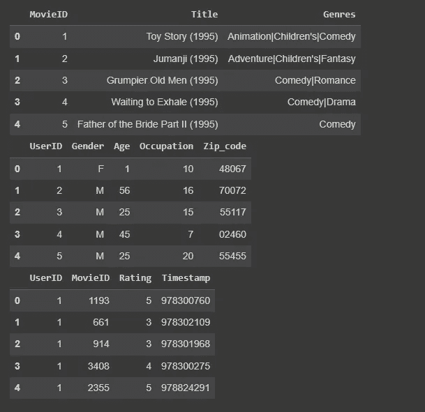
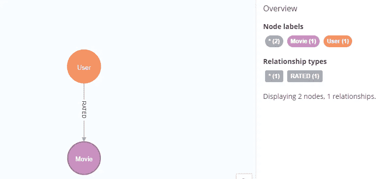
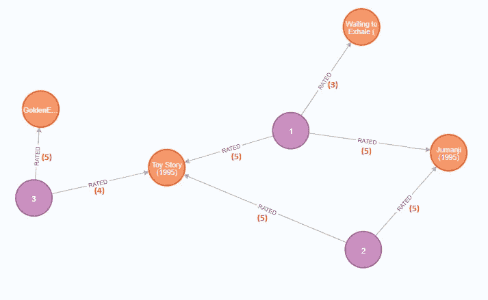
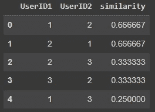
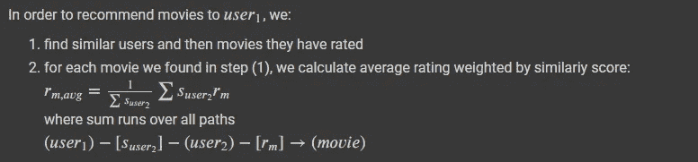
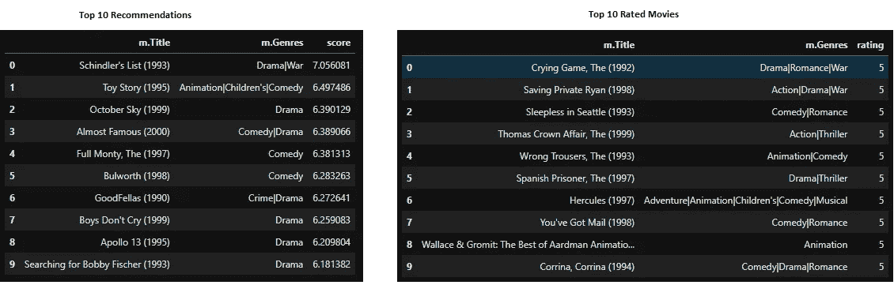

# 使用 Neo4j 的电影推荐

> 原文：[`towardsdatascience.com/movie-recommendations-with-neo4j-adaad7c9bf2b`](https://towardsdatascience.com/movie-recommendations-with-neo4j-adaad7c9bf2b)

## 使用 Python 和 Neo4j 构建一个简单的电影推荐系统

[](https://dpanagop-53386.medium.com/?source=post_page-----adaad7c9bf2b--------------------------------)[](https://towardsdatascience.com/?source=post_page-----adaad7c9bf2b--------------------------------) [Dimitris Panagopoulos](https://dpanagop-53386.medium.com/?source=post_page-----adaad7c9bf2b--------------------------------)

·发布在 [Towards Data Science](https://towardsdatascience.com/?source=post_page-----adaad7c9bf2b--------------------------------) ·阅读时间 7 分钟·2023 年 2 月 19 日

--


图片由作者使用稳定扩散和[`bytexd.com/get-started-with-stable-diffusion-google-colab-for-ai-generated-art/`](https://bytexd.com/get-started-with-stable-diffusion-google-colab-for-ai-generated-art/)中的代码创建

# **介绍**

创建推荐是机器学习的一个常见用例。在这篇文章中，我们将演示如何使用图数据库创建一个简单的电影推荐系统。所提出的方法不是最先进的。但使用图数据库的实现简单且易于解释。它们可以成为一个简单推荐系统的起点，该系统可以快速提供结果和/或作为评估更复杂系统的基准。

如果读者希望进行实验，他/她可以使用 [Neo4j 的沙盒](https://neo4j.com/sandbox/) 和 [Google 的 Colab](https://colab.research.google.com/) 在一两分钟内准备好系统。对于本文，我们将使用 [GroupLens.org](https://grouplens.org/datasets/movielens/)（即 “[1M 数据集](https://files.grouplens.org/datasets/movielens/ml-1m.zip)”）中的数据。我们还将使用一个小数据集来创建一个包含少量节点的最小图，以便可以轻松检查计算。所有用于最小图的代码和数据可以在作者的 [GitHub](https://github.com/dpanagop/data_analytics_examples/tree/master/neo4j_recommender) 中找到。

请注意：

1.  Neo4j Graph Data Science 插件应安装在 Neo4j 中（它已在 Neo4j 的沙盒中安装）

1.  在 Python 中，应安装“neo4j-driver”和“graphdatascience”库。

要在(2)中安装 Python 库，可以使用 pip

```py
!pip install neo4j-driver
!pip install graphdatascience
```

# 连接到 Neo4j

在加载必要的库后，第一步是连接到 Neo4j。可以使用以下代码片段完成此操作

```py
DB_ULR = 'bolt://xxxxx:xxxx'
DB_USER = 'neo4j'
DB_PASS = 'xxxxx'
gds = GraphDataScience(DB_ULR, auth=(DB_USER, DB_PASS))
```

如果我们使用 Neo4j 的沙盒，我们可以在“通过驱动程序连接”选项卡中找到 URL 和密码。


Neo4j 沙盒的连接详细信息（作者提供的 Neo4j 沙盒屏幕截图）

# 将数据加载到 Neo4j

如介绍中所提到的，我们将使用电影评分数据。特别是，我们将使用 MovieLens 1M 数据集。该数据集包含来自 6000 部电影的 1 百万条评分。它由三个独立的文本文件组成：

1.  **movies.dat**：电影数据，格式为 MovieID::Title::Genres

1.  **users.dat**：用户数据，格式为 UserID::Gender::Age::Occupation::Zip-code

1.  **ratings.dat**：评分数据，格式为 UserID::MovieID::Rating::Timestamp



电影、用户和评分文本文件的前五行（图像由作者提供）

我们将创建两种类型的节点。一种代表用户，另一种代表电影。我们还将创建用户节点和电影节点之间的关系，以表示用户对电影的评分。作为该关系的属性，我们将使用评分分数。图数据库的模式如下所示。



图数据库的模式（作者提供的屏幕截图）

使用图数据科学库将 pandas 数据框加载到 Neo4j 是相当简单的。例如，下面的代码加载 users.dat

```py
gds.run_cypher('create constraint if not exists for (n:User) require (n.id) is node key')
create_customer_res = gds.run_cypher('''
    unwind $data as row
    merge (n:User{id: row.UserID})
    set n.Gender = row.Gender
    set n.Age =  row.Age 
    return count(*) as custmers_created
''', params = {'data': users.to_dict('records')}) 
```

Ratings.dat 文件相当大，不能一次性加载。因此，我们需要将数据框分割并分块加载。

```py
for chunk in np.array_split(ratings,200):
  if i%10 == 0:
    print(i)
  create_rated = gds.run_cypher('''
    unwind $data as row
    match (u:User{id: row.UserID}), (m:Movie{id: row.MovieID})
    merge (u)-[r:RATED]->(m)
    set r.Rating = row.Rating
    return count(*) as create_rated
    ''', params = {'data': chunk.to_dict('records')})
  i = i+1
```

## 最小示例图

为了帮助读者理解我们将要使用的方法，我们将使用以下最小图作为示例。它包含：

+   三个用户节点，编号为 1、2 和 3

+   四个电影节点

+   七条评分关系，括号中可以看到实际评分



最小示例图（图像由作者提供）

# 使用 cypher 查找相似电影

使用 cypher，找到与给定电影相似的电影非常简单。给定一部电影 m1，可以找到所有以最高评分（5）对其进行评分的用户，然后返回这些用户也评分为优秀的其他所有电影。通过计算连接 m1 和每部其他电影的路径数量，我们可以计算相似度得分。

例如，查找与“玩具总动员（1995）”相似电影的 cypher 查询如下。

```py
# Check similar movies
similar_movies = gds.run_cypher('''
    MATCH(m1:Movie)-[r1]-(u:User)-[r2]-(m2:Movie)
    WHERE m1.Title CONTAINS 'Toy Story (1995)'
      AND m2.Title<>'Toy Story (1995)'
      AND r1.Rating=5 AND r2.Rating=5
    RETURN m2.Title,m2.Genres,count(DISTINCT(u)) as number_of_paths
    ORDER BY common_users DESC
''')
similar_movies.head()
```

在我们的最小图示例中，这将返回“勇敢者游戏（1995）”，它与“玩具总动员（1995）”通过两条路径连接。一条路径经过用户 1，另一条路径经过用户 2。

当我们使用我们常规的包含一百万条评分的图时，与“玩具总动员（1995）”最相似的五部电影是

1.  《星球大战：第四集 — 新希望（1977）》

1.  《玩具总动员 2（1999）》

1.  《夺宝奇兵（1981）》

1.  《星球大战：第五集 — 帝国反击战……》

1.  《肖申克的救赎（1994）》

而对于“黑客帝国（1999）”，前五名是

1.  《星球大战：第四集 — 新希望（1977）》

1.  星球大战：帝国反击战……

1.  夺宝奇兵（1981）

1.  美国美人（1999）

1.  第六感（1999）

一些读者可能对这些结果感到复杂，这是可以理解的。使用这种方法时，受欢迎的电影和高评分的电影往往占据主导地位。事实是，一百万条评分还不足以建立一个推荐系统。使用 MovieLens 和各种推荐方法的经验表明，增加评分数量可以改善推荐。然而，应该注意的是，我们仅通过简单查询就能利用图找到相似的电影。更复杂的方法是使用类似于下一节描述的查找相似用户的方法。

# 向用户推荐电影

使用 Neo4j，我们可以应用[协同过滤](https://en.wikipedia.org/wiki/Collaborative_filtering)来向用户推荐电影。协同过滤方法的高层次描述是，向用户推荐新电影的过程分为两个步骤：

1.  我们找到与我们的用户相似的用户，

1.  我们使用步骤（1）中找到的用户评分来建议新电影。

## 计算用户相似度

我们将使用 Jaccard 相似度来检测相似用户。在我们的图论设置中，两个节点之间的 Jaccard 相似度是它们都连接的节点数量与连接到至少一个节点的节点数量的比率（不包括我们计算相似度的两个节点）。

在我们的最简图示例中，用户节点 1 和 2：

+   都连接到“玩具总动员（1995）”和“勇敢的心（1995）”

+   连接到“玩具总动员（1995）”、“勇敢的心（1995）”和“呼吸等待（1995）”

因此，用户 1 和用户 2 的 Jaccard 相似度为 2/3。

同样，用户 1 和用户 3：

+   都连接到“玩具总动员（1995）”

+   连接到“玩具总动员（1995）”、“勇敢的心（1995）”、“呼吸等待（1995）”和“黄金眼（1995）”

因此用户 1 和用户 3 的 Jaccard 相似度为 1/4。

Neo4j 的图数据科学库可以计算 Jaccard 相似度。首先，我们需要创建一个子图（或者 Neo4j 称之为投影），包含我们在计算 Jaccard 相似度时需要考虑的节点和关系。

```py
# Create projection
create_projection = gds.run_cypher('''
   CALL gds.graph.project(
    'myGraph',
    ['User', 'Movie'],
    {
        RATED: {properties:  'Rating'}
            } 
);
''')
```

然后，我们计算 Jaccard 相似度并将结果存储在 pandas 数据框中。

```py
# Get user similarity
users_similarity = gds.run_cypher('''
CALL gds.nodeSimilarity.stream('myGraph')
YIELD node1, node2, similarity
RETURN gds.util.asNode(node1).id AS UserID1, gds.util.asNode(node2).id AS UserID2, similarity
ORDER BY similarity DESCENDING, UserID1, UserID2
''')
```



pandas 的前五行包含我们最简图示例图的用户相似度（图像由作者提供）

最后，我们在用户节点之间创建一个新的关系，作为它们之间计算出的相似度的属性。

```py
# Create Similar relationship
i=1
for chunk in np.array_split(users_similarity.query('UserID1>UserID2'),10):
  print(i)
  create_similar = gds.run_cypher('''
    unwind $data as row
    match (u1:User{id: row.UserID1}), (u2:User{id: row.UserID2})
    merge (u1)-[r:SIMILAR]->(u2)
    set r.Similarity=row.similarity
    return count(*) as create_rated
    ''', params = {'data': chunk.to_dict('records')})
  i = i+1
```

为了向用户（user1）推荐电影，我们计算用户尚未评分的电影的排名，使用其他用户观看过的电影的加权平均评分，其中权重为 Jaccard 相似度。



计算加权平均评分的公式（图像由作者提供）

我们还添加了连接用户（user1）到电影的路径数量的对数。这是因为我们想要提升与（user1）连接的有多个用户的电影。对应的 cypher 查询是

```py
# Check similar movies
similar_movies_for_user = gds.run_cypher('''
    MATCH (u1:User)-[r1:SIMILAR]-(u2)-[r2:RATED]-(m:Movie)
    WHERE id(u1)=$id
    AND NOT ( (u1)-[]-(m))
    RETURN m.Title,m.Genres,Sum(r1.Similarity*r2.Rating)/sum(r1.Similarity)+log(count(r2)) as score
    ORDER BY score DESC
''',params = {'id':2})
```

对于我们的最小图示例，用户 3 的结果是：

+   《勇敢者游戏》（1995 年），评分为 5.69

+   《呼吸等待》（1995 年），评分为 3.00



用户的前 10 部电影推荐（左侧）和用户的前 10 部评分最高的电影（右侧）（图片由作者提供）

## 结论

希望这篇文章已经展示了使用图数据库来快速创建推荐引擎的好处。虽然这不是最先进的技术，但它易于实现和维护。作为附加 bonus，我希望这篇文章也提供了一些将 Python 与 Neo4j 结合的有用技巧。

使用的数据集引用：

F. Maxwell Harper 和 Joseph A. Konstan. 2015\. 《MovieLens 数据集：历史与背景》。ACM 互动智能系统交易（TiiS）5, 4, 文章 19（2015 年 12 月），19 页。DOI=[`dx.doi.org/10.1145/2827872`](http://dx.doi.org/10.1145/2827872)
