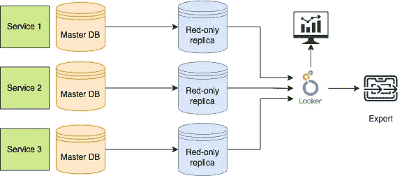
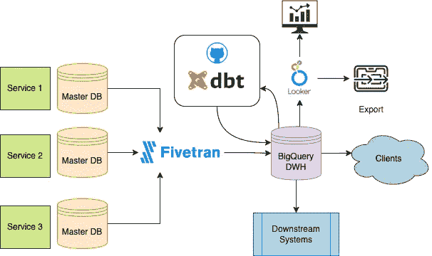

# 多区域数据源

> 原文：[`towardsdatascience.com/multi-regional-source-of-truth-d43e1cc9e098?source=collection_archive---------17-----------------------#2023-03-14`](https://towardsdatascience.com/multi-regional-source-of-truth-d43e1cc9e098?source=collection_archive---------17-----------------------#2023-03-14)

## 以 BigQuery 作为数据仓库的多区域 BI 解决方案

 [Andrey Shalitkin](https://medium.com/@andrey.shalitkin_96428?source=post_page-----d43e1cc9e098--------------------------------)

·

[关注](https://medium.com/m/signin?actionUrl=https%3A%2F%2Fmedium.com%2F_%2Fsubscribe%2Fuser%2F4657f2001666&operation=register&redirect=https%3A%2F%2Ftowardsdatascience.com%2Fmulti-regional-source-of-truth-d43e1cc9e098&user=Andrey+Shalitkin&userId=4657f2001666&source=post_page-4657f2001666----d43e1cc9e098---------------------post_header-----------) 发表在 [Towards Data Science](https://towardsdatascience.com/?source=post_page-----d43e1cc9e098--------------------------------) · 8 分钟阅读 · 2023 年 3 月 14 日

--

图片由 [Lars Kienle](https://unsplash.com/@larskienle) 提供，来源于 [Unsplash](https://unsplash.com/)

我在一年前创建了一篇关于从 Postgres 迁移到 Snowflake 的[文章](https://medium.com/towards-data-science/from-postgres-to-snowflake-f4b403548066)，现在这里有另一个迁移案例。这一次我将集中于业务案例、架构和设计，而不是技术方面，但我也会尝试分享一些可能有用的技巧。

# 业务案例

这是一个 B2B（企业对企业）业务。公司是一个 AaaS（应用即服务）提供商。它的软件下载作为在线服务，供全球多个国家的客户使用。它主要需要一个 BI（商业智能）系统来为客户提供数据访问。以下是最有趣的要求：

+   一些客户需要访问现成的仪表板和可视化，而有些客户希望将数据提取到他们的 DWH 中。

+   由于客户在不同国家运营，数据应保持在最初创建的区域内。

+   客户应该只能看到他们的信息。对于相同的区域，数据存储在同一数据库和相同表中，因此必须应用行级安全。

+   在大多数情况下，客户希望实时数据。

让我先介绍一下现有架构的样子：

作者提供的图表

关键特性是读取只读副本以提取数据，没有 DWH，并且在其上使用 Looker。显而易见的优点是这是设置最快的解决方案。副本通常具有实时数据。Looker 负责数据转换、语义层和可视化。Looker 还通过不同的过滤器实现行级安全。不幸的是，这可能是唯一的优点，它还有许多缺点。

+   应用任何现代数据工程技术的能力非常有限。我们不能保存转换后的数据，不能使用适当的工具进行转换、实现管道、自动测试等。基本上，唯一可用的工具是 Looker Derived Tables 功能。

+   由于没有 DWH，无法从其他来源（如 CRM）提取数据，也无法混合来自不同服务的数据或上传任何静态字典。BI 系统仅限于由特定软件产品保存的数据。

+   如我之前提到的，一些客户需要提取数据，并希望获得尽可能低级和原始的数据。Looker 在提供报告方面做得很好，但它在其语义层之上工作，语义层已经有一些联接，并且并非所有字段都可用，每个 Looker 探查都是为特定业务流程设计的。结构并未针对导出进行优化。

+   性能。这可能是最大的问题，因为 OLTP 数据库不适合分析用途，并且由于我们使用的是只读副本，无法控制索引。这不仅导致初始性能缓慢，还会导致性能下降，因为没有索引时，数据越多查询速度越慢。

# 解决方案

解决这些缺点的最直接方法是引入 DWH 层，我们确实这样做了。新的设计如下所示：

作者提供的图表

# 流数据

市场上有多种流媒体提供商可供选择，我们选择了 Fivetran，但也可以看看 Stitch、Airbyte 或其他开源框架，如 Meltano 或 Singer。我们也考虑过 Google Storage Transfer Service，但它还处于原始状态，灵活性不足。

流媒体设置的整个过程当然不是没有问题的。以下是其中一些问题：

+   OLTP 数据库没有公共访问权限，因此必须为 Fivetran 设置 VPN 以拉取数据。这涉及一些网络配置，并需要反复讨论以决定既适用于 Fivetran 又适用于我们的解决方案。

+   Fivetran 增加了数据库的负载，因此我们必须设置额外的监控，确保流媒体不会影响主要功能。

+   最初的计划是每 5 分钟同步一次数据，但由于更改量巨大，导致连接超时并在日志中抛出错误。Fivetran 能够恢复，因此没有数据丢失，但生成了混乱，使得很难区分实际错误和这些过载错误。没有简单的解决方案，只能放宽对实时数据的要求，减少数据拉取的频率。

# 转换数据

选择 BigQuery 主要是因为它满足了我们所有的要求，并且大多数现有基础设施也在 Google 云中，因此过渡本应顺利。

由于我们现在有了可读写的 DWH，我们能够利用 [DBT](https://www.getdbt.com/) 工具进行数据转换，并将来自不同来源的数据混合在一起。即使没有任何转换，通过 Looker 查询之前相同的数据，但从 BigQuery 中获取，性能也有了显著提高，有时对重表的提升超过了**100 倍**。

我不会详细讨论 Looker 的数据准备，因为它非常领域特定。更有趣的是我们如何解决数据导出问题。总的来说，这很简单，我们只是给了客户对 BigQuery 的直接访问权限，但细节中的问题需要关注，所以让我分享一些细节。

实现的最简单要求是将数据保存在不同的区域。幸运的是，BigQuery 中每个数据集的区域是可配置的。Fivetran 将数据流入不同的数据集，而 DBT 模型则针对这些数据集分别运行，因此来自不同区域的数据完全不会混合。

实现行级安全性以确保客户仅能访问他们的数据要复杂一些。BigQuery 支持行级安全性，但由于我们使用 DBT，因此选择了不同的方法，以更好地控制数据暴露和更多自动化选项。

我们创建了一组 DBT 模型，这些模型根据当前连接用户的信息在 SQL 代码中应用安全性，并在 BigQuery 中创建视图。更准确地说：

+   需要访问的每个客户都提供用户/服务帐户。IAM 角色具有对 BigQuery 的通用访问权限，但没有对任何特定数据集的访问权限，因此，初始状态下，新用户无法查询数据

+   新用户电子邮件与客户识别信息一起添加到 DBT 种子文件中。不同地区的文件分别保存。这提供了用户-客户映射以及用户应该访问的数据集的信息。种子文件存储在 GitHub 中，因此我们可以在此文件的每次更改时运行 GitHub 操作

+   GitHub Action 在不同地区运行参数化的 DBT 项目。地区和数据不同，但结构相同，因此我们只需为每个视图编写一次 SQL 代码。DBT 上传种子文件，创建视图，最后一步是为各个用户提供对所需数据集的只读访问权限

+   视图通过`session_user()`函数识别当前登录的用户电子邮件，将其与用户-客户映射连接，并筛选出与客户无关的所有内容。

这里有一个我想分享的非常具体的情况，即授予 oAuth 用户访问权限。在 Google IAM 中有两种类型的用户：服务帐户和 oAuth 用户。处理第一种用户比较简单，但并非所有下游系统都支持这种访问方式。例如，Tableau online 无法使用服务帐户。第二种类型是普通用户登录 Google 帐户的方式。有关如何确保这种用户仅访问特定数据集的文档非常有限，因此这里是一些提示：

+   用户应该拥有`BigQuery Job`用户的所有权限，并额外具有`bigquery.jobs.create`权限

+   数据集级权限可以像服务帐户一样授予，例如使用 SQL GRANT 命令

+   用户不一定需要由相同的 Google 帐户创建。例如，来自其他组织的人可以获得访问权限，只要他们的 IAM 权限在我们的项目中配置正确

+   小心组电子邮件。虽然数据集级别的访问权限正常工作，但`session_user()`返回的是用户的个人电子邮件，因此行级安全性无法与组电子邮件一起使用

最后一个要提到的提示是，由于我们客户端只能访问视图而不能访问表格，因此视图应该能够从其他数据集查询数据，而无需将原始数据暴露给客户端。BigQuery 具备这样的能力，可以允许一个数据集中的所有视图查询另一个数据集中的数据，而不受最终用户权限的限制。

# BigQuery 监控

由于客户可以直接访问 DWH，因此了解每个客户如何使用这些功能非常重要。由于每个客户都与用户绑定，因此在用户级别的监控应该能够回答这个问题。我遇到了一篇关于如何做到这一点的有趣文章，我们刚刚在 Looker 中重新实现了相同的方法。

基础设施的另一个部分是 Github，更准确地说是 GitHub Actions。此功能允许创建执行工作流并设置计划。像[这个](https://github.com/marketplace/actions/dbt-action)这样的开源操作可以帮助实现这一点，唯一需要支付的就是 GitHub 的使用时间。

# 单一真实数据源

我最后要提到的是解决方案的灵活性。我已经描述了主要和最有趣的案例，但公司还有其他服务，凭借当前的解决方案，我们能够将所有这些服务的分析转移到我们的 DWH 系统中，并将其用作下游系统的真实数据源。换句话说，它也作为数据馈送存在。DBT 被用来为所有业务案例生成视图和表格，而数据集级别的访问允许在数据级别分离下游系统和用户。

DBT 的灵活性允许在一个项目中为不同的下游系统创建模型，这一过程通过前面提到的 GitHub 实现自动化。
