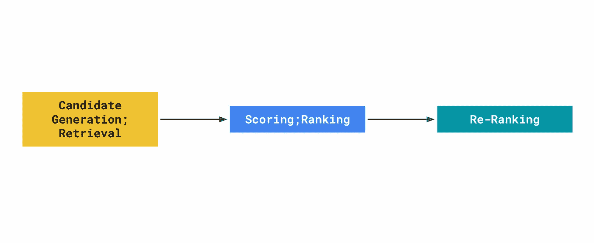
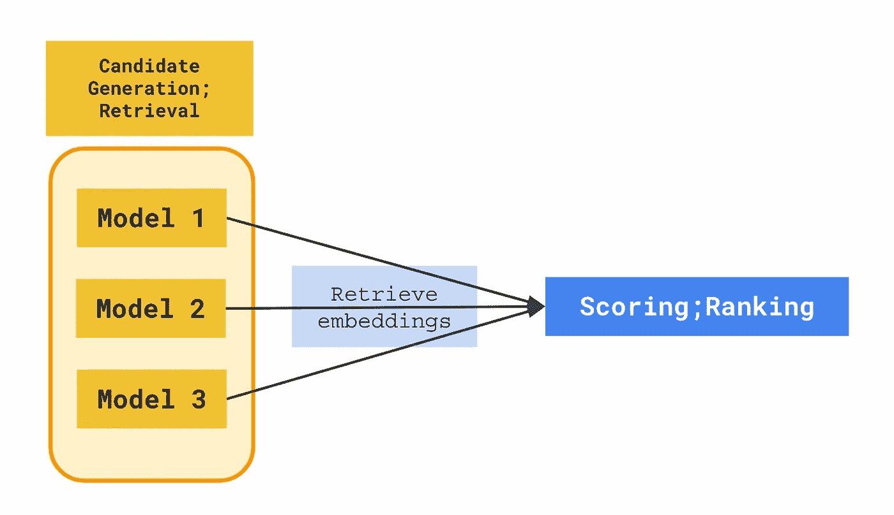

# 多阶段推荐系统构建方法

> 原文：[`towardsdatascience.com/multi-stage-approach-to-building-recommender-systems-71a31e58ecb4?source=collection_archive---------4-----------------------#2023-01-01`](https://towardsdatascience.com/multi-stage-approach-to-building-recommender-systems-71a31e58ecb4?source=collection_archive---------4-----------------------#2023-01-01)

## 发现构建推荐系统的最先进方法

 [Nathan Cheng](https://natworkeffects.medium.com/?source=post_page-----71a31e58ecb4--------------------------------)

·

[关注](https://medium.com/m/signin?actionUrl=https%3A%2F%2Fmedium.com%2F_%2Fsubscribe%2Fuser%2F9dbd159f0e0a&operation=register&redirect=https%3A%2F%2Ftowardsdatascience.com%2Fmulti-stage-approach-to-building-recommender-systems-71a31e58ecb4&user=Nathan+Cheng&userId=9dbd159f0e0a&source=post_page-9dbd159f0e0a----71a31e58ecb4---------------------post_header-----------) 发表在 [Towards Data Science](https://towardsdatascience.com/?source=post_page-----71a31e58ecb4--------------------------------) · 9 分钟阅读 · 2023 年 1 月 1 日 

--

多阶段推荐系统。图像来源 [作者](https://natworkeffects.medium.com)。

# # 1 信息超载的问题

我们都对搜索引擎和推荐系统并不陌生。没有它们，我们会被每秒钟产生的大量信息所淹没。这些信息可能有不同的数据格式 —— ***文本***、***图像***、***音频***、***视频*** 等。

从根本上讲，这些系统可以在拥有大量信息目录的情况下，根据用户的查询或个人资料，呈现、过滤和排序相关项目，使我们能够在信息的海洋中进行导航，否则用户会因信息过载而挣扎。

如本帖标题所提，我们将重点讨论推荐系统。我可能会在未来的文章中单独介绍搜索系统设计，请关注。

# # 2 个行业推荐系统的用例

## 你需要一个推荐系统吗？

公平地说，80% 的公司不会有建立复杂推荐系统的需求。对于小型目录和少量产品类别，使用动态 SQL 查询就足够了。

如果你想例如，在项目描述页面上建立一个 **“类似的项目…”** 或 **“你可能也喜欢…”** 面板，你会编写一个 SQL 查询，以检索当前 `类别` 的 `top xx items`。

如果你想在网站首页上建立一个 **“为你推荐…”** 面板，或在营销邮件中发送推荐项目列表，同样适用。只需检索用户在历史时间段内查看的顶级项目类别，并编写相同的动态 SQL 查询以基于用户的历史互动数据检索推荐项目。

探索你的网站的用户也能够扫描整个目录，以寻找他们需要的内容，而不会感到不知所措。

## 影响是否需要推荐系统的因素

**项目目录大小：**

+   随着目录规模的增加，通过手动过程标记每个项目的元数据变得更加繁琐和昂贵。

+   在市场等商业模式中，其中项目列表完全由用户众包，确保高质量的项目元数据标签几乎是不可能的。

+   我们必须寻找生成推荐的替代方法，而不仅仅是使用简单的 SQL 查询。

**缺乏结构化数据：**

+   对于某些公司，表格格式的结构化数据可能甚至没有被收集。相反，他们可能拥有一个包含视频、图像、自由文本、文章的存储库，这些可以被挖掘用于生成推荐。

+   使用非结构化数据作为该想法的基础需要采用深度神经网络方法，将非结构化数据编码为结构化的数值数据，以学习有意义的表示。

+   **结构化** — 表格格式的数据，具有明确定义的模式。

+   **非结构化 — *文本***，***图像***，***音频***，***视频***

**可重复的业务指标改进过程：**

+   如果没有可重复的实验过程，就无法测试新技术来改进对用户的推荐。此外，也无法监控系统更改是否对关键业务指标产生了实际影响。

+   推荐系统已被证明能够改善业务指标，例如点击率、转化率、加购物车购买、新项添加到购物车、收听/观看时间等。

+   实施第一个推荐系统并不一定能保证你会有一个可重复的实验过程开始，但它是迈向这一目标的第一步。

## 推荐系统案例研究

**以下是一些社会中普遍存在的推荐系统示例用例，按行业分类：**

**行业中的推荐系统使用案例：**

+   在线商务: [eBay — 基于深度学习的个性化推荐检索系统](https://tech.ebayinc.com/engineering/building-a-deep-learning-based-retrieval-system-for-personalized-recommendations)

+   时尚: [ASOS — ASOS 的时尚推荐](https://www.youtube.com/watch?v=kGuaEqEsxKM)

+   音乐: [Spotify — 自动音乐播放列表续集](https://research.atspotify.com/publications/recsys-challenge-2018-automatic-music-playlist-continuation)

+   视频: [YouTube — 用于推荐的深度神经网络](https://research.google/pubs/pub45530/)

+   图片: [Pinterest — 统一视觉嵌入以进行视觉搜索](https://medium.com/pinterest-engineering/unifying-visual-embeddings-for-visual-search-at-pinterest-74ea7ea103f0)

+   书面内容: [纽约时报 — 构建下一个推荐引擎](https://archive.nytimes.com/open.blogs.nytimes.com/2015/08/11/building-the-next-new-york-times-recommendation-engine)

+   在线约会: [Tinder — 使用 TinVec 的个性化推荐](https://www.youtube.com/watch?v=j2rfLFYYdfM)

+   在线游戏: [Steam — 在线视频游戏平台的推荐系统](https://www.researchgate.net/publication/333072035_Recommender_Systems_for_Online_Video_Game_Platforms_the_Case_of_STEAM)

+   旅行住宿: [Expedia — 使用 Hotel2Vec 的推荐](https://medium.com/expedia-group-tech/expedia-group-recsys-2021-ff791f42ba07)

+   医疗采购: [Novartis AG — 使用 Amazon OpenSearch KNN 和 SageMaker 提供搜索和推荐服务](https://aws.amazon.com/blogs/industries/novartis-ag-uses-amazon-elasticsearch-k-nearest-neighbor-knn-and-amazon-sagemaker-to-power-search-and-recommendation)

+   食品配送: [Instacart — 个性化学习用户的推荐](https://www.instacart.com/company/how-its-made/personalizing-recommendations-for-a-learning-user)

+   住房和公寓: [Zillow — 基于房屋嵌入的相似房屋推荐](https://www.zillow.com/tech/embedding-similar-home-recommendation/)

+   租赁和办公室租赁: [WeWork — 推荐系统](https://www.youtube.com/watch?v=-R1loUK_EdA)

+   招聘和候选人搜索: [LinkedIn — 通过个性化 AI 实现高质量匹配](https://engineering.linkedin.com/blog/2020/quality-matches-via-personalized-ai)

**在线教育、在线银行、保险也是我期望找到成功案例的行业，但信息很少。**

## 构建和设计推荐系统

在现实世界中，IT 系统通常是多个服务共同工作的集合。构建推荐系统是一种分层、多阶段的过程，每个阶段使用适当类型的模型。

让我们来看看机器学习工程师在构建推荐系统时所经历的阶段。

# # 3 推荐系统设计

多阶段推荐系统。图片由 [作者](https://natworkeffects.medium.com) 提供。

上图展示了构建推荐系统的事实标准。最先进（SOTA）的推荐系统将系统工程分解为这个三阶段的过程。

**关于模型服务的说明：** 在每个阶段，我们还需要考虑如何暴露或服务已经为下游消费者构建的机器学习模型。

我们将在后续部分中探讨每个阶段。

## 候选生成；检索

候选生成在一些推荐系统文献中也被称为**检索**阶段。项目目录可能会增长到数十万、数百万或数十亿项。

候选生成方法能够通过高效比较项目之间的相似性，使用距离度量选择前一百个最相关的项目。

首要的想法是学习用户和项目的数值向量表示，即输入数据。这些向量，称为嵌入，可以被写入数据库或最近邻索引中，后续系统可以从中检索它们。

一旦我们有了用户和项目的嵌入，就可以使用距离度量如欧氏距离、点积、余弦相似度等计算它们在嵌入空间中的相似性。

候选生成旨在通过一种高效的方法来缩小潜在候选的数量，该方法返回数百个候选结果，并在下一阶段进行排序。通常，会建立多个候选生成器，这些生成器使用不同的方法进行训练，每个生成器利用其特定的数据集。

**为什么不直接进入评分阶段？**

一个常见且合理的问题是，为什么不直接进入评分阶段？为什么要经过生成嵌入的过程来进行候选生成？

这里有几个需要考虑的要点：

1.  生成嵌入是一个关键的特征工程步骤。这些向量值可以在下游作为输入特征值重复使用，以进一步提高下游评分模型的准确性。

1.  候选生成模型可以在非结构化数据上进行训练，并使用多维向量表示项或用户的非结构化数据属性。这些有用的信息，如***文本***、***图像***、***音频***、***视频***，否则将被忽视。

1.  嵌入空间中每个项或用户的语义视觉理解。你可以使用如[TensorBoard Embedding Projector](https://www.tensorflow.org/tensorboard/tensorboard_projector_plugin)这样的工具在二维空间中可视化高维向量。这样，你也可以观察，并应用聚类算法发现相似对象的簇。

1.  候选生成模型的输出旨在建立项或用户之间的相似性。这个想法在大多数推荐系统产品中是基础的。例如**“类似于…”**或**“与你相似的用户也喜欢…”**。

1.  高效服务模型结果。使用近似最近邻（ANN）引擎来服务候选生成模型也很高效。有关 ANN 算法的更多信息，请参阅视频：[Approximate Nearest Neighbors: Data Science Concepts](https://www.youtube.com/watch?v=DRbjpuqOsjk)。**与评分阶段对比——在评分模型训练过程中，你还需计算所有工程特征，API 才能返回模型结果。**

如前所述，服务这些嵌入是通过暴露 ANN 引擎来完成的。市场上有许多选择，包括开源和公共云，以下是一些选项：

+   开源：[Facebook faiss library](https://github.com/facebookresearch/faiss)

+   AWS：[Amazon OpenSearch](https://docs.aws.amazon.com/opensearch-service/latest/developerguide/knn.html)

+   GCP：[Vertex AI Matching Engine](https://cloud.google.com/vertex-ai/docs/matching-engine/ann-service-overview)

只需使用这些服务中的一个，选择你的距离相似性度量，下游消费者可以调用 API 以检索对象嵌入。

另一种方法是将对象嵌入写入数据库，下游系统查询数据库以检索这些嵌入。这本质上就是[Spotify 使用 Cloud Bigtable](https://www.youtube.com/watch?v=807uHC0Ia10)所做的。

# 评分；排名

评分在一些推荐系统文献中也被称为**排名**阶段。它是在候选生成之后发生的阶段。下图展示了这一过程的可视化表示：

多候选生成模型。图片由[作者](https://natworkeffects.medium.com)提供。

在从多个候选生成模型中检索出前一百个候选项后，每个候选项的嵌入可以与有关项目和用户的其他输入数据（如日期时间、类别、设备类型等）一起组织成结构化的表格格式。评分是一个监督学习问题，因此我们必须确保传递相关业务指标的标记训练数据。

**评分是一个可选的阶段**

根据你是否有标记的训练数据，你的公司可能没有评分阶段。这完全没问题，有些公司仅依靠候选生成阶段来支持它们的推荐系统产品。**为内部数据工程过程建立正确的遥测以生成标记的训练数据集可能需要更多的时间和精力。**

评分是一个分类问题。分类模型的输出是一个概率评分，能够让你按从最可能提升业务指标的候选项到最不可能提升的候选项进行排名。这些业务指标的示例包括点击率、视频观看时间、项目添加到购物车等。

为了服务于评分模型的输出，你可以发布一个带有模型版本的 API 端点。下游系统需要调用 API，使用基本输入特征（我们必须小心不要引入数据泄漏），然后评分模型将计算工程特征，并返回一个按概率评分排序的项目列表。

在所有 3 个公共云提供商上部署这样的端点有简单的选项：

同样，若通过批处理端点检索的排名结果可以缓存到数据库中，以便稍后由下游应用程序检索。

# 重新排序

在通过分配概率评分对项目进行排序后，系统还可以重新排序这些有序的项目列表。重新排序有几个好处，即：

1.  项目质量——去除恶意项目，如虚假/盗版/诈骗产品、低质量的项目列表、点击诱饵等，这些可能会对用户信心产生负面影响，阻止他们使用平台。

1.  项目多样性——我们可以推荐用户以前未见过的项目，或者推荐用户通常查看的不同类别的项目，以鼓励平台上的发现和探索。

当你针对业务指标进行优化时，你可能会遇到[指标腐败](https://www.nngroup.com/articles/campbells-law/)——这会鼓励不良行为者采取某些恶意行为。重新排序阶段旨在通过考虑与评分阶段优化的主要指标互补的其他指标来减轻这一问题。

重新排名的过程可以是简单的业务规则，以确保填充项目的强制字段，或者可以训练一个独立的模型来学习恶意行为者或具有恶意意图的项目的特征。服务这些模型将类似于在评分阶段描述的方法。

为了促进平台上新项目的发现并鼓励多样性，公司在向最终用户提供排名项目列表时，也利用多臂老虎机算法的变体，以在探索与开发之间取得平衡，但这是一个需要专门博客文章讨论的主题。

# # 4 特别感谢 / 参考文献

> *特别感谢以下资源的作者和创作者，他们帮助我写了这篇文章：*

+   📚 [Google 开发者推荐系统课程](https://developers.google.com/machine-learning/recommendation)

+   🎦 [近似最近邻：数据科学概念](https://www.youtube.com/watch?v=DRbjpuqOsjk)

+   🎦 [Spotify 大规模音乐推荐与 Cloud Bigtable](https://www.youtube.com/watch?v=807uHC0Ia10)

*最初发表于* [*https://natworkeffects.com*](https://natworkeffects.com/posts/multi-stage-approach-to-building-recommender-systems) *于 2023 年 2 月 10 日。*
