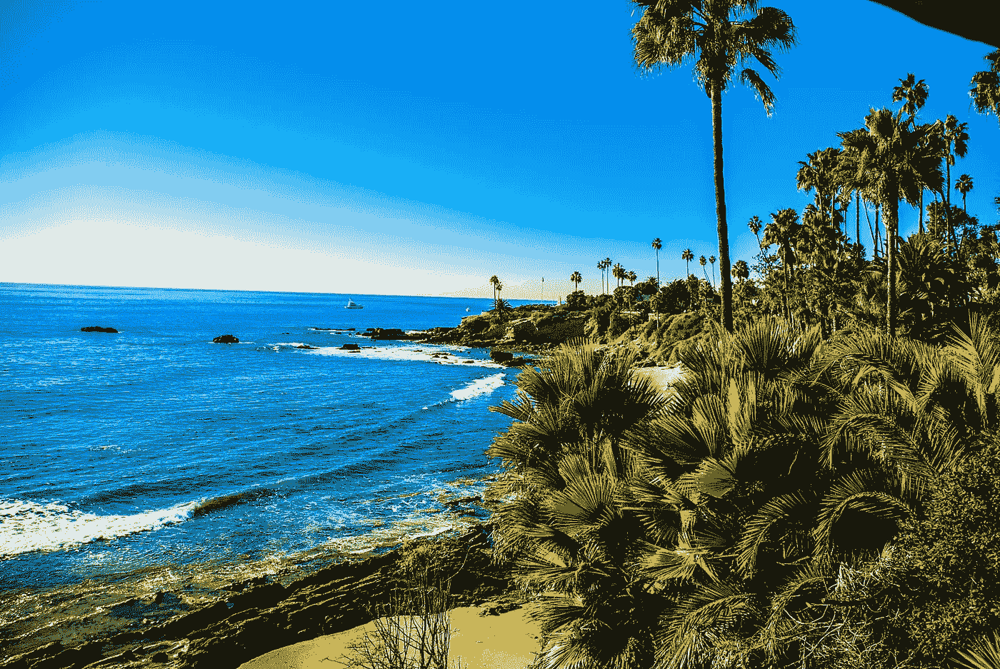
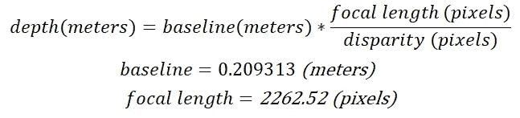
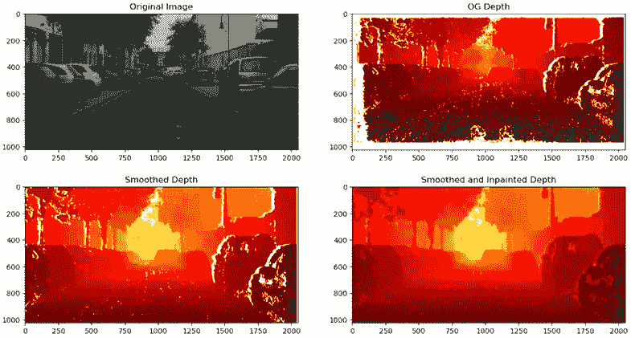
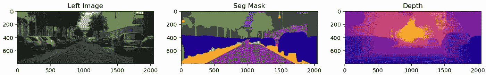
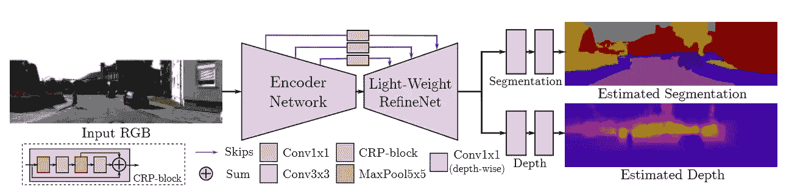
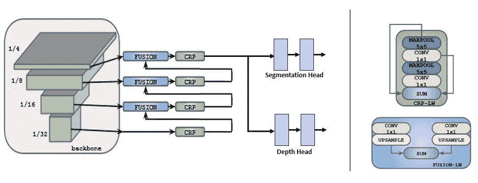
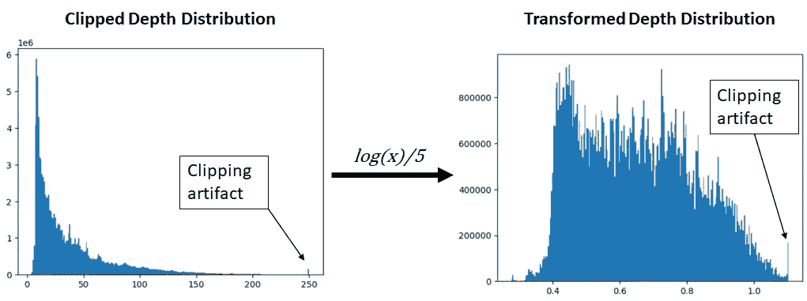
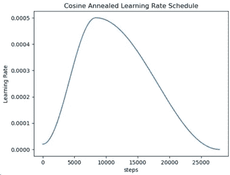
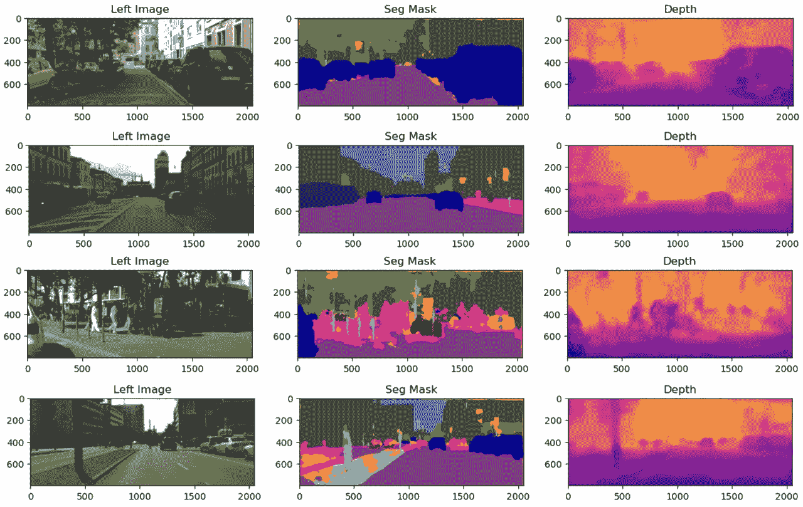
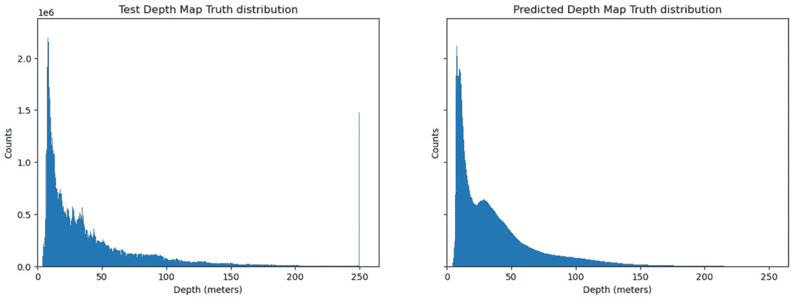

# 多任务架构：综合指南

> 原文：[`towardsdatascience.com/multi-task-architectures-9bee2e080456?source=collection_archive---------13-----------------------#2023-07-18`](https://towardsdatascience.com/multi-task-architectures-9bee2e080456?source=collection_archive---------13-----------------------#2023-07-18)

## 实时多任务推理的轻量级模型

[](https://medium.com/@itberrios6?source=post_page-----9bee2e080456--------------------------------)[](https://towardsdatascience.com/?source=post_page-----9bee2e080456--------------------------------) [Isaac Berrios](https://medium.com/@itberrios6?source=post_page-----9bee2e080456--------------------------------)

·

[关注](https://medium.com/m/signin?actionUrl=https%3A%2F%2Fmedium.com%2F_%2Fsubscribe%2Fuser%2Ffbadc8e8ee44&operation=register&redirect=https%3A%2F%2Ftowardsdatascience.com%2Fmulti-task-architectures-9bee2e080456&user=Isaac+Berrios&userId=fbadc8e8ee44&source=post_page-fbadc8e8ee44----9bee2e080456---------------------post_header-----------) 发表于 [Towards Data Science](https://towardsdatascience.com/?source=post_page-----9bee2e080456--------------------------------) ·10 分钟阅读·2023 年 7 月 18 日[](https://medium.com/m/signin?actionUrl=https%3A%2F%2Fmedium.com%2F_%2Fvote%2Ftowards-data-science%2F9bee2e080456&operation=register&redirect=https%3A%2F%2Ftowardsdatascience.com%2Fmulti-task-architectures-9bee2e080456&user=Isaac+Berrios&userId=fbadc8e8ee44&source=-----9bee2e080456---------------------clap_footer-----------)

--

[](https://medium.com/m/signin?actionUrl=https%3A%2F%2Fmedium.com%2F_%2Fbookmark%2Fp%2F9bee2e080456&operation=register&redirect=https%3A%2F%2Ftowardsdatascience.com%2Fmulti-task-architectures-9bee2e080456&source=-----9bee2e080456---------------------bookmark_footer-----------)

图片由[Julien Duduoglu](https://unsplash.com/@julien_duduoglu?utm_source=medium&utm_medium=referral)在[Unsplash](https://unsplash.com/?utm_source=medium&utm_medium=referral)提供

# 介绍

你是否曾经想过如何训练一个深度神经网络来完成多项任务？这样的模型被称为多任务架构，相较于使用单独模型来处理每个任务的传统方法，它具有一定的优势。多任务架构是[多任务学习](https://medium.com/ai-mind-labs/introduction-to-multi-task-learning-5da02afabb61)的一个子集，这是一种训练模型或模型集合以同时执行多个任务的通用方法。

在这篇文章中，我们将学习如何训练一个模型同时执行分类和回归任务。本文的代码可以在[GitHub](https://github.com/itberrios/CV_projects/tree/main/multitask_depth_seg)找到。以下是概述：

+   **动机** **— 我们为什么要这样做？**

+   **方法** **— 我们将如何实现这一目标？**

+   **模型架构**

+   **训练方法**

+   **推理** **— 检查性能并从一个** ***有趣的失败*** **中学习**

+   **结论**

# 动机

*我们为什么要使用轻量级模型？这不会降低性能吗？如果我们不部署到边缘，难道不应该使用尽可能大的模型吗？*

边缘应用需要轻量级模型以进行实时推理并减少功耗。其他应用也可以从中受益，但具体如何受益呢？轻量级模型的一个被忽视的好处是它们对计算的要求较低。通常，这可以降低服务器使用，从而减少功耗。这总体上具有*降低成本*和*减少碳排放*的效果，后者可能在未来的 AI 中成为一个主要的[问题](https://www.bloomberg.com/news/articles/2023-03-09/how-much-energy-do-ai-and-chatgpt-use-no-one-knows-for-sure)。

> 轻量级模型有助于降低成本和减少碳排放，因为它们消耗更少的电力

话虽如此，多任务架构只是工具箱中的一个工具，所有项目需求应在决定使用哪些工具之前加以考虑。现在让我们深入探讨一下如何训练其中一个模型吧！

# 方法

为了构建我们的多任务架构，我们将大致涵盖这篇[论文](https://arxiv.org/pdf/1809.04766.pdf)中的方法，该论文中训练了一个模型以同时进行分割和深度估计。其基本目标是以快速高效的方式完成这些任务，同时可以接受性能上的损失。在多任务学习中，我们通常将相似的任务组合在一起。在训练过程中，我们还可以添加一个辅助任务，这可能有助于模型的学习，但我们可能会选择在推理过程中不使用它[[1](https://arxiv.org/pdf/1809.04766.pdf), [2](https://arxiv.org/pdf/1905.07553.pdf)]。为简化起见，我们在训练过程中不会使用任何辅助任务。

深度和分割都是密集预测任务，并且有相似之处。例如，单个物体的深度在物体的所有区域内可能是一致的，形成一个非常狭窄的分布。主要的想法是每个物体应该有其自己的深度值，我们应该能够仅通过查看深度图来识别单个物体。以同样的方式，我们应该能够通过查看分割图来识别相同的单个物体。虽然可能会有一些异常值，但我们将假设这种关系是成立的。

## 数据集

我们将使用[City Scapes 数据集](https://www.cityscapes-dataset.com/)提供（左侧摄像头）输入图像分割掩码和深度图。对于分割图，我们选择使用标准训练标签，共 19 类+ 1 类未标记类别。

## 深度图准备—默认视差

使用[SteroSGBM](https://core.ac.uk/download/pdf/11134866.pdf)创建的视差图可以从 CityScapes 网站上轻松获取。视差描述了从每个立体摄像头的角度观察物体的像素差异，它与深度成反比，可以通过以下公式计算：



City Scapes 深度计算，单位见括号。来源：作者。

然而，默认的视差图存在噪声，许多孔对应于无限深度，以及一个总是显示自车的区域。清理这些视差图的常见方法包括：

1.  裁剪底部 20%以及左边和顶部边缘的部分

1.  调整到原始比例

1.  应用平滑滤波器

1.  执行[inpainting](https://docs.opencv.org/3.4/df/d3d/tutorial_py_inpainting.html)

一旦我们清理了视差图，就可以计算深度，结果如下：



图 1\. 来自 City Scapes 的深度数据。来源：作者。

这种方法的详细信息超出了本文的范围，但如果你感兴趣，这里有一个[YouTube](https://www.youtube.com/watch?v=jlZZu1t39Zs&feature=youtu.be)视频解释。

裁剪和调整步骤意味着视差（以及深度）图将不会完全与输入图像对齐。虽然我们可以对输入图像进行相同的裁剪和调整以纠正此问题，但我们选择探索一种新方法。

## 深度图准备—CreStereo 视差

我们探索了使用[CreStereo](https://arxiv.org/pdf/2203.11483.pdf)从左右图像生成高质量视差图。CreStereo 是一个先进的模型，能够从立体图像对中预测平滑的视差图。这种方法引入了一个称为[知识蒸馏](https://en.wikipedia.org/wiki/Knowledge_distillation)的范式，其中 CreStereo 是教师网络，我们的模型将是学生网络（至少在深度估计方面）。这种方法的细节超出了本文的范围，但如果你感兴趣，这里有一个[YouTube](https://www.youtube.com/watch?v=e3Zuc8AbwoA)链接。

通常，CreStereo 深度图的噪声最小，因此不需要裁剪和调整。然而，分割掩码中存在的自车可能会导致泛化问题，因此我们在所有训练图像中去除了底部 20%。训练样本如下所示：



图 2\. 训练样本。来源：作者。

现在我们有了数据，让我们来看看架构。

# 模型架构

根据[[1](https://arxiv.org/pdf/1809.04766.pdf)]，架构将包括一个 MobileNet 主干/编码器，一个[LightWeight RefineNet](https://arxiv.org/pdf/1810.03272.pdf) 解码器，以及用于每个单独任务的头部。整体架构如图 3 所示。



图 3\. 模型架构。[源](https://arxiv.org/pdf/1809.04766.pdf)。

对于编码器/主干，我们将使用一个[MobileNetV3](https://arxiv.org/pdf/1905.02244.pdf)并将 1/4、1/8、1/16 和 1/32 分辨率的跳跃连接传递到 Light Weight Refine Net。最后，输出将传递到每个负责不同任务的头部。请注意，如果需要，我们甚至可以向该架构中添加更多任务。



图 4\.（左）详细的编码器-解码器多任务架构。（右）LightWeight RefineNet 块的详细信息。修改自[源](https://arxiv.org/pdf/1810.03272.pdf)。

为了实现编码器，我们使用预训练的 MobileNetV3 编码器，将 MobileNetV3 编码器传递给自定义 PyTorch 模块。其前向函数的输出是一个[ParameterDict](https://pytorch.org/docs/stable/generated/torch.nn.ParameterDict.html)的跳跃连接，用于输入到 LightWeight Refine Net。下面的代码片段展示了如何实现这一点。

```py
class MobileNetV3Backbone(nn.Module):
    def __init__(self, backbone):
        super().__init__()
        self.backbone = backbone

    def forward(self, x):
        """ Passes input theough MobileNetV3 backbone feature extraction layers
            layers to add connections to
                - 1:  1/4 res
                - 3:  1/8 res
                - 7, 8:  1/16 res
                - 10, 11: 1/32 res
           """
        skips = nn.ParameterDict()
        for i in range(len(self.backbone) - 1):
            x = self.backbonei
            # add skip connection outputs
            if i in [1, 3, 7, 8, 10, 11]:
                skips.update({f"l{i}_out" : x})

        return skips
```

LightWeight RefineNet 解码器与[[1](https://arxiv.org/pdf/1809.04766.pdf)]中[实现的](https://github.com/DrSleep/multi-task-refinenet/blob/master/src/models.py)解码器非常相似，只是进行了少许修改以使其与[MobileNetV3](https://arxiv.org/pdf/1905.02244.pdf)兼容，而不是 MobileNetV2。我们还注意到解码器部分包含了分割和深度头。该模型的完整代码可以在[GitHub](https://github.com/itberrios/CV_projects/blob/main/multitask_depth_seg/model.py)上找到。我们可以按如下方式组装模型：

```py
from torchvision.models import mobilenet_v3_small

mobilenet = mobilenet_v3_small(weights='IMAGENET1K_V1')

encoder = MobileNetV3Backbone(mobilenet.features)
decoder = LightWeightRefineNet(num_seg_classes)
model = MultiTaskNetwork(encoder, freeze_encoder=False).to(device)
```

# 训练方法

我们将训练分为三个阶段，第一阶段为 1/4 分辨率，第二阶段为 1/2 分辨率，最后阶段为全分辨率。所有权重都会更新，因为冻结编码器权重似乎效果不佳。

## 转换

在每个阶段，我们执行随机裁剪调整大小、颜色抖动、随机翻转和归一化。左侧输入图像使用标准图像网均值和标准差进行归一化。

## 深度转换

通常深度图包含大多数较小的值，因为深度图中包含的大部分信息都是相机附近的物体和表面。由于深度图的大部分深度集中在较低的值附近（见下图 4 的左侧），因此需要对其进行变换，以便神经网络能够有效学习。深度图被裁剪在 0 到 250 之间，这是因为大距离的立体视差/深度数据通常不可靠，在这种情况下，我们希望*丢弃*它。然后，我们取自然对数并除以 5，以便将分布浓缩到较小范围的数字上。有关更多细节，请参见这个 [笔记本](https://github.com/itberrios/CV_projects/blob/main/multitask_depth_seg/depth_normalization.ipynb)。



图 4\. 左 — 裁剪后的深度分布。右 — 变换后的深度分布。深度是从 64 个随机全尺寸训练深度掩模中采样的。来源作者。

> 老实说，我不确定最佳的深度数据变换方法。如果有更好的方法或您会以不同的方式进行，我很想在评论中了解更多 :).

## 损失函数

我们保持损失函数简单，分割使用交叉熵损失，深度估计使用均方误差。我们将它们加在一起，不加权，并联合优化。

## 学习率

我们使用了一个周期余弦退火学习率，最大值为 5e-4，并在 1/4 分辨率下训练 150 个周期。用于训练的笔记本位于 [这里](https://github.com/itberrios/CV_projects/blob/main/multitask_depth_seg/training.ipynb)。



图 5\. 一个周期余弦退火学习率。来源作者。

我们在 1/2 分辨率下微调了 25 个周期，然后在全分辨率下再次微调了 25 个周期，学习率为 5e-6。请注意，每次我们在增加分辨率时微调时，都需要减少批量大小。

# 推断

在推断过程中，我们对输入图像进行了归一化，并通过模型进行了前向传播。图 6 显示了来自验证和测试数据的训练结果。



图 6\. 推断结果（前两个是来自测试集，后两个是来自验证集）。来源作者。

通常情况下，当图像中存在较大的物体时，模型似乎能够进行分割和深度估计。当出现更精细的物体，如行人时，模型往往难以完全分割它们。模型能够在一定程度上准确估计它们的深度。

## 一个有趣的失败

图 6 的底部展示了一个有趣的失败案例，即未能完全分割图像左侧的灯柱。分割仅覆盖了灯柱的下半部分，而深度图显示灯柱的下半部分比上半部分更近。深度的失败可能是由于下部像素通常对应于较近的深度；注意到像素 500 附近的地平线，存在明显的分界线，将较近的像素和较远的像素区分开来。似乎这种偏差可能泄漏到了模型的分割任务中。这种*任务泄漏*应在训练多任务模型时考虑。

> 在多任务学习中，一个任务的训练数据可以影响另一个任务的表现。

## 深度分布

让我们检查预测的深度与真实深度的分布情况。为了简化，我们将只使用 94 对真实/预测的全分辨率深度图样本。



图 8\. 真实（左）和预测（右）深度图分布，每个分布有 1000 个区间。来源作者。

似乎模型学习到了两个分布，一个在 4 附近有峰值，另一个在 30 附近有峰值。注意到剪切伪影似乎没有产生影响。总体分布包含了一个长尾，这表明只有图像的一小部分包含远处的深度数据。

预测的深度分布比真实值更平滑。真实值分布的粗糙度可能是由于每个物体包含相似的深度值。可能可以利用这些信息应用某种正则化来强制模型遵循这一范式，但那将是另一个问题。

## 额外内容：推理速度

由于这是一个旨在追求速度的轻量级模型，让我们看看它在 GPU 上的推理速度。下面的代码已从这篇[文章](https://deci.ai/blog/measure-inference-time-deep-neural-networks/)中修改。在这个测试中，输入图像被缩小到 400x1024。

```py
# find optimal backend for performing convolutions 
torch.backends.cudnn.benchmark = True 

# rescale to half size
rescaled_sample = Rescale(400, 1024)(sample)
rescaled_left = rescaled_sample['left'].to(DEVICE)

# INIT LOGGERS
starter, ender = torch.cuda.Event(enable_timing=True), torch.cuda.Event(enable_timing=True)
repetitions = 300
timings=np.zeros((repetitions,1))
#GPU-WARM-UP
for _ in range(10):
    _, _ = model(rescaled_left.unsqueeze(0))
# MEASURE PERFORMANCE
with torch.no_grad():
    for rep in range(repetitions):
        starter.record()
        _, _ = model(rescaled_left.unsqueeze(0))
        ender.record()
        # WAIT FOR GPU SYNC
        torch.cuda.synchronize()
        curr_time = starter.elapsed_time(ender)
        timings[rep] = curr_time

mean_syn = np.sum(timings) / repetitions
std_syn = np.std(timings)
print(mean_syn, std_syn)
```

推理测试表明，该模型可以以 18.69+/-0.44 毫秒或约 55Hz 的速度运行。需要注意的是，这只是一个在搭载 NVIDIA RTX 3060 GPU 的笔记本电脑上运行的 Python 原型，不同的硬件会改变推理速度。我们还应该注意，如果在 NVIDIA GPU 上部署像[Torch-TensorRt](https://developer.nvidia.com/blog/accelerating-inference-up-to-6x-faster-in-pytorch-with-torch-tensorrt/)这样的 SDK，可以显著提高速度。

# 结论

在这篇文章中，我们了解了多任务学习如何节省成本和减少碳排放。我们学习了如何构建一个轻量级的多任务架构，能够在 CityScapes 数据集上同时执行分类和回归。我们还利用了 CreStereo 和知识蒸馏来帮助我们的模型更好地预测深度图。

这个轻量级模型在速度和效率之间做出了权衡。即使有这个权衡，训练后的模型仍然能够在测试数据上预测出合理的深度和分割结果。此外，它还能够学习预测与真实深度图类似的深度分布。

# 参考文献

[1] Nekrasov, Vladimir 等人. ‘实时联合语义分割和深度估计使用不对称注释’. *CoRR*, vol. abs/1809.04766, 2018, [`arxiv.org/abs/1809.04766`](http://arxiv.org/abs/1809.04766.)

[2] Standley, Trevor 等人. ‘在多任务学习中应该一起学习哪些任务？’ *CoRR*, vol. abs/1905.07553, 2019, [`arxiv.org/abs/1905.07553`](http://arxiv.org/abs/1905.07553.)

[3] Cordts, M., Omran, M., Ramos, S., Rehfeld, T., Enzweiler, M., Benenson, R., Franke, U., Roth, S., & Schiele, B. (2016). 城市景观数据集用于语义城市场景理解. *2016 IEEE 计算机视觉与模式识别会议 (CVPR)*. [`doi.org/10.1109/cvpr.2016.350`](https://doi.org/10.1109/cvpr.2016.350)
