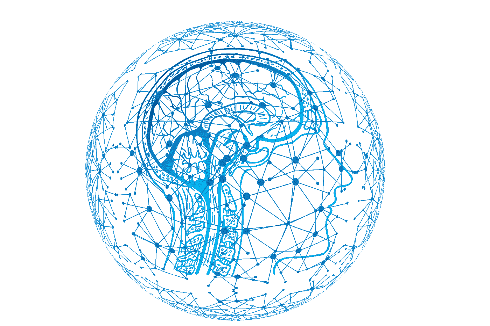

# 多任务机器学习：同时解决多个问题

> 原文：[`towardsdatascience.com/multi-task-learning-4531eb32d77b?source=collection_archive---------10-----------------------#2023-04-27`](https://towardsdatascience.com/multi-task-learning-4531eb32d77b?source=collection_archive---------10-----------------------#2023-04-27)

## 一些有监督的，一些无监督的，一些自监督的，在自然语言处理（NLP）和计算机视觉中

<https://jagota-arun.medium.com/?source=post_page-----4531eb32d77b--------------------------------><https://towardsdatascience.com/?source=post_page-----4531eb32d77b--------------------------------> [Arun Jagota](https://jagota-arun.medium.com/?source=post_page-----4531eb32d77b--------------------------------)

·

[关注](https://medium.com/m/signin?actionUrl=https%3A%2F%2Fmedium.com%2F_%2Fsubscribe%2Fuser%2Fef9ed921edad&operation=register&redirect=https%3A%2F%2Ftowardsdatascience.com%2Fmulti-task-learning-4531eb32d77b&user=Arun+Jagota&userId=ef9ed921edad&source=post_page-ef9ed921edad----4531eb32d77b---------------------post_header-----------) 发表在 [Towards Data Science](https://towardsdatascience.com/?source=post_page-----4531eb32d77b--------------------------------) ·11 分钟阅读·2023 年 4 月 27 日

--

图片来自 [Gerd Altmann](https://pixabay.com/users/geralt-9301/?utm_source=link-attribution&utm_medium=referral&utm_campaign=image&utm_content=3685928) 从 [Pixabay](https://pixabay.com/)

*单任务学习*是从标记的数据集中学习预测单个结果（二元、多类别或连续）的过程。

相比之下，*多任务学习*是在同一模态的输入上联合学习预测多个结果的过程。例如图像或文本。

显而易见的问题是，为什么要*联合学习*？为什么不独立学习单任务模型以预测各种结果？

答案是，联合学习可以学习那些在任务之间具有更好泛化能力的特征。那些能成为多个任务的良好预测器的特征会比那些不能的特征更受青睐。所学到的特征甚至可能对同一领域的新预测任务具有泛化能力。

**将无监督学习加入到混合中**

到目前为止，我们假设在多任务设置中选择的所有任务都是有监督的。让我们放宽这一假设，允许一些任务是无监督的。

为什么？因为我们可能有更多的数据来进行训练。其中一些数据是标注的，针对不同的结果，还有很多是未标注的。将无监督任务加入到联合学习中……
