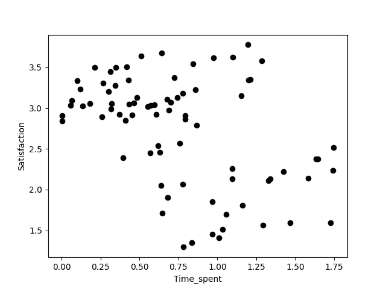
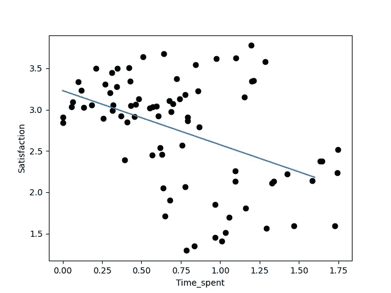
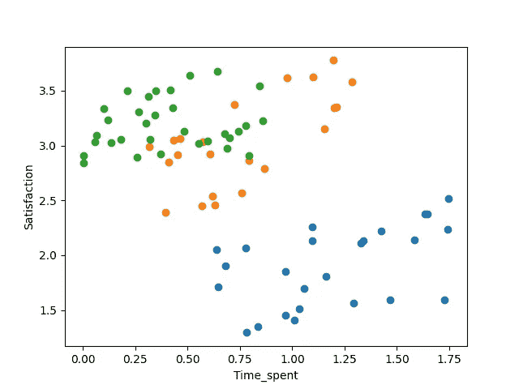
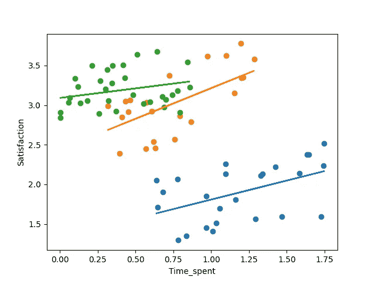

# 多层次回归模型与辛普森悖论

> 原文：[`towardsdatascience.com/multilevel-regression-models-and-simpsons-paradox-acb9820e836d?source=collection_archive---------2-----------------------#2023-08-08`](https://towardsdatascience.com/multilevel-regression-models-and-simpsons-paradox-acb9820e836d?source=collection_archive---------2-----------------------#2023-08-08)

## 使用适当的工具避免错误结论

[](https://medium.com/@doriandrost?source=post_page-----acb9820e836d--------------------------------)[](https://towardsdatascience.com/?source=post_page-----acb9820e836d--------------------------------) [Dorian Drost](https://medium.com/@doriandrost?source=post_page-----acb9820e836d--------------------------------)

·

[关注](https://medium.com/m/signin?actionUrl=https%3A%2F%2Fmedium.com%2F_%2Fsubscribe%2Fuser%2F1d49ea537d1c&operation=register&redirect=https%3A%2F%2Ftowardsdatascience.com%2Fmultilevel-regression-models-and-simpsons-paradox-acb9820e836d&user=Dorian+Drost&userId=1d49ea537d1c&source=post_page-1d49ea537d1c----acb9820e836d---------------------post_header-----------) 发布于 [Towards Data Science](https://towardsdatascience.com/?source=post_page-----acb9820e836d--------------------------------) ·10 分钟阅读·2023 年 8 月 8 日[](https://medium.com/m/signin?actionUrl=https%3A%2F%2Fmedium.com%2F_%2Fvote%2Ftowards-data-science%2Facb9820e836d&operation=register&redirect=https%3A%2F%2Ftowardsdatascience.com%2Fmultilevel-regression-models-and-simpsons-paradox-acb9820e836d&user=Dorian+Drost&userId=1d49ea537d1c&source=-----acb9820e836d---------------------clap_footer-----------)

--

[](https://medium.com/m/signin?actionUrl=https%3A%2F%2Fmedium.com%2F_%2Fbookmark%2Fp%2Facb9820e836d&operation=register&redirect=https%3A%2F%2Ftowardsdatascience.com%2Fmultilevel-regression-models-and-simpsons-paradox-acb9820e836d&source=-----acb9820e836d---------------------bookmark_footer-----------)

数据分析会影响我们的结论，但我们应使用适当的工具来走上正确的道路。照片由[Brendan Church](https://unsplash.com/@bdchu614?utm_source=medium&utm_medium=referral)拍摄，发布在[Unsplash](https://unsplash.com/?utm_source=medium&utm_medium=referral)上

数据分析——顾名思义——是数据科学家工作的重要组成部分，从描述性统计和简单的回归模型到复杂的机器学习方法。然而，这些方法需要小心处理，选择正确的方法远非简单。复杂的数据通常包含隐藏的结构，如果未得到适当考虑，可能会导致谬误，最终得出无效的结论。

在这篇文章中，我想举一个 *辛普森悖论* 的例子，并展示如何通过简单但目光短浅的分析导致看似有数据支持的错误结论，尽管这些结论不过是误解。通过这种方式，我演示了 *多层回归模型* 作为分析层次结构数据（即嵌套数据）的适当方法。

## 问题

我们现在就开始吧！假设我们已经发布了一个智能手机应用，并且想了解更多关于我们的用户及其满意度的信息。因此，我们进行了一项小调查，询问一些用户在 1（非常不满意）到 4（非常满意）的范围内对我们应用的满意度评分。此外，我们还测量了他们在过去一周内在应用中花费的时间，为了获取丰富的样本，我们询问了不同国家的用户。然后我们的数据可能会像这样（本文使用了生成的数据）：

```py
 Satisfaction  Time_spent  Country
0      2.140440    1.585295        0
1      2.053545    0.636235        0
2      1.589258    1.468033        1
3      1.853545    0.968651        2
4      1.449286    0.967104        2
.      .            .              .
.      .            .              .
.      .            .              .
```

我们对我们应用中花费时间与报告的满意度之间的关系感兴趣。准确地说，我们想知道在我们的应用中花费更多时间是否与更高或更低的满意度相关，并且我们想量化这种关联，即我们想做出类似于“*在我们的应用中多花一小时与满意度提高 x 倍/降低 x 倍相关*”的陈述。当我们查看数据时，我们可能已经有了第一直觉，即在应用中花费更多时间与较低的满意度相关：



## 线性回归

让我们做一个线性回归来验证我们的猜测。通过线性回归，我们尝试预测满意度，前提是时间花费作为形式为 *satisfaction = intercept + regression_coefficient * time_spent* 的线性函数。我们可以使用 *statsmodels* 包中的 OLS（普通最小二乘法）函数轻松完成这一点。

```py
import statsmodels.api as sm
result = sm.OLS(df["Satisfaction"], sm.add_constant(df["Time_spent"])).fit()
print(result.params)
```

*add_constant* 方法只是我们用来告诉模型我们希望在方程中有一个截距的技术细节（这在数据未标准化时是必需的）。*result.params* 给出了两个值，即 *intercept*（*const*）和 *regression_coefficient* 对应的 *Time_spent* 变量。

```py
const         3.229412
Time_spent   -0.655470
```

也就是说，我们的模型告诉我们，满意度可以预测为*3.229 –0.655*time_spent*。换句话说，在应用程序中多花一小时的时间会导致满意度下降 0.655 分（由于负号）。然而，满意度并非从零开始，而是一个人从第一印象（即*time_spent=0*）开始的平均满意度为 3.229。我们还可以将其以截距为 3.229 和斜率为-0.665 的线表示出来：



当然，这个预测并不完美，但至少它给出了一个趋势。好的，情况已经清楚了，对吧？在应用程序中花费更多时间会导致满意度下降，我们甚至可以量化这种下降。我们现在可以从中得出结论，并考虑如何改进应用程序（当然，我们希望用户在使用应用程序时更满意），或者进行更详细的调查，以找出用户不满意的原因。

**慢一点！**

## 按国家分组

记得我们从不同国家的用户那里收集了数据吗？如果我们分国家查看这些数据会发生什么呢？在下面的图表中，我们看到的是之前相同的数据点，但现在我们将每个国家用不同的颜色突出显示。



从这个图表中我们可以观察到两点。首先，各国在满意度和在应用程序中花费的时间上似乎有所不同。来自蓝色国家的受访者在应用程序中花费的时间更多，但相比其他国家的受访者，他们的满意度更低。更进一步，当我们将三个国家分开来看时，我们可能会认为应用程序使用时间与满意度之间的关系确实是正向的。这不是与我们之前的分析相矛盾吗？

## 辛普森悖论


实际上，这个名字并不是以那些辛普森家族命名的……照片由[Stefan Grage](https://unsplash.com/@stefangrage?utm_source=medium&utm_medium=referral)提供，来源于[Unsplash](https://unsplash.com/?utm_source=medium&utm_medium=referral)

我们刚刚看到的效果被称为*辛普森悖论*。当数据中的相关性在组之间与组内不同的时候，就会出现这种情况。尽管这一点非常违反直觉，但确实可能发生（正如我们刚刚看到的），其原因在于混杂变量。让我们用上述例子来解释。当孤立地看每个国家时，我们会看到一个正趋势：在应用程序中花费更多的时间与更高的满意度相关。然而，正如我们已经看到的，各国的平均满意度和应用程序使用时间不同。在蓝色国家，平均满意度较低，但在应用程序中花费的时间比橙色或绿色国家要长；这种趋势与国家内部的趋势相反。然而，可能还有其他变量导致这种情况。例如，可以想象，在蓝色国家，更多的人经常感到无聊，导致总体满意度较低（因此对我们的应用程序的态度较为消极），但在应用程序中花费更多时间。当然，这只是一个可能的解释，可能还有许多其他解释。然而，目前正确的解释并不是特别重要。对我们来说，重要的是理解不同国家之间存在系统性的差异。

那么，我们为什么在之前的分析中没有发现这一点呢？我们在进行线性回归时是否犯了错误？确实，因为完全进行线性回归是不对的，因为线性回归的一个核心假设被违反了：线性回归假设所有数据点是独立采样的，并且来自相同的分布。然而，在我们的例子中并非如此！显然，不同国家之间的应用程序使用时间和满意度的分布是不同的。现在，如果线性回归的假设被违反，线性回归就不是数据分析的合适工具。

## 层次模型

我们现在可以做什么，以便以更合适的方式分析我们的数据？幸运的是，有统计模型可以将线性回归的理念扩展到层次数据。我们说数据是层次数据，是指我们采样的数据点嵌套在一个层次结构中，就像在我们的案例中，受访者被嵌套在各个国家中。这些统计模型被称为*层次线性模型*、*多级模型*或*线性混合效应模型*。这些模型通过引入所谓的*固定效应*和*随机效应*来考虑组结构。在一个简单的例子中，当我们想根据一个变量预测另一个变量时（比如我们想预测在应用程序中花费的时间与满意度的关系），*固定效应*包括一个截距和所有组共同的一个斜率。这与线性回归中的情况完全一样。

现在，*随机效应*可以引入每组**单独的**截距偏差。例如，蓝色国家的截距可能比固定截距略低，而绿色国家的截距可能比固定截距略高。这将解释国家间满意度均值水平的差异。

此外，*随机效应*可以引入每组的斜率偏差。例如，在橙色组中，斜率可能高于固定斜率（即，满意度与时间花费之间的关联更强），而在绿色国家中，斜率可能较低。

## 层次模型的实际效果

让我们通过实际操作来理解发生了什么。我们进行了一项新的分析，但这次我们使用了 statsmodels 的*mixedlm*函数。我们明确表示希望根据*时间花费*来预测*满意度*（而不是相反），使用公式*“满意度 ~ 时间花费”*，并指出数据框中的“*国家*”列用于确定不同的组。此外，参数*re_formula="时间花费”*告知模型我们希望每个组有一个单独的斜率。如果没有这一点，随机效应只会考虑组特定的截距，而不会考虑组特定的斜率。

```py
import statsmodels.formula.api as smf

result = smf.mixedlm("Satisfaction ~ Time_spent", data=df, groups=df["Country"], re_formula="Time_spent").fit()
print(result.fe_params)
print(result.random_effects)
```

如果我们打印出*固定效应*（*fe_params*）和*随机效应*，我们会得到如下值：

```py
 Fixed effects
  Intercept     2.286638
  Time_spent    0.497657
Random Effects
  {0: Group -0.958805, Time_spent -0.018178,
   1: Group 0.155233,  Time_spent 0.274222,
   2: Group 0.803572,  Time_spent -0.256044}
```

那么，这意味着什么？对于固定效应，我们有一个截距值和一个变量时间花费的值。然而，对于随机效应，我们有**每个国家（0,1,2）**的两个值：一个是截距值（*组*），另一个是我们变量的斜率值（*时间花费*）。正如我们上面看到的，随机效应描述了每组的**偏差**。对于我们的三个组，我们可以通过将随机效应加到固定效应的截距和斜率中来构造三个不同的线性方程。

```py
satisfaction_0 = (2.286638 - 0.958805) + (0.497657 - 0.018178) * time_spent = 1.327833 + 0.479479 * time_spent
satisfaction_1 = (2.286638 + 0.155233) + (0.497657 + 0.274222) * time_spent = 2.441871 + 0.771879 * time_spent
satisfaction_2 = (2.286638 + 0.803572) + (0.497657 - 0.256044) * time_spent = 3.090210 + 0.241613 * time_spent
```

我们看到组 0 的随机截距为负值（-0.958），组 2 的随机截距为正值（0.803），所以组 0 低于固定截距，而组 2 高于固定截距。因此，组 0 在其线性函数中的截距最低（1.327），而组 2 最高（3.090）。换句话说，在国家 0 中，满意度的起始水平低于国家 2。

我们还看到组间的斜率存在差异。在组 1 中，斜率最高为 0.771，而在组 2 中仅为 0.241。这意味着在应用中的满意度与时间花费之间的关联在国家 1 中远高于国家 2。换句话说，在国家 1 中，每增加一个小时的应用时间，满意度会增加 0.771 分（均值），而在国家 2 中仅增加 0.241 分。此外，所有斜率都是正值，这与我们从上图预期的一致，但与我们一开始进行的线性回归的负斜率相矛盾。

现在我们可以为每个国家绘制一条回归线：



现在我们清楚地看到每个国家的积极趋势和不同的截距（即，当*time_spent*=0 时，线条的位置）。

## 结论

在上述示例中，我们看到短视的分析很容易导致虚假的结论。忽视数据的嵌套结构，即来自不同国家的用户，我们本可以在进行线性回归后就停止，得出更多时间花费在应用中与较低的满意度相关的结论。只有通过理解我们的数据不符合线性回归的核心假设，因为数据点不是从同一分布中抽取的，我们才有动机进行进一步分析，揭示了实际情况正好相反：更多时间花费在应用中确实与更高的满意度相关。

那么，让我们从这个例子中总结一些要点：

+   在使用统计方法进行分析之前，应该验证其假设是否符合数据。

+   对于嵌套数据，假设所有数据点都来自同一分布的情况可能并不总是成立。

+   可能发生的情况是，整体数据的趋势与构成该数据的单个组内部的趋势不同。这被称为辛普森悖论。

+   多级线性模型是应对嵌套数据结构并避免因辛普森悖论产生虚假结论的一种方法。

## 进一步阅读

我们使用了在*statsmodels*中实现层次模型的以下方法：

+   [`www.statsmodels.org/stable/mixed_linear.html`](https://www.statsmodels.org/stable/mixed_linear.html)

我使用了以下统计学教材（遗憾的是，这本书仅有德文版）。

+   Eid, M., Gollwitzer, M., & Schmitt, M. (2017). *统计与研究方法*。

关于多级模型的背景信息也可以在这里找到：

+   Snijders, T. A. B.; Bosker, R. J. (2011). [*多级分析：基础与高级多级建模导论*](https://books.google.com/books?id=N1BQvcomDdQC)（第 2 版）。伦敦：Sage。 [ISBN](https://en.wikipedia.org/wiki/ISBN_(identifier)) [9781446254332](https://en.wikipedia.org/wiki/Special:BookSources/9781446254332)。

如果你想重现结果，数据是这样生成的：

```py
import numpy as np
import pandas as pd
group_1_x = np.random.uniform(0.5, 1.8, 25)
group_1_y = (1 + 0.3 * group_1_x) + np.random.rand(len(group_1_x))

#start_2, end_2, step_2 = 0.3, 1.3, 0.04
group_2_x = np.random.uniform(0.3, 1.3, 22)
group_2_y = (2 + 0.7*group_2_x) + np.random.rand(len(group_2_x))

#start_3, end_3, step_3 = 0, 1, 0.04
group_3_x = np.random.uniform(0, 1, 32)
group_3_y = (2.5 + 0.3*group_3_x) + np.random.rand(len(group_3_x))

all_x = np.concatenate([group_1_x, group_2_x, group_3_x])
all_y = np.concatenate([group_1_y, group_2_y, group_3_y])
df = pd.DataFrame({"Satisfaction": all_y, "Time_spent":all_x, "Country":[0]*len(group_1_x) + [1]*len(group_2_x) + [2]*len(group_3_x)})
```

*喜欢这篇文章吗？* [*关注我*](https://medium.com/@doriandrost) *以便接收我未来的帖子。*
