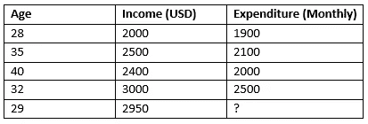
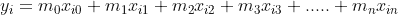

# 多元线性回归：深入探讨

> 原文：[`towardsdatascience.com/multiple-linear-regression-a-deep-dive-f104c8ede236`](https://towardsdatascience.com/multiple-linear-regression-a-deep-dive-f104c8ede236)

## 从零开始的多元线性回归：深入理解

 [Md. Zubair](https://zubairhossain.medium.com/?source=post_page-----f104c8ede236--------------------------------)

·发表于 [Towards Data Science](https://towardsdatascience.com/?source=post_page-----f104c8ede236--------------------------------) ·10 分钟阅读·2023 年 3 月 3 日

--

两个特征（x1 和 x2）的多元回归（作者图片）

## 动机

我们人类已经尝试了很长时间去创建智能系统。因为如果我们能自动化一个系统，它将使我们的生活更轻松，并且可以作为我们的助手。机器学习使这一切成为可能。解决不同问题的机器学习算法有很多。本文将介绍一种可以用多个变量解决回归问题（连续值预测）的机器学习算法。*假设你在经营房地产生意。* 作为业务负责人，你应该对建筑物、土地等的价格有一个合理的了解，以便使你的业务盈利。对于一个人来说，跟踪广泛区域的价格是相当困难的。一个高效的机器学习回归模型可以大有帮助。想象一下你输入的位置、大小和其他相关信息，系统会自动显示价格。多元线性回归正是可以做到这一点。难道不很有趣吗！

我将解释多元线性回归的过程，并展示从零开始的实现。

`*注意 — 如果你对简单线性回归没有清晰的概念，我建议你先阅读* [***这篇文章****再深入了解多元线性回归。]*`

## 目录

1.  `**什么是多元线性回归？**`

1.  `**我们什么时候使用多元线性回归？**`

1.  `**多元线性回归的详细介绍**`

1.  `**线性回归的向量化方法**`

1.  `**用 Python 的动手实现**`

## 什么是多元线性回归问题？

在简单线性回归中，只能存在一个特征（自变量）。但在多重线性回归中，特征的数量多于一个。它们都用于预测连续值。

简单线性回归问题（作者提供的图像）

看看表格。表中是产品价格与重量的关系。通过线性回归，如果我们可以为给定的值拟合一条线，我们可以通过将产品的重量插入模型来轻松预测价格。相同的过程也适用于多重线性回归。不同的是，特征不止一个，而是多个（自变量）。

多重线性回归问题（作者提供的图像）

上述示例有两个特征 `“**年龄**”` 和 `“**收入**”`。我们需要预测这两个新特征的每月 `“**支出**”`。这就是多重线性回归的一个示例。

多重线性回归不限于两个特征。它可以有两个以上的特征。

## 何时使用多重线性回归？

简单或单变量线性回归仅适用于从一个自变量预测连续值。

简单线性回归的过程不适用于多个特征。如果我们需要从多个特征（变量）中预测连续值，我们必须应用多重线性回归。值得一提的是，数据必须是线性分布的。非线性数据不适合线性回归。

## 多重线性回归的详细信息

让我们尝试以可视化的方式表示多重线性回归。我试图保持模型简单，只包含两个自变量（特征）。

两个特征（x1 和 x2）的多重线性回归（作者提供的图像）

`*x1 和 x2*` 是两个特征（自变量）。假设 `x1=4` 和 `x2=5`。如果将这些值投影到 `x1-x2` 平面上，我们将得到点 `**A**`。在多重回归模型中，我们需要从数据集中创建一个回归平面，如图所示。现在，在回归平面上画一条垂直线会将平面划分为一个特定的点。通过从交点向 y 轴画一条水平线，我们可以得到预测值。预测值是 `y 轴` 的交点。

`*[注 — 我仅使用两个特征可视化多重线性回归以作演示，因为可视化超过两个特征是不可能的。在特征更多的情况下，过程是相同的。]*`

## 让我们尝试更深入地探讨

在简单线性回归中，我们根据一个自变量预测一个因变量。 `*[阅读* [*上一篇文章*](https://medium.com/towards-data-science/deep-understanding-of-simple-linear-regression-3776afe34473) *以获取关于简单线性回归的更详细解释。]*`

例如，一个简单的线性回归方程，`***yi=mxi + c***`。这里，`‘m’`是回归线的斜率，而`‘c’`是`y`轴截距值。

*在有多个自变量的情况下，我们需要扩展回归方程，如下所示。*

> 其中，
> 
> `y`表示因变量（预测回归值）。
> 
> `x1,x2, ……,xn`是不同的自变量。
> 
> `m1, m2, m3,…….,mn`象征着不同自变量的斜率系数。
> 
> `m0`是`y`轴的截距点值。

现在，我们将从数据集中获取自变量。我们面临的主要挑战是找出斜率的系数值`(m0,m2,……., mn )`。

让我们考虑***第一部分***中显示的多元线性回归问题数据集。

如果我们有`*m0, m1 和 m2*`的最佳值，预测个人的`‘支出’`就很容易了。我们可以通过输入`年龄`和`收入`值来轻松获得`‘支出’`。

但没有直接的方法来找到系数的最佳值。为此，我们需要通过梯度下降来最小化代价（损失）函数。

***关于梯度下降的详细信息 —***

在深入梯度下降之前，我们应该对代价函数有一个清晰的了解。代价函数就是一个误差函数。它衡量预测模型的准确性。我们将使用以下误差函数作为代价函数。

在这里，***y̅i***是预测值，***yi***是实际值。

`**梯度下降**`是一个优化算法。我们使用这个算法通过优化回归方程的系数来最小化代价函数。

梯度下降（图片作者提供）

红色曲线是代价函数的导数。为了优化系数，我们随机分配系数的权重。现在，我们将计算代价函数的导数。为了简化起见，我们将考虑简单的线性回归方程。

1.  让我们用`*(mxi+c)*`替换`***y̅i***`。这意味着方程如下 —*

2\. 对`**m**`和`**c**`的偏导数。

`*[注意 — 你可能会发现一些代价函数是乘以 1/2n 而不是 1/n。这没什么大不了的。如果你使用 1/2n，导数会中和它，结果将是 1/n 而不是 2/n。在实现部分，我们也使用 1/2n。]*`

3\. 现在，我们将通过以下方程迭代更新**m**和**c**的值。

***α*** 是学习率，指示我们在每一步中移动的距离以最小化成本函数（如图所示）。迭代将继续进行，直到成本函数显著最小化。

*对于多重线性回归，整个过程是相同的。让我们再次考虑多重线性回归的方程。*

如果我们像简单线性方程一样计算系数的导数，我们将得到一种通用形式（如上所示）。

其中 `***j***` 取值为 `***1,2,…..,n,***` 代表特征。

对于 `*m0*`，导数将是 —

我们将使用以下公式同时更新所有系数。

对于 *m0,* 我们将使用以下方程。

我们将不断更新所有系数以拟合模型并计算成本。如果成本显著降低，我们将停止更新系数。

`但这个过程在计算上是昂贵且耗时的。向量化使实现变得简单。`

## 向量化线性回归方法

让我们再次考虑多重线性回归。

我们添加了一个常数 `*xi0=1*` 以方便计算。它不会影响前面的方程。让我们看看方程的向量化表示。

线性回归方程的向量化实现（图像由作者提供）

这里，`yi=1…..z, **z**` 是总数据集实例的数量。X 存储了所有特征值，直到 ***z*** 实例。

简而言之，向量化方程是 —

现在，*向量化成本函数的* 导数如下（[详细解释](https://math.stackexchange.com/questions/2887916/cost-function-vectorized-implementation)）。

现在是时候使用下面给出的公式更新权重了。

是的！我们已经完成了理论过程。现在是时候将整个过程编写成代码了。

## 从头开始的 Python 实现

现在是时候开始动手编写代码了。我将逐步展示指南。

`*[附注 — 我们使用* [*波士顿房价*](https://www.cs.toronto.edu/~delve/data/boston/bostonDetail.html) *数据集进行演示。* *它注册在公共领域。可从*[***这里***](https://www.kaggle.com/code/prasadperera/the-boston-housing-dataset/data)***]***`

***导入库***

***读取数据集***

我们看到主数据集中没有列名。在下一步中，我们将根据文档设置列名。

***设置列名***

我们已经成功地将列添加到 Dataframe 中。

在本文中，我们的主要重点是理解多元线性回归的内部过程。因此，我们将主要关注实现过程，而不是项目的有效性。为了保持模型的简单性，我们将考虑高度相关的特征。

***让我们找到与目标列的相关性*** `***‘MEDV’***`

为了方便起见，我们选择了三个特征，`**‘RM’, ‘DIS’, 和 ‘B’**`，以及目标值 `**‘MEDV’**`。

***规范化特征***

归一化减少了模型的计算复杂度。因此，我们将对特征进行归一化。

***将数据集拆分为测试集和训练集***

我们必须将数据集拆分为训练集和测试集，以便进行评估。使用训练集，我们将训练模型，并用测试集评估我们的模型。

在这里，我们将 75% 的数据用于训练，其余 25% 用于测试。

***带有向量化实现的梯度下降优化函数***

***让我们调用函数找出系数的最佳值。***

该函数返回两个值，系数（w）和一个损失值列表。

***优化过程的迭代可视化***

***创建预测函数以预测新值***

让我们对测试特征进行预测。

## ***将我们的自定义模型与标准 scikit-learn 库进行比较***

在进行比较之前，我们需要创建一个用于多元线性回归的预测模型，使用 `**scikit-learn**`。

***使用 scikit-learn 的线性回归***

***从 MSE 的角度比较模型***

两个 MSE 值非常相似。即使我们的模型的 MSE 稍低于 scikit-learn 模型。

***这两个模型的预测差异有多大？***

结果表明我们的优化非常完美，并且与 scikit-learn 的基准模型效果类似。

## 结论

我们主要使用多元线性回归来解决从多个特征预测连续值的问题。我们可以使用许多基准库和工具来实现线性回归。但我们无法了解算法的内部工作原理。通过这篇文章，我尝试从最基本的方面解释多元线性回归的过程。我相信这将为您提供对算法的清晰理解。

`*您可以从* [***这里***](https://github.com/Zubair063/ML_articles/blob/main/Multiple%20Linear%20Regression/Multiple%20Linear%20Regression%20from%20scratch%20.ipynb) *下载完整的笔记本。*`

*[这篇* [***文章***](https://medium.com/analytics-vidhya/multiple-linear-regression-from-scratch-using-python-db9368859f) *指导我如何展示多元线性回归的概念。]*

`***关于 ML 算法从头实现的其他文章正在筹备中。***`

*之前关于* ***从头开始学习机器学习系列*** *的文章如下。*

*《从头开始的机器学习系列》*`***Machine Learning from Scratch Series***`*的先前文章如下。*

 ## 深入理解简单线性回归

### 从零开始的线性回归：详细解释

towardsdatascience.com  ## 从零开始的 K-means 聚类

### K-means：用于数据聚类的最佳 ML 算法

towardsdatascience.com  ## 从零开始的 KNN 算法

### KNN 算法的实现和细节解释

towardsdatascience.com

`**如果你是初学者，不要错过阅读以下系列。**`

 ## 数据科学的统计学终极指南

### 数据科学中的统计学一览：标准指南

towardsdatascience.com
