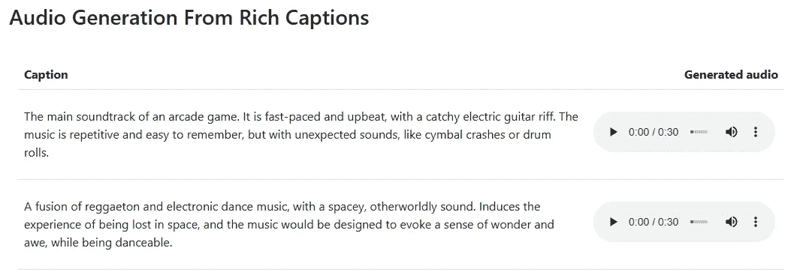
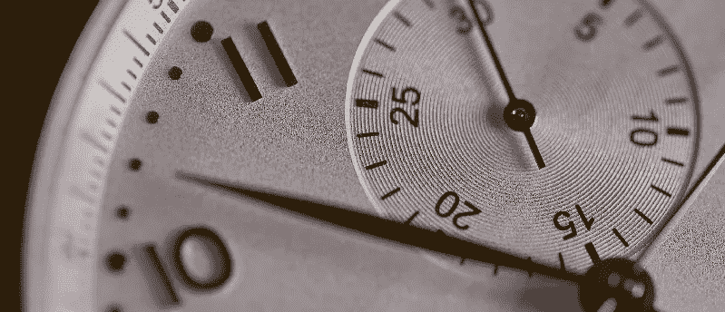
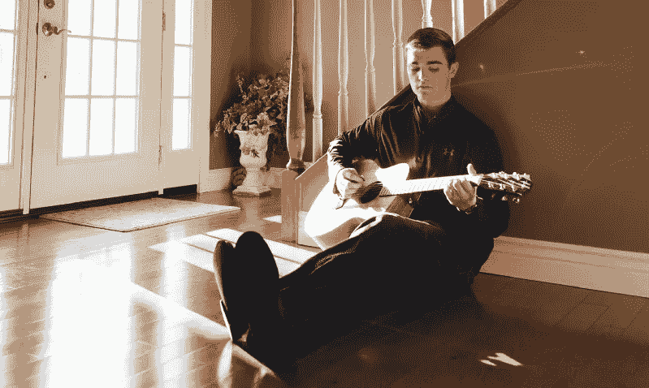
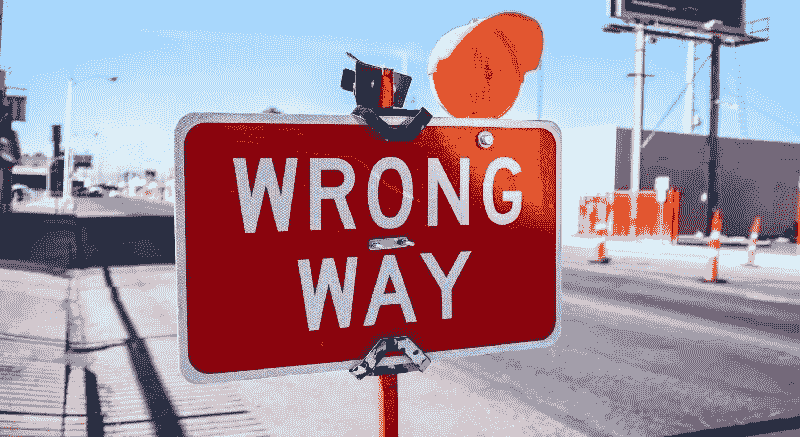

# MusicLM — 谷歌是否解决了 AI 音乐生成问题？

> 原文：[`towardsdatascience.com/musiclm-has-google-solved-ai-music-generation-c6859e76bc3c`](https://towardsdatascience.com/musiclm-has-google-solved-ai-music-generation-c6859e76bc3c)

## 论文及其重要性解释

 [Max Hilsdorf](https://medium.com/@maxhilsdorf?source=post_page-----c6859e76bc3c--------------------------------)

·发表于 [Towards Data Science](https://towardsdatascience.com/?source=post_page-----c6859e76bc3c--------------------------------) ·阅读时间 11 分钟·2023 年 2 月 2 日

--

图片来源：[Placidplace](https://pixabay.com/de/illustrations/sprecher-lautsprecher-7459276/)。

# 介绍

在 2023 年 1 月 25 日的一个 PowerPoint 演示中，我描述了生成高质量长序列音乐作为音频 AI 领域在不久的将来需要解决的主要挑战之一。一天之后，我的幻灯片就过时了。

> MusicLM 由 Google Research 开发，可以根据自然语言中的简单文本查询生成风格和流派各异的高质量音乐，时长为一分钟。

最好还是亲自体验一下，查看充满音乐示例的[演示页面](https://google-research.github.io/seanet/musiclm/examples/)。如果你对细节感兴趣，也可以查阅研究论文，尽管本文也会涵盖所有相关主题。

来自 MusicLM 演示页面的摘录。图片由作者提供。

那么，是什么让 MusicLM 成为如此巨大的技术飞跃？它解决了过去十年困扰 AI 研究人员的哪些问题？为什么我仍然认为 MusicLM 是一种过渡技术——通向音乐制作不同世界的桥梁？这些问题以及更多内容将在这里解答，而不会让你感到枯燥的数学或过多的技术术语。

# 挑战 1：将文本转换为音乐

图片来源：[Debby Hudson](https://unsplash.com/@hudsoncrafted?utm_source=medium&utm_medium=referral) 供图于[Unsplash](https://unsplash.com/?utm_source=medium&utm_medium=referral)

> MusicLM 利用了最近发布的一种模型，将音乐和文本都映射到同一个“地图”上。就像计算从伦敦到斯德哥尔摩的距离一样，MusicLM 可以计算音频-文本对之间的“相似性”。

## 音乐难以描述

将文本转化为音乐是一项复杂的任务，因为音乐是一种多维度的艺术形式，不仅涉及音乐的旋律和和声，还包括节奏、速度、音色等等。为了将文本转化为音乐，机器学习模型需要能够理解和解释文本的含义，然后利用这种理解来创作出准确表现文本的音乐作品。

将文本转化为音乐的另一个问题是，音乐是一种高度主观的艺术形式。一个人认为是“快乐”的音乐可能会被另一个人听成是“苦涩”或“平静”。这使得机器学习模型很难创作出被普遍认为是“快乐”的作品。尽管音乐常被（在我看来是错误地）描述为一种普遍语言，但从口语到音乐的客观翻译似乎是不可能的。

## MusicLM 的方法

考虑到这一点，你可能会惊讶地发现，将文本转化为音乐并不是 MusicLM 的主要贡献。将文本与音频、图像与文本或音频与图像关联起来的机器学习模型（我们称之为“跨模态模型”）在过去 2-3 年里在学术界和工业界变得相当成熟。当然，最著名的跨模态模型之一是[DALL-E 2](https://openai.com/dall-e-2/)，它根据输入文本生成高分辨率图像。

在 MusicLM 中，研究人员并没有自己训练跨模态部分。相反，他们利用了一个名为“MuLan”的预训练模型，该模型于 2022 年发布（详见论文[这里](https://arxiv.org/pdf/2208.12415.pdf)）。MuLan 通过一种称为“对比学习”的方法训练，以将音乐与文本关联起来。在这里，训练数据通常包括成千上万对音乐及其描述文本的配对。学习目标是，当呈现任何一对音乐和文本（不一定是关联的）时，模型能够判断文本是否属于音乐。一旦实现了这一点，模型就能够计算音频-音频、文本-音频或文本-文本对之间的相似度。

# 挑战 2：减少生成音乐的时间和资源

图片来源：[Agê Barros](https://unsplash.com/@agebarros?utm_source=medium&utm_medium=referral)在[Unsplash](https://unsplash.com/?utm_source=medium&utm_medium=referral)

> MusicLM 利用最先进的音频压缩工具，显著减少了生成高质量音频信号所需的信息量。

目前，该模型能够判断它生成的音乐是否符合给定的文本输入。然而，音频生成过程本身存在一些挑战，主要是创建一段音乐所需的时间和资源。

## 维度问题

尽管音乐对我们人耳来说很容易处理，但对于数据科学家来说，它是一种相当复杂的数据类型。普通的流行歌曲（3:30 min）在 CD 质量下以几乎 1000 万个数字存储在计算机中。相比之下，高清质量的图片（1280 x 720 像素）存储和处理的值甚至不到 100 万。近年来，已经开发了许多方法，将音乐压缩成计算上更便宜的格式，同时保持高质量的声音。

使用传统的方法，生成 1 分钟的 CD 质量音乐（44100 Hz）需要机器学习模型生成大约 260 万个数字——一个接一个。如果生成一个数字仅需 0.01 秒，那么这个过程仍然需要超过 7 小时来完成。不难想象，如果你请一位专业音乐家作曲和录制音乐，他们会更快地完成任务。关键点是：到目前为止，在快速音频生成和输出质量之间存在巨大的权衡。

## 以往的方法

为解决这个问题，已经尝试了许多方法。一种较新的方法是间接生成音频，即首先生成音频信号的图像表示（例如，“频谱图”），然后将此图像转换为“真实”音频（如在 [“Riffusion”](https://www.riffusion.com/) 中所做）。另一种方法是通过创建符号表示来避免直接生成音频。音乐的最广泛知晓的符号表示是乐谱。如你所知，乐谱并不是一个真实的音频事件，但音乐家能够将其转换为真实的音频。过去，我们已经看到机器学习模型在符号 MIDI 格式下生成音乐的相当成功（例如，参见 Magenta 的 [Chamber Ensemble Generator](https://magenta.tensorflow.org/ceg-and-cocochorales)）。然而，这两种方法都有其弱点，主要是因为生成“真实的东西”非常困难。

## MusicLM 的 Approach

最后，让我们讨论 MusicLM 采用的方法。MusicLM 并不是生成音频的代理（如图像或 MIDI），而是应用了一种最先进的音频压缩算法 [“SoundStream”](https://ai.googleblog.com/2021/08/soundstream-end-to-end-neural-audio.html)，该算法于 2021 年发布。使用 SoundStream，模型能够以 24 kHz（每秒 24000 个数字）的速度生成音频，同时实际计算仅 600 个数字。每秒从 600 个值映射到 24000 个值的工作由 SoundStream 处理。换句话说，模型需要生成 97.5%更少的信息，同时实现大致相同的结果。虽然过去也有其他优秀的压缩算法，但 SoundStream 明显优于所有这些算法。

# 挑战 3：生成连贯且真实的音乐

图片由 [Brantley Neal](https://unsplash.com/@brantley_neal?utm_source=medium&utm_medium=referral) 提供，来自 [Unsplash](https://unsplash.com/?utm_source=medium&utm_medium=referral)

> 通过将文本与音乐的关联任务与实际音频生成部分分开，MusicLM 可以在数十万小时的未标注音频数据上进行训练。这有助于其生成音乐的丰富性。

## 术语

对于“连贯”和“真实”音乐究竟是什么，确实值得讨论。然而，在 AI 生成音乐的背景下，可以说，我们甚至会考虑将 MusicLM 的作品称为“连贯”和“真实”，这一点已经足够说明问题。对于一个宽松的工作定义，假设连贯的音乐具有一个通过不同部分和/或通过音乐创意的重复、变化或引用来表现的基础结构。这里的“真实”指的是，AI 生成的音乐呈现出一种能够让我们相信是人类有意创作的方式。

## 音乐的“记忆”

生成连贯的音乐并不是 MusicLM 的突破。早在 2018 年，Google Magenta 的 [“音乐变换器”](https://magenta.tensorflow.org/music-transformer) 就能够创作具有清晰旋律和和声序列的 MIDI 音乐，其中音乐创意会重复或被改变。音乐变换器能够跟踪过去超过 45 秒的音乐事件。然而，由于原始音频远比符号 MIDI 表示复杂，这样的大“记忆”对于生成原始音频的模型来说长期以来都是难以实现的。MusicLM 拥有 30 秒的“记忆”，这比我所知道的任何类似模型都要多（尽管我可能错了——发布的模型实在是太多了……）。虽然这并不允许 MusicLM 创作出长达 15 分钟的史诗作品，但仍足以维持基本的音乐结构，如节奏、韵律、和声和音色，较长时间内不会丧失。

## 真实输出

更重要的是，在我看来，MusicLM 创作的音乐听起来出奇地真实。对此的技术解释可能是，MusicLM 找到了一种巧妙的方法，利用数千小时的未标注音乐（即没有文本描述的音乐）来训练文本到音乐的模型。通过使用预训练的“MuLan”模型来关联文本和音乐，他们设计了模型架构，使其可以将音频生成部分与未标注音频数据分开学习。其基本假设是，将音乐与文本关联并不像创作真实音乐那么困难。将问题重新定义并调整架构的这一“技巧”可能是 MusicLM 成功的关键因素。

从某种意义上说，结果不言而喻。首次出现的 AI 模型不仅仅是介于作曲和音乐之间的中间产品，或者是任何 4 岁儿童都能区分开的人造音乐。它这次确实感觉有所不同。感觉类似于我第一次阅读 GPT-3 写的文本时。类似于我第一次看到 DALL-E-2 生成的图像时。MusicLM 可能正是那个将在历史上留下印记的突破性 AI 音乐模型。

# MusicLM 的不足与未来展望

[Kenny Eliason](https://unsplash.com/@neonbrand?utm_source=medium&utm_medium=referral)拍摄于[Unsplash](https://unsplash.com/?utm_source=medium&utm_medium=referral)

## 定量不足

尽管 MusicLM 具备所有这些令人惊叹的特点，但该模型绝非完美。我甚至会说，与文本的 GPT-3 或图像的 DALL-E-2 等模型相比，MusicLM 似乎更加有限。一个原因是，生成的音乐只有机器学习社区认为是高质量的。如果没有有效的方法将 24 kHz 的音乐上采样到 44.1 kHz，生成的作品将永远无法在现实世界中使用，因为仔细聆听时，即使是非专家也能注意到 CD 录音和 MusicLM 输出之间的质量差异。而一个 1024 x 1024 的图像（如 DALL-E-2 生成的）已经可以用于网站、博客等，而 24kHz 的音乐始终会被视为不合格。

类似地，虽然 30 秒的“记忆”对于一个音频机器学习模型来说令人印象深刻，但一个训练有素的作曲家可以创作数小时的连贯音乐，训练有素的音乐家也可以轻松演奏这些音乐。机器学习模型在这方面要赶上人类还有很长的路要走。然而，随着计算资源的增加，模型的采样率和“记忆”无疑会增加。此外，音频压缩和机器学习方法的改进可能会进一步加速这一过程。看到生成式 AI 模型在过去 2-3 年里提高得如此迅速，我相信这些问题在今年年底之前或多或少会得到缓解。

## 质量/伦理不足

然而，也有一些问题无法仅通过规模解决：知识产权问题。在最近的过去，许多大型生成模型已遭遇版权诉讼（[GitHub Copilot](https://www.theverge.com/2022/11/8/23446821/microsoft-openai-github-copilot-class-action-lawsuit-ai-copyright-violation-training-data) & [StableDiffusion](https://indianexpress.com/article/technology/ai-image-tools-stable-diffusion-midjourney-sued-by-artists-8389495/#:~:text=Stable%20Diffusion%20is%20currently%20facing,that%20were%20protected%20by%20copyright.)，仅举其中两个）。在大多数情况下，这些模型是在未经商业用途许可的数据上进行训练的。虽然模型的创作是“新的”，但你可以认为它仍然“商业性地使用”了训练数据。MusicLM 也是如此。此外，总是有可能生成“窃取”了整个旋律或和弦序列的版权保护作品的内容。

在 MusicLM 论文中，生成与训练数据中的一段音乐“完全匹配”的概率不到 0.2%。虽然这个概率听起来很低，但请记住——假设 0.2%的生成率——每 500 个生成的曲目中可能有 1 个是版权声明的安全嫌疑对象。更大的数据集、更多的多样性以及改进的模型架构或训练算法几乎肯定能帮助降低这一比率，但核心问题依然存在，就像图像或文本等其他领域一样：如果我们计划使用在版权保护数据上训练的生成型 AI 模型，我们不能在大规模上生成输出而不冒重大法律风险。然而，这不仅仅是财务风险，也是一个重大的伦理问题。

此外，MusicLM 及其训练数据都没有公开发布。这引发了关于 AI 系统透明度和问责制的伦理问题。由于像 MusicLM 这样的 AI 模型有可能颠覆整个行业，因此开发过程和方法论应当接受审查。这将使研究人员能够了解模型的训练方式，评估其偏见，并识别可能影响其输出的任何局限性。如果没有模型的访问权限，很难评估其对社会的影响以及可能带来的风险。

最后，目前尚不清楚 MusicLM 或未来模型的商业应用场景。世界上已经有数以百万计的人在有效地免费制作优秀音乐。因此，通过用机器替代人类来降低音乐创作成本既在经济上没有效益，更不用说在伦理上是不可取的。尽管 MusicLM 仍有一定的盈利潜力，我认为生成型 AI 作为人类作曲家的助手，帮助他们快速原型化音乐创意并专注于为世界创造艺术价值，具有更大的潜力和价值。

## 未来展望

很难预测未来在音乐生成 AI 方面会带我们走向何方。可以确定的一点是：MusicLM 将被更大规模的模型取代，这些模型将使用更大的数据集和更智能的算法。这些模型无疑能够克服许多 MusicLM 的不足之处。似乎像这样的技术会不可避免地彻底改变音乐市场——而且这种改变可能会比我们预期的更早。然而，我认为将全部注意力集中在黑箱模型上是一个错误。总体而言，世界并不需要完全依赖机器进行音乐制作。我们有的是人类来完成这一任务。真正重要的是我们应当利用 AI 技术，通过开辟新的发明、创造和享受音乐的方式，将更多的艺术价值带入这个世界。

**感谢阅读本文！** 我主要撰写有关 AI 和音乐交集的内容，如果你对此感兴趣，你可能还会喜欢我的其他作品。
