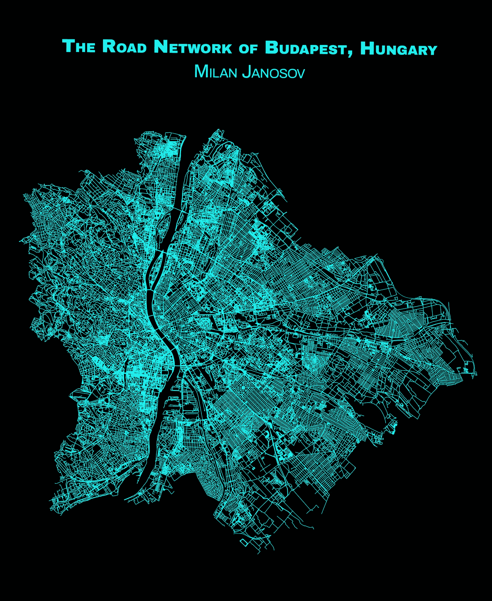
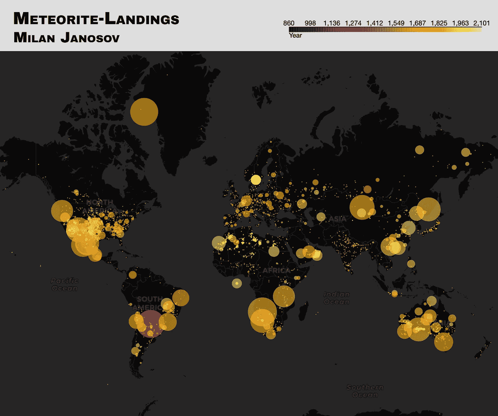
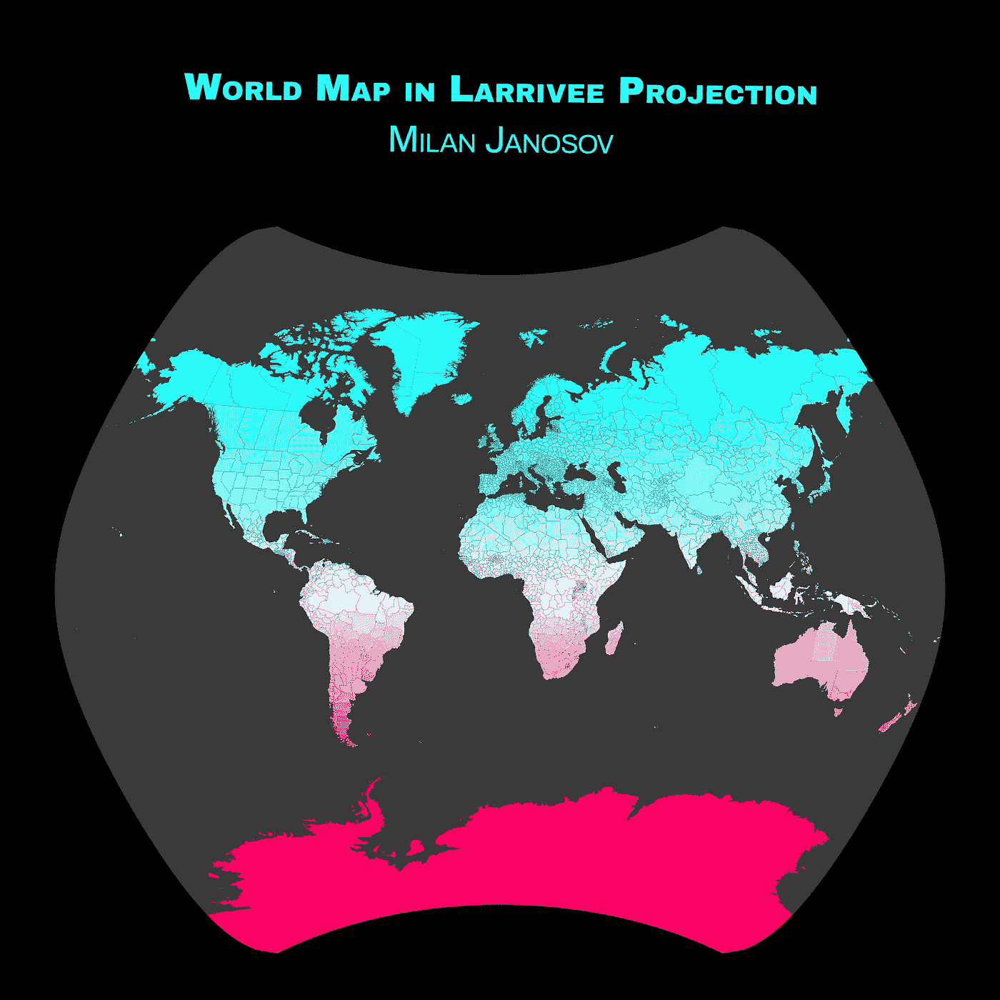
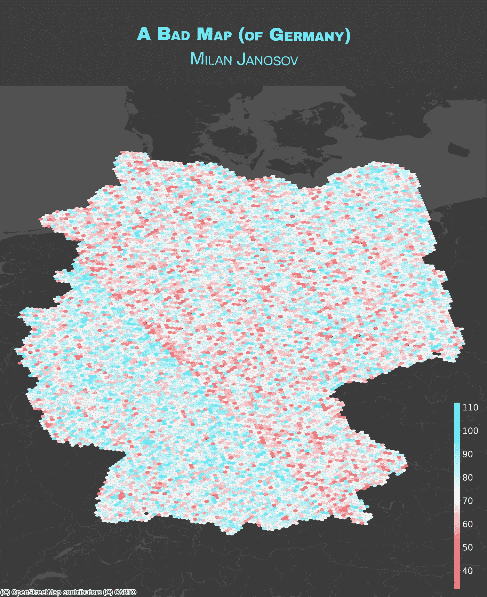
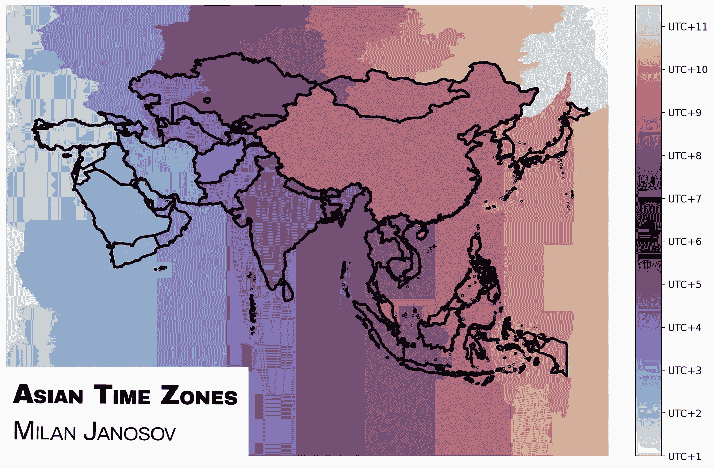
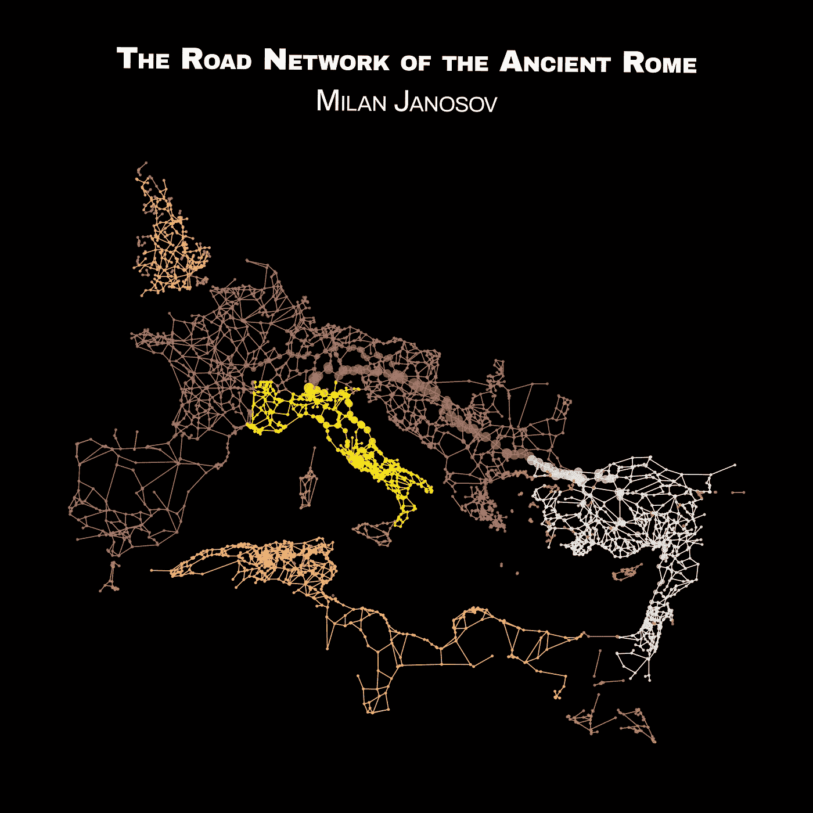

# 我的#30DayMapChallange 第一周

> 原文：[`towardsdatascience.com/my-first-week-of-the-30daymapchallange-1bef0646c88e`](https://towardsdatascience.com/my-first-week-of-the-30daymapchallange-1bef0646c88e)

作者提供的图像。

## 我对#30DayMapChallange 第一周的个人看法，这是一个旨在每年 11 月每天设计主题地图的社会挑战。

 [Milan Janosov](https://medium.com/@janosovm?source=post_page-----1bef0646c88e--------------------------------)

·发表于 [Towards Data Science](https://towardsdatascience.com/?source=post_page-----1bef0646c88e--------------------------------) ·5 分钟阅读·2023 年 11 月 7 日

--

自 2019 年以来，每年 11 月地理信息系统（GIS）和空间分析社区都会变得非常忙碌——这要归功于一个名为[#30DayMapChallange](https://30daymapchallenge.com)的有趣挑战。每年，这个挑战都有一个主题安排，提出一个应该作为当天地图可视化主要方向的主题。虽然这些问题确实意味着某种限制，但它们也帮助参与者找到共同兴趣，分享数据源，并在视觉和技术上表达个人风格。

在这里，我想简要概述一下我参加这个挑战的第一周，详细展示我创建的不同地图——通常使用 Python。

*在本文中，所有图像均由作者创建。*

# 第一天——点

这个挑战的第一天通常涉及所有几何形状中最简单的——点。为了创建我的 POI 地图，我使用了[NASA 的开放数据门户的陨石着陆数据](https://lnkd.in/dC-KWjyw)。这个数据集包含大约 40k 条观察数据，当这些数据放置在地图上时，与人口密度显示出显著的相关性。因此，陨石要么落在有人居住的土地上，要么我们在更多人居住的地方有更多关于陨石的数据，对吧？

为了创建这个（交互式）地图，我使用了 Python，特别是 Folium。

在可视化中，我根据每颗陨石的记录质量（以克为单位，范围从 0.01 克到 60,000 千克或 60 吨）来调整每个点标记的大小。顺便说一下，这颗 60 吨重的巨型 Hoba 是在 1920 年在纳米比亚的 Grootfonteinn 发现的。然后，我根据发现时间为每个标记着色。有趣的事实是：第一颗记录在案的陨石 Nōgata（472 克）是在 861 年在日本福冈县发现的，发现后不久。经过这次观察，数据库中几个世纪没有数据。然后，最后，Elbogen 在 1399 年（107000.0）出现，接着是 1490 年的 Rivolta de Bassi（103.3 克）和 1491 年的 Ensisheim（127000.0 克）。查看数据集中的后期，结果表明 35%的陨石是在 2000 年后记录的，98%是在 1899 年后记录的。

第 1 天——点

# 第 2 天——线

在点之后，自然地，就到了线（或者更准确地说，是线字符串）。作为一名网络科学家和地理空间数据科学家，我的选择显而易见：使用从 OpenStreetMap 收集的数据，通过[OSMNx](https://osmnx.readthedocs.io/)包来可视化我家乡布达佩斯的道路网络。

关于这个网络的有趣事实：它有 115,539 个节点和 316,096 条边，而所有道路段的总长度为 1,879 公里！

第 2 天——线

# 第 3 天——多边形

首先是点，然后是线——现在，轮到多边形了！在这张地图上，我将世界上的每个国家视为一个单独的多边形，基于[Natural Earth](https://www.naturalearthdata.com/downloads/10m-cultural-vectors/)数据进行构建。为了添加一个漂亮的渐变颜色，我根据每个国家距离赤道的距离来着色。所有计算都在 Python 中完成，视觉效果则使用 Matplotlib 制作。

这张地图形状相当奇特，因为我使用了所谓的 Larrivee 投影，这种投影由 Léo Larrivée 于 1988 年为加拿大开发。你可以在[这里](https://medium.com/towards-data-science/the-world-map-with-many-faces-map-projections-f58a210ff2f7)了解更多关于不同地图投影的信息。

第 3 天——多边形

# 第 4 天——一张糟糕的地图

地图挑战的第四天非常不寻常——当每个人都忙着制作自己一生中最好的地图时，我们必须制作一张差的地图。然而，这张地图如何糟糕则取决于解释。

为了确保我的地图足够差，我做了一些数学计算，以得出一张毫无意义、绝对糟糕的德国地图。首先，我使用 OSMNx 包从 OpenStreetMap 下载了德国的行政边界。其次，使用 Uber 的[H3](https://eng.uber.com/h3/)库将其拆分成六边形，使用六边形级别 6，得到了 12122 个六边形。第三，对于每个六边形，我计算了其质心的经纬度坐标（使用 epsg:4326），精确到 14 位小数。然后，我将经纬度坐标中的每个数字相加，得到用于为每个六边形单元着色的‘分数’。完成！毫无意义！

第四天 — 一张糟糕的地图

# 第五天 — 模拟地图

在经过四天的密集数据处理后，第五天我们被带到荒野中，并要求我们制作模拟地图。由于当时离万圣节还很近，我决定将其与地图挑战结合起来，并在上面雕刻布达佩斯的地图。

可怕的部分有点隐藏 — 我使用了 EPSG:23700，即匈牙利的本地投影系统，这在布达佩斯看起来非常好，但在其他任何国家的几何图形上使用时很可能效果糟糕。如果你敢试试的话！

第五天 — 模拟地图

# 第六天 — 亚洲

第六天，我回到了之前介绍的自然地球数据库，并下载了包含全球时区的 GIS 文件。由于第六天的主题是亚洲，我需要进行一些过滤，找出 48 个亚洲国家，然后得出了如下地图 — 使用了 Python 和 Matplotlib。

第六天 — 亚洲

# 第七天 — 导航

最近，我在[哈佛数据集](https://dataverse.harvard.edu/dataset.xhtml?persistentId=doi%3A10.7910%2FDVN%2FTI0KAU+https%3A%2F%2Ftowardsdatascience.com%2Fdo-all-the-roads-lead-to-rome-5b6756ce7d52)上发现了一个有趣的数据集，名为罗马道路网络（2008 版）：这是一个完美的 GIS 格式的罗马帝国历史道路网络。我将其转化为网络分析项目，并发布在[数据科学之路](https://medium.com/towards-data-science/do-all-the-roads-lead-to-rome-5b6756ce7d52)上。正如这个项目所展示的，确实，昔日的所有道路都通向罗马；我相信这是一个— 相对简单但仍然 — 的导航地图，引导每一个踏上这些道路的人前往中心。

第七天 — 导航

这是我进行#30DayMapChallenge 的第一周总结 — 还有三周的挑战，准备迎接更多的地图吧！现在，我还在我的[Patreon](https://www.patreon.com/milanjanosov)频道上提供视频和代码教程。
