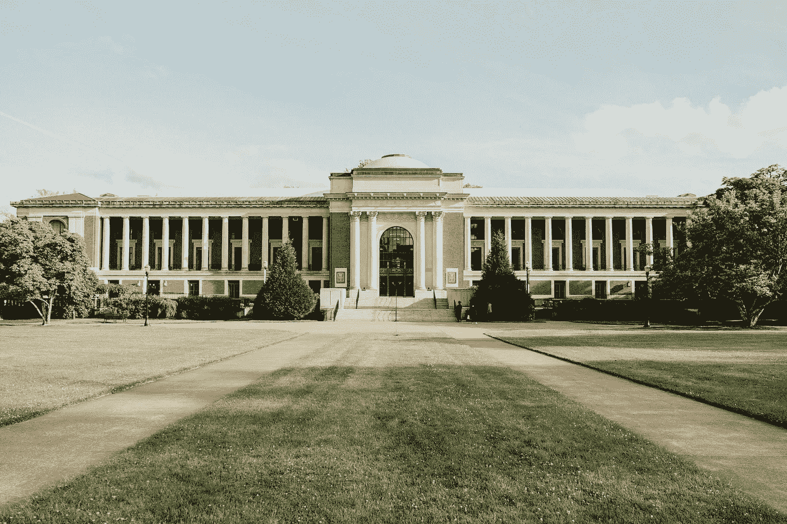

# 我在人工智能领域获得博士学位的旅程

> 原文：[`towardsdatascience.com/my-journey-to-phd-admission-in-artificial-intelligence-35593adb923f?source=collection_archive---------0-----------------------#2023-06-18`](https://towardsdatascience.com/my-journey-to-phd-admission-in-artificial-intelligence-35593adb923f?source=collection_archive---------0-----------------------#2023-06-18)

## 关于在未知领域中导航的个人回忆

[](https://medium.com/@fiona.victoria?source=post_page-----35593adb923f--------------------------------)[](https://towardsdatascience.com/?source=post_page-----35593adb923f--------------------------------) [Fiona Victoria](https://medium.com/@fiona.victoria?source=post_page-----35593adb923f--------------------------------)

·

[关注](https://medium.com/m/signin?actionUrl=https%3A%2F%2Fmedium.com%2F_%2Fsubscribe%2Fuser%2F946e42b7146f&operation=register&redirect=https%3A%2F%2Ftowardsdatascience.com%2Fmy-journey-to-phd-admission-in-artificial-intelligence-35593adb923f&user=Fiona+Victoria&userId=946e42b7146f&source=post_page-946e42b7146f----35593adb923f---------------------post_header-----------) 发表在 [Towards Data Science](https://towardsdatascience.com/?source=post_page-----35593adb923f--------------------------------) · 8 分钟阅读 · 2023 年 6 月 18 日[](https://medium.com/m/signin?actionUrl=https%3A%2F%2Fmedium.com%2F_%2Fvote%2Ftowards-data-science%2F35593adb923f&operation=register&redirect=https%3A%2F%2Ftowardsdatascience.com%2Fmy-journey-to-phd-admission-in-artificial-intelligence-35593adb923f&user=Fiona+Victoria&userId=946e42b7146f&source=-----35593adb923f---------------------clap_footer-----------)

--

[](https://medium.com/m/signin?actionUrl=https%3A%2F%2Fmedium.com%2F_%2Fbookmark%2Fp%2F35593adb923f&operation=register&redirect=https%3A%2F%2Ftowardsdatascience.com%2Fmy-journey-to-phd-admission-in-artificial-intelligence-35593adb923f&source=-----35593adb923f---------------------bookmark_footer-----------)

照片由 [Casey Olsen](https://unsplash.com/@caseface96?utm_source=medium&utm_medium=referral) 提供，来源于 [Unsplash](https://unsplash.com/?utm_source=medium&utm_medium=referral)

# 一切就此结束！

在经过 6 个月的紧张大学申请和焦急的倒计时之后，我很高兴地说我将在 2023 年秋季攻读人工智能博士学位。我决定写这篇博客，分享我在这段旅程中学到的宝贵经验和遇到的挑战，这些都让这一切成为可能。

## **背景**

关于我的一点背景，我在印度一所顶级私立学校完成了机器人与自动化学士学位。这所学校在全国排名[第 63 位](https://www.nirfindia.org/2023/EngineeringRanking.html)，在该州前 10（大约 500 所大学中）。我选修了机器学习和人工智能课程，这激发了我对这一领域的兴趣。虽然在那里度过的时光塑造了我的学术成功，但我常常疑惑为什么当时没有考虑研究的道路。我遇到了一些幸运的人，他们在本科期间发现了对研究的热情，并积极与教授合作，参与同行评审期刊或会议论文的撰写。显然，早期发表可以成为游戏规则的改变者，我也见证了它如何积极塑造了该领域其他人的档案。

在本科毕业后，我在一家初创公司担任机器学习工程师（MLE）。虽然我的时间相对较短，但我获得了使用流行深度学习框架——TensorFlow 的宝贵经验。我参与了一个集中于神经网络量化的项目，涵盖了训练、评估和推断阶段。通过这个过程，我学会了如何构建神经网络架构，修改图层，并从头开始创建内核，使我对 TensorFlow 的底层源代码有了全面的了解。参与这样的项目（即使是个人项目）将培养深度学习优化技术的坚实基础，增强作为研究员的思维能力。它还将提供不仅是预训练算法的最终用户的信心，还能设计符合研究目标的定制或特定神经网络模型。

尽管有些人跳过了在行业中工作的这一过程（这完全没问题！），但我个人看到了合作并获得实践经验的价值，这让我在继续攻读研究生学业时具备了优势。这个过程教会了我如何有效地与团队成员合作，如何将项目从构思推进到完成，以及如何无畏地深入探究，在过程中制造和打破事物。总的来说，我作为机器学习工程师的短暂经历是一次非常充实的旅程，为我下一阶段的旅程奠定了基础。

> **无论你在旅程中处于何处，不要担心错失的机会。考虑一下你在接下来的日子里能控制的事物，并把精力投入到下一个最重要的事情上。**

作为下一步，我进入了一个硕士项目，旨在深入探索人工智能。在此期间，我享受了创建一个作品集网站、LinkedIn 个人资料和定制简历以展示我的能力的额外挑战。基本上，建立一个专业品牌。展望未来两年，并不断增加对未来目标有意义的内容。但这还不是全部！这段时间还通过各种演讲锻炼了我的沟通技能，有效地让我传达我的想法。与来自不同背景的专业人士合作，帮助我建立了一个能够持续一生的强大网络。我还有机会作为课程的一部分参与令人兴奋的实际项目，这帮助我建立了研究作品集，并深深地培养了对研究的热情。

我相信，对研究的热情源于对研究潜力的好奇心，这种潜力能够推动特定领域的边界，同时对社区产生积极影响。此外，你还会有机会与跨大学的研究人员合作——这教会了你准备研究实验室会议、批判性思维和科学写作的过程。它还为你提供了参加技术会议的机会，在那里你可以与来自全球不同领域的专家互动。这与探索感兴趣领域的自由相结合，就是我所说的理想“研究者的世界”——一个好奇心、韧性、合作和影响力交织的世界。我的研究经验属于负责任的人工智能（Responsible AI）这一大范畴，我希望成为隐私保护的人工智能/机器学习系统的专家。每天 intellectually 刺激我的，是阅读现有文献、制定研究问题以及设计实验以检验我的假设的过程。

在硕士课程的第二年，我有三个选择：课程学习、项目基础和论文基础。从一开始，我就决定选择论文，这确保了通向博士学位的道路始终对我开放。论文是完成硕士学位的最具挑战性的路径，与博士论文非常相似，但规模小得多。我认为自己很幸运，找到了一个与我兴趣紧密相关的论文指导老师。在生成性人工智能（Generative AI）在行业内掀起热潮之前，我就对基于计算机视觉的生成模型产生了兴趣。经过数月的相关文献阅读、多个精心设计实验的迭代和与导师的一对一会议，我成功完成了题为“[Phoenix](https://arxiv.org/abs/2306.04098) — 一个联邦生成扩散模型”的论文。

下面是我在这个过程中学到的一些关键经验：（1）通过跟踪你感兴趣领域的预印本和同行评审的研究工作，保持相关性；（2）主动识别机会并解决人工智能领域的动态变化中的空白；（3）准备进行严格的实验，以彻底测试你的方法。对于所有打算攻读博士学位的硕士生来说，我的建议是：享受学习的过程，并记住抓住每一个超越课程的机会。

## **博士申请过程**

一旦我决定攻读人工智能领域的博士学位，我意识到还有很多工作要做——完全不知道从哪里开始申请过程。作为家中第一个踏入这个未知领域的人，我通过博客和视频进行了大量自学，每个博客和视频都详细描述了他们申请博士的个人经历。我理解和遵循的核心要点如下，

+   **项目** — 更深入地研究你想攻读的项目（计算机科学、人工智能或电子工程），然后缩小你的研究兴趣范围。这可以是你已经熟悉的领域，或者你可以选择进入一个新的、令人兴奋的领域，进一步探索你热衷的方向。

+   **大学 —** 选择大学没有明确的指导方针，但通常人们会参考一些大学排名网站（如 csranking、drafty.cs、usnews），并申请梦校、目标校和保底校的组合。然而，我建议不要完全依赖排名列表来作为决策的唯一标准。研究设施、跨学科合作和资金机会更为重要。记住，作为博士生，你的生活在很大程度上依赖于研究质量和导师的指导，这比大学本身更为重要。

+   **潜在导师 —** 这是可能是最重要的考虑因素。阅读你潜在导师的出版物，看看是否有特别吸引你兴趣的内容。建立一个强大且支持性的关系对你接下来 4 年以上的生活至关重要——在这一过程中分配足够的时间来彻底决定。个人而言，我在每所大学选择了两位与我的研究兴趣一致的导师。我还记下了关键点（例如，我对他们的哪些工作印象深刻、我为何适合、我们的共同目标和兴趣等），这些我可以在个人沟通和申请论文中提及。

+   **个人陈述——** 这是展示你的写作技巧和突出你研究成就的最佳机会。请不要以“自从我出生以来，我就想做研究”等通用短语开头。要现实地自豪地描述你的研究背景，包括它的起源时间和地点。你还应详细说明你最显著的研究成果、社区参与和志愿活动。此外，添加一些关键点，说明为什么你会选择与某位导师合作，以及这将如何强化你的研究生涯。这篇文章应该清晰地表达你为什么值得在他们的大学/研究实验室追求博士学位。我见过一些样本文章还突出个人挑战及其克服方式，但这完全取决于你是否愿意在个人陈述中包含这些内容。虽然添加所有这些技术细节很重要，但不要忘记注入最能代表你的个人风格。毕竟，这不是一份报告！

+   **推荐信——** 你需要至少三位教授的强有力推荐信。然而，你也可以请求两位教授和一位在行业内知名人士的推荐信。虽然信件内容是保密的，但你可以请求与你有良好工作关系的个人撰写信件。这样，这些信件更有可能传达出对你性格和独立研究能力的积极评价。

## **我的检查清单**

在整个入学申请过程中，我保持了一个电子表格来保持组织性。这个表格可以跟踪我阅读的博客、任何突发的想法以及所有我打算申请的大学的全面列表。这里列出了一些表格字段，但可以根据需要自定义，因为没有一个模板适合所有人。

```py
** University
* Department/Program
* Links
* Personal Ranking
* Deadline
* Tests GRE/TOEFL
* Application Fee
* Potential Advisors
* Recommendation Letters
* Extra Notes*
```

大多数入学申请截止日期从 12 月初到 1 月中旬。为了让这一过程更可控、更少压力，我决定每天申请一所大学。申请提交后，进入了等待阶段。这个阶段开始时充满了查看 gradcafe、discord 群组的诱惑，这让集中精力于日常活动变得更加困难。我建议不要像我一样陷入这个循环，因为结果会在 2 月后逐渐公布。在此期间，你还可能会开始收到来自教授的邮件，表达他们对进一步对话（如匹配面试）的兴趣，无论是面对面还是虚拟的。

## **反思和教训**

+   **尽早开始**——研究、研究、再研究！不仅是你的发表作品，还有潜在的大学、导师以及工作领域。

+   **建立你的个人资料** — 收集所有本科期间的成果，并考虑建立一个作品集网站以突出你的成就。

+   **建立网络** — 利用 Linkedin 的力量，与那些经历过类似道路的其他人建立联系。他们通常会提供来自个人经验的见解。

> **好事需要时间，而伟大的事物则需要更长的时间。**

希望这对那些想开始申请博士学位的朋友有所帮助。虽然这听起来可能很艰难和具有挑战性，但这个过程是值得的。不要被未选择这条道路的同龄人或身边的人所影响。选择这条少有人走的路，过程会更加激动人心，需要极大的热情和努力！祝好运，我们在另一端见 :)

我最欣赏的 AI 科学家：李飞飞博士、安妮玛·安南库玛博士、达芙妮·科勒博士

[作品集](https://fionavictoria.github.io/)。 [Linkedin](https://www.linkedin.com/in/fionavictoria/)。 [我作为艺术家](https://www.instagram.com/frozen_illusionist/?hl=en)
