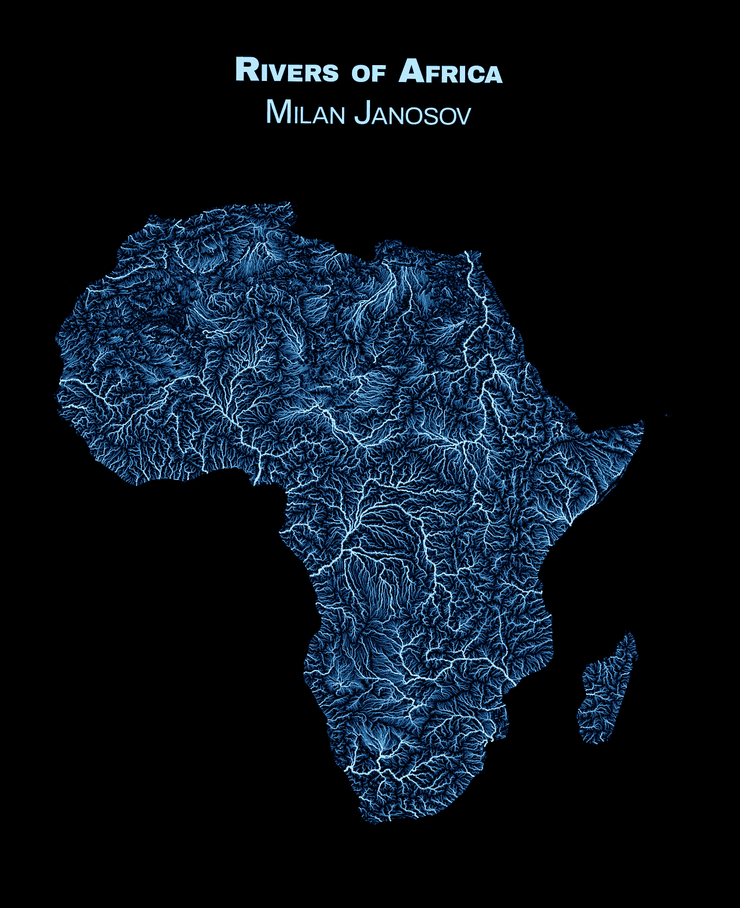
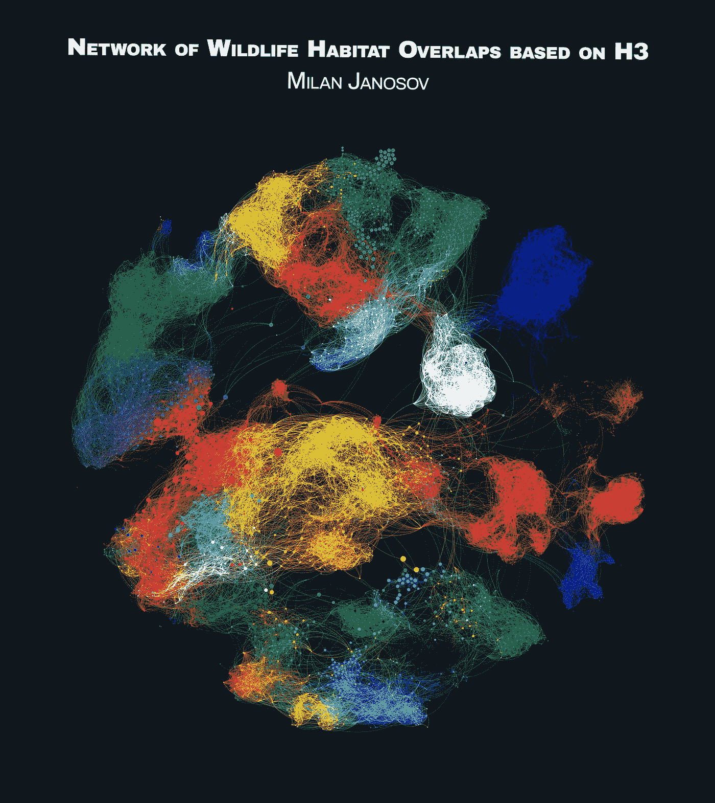
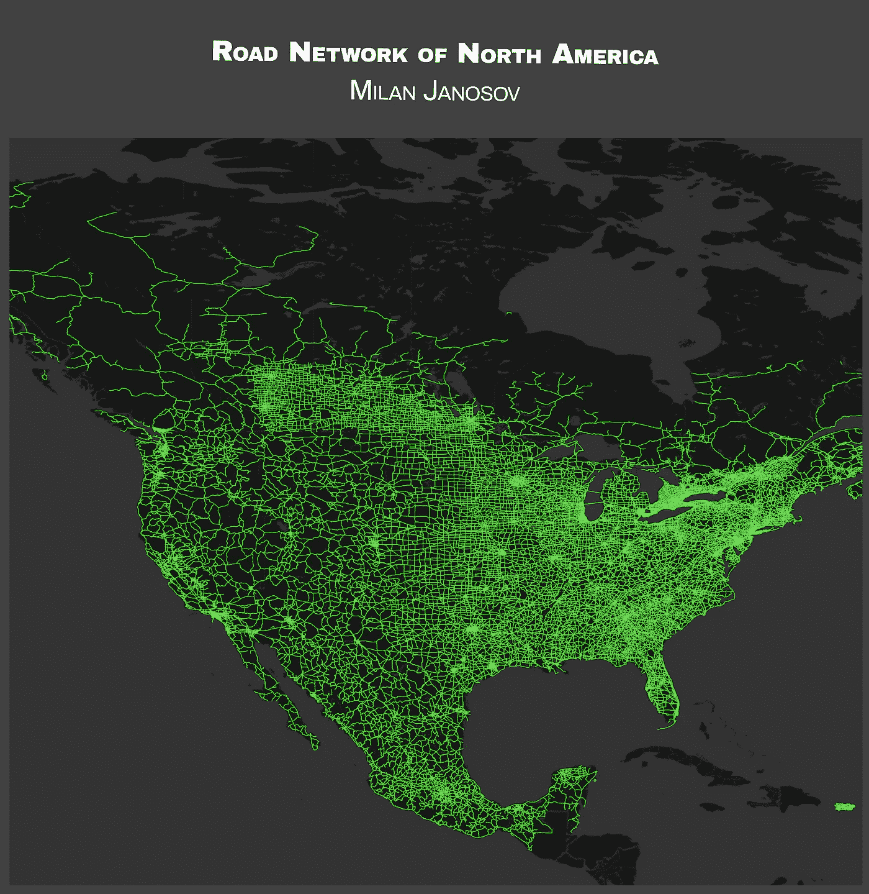
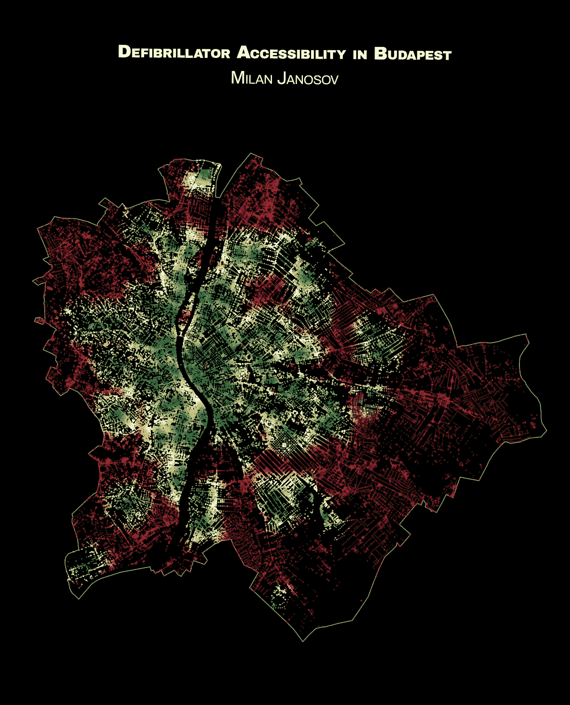
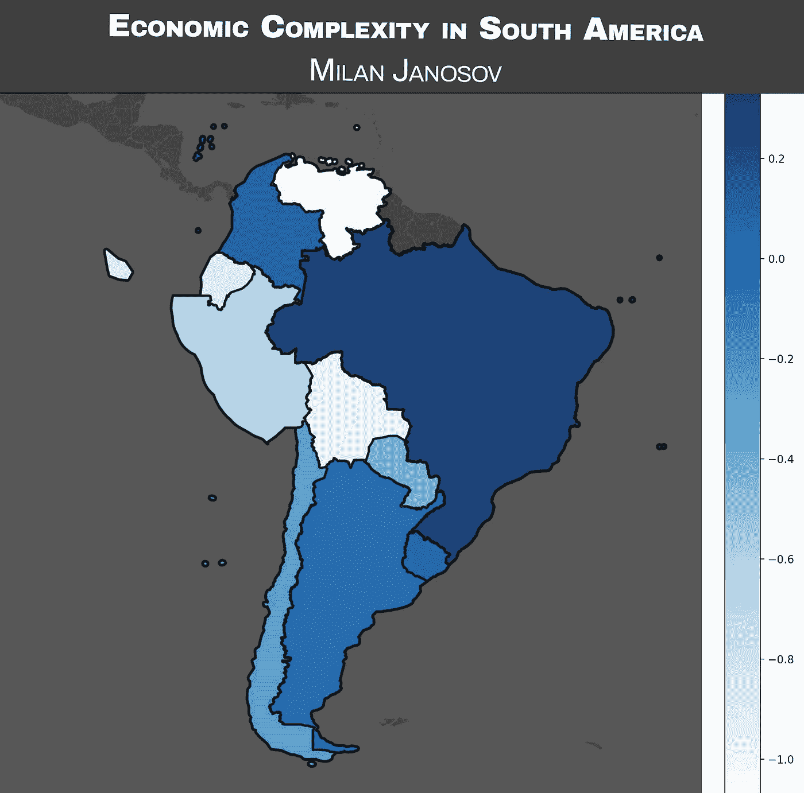
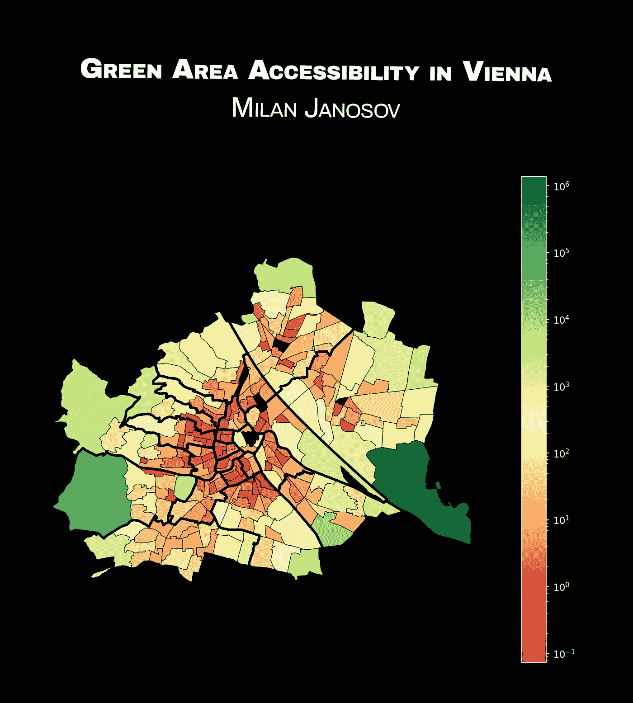
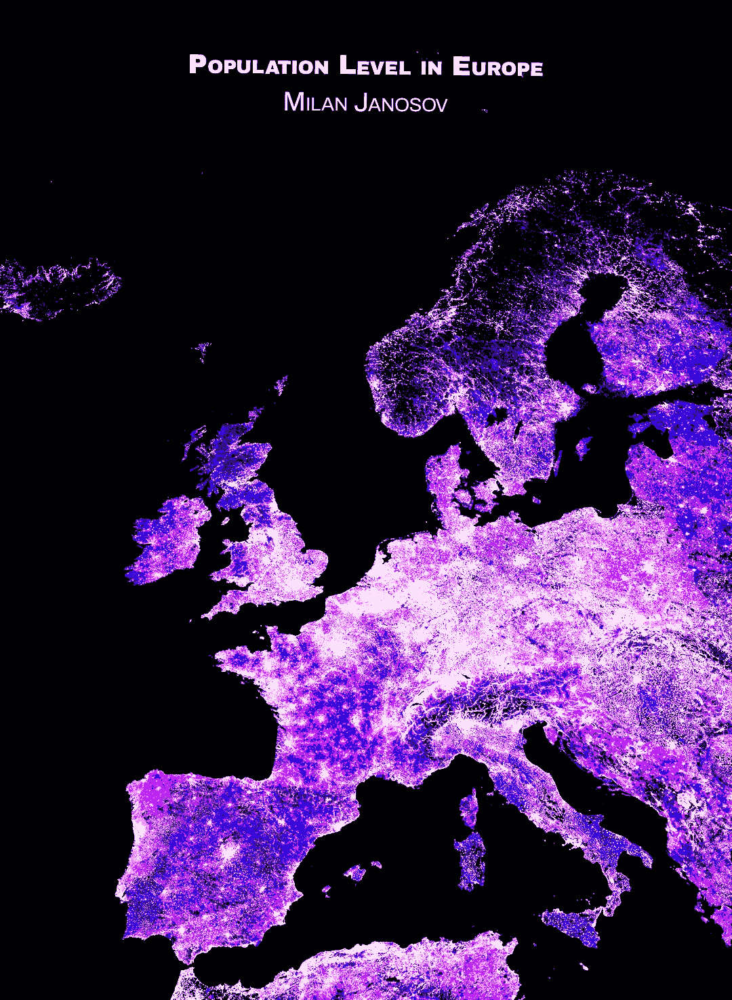

# 我在#30DayMapChallange 的第二周

> 原文：[`towardsdatascience.com/my-second-week-of-the-30daymapchallange-11fbab10cae6`](https://towardsdatascience.com/my-second-week-of-the-30daymapchallange-11fbab10cae6)

## 我对#30DayMapChallange 第二周的个人看法，这是一个旨在每年 11 月每天设计主题地图的社交挑战。

 [米兰·贾诺索夫](https://medium.com/@janosovm?source=post_page-----11fbab10cae6--------------------------------)

·发表于[Towards Data Science](https://towardsdatascience.com/?source=post_page-----11fbab10cae6--------------------------------) ·阅读时间 5 分钟·2023 年 11 月 14 日

--

自 2019 年以来，每年 11 月，地理信息系统（GIS）和空间分析社区都会变得非常忙碌——这要归功于一个有趣的挑战，称为[#30DayMapChallange](https://30daymapchallenge.com)。每年，这个挑战都有一个主题日程，提出一个主题作为当天地图可视化的主要方向。虽然预定义的每日主题确实意味着对创造力的限制，但它们也帮助参与者找到共同的兴趣，分享数据源，并以视觉和技术的方式表达个人风格。

在这里，我想简要概述我在此挑战的第二周，详细说明并展示我创建的不同地图——通常是用 Python 制作的。

*在这篇文章中，所有图片均由作者创建。*

# 第 8 天 — 非洲

为了启动第二周，我利用了联合国粮农组织发布的[非洲河流](https://lnkd.in/dZ6rZeGG https://lnkd.in/dUZFPdBN)数据集。它们的 GIS 文件包含近 20 万条线性多边形，属于河流，并具有几个参数，如其主要流域或每段弯曲的 Strahler 流序。我用这些字母来设置每条河流的颜色和宽度；等级越高，河流越暗且越细，从一阶溪流到 8 阶主干河流。

第 8 天 — 非洲

# 第 9 天 — 六边形

这个图有点复杂，但基于 Uber 的[H3 六边形](https://www.uber.com/en-HU/blog/h3/)。首先，我从[IUCN 红色名录受威胁物种的地理空间数据库](https://www.iucnredlist.org/resources/spatial-data-download)收集了所有（大约 5000 种）哺乳动物物种栖息地的多边形格式数据。然后，我通过逐对比较计算每个物种栖息地的空间重叠。由于多边形的复杂性，如果使用简单的 GeoPandas 覆盖，这将耗费大量时间，因此我将每个栖息地分割成六边形，并仅通过共享的六边形 ID 数量捕捉栖息地的重叠。这样，我成功地将网络节点定义为物种，并将它们的网络连接定义为它们的六边形 ID 集合的 Jaccard 相似度指数（它们共享栖息地的相对比例），然后我可以使用 Gephi 可视化它们。

最后，网络节点的大小基于它们的度中心性 — 即它们与之共享栖息地的其他物种的数量。此外，每个节点的颜色 — 依然是物种 — 基于其最大栖息地国家的主要颜色，为这个网络图赋予了最终的世界地图效果。

第 9 天 — 六边形

# 第 10 天 — 北美

这张地图展示了基于[自然地球](https://www.naturalearthdata.com/downloads/10m-cultural-vectors/)数据集的北美道路网络，直观地展示了 49,183 段道路，并清晰地显示了大陆的形态和人口密度的变化，北部道路稀疏，而在人口较多的地区则呈现整齐的网格结构。

第 10 天 — 北美

# 第 11 天 — 复古

在这里，主题是复古的 — 所以我回顾了不久前由 Towards Data Science 发布的一张怀旧地图，展示了布达佩斯和维也纳公开可用除颤器设备的可达性。每个交点的颜色表示可达时间，从绿色到红色，显示从跑步速度到达最近设备所需的时间，范围从 0 分钟（绿色）到 10 分钟（红色），用红色区域捕捉了最关键的区域。

第 11 天 — 复古

# 第 12 天 — 南美

第 12 天，我使用 OpenStreetMap（[OSMNx](http://osmnx.readthedocs.io)）和维基百科数据构建了我的地图。特别是，我收集了所谓的[经济复杂性指数](https://en.wikipedia.org/wiki/Economic_Complexity_Index)，这是一个宏观经济指标，捕捉一个国家的生产能力。利用网络理论，这个指标源自国家的国际贸易档案以及进出口模式，衡量国家的经济稳定性和潜力。作为一种以简化方式量化整个国家的测量方法，还允许比较和排名国家，它有着长长的支持者和批评者名单，但这留待另日讨论。至于地图，像往常一样，我在 Python 中构建了它，使用了 OSMNx、Matplotlib、urllib，并且为了给最终效果增添黑暗模式的底图，使用了 contextily。

第 12 天 — 南美洲

# 第 13 天 — 色斑图

在这张地图和相关的文章中，我提出并解决了一个流行且关键的城市发展问题——绿色平等和绿色区域的可达性。我在这篇文章中使用维也纳的政府开放数据来探索这些概念，通过计算维也纳不同社区的人均绿地面积，并将其与当地的财政状况相关联。原文发布在[Towards Data Science](https://medium.com/towards-data-science/assessing-urban-geen-inequality-using-viennas-open-data-portal-aa628e0237ad)。

第 13 天 — 色斑图

# 第 14 天 — 欧洲

这张欧洲地图显示了每个国家的每平方公里人口密度，基于 WorldPop 发布的 100x100 米建模网格数据。正如我在原始文章中所写，我展示了如何创建这样的地图的教程，我经常看到网上流传着漂亮的人口地图；然而，我通常在一些技术细节上卡住，比如如何可视化教程中未显示的地图段，或将大规模栅格数据转换为更易于计算的矢量格式。在这篇文章中，我通过实用指南克服了这些不足，介绍了两个主要的全球人口数据来源。阅读全文教程这里。

第 14 天 — 欧洲

这是我进行#30DayMapChallenge 的第二周总结——还有两周时间，所以准备好迎接更多地图吧！现在，在我的[Patreon](https://www.patreon.com/milanjanosov)频道上，还有视频和代码教程。
