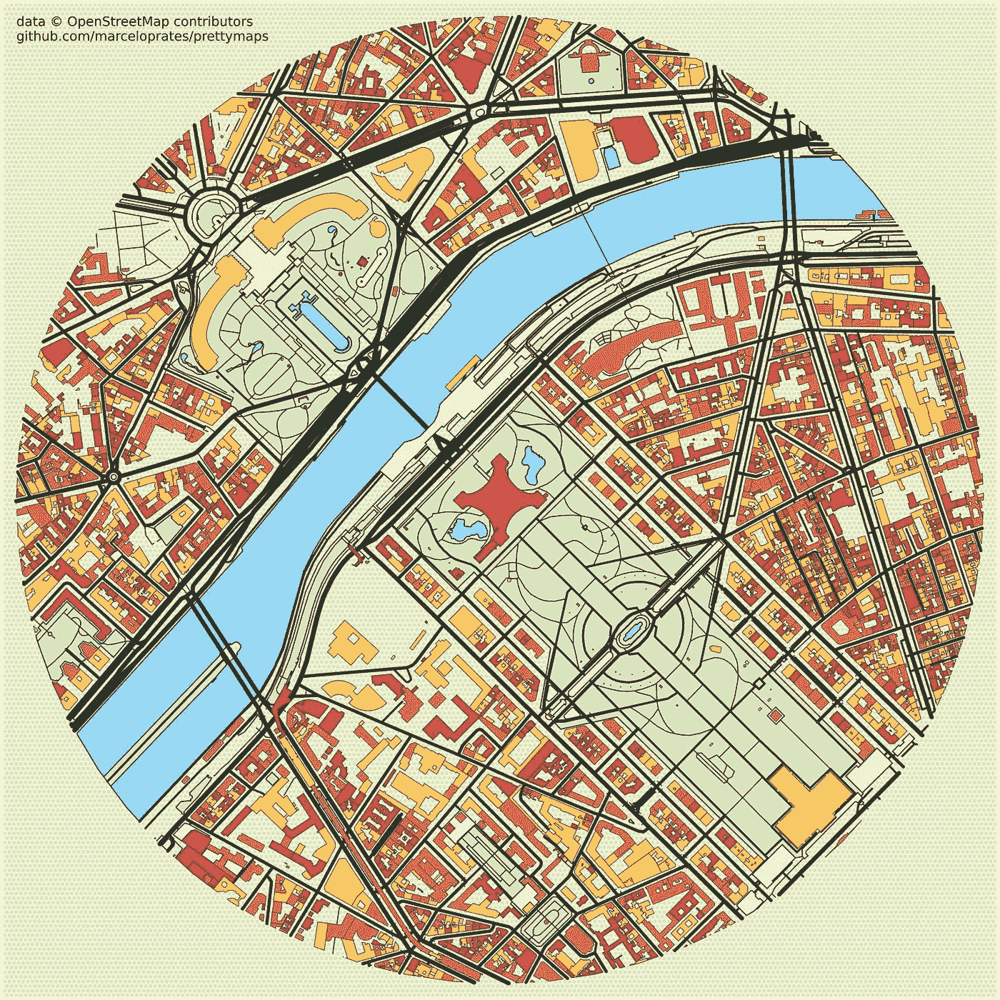
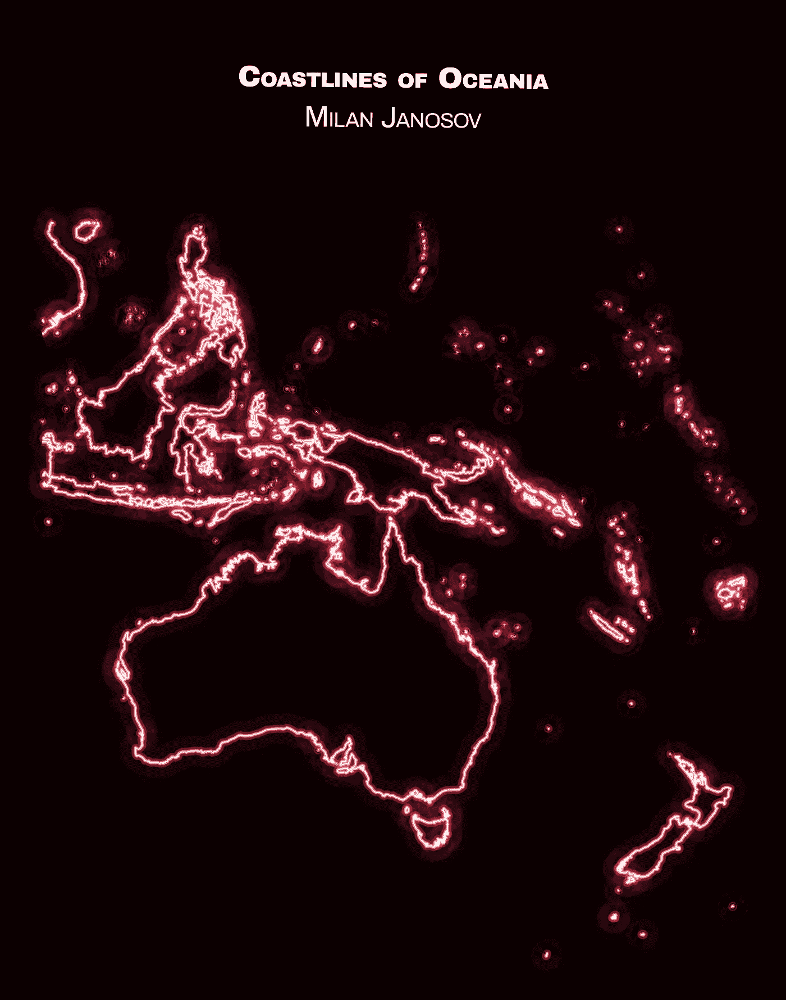
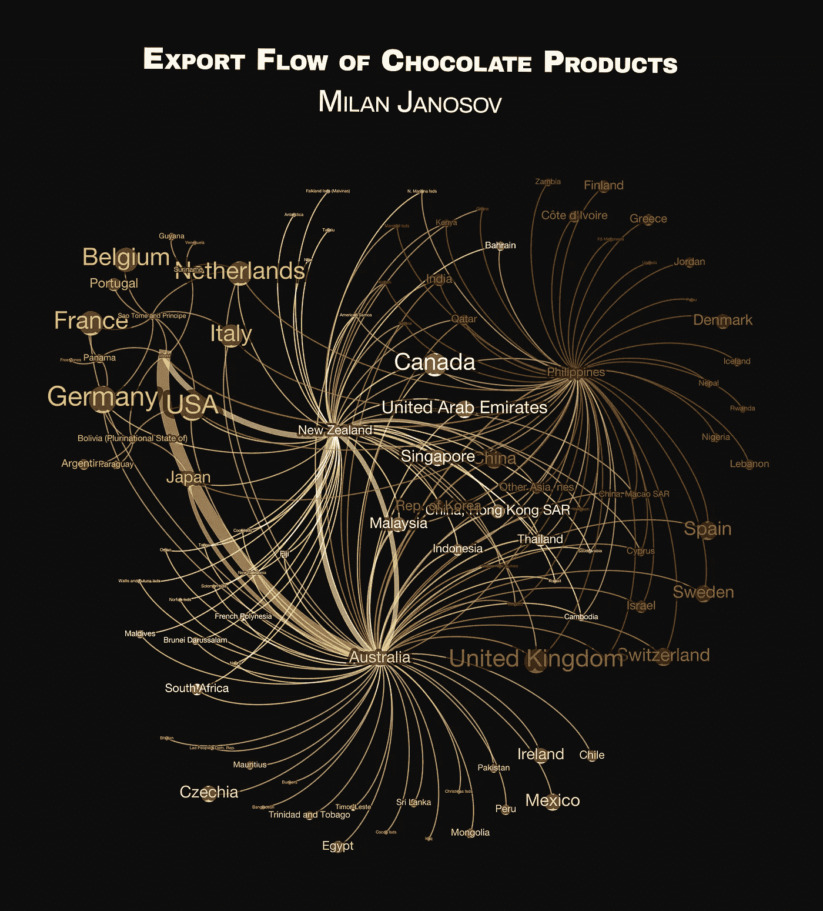
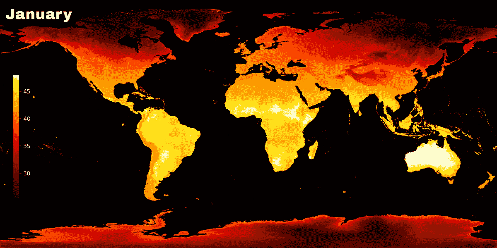
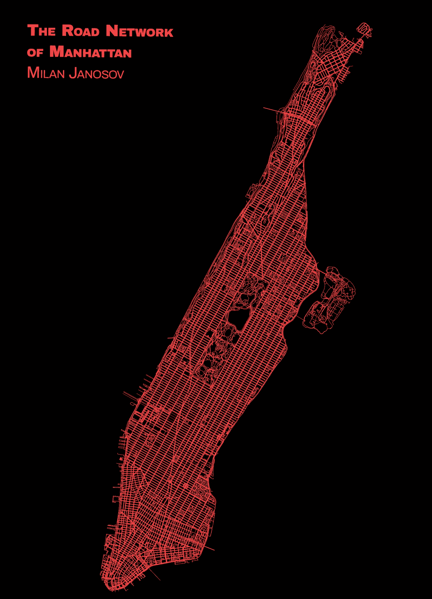
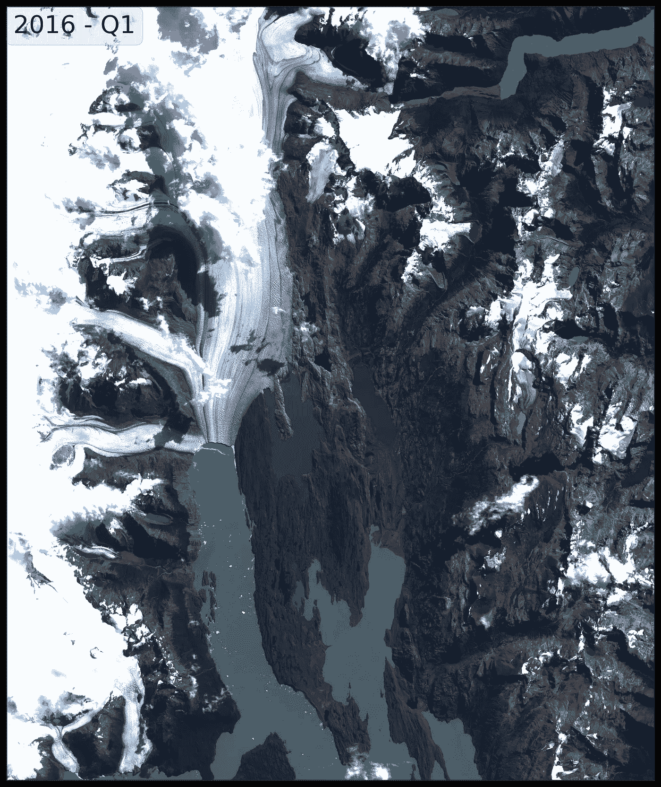
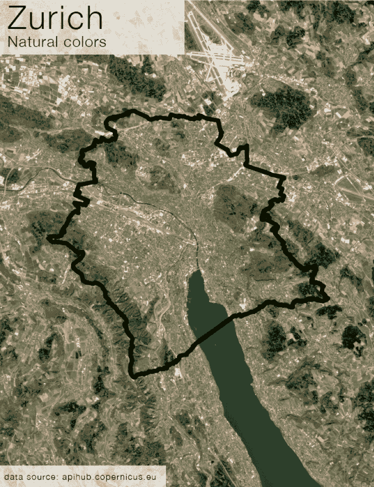

# 我的 #30DayMapChallange 第三周

> 原文：[`towardsdatascience.com/my-third-week-of-the-30daymapchallange-b42efbe38b51`](https://towardsdatascience.com/my-third-week-of-the-30daymapchallange-b42efbe38b51)

## 我对 #30DayMapChallange 第三周的个人看法，这是一项旨在每年 11 月每天设计主题地图的社交挑战。

 [Milan Janosov](https://medium.com/@janosovm?source=post_page-----b42efbe38b51--------------------------------)

·发布于 [Towards Data Science](https://towardsdatascience.com/?source=post_page-----b42efbe38b51--------------------------------) ·阅读时间 6 分钟·2023 年 11 月 21 日

--

自 2019 年以来，地理信息系统（GIS）和空间分析社区每年 11 月都非常繁忙——这要归功于一个有趣的挑战，称为 [#30DayMapChallange](https://30daymapchallenge.com)。每年，这个挑战都有一个主题日程，提出一个主题作为当天地图可视化的主要方向。虽然预设的每日主题无疑对创造力构成了限制，但它们也帮助参与者找到共同兴趣，分享数据源，并在视觉和技术上表达个人风格。

在这里，我想简要回顾一下我在这个挑战的第三周，详细介绍并展示我创建的不同地图——通常使用 Python 和各种空间分析及地理空间数据工具。

*在这篇文章中，所有图片均由作者创建。*

# 第 15 天 — OSM

[OpenStreetMap](http://openstreetmap.org/) 是获取地图数据的首选来源之一。虽然有许多库在其基础上进行构建，但我去年最喜欢的发现是 [PrettyMaps](https://github.com/marceloprates/prettymaps)，我用它来可视化 PlanetWare 精心挑选的一些全球顶级旅游景点，例如巴黎的埃菲尔铁塔。其余的收藏可以在 [这里](https://www.linkedin.com/posts/milan-janosov_30daymapchallenge-gis-datascience-activity-7130469529968685057-WZTq?utm_source=share&utm_medium=member_ios) 查看，其中包括罗马的斗兽场（Colosseum）、纽约的自由女神像（Statue of Liberty）、法国的凡尔赛宫（Château de Versailles）、纽约的中央公园（Central Park）、中国的紫禁城（Forbidden City）、捷克共和国的布拉格城堡（Prague Castle）以及悉尼歌剧院（Sydney Opera House）。

第 15 天 — OSM

# 第 16 天 — 大洋洲

为了可视化澳大利亚及大洋洲众多岛屿，我使用了来自[Natural Earth](https://www.naturalearthdata.com/downloads/10m-physical-vectors/)的 10 米分辨率物理矢量数据。也就是说，我在这里想象了澳大利亚和大洋洲的海岸线。对于这个线图，我使用了我以前的一种技巧——创建这些看起来像‘光剑’、发光、受《星球大战》启发的线条——这些线条完全使用 Python 中的 Matplotlib 创建。此外，找到合适的边界框有点棘手，所以我只是参考了一些在线地图。

第 16 天 — 大洋洲

# 第 17 天 — 流动

当我试图搞清楚这张地图时，主题是“流动”，我有点卡住了——然后我想，好吧，来点卡路里，继续前进。

*tl;dr*

我决定可视化巧克力（在[协调系统](https://www.trade.gov/harmonized-system-hs-codes)中其标准代码为 HS 1806）的出口流网络，使用来自[Comtrade](https://comtradeplus.un.org/TradeFlow)的国际贸易数据。这个数据集包含了哪些国家向哪些国家出口了什么数量、什么价值的信息。我利用这些信息创建了一个非地理但具有拓扑结构的地图，一个网络可视化。在这个网络中，每个国家是一个节点，而国家 A 与国家 B 相连，如果 A 向 B 出口巧克力产品，其中链接的大小与 2022 年交易商品的总值成比例。节点颜色对应网络社区——那些看起来比其他国家内部交易更多的国家簇，而节点大小则衡量了每个国家通过出口这些甜品所获得的总价值。未出口的国家标记为深灰色。有趣的是：我是在布达佩斯的[#Flow](https://www.linkedin.com/feed/hashtag/?keywords=%23Flow) Specialty Coffee Bar & Bistro 喝咖啡时创建了这张地图的。

第 17 天 — 流动

# 第 18 天 — 大气层

在这个可视化中，我创建了显示全球月度最高气温值的实际热图，使用了[World Climate data](https://www.worldclim.org/data/worldclim21.html)：

*“这是 WorldClim 2.1 版的 1970–2000 年气候数据。该版本于 2020 年 1 月发布。包括了最低、平均和最高气温、降水量、太阳辐射、风速、水汽压和总降水量的月度气候数据。此外，还有 19 个‘生物气候’变量。”*

因此，在我的地图中，每一帧对应一个月，使用了 WorldClim 2.1 栅格数据集的最高气温。

第 18 天 — 大气层

# 第 19 天 — 5 分钟地图

没错——我们只有 5 分钟时间来制作一个地图可视化。时间不多，所以我决定使用我经常做的事情——将网络数据和地理空间数据结合起来，展示另一个道路网络，这次是关于曼哈顿及其美丽的、完全人工的方格状道路系统。与其重新运行以前的代码，我从头开始写了这个笔记本，仅用大约 5 分钟，几乎没有查找资料（除了找到正确的十六进制代码）。

第 19 天——5 分钟地图

# 第 20 天——户外

为了在户外冒险——同时创建地图——我决定在线查看美丽的地标，让我感觉就像身临其境——当我坐在 Python 终端前时。因此，在我的户外地图中，我结合了可视化气候变化和宏大的[ESA 的 Sentinel 数据](https://services.sentinel-hub.com/oauth/password/resetTrigger)的新更新，制作了这段乌普萨拉冰川，阿根廷的动画。这段影像基于[查询](https://github.com/sentinel-hub/sentinelhub-py/blob/master/examples/process_request.ipynb)了 2016 年到今天每半年最少云层的真实色彩图像。由于文件大小问题，这里提供了一个静态快照，您可以在[这里](https://www.linkedin.com/posts/milan-janosov_30daymapchallenge-gis-datascience-activity-7132287456304906240-uUy8?utm_source=share&utm_medium=member_ios)找到动画。

第 20 天——户外

# 第 21 天——栅格

在前一天的卫星影像之后，我回到了栅格遥感数据。具体来说，我重新发布了我以前的一个作品，其中使用了旧的 Sentinel API 来计算苏黎世市的 NDVI 指数，展示了卫星图像波段的一个基本但非常实用的转换。根据[#Wikipedia](https://www.linkedin.com/feed/hashtag/?keywords=%23Wikipedia)上的理论：

“𝘕𝘰𝘳𝘮𝘢𝘭𝘪𝘻𝘦𝘥 𝘥𝘪𝘧𝘧𝘦𝘳𝘦𝘯𝘤𝘦 𝘷𝘦𝘨𝘦𝘵𝘢𝘵𝘪𝘰𝘯 𝘪𝘯𝘥𝘦𝘹：𝘛𝘩𝘦 𝘯𝘰𝘳𝘮𝘢𝘭𝘪𝘻𝘦𝘥 𝘥𝘪𝘧𝘧𝘦𝘳𝘦𝘯𝘤𝘦 𝘷𝘦𝘨𝘦𝘵𝘢𝘵𝘪𝘰𝘯 𝘪𝘯𝘥𝘦𝘹 𝘪𝘴 𝘢 𝘴𝘪𝘮𝘱𝘭𝘦 𝘨𝘳𝘢𝘱𝘩𝘪𝘤𝘢𝘭 𝘪𝘯𝘥𝘪𝘤𝘢𝘵𝘰𝘳 𝘵𝘩𝘢𝘵 𝘤𝘢𝘯 𝘣𝘦 𝘶𝘴𝘦𝘥 𝘵𝘰 𝘢𝘯𝘢𝘭𝘺𝘻𝘦 𝘳𝘦𝘮𝘰𝘵𝘦 𝘴𝘦𝘯𝘴𝘪𝘯𝘨 𝘮𝘦𝘢𝘴𝘶𝘳𝘦𝘮𝘦𝘯𝘵𝘴, 𝘰𝘧𝘵𝘦𝘯 𝘧𝘳𝘰𝘮 𝘢 𝘴𝘱𝘢𝘤𝘦 𝘱𝘭𝘢𝘵𝘧𝘰𝘳𝘮, 𝘢𝘴𝘴𝘦𝘴𝘴𝘪𝘯𝘨 𝘸𝘩𝘦𝘵𝘩𝘦𝘳 𝘰𝘳 𝘯𝘰𝘁 𝘵𝘩𝘦 𝘵𝘢𝘳𝘨𝘦𝘵 𝘣𝘦𝘪𝘯𝘨 𝘰𝘵𝘩𝘦𝘳 𝘵𝘩𝘢𝘯 𝘢𝘯𝘺 𝘵𝘢𝘳𝘨𝘦𝘵 𝘣𝘦𝘪𝘯𝘨 𝘰𝘣𝘴𝘦𝘳𝘷𝘦𝘥 𝘤𝘰𝘯𝘵𝘢𝘪𝘯𝘴 𝘭𝘪𝘷𝘦 𝘨𝘳𝘦𝘦𝘯 𝘷𝘦𝘨𝘦𝘵𝘢𝘵𝘪𝘰𝘯。”

实际上，NDVI 是一个+1.0 到-1.0 的浮动值变量，我们可以通过结合卫星图像的红色和近红外波段来计算。由于绿色表面的光吸收特性，这样的结果会使得绿色的像素值更高。

由于我使用了免费的[#sentinel](https://www.linkedin.com/feed/hashtag/?keywords=%23sentinel)卫星图像，我的像素大小为 10x10 米。在可视化中，我使用了绿色-黄色-红色的颜色图来展示从+1.0 到 0 的 NDVI 值。负值通常表示水体，接近零的正值是建筑区域的良好参考，而值在 0.1 到 0.5 之间表示稀疏，以上则表示密集的绿色植被。

第 21 天——栅格

这是我第三周参与#30DayMapChallenge 的总结——还有 10 天就结束了，所以准备好迎接更多地图吧！

第二周的概况请[点击这里](https://medium.com/p/11fbab10cae6)查看！

第一周的概况请点击这里查看！
