# 朴素贝叶斯分类

> 原文：[`towardsdatascience.com/naive-bayes-classification-41d1fe802a1e`](https://towardsdatascience.com/naive-bayes-classification-41d1fe802a1e)

## 朴素贝叶斯分类器家族的深入解释，包括一个 Python 中的文本分类示例

[](https://medium.com/@roiyeho?source=post_page-----41d1fe802a1e--------------------------------)[](https://towardsdatascience.com/?source=post_page-----41d1fe802a1e--------------------------------) [Dr. Roi Yehoshua](https://medium.com/@roiyeho?source=post_page-----41d1fe802a1e--------------------------------)

·发表于 [Towards Data Science](https://towardsdatascience.com/?source=post_page-----41d1fe802a1e--------------------------------) ·阅读时间 23 分钟·2023 年 6 月 1 日

--


图片由 [Mediocre Studio](https://unsplash.com/@paucasals?utm_source=unsplash&utm_medium=referral&utm_content=creditCopyText) 提供，来源于 [Unsplash](https://unsplash.com/photos/1Gvog1VdtDA?utm_source=unsplash&utm_medium=referral&utm_content=creditCopyText)

朴素贝叶斯分类器是一类基于应用贝叶斯定理并假设特征之间独立性的概率分类器。

这些分类器在训练和预测中都非常快速，并且具有很高的可扩展性和可解释性。尽管它们的假设过于简化，但它们在复杂的实际问题上通常表现良好，尤其是在如垃圾邮件过滤和情感分析等文本分类任务中，其朴素假设通常成立。

朴素贝叶斯也是最早的**生成模型**之一（早于 ChatGPT……），它学习每个类别中的输入分布。这些模型不仅可用于预测，还可以用于生成新样本（有关生成模型与判别模型的深入讨论，请参见 [这篇文章](https://medium.com/@roiyeho/generative-vs-discriminative-models-35b81f677822)）。

在这篇文章中，我们将深入探讨朴素贝叶斯模型及其变体，然后展示如何使用 Scikit-Learn 中的实现来解决文档分类任务。

# 背景：贝叶斯定理

贝叶斯定理（或贝叶斯规则）是概率中的一个重要定理，它允许我们基于与事件相关的先验知识计算事件的条件概率。

从数学上讲，定理指出，对于任何事件 *A* 和 *B*：


贝叶斯规则

+   *P*(*A*|*B*)是**后验概率**，即给定*B*的情况下事件*A*发生的概率。

+   *P*(*B*|*A*)是**似然性**，即给定*A*的情况下事件*B*发生的概率。

+   *P*(*A*)是**先验概率**，即*A*的概率，没有任何先验条件。

+   *P*(*B*)是**边际概率**，即*B*的概率，没有任何先验条件。

贝叶斯定理特别适用于从结果推断原因，因为通常更容易辨别在原因存在或不存在的情况下结果的概率，而不是相反。例如，估计一个患有脑膜炎的患者会出现头痛的概率比估计一个头痛的患者是否患有脑膜炎要容易得多（因为许多其他疾病也可能导致头痛）。在这种情况下，我们可以应用贝叶斯规则如下：


## 示例

已知大约 25%的肺癌患者会出现胸痛。假设肺癌的发生率为每 10 万人中 50 人，全球胸痛的发生率为每 10 万人中 1,500 人。那么，一个有胸痛的患者患肺癌的概率是多少？

让我们将给定的输入以概率的形式表示。设*L*为患肺癌的事件，*C*为胸痛的事件。根据我们拥有的数据，我们知道：

+   *P*(*C*|*L*) = 0.25

+   *P*(*L*) = 50 / 100,000 = 0.0005

+   *P*(*C*) = 1,500 / 100,000 = 0.015

使用贝叶斯规则，给定胸痛的情况下患肺癌的后验概率是：


即，患者患肺癌的概率只有 0.833%。

# 朴素贝叶斯模型

朴素贝叶斯模型是**概率分类器**，即它们不仅为给定样本分配一个类别标签，还提供该样本属于该类别的概率估计。例如，朴素贝叶斯模型可以预测某个电子邮件有 80%的概率是垃圾邮件，20%的概率是正常邮件。

回顾一下在[监督学习](https://medium.com/@roiyeho/introduction-to-supervised-machine-learning-313730eb5aa2)问题中，我们会得到一个包含*n*个标记样本的训练集：*D* = {(**x**₁, *y*₁), (**x**₂, *y*₂), … , (**x***ₙ, yₙ*)}，其中**x***ᵢ*是一个*m*维向量，包含样本*i*的**特征**，而*yᵢ*表示该样本的**标签**。在分类问题中，标签可以取任何一个*K*类别，即，*y* ∈ {1, …, *K*}。

我们区分两种类型的分类器：

1.  **确定性分类器**为每个样本输出一个**硬标签**，而不提供类别的概率估计。这类分类器的例子包括 [K-最近邻](https://medium.com/@roiyeho/k-nearest-neighbors-knn-a-comprehensive-guide-7add717806ad)、[决策树](https://medium.com/@roiyeho/decision-trees-part-1-da4e613d2369) 和 SVM。

1.  **概率分类器**输出对 *k* 类的概率估计，然后根据这些概率给样本分配标签（通常是概率最高的类别的标签）。这种分类器的例子包括朴素贝叶斯分类器，[逻辑回归](https://medium.com/towards-data-science/mastering-logistic-regression-3e502686f0ae)和使用逻辑/softmax 输出层的[神经网络](https://medium.com/towards-data-science/multi-layer-perceptrons-8d76972afa2b)。

给定一个样本 (**x**, *y*)，朴素贝叶斯分类器使用贝叶斯规则计算它属于类别 *k* 的概率（即 *y* = *k*）：


方程右侧的概率是从训练集估计得到的。

首先，**类别先验概率** *P*(*y* = *k*) 可以通过类别 *k* 在训练样本中的相对频率来估计：


其中 *nₖ* 是属于类别 *k* 的样本数量，*n* 是训练集中的样本总数。

其次，**边际概率** *P*(**x**) 可以通过对贝叶斯规则中所有类别的分子部分进行求和来计算：


由于边际概率不依赖于类别，如果我们只对分配硬标签给样本感兴趣（而不提供概率估计），则不需要计算它。

最后，我们需要估计在给定类别下特征的可能性，即 *P*(**x**|*y* = *k*)。估计这些概率的主要问题是数量太多，可能在训练集中没有足够的数据来估计所有的概率。

例如，假设 **x** 由 *m* 个二进制特征组成，例如，每个特征表示某个词是否出现在文本中。在这种情况下，为了建模 *P*(**x**|*y*)，我们需要从训练集中为每个类别估计 2*ᵐ* 个条件概率（每个 *x*₁, …, *xₘ* 的所有可能组合），因此总共有 2*ᵐK* 个概率。在大多数情况下，我们在训练集中没有足够的样本来估计所有这些概率，即使有，也需要耗费指数时间。

## 朴素贝叶斯假设

为了减少需要估计的参数数量，朴素贝叶斯模型做出了以下假设：**特征在给定类别变量的情况下是相互独立的**。

这个假设允许我们将概率 *P*(**x**|*y* = *k*) 写作每个个体特征在给定类别下的条件概率的乘积：

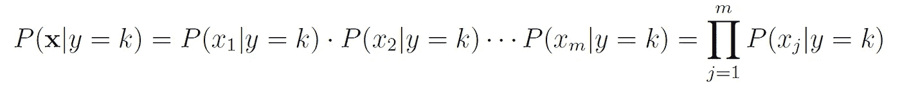

朴素贝叶斯假设

例如，在垃圾邮件过滤任务中，朴素贝叶斯假设意味着诸如“rich”和“prince”这样的词独立地对预测邮件是否是垃圾邮件作出贡献，无论这些词之间是否存在任何可能的关联。

朴素假设在应用领域如文本分类和推荐系统中大致成立，在这些领域中，特征通常彼此独立。

朴素贝叶斯假设显著减少了需要从数据中估计的参数数量。例如，在输入**x**包含*m*个二元特征的情况下，它将模型的参数数量从 2*ᵐ*减少到每个类别*m*。

## MAP（最大后验）

基于朴素贝叶斯假设，我们现在可以将类别后验概率写作如下：


如果我们只关心将类别标签分配给给定样本（而不关心概率），我们可以忽略分母 *P*(**x**)，并使用以下分类规则：


这称为**MAP（最大后验）**决策规则，因为它选择最大化后验概率的假设。

只要正确的类别被预测为比其他类别更可能，朴素贝叶斯将做出正确的 MAP 决策，即使概率估计不准确。这为模型提供了一些对基础朴素独立假设缺陷的鲁棒性。

请注意，如果我们假设所有先验 *P*(*y*) 是等可能的（例如，当我们没有关于哪个假设更可能的先验信息时），那么 MAP 决策规则等同于 MLE（最大似然估计）决策规则，它选择最大化给定模型 *P*(**x**|*y*) 的数据似然性的模型。（你可以在[这篇文章](https://medium.com/@roiyeho/maximum-likelihood-855b6df92c43)中了解更多关于最大似然的信息。）

## 参数估计

我们现在剩下的任务是估计每个特征 *j* 和每个类别 *k* 的条件概率 *P*(*xⱼ*|*y* = *k*)。这个估计依赖于特征的类型（例如，离散或连续）以及我们假设其具有的概率分布。

对特征分布的假设称为**事件模型**。每个事件模型导致不同类型的朴素贝叶斯分类器。在接下来的部分，我们将讨论不同的事件模型以及如何在每种模型中估计模型参数。

# 伯努利朴素贝叶斯

在伯努利事件模型中，特征*xⱼ*被建模为具有伯努利分布的独立二元变量，即每个特征*xⱼ*在给定样本中出现的概率为*pⱼ*，不出现的概率为 1 − *pⱼ*。

例如，在文本分类任务中，每个特征*xⱼ*可能代表文本中词汇表中第*j*个单词的出现或缺失。

在伯努利事件模型中，概率*P*(*xⱼ*|*y* = *k*)是通过特征*j*在类别*k*的样本中出现的频率来估计的：


其中*nⱼₖ*是类别*k*中包含特征*xⱼ*的样本数量，*nₖ*是类别*k*中样本的总数。

# 分类朴素贝叶斯

分类事件模型是伯努利事件模型对*V*个类别（而不是仅两个类别）的扩展。在这个模型中，我们假设每个特征是一个类别（离散）变量，可以取*V*个可能的类别中的一个，其概率为*pᵢ*，其中所有概率的总和为 1。

在这个事件模型中，我们需要估计每个特征*xⱼ*和每个类别*v*的概率*P*(*xⱼ = v*|*y* = *k*)。与之前的模型类似，我们通过特征*j*在类别*k*的样本中取值*v*的频率来估计这个概率：


其中*nⱼᵥₖ*是类别*k*中特征*xⱼ*取值*v*的样本数量，*nₖ*是类别*k*中样本的总数。

## 示例：顾客购买预测

假设我们有一个包含商店顾客过去购买数据的表格：

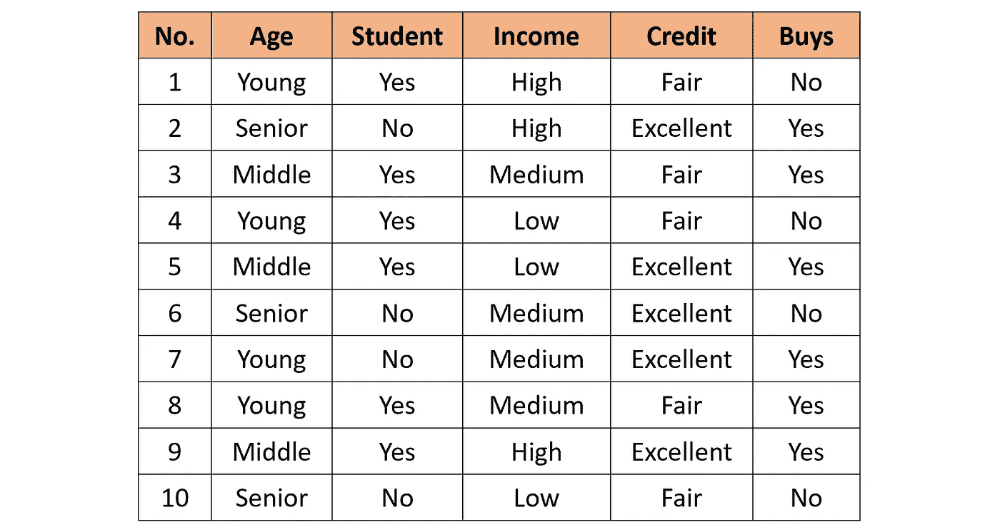

训练集

表中的每一行包含顾客的年龄、是否是学生、收入水平、信用评级以及是否购买了产品。

一个具有以下属性的新顾客到达商店：

<Age = Young, Student = Yes, Income = Low, Credit = Excellent>

你需要预测这个顾客是否会购买产品。

我们首先通过计算 Buys = Yes（10 行中的 6 行）和 Buys = No（10 行中的 4 行）的行数来计算类别先验概率。

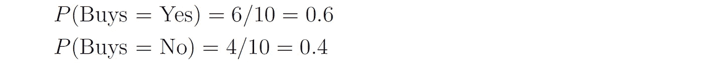

然后，我们计算每个类别中特征的可能性：

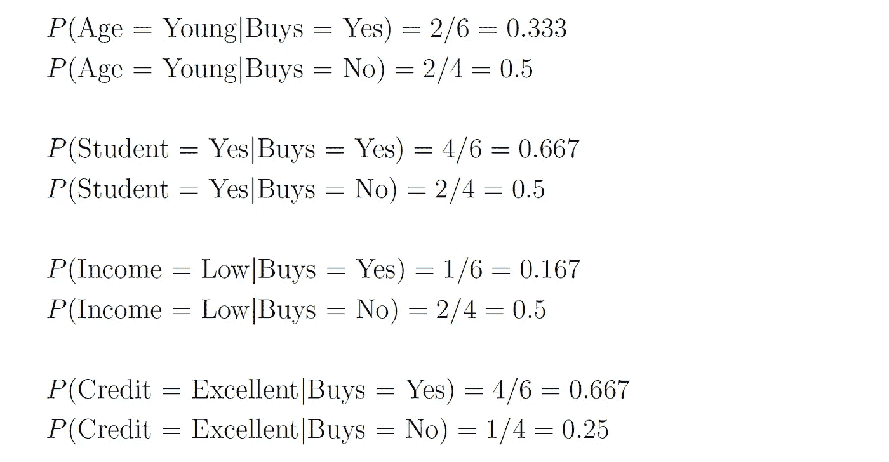

因此，类别后验概率为：

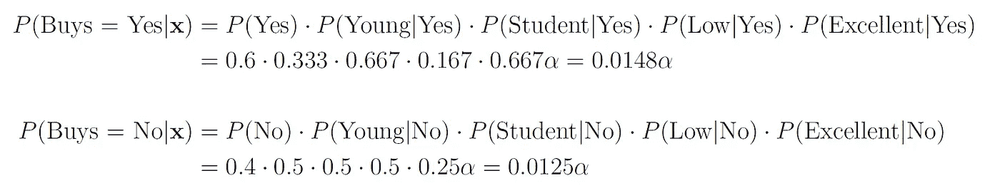

*α*是归一化因子（*α* = 1 / *P*(**x**））。

由于*P*(Buys = Yes|**x**) > *P*(Buys = No|**x**)，我们的预测是顾客会购买产品。

如果我们想得到顾客购买产品的实际概率，我们可以首先使用两个后验概率之和为 1 的事实来找到归一化因子：


然后，我们可以将其代入“Buy = Yes”的后验概率中：


客户购买该产品的概率是 54.21%。

# 多项式朴素贝叶斯

在多项式事件模型中，我们假设数据集只有一个类别特征*x*，它可以取*m*个类别中的一个，每个特征向量（*x*₁, …, *xₘ*）是一个**直方图**，其中*xⱼ*计算了*x*在特定实例中取值*j*的次数。

这个事件模型在处理文本文件时特别有用，其中*m*是词汇表中的词数，每个特征*xⱼ*表示词汇表中第*j*个词在文档中出现的次数。这种表示方法称为**词袋**模型：

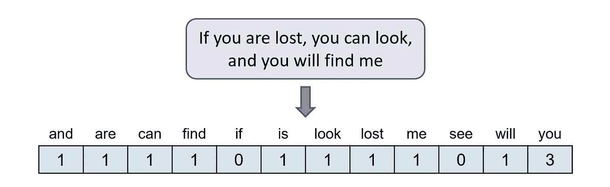

词袋模型

在这个事件模型中，我们估计概率*P*(*x = v*|*y* = *k*)为特征*x*在类别*k*的样本中取得值*v*的频率：


其中*nᵥₖ*是类别*k*中*x*取值*v*的样本数量，*nₖ*是类别*k*中样本的总数量。

## 示例：垃圾邮件过滤器

我们希望基于一个包含 100 封邮件的训练集构建一个垃圾邮件过滤器：其中 80 封为正常邮件，20 封为垃圾邮件。每种类型邮件中的词语计数在以下表格中给出：

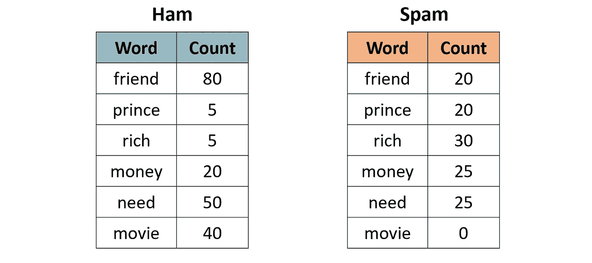

正常邮件和垃圾邮件中的词语计数

一封新的邮件到达，内容为“rich friend need money”。这是正常邮件还是垃圾邮件？

首先计算类别的先验概率：

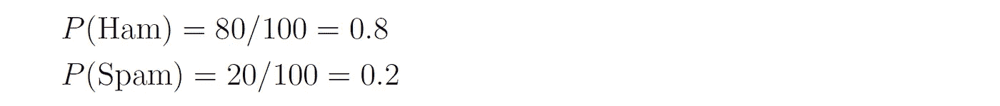

接下来，我们估计每种类型邮件中词语的可能性。正常邮件中的词语总数为：80 + 5 + 5 + 20 + 50 + 40 = 200，而垃圾邮件中的词语总数为：20 + 20 + 30 + 25 + 25 = 120。因此，词语的可能性为：

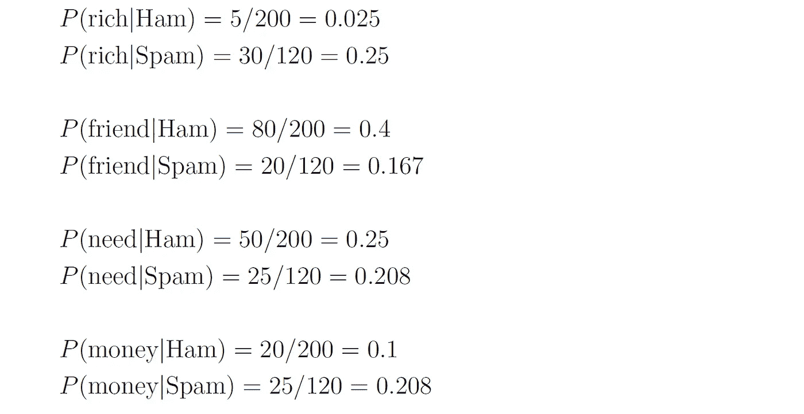

因此，类别的后验概率是：

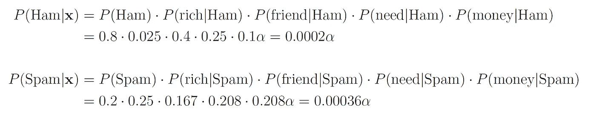

因此，我们的预测是该邮件是垃圾邮件。

# 拉普拉斯平滑

如果某个特征和某个类别在训练集中从未一起出现，那么它的可能性估计将为零。由于特征的可能性是相乘的，这将抹去我们从其他特征中获得的所有信息。

例如，由于垃圾邮件中缺少“movie”这个词，如果我们收到一封包含“movie”的邮件，它将被自动认为是正常邮件，即使邮件中的其他词语非常“垃圾”。

作为一个具体的例子，考虑一封内容为“movie rich rich prince”的邮件。这封邮件将被分类为正常邮件，尽管“rich”和“prince”这两个词与垃圾邮件高度相关，因为垃圾邮件的后验概率为零：

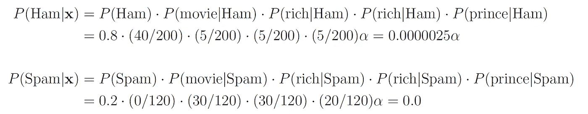

为了处理这个问题，我们在所有概率估计中加入一个小的样本修正（称为伪计数），以确保概率不会被设定为零。

在多项式朴素贝叶斯中，修正如下应用：


其中*α*是平滑参数，*n*是训练集中的样本总数。设置*α* = 1 称为**拉普拉斯平滑**（最常见的），而*α* < 1 称为利德斯通平滑。

同样，在分类朴素贝叶斯中，修正如下应用：


其中*nⱼ*是特征*j*的可能类别数。

重新审视我们的垃圾邮件过滤器示例，让我们通过为所有词汇添加伪计数 1 来应用拉普拉斯平滑：

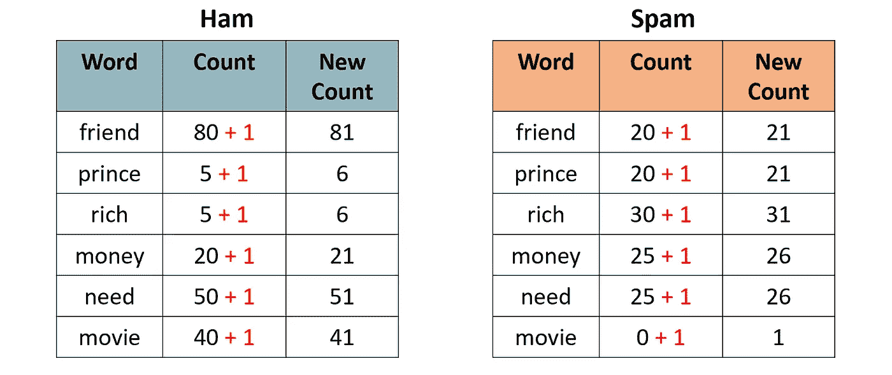

对词频应用拉普拉斯平滑

这次，包含文本“movie rich rich prince”的电子邮件将被分类为垃圾邮件，因为：

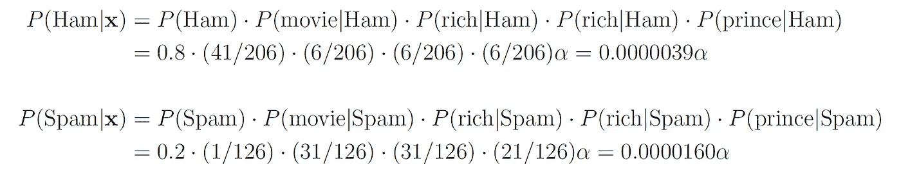

# 高斯朴素贝叶斯

直到现在我们假设所有特征都是离散的。朴素贝叶斯模型如何处理连续特征？

处理连续特征的主要方法有三种：

1.  将特征值离散化，并获得伯努利或分类分布特征。

1.  假设特征按照某个已知概率分布（通常是正态分布）分布，并从训练集中估计该分布的参数（例如，正态分布的均值和方差）。

1.  使用[KDE（核密度估计）](https://en.wikipedia.org/wiki/Kernel_density_estimation)来估计特征的概率密度函数，利用给定的样本点作为核。

在高斯朴素贝叶斯中，我们采用第二种方法，假设特征的似然性是高斯分布的：


其中*μⱼₖ*是类别*k*中所有样本的*xⱼ*值的均值，*σⱼₖ*是这些值的标准差（这些是分布真实参数的最大似然估计）。

上述事件模型也可以组合使用，以处理异质数据集，即包含不同类型特征的数据集（例如，既有分类特征也有连续特征）。

# Scikit-Learn 中的朴素贝叶斯分类器

模块 sklearn.naive_bayes 提供了上述提到的四种朴素贝叶斯分类器的实现：

1.  [BernoulliNB](https://scikit-learn.org/stable/modules/generated/sklearn.naive_bayes.BernoulliNB.html#sklearn.naive_bayes.BernoulliNB)实现了伯努利朴素贝叶斯模型。

1.  [CategoricalNB](https://scikit-learn.org/stable/modules/generated/sklearn.naive_bayes.CategoricalNB.html#sklearn.naive_bayes.CategoricalNB)实现了分类朴素贝叶斯模型。

1.  [MultinomialNB](https://scikit-learn.org/stable/modules/generated/sklearn.naive_bayes.MultinomialNB.html#sklearn.naive_bayes.MultinomialNB) 实现了多项式朴素贝叶斯模型。

1.  [GaussianNB](https://scikit-learn.org/stable/modules/generated/sklearn.naive_bayes.GaussianNB.html#sklearn.naive_bayes.GaussianNB) 实现了高斯朴素贝叶斯模型。

前三种类别接受一个名为*alpha*的参数，该参数定义了平滑参数（默认为 1.0）。

# 文档分类示例

在接下来的演示中，我们将使用[MultinomialNB](https://scikit-learn.org/stable/modules/generated/sklearn.naive_bayes.MultinomialNB.html#sklearn.naive_bayes.MultinomialNB)来解决文档分类任务。我们将使用的数据集是[20 newsgroups dataset](https://scikit-learn.org/stable/datasets/real_world.html#newsgroups-dataset)，该数据集包含 18,846 篇新闻组帖子，几乎均匀地划分为 20 个不同主题。这个数据集在机器学习中的文本应用研究中被广泛使用，包括文档分类和聚类。

## 加载数据集

你可以使用函数[fetch_20newsgroups()](https://scikit-learn.org/stable/modules/generated/sklearn.datasets.fetch_20newsgroups.html)在 Scikit-Learn 中下载带标签的文本文档。你可以选择将所有文档作为一个组下载，或者分别下载训练集和测试集（使用*subset*参数）。训练集和测试集的划分基于在特定日期之前或之后发布的消息。

默认情况下，文本文档包含一些元数据，如标题（例如，帖子的日期）、页脚（签名）和其他帖子的引用。由于这些特征与文本分类任务无关，我们将通过使用*remove*参数将它们剥离掉：

```py
from sklearn.datasets import fetch_20newsgroups

train_set = fetch_20newsgroups(subset='train', remove=('headers', 'footers', 'quotes'))
test_set = fetch_20newsgroups(subset='test', remove=('headers', 'footers', 'quotes'))
```

请注意，第一次调用此函数时，可能需要几分钟时间下载所有文档，之后它们将被缓存到本地文件夹 ~/scikit_learn_data* 中。

函数的输出是一个包含以下属性的字典：

+   *data* — 文档集合

+   *target* — 目标标签

+   *target_names* — 文档类别名称

让我们将文档及其标签存储到适当的变量中：

```py
X_train, y_train = train_set.data, train_set.target
X_test, y_test = test_set.data, test_set.target
```

## 数据探索

让我们对数据进行一些基本的探索。我们在训练集和测试集中拥有的文档数量是：

```py
print('Documents in training set:', len(X_train))
print('Documents in test set:', len(X_test))
```

```py
Documents in training set: 11314
Documents in test set: 7532
```

简单计算显示，60%的文档属于训练集，40%属于测试集。

让我们打印类别列表：

```py
categories = train_set.target_names
categories
```

```py
['alt.atheism',
 'comp.graphics',
 'comp.os.ms-windows.misc',
 'comp.sys.ibm.pc.hardware',
 'comp.sys.mac.hardware',
 'comp.windows.x',
 'misc.forsale',
 'rec.autos',
 'rec.motorcycles',
 'rec.sport.baseball',
 'rec.sport.hockey',
 'sci.crypt',
 'sci.electronics',
 'sci.med',
 'sci.space',
 'soc.religion.christian',
 'talk.politics.guns',
 'talk.politics.mideast',
 'talk.politics.misc',
 'talk.religion.misc']
```

很明显，某些类别彼此紧密相关（例如，*comp.sys.mac.hardware* 和 *comp.sys.ibm.pc.hardware*），而其他类别则高度不相关（例如，*sci.electronics* 和 *soc.religion.christian*）。

最后，让我们查看训练集中其中一份文档（例如，第一个）：

```py
print(X_train[0])
```

```py
I was wondering if anyone out there could enlighten me on this car I saw
the other day. It was a 2-door sports car, looked to be from the late 60s/
early 70s. It was called a Bricklin. The doors were really small. In addition,
the front bumper was separate from the rest of the body. This is 
all I know. If anyone can tellme a model name, engine specs, years
of production, where this car is made, history, or whatever info you
have on this funky looking car, please e-mail.
```

不出所料，该文档的标签是：

```py
categories[y_train[0]]
```

```py
'rec.autos'
```

## 将文本转换为向量

为了将文本文档输入到机器学习模型中，我们首先需要将它们转换为数值向量（即**向量化**文本）。这个过程通常涉及文本的预处理和清理，然后选择合适的数值表示来表示文本中的词。

**文本预处理**包括多个步骤，其中最常见的包括：

1.  清理和标准化文本。这包括去除标点符号和特殊字符，并将文本转换为小写。

1.  文本分词，即将文本拆分成单个词或术语。

1.  停用词的去除。停用词是特定语言中常用的词。例如，英语中的停用词包括“the”、“a”、“is”、“and”。这些词通常被过滤掉，因为它们不携带有用的信息。

1.  词干提取或词形还原。**词干提取**通过去除或替换词缀将词还原为其词汇根，而**词形还原**将词还原为其规范形式（词元），并考虑词的上下文（词性）。例如，词*computers*的词元是*computer*，但其词汇根是*comput*。

以下示例演示了这些步骤在给定句子上的应用：

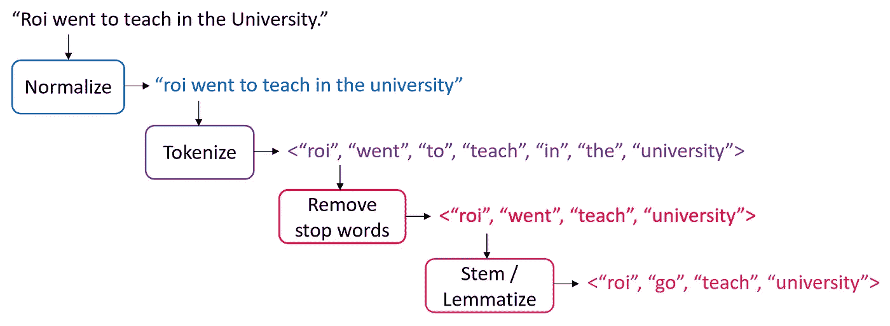

文本预处理示例

清理文本后，我们需要选择如何将其向量化为数值向量。最常见的方法有：

1.  **词袋（BOW）模型**。在这个模型中，每个文档通过词频向量表示（类似于我们在垃圾邮件过滤器示例中使用的）。

1.  [**TF-IDF**](https://en.wikipedia.org/wiki/Tf%E2%80%93idf)（词频与逆文档频率的乘积）通过乘以两个指标来衡量一个词对文档的相关性：

    (a) TF（词频）——单词在文档中出现的次数。

    (b) IDF（逆文档频率）——词在整个语料库中出现的频率的倒数。

    其思想是减少在语料库中频繁出现的词的权重，同时增加稀有词的权重（从而更能指示文档的类别）。

1.  **词嵌入**。在这种方法中，词被映射到实值向量中，以便具有相似意义的词在向量空间中具有接近的表示。这个模型通常用于深度学习，将在未来的帖子中讨论。

Scikit-Learn 提供了以下两种变换器，支持文本预处理和向量化：

1.  [CountVectorizer](https://scikit-learn.org/stable/modules/generated/sklearn.feature_extraction.text.CountVectorizer.html)使用词袋模型。

1.  [TfIdfVectorizer](https://scikit-learn.org/stable/modules/generated/sklearn.feature_extraction.text.TfidfVectorizer.html)使用 TF-IDF 表示。

这些变换器的重要超参数包括：

+   *lowercase* — 是否在标记化之前将所有字符转换为小写（默认为 True）。

+   *token_pattern* — 用于定义什么是令牌的正则表达式（默认正则表达式选择两个或更多字母数字字符的令牌）。

+   *stop_words* — 如果为‘english’，则使用内置的英语停用词列表。如果为 None（默认值），则不会使用停用词。你也可以提供自己定制的停用词列表。

+   *max_features* — 如果不为 None，则构建一个仅包含在训练语料库中具有最高术语频率的前*max_features*个词汇的词汇表。否则，将使用所有特征（这是默认值）。

请注意，这些变换器不提供诸如词干提取或词形还原之类的高级预处理技术。要应用这些技术，你将需要使用其他库，如[NLTK](https://www.nltk.org/)（自然语言工具包）或[spaCy](https://spacy.io/)。

由于朴素贝叶斯模型在 TF-IDF 表示上表现更好，我们将使用 TfidfVectorizer 将训练集中的文档转换为 TF-IDF 向量：

```py
from sklearn.feature_extraction.text import TfidfVectorizer

vectorizer = TfidfVectorizer(stop_words='english')
X_train_vec = vectorizer.fit_transform(X_train)
```

提取的 TF-IDF 向量的形状是：

```py
print(X_train_vec.shape)
```

```py
(11314, 101322)
```

也就是说，语料库的词汇表中有 101,322 个独特的令牌。我们可以通过调用向量化器的*get_feature_names_out*()方法来检查这些令牌：

```py
vocab = vectorizer.get_feature_names_out()
print(vocab[50000:50010]) # pick a subset of the tokens
```

```py
['innacurate' 'innappropriate' 'innards' 'innate' 'innately' 'inneficient'
 'inner' 'innermost' 'innertubes' 'innervation']
```

显然，在 90 年代没有自动拼写检查器 :)

TF-IDF 向量非常稀疏，平均有 67 个非零组件，超过 100,000 个：

```py
print(X_train_vec.nnz / X_train_vec.shape[0])
```

```py
66.802987449178
```

让我们也将测试集中的文档向量化（请注意，在测试集上我们调用*transform*方法而不是*fit_transform*）：

```py
X_test_vec = vectorizer.transform(X_test)
```

## 构建模型

现在，让我们构建一个多项式朴素贝叶斯分类器，并将其拟合到训练集上：

```py
from sklearn.naive_bayes import MultinomialNB

clf = MultinomialNB(alpha=0.01)
clf.fit(X_train_vec, y_train)
```

请注意，我们需要将平滑参数*α*设置为一个非常小的数字，因为 TF-IDF 值被缩放到 0 和 1 之间，因此默认的*α* = 1 会导致值的剧烈变化。

## 评估模型

接下来，让我们在训练集和测试集上评估模型。

模型在训练集上的准确率和 F1 得分为：

```py
from sklearn.metrics import f1_score

accuracy_train = clf.score(X_train_vec, y_train)
y_train_pred = clf.predict(X_train_vec)
f1_train = f1_score(y_train, y_train_pred, average='macro')

print(f'Accuracy (train): {accuracy_train:.4f}')
print(f'F1 score (train): {f1_train:.4f}')
```

```py
Accuracy (train): 0.9595
F1 score (train): 0.9622
```

测试集上的准确率和 F1 得分为：

```py
accuracy_test = clf.score(X_test_vec, y_test)
y_test_pred = clf.predict(X_test_vec)
f1_test = f1_score(y_test, y_test_pred, average='macro')

print(f'Accuracy (test): {accuracy_test:.4f}')
print(f'F1 score (test): {f1_test:.4f}')
```

```py
Accuracy (test): 0.7010
F1 score (test): 0.6844
```

与训练集相比，测试集上的得分相对较低。为了调查错误来源，让我们绘制测试文档的混淆矩阵：

```py
from sklearn.metrics import confusion_matrix, ConfusionMatrixDisplay

cm = confusion_matrix(y_test, y_test_pred)
disp = ConfusionMatrixDisplay(confusion_matrix=cm, display_labels=clf.classes_)
fig, ax = plt.subplots(figsize=(10, 8))
disp.plot(ax=ax, cmap='Blues')
```

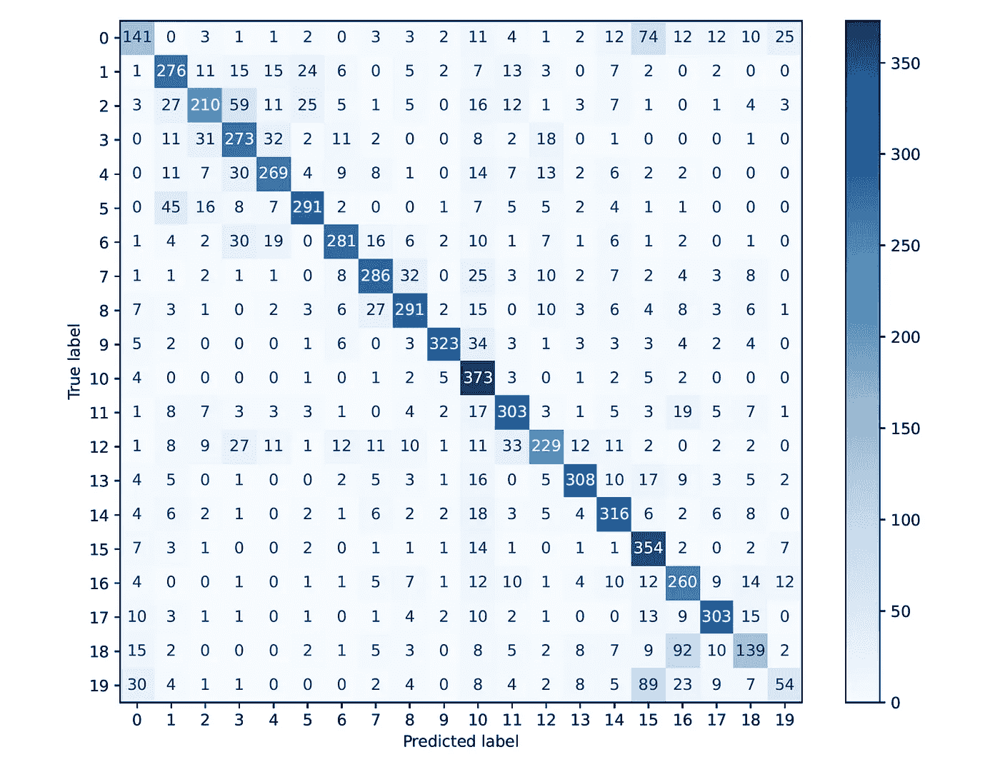

测试集上的混淆矩阵

如我们所见，大多数混淆发生在高度相关的主题之间，例如：

+   主题 0（alt.atheism）和主题 15（soc.religion.christian）之间有 74 个混淆

+   主题 18（talk.politics.misc）和主题 16（talk.politics.guns）之间有 92 个混淆

+   主题 19（talk.religion.misc）和主题 15（soc.religion.christian）之间有 89 个混淆

根据这些发现，朴素贝叶斯分类器表现得相当不错。让我们看看它与其他标准分类算法的比较。

## 基准测试

我们将把朴素贝叶斯模型与另外四个分类器进行基准测试：[逻辑回归](https://medium.com/p/3e502686f0ae)，[KNN](https://medium.com/@roiyeho/k-nearest-neighbors-knn-a-comprehensive-guide-7add717806ad)，[随机森林](https://medium.com/@roiyeho/random-forests-98892261dc49)和[AdaBoost](https://medium.com/@roiyeho/adaboost-illustrated-3084183a2086)。

首先编写一个函数，该函数获取一组分类器，并在给定的数据集上评估它们，同时测量它们的训练时间：

```py
import time

def benchmark(classifiers, names, X_train, y_train, X_test, y_test, verbose=True):
    evaluations = []

    for clf, name in zip(classifiers, names):
        evaluation = {}
        evaluation['classifier'] = name

        start_time = time.time()
        clf.fit(X_train, y_train)
        evaluation['training_time'] = time.time() - start_time

        evaluation['accuracy'] = clf.score(X_test, y_test)
        y_test_pred = clf.predict(X_test)
        evaluation['f1_score'] = f1_score(y_test, y_test_pred, average='macro')

        if verbose:
            print(evaluation)
        evaluations.append(evaluation)
    return evaluations
```

我们现在将使用这五个分类器调用这个函数：

```py
from sklearn.linear_model import LogisticRegression
from sklearn.neighbors import KNeighborsClassifier
from sklearn.ensemble import RandomForestClassifier, AdaBoostClassifier

classifiers = [clf, LogisticRegression(), KNeighborsClassifier(), RandomForestClassifier(), AdaBoostClassifier()]
names = ['Multinomial NB', 'Logistic Regression', 'KNN', 'Random Forest', 'AdaBoost']

evaluations = benchmark(classifiers, names, X_train_vec, y_train, X_test_vec, y_test)
```

我们得到的输出是：

```py
{'classifier': 'Multinomial NB', 'training_time': 0.06482672691345215, 'accuracy': 0.7010090281465746, 'f1_score': 0.6844389919212164}
{'classifier': 'Logistic Regression', 'training_time': 39.38498568534851, 'accuracy': 0.6909187466808284, 'f1_score': 0.6778246092753284}
{'classifier': 'KNN', 'training_time': 0.003989696502685547, 'accuracy': 0.08218268720127456, 'f1_score': 0.07567337211476842}
{'classifier': 'Random Forest', 'training_time': 43.847145318984985, 'accuracy': 0.6233404142326076, 'f1_score': 0.6062667217793061}
{'classifier': 'AdaBoost', 'training_time': 6.09197473526001, 'accuracy': 0.36563993627190655, 'f1_score': 0.40123307742451064}
```

让我们绘制分类器的准确率和 F1 分数：

```py
df = pd.DataFrame(evaluations).set_index('classifier')

df['accuracy'].plot.barh()
plt.xlabel('Accuracy (test)')
plt.ylabel('Classifier')
```

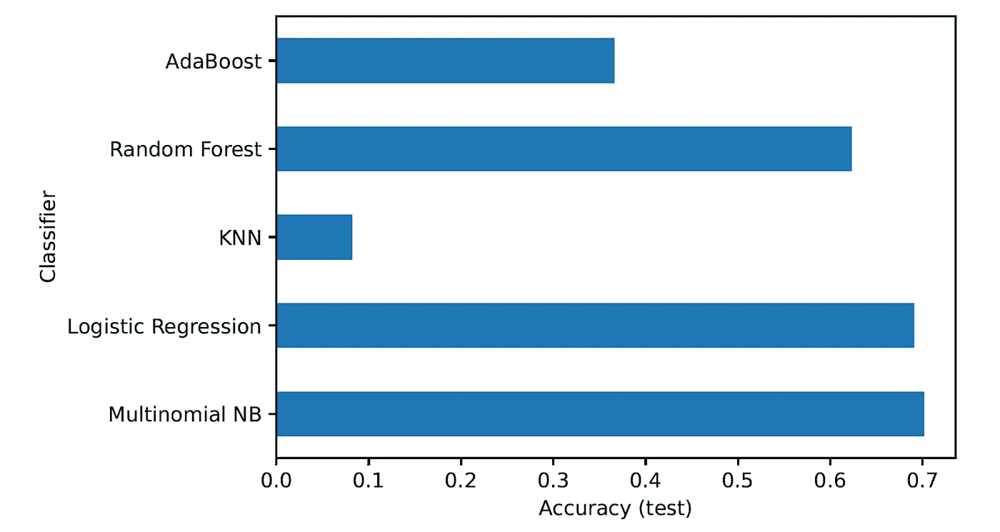

测试集上的准确率

```py
df['f1_score'].plot.barh(color='purple')
plt.xlabel('F1 score (test)')
```

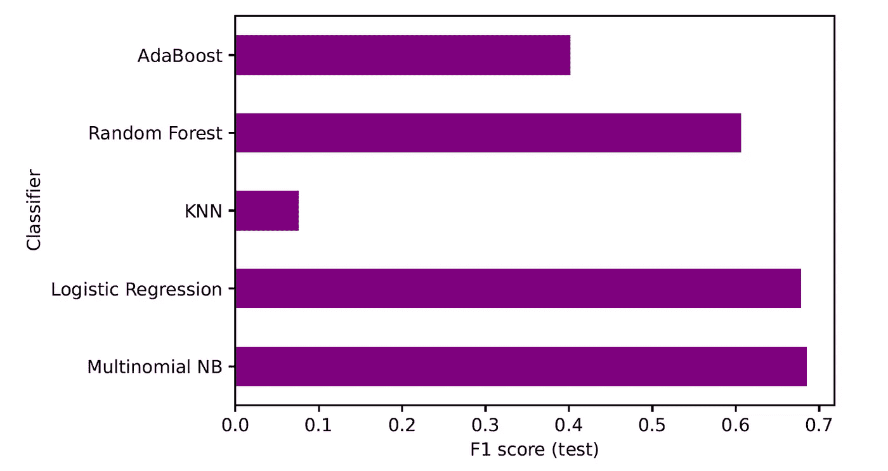

测试集上的 F1 分数

多项式 NB 在准确率和 F1 分数上都表现最佳。注意，分类器使用的是默认参数，未经过任何调整。为了更公平的比较，应在微调其超参数后比较算法。此外，一些算法如 KNN 会遭遇[维度诅咒](https://medium.com/@roiyeho/what-is-the-curse-of-dimensionality-b9b4b81a25c5)，需要进行降维才能使其有效工作。

让我们还绘制分类器的训练时间：

```py
df['training_time'].plot.barh(color='green')
plt.xlabel('Training time (sec)')
plt.ylabel('Classifier')
```

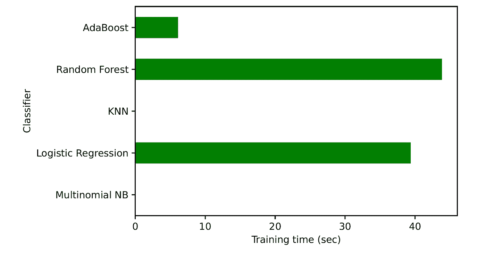

不同分类器的训练时间

多项式 NB 的训练速度如此之快，以至于我们在图中看不到它的时间！通过查看上面的函数输出，我们可以看到其训练时间仅为 0.064 秒。请注意，KNN 的训练速度也非常快（因为实际上没有构建模型），但其预测时间（未显示）非常慢。

总之，多项式 NB 在所有检查的标准中显示出优越性。

## 查找最具信息量的特征

朴素贝叶斯模型还允许我们获取每个类别的最具信息量的特征，即具有最高可能性的特征 *P*(*xⱼ*|*y*)。

MultinomialNB 类有一个名为 *feature_log_prob_* 的属性，它提供了每个类别的特征的对数概率，矩阵形状为 (*n_classes*, *n_features*)。

使用这个属性，编写一个函数来找到每个类别中 10 个最有信息量的特征（词项）：

```py
def show_top_n_features(clf, vectorizer, categories, n=10):
    feature_names = vectorizer.get_feature_names_out()

    for i, category in enumerate(categories):       
        top_n = np.argsort(clf.feature_log_prob_[i])[-n:]
        print(f"{category}: {' '.join(feature_names[top_n])}")
```

```py
show_top_n_features(clf, vectorizer, categories) 
```

我们得到的输出是：

```py
alt.atheism: islam atheists say just religion atheism think don people god
comp.graphics: looking format 3d know program file files thanks image graphics
comp.os.ms-windows.misc: card problem thanks driver drivers use files dos file windows
comp.sys.ibm.pc.hardware: monitor disk thanks pc ide controller bus card scsi drive
comp.sys.mac.hardware: know monitor does quadra simms thanks problem drive apple mac
comp.windows.x: using windows x11r5 use application thanks widget server motif window
misc.forsale: asking email sell price condition new shipping offer 00 sale
rec.autos: don ford new good dealer just engine like cars car
rec.motorcycles: don just helmet riding like motorcycle ride bikes dod bike
rec.sport.baseball: braves players pitching hit runs games game baseball team year
rec.sport.hockey: league year nhl games season players play hockey team game
sci.crypt: people use escrow nsa keys government chip clipper encryption key
sci.electronics: don thanks voltage used know does like circuit power use
sci.med: skepticism cadre dsl banks chastity n3jxp pitt gordon geb msg
sci.space: just lunar earth shuttle like moon launch orbit nasa space
soc.religion.christian: believe faith christian christ bible people christians church jesus god
talk.politics.guns: just law firearms government fbi don weapons people guns gun
talk.politics.mideast: said arabs arab turkish people armenians armenian jews israeli israel
talk.politics.misc: know state clinton president just think tax don government people
talk.religion.misc: think don koresh objective christians bible people christian jesus god
```

大多数词似乎与其对应的类别有很强的相关性。然而，也有一些像“just”和“does”这样的通用词不提供有价值的信息。这表明我们的模型可能通过更好的停用词列表来改进。实际上，Scikit-Learn 建议不要使用其默认列表，并引用其文档：“‘english’存在一些已知问题，你应考虑其他替代方案。” 😲

# 总结

让我们总结一下朴素贝叶斯与其他分类模型的优缺点：

**优点**：

+   训练和预测速度极快

+   提供类别概率估计

+   可用于二分类和多分类问题

+   需要少量的训练数据来估计其参数

+   高度可解释

+   高度可扩展（参数数量与特征数量线性相关）

+   在高维数据上表现良好

+   对噪声具有鲁棒性（噪声样本在估计条件概率时被平均处理）

+   可以处理缺失值（计算特征的似然时忽略缺失值）

+   没有超参数需要调整（除了平滑参数，通常不做更改）

**缺点：**

+   依赖于朴素贝叶斯假设，而该假设在许多实际领域并不成立

+   特征之间的相关性可能会降低模型的性能

+   通常被更复杂的模型超越

+   零频率问题：如果一个分类特征在训练集中未出现过，其类别将被模型赋予零概率。平滑处理可以缓解这一问题，但不能完全解决。

+   无法处理连续属性，除非进行离散化或对其分布做出假设

+   仅能用于分类任务

# 最终说明

这是我在 Medium 上写的最长的一篇文章。希望你阅读时的感受至少与我写作时一样愉快。如果有任何不清楚的地方，请在评论中告知我。

你可以在我的 GitHub 上找到这篇文章的代码示例： [`github.com/roiyeho/medium/tree/main/naive_bayes`](https://github.com/roiyeho/medium/tree/main/naive_bayes)

除非另有说明，否则所有图片均由作者提供。

20 个新闻组数据集的信息：

+   **引用：** Mitchell, Tom (1999). Twenty Newsgroups. UCI 机器学习库。 [`doi.org/10.24432/C5C323.`](https://doi.org/10.24432/C5C323.)

+   **许可证：** Creative Commons CC BY 4.0。
